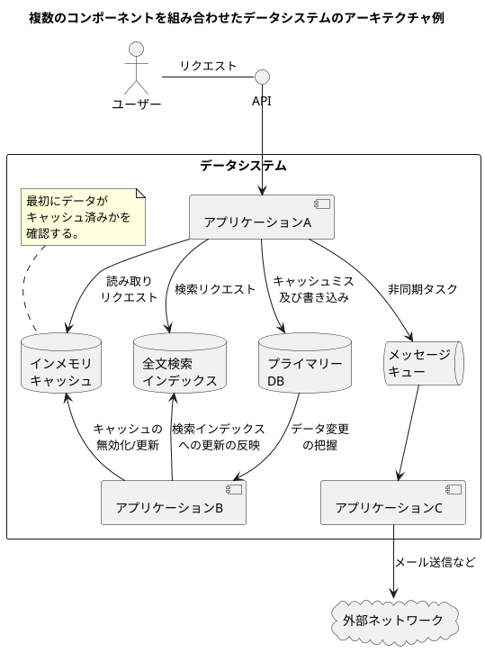
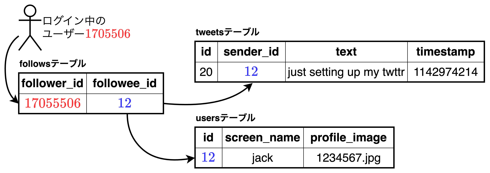
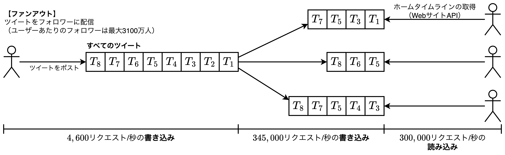

## 信頼性、スケーラビリティ、メンテナンス性に優れたアプリケーション

```plantuml
cloud "データ指向\nアプリケーション\nデザイン" as design
rectangle Reliability [
    **1.2 信頼性**
    --
    ◼ハードウェア及び
    　ソフトウェアの障害
    ◼ヒューマンエラーの耐性
]
rectangle Scalability [
    **1.3 スケーラビリティ**
    --
    ◼負荷とパフォーマンスの計測
    ◼レイテンシーのパーセンタイル
    ◼スループット
]
rectangle Maintainability [
    **1.4 メンテナンス性**
    --
    ◼運用性
    ◼単純性
    ◼進化への対応
]

design -- Reliability
design -- Scalability
design -- Maintainability
```

- 今日の多くのアプリケーションは「**データ指向**」であり、通常は①データ量や②データの複雑さ、そして、③データの変化する速度が大きな問題となる。例えば、多くのアプリケーションでは以下のような機能が必要になる。
  - 【**データベース**】データを保存し、後にそのアプリケーション自身、もしくは他のアプリケーションがそのデータを再度見つけられるようにする。
  - 【**キャッシュ**】処理料の多い操作の結果を覚えておき、読み取りの速度を高める。
  - 【**検索インデックス**】ユーザーがデータをキーワードで検索したり、様々な方法でフィルタリングしたりできるようにする。
  - 【**ストリーム処理**】他のプロセスへメッセージを送り、非同期に処理をしてもらう。
  - 【**バッチ処理**】蓄積された大量のデータ亜を定期的に処理する。
- エンジニアには依然として、目的を達成するために「どのツール」や「アプローチ」が適切なのかを判別する力が必要であり、単一ツールで実現するのか、複数のツールを組み合わせて実現するのか、方法は多岐にわたる。
- 本章では、①信頼性と②スケーラビリティを持ちながら、③メンテナンス性のあるデータシステムの基礎を説明する。レイヤーごとに、データ指向アプリケーションを扱う際の考慮事項を見ていく。

### データシステムに関する考察



<div style="page-break-before:always"></div>

- 現在、DB、キュー、キャッシュなど様々なツールが「データシステム」として一括りにされている。これは、【**理由1**】ツールの分類間の境界線が曖昧になってきていることと、【**理由2**】要求の多様化により、単一ツールでは要求を満たせない状態になっていること、の2つが挙げられる。
- 【**理由1**】について、多彩なユースケースに最適化されてきた背景もあり、旧来の明確な分類ができなくなってきている。例えば、データストアでありながらメッセージキューとしても使えるツール（**Redis**）や、メッセージキューでありながらDBの容易な耐久性を保証しているツール（**Apache Kafka**）などが挙げられる。
- 【**理由2**】について、開発サイクルの高速化やユーザーの要求レベルの高度化に伴い、より多機能・高品質なシステムが求められている。そのため、単一のツールでは要求を満たせない状態になっている。
- 上記のように、データシステムやデータサービスの設計では難しい問題が数多く存在する。
  - 【**問題例1**】内部で問題が発生してもデータが正しく完全であることを保証するにはどうすれば良いのか？
  - 【**問題例2**】システムの一部に性能低下が発生した場合でも、安定して優れたパフォーマンスをクライアントに提供するにはどうすれば良いのか？
  - 【**問題例3**】負荷が増大しても対応できるようにスケールさせるにはどうすれば良いのか？
  - 【**問題例4**】優れたサービスのAPIはどういったものになるのか？
- 本書では、<font color=red>信頼性・スケーラビリティ・メンテナンス性</font>の重要な3つの課題に焦点を当てる。
  - 【**信頼性**】何か問題が生じたとしても正しく動作し続ける性質。システムは障害（ハードウェア・ソフトウェア・ヒューマンエラーなど）があったとしても、望ましいレベルの性能を保ちながら「正しく」動作し続ける度合い。
  - 【**スケーラビリティ**】負荷の増大に対してシステムが対応できる能力。システムの成長（データ量、トラフィック量、複雑さなど）に対して、無理のない方法で対応可能である度合い。
  - 【**メンテナンス性**】システムの利用に関わる多くの関係者（ユーザー、開発者、運用担当者など）がシステムに生産的に関われる度合い。本書では、<u>運用性・単純性・進化性</u>の3つの設計原理に注意を払いながら説明する。

### 信頼性

```plantuml
title フォールトの種類

cloud フォールト as fault
cloud "**1.2.1**\nハードウェアの障害" as hard
cloud "**1.2.2**\nソフトウェアのエラー" as soft
cloud "**1.2.3**\nヒューマンエラー" as human
rectangle "【**対応策**】\nハードウェア\nコンポーネント\nの冗長化" as hard_solution
rectangle "【**対応策**】\nソフトウェアの\n耐障害性" as soft_solution
rectangle "【**対応策**】\n複数アプローチを\n組み合わせて\n信頼性を高める" as human_solution

fault --> hard
fault --> soft
fault --> human
hard <--> hard_solution
soft <--> soft_solution
human <--> human_solution
```

- 何かに信頼性が「ある/ない」について直感的なイメージはあるものの明確な定義はない。具体的な期待事項としては以下の通り。
  - 【**信頼性の例1**】アプリケーションがユーザーの期待通りに機能すること
  - 【**信頼性の例2**】ユーザーが間違いを犯したり、予想外の使い方をしたりしたとしても耐えられること
  - 【**信頼性の例3**】対応が必要なユースケースにおいて予想される負荷とデータ量の下で十分に優れたパフォーマンスを発揮すること
  - 【**信頼性の例4**】認可されていないアクセスや攻撃を回避できること
- 上記の例をまとめて、信頼性をまとめると「問題が生じたとしても正しく動作し続けること」と言える。
- 信頼性で考える「問題を起こしうるもの」は**フォールト（fault）** と呼ばれ、<u>フォールトの存在を見越して対処できるシステムは<font color=red><b>耐障害性を持つ（フォールトトレランス, fault tolerace）</b></font>、もしくは<font color=red><b>レジリエント（resilient）</b></font>であると言われる</u>。
- フォールトトレラントでは、「すべてのフォールトに耐性を持つこと」は**不可能**であるため、「ある種の・ある特定のフォールトに対する耐性を持つこと」が議論すべき内容となる。

<div style="page-break-before:always"></div>

#### ハードウェアの障害

```plantuml
title ハードウェアの障害の要因・要素

cloud ハードウェアの障害 as hard
rectangle "【**障害例1**】\nハードディスク\nのクラッシュ" as elem1
rectangle "【**障害例2**】\nRAMの欠陥" as elem2
rectangle "【**障害例3**】\n電力網の停電" as elem3
rectangle "【**障害例4**】\n人為的なネットワーク\nケーブルの引き抜き" as elem4
rectangle "【**対応策1**】\nRAID構成" as solution1
rectangle "【**対応策2**】\nホットスワップ可能なCPU" as solution2
rectangle "【**対応策3**】\nバッテリーと\nディーゼル電源を\n用いた電源配置" as solution3
rectangle "ハードウェア\nコンポーネント\nの冗長化" as solution

hard --> elem1
hard --> elem2
hard --> elem3
hard --> elem4
elem1 <--> solution1
elem2 <--> solution2
elem3 <--> solution3
solution1 <-- solution
solution2 <-- solution
solution3 <-- solution
```

- システム障害の原因について考えると、すぐに思い浮かぶのはディスクやRAM、電力網などの「**ハードウェアのフォールト**」である。ハードディスクの平均故障時間MTTF（Mean Time To Failure）はおよそ10年〜50年（3,650日〜18,250日）と言われ、<font color=red>10,000台のディスクを持つストレージクラスタでは、平均すれば1日1台のディスクが壊れると考えることができる</font>。
- ハードウェアのフォールトの対応策として「**ハードウェアコンポーネントの冗長化**」が挙げられ、これにより、障害の発生率を下げることができる。

<div style="page-break-before:always"></div>

#### ソフトウェアのエラー

```plantuml
title ソフトウェアエラーの要因・要素

cloud ソフトウェアのエラー as hard
rectangle "【**障害例1**】\nソフトウェアのバグ" as elem1
rectangle "【**障害例2**】\nリソース枯渇\n（プロセスの暴走）" as elem2
rectangle "【**障害例3**】\n依存サービス問題\n（レスポンス異常）" as elem3
rectangle "【**障害例4**】\nカスケード障害\n（連鎖的・段階的）" as elem4
rectangle solution [
    【**軽減策・予防策**】
    システムの動作を保証するちょっとした積み重ね
    --
    ①システムに関する前提
    ②システムに関して注意深く考えること
    ③徹底したテスト
    ④プロセスの分離
    ⑤計測・モニダリング
    ⑥本番環境におけるシステムの挙動分析
]
note right of solution 
システム自身が動作中に
状態をチェックし、
異常があればアラートを出す
機能など。
end note

hard --> elem1
hard --> elem2
hard --> elem3
hard --> elem4
elem1 <--> solution
elem2 <--> solution
elem3 <--> solution
elem4 <--> solution
```

- ハードウェアの障害はランダム性があり、それぞれ独立して発生するものと考えられる。複数の障害に弱い相関性はあるものの（例えば、サーバーラックの温度や供給電気など）、通常障害はそれぞれ独立したものである。
- 一方、システマティックなエラーはフォールトの予測が難しく、ノード間での相関性を持っていることから、<font color=red>ソフトウェアエラーは多くのシステム障害につながりやすい傾向がある</font>。フォールト例としては以下の通り。
  - 【**障害例1**】問題のある特定の入力が与えられるとすべてのアプリケーションサーバのインスタンスがクラッシュしてしまうようなもの。Linuxカーネルでの閏秒のバグなど。
  - 【**障害例2**】CPU、メモリ、ディスク領域、ネットワーク帯域などの共有リソースを使い切ってしまう。
  - 【**障害例3**】システムが依存しているにも関わらずサービスがスローダウンしてレスポンスを返さなくなったり、壊れたレスポンスを返したりし始めてしまうような場合。
  - 【**障害例4**】あるコンポーネントの小さなフォールトが他コンポーネントのフォールトを引き起こし、そしてそのフォールトがさらなるフォールトを引き起こしていくような連鎖的障害。
- <font color=red>ソフトウェアにおけるフォールトの問題は、<b>手っ取り早い解決策はない</b></font>。①システムに関する前提、②システムに関して注意深く考えること、③徹底したテスト、④プロセスの分離、⑤計測・モニダリング、⑥本番環境におけるシステムの挙動分析、など「ちょっとした積み重ね」によりシステムが何かを保証することを期待する。

<div style="page-break-before:always"></div>

#### ヒューマンエラー

```plantuml
title ソフトウェアエラーの要因・要素

cloud ヒューマンエラー as human
rectangle "【**対応例1**】\nエラーを最小化\nする設計" as elem1
rectangle "【**対応例2**】\nサンドボックス\nの提供" as elem2
rectangle "【**対応例3**】\n徹底した\nテスト" as elem3
rectangle "【**対応例4**】\nヒューマンエラー\n発生時のリカバリー\n方法の構築" as elem4
rectangle "【**対応例5**】\n<color red>テレメトリ\nの実装" as elem5
note right of human
複数のアプローチと
組み合わせて
信頼性を高める。
end note

elem1 <-> human
human <--> elem2
human <--> elem3
human <--> elem4
human <--> elem5
```

- <font color=red>ソフトウェアシステムの設計・実装・利用・運用はすべて人間</font>であり、最大限努力しても「**人間には信頼性がない**」ことが知られている。実際、サービス障害の原因として最も多いのは「オペレーターによる設定エラー」であり、ハードウェア（サーバーやネットワーク）のフォールトは$10\%〜25\%$に過ぎないことがわかっている。
- <u>優れたシステムは複数のアプローチを組み合わせ、信頼性を高めている</u>。
  - 【**信頼性を高める例1**】エラーの可能性が最小限になるようにシステムを設計する。例えば、うまく設計された抽象化、API、管理I/Fは「正しいこと」を行いやすく、「間違ったこと」を行いにくくする。ただし、あまりにI/Fの制約が強くなると、人々はそれを回避するようになるため、この方策のメリットが損なわれてしまい、バランスを適切に取るのが難しい。
  - 【**信頼性を高める例2**】人々が最も間違いを犯しやすい部分を障害に繋がりやすいところから分離する。完全な機能を持った**サンドボックス環境**を用意し、実際のユーザーに影響することなく本物のデータを使って実体験を積めるようにすると良い。
  - 【**信頼性を高める例3**】ユニットテスト、結合テスト、マニュアルテストに至るまで、すべてのレベルで徹底的なテストを行う。自動化テストは広く利用され、十分に理解されており、特に通常の操作では滅多に生じないようなコーナーケースをカバーする上で有益である。
  - 【**信頼性を高める例4**】ヒューマンエラーから迅速かつ容易にリカバリできるようにして、障害が発生した場合のインパクトを最小化できるようにしておく。例えば、①設定変更のロールバックを即座にできるようにすることや、②新しいコードのロールアウトは徐々に行なっていくこと（こうすることで予想外のバグが発生しても影響されるユーザーを一部に留めることができる）、③データを計算し直すツールを提供すること（それまでの計算が正しくないことが判明した場合に備える）、などが挙げられる。
  - 【**信頼性を高める例5**】パフォーマンスメトリクスやエラー発生率など、詳細で明確なモニタリングの仕組みをセットアップする（<font color=red><b>テレメトリの仕組み</b></font>）。モニタリングを行えば、警告シグナルを早期に受信でき、なんらかの前提や制約に反していないかをチェックできる。問題が生じた場合、その診断にはメトリクスが欠かせない。

#### 信頼性の重要度

- <font color=red>信頼性には「開発コスト」も「運用コスト」も生じることを強く意識する</font>必要があり、すべてのアプリケーションに関連する事柄である。原子力発電所や航空管制だけでなく、ビジネスアプリやeコマース、写真アプリなど全てに信頼性は伴う。
- データ破損時のリカバリ方法、ヒューマンエラーによるエラーハンドリング、そのほか<font color=red>異常事態に備えることで収入の損失や評判へのダメージを軽減・解消できる</font>。

### スケーラビリティ（拡張性）

- システムが信頼性を保ちながら動作しているとしても、将来もそのまま信頼性を担保できるとは限らない。<u>信頼性の劣化の原因として一般的なものの一つは「**負荷の増大**」である</u>。システムの同時ユーザー数が$10,000〜100,000$に成長したり、$1,000,000〜10,000,000$に成長した場合、以前の処理データ量とは比較にならないはずである。
- **スケーラビリティ**とは「負荷の増大に対してシステムが対応できる能力」のことを意味し、1次元的なラベルにはならない。つまり、<font color=red>スケーラビリティについて議論するときは「どのようにコンピューティングリソースを追加すれば負荷（CPU、メモリ、ディスク領域、ネットワーク帯域など）の増大に対応できるのだろうか？」という考慮が必要にある</font>。

#### 負荷の表現

- スケーラビリティについて話すとき、まずは、**①現在のシステムの負荷状況を簡潔に表現できるようにならなければならない**。次に、**②負荷の増加量に伴い発生する事象の分類と対応策**に関する議論ができるようになる。
- 負荷は「**負荷のパラメータ**」と呼ばれる数値によって表現でき、具体的な指標はシステムアーキテクチャによって異なる。
  - 【**Webサーバー**】毎秒のリクエスト
  - 【**DB**】読み書きの比率（ディスクI/O）
  - 【**チャットルーム**】同時アクティブユーザー数
  - 【**キャッシュ**】ヒット率
- 例えば、Twitterの場合、以下の2つの処理がある。
  - 【**ツイートのポスト**】平均$4,600$リクエスト/秒、ピーク時$12,000$リクエスト/秒以上
  - 【**ホームのタイムライン**】$300,000$リクエスト/秒
- 毎秒$12,000$回の書き込み（ピーク時のツイートポスト）を単純に処理するのは極めて容易だが、<font color=red>Twitterにおけるスケーリングの課題</font>はツイートの量ではなく、**ファンアウト数**（リクエストを処理するのに必要となる他サービスへのリクエスト数）にある。具体的には、ユーザー間の「フォローしたり/されたり」の関係を考慮したツイートのポストを実装する方法である。処理方法としては大きく2つある。

##### 【処理方法1】単純にポストされたツイートを新しいツイートとしてグローバルなコレクションに挿入する。

- あるユーザーが自分のホームタイムラインをリクエストしてきたら、そのユーザーがフォローしているすべてのユーザーを調べ、それらのユーザーのツイートを時間で降順に取得する。下図のようなRDBであれば下記クエリが書ける。



```sql
-- 【処理方法1】のクエリ
SELECT tweets.*, users.* 
  FROM tweets
  JOIN users    ON   tweets.sender_id = users.id
  JOIN follows  ON follows.fllowee_id = users.id
WHERE follows.follower_id = current_users
```

##### 【処理方法2】各ユーザーのホームタイムラインようにキャッシュを管理する。

- これは受け手となる各ユーザーがツイートのメールボックスを持つようなものである。ユーザーがツイートをポストしたら、そのユーザーのフォロワーのホームタイムラインのキャッシュにツイートされたポストを挿入する。この場合、ホームタイムラインの読み取りリクエストの結果は前もって生成されていることになるため、このリクエストの負荷は低くなる。



##### 【処理方法1】と【処理方法2】の比較

- 上記の2つの処理方法を踏まえ、結果として【**処理方法2**】を採用した。【**処理方法2**】のメリットとデメリットは以下の通り。
  - 【**メリット**】処理方法1と平均すればホームタイムラインの読み込み回数に比べてほぼ2桁低かった。
  - 【**デメリット**】キャッシュ機能に伴いツイートポスト時の処理が処理方法1より多くなる。極端にフォロワーが多いユーザー（非常に少数のユーザー）の場合は処理が極端に遅延する。
- 以上より、<font color=red>【<b>処理方法2</b>】の場合の負荷のパラメータは「ユーザーごとのフォロワーの分布」が1つ挙げられる</font>。上記のデメリットを解決する方法（**ハイブリッドなアプローチ**）として、極端にフォロワー数が多いユーザーのツイートのポストは個別に（例外的に）処理を行う。

<div style="page-break-before:always"></div>

#### パフォーマンスの表現

- 

#### 負荷への対処のアプローチ

- 

### メンテナンス性

- 

#### 【運用性】運用担当者への配慮

- 

#### 【単純さ】複雑さの管理

- 

#### 【進化性】変更への配慮

- 

### まとめ