# ハンズオンはじめの一歩編

- https://pages.awscloud.com/JAPAN-event-OE-Hands-on-for-Beginners-1st-Step-2022-confirmation_849.html

```plantuml
@startuml Two Modes - Technical View

!define AWSPuml https://raw.githubusercontent.com/awslabs/aws-icons-for-plantuml/v20.0/dist
' !include AWSPuml/AWSCommon.puml

' Uncomment the following line to create simplified view
!include AWSPuml/AWSSimplified.puml
!include AWSPuml/General/Users.puml
!include AWSPuml/General/User.puml
!include AWSPuml/Compute/EC2.puml
!includeurl AWSPuml/Storage/SimpleStorageService.puml
!include AWSPuml/SecurityIdentityCompliance/IdentityAccessManagementRole.puml
!include AWSPuml/SecurityIdentityCompliance/IdentityAccessManagementPermissions.puml

left to right direction

User(user1, "IAMユーザ", "user")
rectangle "IAMグループ" as group {
    Users(user2, "", "user")
}
IdentityAccessManagementRole(role, "IAMロール", "IAMRole")
IdentityAccessManagementPermissions(permission1, "IAMポリシー", "IAMRole")
IdentityAccessManagementPermissions(permission2, "IAMポリシー", "IAMRole")
IdentityAccessManagementPermissions(permission3, "IAMポリシー", "IAMRole")
EC2(ec2, "EC2", "ec2")
SimpleStorageService(s3, "S3", "s3")
note top of permission1
{ # **Administratorポリシー**
    "Effect": "Allow",
    "Action": "*",
    "Resource": "*"
}
end note
note top of permission3
{ # **EC2ReadOnlyポリシー**
    "Effect": "Allow",
    "Action": "ec2:Describe*",
    "Resource": "*"
}
end note

permission1 -- user1
permission2 -- group
permission3 -- role
role -- ec2
ec2 -- s3
user1 --- s3
group --- s3
@enduml
```

## ルートユーザとIAMユーザについて

<table>
  <thead>
    <tr>
      <th>項目</th>
      <th>ルートユーザ</th>
      <th>IAMユーザ</th>
    </tr>
  </thead>
  <tbody>
    <tr>
      <td>ログイン方法</td>
      <td>メールアドレス + パスワード</td>
      <td>アカウントID + IAMユーザ名 + パスワード</td>
    </tr>
    <tr>
      <td>アクセス権限</td>
      <td>全AWSサービスとリソースに対して<br><strong>完全なアクセス権限</strong></td>
      <td>紐づいている<strong>IAMポリシー権限で<br>認められた操作のみ</strong>可能</td>
    </tr>
    <tr>
      <td>利用用途</td>
      <td>日常的なタスクには<u><strong>使わない</strong></u></td>
      <td>利用者ごとにIAMユーザを作成し、<br>IAMユーザで作業を実施</td>
    </tr>
  </tbody>
</table>

- <font color=red>ルートユーザは<b>権限が強すぎる</b>ため、IAMユーザの作業が推奨されている。IAMユーザの利活用により適切な権限で作業を進めることができる</font>。
- 本ハンズオンで利用するサービス
  - 【**EC2**】「従量課金型」の仮想サーバサービス。必要な時に必要な分のリソースを起動可能。
  - 【**S3(Simple Storage Service)**】$99.999999999\%$の耐久性を持つオブジェクトストレージサービス。容量無制限で安価なストレージであり、色々なAWSサービスと連携可能。

### IAMの権限付与による画面表示

- **testuser-admin** 管理者権限を持つIAMユーザ
- **testuser-s3-readonly** S3の読み取り権限のみを持つIAMユーザ
- **testuser-nothing** 何も権限を持たないIAMユーザ

##### S3読み込み設定のみの画面(testuser-s3-readonly)

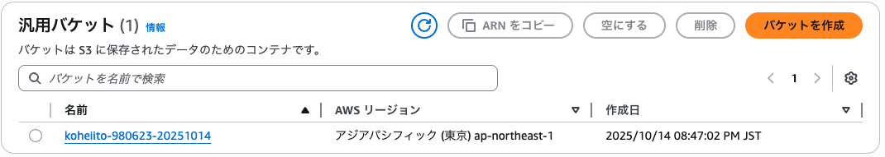
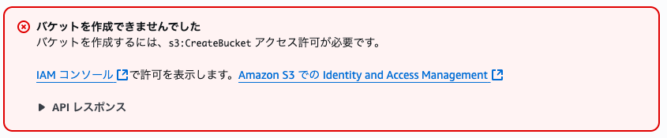

##### 権限なしの画面(testuser-nothing)

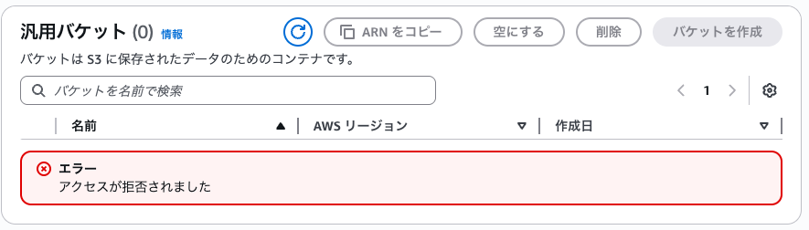

## IAMポリシー・グループ・ロール

```plantuml
title IAMポリシー・グループ・ロール
left to right direction

!define AWSPuml https://raw.githubusercontent.com/awslabs/aws-icons-for-plantuml/v20.0/dist
' !include AWSPuml/AWSCommon.puml

' Uncomment the following line to create simplified view
!include AWSPuml/AWSSimplified.puml
!include AWSPuml/SecurityIdentityCompliance/IdentityAccessManagementRole.puml
!include AWSPuml/SecurityIdentityCompliance/IdentityAccessManagementPermissions.puml
!include AWSPuml/General/User.puml
!include AWSPuml/Compute/EC2.puml
!includeurl AWSPuml/Storage/SimpleStorageService.puml

IdentityAccessManagementRole(role, "IAMロール", "IAMRole")
IdentityAccessManagementPermissions(permission1, "IAMポリシー", "IAMRole")
IdentityAccessManagementPermissions(permission2, "IAMポリシー", "IAMRole")
rectangle IAMグループ as group {
    User(userA, "Aさん", "user")
    User(userB, "Bさん", "user")
    userA -[hidden]- userB
}
EC2(ec2, "EC2", "ec2")
SimpleStorageService(s3, "S3", "s3")

permission1 -- role
role -- ec2
ec2 -- s3
permission2 -- group 
note top of ec2
<color blue>○バケット一覧を表示
<color red>×新しいバケットの作成
end note
```

- **IAMポリシー**
  - <font color=red>アクセス許可の定義を行うJSONドキュメント</font>
  - IAMユーザ、グループ、ロールに紐づける
  - AWSで予め準備しているポリシーに加え、<u>独自のポリシーも定義可能</u>。IAMポリシージェネレーターが有用。
- **IAMグループ**
  - <font color=red>IAMユーザの集合を定義</font>
  - 複数のユーザへのアクセス許可を容易に指定できる。
- **IAMロール**
  - IAMポリシーがアタッチされたヘルメットのようなものであり、<font color=red>AWSリソースに割り当て、そのリソースに権限(ロール)を与える</font>。

### 【ハンズオン】インフラ担当とアプリ担当でIAMポリシーを設定する

- 【参考URL】https://awspolicygen.s3.amazonaws.com/policygen.html

```plantuml
title IAMユーザ
left to right direction

!define AWSPuml https://raw.githubusercontent.com/awslabs/aws-icons-for-plantuml/v20.0/dist
' !include AWSPuml/AWSCommon.puml

' Uncomment the following line to create simplified view
!include AWSPuml/AWSSimplified.puml
!include AWSPuml/SecurityIdentityCompliance/IdentityAccessManagementPermissions.puml
!include AWSPuml/General/User.puml
!includeurl AWSPuml/Compute/EC2.puml

IdentityAccessManagementPermissions(permission1, "Administrator\nポリシー", "admin_policy")
IdentityAccessManagementPermissions(permission2, "開発者用独自\nポリシー", "dev_policy")
User(user_infra, "インフラ担当", "infra")
User(user_app, "アプリ担当", "app")
rectangle "EC2" as ec2s{
    EC2(ec2A, "EC2", "ec2")
    EC2(ec2B, "EC2", "ec2")
}

note top of permission2
{
    "Version": "2012-10-17",
    "Statement": [
        {
            "Sid": "Stmt〇〇"
            "Action": [
                "ec2:Describe*",
                "ec2:StartInstances",
                "ec2:StopInstances"
            ],
            "Effect": "Allow",
            "Resource": "*"
        }
    ]
}
end note

permission1 -- user_infra
permission2 -- user_app
user_infra --> ec2A: <color blue>○インスタンス一覧表示
user_infra --> ec2A: <color blue>○インスタンス作成
user_app --> ec2B: <color blue>○インスタンス一覧表示
user_app --> ec2B: <color blue>○インスタンス起動/停止
user_app --> ec2B: <color red>❌インスタンス作成
```

## 本ハンズオンの後始末

- 削除の順番は以下の通り。
  1. EC2の削除（インスタンスの終了）
  2. S3の削除
  3. Administrator以外のIAMユーザの削除
  4. IAMロール・ポリシーの削除

## マルチアカウント戦略

```plantuml
@startuml
title マルチアカウント戦略

!define AWSPuml https://raw.githubusercontent.com/awslabs/aws-icons-for-plantuml/v20.0/dist

!include AWSPuml/AWSCommon.puml
!include AWSPuml/Groups/AWSCloud.puml
!include AWSPuml/AWSSimplified.puml
!include AWSPuml/General/Users.puml
!include AWSPuml/General/User.puml
!include AWSPuml/Compute/EC2.puml
!includeurl AWSPuml/Storage/SimpleStorageService.puml
!include AWSPuml/SecurityIdentityCompliance/IdentityAccessManagementRole.puml
!include AWSPuml/SecurityIdentityCompliance/IdentityAccessManagementPermissions.puml
!includeurl AWSPuml/ManagementGovernance/Organizations.puml

AWSCloudGroup(cloudA, "【**アカウントA**】\n本番用・部門A・製品1") {
    User(developerA, "開発者", "dev")
    User(adminA, "管理者", "admin")
    EC2(ec2A, "EC2", "ec2")
    SimpleStorageService(s3A, "S3", "s3")
}
AWSCloudGroup(cloudB, "【**アカウントB**】\n検証用・部門B・製品2") {
    User(developerB, "開発者", "dev")
    User(adminB, "管理者", "admin")
    EC2(ec2B, "EC2", "ec2")
    SimpleStorageService(s3B, "S3", "s3")
}
Organizations(org, "マルチアカウント管理", "org")
note left of org
・一括請求機能
・AWSアカウントのグループ化
・IAMの統合
end note

org -- cloudA
org -- cloudB
@enduml
```

<div style="page-break-before:always"></div>

### マルチアカウント戦略とは

- <font color=red>特定の基準によって、<b>AWSアカウント自体を分ける戦略</b>のこと。</font>
  - 本番用と開発用で分ける
  - 営業部と開発部で分ける
  - 製品ごとに分ける
  - 社内向けと社外向けに分ける
- **マルチアカウントのメリット**
  - 【**環境**】開発、テスト、本番などの環境をセキュリティやガバナンス帰省のために分離できる(PCIなど)。<u>本番用と検証用の環境が同じ場合、オペレーションミスが発生しやすい</u>。
  - 【**請求**】部門単位や製品単位、システム単位などでAWSのコストが明確に分離できる。<u>同じアカウント内でもコスト配分タグで分けることが可能であるが、配分設定のコストがかかる</u>。
  - 【**ビジネス推進**】事前定義されたガバナンスフレームワークの中で特定のビジネス部門に対する権限の委譲が行える。<u>もし全社共通のアカウントを使用する場合、セキュリティやコンプライアンスの管理基準がある中で個別案件に新たに特定の権限を付与する手間などが発生しやすい</u>。マルチアカウントを利用することで、各アカウントに対して特定のオペレーションを禁止する設定を行い、全社共通の禁止事項を作り、ポリシーを運用することも可能。
  - 【**ワークロード**】社内向け、社外向けのサービスやリスク、データ分類、顧客の違いなどに応じてワークロードを分離できる。<u>もし同じアカウント内で社内向けサービスと社外向けサービスを利用する場合、不正アクセスや予期せぬデータ操作が発生する可能性がある</u>。
- **マルチアカウントのデメリット**
  - 【**アカウント管理の複雑化**】IAMユーザやIAMロールなどのIAM管理作業が重複することになる。また、利用請求もアカウント単位で発生するため、アカウントの数だけ請求を管理する必要がある。
- 上記のアカウント管理の複雑化を解決する方法として`AWS Organizations`がある。`AWS Organizations`はアカウント管理サービスであり、複数のAWSアカウントを1つの組織に統合し、一括請求(コンソリデーティッドビリング)および、アカウント管理ができるサービス。機能としては以下の通り。
  - メンバーアカウントの「**階層的な**」グループ化
  - `AWS IAM`の統合とサポート
  - AWSの各種サービスとの統合
  - 結果整合性があるデータレプリケーション

### 【複数環境のサインイン管理】IAM Identity Center

```plantuml
@startuml
title 複数環境のサインイン管理(IAM Identity Center)
left to right direction

!define AWSPuml https://raw.githubusercontent.com/awslabs/aws-icons-for-plantuml/v20.0/dist

!include AWSPuml/AWSCommon.puml
!include AWSPuml/Groups/AWSCloud.puml
!include AWSPuml/AWSSimplified.puml
!include AWSPuml/General/User.puml
!include AWSPuml/SecurityIdentityCompliance/IdentityAccessManagementPermissions.puml
!include AWSPuml/ManagementGovernance/Organizations.puml
!include AWSPuml/SecurityIdentityCompliance/IAMIdentityCenter.puml
!includeurl AWSPuml/SecurityIdentityCompliance/KeyManagementService.puml

AWSCloudGroup(cloudA, "【**アカウントA**】\nテスト環境")
AWSCloudGroup(cloudB, "【**アカウントB**】\nステージング環境")
AWSCloudGroup(cloudC, "【**アカウントC**】\n本番環境")
IAMIdentityCenter(sso, "複数サインイン管理", "sso")
IdentityAccessManagementPermissions(permission1, "テスト環境用\n許可セット", "test")
IdentityAccessManagementPermissions(permission2, "ステージング環境用\n許可セット", "staging")
IdentityAccessManagementPermissions(permission3, "本番環境用\n許可セット", "prod")
KeyManagementService(key, "ID・パスワード", "key")
User(user, "担当者\n(SSOユーザ)", "user")

user - key
key - sso
sso -- permission1
sso -- permission2
sso -- permission3
permission1 -- cloudA
permission2 -- cloudB
permission3 -- cloudC
@enduml
```

- `AWS Organizations`に加えて、`AWS IAM Identity Center`も覚える必要がある。
- `IAM Identity Center`は複数のAWSアカウントに対するSSOを実現する仕組みである。
  - 【**特徴1**】単一のIDで複数のAWS環境にログイン可能
  - 【**特徴2**】IDと権限の管理が容易

<div style="page-break-before:always"></div>

## まとめ

- ルートユーザとIAMユーザは異なる。ルートユーザは権限が強すぎるため、基本的にはIAMユーザを利用する。
- 登場したAWSサービス
  1. IAMポリシー
  2. IAMロール
  3. IAMグループ
  4. Organizations
  5. IAM Identity Center
  6. EC2
  7. S3

<div style="page-break-before:always"></div>

# セキュリティ対策ハンズオン

```plantuml
@startuml
title 登場するサービス
left to right direction

!define AWSPuml https://raw.githubusercontent.com/awslabs/aws-icons-for-plantuml/v20.0/dist

!include AWSPuml/AWSSimplified.puml

!includeurl AWSPuml/SecurityIdentityCompliance/IdentityandAccessManagement.puml
!includeurl AWSPuml/ManagementGovernance/CloudTrail.puml
!includeurl AWSPuml/ManagementGovernance/Config.puml
!includeurl AWSPuml/ManagementGovernance/TrustedAdvisor.puml
!includeurl AWSPuml/SecurityIdentityCompliance/GuardDuty.puml
!includeurl AWSPuml/CloudFinancialManagement/Budgets.puml
!includeurl AWSPuml/CloudFinancialManagement/CostExplorer.puml
!includeurl AWSPuml/CloudFinancialManagement/CostandUsageReport.puml

IdentityandAccessManagement(iam, "【IDアクセス権管理】\nAWS Identity & Access Management", "iam")
CloudTrail(ct, "【発見的統制】\nAWS CloudTrail", "cloudtrail")
Config(config, "【発見的統制】\nAWS Config", "config")
GuardDuty(gd, "【発見的統制】\nAWS GuardDuty", "gd")
TrustedAdvisor(ta, "【IDアクセス権管理】\nAWS Trusted Advisor", "ta")
Budgets(budgets, "【請求】\nAWS Budgets", "budgets")
CostExplorer(ce, "【請求】\nAWS Cost Explorer", "ce")
CostandUsageReport(ur, "【請求】\nAWS Cost & Usage Reports", "ur")

iam -[hidden]- ta
ct -[hidden]- budgets
config -[hidden]- ce
gd -[hidden]- ur
@enduml
```

- https://pages.awscloud.com/JAPAN-event-OE-Hands-on-for-Beginners-Security-1-2022-confirmation_556.html
- 【**本コースの内容**】AWSアカウント作成後、サービス利用の前に必要なセキュリティ対策を学ぶ。具体的には、①なぜ必要なのか、②実際にどういった対応が必要なのか、③何を設定するのか、について学ぶ

## AWSのセキュリティについて

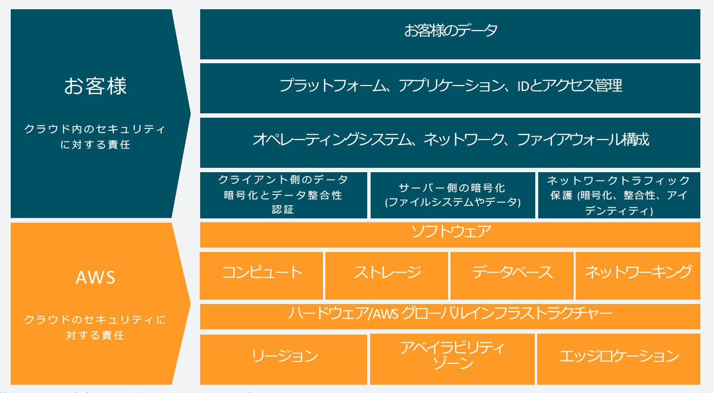

- AWSはクラウドセキュリティを「最優先事項」としており、「<b>責任共有モデル</b>」と呼んでいる。責任共有モデルではユーザの責任とAWSの責任を分けている。
  - 【**AWSの責任**】ユーザの運用コストを軽減するために、ホストOSと仮想化レイヤーからサービスが運用されている施設の物理的なセキュリティに至るまでの要素を運用、管理、制御する。
  - 【**ユーザの責任**】組織の考え方に基づいて選択肢を持つことを可能にするために、ゲストOS・アプリ・その他セキュリティグループの設定などの管理を行い、デプロイを統制する。
- 【**AWSコンプライアンス**】https://aws.amazon.com/jp/compliance/
  - 【例: データセンター】https://aws.amazon.com/jp/compliance/data-center/

## IDアクセス権管理

- 不必要な権限を付与していると情報の流出や破壊、不正閲覧や改ざん、不正使用、サービス自体の中断などが起こる場合がある。特権アカウントは厳重に管理し、<font color=red>利用者へ与える権限は必要最小限</font>に絞り、アカウントへの不正アクセス対策を実施することが必要
- 上記の課題を解決するために<font color=red>認証・認可の仕組みを提供する`AWS IAM`がある</font>。
  - 各AWSリソースに対して別々のアクセス権限をユーザごとに付与できる。
  - 多要素認証(MFA)によるセキュリティの強化
  - <font color=red>`AWS IAM`自体の利用は無料</font>
- ルートユーザのみができるタスク例
  - ルートユーザのメールアドレスやパスワードの変更
  - IAMユーザーへのアクセス許可のリストア
  - 無効な制約を設定した`Amazon S3`バケットポリシーの修正
  - 逆引きDNS申請
  - <font color=red>AWSアカウントの解約</font>

<div style="page-break-before:always"></div>

# スケーラブルウェブサイト構築編

```plantuml
title スケーラブルウェブサイト(完成版)

!define AWSPuml https://raw.githubusercontent.com/awslabs/aws-icons-for-plantuml/v20.0/dist

!include AWSPuml/AWSCommon.puml
!include AWSPuml/AWSSimplified.puml
!include AWSPuml/General/User.puml
!include AWSPuml/General/Internet.puml
!include AWSPuml/Groups/VPC.puml
!include AWSPuml/Groups/AvailabilityZone.puml
!include AWSPuml/Groups/PublicSubnet.puml
!include AWSPuml/Groups/PrivateSubnet.puml
!include AWSPuml/Compute/EC2.puml
!include AWSPuml/Compute/EC2AMI.puml
!include AWSPuml/Database/RDS.puml
!include AWSPuml/NetworkingContentDelivery/ElasticLoadBalancing.puml
!include AWSPuml/NetworkingContentDelivery/VPCInternetGateway.puml

User(user, "ユーザ", "user")
Internet(internet, "インターネット", "internet")
VPCGroup(vpc, "VPC: 10.0.0.0/16") {
  EC2AMI(ami, "AMI", "ami")
  VPCInternetGateway(gw, "インターネットGW", "gw")
  VPCGroup(sg_elb, "\nLB用SG") #aff
  ElasticLoadBalancing(elb, "LB", "elb")
  AvailabilityZoneGroup(az_1a, "AZ 1a") {
    PublicSubnetGroup(az_1_public, "10.0.0.0/24") {
      VPCGroup(sg_ec2, "\nEC2用SG") #aff
      EC2(ec2_p, "EC2 Primary", "")
    }
    PrivateSubnetGroup(az_1_private, "10.0.2.0/16") {
      VPCGroup(sg_rds, "\nRDS用SG") #aff
      RDS(rds_p, "RDS Primary", "")
    }
  }
  AvailabilityZoneGroup(az_1c, "AZ 1c") {
    PublicSubnetGroup(az_2_public, "10.0.1.0/24") {
      EC2(ec2_s, "EC2 Secondary", "")
    }
    PrivateSubnetGroup(az_2_private, "10.0.3.0/16") {
      RDS(rds_s, "RDS Secondary", "")
    }
  }
}

elb - sg_elb
sg_ec2 - ec2_p
sg_rds - rds_p
user - internet
internet -- gw
gw - elb
elb --> ec2_p
ec2_p --> rds_p
ec2_s -[hidden] ec2_p
elb --> ec2_s
ec2_s -[hidden]- rds_s
ec2_s ..> rds_p
rds_p .> rds_s
```

- https://pages.awscloud.com/JAPAN-event-OE-Hands-on-for-Beginners-Scalable-2022-confirmation_386.html

## 【フェーズ1】

```plantuml
title "【フェーズ1】"

!define AWSPuml https://raw.githubusercontent.com/awslabs/aws-icons-for-plantuml/v20.0/dist

!include AWSPuml/AWSCommon.puml
!include AWSPuml/AWSSimplified.puml
!include AWSPuml/Groups/VPC.puml
!include AWSPuml/Groups/AvailabilityZone.puml
!include AWSPuml/Groups/PublicSubnet.puml
!include AWSPuml/Groups/PrivateSubnet.puml
!includeurl AWSPuml/NetworkingContentDelivery/VPCInternetGateway.puml

VPCGroup(vpc, "VPC: 10.0.0.0/16") {
  VPCInternetGateway(gw, "インターネット\nゲートウェイ", "gw")
  AvailabilityZoneGroup(az_1a, "AZ 1a") {
    PublicSubnetGroup(az_1_public, "10.0.0.0/24") {
    }
    PrivateSubnetGroup(az_1_private, "10.0.2.0/16") {
    }
  }
  AvailabilityZoneGroup(az_1c, "AZ 1c") {
    PublicSubnetGroup(az_2_public, "10.0.1.0/24") {
    }
    PrivateSubnetGroup(az_2_private, "10.0.3.0/16") {
    }
  }
}
az_1_public -[hidden]- az_1_private
az_2_public -[hidden]- az_2_private
```

<table>
  <tbody>
      <tr>
        <th>VPC</th>
        <th>AZ</th>
      </tr>
      <tr>
        <td>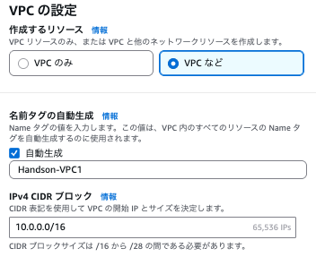</td>
        <td>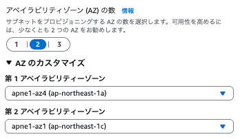</td>
      </tr>
  </tbody>
</table>

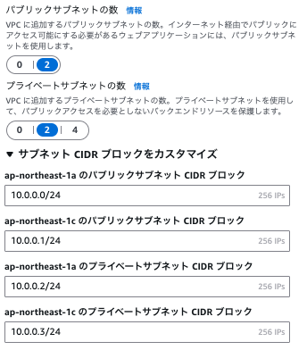

<div style="page-break-before:always"></div>

## 【フェーズ2〜5】

```plantuml
title "【フェーズ2〜5】"

!define AWSPuml https://raw.githubusercontent.com/awslabs/aws-icons-for-plantuml/v20.0/dist

!include AWSPuml/AWSCommon.puml
!include AWSPuml/AWSSimplified.puml
!include AWSPuml/General/User.puml
!includeurl AWSPuml/General/Internet.puml
!include AWSPuml/Groups/VPC.puml
!include AWSPuml/Groups/AvailabilityZone.puml
!include AWSPuml/Groups/PublicSubnet.puml
!include AWSPuml/Groups/PrivateSubnet.puml
!includeurl AWSPuml/Compute/EC2.puml
!includeurl AWSPuml/Database/RDS.puml
!includeurl AWSPuml/NetworkingContentDelivery/ElasticLoadBalancing.puml
!includeurl AWSPuml/NetworkingContentDelivery/VPCInternetGateway.puml

User(user, "ユーザ", "user")
Internet(internet, "インターネット", "internet")
VPCGroup(vpc, "VPC: 10.0.0.0/16") {
  VPCInternetGateway(gw, "インターネットゲートウェイ", "gw")
  ElasticLoadBalancing(elb, "ロードバランサ", "elb")
  AvailabilityZoneGroup(az_1a, "AZ 1a") {
    PublicSubnetGroup(az_1_public, "10.0.0.0/24") {
      EC2(ec2_p, "EC2 Primary", "")
    }
    PrivateSubnetGroup(az_1_private, "10.0.2.0/16") {
      RDS(rds_p, "RDS Primary", "")
    }
  }
  AvailabilityZoneGroup(az_1c, "AZ 1c") {
    PublicSubnetGroup(az_2_public, "10.0.1.0/24") {
    }
    PrivateSubnetGroup(az_2_private, "10.0.3.0/16") {
    }
  }
}

user - internet
internet -- gw
gw - elb
elb --> ec2_p
ec2_p --> rds_p
gw -[hidden]- az_2_public
az_2_public -[hidden]- az_2_private
```

### 【フェーズ2】EC2の起動

- ハンズオンの方法だとWordPressがインストールできなかったので、下記URLを参考にWordPressをインストール
→ https://qiita.com/3y9Mz/items/dc3b598243ae9ce04a7c

<table>
  <tbody>
      <tr>
        <th>NW</th>
        <th>アクセス結果</th>
      </tr>
      <tr>
        <td>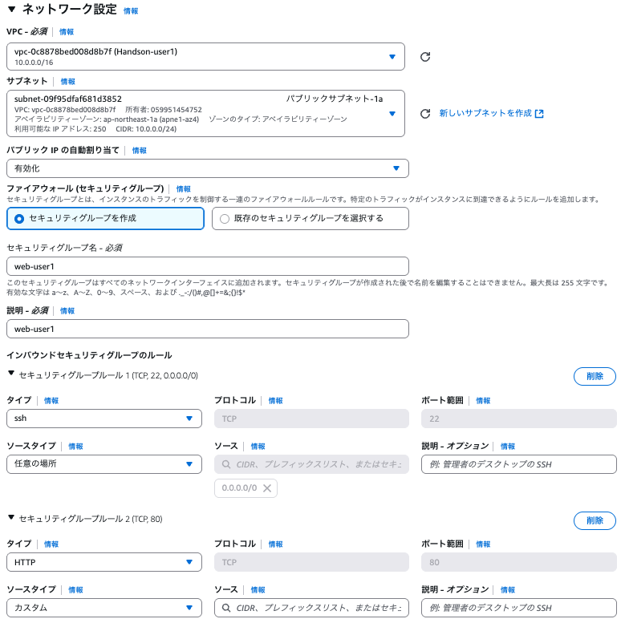</td>
        <td>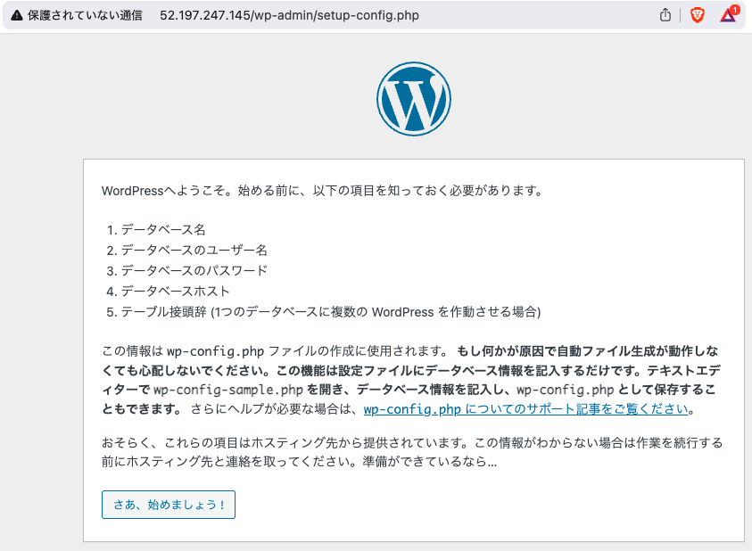</td>
      </tr>
  </tbody>
</table>

### 【フェーズ3】RDSの起動

#### DB用のセキュリティグループ

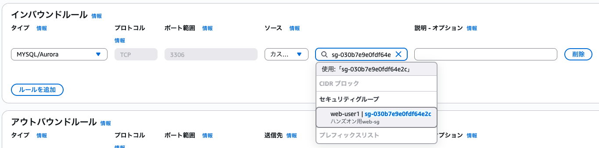

- DBのインバウンドルールにて、「Webサーバにアタッチされているセキュリティグループ」からの接続を受け入れる設定をする。

#### DBのサブネットグループ

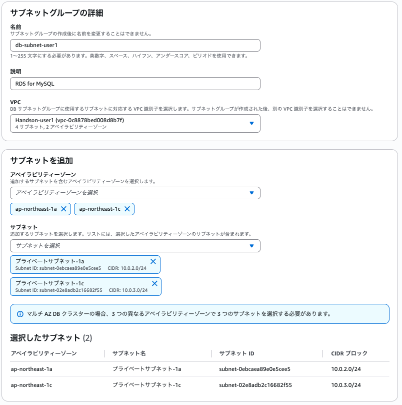

### 【フェーズ4】ELBの起動

#### ELB用のセキュリティグループ

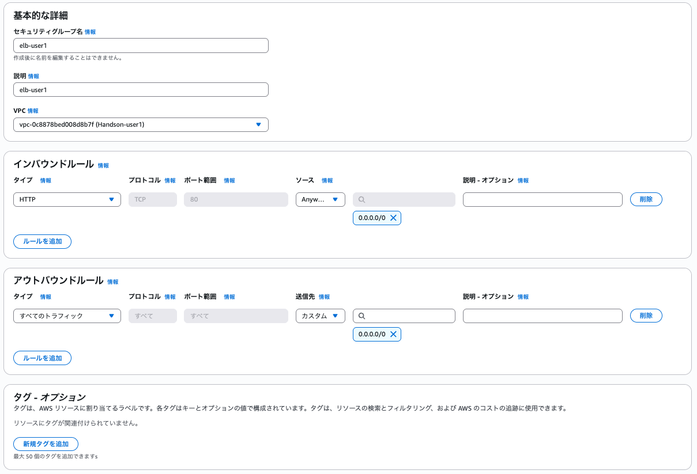

#### LBのターゲットグループ

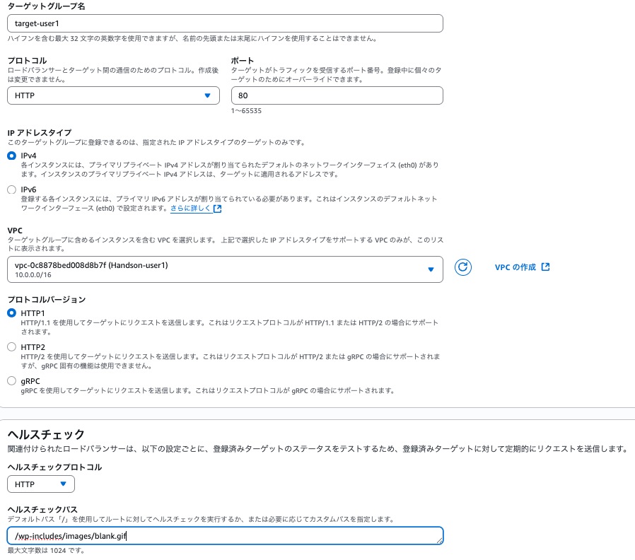

- ターゲットグループはLBに紐付けるEC2を設定する

#### LBタイプ

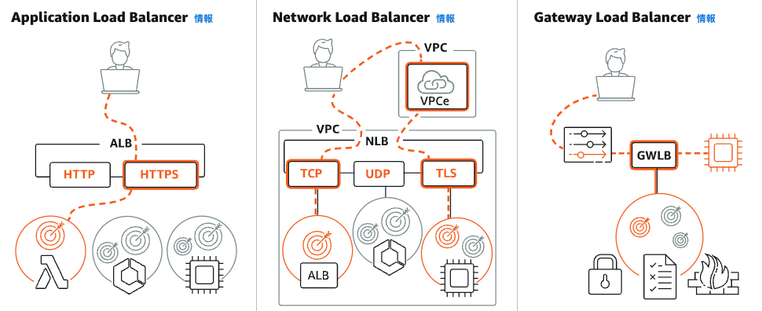

- 【**Application LB**】L7のLB。SG設定可能でHTTPリクエストの負荷分散で利用。
- 【**Network LB**】L4、L5のLB。超低レイテンシーの極端なパフォーマンスで利用し、秒間数100万のリクエストに対応。
- 【**Gateway LB**】VPCにGLBエンドポイントを設置し、仮想ネットワークアプライアンスのデプロイ、スケーリング、管理で利用。<u>ALBやNLBより使用頻度は少ない</u>。

### 【フェーズ5】WordPressのセットアップ

- 特に特記事項なし。

<div style="page-break-before:always"></div>

## 【フェーズ6〜8】

```plantuml
title "【フェーズ6〜8】"

!define AWSPuml https://raw.githubusercontent.com/awslabs/aws-icons-for-plantuml/v20.0/dist

!include AWSPuml/AWSCommon.puml
!include AWSPuml/AWSSimplified.puml
!include AWSPuml/General/User.puml
!includeurl AWSPuml/General/Internet.puml
!include AWSPuml/Groups/VPC.puml
!include AWSPuml/Groups/AvailabilityZone.puml
!include AWSPuml/Groups/PublicSubnet.puml
!include AWSPuml/Groups/PrivateSubnet.puml
!includeurl AWSPuml/Compute/EC2.puml
!include AWSPuml/Compute/EC2AMI.puml
!includeurl AWSPuml/Database/RDS.puml
!includeurl AWSPuml/NetworkingContentDelivery/ElasticLoadBalancing.puml
!includeurl AWSPuml/NetworkingContentDelivery/VPCInternetGateway.puml

User(user, "ユーザ", "user")
Internet(internet, "インターネット", "internet")
VPCGroup(vpc, "VPC: 10.0.0.0/16") {
  EC2AMI(ami, "AMI", "ami")
  VPCInternetGateway(gw, "インターネット\nゲートウェイ", "gw")
  ElasticLoadBalancing(elb, "ロードバランサ", "elb")
  AvailabilityZoneGroup(az_1a, "AZ 1a") {
    PublicSubnetGroup(az_1_public, "10.0.0.0/24") {
      EC2(ec2_p, "EC2 Primary", "")
    }
    PrivateSubnetGroup(az_1_private, "10.0.2.0/16") {
      RDS(rds_p, "RDS Primary", "")
    }
  }
  AvailabilityZoneGroup(az_1c, "AZ 1c") {
    PublicSubnetGroup(az_2_public, "10.0.1.0/24") {
      EC2(ec2_s, "EC2 Secondary", "")
    }
    PrivateSubnetGroup(az_2_private, "10.0.3.0/16") {
    }
  }
}

user - internet
internet -- gw
gw - elb
elb --> ec2_p
ec2_p --> rds_p
ec2_s -[hidden] ec2_p
elb --> ec2_s
ec2_s ..> rds_p
az_2_public -[hidden]- az_2_private
```

### 【フェーズ6】AMIの作成

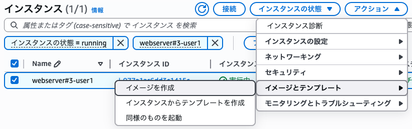

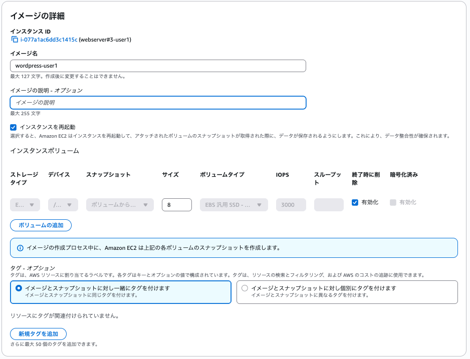

### 【フェーズ7】AMIからEC2作成

#### ①AMIからインスタンスを起動

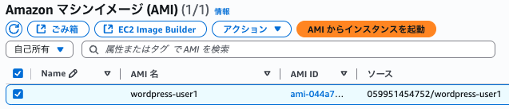

#### ②入力項目

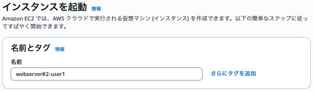

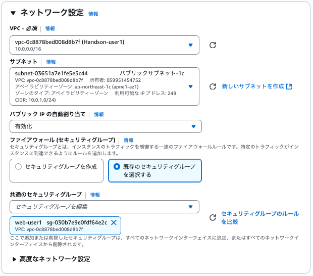

### 【フェーズ8】2つ目のEC2インスタンスをELBに登録

#### ①ELBのターゲットグループの詳細画面

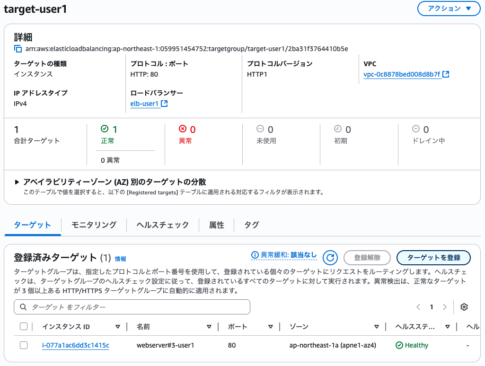

#### ②EC2インスタンスを追加してターゲットグループ登録

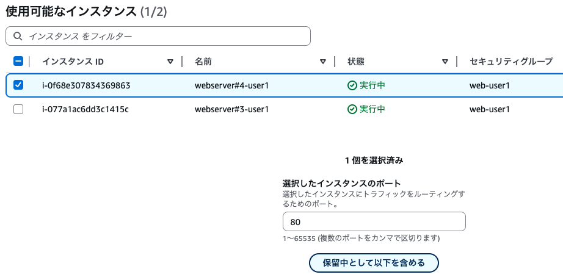

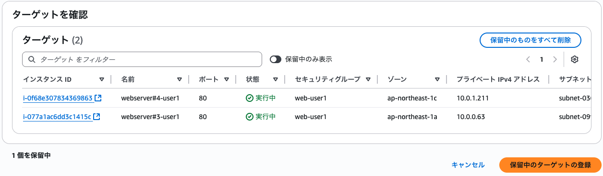

<div style="page-break-before:always"></div>

## 【フェーズ9】RDSインスタンスのマルチAZ化

```plantuml

!define AWSPuml https://raw.githubusercontent.com/awslabs/aws-icons-for-plantuml/v20.0/dist

!include AWSPuml/AWSCommon.puml
!include AWSPuml/AWSSimplified.puml
!include AWSPuml/General/User.puml
!include AWSPuml/General/Internet.puml
!include AWSPuml/Groups/VPC.puml
!include AWSPuml/Groups/AvailabilityZone.puml
!include AWSPuml/Groups/PublicSubnet.puml
!include AWSPuml/Groups/PrivateSubnet.puml
!include AWSPuml/Compute/EC2.puml
!include AWSPuml/Compute/EC2AMI.puml
!include AWSPuml/Database/RDS.puml
!include AWSPuml/NetworkingContentDelivery/ElasticLoadBalancing.puml
!include AWSPuml/NetworkingContentDelivery/VPCInternetGateway.puml

User(user, "ユーザ", "user")
Internet(internet, "インターネット", "internet")
VPCGroup(vpc, "VPC: 10.0.0.0/16") {
  EC2AMI(ami, "AMI", "ami")
  VPCInternetGateway(gw, "インターネットGW", "gw")
  ElasticLoadBalancing(elb, "ロードバランサ", "elb")
  AvailabilityZoneGroup(az_1a, "AZ 1a") {
    PublicSubnetGroup(az_1_public, "10.0.0.0/24") {
      EC2(ec2_p, "EC2 Primary", "")
    }
    PrivateSubnetGroup(az_1_private, "10.0.2.0/16") {
      RDS(rds_p, "RDS Primary", "")
    }
  }
  AvailabilityZoneGroup(az_1c, "AZ 1c") {
    PublicSubnetGroup(az_2_public, "10.0.1.0/24") {
      EC2(ec2_s, "EC2 Secondary", "")
    }
    PrivateSubnetGroup(az_2_private, "10.0.3.0/16") {
      RDS(rds_s, "RDS Secondary", "")
      note left of rds_s
      <color red>**※無料利用枠**
      　<color red>**では実行不可**
      end note
    }
  }
}

user - internet
internet -- gw
gw - elb
elb --> ec2_p
ec2_p --> rds_p
ec2_s -[hidden] ec2_p
elb --> ec2_s
ec2_s -[hidden]- rds_s
ec2_s ..> rds_p
rds_p .[#red]> rds_s: <color red>レプリケーション
```

<div style="page-break-before:always"></div>

## 【オプション1】全体の可用性確認

```plantuml
title 【オプション1】全体の可用性確認

!define AWSPuml https://raw.githubusercontent.com/awslabs/aws-icons-for-plantuml/v20.0/dist

!include AWSPuml/AWSCommon.puml
!include AWSPuml/AWSSimplified.puml
!include AWSPuml/General/User.puml
!include AWSPuml/General/Internet.puml
!include AWSPuml/Groups/VPC.puml
!include AWSPuml/Groups/AvailabilityZone.puml
!include AWSPuml/Groups/PublicSubnet.puml
!include AWSPuml/Groups/PrivateSubnet.puml
!include AWSPuml/Compute/EC2.puml
!include AWSPuml/Compute/EC2AMI.puml
!include AWSPuml/Database/RDS.puml
!include AWSPuml/NetworkingContentDelivery/ElasticLoadBalancing.puml
!include AWSPuml/NetworkingContentDelivery/VPCInternetGateway.puml

User(user, "ユーザ", "user")
Internet(internet, "インターネット", "internet")
VPCGroup(vpc, "VPC: 10.0.0.0/16") {
  EC2AMI(ami, "AMI", "ami")
  VPCInternetGateway(gw, "インターネットゲートウェイ", "gw")
  ElasticLoadBalancing(elb, "ロードバランサ", "elb")
  AvailabilityZoneGroup(az_1a, "AZ 1a") {
    PublicSubnetGroup(az_1_public, "10.0.0.0/24") {
      EC2(ec2_p, "EC2 Primary", "")
    }
    PrivateSubnetGroup(az_1_private, "10.0.2.0/16") {
      RDS(rds_p, "RDS Primary", "")
    }
  }
  AvailabilityZoneGroup(az_1c, "AZ 1c") {
    PublicSubnetGroup(az_2_public, "10.0.1.0/24") {
      EC2(ec2_s, "EC2 Secondary", "")
    }
    PrivateSubnetGroup(az_2_private, "10.0.3.0/16") {
      RDS(rds_s, "RDS Secondary", "")
    }
  }
}

user - internet
internet -- gw
gw - elb
ec2_p -[hidden]- rds_p
ec2_s -[hidden] ec2_p
elb --> ec2_s
ec2_s -[hidden]- rds_s
ec2_s --> rds_p
rds_p .> rds_s
```

<div style="page-break-before:always"></div>

## リソースの削除

1. **RDS関連の削除**
   1. RDSの削除
   2. RDSのサブネットグループの削除
   3. スナップショットが存在しないことの確認
2. **EC2関連の削除**
   1. EC2インスタンスの終了(削除)
   2. AMIの削除
   3. EBSスナップショットの削除 ※AMI削除時にも削除可能
   4. ELBの削除
   5. LBのターゲットグループの削除
3. **VPCの削除**
   1. VPCの削除
   2. パブリック/プライベートサブネットの削除
   3. インターネットゲートウェイ(IGW)の削除
   4. セキュリティグループ(SG)の削除