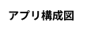

# #1 AWS上にセキュアなプライベートネットワーク空間を作成する

- https://pages.awscloud.com/JAPAN-event-OE-Hands-on-for-Beginners-Network1-2022-confirmation_945.html

# #2 Amazon VPC間およびAmazon VPCとオンプレミスのプライベートネットワーク接続

- https://pages.awscloud.com/JAPAN-event-OE-Hands-on-for-Beginners-Network2-2022-confirmation_426.html

# #3 クライアントVPNを使ってリモート接続環境を構築しよう

- https://pages.awscloud.com/JAPAN-event-OE-Hands-on-for-Beginners-Network-3-2022-confirmation-312.html

# #4 Amazon CloudFrontおよびAWS WAFを用いてエッジサービスの活用方法を学ぼう

