# #1 サーバーレスアーキテクチャで翻訳 Web API を構築する

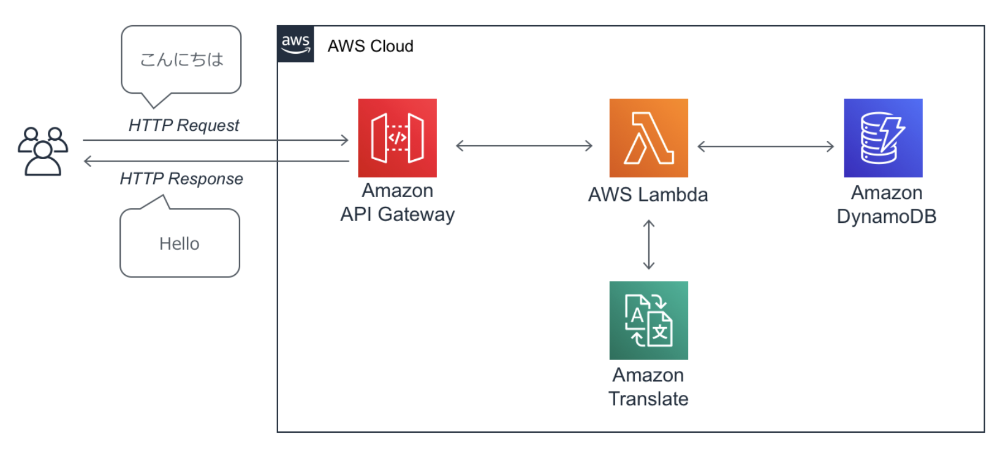

## サーバレスの必要性

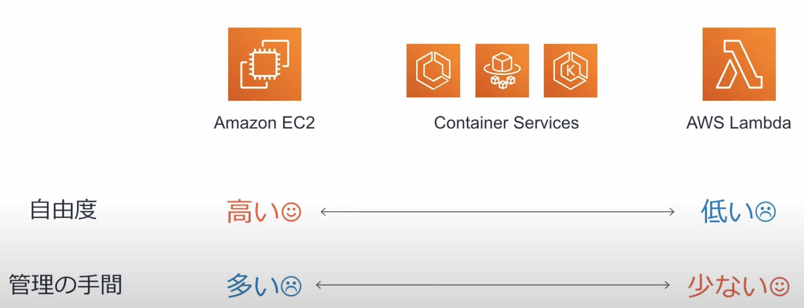

- 従来のサーバがある場合以下の**コストが発生する**
  - サーバーセットアップ
  - ミドルウェアやランタイムのセットアップ
  - セキュリティパッチの適用
  - 耐障害性を担保したアーキテクチャの検討
- サーバレスアーキテクチャのメリット
  - インフラのプロビジョニングや管理が不要
  - 高い可用性(HA)
  - 自動でスケール
  - 実行時間と使用回数に基づいた料金(使った分だけ支払う)

## AWS Lambda

- <font color=red><b>リクエストベース($実行回数\times 実行時間$)の料金体系</b></font>
- サーバーのプロビジョニング/管理なしでプログラムを実行できるサービス
- コードの実行やスケーリングに必要なことはLambda側で実施するので、開発者の方はコードを書くことにより集中できる。

### コーディングイメージ

- 【**対応言語**】Java、Go、PowerShell、Node.js、C#、Python、Ruby
<font color=red>$※$サポートされていない言語はカスタムランタイムを実装することで利用可能</font>
- ハンドラーで呼び出す関数を指定し、デフォルトでは`lambda_function.lambda_handler`が設定されている。

### Lambdaで設定できる項目

- <font color=red>実行IAMロールで許された動作しか実行できない</font>
- **確保するメモリ量**
  - 128MB〜10,240MB
  - CPU能力は確保するメモリ量に比例する
- タイムアウト値
  - デフォルト3秒
  - 最大900秒(15分)

### Lambdaのイベントソースと呼び出しタイプ

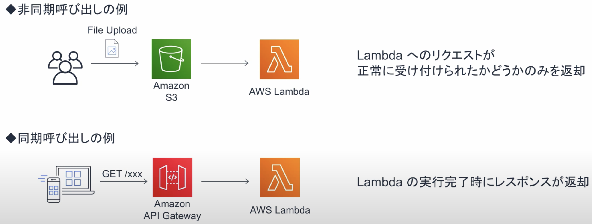

### Lambda Functionのライフサイクル

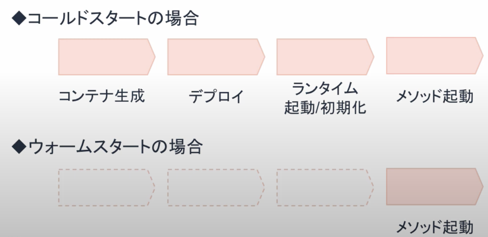

- Lambdaは呼び出されるとコンテナ上でプログラムが実行する
- 1つのコンテナで同時に実行できるのは1つのリクエストまで
- コンテナは再利用されるが、利用可能なコンテナがないときはコールドスタート

## 【ハンズオン1】Lambdaを単体で使う

### Lambdaの追加

#### 追加画面

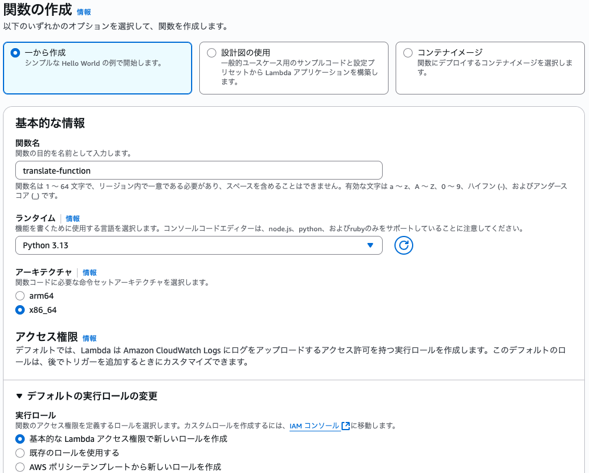

#### Lambdaのロール

```json
{
    "Version": "2012-10-17",
    "Statement": [
        {
            "Effect": "Allow",
            "Action": "logs:CreateLogGroup",
            "Resource": "arn:aws:logs:ap-northeast-1:059951454752:*"
        },
        {
            "Effect": "Allow",
            "Action": [
                "logs:CreateLogStream",
                "logs:PutLogEvents"
            ],
            "Resource": [
                "arn:aws:logs:ap-northeast-1:059951454752:log-group:/aws/lambda/translate-function:*"
            ]
        }
    ]
}
```

### ログ出力・確認

- 下記URLを参考にログ出力のコードを作成
  - https://docs.aws.amazon.com/ja_jp/lambda/latest/dg/python-logging.html

```python
import json
import logging

logger = logging.getLogger()
logger.setLevel(logging.INFO)

def lambda_handler(event, context):
    logger.info(event)
    return {
        'statusCode': 200,
        'body': json.dumps('Hello from Lambda!!!!!!!!!!')
    }
```

#### ログの確認方法(2つ)

##### コンソールのOUTPUTを確認する方法

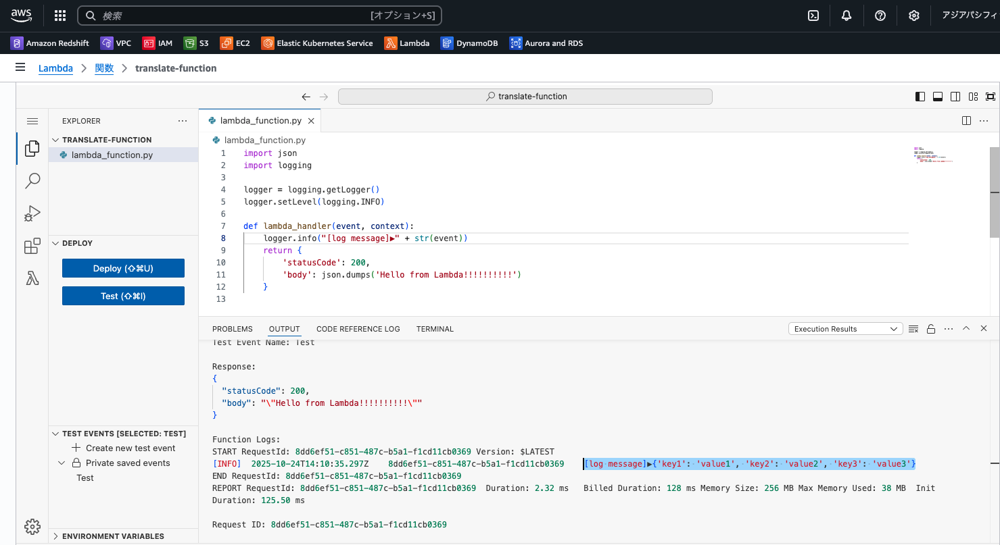

##### CloudWatchのログ表示

<table>
	<tbody>
		<tr>
			<th>CloudWatchのログ確認</th>
			<th>CloudWatchのログ画面</th>
		</tr>
		<tr>
			<td>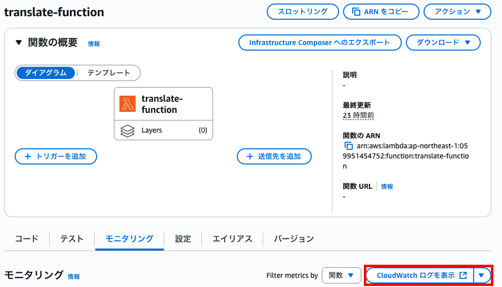</td>
			<td>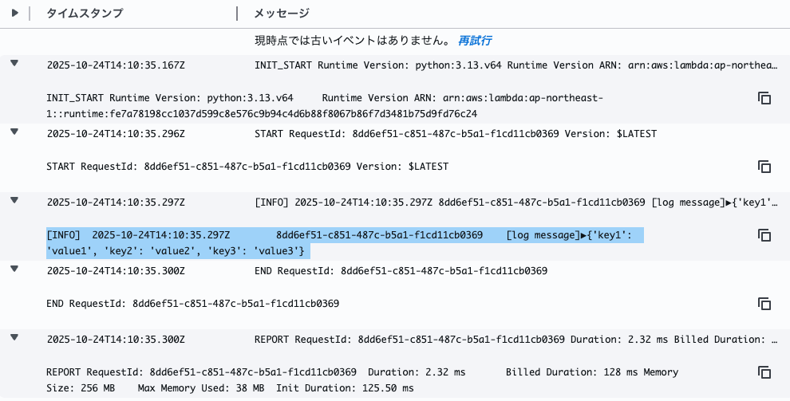</td>
		</tr>
	</tbody>
</table>

## 【ハンズオン2】Lambdaから他のサービスを呼ぶ

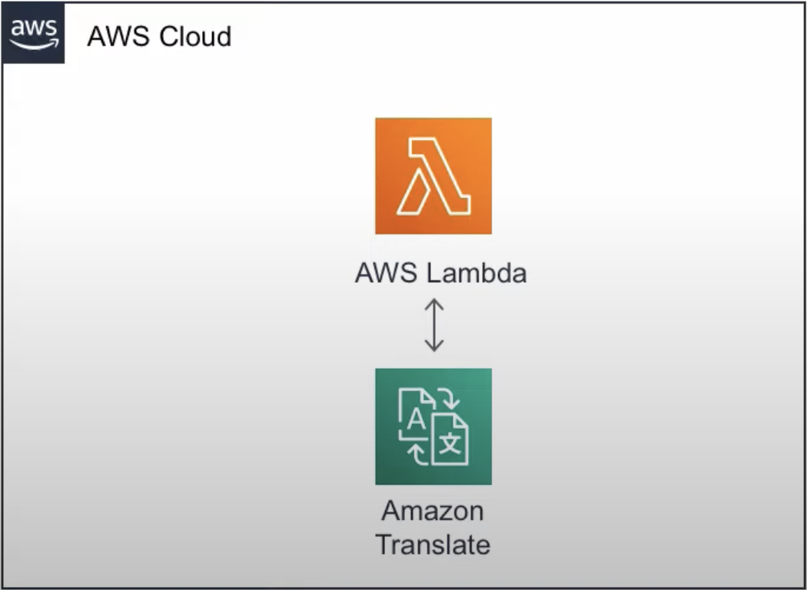

### boto3

- Boto3とは、Amazon Web Services(AWS)の各種サービス(Amazon S3、Amazon EC2など)をPythonから操作するための公式ライブラリである「AWS SDK for Python」の別称。Pythonデベロッパーにとってなじみ深く整合性のあるライブラリのセットを提供することで、AWSサービスを簡単に利用できるようにする。
- 下記URLからAPIリファレンスを参照
  - https://boto3.amazonaws.com/v1/documentation/api/latest/index.html#api-reference

<div style="page-break-before:always"></div>

## API Gateway概要

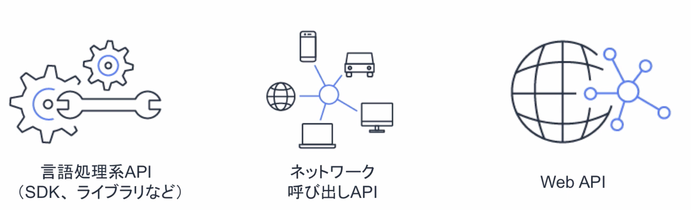

### API Gatewayの特徴

#### Web APIを開発するときに考えるべきこと

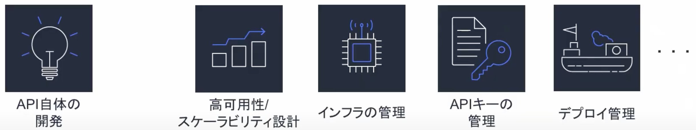

- サーバをプロビジョニング/管理することなく、APIを作成・管理できるマネージドサービス
- 可用性の担保、スケーリング、APIキー管理といったAPI開発で必要なことをAPI Gatewayに任せることで、<font color=red>開発者はビジネスの差別化につながる作業に集中できる</font>。
- <font color=red><b>$実行回数+データ転送料金(+キャッシュメモリ量)$の料金体系(REST APIの場合)</b></font>

#### API Gatewayの使い方

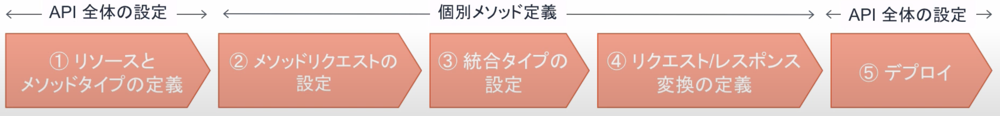

- 上図の流れが一般的な開発の流れになる
  1. API全体の設定（①リソースとメソッドタイプの定義）
  2. 個別メソッド定義（②メソッドリクエストの設定→③統合タイプの設定→④リクエスト/レスポンス変換の定義）
  3. API全体の設定（⑤デプロイ）
- **多種多様な設定項目**
  - バージョニング
  - APIキーと使用料プラン
  - ログとモニタリング

##### ①リソースとメソッドタイプの定義

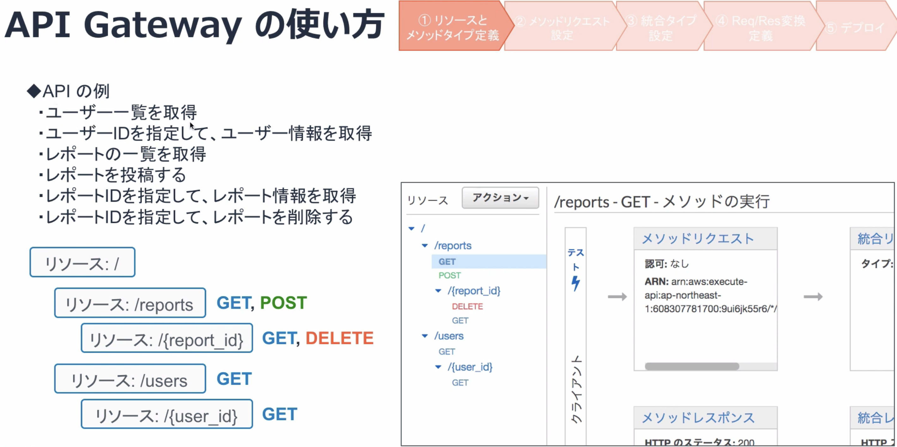

- リソース: `/reports`、`/users/{user_id}`
- メソッド: `GET`、`POST`、`PUT`、`DELETE`

##### ②メソッドリクエストの設定

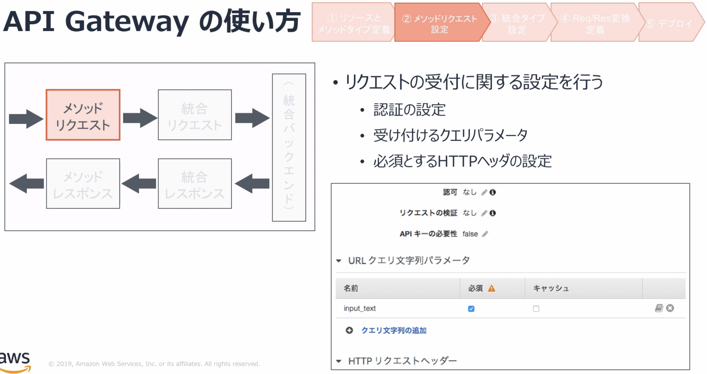

- 認証設定
- 受け付けるクエリパラメータ
- 必須とするHTTPヘッダの設定

##### ③統合タイプの設定

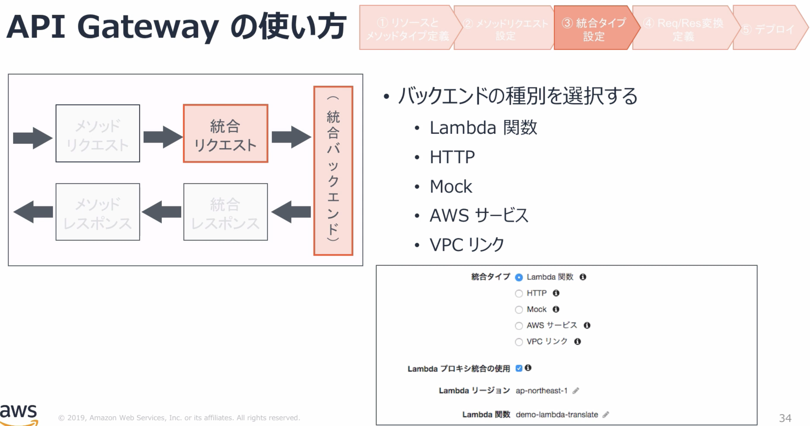

- Lambda関数、HTTP、Mock、AWSサービス、VPCリンクから統合タイプを選択する

##### ④リクエスト/レスポンス変換の定義

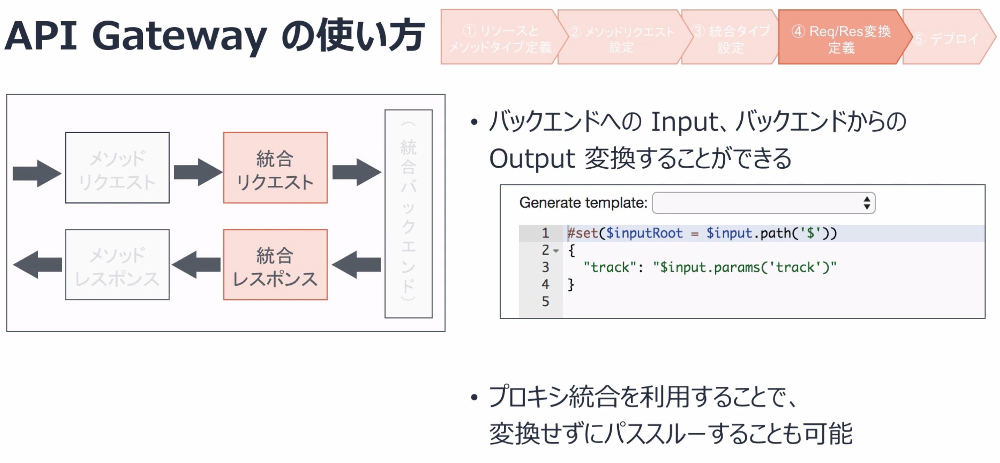

- リクエストとレスポンスの加工処理を行う。
- 「プロキシ統合」を設定すると何も処理をしない。

##### ⑤デプロイ

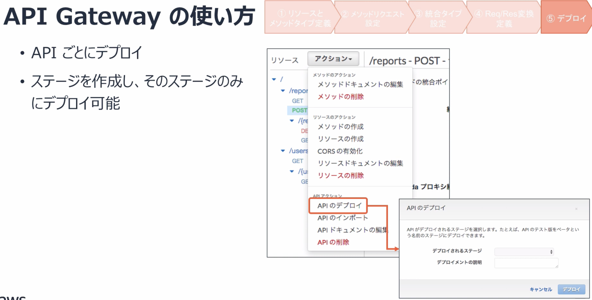

- 最終的なAPI Gatewayとしてのレスポンスを設定
  - ステータスコード
  - HTTPレスポンスヘッダ

<div style="page-break-before:always"></div>

## DynamoDB概要


## 落ち穂拾い

### グローバルスコープとローカルスコープ

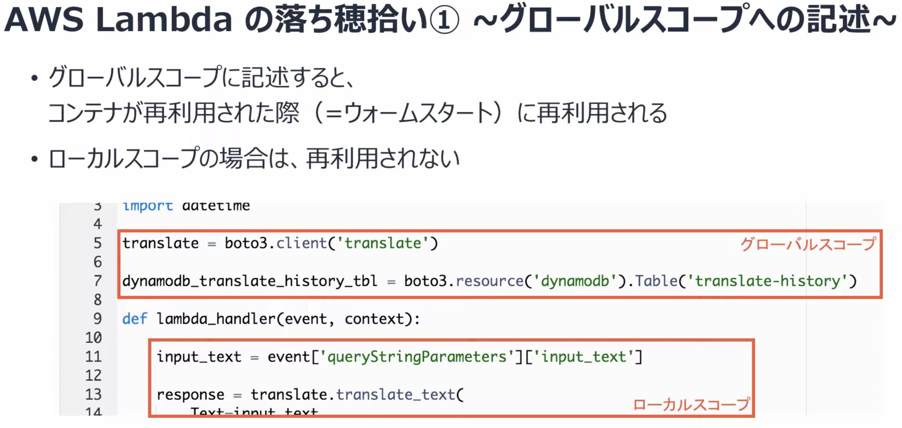

- **グローバルスコープ**に記述するとウォームスタートに再利用される。
- **ローカルスコープ**の場合は再利用されず、コールドスタートでもウォームスタートでも処理が毎回実行される。

### 例外処理

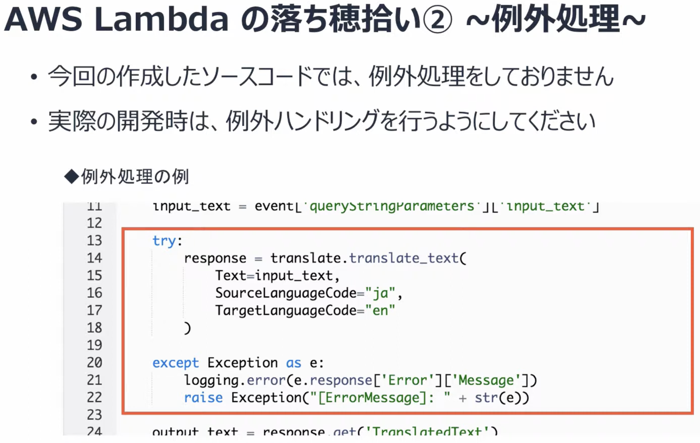

# #2 AWS SAMを使ってテンプレートからサーバレスな環境を構築する


<div style="page-break-before:always"></div>

# #3 AWS Lambda と AWS AI Services を組み合わせて作る音声文字起こし&感情分析パイプライン


<div style="page-break-before:always"></div>

# AWS Step Functions 入門 - ビジュアルツールを使ってローコードにワークフローを作成する


