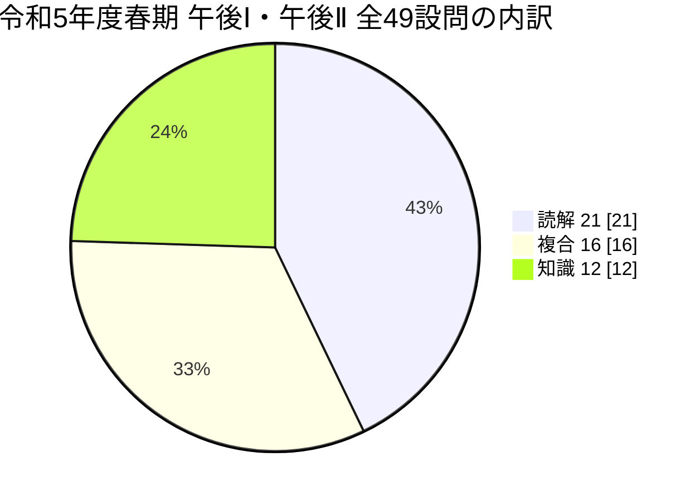
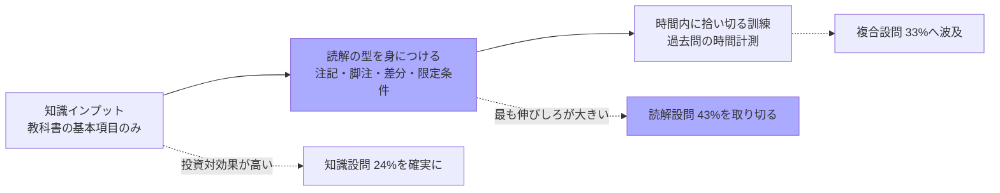

# 令和5年度 春期 支援士 午後Ⅰ・午後Ⅱ 設問タイプ分類 <!-- omit in toc -->

> 対象：令和5年度春期 午後Ⅰ（問1〜問3）／午後Ⅱ（問1・問2）の**全49設問**
> 目的：**どの設問が「問題文を読めば解ける」のか、どの設問が「知らなければ解けない」のか**を切り分け、学習の投資先を決める

- [分類の定義](#分類の定義)
- [全体集計](#全体集計)
- [午後Ⅰ 問1　Webアプリケーションプログラム開発](#午後ⅰ-問1webアプリケーションプログラム開発)
- [午後Ⅰ 問2　セキュリティインシデント](#午後ⅰ-問2セキュリティインシデント)
- [午後Ⅰ 問3　クラウドサービス利用](#午後ⅰ-問3クラウドサービス利用)
- [午後Ⅱ 問1　Webセキュリティ（脆弱性診断の内製化）](#午後ⅱ-問1webセキュリティ脆弱性診断の内製化)
- [午後Ⅱ 問2　クラウド移行と機能拡張](#午後ⅱ-問2クラウド移行と機能拡張)
- [知識問題で問われた知識の分野別まとめ](#知識問題で問われた知識の分野別まとめ)
- [読解問題の「根拠の置き場所」パターン](#読解問題の根拠の置き場所パターン)
- [この分析から導かれる学習方針](#この分析から導かれる学習方針)

---

## 分類の定義

| 記号       | 分類     | 定義                                                                                                                                               | 対策                                       |
| ---------- | -------- | -------------------------------------------------------------------------------------------------------------------------------------------------- | ------------------------------------------ |
| **【読】** | **読解** | 問題文・図・表・ 注記の記述を**探して突き合わせれば**答えが出る。 専門知識がなくても、 日本語として根拠を特定できる                       | **解き方の訓練**（根拠の探し方・時間配分） |
| **【複】** | **複合** | **知識を手掛かりにして**問題文の条件を当て はめる。 知識は「どこを見ればよいか」 を教えてくれる役割で、 最終的な答えは問題文の中にある | 知識を入れた上で**過去問演習**             |
| **【知】** | **知識** | 用語・プロトコル・ 仕様を**知らなければ書けない**。 問題文には答えが書かれていない                                                           | **暗記・理解のインプット**                 |

> **判定の基準**：その設問の解答を、**本文・図・表のどこかの記述を指差して説明できるか**。できれば【読】、知識で補えば指差せるなら【複】、どこにも書かれていなければ【知】。

---

## 全体集計

| 分類           | 設問数 |    割合 |
| -------------- | -----: | ------: |
| **【読】読解** | **21** | **43%** |
| **【複】複合** | **16** | **33%** |
| **【知】知識** | **12** | **24%** |
| 合計           |     49 |    100% |

**問別の内訳**

| 問                       | 設問数 | 【読】 | 【複】 | 【知】 | 傾向                                                                   |
| ------------------------ | -----: | -----: | -----: | -----: | ---------------------------------------------------------------------- |
| 午後Ⅰ 問1　Webアプリ開発 |      8 |      3 |      2 |      3 | **Javaの文法知識が必須**。 知識がないと手も足も出ない箇所がある     |
| 午後Ⅰ 問2　インシデント  |      8 |      4 |      2 |      2 | **表の突き合わせが主戦場**。 知識はネットワークの基礎               |
| 午後Ⅰ 問3　クラウド      |      9 |      4 |      4 |      1 | **注記・脚注が根拠**。 純粋な知識設問はCASBの1問だけ                |
| 午後Ⅱ 問1　脆弱性診断    |     13 |      8 |      3 |      2 | **最も読解比率が高い（62%）**。 知識の持ち出しが少ない              |
| 午後Ⅱ 問2　クラウド移行  |     11 |      2 |      5 |      4 | **最も知識比率が高い（36%）**。OAuth・PKCE・ 暗号を知らないと厳しい |

> **選択の目安**：知識に不安があるうちは**午後Ⅰは問2・問3**、**午後Ⅱは問1**が組みやすい。逆に、OAuthとクラウドの権限設計に自信があるなら午後Ⅱ問2は短時間で取り切れる。

---

## 午後Ⅰ 問1　Webアプリケーションプログラム開発

| 設問                      | 解答                                                                                      |    分類    | 根拠の所在（読解）／必要な知識（知識）                                                                                                                                                                                                                                                            |
| ------------------------- | ----------------------------------------------------------------------------------------- | :--------: | ------------------------------------------------------------------------------------------------------------------------------------------------------------------------------------------------------------------------------------------------------------------------------------------------- |
| 設問1(1)　空欄a           | 13                                                                                        | **【複】** | **読む場所**：表1項番2の指摘内容 「パス名の文字列作成で、 利用者が入力したデータを直接使用している」 ＋図1で `new File(…)` がある行 **必要な知識**：ディレクトリトラバーサル＝ 外部入力をパス名の組立てに使う脆弱性、 という定義。 これがないと「8行目でもよいのでは」と迷う |
| 設問1(2)　空欄b           | in                                                                                        | **【複】** | **必要な知識**： Javaで `close()` が要るのは Statement／ ResultSet／InputStream 系。 `byte[]` と `File` はリソースではない。 引数で渡された `Connection` は呼び出し元の責務 **読む場所**：図1の変数宣言。 知識がないと消去法が成立しない                                        |
| 設問1(3)　空欄c・d        | `WHERE head.order_no = ?`／ `PreparedStatement stmt =` `conn.prepareStatement(sql)` | **【知】** | **分野**：セキュリティ実装技術／ システム開発技術 **知識**：JDBCのプレースホルダ。 `createStatement()`→`prepareStatement(sql)`、 `?` は**引用符ごと置き換える**、 `executeQuery()` は引数なし。 問題文に答えの形は書かれていない                                                |
| 設問2(1)　空欄e           | orderNo                                                                                   | **【読】** | **読む場所**：図4の2行目 `private static String orderNo;`。本文 「図4で変数 e が f として宣言されている」 と照合するだけ                                                                                                                                                                 |
| 設問2(2)　空欄f           | static                                                                                    | **【読】** | **読む場所**：同上。 英字10字以内という制約も `static` を示唆                                                                                                                                                                                                                                  |
| 設問2(3)　下線 ①の呼称 | レースコンディション                                                                      | **【知】** | **分野**：システム開発技術 **知識**：競合状態の用語。下線①の文 （並列動作する複数の処理が同一リソースに 同時アクセス） が定義そのものなので、 **用語を知っていれば即答、 知らなければ書けない**                                                                                 |
| 設問2(4)　空欄g〜i        | `String orderNo`／`new`／ `getOrderInfoBean(orderNo)`                                  | **【知】** | **分野**：システム開発技術 **知識**：Javaの文法。引数宣言は**型＋変数名**、 インスタンス生成は `new`、 static が外れるとクラス名経由で呼べない                                                                                                                                           |
| 設問2(5)　空欄j           | 得意先コード                                                                              | **【読】** | **読む場所**：①図3のE-R図 （注文ヘッダーテーブルの属性に得意先コー ドがある／ 利用者IDはない）②本文 「ログイン処理時に、 ……利用者IDにひも付く**得意先コード**及び得意先 名はセッションオブジェクトに保存されている」。 両方に存在する属性は1つだけ                           |

**この問の性格**：**Javaのソースコードが読めるかどうかで明暗が分かれる**。設問1(3)・設問2(4)は完全に実装知識で、文系的な読解では埋まらない。逆に設問2(1)(2)(5)は図を見るだけ。開発経験があれば得点源、なければ**午後Ⅰでは選択を避ける**判断もあり得る。

---

## 午後Ⅰ 問2　セキュリティインシデント

| 設問                              | 解答                                                   |    分類    | 根拠の所在（読解）／必要な知識（知識）                                                                                                                                                                                                                                                                  |
| --------------------------------- | ------------------------------------------------------ | :--------: | ------------------------------------------------------------------------------------------------------------------------------------------------------------------------------------------------------------------------------------------------------------------------------------------------------- |
| 設問1　空欄a                      | パッシブ                                               | **【複】** | **必要な知識**：FTPのアクティブ／ パッシブの違い （データコネクションの**向き**） **読む場所**：表1の1-233（21/TCP） と1-234（60453/TCP） が**同じ向き**であること。 知識がないと「向き」に着目できない                                                                               |
| 設問2(1)　空欄b                   | コミュニティ                                           | **【知】** | **分野**：ネットワーク／情報セキュリティ対策 **知識**：SNMPv1/v2cの**コミュニティ名** （平文のパスワード代わり、 既定値 `public`）。問題文に説明はない                                                                                                                                         |
| 設問2(2)　空欄c＋理由             | バインド／2-3・3-3・1-3                                | **【読】** | **読む場所**：①本文の攻撃ツールの特徴 （バインド＝外部からの接続を待ち受ける） ②表2 2-3（`-mode bind 0.0.0.0:8080`） ③表3 3-3（8080 が LISTEN のまま） ④表1 1-3（8080 が拒否） ⑤本文のFW設定 （インターネット→受付サーバは443だけ許可） **補助知識**：LISTEN＝接続されていない状態 |
| 設問2(3)　空欄d＋理由             | コネクト／2-4・3-4・1-4                                | **【読】** | **読む場所**：表2 2-4 （`-mode connect …:443`）／ 表3 3-4（ESTABLISHED）／表1 1-4（許可）。 **ソースポート54543が表1と表3で一致**しているこ とも突き合わせの手掛かり **補助知識**：ESTABLISHED＝接続確立済み                                                                             |
| 設問2(4)　空欄e                   | 1365                                                   | **【読】** | **読む場所**：表2 2-5のコマンドライン （`-range 192.168.0.1-192.168.255.254`）、 PPID 1293（＝C&C成功プロセスの子）、 開始時刻15:14（＝C&C成功15:08の後）。 表3 3-5の SYN_SENT も裏付け                                                                                                     |
| 設問3(1)　TXTレコー ドの理由   | TXTレコードには任意の文字列を設 定できるから        | **【知】** | **分野**：ネットワーク（DNS） **知識**：リソースレコードの**RDATA形式**。 Aレコード＝32ビットのIPv4アドレス固定／ TXTレコード＝任意のcharacter-string。 「DNSプロトコルの仕様を踏まえて」 という指定がまさに知識を要求している                                                           |
| 設問3(2)　下線 ④が不適切な理由 | 稼働しているファイルと内容が異な る可能性があるから | **【複】** | **必要な知識**： デジタルフォレンジックスの原則 （**一次証拠は被害機器から取得**）**読む場所**： 図2のURLのホストが `a0.b0.c0.d0`＝ **攻撃者のサーバ**であること （表1の送信元アドレスと同じ）                                                                                           |
| 設問3(3)　空欄f                   | 受付サーバ                                             | **【読】** | **読む場所**：本文 「受付サーバを更に調査したところ、 logd という名称の不審なプロセスが稼働し ていた」。 設問3(2)の裏返し                                                                                                                                                                   |

**この問の性格**：**3つの表を横断して同じ事象を特定する作業**が中心で、**8設問中4つが純粋な読解**。必要な知識はネットワークの基礎（FTP・SNMP・DNS・TCPの状態）に限られ、範囲が狭い。**時間さえあれば得点しやすい問**。

---

## 午後Ⅰ 問3　クラウドサービス利用

| 設問                      | 解答                                                                    |    分類    | 根拠の所在（読解）／必要な知識（知識）                                                                                                                                                                                                                                                                  |
| ------------------------- | ----------------------------------------------------------------------- | :--------: | ------------------------------------------------------------------------------------------------------------------------------------------------------------------------------------------------------------------------------------------------------------------------------------------------------- |
| 設問1(1)　空欄a〜c        | ア／イ／ウ                                                              | **【複】** | **必要な知識**：SAML SP-Initiated SSOの流れ （IdPとSPは直接通信せずブラウザを介する） **読む場所**： 図2で**aとcの間に直接の矢印がない**＝ bが仲介役＝ブラウザ、 と構造から読める。 知識がなくても矢印の形から絞り込める                                                              |
| 設問1(2)　下線 ①の理由 | 送信元制限機能で、 本社のUTMからのアクセスだけを許 可しているから | **【読】** | **読む場所**：表1「送信元制限機能」の**注2** 「本社のUTMのグローバルIPアドレスを送信元IP アドレスとして設定している。 設定しているIPアドレス以外からのアクセスは拒 否する設定にしている」                                                                                                   |
| 設問2(1)　空欄d〜f        | ア／ウ／イ                                                              | **【複】** | **必要な知識**：TLSインスペクションの仕組み （プライベートCAのルート証明書を端末に導 入する） **読む場所**：「**X を発行する Y を、 Z として、 PCにインストールする**」という文型。 語順から機械的にも決まる                                                                          |
| 設問2(2)　空欄g           | イ（CASB）                                                              | **【知】** | **分野**：情報セキュリティ対策 **知識**：CASBの4機能（可視化・ コンプライアンス・データセキュリティ・ 脅威防御）。CAPTCHA／CHAP／CVSS／ クラウドWAFとの区別も必要                                                                                                                           |
| 設問3(1)　下線 ②の違い | プロキシサーバではなく、 Pサービスを経由させる                       | **【読】** | **読む場所**：①本文冒頭 「PCのWebブラウザからインターネットへの アクセスは、 本社のプロキシサーバを経由する」 ②表1注4（拠点間VPN） ③**図3でDMZのプロキシサーバがPコネクタに置き 換わっている**（図1との差分）                                                                         |
| 設問3(2)　下線 ③の設定 | 送信元制限機能で、 営業所のUTMのグローバルIPアドレ スを設定する   | **【読】** | **読む場所**：表1送信元制限機能の**注1 「IPアドレスは、 複数設定できる」**＋表2要件2 「本社と営業所のPC及びR-PCに制限する」                                                                                                                                                                    |
| 設問3(3)　下線 ④の方式 | （イ）TLSクライアント認証                                               | **【複】** | **必要な知識**：**SMS-OTPは「人」を縛り、 クライアント証明書は「端末」 を縛る**という区別 **読む場所**：表2要件2 「Lサービスに接続できる**PC**を……制限する。 なお、**従業員宅のネットワークについて、 前提を置かない**」                                                              |
| 設問3(4)　空欄h・i        | 6／2                                                                    | **【読】** | **読む場所**：表2要件3 （インターネットからの通信を許可するルールを 追加しない） →表3項番6の注2 「**PコネクタからPサービスに接続を開始する**」 ／表2要件4 （HTTPS通信をマルウェアスキャン） →表3項番2                                                                              |
| 設問3(5)　表5             | 4／URL／研究開発部／許可／3／ 外部ストレージ／全て／禁止             | **【複】** | **読む場所**：①**図1の注記** 「四つのSaaSのうちSaaS-aは、 研究開発部の従業員が使用する」 ②図1の注1（SaaS-aのURL） ③表2要件5④表5注記 「**番号の小さい順に最初に一致したルールが 適用される**」 **必要な知識**： フィルタリングは**具体的な許可を上、 包括的な禁止を下**に書く |

**この問の性格**：**根拠がほぼ全て「注記」と「注1)〜注4)」に置かれている**。図や表の本体だけを読んで注を飛ばすと、設問1(2)・3(2)・3(4)・3(5)が総崩れになる。**純粋な知識設問はCASBの1問だけ**で、SAMLもTLSインスペクションも「どこを見ればよいか」を教えてくれる程度。**注を丁寧に拾う習慣がそのまま得点になる問**。

---

## 午後Ⅱ 問1　Webセキュリティ（脆弱性診断の内製化）

| 設問                                   | 解答                                                                                                   |    分類    | 根拠の所在（読解）／必要な知識（知識）                                                                                                                                                                                                                                                                       |
| -------------------------------------- | ------------------------------------------------------------------------------------------------------ | :--------: | ------------------------------------------------------------------------------------------------------------------------------------------------------------------------------------------------------------------------------------------------------------------------------------------------------------ |
| 設問1　下線 ①の別の方法             | 診断対象のWebサイトの設計書を確 認するという方法                                                    | **【複】** | **読む場所**：表2の手動登録の特徴 「Webブラウザを使ってトップページから順に手 動でたどっても、 登録が漏れる場合がある」 **必要な発想**： **サイトをたどる方法が尽きている**ので、 サイトの外にある一次情報（設計書）に頼る                                                                 |
| 設問2(1)　空欄a・b                     | イ／ウ                                                                                                 | **【複】** | **必要な知識**：SQLの文字列リテラル。 `'` で閉じてから条件を足す／`'a'='a` は真、 `'a'='b` は偽 **読む場所**：Y氏の発言 「keywordの値が**文字列として扱われる仕様**」 ＋表3のB社の件数（10件と0件）                                                                                           |
| 設問2(2)　空欄c                        | (2-3)                                                                                                  | **【読】** | **読む場所**：図1(2-3)「本機能を設定すると、 診断対象URLの応答だけでなく、 **別のURLの応答も判定対象になる**」 ＋Y氏の発言 「**二つ先の画面**でエスケープ処理されずに出力さ れていました」                                                                                                    |
| 設問2(3)　下線 ②の設定内容          | アンケート入力1からアンケート入 力2に遷移する URLの拡張機能に、 アンケート確認のURLを登録する | **【読】** | **読む場所**：①図1(2-3)の設定手順 ②**図3の注記** （iで `last_name`・ `first_name` が送られ、iiでは送られない） ③図2の画面名                                                                                                                                                                      |
| 設問2(4)　下線 ③の初期値の条件      | トピック検索結果の画面での検索 結果の件数が1 以上になる値                                        | **【読】** | **読む場所**： 表3のZさんの行が**4行とも0件**であること。 B社の初期値 `manual` は10件ヒットしている。 この対比だけで条件が出る                                                                                                                                                                      |
| 設問3(1)　下線④                        | ウ、エ                                                                                                 | **【読】** | **読む場所**：①**図4の注記4** 「よくある質問検索の画面で検索する際に、 次の画面に遷移するURLがJavaScriptで動的 に生成される」②**図4の注2** 「新規会員登録の申込み時に電子メールで送付さ れた登録URLにアクセスすると表示される」 ③表2の自動登録の特徴                                       |
| 設問3(2)　下線⑤                        | (A)／(C)＋理由                                                                                         | **【読】** | **読む場所**：①**図4の注1** 「パスワードを連続5回間違えるとアカウントが ロックされる」 ②**図4の注記1** 「一つのキャンペーンに対して、 会員Nは1回だけ申込みできる」                                                                                                                            |
| 設問4(1)　空欄d                        | HTML内のスクリプトからcookieへ のアクセス                                                           | **【知】** | **分野**：セキュリティ実装技術 **知識**：cookieのHttpOnly属性＝ `document.cookie` によるアクセスの禁止。 Secure／SameSiteとの区別も                                                                                                                                                                 |
| 設問4(2)　下線 ⑥の手口              | 偽の入力フォームを表示させ、 入力情報を攻撃者サイトに送る手口                                       | **【知】** | **分野**：セキュリティ実装技術**知識**： **XSSでできることはcookie窃取だけではない** （偽フォーム・ 画面改ざん・なりすまし操作・ キーロギング）。 問題文には書かれていない                                                                                                                    |
| 設問5(1)　下線⑦                        | group_code が削除されているリ クエスト                                                              | **【読】** | **読む場所**：**図5と図6の差分**。 ボディが `group_code=0001&keyword=new` → `keyword=new` に変わり、 レスポンスが2件→30件に増えている                                                                                                                                                               |
| 設問5(2)　空欄e・f                     | JSESSIONID／group_code                                                                                 | **【読】** | **読む場所**：①図4注1 「セッションIDである**JSESSIONID**はcookieに 保持される」②図4注記3 「会員Nが所属しているグループを識別するため の **group_code** というパラメータ」 ③図5のリクエスト                                                                                                    |
| 設問6(1)　診断開始ま での時間の対策 | グループ各社で資産管理システム を導入し、 Webサイトの情報を管理する                              | **【読】** | **読む場所**：①問題冒頭「A社では、 **資産管理システム**を利用し……Webサイトの 立上げ時は、 ……登録申請が必要である」②フェーズ5 「診断に必要な情報が一元管理されていなか ったので、 確認の回答までに1週間掛かった」。設問の 「**A社で取り入れている管理策を参考にした**」 が①を指す誘導 |
| 設問6(2)　サポート費 用の対策       | B社への問合せ窓口をA社の診断部 門に設置し、 窓口が蓄積した情報をA社グループ 内で共有する      | **【複】** | **読む場所**：①「B社のサポート費用は、 問合せ件数に比例する**チケット制**」 ②「開発者がB社に**直接問い合わせる**」③ 「B社へ頻繁に問い合わせることになった結果、 ……高額になった」 **必要な発想**：**同じ質問を二度課金させない**＝ 窓口の一本化とナレッジ共有                               |

**この問の性格**：**13設問中8つが純粋な読解（62%）**で、全5問中もっとも読解比率が高い。持ち出す知識はHttpOnlyとXSSの2つだけ。ただし**根拠が図4の注記・注、図3の注記、表2・表3に細かく分散**しているので、**情報を拾い切る体力と時間配分**が勝負になる。

---

## 午後Ⅱ 問2　クラウド移行と機能拡張

| 設問                          | 解答                                                                                                                     |    分類    | 根拠の所在（読解）／必要な知識（知識）                                                                                                                                                                                                                                                                             |
| ----------------------------- | ------------------------------------------------------------------------------------------------------------------------ | :--------: | ------------------------------------------------------------------------------------------------------------------------------------------------------------------------------------------------------------------------------------------------------------------------------------------------------------------ |
| 設問1　空欄a〜i               | ○×××○○○○○                                                                                                                | **【知】** | **分野**：サービスマネジメント／ 情報セキュリティ対策 **知識**：クラウドの**責任共有モデル**。 IaaSはOS・ ミドルウェアから利用者責任、 PaaSはアプリから、SaaSはデータのみ。 **データは全形態で利用者責任**。 問題文に判断材料はない                                                           |
| 設問2(1)　空欄j〜l            | ウ／エ／イ                                                                                                               | **【読】** | **読む場所**：**表1のD社の委託業務（項番1〜3） と表6の権限の中身を1つずつ照合**する。 「サーバの一覧を参照する」 →一覧の閲覧権限／ 「W社が定めた性能指標を監視する」 →編集権限は不要／ DBに触れる業務の記述がない→なし                                                                           |
| 設問2(2)　JSON                | system 4000／ account `11[1-9][0-9]`／ オブジェクトストレージサービス／ オブジェクトの削除                      | **【複】** | **読む場所**：表5（ログ保管ストレージ＝ システムID 4000＝ オブジェクトストレージ）、 表4の取り得る値、図1の記述形式 **必要な知識**：**正規表現**（`[1-9]` の範囲指定）。 `11[0-9][0-9]` だと1100〜1109を巻き込む                                                                                    |
| 設問3(1)　空欄m〜o            | 新日記サービス／サービスT／ サービスT                                                                                 | **【知】** | **分野**：セキュリティ実装技術 **知識**：OAuth 2.0の**ロール**（クライアント／ 認可サーバ／リソースサーバ）。 「守られているリソースは誰のものか」 で判断する                                                                                                                                          |
| 設問3(2)　空欄p・q            | (3)／(7)                                                                                                                 | **【複】** | **必要な知識**：`/authorize`＝ 認可エンドポイント、 `/oauth/token`＝トークンエンドポイント、 `grant_type=authorization_code`**読む場所**： 表8のリクエスト内容と図3の番号。 **シークレットを含む方が(7)**と見分ける                                                                                 |
| 設問3(3)　暗号スイート        | ウ、エ                                                                                                                   | **【知】** | **分野**：情報セキュリティ（暗号） **知識**：**RC4・MD5・SHA-1・ DES/3DES は危殆化**。 CRYPTRECの電子政府推奨暗号リストと運用監視暗 号リストの区別                                                                                                                                                     |
| 設問4(1)　下線 ③の理由     | アクセストークン要求に必要な code パラメータ を不正に取得できないから                                              | **【複】** | **必要な知識**：**認可コードフロー**＝ クライアント認証（シークレット） と認可コードの**両方**が必要**読む場所**： 表8のqに `code=…` と `Authorization: Basic` の 両方があること。 エンコード値Gが前者に当たる                                                                                      |
| 設問4(2)　PKCEの検証方法      | 検証コードのSHA-256によるハッ シュ値を base64urlエンコードした値と、 チャレンジコードの値との一致を 確認する | **【知】** | **分野**：セキュリティ実装技術 **知識**：PKCE。 `code_challenge =` `BASE64URL(SHA256(code_verifier))`。 **向き**（検証コード側をハッシュ化する） まで正確に覚える必要がある                                                                                                                         |
| 設問5(1)　下線 ⑤の操作     | OSSリポジトリのファイルZの変更履 歴から削除前 のファイルを取得する                                                 | **【読】** | **読む場所**：表9の① 「削除の**前後の差分**をソースコードの**変更履歴と して記録する**」② 「**承認されると**……変更履歴のダウンロード が可能になる」③注記 「OSSリポジトリには利用者認証を"**不要**"に設定」 「変更履歴のダウンロードは**誰でも可能**」。 3か所の突き合わせ                     |
| 設問5(2)　下線 ⑥の変更内容 | 承認権限は、 開発リーダーだけに与えるようにする                                                                       | **【複】** | **読む場所**：表9権限管理 「**全ての利用者に対して、 設定できる権限全てを与える**」 ＋バージョン管理 「開発者自身がアップロードとその承認の**両方を 実施できる**ルール」 **必要な知識**：**職務の分離** （申請者と承認者を分ける）                                                            |
| 設問5(3)　下線 ⑦の設定     | Xトークンには、 ソースコードのダウンロード権限だ けを付与する                                                      | **【複】** | **読む場所**：表9「X社CIと連携するには、 **ソースコードのダウンロード権限を**……付与する 必要がある」 ＋「Xトークンには、 リポジトリWの**全ての権限が付与されている**」 ＋「**有効期間の変更はできない**」 **必要な知識**：**最小権限の原則**。 有効期間も接続元制限も使えないのでスコープ一択 |

**この問の性格**：**知識比率36%と最も高い**。設問1・3(1)・3(3)・4(2)は、知らなければ問題文を何度読んでも書けない。逆に言えば、**責任共有モデル・OAuth・暗号の危殆化を押さえていれば短時間で4設問を確保**できる。設問5は読解寄りだが、表9の仕様が長く分散しているため丁寧さが要る。

---

## 知識問題で問われた知識の分野別まとめ

**知識設問（12問）で直接問われた知識**と、**複合設問（16問）で前提になっていた知識**をまとめたものです。この年度で必要だった知識は、これがすべてです。

| シラバス中分類           | 押さえるべき知識                                                                                                               | 該当設問                           | 重要度 |
| ------------------------ | ------------------------------------------------------------------------------------------------------------------------------ | ---------------------------------- | :----: |
| **セキュリティ実装技術** | **プレースホルダ（JDBC）** — `prepareStatement` / `?` は引用符ごと置換 / `executeQuery()`                                | 午後Ⅰ問1 設問1(3)                  |  ★★★   |
|                          | **cookieのHttpOnly属性** — スクリプトから のアクセス禁止。 Secure・SameSiteとの区別                                      | 午後Ⅱ問1 設問4(1)                  |  ★★★   |
|                          | **XSSでできること** — cookie窃取以外 （偽フォーム・ 改ざん・なりすまし操作）                                             | 午後Ⅱ問1 設問4(2)                  |  ★★★   |
|                          | **OAuth 2.0のロールと認可コードフロー** —  クライアント／ 認可サーバ／リソースサーバ、 `/authorize` と `/oauth/token` | 午後Ⅱ問2 設問3(1)(2)、 設問4(1) |  ★★★   |
|                          | **PKCE** — `BASE64URL(SHA256(検証コード))` `= チャレンジコード`。向きまで                                                | 午後Ⅱ問2 設問4(2)                  |  ★★★   |
|                          | **SAML（SP-Initiated SSO）** — IdPとSPはブラウザを介して通信する                                                            | 午後Ⅰ問3 設問1(1)                  |  ★★☆   |
|                          | **TLSインスペクション** — プライベートCAのルー ト証明書を端末の信頼ストアに導入                                             | 午後Ⅰ問3 設問2(1)                  |  ★★☆   |
| **情報セキュリティ対策** | **CASB** — 可視化／コンプライアンス／ データセキュリティ／脅威防御。 CAPTCHA・ CHAP・CVSS・クラウドWAFと区別          | 午後Ⅰ問3 設問2(2)                  |  ★★☆   |
|                          | **最小権限の原則・職務の分離**                                                                                                 | 午後Ⅱ問2 設問5(2)(3)               |  ★★★   |
|                          | **デジタルフォレンジックス** — 一次証拠は被害機 器から取得。 ハッシュ値で同一性担保                                      | 午後Ⅰ問2 設問3(2)                  |  ★★☆   |
| **情報セキュリティ**     | **暗号の危殆化とCRYPTREC** — RC4・MD5・SHA-1・ DES/3DES は推奨外。推奨／推奨候補／ 運用監視の3リスト                     | 午後Ⅱ問2 設問3(3)                  |  ★★★   |
| **セキュリティ技術評価** | **DASTの原理と限界** — 応答の差で判定する／ 送った先の応答しか見ない                                                        | 午後Ⅱ問1 設問2 全般                |  ★★☆   |
| **ネットワーク**         | **FTPのアクティブ／ パッシブ** — データコネクションの向きが 逆か同じか                                                   | 午後Ⅰ問2 設問1                     |  ★★☆   |
|                          | **SNMPのコミュニティ名** — v1/v2cは平文、 既定値 `public`                                                                   | 午後Ⅰ問2 設問2(1)                  |  ★★☆   |
|                          | **DNSのリソースレコード** — AはIPv4アドレ ス固定、 TXTは任意の文字列                                                     | 午後Ⅰ問2 設問3(1)                  |  ★★★   |
|                          | **TCPの状態** — LISTEN／ESTABLISHED／ SYN_SENT                                                                              | 午後Ⅰ問2 設問2(2)(3)               |  ★★☆   |
| **システム開発技術**     | **Javaの基本文法** — static の意味、 引数宣言、 `new`、close が必要なリソース                                            | 午後Ⅰ問1 設問1(2)、 設問2(4)    |  ★★☆   |
|                          | **レースコンディション** — 用語と定義                                                                                          | 午後Ⅰ問1 設問2(3)                  |  ★★★   |
|                          | **正規表現** — `[0-9]`・`[1-9]` の範囲指定                                                                                     | 午後Ⅱ問2 設問2(2)                  |  ★★☆   |
| **サービスマネジメント** | **クラウドの責任共有モデル** — IaaS/PaaS/SaaSの分界点。 **データは常に利用者責任**                                       | 午後Ⅱ問2 設問1                     |  ★★★   |

> **ここが重要**：この表の内容は、**どれも教科書の基本項目**であり、マニアックな知識は1つもない。**過去問道場で押さえている範囲**でほぼカバーできる。

---

## 読解問題の「根拠の置き場所」パターン

読解問題21問の根拠がどこに置かれていたかを集計すると、**明確な偏り**があります。

| 置き場所                         | 設問数の目安 | 具体例                                                                                                                                                                                                                                     |
| -------------------------------- | -----------: | ------------------------------------------------------------------------------------------------------------------------------------------------------------------------------------------------------------------------------------------ |
| **図の下の「注記」（無番号）**   |           多 | 午後Ⅰ問3 図1注記 （SaaS-aは研究開発部だけ） → 設問3(5)／ 午後Ⅱ問1 図4注記1（1キャンペーン1回） → 設問3(2)／図4注記3（group_code） → 設問5(2)／ 図4注記4（JavaScriptで動的生成） → 設問3(1)                            |
| **表・図の脚注「注1)」「注2)」** |           多 | 午後Ⅰ問3 表1注1 （IPアドレスは複数設定できる） → 設問3(2)／表1注2（本社UTMのIPだけ許可） → 設問1(2)／ 表3項番6注2（Pコネクタから接続を開始） → 設問3(4)／午後Ⅱ問1 図4注1 （5回でロック・ JSESSIONID）→ 設問3(2)・5(2) |
| **本文の、一見さりげない1文**    |           中 | 午後Ⅰ問1 「ログイン処理時に……セッションオブジェクト に保存されている」 → 設問2(5)／ 午後Ⅱ問1 冒頭の資産管理システム → 設問6(1)                                                                                                 |
| **2つの図・表の差分**            |           中 | 午後Ⅱ問1 図5と図6 → 設問5(1)／ 午後Ⅰ問3 図1と図3（プロキシ→Pコネクタ） → 設問3(1)                                                                                                                                                    |
| **複数の表の突き合わせ**         |           中 | 午後Ⅰ問2 表1〜表3 → 設問2(2)(3)(4)／ 午後Ⅱ問2 表1と表6 → 設問2(1)／ 表9の3か所 → 設問5(1)                                                                                                                                            |
| **設問文そのものの限定条件**     |           中 | 「A社で取り入れている管理策を参考にした」 → 資産管理システム／ 「セキュアコーディング規約の必須化や開発者へ の教育以外で」 → 窓口集約／ 「表1〜表3中の項番を各表から一つずつ」 → 3つ書く                                 |

**実戦上の読み方**

1. **図と表は、本体＋注記＋注 で1セット**として読む。注を飛ばすと午後Ⅰ問3は半壊する
2. **似た図が2つ出てきたら差分を取る**（図1と図3、図5と図6）。差分そのものが設問になる
3. **設問文の限定条件に下線を引く**。「〜を参考にした」「〜以外で」「各表から一つずつ」は**解答の形を指定している**
4. **数値・件数・時刻は突き合わせの鍵**。ポート番号・PID・ソースポート・時刻の一致が同一事象の証拠になる

---

## この分析から導かれる学習方針

| 優先  | やること                                                                                                 | 根拠                                                                                                                                                               |
| :---: | -------------------------------------------------------------------------------------------------------- | ------------------------------------------------------------------------------------------------------------------------------------------------------------------ |
| **1** | **読解の型を固める**（注記・ 脚注を必ず読む／ 図表の差分を取る／ 設問文の限定条件に印を付ける） | **43%が純粋な読解**。 しかも知識ゼロでも取れる。 ここを落とすのが最ももったいない                                                                            |
| **2** | **上表の知識項目を確実にする**                                                                           | 範囲が狭く、すべて基本項目。 **24%を確実に取れる**ようになり、 複合設問33%の足掛かりにもなる                                                                 |
| **3** | **時間を計って解く**                                                                                     | 読解問題は「分かる／分からない」 ではなく「**拾い切れる／拾い切れない**」 の勝負。 午後Ⅱ問1のように根拠が13か所に分散する問で は時間配分が得点を決める |
| **4** | **選択の判断基準を持っておく**                                                                           | Javaが苦手なら午後Ⅰ問1は避ける、 OAuthに不安があるなら午後Ⅱは問1を選ぶ、 など**自分の知識マップと問の性格を対応付けておく**                                  |

> **結論**：この年度に限れば、**合否を分けるのは知識量ではなく「問題文のどこに根拠が置かれているかを知っているか」**。知識設問で問われた内容はいずれも基本で、そこを落とす人は多くない。差がつくのは、**注記1行を拾えたかどうか**。