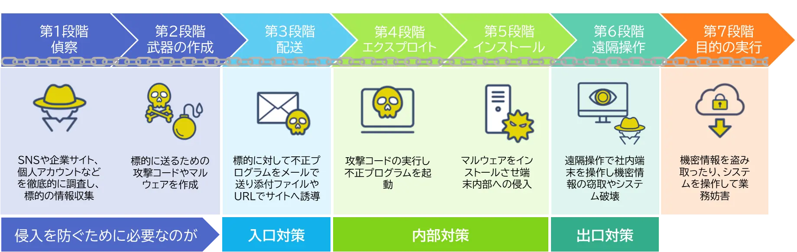
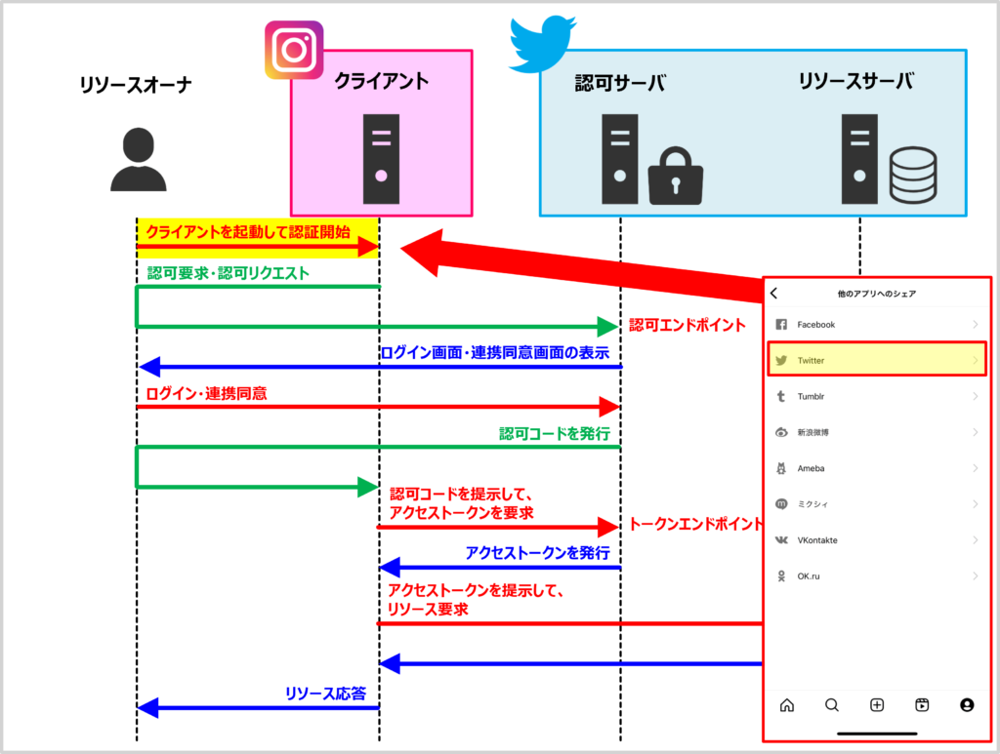
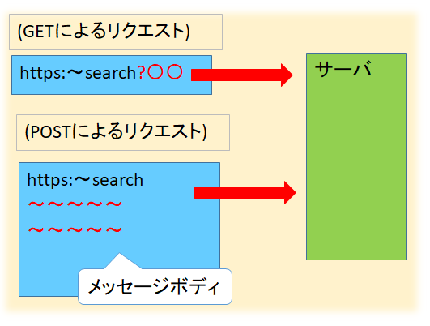

# 情報処理安全確保支援士
## セキュリティ

### 情報セキュリティ

#### TLS（Transport Layer Security）

インターネット上でやり取りするデータを暗号化し、盗聴や改ざん、なりすましを防ぐためのセキュリティプロトコル。TLSにおけるデジタル証明書は次の目的で利用される。

- サーバ認証
- クライアント認証（オプション）
- 共有秘密鍵（暗号化鍵）の安全な生成

#### サイバーキルチェーン攻撃

サイバーキルチェーンは、サイバー攻撃の手順を攻撃者の視点からいくつか段階に分けたモデルであり、以下の7段階が一般的。攻撃者の視点からサイバー攻撃を見ることで、各段階における防 御策の立案に役立てることができます。

1. **偵察** 標的に関する情報を収集して調査する
2. **武器化** 攻撃のためのマルウェアを用意する
3. **配送（デリバリ）** メールやWebサイトを使って標的にマルウェアを送付／配信する、または標的のシステムに侵入する
4. **エクスプロイト（攻撃）** 標的にマルウェアを実行させる
5. **インストール** 標的のPCがマルウェアに感染する
6. **遠隔操作（c&c）** マルウェアとC&Cサーバを通信させて標的のサーバを遠隔操作する
7. **目的の実行** 秘密情報を得る、サービス停止、改ざんなど攻撃者の目的を達成する 

### 情報セキュリティ管理

### セキュリティ技術評価

### 情報セキュリティ対策

#### サイドチャネル攻撃

対象の動作状況を観察し、漏洩電磁波・電力消費等のサイドチャネル情報から暗号鍵推定等を行う非破壊型解析攻撃の総称。サイドチャネル（Side Channel）には、非正規の入出力経路という意味があり、サイドチャネル攻撃の一つである「タイミング攻撃」は暗号処理のタイミングが暗号鍵の論理値に依存して変化することに着目し、暗号化や復号に要する時間の差異を統計的に解析して暗号鍵を推定する手法です。暗号アルゴリズムの実装方法に対する攻撃方法なので、次のような対策が有効となります。 

- 演算アルゴリズムの処理を追加して秘密情報の違いによって演算の処理時間に差異が出ないようにする
- 時間計測を正確に行えないようにする
- ブラインド署名のアルゴリズムの応用 

#### Enhanced Open

Wi-Fiのオープンネットワーク（パスワードなしの接続）において、通信内容を自動で個別暗号化するセキュリティ規格。具体的には、Wi-Fi Allianceが定義したセキュリティ規格で、端末とアクセスポイントの認証プロセスで`Diffie-Hellman`鍵交換を実行し、得られた独自の鍵を利用して暗号化通信を行う仕組みです（認証は行わない）。SSIDを指定するだけで使える公衆無線LANの利便性を保ったまま無線通信が保護されます。これにより、パスワード入力の手間をなくしたまま通信の盗聴を防ぎます。

- **メリット**
  - **パスワードがいらない** 名前（SSID）を選ぶだけで、すぐに繋がります。
  - **通信が安全になる** 電波を盗み見られても、内容が暗号化されているので見られません。
  - **個別で鍵を作る** まわりの人と違う専用の暗号キーを端末ごとに自動で作るため、他の人の通信は覗けません。
- **デメリット（注意点）**
  - **本人確認はできない** パスワードがないため、誰でも接続できます。悪い人が入るのを防ぐことはできません。
  - **偽物に弱い** 本物に似せた「ニセのWi-Fiスポット」を見分ける機能はありません。
  - **古い機器は使えない** 古いスマホやパソコンは、この新しい機能に対応していないことがあります

### セキュリティ実装技術

#### OAuth2.0

**OAuth2.0**は異なるドメインやプラットフォーム間でサードパーティアプリケーションによるHTTPサービスへの限定的なアクセスを可能にするオープンな認可フレームワーク（RFC6749）。ユーザーの許可をもと、ユーザーの代理としてWebサービスにアクセスできる仕組みです。ユーザーの認証情報を直接アプリケーションに渡さなくても、ユーザーの権限を委譲するための安全な方法として利用されます。OAuth2.0では以下の3種類の口ール（役）が登場します。 

- **リソースオーナー（resource owner）** リソースサーバ内の保護された情報へのアクセスを許可するエンドユーザーであり、クライアントの利用者のこと。
- **リソースサーバ（resource server）** 保護された情報を保持し、Webサービスを提供するアプリケーションのこと。リソースオーナーを認証しクライアントにアクセストークンを発行する認可サーバ（authorization server）の役割を兼ねることが多い。
- **クライアント（client）** リソースオーナーの認可を得てリソースサーバにアクセスするサードパーティアプリケーションのこと。

## その他の分野

### データベース

### ネットワーク

#### GETメソッド / POSTメソッド

HTMLフォームからの入力データがWebサーバに送付される時、GETメソッドではURLの一部としてパラメータが記述され、リクエストライン（HTTPリクエストの1行目）に含まれます。一方、POSTメソッドではパラメータはメッセージボディに含まれます。 

**GETメソッド→URL内のクエリパラメータに記述**

送信するパラメータを**URLの末尾に付加する方式**。URL本体とパラメータをIt? IIで区切り、その後に 「キー＝値」の形式でパラメータを指定する 

> GET /search?q=security HTTP/1.1
> Host: www.example.com
> User-Agent:Mozilla/5.0(Windows NT 10.0;Win64;x64)
> ...
> Connection:keep-alive

**POSTメソッド→メッセージボディに含まれる**

送信するパラメータを**メッセージボディに含める方式**。<u>URLにパラメータが含まれないためアクセスログ等にパラメータが記録されにくい</u>。

> POST /login HTTP/1.1
> Host: www.example.com
> User-Agent:Mozilla/5.0(Windows NT 10.0;Win64;x64)
> ...
> Connection:keep-alive
> 
> username=taro&password=abcdl234

### システム開発技術

### ソフトウェア開発管理技術

### サービスマネジメント

### システム監査

