# 情報処理安全確保支援士 <!-- omit in toc -->

- [セキュリティ](#セキュリティ)
  - [情報セキュリティ](#情報セキュリティ)
  - [情報セキュリティ管理](#情報セキュリティ管理)
  - [セキュリティ技術評価](#セキュリティ技術評価)
  - [情報セキュリティ対策](#情報セキュリティ対策)
  - [セキュリティ実装技術](#セキュリティ実装技術)
- [その他の分野](#その他の分野)
  - [データベース](#データベース)
  - [ネットワーク](#ネットワーク)
  - [システム開発技術](#システム開発技術)
  - [ソフトウェア開発管理技術](#ソフトウェア開発管理技術)
  - [サービスマネジメント](#サービスマネジメント)
  - [システム監査](#システム監査)

<div style="page-break-before:always"></div>

## セキュリティ

### 情報セキュリティ

#### 境界型防御とゼロトラスト（例：ADとEntraID） <!-- omit in toc -->

```Mermaid
flowchart LR
  subgraph "【<b>境界型防御</b>】"
    AD["AD DS"]
    AD --> OnPrem["オンプレミス<br>ファイルサーバ・<br>業務システム"]
  end
  
  AD -- ID同期 ---> Entra

  subgraph "【<b>ゼロトラスト</b>】"
    Entra --> M365["Microsoft 365"]
    Entra --> Azure["Azure"]
    Entra --> SaaS["SaaS"]
  end

  style AD fill:#faa
  style Entra fill:#aaf
```

|              | AD                                      | Entra ID                                           |
| ------------ | --------------------------------------- | -------------------------------------------------- |
| 主な環境     | オンプレミス                            | クラウド                                           |
| 管理対象     | PC、サーバー、ユーザー                  | ユーザー、アプリ、クラウドサービス                 |
| ネットワーク | 社内LANとの結び付きが強い               | インターネット前提                                 |
| 認証         | Kerberos / NTLM / <br>LDAP など         | OAuth 2.0 / SAML / SCIM <br> / OpenID Connect など |
| 管理単位     | ドメイン                                | テナント                                           |
| 代表用途     | Windowsログイン、<br>ファイルサーバ認証 | Microsoft 365、Azure、SaaS                         |
| 重要な考え方 | ドメイン中心                            | ID中心                                             |

<div style="page-break-before:always"></div>

**境界型防御**

> **基本的な考え：外部は危険、内部は信頼できる**

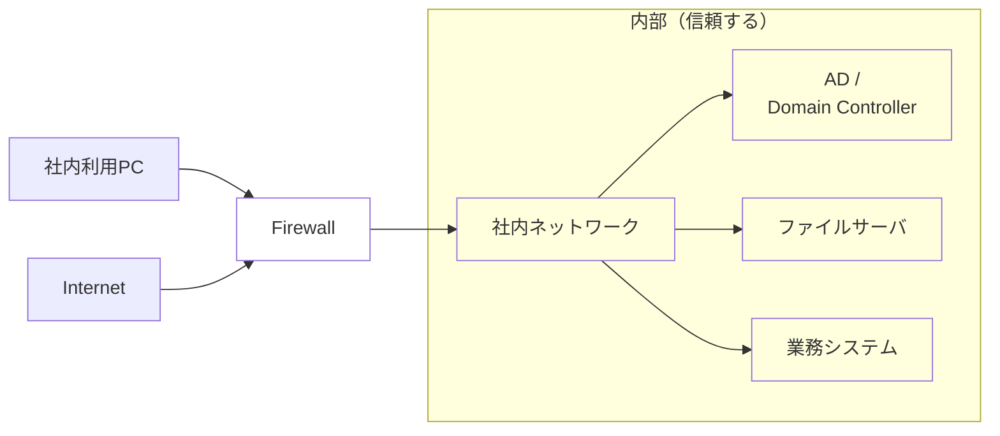
```mermaid
flowchart LR
  PC["社内利用PC"] --> FW["Firewall"]
  FW --> LAN["社内ネットワーク"]
  Internet["Internet"] --> FW
  subgraph "内部（信頼する）"
    LAN --> AD["AD / <br>Domain Controller"]
    LAN --> FS["ファイルサーバ"]
    LAN --> APP["業務システム"]
  end

  style FW fill:none
  style LAN fill:none
  style AD fill:none
  style FS fill:none
  style APP fill:none
```

| 項目             | 境界型防御                                 |
| ---------------- | ------------------------------------------ |
| **防御の中心**   | **ネットワーク境界**                       |
| **外部**         | 信頼しない                                 |
| **内部**         | 比較的信頼する                             |
| **代表技術**     | Firewall、VPN                              |
| **ID管理**       | AD                                         |
| **認証**         | Kerberos、NTLMなど                         |
| **アクセス制御** | ネットワークの場所や接続元などを基準に判断 |
| **権限**         | ADのユーザー・グループなどに基づいて付与   |
| **前提**         | 社内ネットワークをある程度信頼             |

<div style="page-break-before:always"></div>

**ゼロトラスト**

> **注目された背景**：クラウドやテレワークの拡大により、従来の「社内＝信頼、社外＝危険」という境界が崩れた。また、フィッシングなどによる認証情報を窃取する攻撃も増加したため、ネットワークの場所だけでアクセスを信頼する境界型防御では不十分になった。
> 
> **基本的な考え：社内外問わず、何も信頼せず常に検証する**

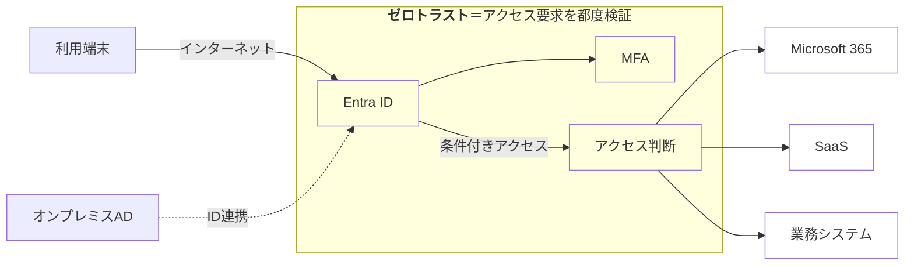
```mermaid
flowchart LR

  PC["利用端末"] --  インターネット --> Entra["Entra ID"]

  subgraph "<b>ゼロトラスト</b>＝アクセス要求を都度検証"
    Entra --> MFA["MFA"]
    Entra -- 条件付きアクセス --> Decision["アクセス判断"]
  end

  Decision --> M365["Microsoft 365"] & SaaS["SaaS"] & APP["業務システム"]

  AD["オンプレミスAD"] -. "ID連携" .-> Entra

  style Entra fill:none
  style MFA fill:none
  style Decision fill:none
  style M365 fill:none
  style SaaS fill:none
  style APP fill:none
```

| 項目             | ゼロトラスト                                           |
| ---------------- | ------------------------------------------------------ |
| **防御の中心**   | **ID・端末・アクセス・データなど**                     |
| **外部**         | 信頼しない                                             |
| **内部**         | 信頼しない                                             |
| **代表技術**     | Entra ID、MFA、Conditional Access                      |
| **ID管理**       | Entra ID                                               |
| **認証**         | OAuth 2.0、OpenID Connect、SAML、MFAなど               |
| **アクセス制御** | 利用者・端末・場所・リスクなどの条件で判断             |
| **権限**         | 最小権限                                               |
| **前提**         | **侵害されることを前提に、アクセスを継続的に検証する** |

<div style="page-break-before:always"></div>


#### SSO（Single Sign-On） <!-- omit in toc -->


- 【**エージェント方式**】Webサーバに**エージェントを導入**し、Cookieなどで認証情報を共有してSSOを実現する方式。
- 【**代理認証方式**】SSOシステムが利用者に代わって**ID・パスワードを各システムへ入力**してSSOを実現する方式。
- 【**リバースプロキシ方式**】Webシステムの**前段にリバースプロキシを配置**し、認証済みの通信を各システムへ中継してSSOを実現する方式。
- 【**フェデレーション方式**】**IdPが利用者を認証し、認証結果をSPへ連携**する認証方式。

| 方式                         | メリット                                                                                   | デメリット                                                                                                     |
| ---------------------------- | ------------------------------------------------------------------------------------------ | -------------------------------------------------------------------------------------------------------------- |
| **エージェント<br>方式**     | ・既存サービスに組込みやすい<br>・サービス毎に認証を制御可能                               | ・SSO対象の各サーバに<br>　導入が必要<br>・同じドメインでの利用が基本                                          |
| **代理認証<br>方式**         | ・既存サービスを大きく<br>　変更せずに導入できる<br>・ログイン操作を自動化できる           | ・クライアントPCにIDと<br>　パスワードの保持が必要<br>・認証情報漏えい時の影響大<br>・ログイン画面の変更に弱い |
| **リバースプロキシ<br>方式** | ・各サービスにエージェントを<br>　導入する必要がない<br>・認証を一元管理できる             | ・リバースプロキシが**単一<br>　障害点**になる可能性がある<br>・冗長化が必要                                   |
| **フェデレーション<br>方式** | ・異なるドメイン間でSSOできる<br>・認証をIdPに集約できる<br>・クラウド製品との連携に適する | ・IdPとSP間の連携設定が必要<br>・IdP障害時に複数サービスへ<br>　影響する                                       |

#### SAML（Security Assertion Markup Language） <!-- omit in toc -->

認証情報を安全に交換するためのXMLベースのマークアップ言語。SAMLを使用することで、同一ドメインに留まらないサイトにおいてもSSOの仕組みやセキュアな認証情報管理を実現できる。

| メリット                       | 内容                                                |
| ------------------------------ | --------------------------------------------------- |
| **SSO**                        | 1回の認証で複数のサービスを利用できる               |
| **認証の一元管理**             | パスワード管理をIdPに集約できる                     |
| **異なるドメイン間で利用可能** | Cookieだけでは実現しにくいドメイン間SSOを実現できる |
| **標準規格**                   | ベンダー独自方式ではなく標準的な方式で連携できる    |
| **パスワードをSPに渡さない**   | SPはユーザーの認証情報そのものを管理しなくてよい    |

| デメリット                | 内容                                                     |
| ------------------------- | -------------------------------------------------------- |
| **IdPへの依存が大きい**   | IdPが停止すると複数サービスにログインできなくなる        |
| **構築・設定が複雑**      | IdP・SP間の信頼関係、証明書、Assertionなどの設定が必要   |
| **証明書管理が必要**      | 署名検証用証明書の更新・失効管理が必要                   |
| **Assertionの漏洩に注意** | 攻撃者に盗まれると、不正ログインに利用される可能性がある |

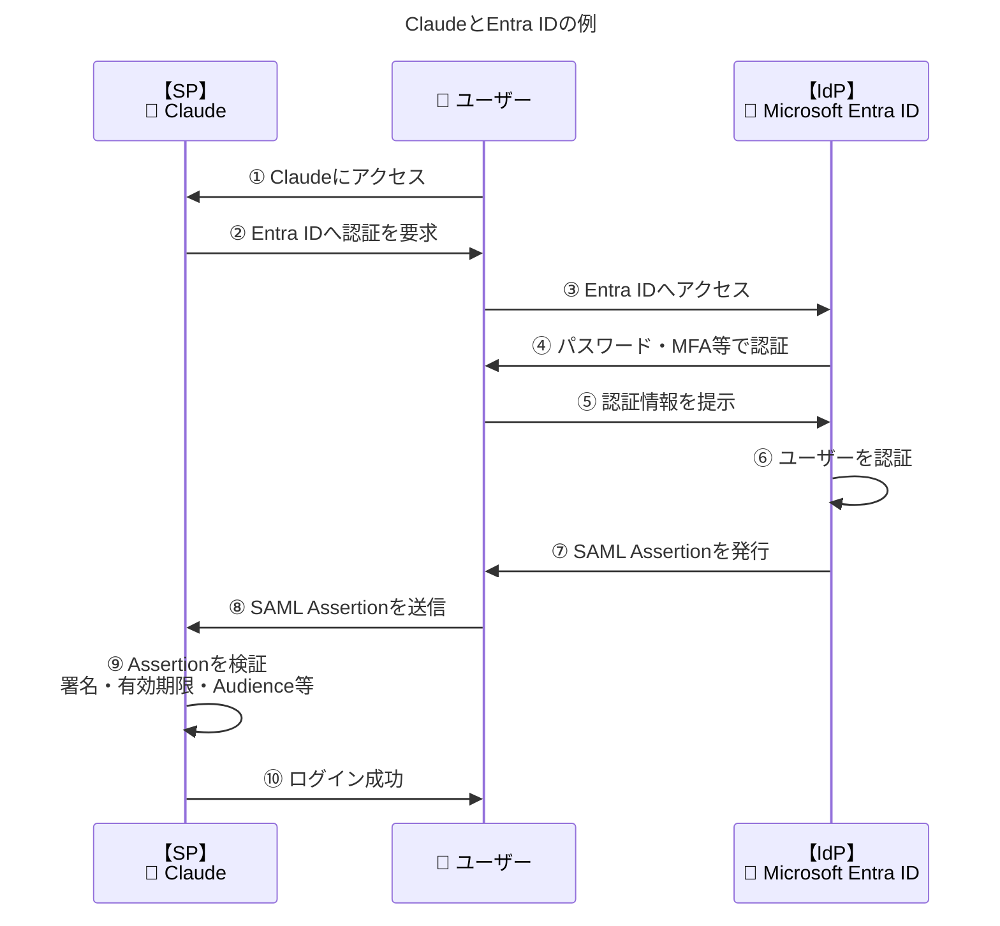
```mermaid
---
title: ClaudeとEntra IDの例
---
sequenceDiagram
    participant C as 【SP】<br>🤖 Claude
    participant U as 👤 ユーザー
    participant E as 【IdP】<br>🔐 Microsoft Entra ID

    U->>C: ① Claudeにアクセス
    C->>U: ② Entra IDへ認証を要求
    U->>E: ③ Entra IDへアクセス
    E->>U: ④ パスワード・MFA等で認証
    U->>E: ⑤ 認証情報を提示
    E->>E: ⑥ ユーザーを認証
    E->>U: ⑦ SAML Assertionを発行
    U->>C: ⑧ SAML Assertionを送信
    C->>C: ⑨ Assertionを検証<br/>署名・有効期限・Audience等
    C->>U: ⑩ ログイン成功
```

|   No.    | 攻撃例                          | 具体的な攻撃                 | 主な対策                                        |
| :------: | ------------------------------- | ---------------------------- | ----------------------------------------------- |
|  **①**   | **フィッシング**                | 偽の認証画面で認証情報を窃取 | **MFA / FIDO2**                                 |
| **③〜⑤** | **中間者攻撃**                  | 認証通信を盗聴・改ざん       | **HTTPS / TLS**                                 |
|  **⑧**   | **リプレイ攻撃**                | 盗んだSAML Assertionを再利用 | **有効期限・発行時刻・<br>AssertionID等の検証** |
|  **⑧**   | **Assertion流用**               | 別のSP向けにAssertionを使用  | **Audienceの検証**                              |
|  **⑨**   | **Assertionの<br>改ざん・偽造** | Assertionを改ざん・偽造      | **XML電子署名の検証**                           |

#### マルウェアMirai <!-- omit in toc -->


ネットワークカメラや家庭用ルータやスマート家電などのIoT機器に感染してボット化するマルウェア。`Mirai` が構築したボットネットは過去最大級の規模のDDoS攻撃を引き起こしています。
　また、`Mirai` はソースコードが公開されているため様々な亜種が生まれており、IoT機器におけるセキュリティ上の脅威となっています。

1. 攻撃者がインターネット上のIoT機器をランダムに探索する
2. `Telnet`などの公開サービスに接続を試みる
3. 工場出荷時の初期設定のID・パスワードなどを使って辞書攻撃を行う
4. IoT機器に不正侵入し、`Mirai`に感染させる
5. 感染したIoT機器をボットネットとして支配する
6. C&Cサーバの指示に従って大量の感染IoT機器から特定のサーバへDDoS攻撃を行う

**対策**

- 工場出荷時のIoT機器の<font color=red>初期ID・パスワードを変更</font>する（**推測されにくいパスワード**設定）
- <font color=red>Telnetなど不要なサービスを停止</font>する
- **不要なポートを閉鎖**する
- IoT機器の<font color=red>ファームウェアを最新の状態に更新</font>し、**インターネットへの直接公開を最小限にする**
- FWなどで<font color=red>不要な外部からの接続を遮断</font>し、IoT機器からの**不審な通信や大量通信を監視**する
- IoT機器を業務ネットワークなどから**ネットワーク分離**する

#### NTP（Network Time Protocol）リフレクション攻撃 <!-- omit in toc -->


ネットワーク機器を正しい時刻に合わせるためのNTPの仕組みを悪用した**反射型DoS攻撃の一種**。

1. 送信元IPアドレスを詐称したリクエストパケットを公開NTPサーバに対して大量に送り付ける。リクエストパケットにはNTPサーバが過去にやり取りした最大600件のアドレスを返す`monlist`コマンドを指定する。
<font color=red>※【**`monlist`**】NTPサーバが保持している最近のクライアントIPアドレス、接続時刻、接続回数アドを取得するためのNTPサーバの管理用コマンド</font>
2. 公開NTPサーバは大量のアドレスが記述されたレスポンスパケットを詐称された送信元IPアドレス宛に送信する。
3. 大量のレスポンスパケットが送信されたサイトではトラフィックが大幅に増加し、サービス不能に陥る。
4. 大量のNTPサーバーから増幅された巨大な応答データが一斉に標的に送りつけられ、回線やサーバーの処理能力が低下・パンクする。

攻撃の流れとしてはDNS amp攻撃などと同様ですが、NTPの`monlist`の仕様上、200バイト程度のリクエストに対して、その100倍以上のレスポンスパケットが生じることもあり、パケットの増幅率の大きさが特徴の1つになっています。対策は以下の通りです。

- 【**対策1：monlistの無効化**】設定ファイル（/etc/ntp.conf）に disable monitor を追加します。統計情報の要求（MONLISTコマンド）に対する応答を止めます。
- 【**対策2：アクセス制限（ファイアウォール）**】外部へ公開する必要がないNTPサーバーは、インターネットからのUDP 123番ポートへのアクセスを遮断します。内部ネットワークや信頼できるIPからのアクセスのみ許可します。
- 【**対策3：NTP機能の停止**】サーバーやルーターでNTPサーバー機能を使わない場合は、サービス自体を停止します。

#### Smurf攻撃 <!-- omit in toc -->


Smurf 攻撃(スマーフアタック)とは、ネットワークの疎通確認に使用される **`ICMP echo request(ping)`** の仕組みを悪用して、相手のコンピュータやネットワークに大量のパケットを送りつける反射型のDoS攻撃です。攻撃者は以下の手順で攻撃対象のサービスを妨害します。

1. 送信元IPアドレスを攻撃対象のコンピュータに**偽装**した `ICMP echo request` を、攻撃対象が属す るネットワークに**ブロードキャスト**で大量に送りつける
2. `ICMP echo request` を受け取ったネットワーク内の端末が一斉に攻撃対象に "echo reply"パケットで応答する
3. 大量の応答パケットの発生により、攻撃対象のコンピュータおよびネットワークが過負荷状態になり正常なサービスが阻害される

- 【**対策1：ブロードキャストの無効化**】ルーターでICMPブロードキャスト要求を無視するように設定する。
- 【**対策2：パケットフィルタリング**】自社ネットワーク外からの偽装IPパケット（送信元が内部IPの外部パケットなど）を遮断する。

#### 不正ログイン攻撃 <!-- omit in toc -->

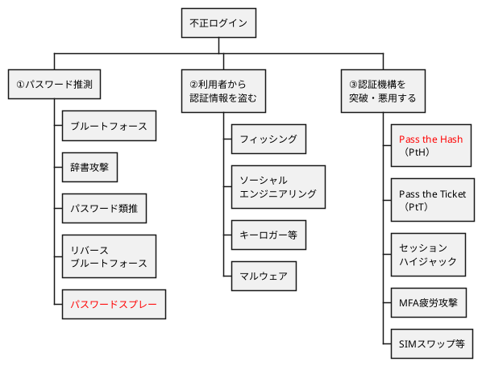
```plantuml
@startwbs

* 不正ログイン

** ①パスワード推測
*** ブルートフォース
*** 辞書攻撃
*** パスワード類推
*** リバース\nブルートフォース
*** <color red>パスワードスプレー

** ②利用者から\n認証情報を盗む
*** フィッシング
*** ソーシャル\nエンジニアリング
*** キーロガー等
*** マルウェア

** ③認証機構を\n突破・悪用する
*** <color red>Pass the Hash\n（PtH）
*** Pass the Ticket\n（PtT）
*** セッション\nハイジャック
*** MFA疲労攻撃
*** SIMスワップ等

@endwbs
```

| 攻撃                                        | 説明                                                                                                     | 対策                                           |
| ------------------------------------------- | -------------------------------------------------------------------------------------------------------- | ---------------------------------------------- |
| **ブルートフォース**                        | **1 ID × 多PW**：<br>1つのアカウントに対して、<br>パスワードを総当たりで大量に試す                       | **ログイン試行回数制限・<br>アカウントロック** |
| **辞書攻撃**                                | **辞書 × PW**：<br>辞書にある単語や文字列を<br>パスワード候補として試す                                  | **強固なパスワード・MFA**                      |
| **パスワード類推**                          | **個人情報 → PW**：<br>氏名・誕生日・ペット名などから<br>パスワードを推測する                            | **推測困難な<br>パスワード・MFA**              |
| **リバース<br>ブルートフォース**            | **多ID × 1PW**：<br>1つのパスワードを固定し、<br>多数のアカウントに対して試す                            | **MFA・異常な認証試行の監視**                  |
| <font color=red><b>パスワードスプレー       | **多ID × 少PW**：<br>よく使われるパスワードを<br>多数のアカウントに分散して試す                          | **MFA・異常な認証試行の監視**                  |
| **フィッシング**                            | **偽サイトで盗む**：<br>偽サイトなどに誘導し、<br>ID・パスワードなどを入力させて盗む                     | **フィッシング耐性認証・<br>利用者教育**       |
| **ソーシャル<br>エンジニアリング**          | **人を騙して盗む**：<br>なりすましや誘導により、<br>本人から認証情報を聞き出す                           | **利用者教育・本人確認の徹底**                 |
| **キーロガー等**                            | **入力を記録**：<br>キーボード入力などを記録し、<br>ID・パスワードを盗む                                 | **EDR・マルウェア対策**                        |
| **マルウェア**                              | **端末から盗む**：<br>マルウェアにより、<br>認証情報やCookieなどを窃取する                               | **EDR・OS/ソフトウェアの更新**                 |
| <font color=red><b>Pass the Hash<br>（PtH） | **ハッシュを使う**：<br>盗んだNTLMハッシュなどを<br>パスワードの代わりに利用して認証する                 | **NTLMの利用抑制・<br>Credential Guard**       |
| **Pass the Ticket<br>（PtT）**              | **Kerberosチケットを使う**：<br>盗んだKerberosチケットを利用し、<br>正規ユーザになりすましてアクセスする | **Credential Guard・<br>特権アカウント管理**   |
| **セッション<br>ハイジャック**              | **ログイン後を乗っ取る**：<br>正規ユーザのセッション情報を奪い、<br>本人になりすまして操作する           | **HTTPS・セッション管理の強化**                |
| **MFA疲労攻撃**                             | **承認を連打させる**：<br>MFA認証要求を繰り返し送り、<br>利用者に誤って承認させる                        | **数字チャレンジ・<br>FIDO2**                  |
| **SIMスワップ等**                           | **電話番号を乗っ取る**：<br>携帯電話番号を攻撃者側のSIMへ移し、<br>SMS認証などを突破する                 | **SMS以外のMFA・<br>本人確認の強化**           |

<div style="page-break-before:always"></div>

#### サイバーキルチェーン攻撃 <!-- omit in toc -->


サイバーキルチェーンは、サイバー攻撃の手順を攻撃者の視点からモデルしたものであり、以下の7段階が一般的。各段階における防御策の立案に役立てることができます。

1. **偵察** 標的に関する情報を収集して調査する
2. **武器化** 攻撃のためのマルウェアを用意する
3. **配送（デリバリ）** メールやWebサイトを使って標的にマルウェアを送付／配信する、または標的のシステムに侵入する
4. **エクスプロイト（攻撃）** 標的にマルウェアを実行させる
5. **インストール** 標的のPCがマルウェアに感染する
6. **遠隔操作（c&c）** マルウェアとC&Cサーバを通信させて標的のサーバを遠隔操作する
7. **目的の実行** 秘密情報を得る、サービス停止、改ざんなど攻撃者の目的を達成する 

#### メッセージ認証符号（MAC: Message Authentication Code） <!-- omit in toc -->

メッセージ認証符号とは、やり取りされるメッセージと送信者と受信者が持つ共通鍵をもとに生成される固定長のビット列で受信者側でメッセージ生成元の認証とメッセージの完全性を確認するために使われます。以下の2つの方式が代表的です。

- **CMAC（Cipher-based MAC）** メッセージをブロック暗号アルゴリズムで暗号化し、暗号文の最後のブロックをMACとして利用する
- **HMAC（Hash function-based MAC）** メッセージと共通鍵を組み合わせたものをハッシュ化したものをMACとして利用するMACを用いたメッセージ認証。手順は次のとおり。なおメッセージ自体は暗号化されていないため受信者側での復号は不要。
  1. 送信者はメッセージを共通鍵で暗号化してMACを生成し、メッセージとともに送信する
  2. 受信者は受け取ったメッセージと共通鍵を使用して同様の方法でMACを生成し、受信したMACと自分が生成したMACを比較する
  3. メッセージ、鍵、アルゴリズムが同じであれば、生成されるMACは同じになるので、両者が一致すればメッセージの破損・改ざんがないことを確認できる

#### PQC（Post-Quantum Cryptography：耐量子暗号） <!-- omit in toc -->

`Post-Quantum`とは、量子コンピュータ実現後の世界のことを示しています。現代において基礎技術となっている公開鍵暗号では、素因数分解や離散対数問題を解く際に天文学的な計算量を要することを安全性の根拠としていますが、量子コンピュータが実現するとこれらが効率的に解けるようになってしまいます。
PQCは量子コンピュータによる解読に対しても耐性をもつ暗号化方式を指します。量子コンピュータの登場を見据えて開発が進められています。

#### AES（Advanced Encryption Standard） <!-- omit in toc -->


データの暗号化と復号に同じ鍵を使う「共通鍵暗号方式」の代表的な規格。以下の特徴を持つ。

- <font color=red>鍵の長さは 128ビット・192ビット・256ビット の3種類</font>から選べ、数字が大きいほど安全性が高くなる。
- 暗号化処理では、①SubBytes、②ShiftRows、③MixColumns、④AddRoundKeyの4つを行います。
  1. 【**①SubBytes**】専用の変換表（S-box）を使って1バイトずつ別の値に置き換える。
  2. 【**②ShiftRows**】行列の行ごとにバイトを左へ巡回シフトさせる。
  3. 【**③MixColumns**】列単位でデータを数学的に混合・撹拌する。
  4. 【**④AddRoundKey**】 拡張された鍵（ラウンド鍵）とデータの排他的論理和を取る。

#### ブロック暗号 <!-- omit in toc -->

**固定長のビット列ごとにまとめて暗号化する仕組み**。実際にプログラム上などで暗号方式を指定する際には、仮に AESであれば 「AES -128-CBC」といった形で指定します。最後の「CBC」が暗号利用モードの指定です。ブロック暗号の暗号利用モードは`CTR`の他に`ECB`、`CBC`、`CFB`、`OFB`などがあります。

- **ECB(Electronic CodeBook)** 平文ブロックごとに暗号化したものを、 そのままを暗号文ブロックとする (解析される危険性があるため非推奨)
- **CBC(Cipher Block Chaining)** ひとつ前の暗号文ブロックと平文ブロックの排他的論理和をとり、 排他的論理和の値に暗号化を行っ て暗号文ブロックを得る
- **CFB (Cipher FeedBack)** ひとつ前の暗号文ブロックをさらに暗号化し、 それと平文ブロックの排他的論理和を行って暗号文ブ ロックを得る
- **OFB (Output FeedBack)** 暗号アルゴリズムの出力と平文ブロックの排他的論理和を行って暗号文ブロックを得る
- <font color=red><b>CTR (CounTeR)</b> 1ずつ増加していくカウンターを利用した鍵ストリームと、平文ブロックの排他的論理和をとって暗号文ブロックを得る</font>


```text
ブロック暗号
  │
  ├─ ブロック単位
  │   ├─ ECB  ── 独立処理だが安全性に問題
  │   └─ CBC  ── 前ブロックに依存
  │
  └─ ストリーム的
      ├─ CFB
      ├─ OFB
      └─ CTR ── 並列処理可能
                  │
                  └─ CTR + 認証
                         ↓
                        GCM
                   （暗号化＋認証）
```

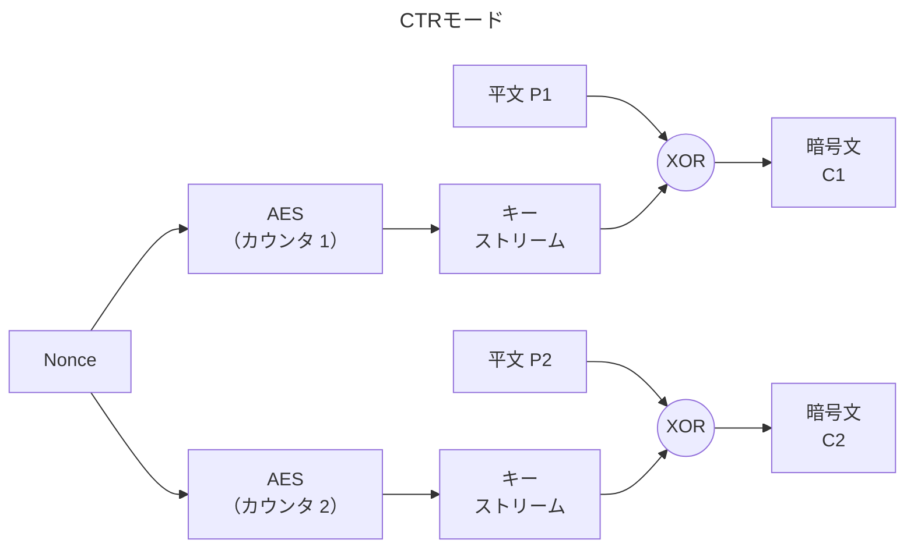
```mermaid
---
title: CTRモード
---

flowchart LR
  N[Nonce] --> A1[AES<br>（カウンタ 1）] --> S1[キー<br>ストリーム]
  P1[平文 P1] --> X1((XOR))
  S1 --> X1 --> C1[暗号文<br>C1]

  N --> A2[AES<br>（カウンタ 2）] --> S2[キー<br>ストリーム]
  P2[平文 P2] --> X2((XOR))
  S2 --> X2 --> C2[暗号文<br>C2]
```

#### XMLデジタル署名 <!-- omit in toc -->

```xml
<!-- 元データ：invoice.xml -->
<invoice>
    <amount>10000</amount>
    <customer>山田太郎</customer>
</invoice>

<!-- 署名：signature.xml -->
<Signature>
    <SignedInfo>
        <Reference URI="invoice.xml"/>
    </SignedInfo>
    <SignatureValue>
        ABCDEFG...
    </SignatureValue>
</Signature>
```

XMLデジタル署名は、 XML文書にデジタル署名を埋め込むための仕様で、 RFC 3075として標準化され ています。 デジタル署名と同様に完全性・認証・ 否認防止などのセキュリティ機能を提供します。

XMLデジタル署名には、署名と署名対象の関係性によって3つがあります。

- **デタッチ署名 (Detached Signature)** 署名と署名対象が独立している方式。上の`invoid.xml`と`signature.xml`を完全に分離したものであり、紙の契約書と別紙の署名証明書のようなもののイメージ。
- **エンベロープ署名 (Enveloped Signature)** 署名対象の内部に署名を埋め込む方式
  ```xml
  <!-- エンベロープ署名 -->
  <invoice>
      <amount>10000</amount>
      <customer>山田太郎</customer>
      <Signature>
          <SignedInfo>
              ...
          </SignedInfo>
          <SignatureValue>
              ABCDEFG...
          </SignatureValue>
      </Signature>
  </invoice>
  ```
- **エンベローピング署名 (Enveloping Signature)** 署名の内部に署名対象を埋め込む方式
  ```xml
  <!-- エンベローピング署名 -->
  <Signature>
      <SignedInfo>
          ...
      </SignedInfo>
      <SignatureValue>
          ABCDEFG...
      </SignatureValue>
      <Object>
          <invoice>
              <amount>10000</amount>
              <customer>山田太郎</customer>
          </invoice>
      </Object>
  </Signature>
  ```

<div style="page-break-before:always"></div>

#### PKI（公開鍵基盤） <!-- omit in toc -->

**構成要素**

- **RA**：**本人確認・登録**を行う。分離することが多いが、CAが兼務する場合あり。
- **CA**：PKIの中心。デジタル署名付与、証明書発行・失効を行う。
- **IA**：**証明書発行**を行う。CA内部の発行機能として考えると分かりやすい。
- **VA**：**証明書の有効性検証**を行う。CAと分離する場合も、CAが機能を兼務する場合もある。

**実際の構成**

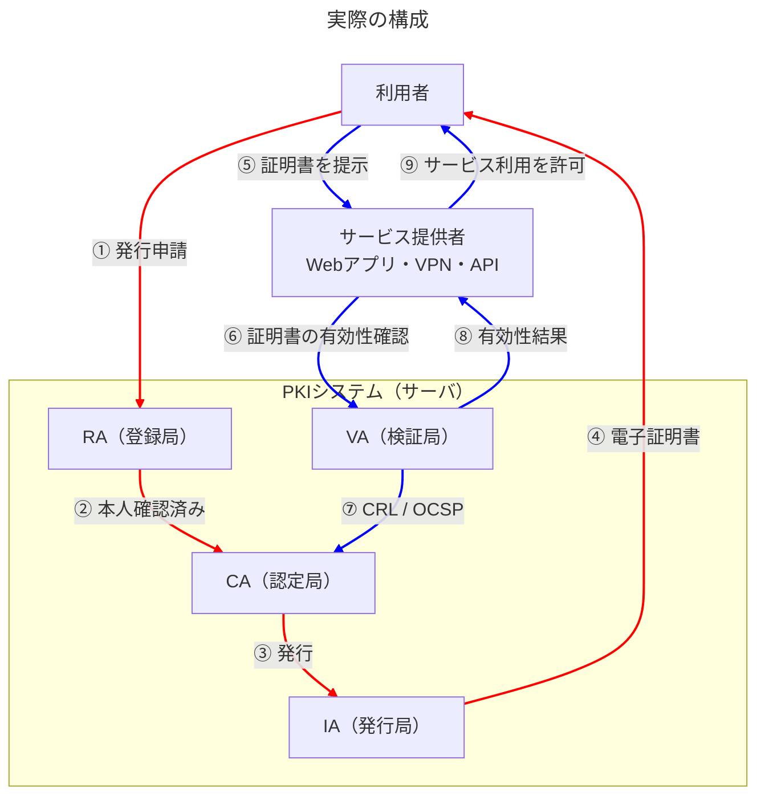
```mermaid
---
title: 実際の構成
---

flowchart TB
  U[利用者]

  subgraph CA_GROUP[PKIシステム（サーバ）]
    RA[RA（登録局）]
    CA[CA（認定局）]
    IA[IA（発行局）]
    VA[VA（検証局）]
  end

  SP[サービス提供者<br>Webアプリ・VPN・API]

  U -->|① 発行申請| RA
  RA -->|② 本人確認済み| CA
  CA -->|③ 発行| IA
  IA -->|④ 電子証明書| U

  U -->|⑤ 証明書を提示| SP
  SP -->|⑥ 証明書の有効性確認| VA
  VA -->|⑦ CRL / OCSP| CA
  VA -->|⑧ 有効性結果| SP
  SP -->|⑨ サービス利用を許可| U

  %% ①〜④：赤
  linkStyle 0,1,2,3 stroke:#FF0000,stroke-width:2px

  %% ⑤〜⑨：青
  linkStyle 4,5,6,7,8 stroke:#0000FF,stroke-width:2px
```

**証明書登録フロー**

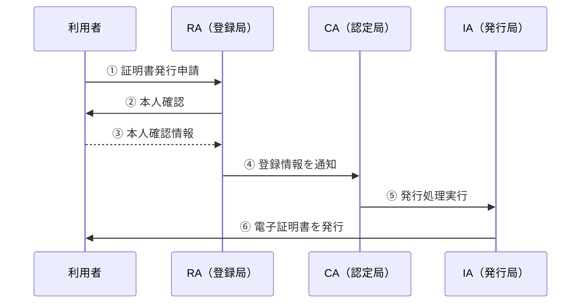
```mermaid
sequenceDiagram
  participant U as 利用者
  participant RA as RA（登録局）
  participant CA as CA（認定局）
  participant IA as IA（発行局）

  U->>RA: ① 証明書発行申請
  RA->>U: ② 本人確認
  U-->>RA: ③ 本人確認情報
  RA->>CA: ④ 登録情報を通知
  CA->>IA: ⑤ 発行処理実行
  IA->>U: ⑥ 電子証明書を発行
```

**証明書検証フロー**

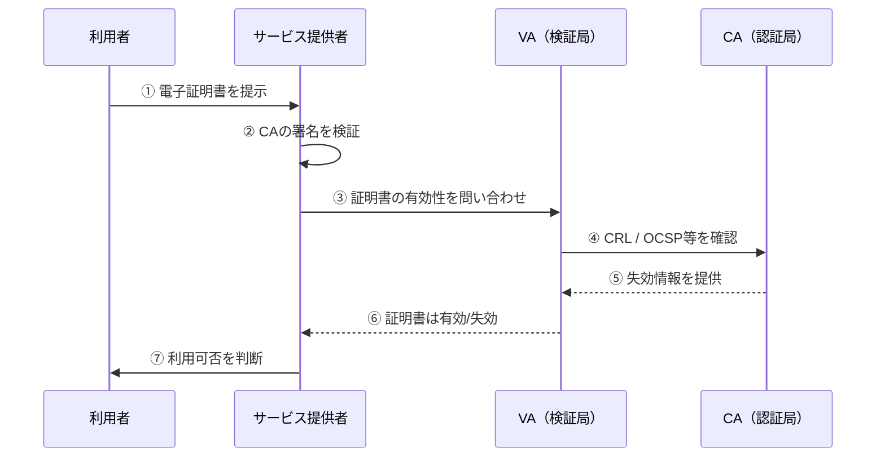
```mermaid
sequenceDiagram
  participant U as 利用者
  participant S as サービス提供者
  participant VA as VA（検証局）
  participant CA as CA（認証局）

  U->>S: ① 電子証明書を提示
  S->>S: ② CAの署名を検証
  S->>VA: ③ 証明書の有効性を問い合わせ
  VA->>CA: ④ CRL / OCSP等を確認
  CA-->>VA: ⑤ 失効情報を提供
  VA-->>S: ⑥ 証明書は有効/失効
  S->>U: ⑦ 利用可否を判断
```

PKIの中心となる役割を果たすのはデジタル証明書を発行する`CA（認定局）`ですが、一般にCAはデジタル証明書の審査を行う`RA（登録局）`、RAから依頼されたデジタル証明書の発行及び失効を行う`IA（発行局）`、発行局で発行及び失効されたデジタル証明書・失効リスト（CRL: Certificate Revocation List）や認証実施規定等を公開するリポジトリなどで構成されています。

<div style="page-break-before:always"></div>

#### ハッシュ関数（Hash Function） <!-- omit in toc -->

任意の長さのデータから**固定長のビット列**を生成する一方向性の関数（<font color=red>ハッシュ値から元のメッセージを求めることが困難である性質</font>）。入力が1ビットでも変われば出力が大きく変化する（雪崩効果）ため、**改ざん検知**の基礎技術となる。

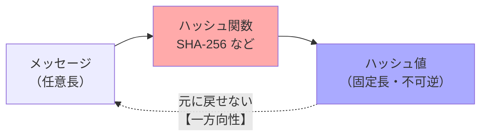
```mermaid
flowchart LR
  M1["メッセージ<br>（任意長）"] --> H["ハッシュ関数<br>SHA-256 など"]
  H --> D["ハッシュ値<br>（固定長・不可逆）"]
  D -. "元に戻せない<br>【一方向性】" .-> M1

  style H fill:#faa
  style D fill:#aaf
```

**ハッシュ値に対する攻撃と対策**

- 【**バースデー攻撃**】誕生日のパラドックスを利用し、<font color=red>nビットのハッシュ値に対して約 2<sup>n/2</sup> 回の試行で衝突を発見する</font>攻撃。→ **十分な出力長（256ビット以上）の関数を使用**する。
- 【**レインボーテーブル攻撃**】平文とハッシュ値の対応表を事前計算しておき、漏えいしたハッシュ値から元のパスワードを高速に逆引きする攻撃。→ **ソルト**と**ストレッチング**で対策する。
  - 【**ソルト（salt）**】<font color=red>利用者ごとに異なる乱数をパスワードに連結してからハッシュ化する</font>手法。同じパスワードでも異なるハッシュ値になるため、**事前計算表（レインボーテーブル）が無効化**され、同一パスワード利用者の特定も防げる。
  - 【**ストレッチング（stretching）**】<font color=red>ハッシュ計算を数千〜数万回繰り返す</font>ことで1回あたりの計算コストを引き上げ、総当たり攻撃の速度を落とす手法。PBKDF2、bcrypt、scrypt、Argon2などが用いられる。

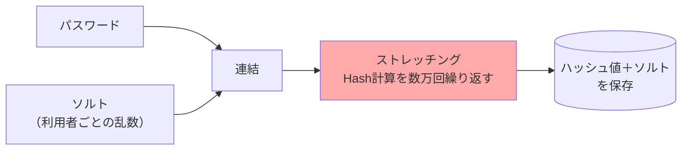
```mermaid
flowchart LR
  P["パスワード"] --> C["連結"]
  S["ソルト<br>（利用者ごとの乱数）"] --> C
  C --> ST["ストレッチング<br>Hash計算を数万回繰り返す"]
  ST --> DB[("ハッシュ値＋ソルト<br>を保存")]

  style ST fill:#faa
```

<div style="page-break-before:always"></div>

#### 鍵交換（DH・ECDH） <!-- omit in toc -->

共通鍵暗号を使うには**通信相手と同じ鍵を安全に共有する**必要がある。この「鍵配送問題」を、盗聴されている通信路上でも鍵を共有できる形で解決するのが**鍵交換アルゴリズム**。

```mermaid
sequenceDiagram
    participant A as 👤 Aさん
    participant N as 📡 通信路（盗聴可能）
    participant B as 👤 Bさん

    Note over A,B: 公開値 $$p, g$$ は事前に共有（公開してよい）
    A->>A: ① 秘密の乱数 $$a$$ を生成
    B->>B: ② 秘密の乱数 $$b$$ を生成
    A->>N: ③ $$g^a mod p$$ を送信
    N->>B: ④ 受信
    B->>N: ⑤ $$g^b mod p$$ を送信
    N->>A: ⑥ 受信
    A->>A: ⑦ $$(g^b)^a mod p$$ を計算
    B->>B: ⑧ $$(g^a)^b mod p$$ を計算
    Note over A,B: 同じ共有鍵 $$g^{(ab)} mod p$$ が得られる<br>盗聴者は $$a, b$$ を知らないため算出できない
```

- 【**DH（Diffie-Hellman）鍵交換**】<font color=red>離散対数問題の困難性</font>を利用し、**鍵そのものを通信路に流さずに**共有鍵を生成する方式。
- 【**ECDH（楕円曲線DH）**】楕円曲線上の離散対数問題を利用したDH。**より短い鍵長で同等の強度**が得られるため、モバイル機器やIoT機器に適する。
- 【**DHE / ECDHE**】通信のたびに**一時的な（Ephemeral）乱数**を使い捨てる方式。

> **注意点**：DH鍵交換自体には<font color=red>通信相手を認証する機能がないため、中間者攻撃（MITM）に対して脆弱</font>である。TLSではサーバ証明書による**デジタル署名で相手を認証**したうえでDH鍵交換を行うことで、この弱点を補っている。

#### 公開鍵暗号（RSA・楕円曲線暗号）とハイブリッド暗号 <!-- omit in toc -->

| 項目             | **RSA**                                                   | **楕円曲線暗号（ECC）**                     |
| ---------------- | --------------------------------------------------------- | ------------------------------------------- |
| 安全性の根拠     | **素因数分解問題**の困難性                                | **楕円曲線上の離散対数問題**の<br>困難性    |
| 鍵長の目安       | 2048ビット以上（3072ビット推奨）                          | 224〜256ビット                              |
| 特徴             | 実績が豊富で広く普及                                      | **短い鍵長で同等の強度**・<br>処理が軽量    |
| 主な用途         | デジタル署名、証明書、鍵配送                              | TLS（ECDHE / ECDSA）、<br>モバイル・IoT機器 |
| 量子計算機の影響 | **Shorのアルゴリズムで解読可能**<br>（PQCへの移行が課題） | 同左                                        |

**ハイブリッド暗号**

公開鍵暗号は<font color=red>処理が重い</font>、共通鍵暗号は<font color=red>鍵配送が難しい</font>という双方の弱点を補う方式。**鍵の受け渡しだけを公開鍵暗号で行い、実データは共通鍵暗号で暗号化**する。TLSやS/MIMEはこの方式を採用している。

<div style="page-break-before:always"></div>

#### 利用者認証（多要素認証・生体認証・リスクベース認証） <!-- omit in toc -->

**認証の3要素**

| 要素                         | 意味                             | 具体例                                   | 弱点                     |
| ---------------------------- | -------------------------------- | ---------------------------------------- | ------------------------ |
| **知識**（What<br>you know） | 本人だけが<br>**知っている**情報 | パスワード、PIN、<br>秘密の質問          | 漏えい・推測・使い回し   |
| **所持**（What<br>you have） | 本人だけが<br>**持っている**物   | ICカード、スマホ、<br>HWトークン、証明書 | 紛失・盗難               |
| **生体**（What<br>you are）  | 本人固有の<br>**身体的特徴**     | 指紋、静脈、<br>虹彩、顔、声紋           | 変更できない・なりすまし |

- 【**多要素認証（MFA）**】<font color=red>上記の異なる要素を2つ以上組み合わせる</font>認証。「パスワード＋秘密の質問」は<u>どちらも知識要素なので多要素ではなく多段階認証</u>である点に注意。
- 【**リスクベース認証**】接続元IPアドレス・国・端末・時間帯・操作の癖などから**普段と異なる（リスクが高い）アクセスを検出した場合にのみ追加の認証を要求**する方式。利便性を保ちながら不正ログインを抑止できる。
- 【**ワンタイムパスワード（OTP）**】1回限り有効なパスワード。時刻同期方式（**TOTP**）、カウンタ同期方式（HOTP）、チャレンジレスポンス方式がある。

**生体認証の精度指標**

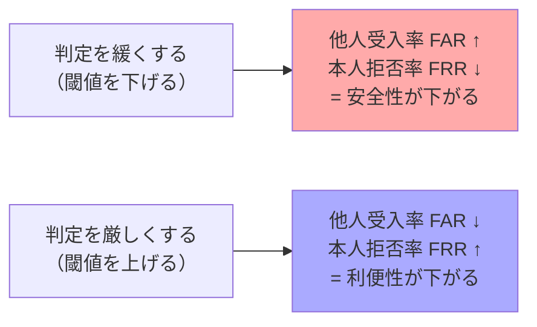
```mermaid
flowchart LR
  L["判定を緩くする<br>（閾値を下げる）"] --> A["他人受入率 FAR ↑<br>本人拒否率 FRR ↓<br>= 安全性が下がる"]
  S["判定を厳しくする<br>（閾値を上げる）"] --> B["他人受入率 FAR ↓<br>本人拒否率 FRR ↑<br>= 利便性が下がる"]

  style A fill:#faa
  style B fill:#aaf
```

- 【**FAR（False Acceptance Rate：他人受入率）**】<font color=red>本人ではない他人を誤って受け入れてしまう割合</font>。**低いほど安全**。
- 【**FRR（False Rejection Rate：本人拒否率）**】<font color=red>本人であるのに誤って拒否してしまう割合</font>。**低いほど利便性が高い**。
- 【**CER（Crossover Error Rate：等価エラー率）**】FARとFRRが等しくなる点。<u>この値が小さいほど、その生体認証システムの精度が高い</u>と評価できる。
- FARとFRRは<font color=red>トレードオフの関係</font>にあり、判定の閾値によって一方を下げれば他方が上がる。用途に応じた閾値設定が必要。

#### FIDO2 / WebAuthn（パスキー） <!-- omit in toc -->

**公開鍵暗号を用いたパスワードレス認証の標準規格**。FIDO2は、ブラウザとサーバ間のAPI仕様である**WebAuthn**と、認証器（スマホ・生体センサ・セキュリティキー）と端末間の通信仕様である**CTAP**から構成される。

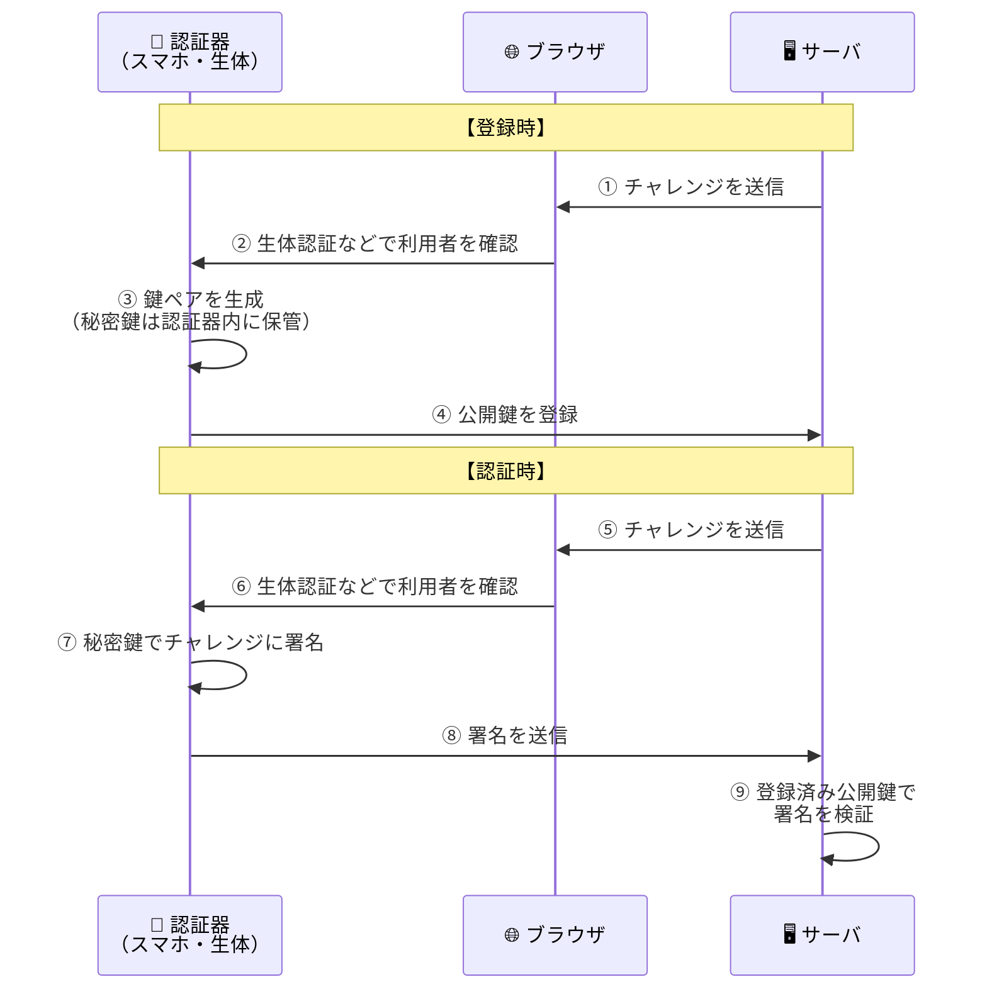
```mermaid
sequenceDiagram
    participant A as 🔑 認証器<br>（スマホ・生体）
    participant B as 🌐 ブラウザ
    participant S as 🖥️ サーバ

    Note over A,S: 【登録時】
    S->>B: ① チャレンジを送信
    B->>A: ② 生体認証などで利用者を確認
    A->>A: ③ 鍵ペアを生成<br>（秘密鍵は認証器内に保管）
    A->>S: ④ 公開鍵を登録
    Note over A,S: 【認証時】
    S->>B: ⑤ チャレンジを送信
    B->>A: ⑥ 生体認証などで利用者を確認
    A->>A: ⑦ 秘密鍵でチャレンジに署名
    A->>S: ⑧ 署名を送信
    S->>S: ⑨ 登録済み公開鍵で<br>署名を検証
```

- <font color=red>秘密鍵は認証器から外に出ず、サーバにはパスワードも生体情報も保存されない</font>ため、**サーバ側の漏えいで認証情報が流出しない**。
- 認証器が<font color=red>アクセス先のオリジン（ドメイン）を検証</font>するため、偽サイトでは署名を行わない。**フィッシング耐性**を持つことが最大の特長。
- 生体情報は<font color=red>認証器内での本人確認にのみ使われ、ネットワークには流れない</font>。
- 【**パスキー（Passkey）**】FIDO2の鍵をクラウド経由で複数端末に同期し、実用性を高めたもの。端末の紛失時も他端末から利用できる。

| 比較項目         | パスワード認証       | FIDO2 / パスキー                       |
| ---------------- | -------------------- | -------------------------------------- |
| サーバの保管情報 | ハッシュ化パスワード | **公開鍵のみ**（漏えいしても悪用不可） |
| フィッシング耐性 | なし                 | **あり**（オリジン検証）               |
| 総当たり攻撃     | 受ける               | 受けない                               |
| 利用者の負担     | 記憶と入力が必要     | 生体・PINのみ                          |

<div style="page-break-before:always"></div>

#### デジタル証明書の失効確認（CRL・OCSP） <!-- omit in toc -->

秘密鍵の漏えいや所属組織の変更などにより、**有効期限内であっても証明書を無効化**する必要が生じる。検証者は署名検証だけでなく、**証明書が失効していないかの確認**を行わなければならない。

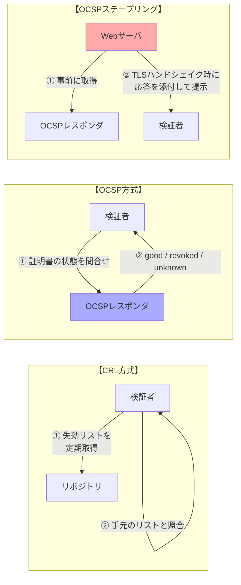
```mermaid
flowchart LR
  subgraph "【CRL方式】"
    C1["検証者"] -- "① 失効リストを<br>定期取得" --> R1["リポジトリ"]
    C1 -- "② 手元のリストと照合" --> C1
  end
  subgraph "【OCSP方式】"
    C2["検証者"] -- "① 証明書の状態を問合せ" --> O["OCSPレスポンダ"]
    O -- "② good / revoked / unknown" --> C2
  end
  subgraph "【OCSPステープリング】"
    S3["Webサーバ"] -- "① 事前に取得" --> O2["OCSPレスポンダ"]
    S3 -- "② TLSハンドシェイク時に<br>応答を添付して提示" --> C3["検証者"]
  end

  style O fill:#aaf
  style S3 fill:#faa
```

| 方式                                             | 仕組み                                                                       | 長所                                                             | 短所                                                                                              |
| ------------------------------------------------ | ---------------------------------------------------------------------------- | ---------------------------------------------------------------- | ------------------------------------------------------------------------------------------------- |
| **CRL**<br>(Certificate Revocation List)         | CAが**失効した証明書のシリアル番号一覧**を発行し、検証者が取得して照合する   | 問合せが不要でCAの負荷が小さい                                   | ・**リストが肥大化**する<br>・<font color=red>次回発行までのタイムラグで失効が反映されない</font> |
| **OCSP**<br>(Online Certificate Status Protocol) | 検証者がOCSPレスポンダへ**証明書の状態をオンラインで問い合わせる**           | **リアルタイムに近い失効確認**ができる                           | ・レスポンダへの負荷と応答遅延<br>・<font color=red>閲覧先がCAに知られる（プライバシー）</font>   |
| **OCSPステープリング**                           | **Webサーバが事前にOCSP応答を取得**し、TLSハンドシェイク時に添付して提示する | 遅延・プライバシー問題を解消し、レスポンダ障害の影響も受けにくい | サーバ側の対応設定が必要                                                                          |

<div style="page-break-before:always"></div>

### 情報セキュリティ管理

#### PSIRT（Product Security Incident Response Team） <!-- omit in toc -->


**自社製品の脆弱性に起因するリスクに対応するべき社内機能**。情報収集、対策実施、開発へのフィードバックなどが主な業務としてある。CSIRT（Computer Security Incident Response Team）との違いは「**守るスコープ**」にある。CSIRTは自社のパソコンやサーバーなどの情報システム全体を守る。
　また、CSIRT/PSIRTの成熟度を評価するための考え方としてSIM3（Security Incident Management Maturity Model）がある。SIM3は**インシデント対応の成熟度を評価・改善するためのモデル**であり、インシデント対応能力がどの程度成熟しているかを評価する際に利用される。

| 比較項目     | **CSIRT**                                                                    | **PSIRT**                                                      |
| ------------ | ---------------------------------------------------------------------------- | -------------------------------------------------------------- |
| 目的         | **組織のセキュリティを<br>維持・回復する**                                   | **製品のセキュリティを確保し、<br>利用者への影響を最小化する** |
| 主な対象     | **組織・企業のIT環境**                                                       | **自社が提供する製品・サービス**                               |
| 主な脅威     | マルウェア、フィッシング、<br>不正アクセス、情報漏洩、<br>アカウント侵害など | 製品の脆弱性、ゼロデイ脆弱性、<br>製品を介した攻撃など         |
| 対応の起点   | 社内でセキュリティ<br>インシデントを検知                                     | 顧客・研究者などから<br>製品の脆弱性報告を受領                 |
| 代表的な問い | 「会社のシステムが攻撃された。<br>どう対応するか？」                         | 「自社製品に脆弱性が見つかった。<br>どう対応するか？」         |

#### ISMAP（Information system Security Management and Assessment Program） <!-- omit in toc -->

政府情報システムにおけるクラウドサービスのセキュリティ評価制度。登録されたサービスは「**ISMAP クラウドサービスリスト**(以下、本リスト)」として公開され、政府機関は本リストに掲載されたサービスから調達を行うことが原則となっています。 また民間事業者においても、本リストを参照することでクラウドサービスの適切な活用が推進されることが期待されていま す。
国が政府情報システムを整備する際に、クラウドサービスの利用を第一候補とする方針（**クラウド・バイ・デフォルト原則**）を受け、政府機関等におけるクラウドサービスの導入に当たって、統一的な安全性評価基準のもとで情報セキュリティ対策が十分に行われているサービスを円滑に導入できるように立ち上げられたものです。

#### CRYPTREC（CRYPTography Research and Evaluation Committees） <!-- omit in toc -->

```plantuml
title CRYPTREC

rectangle CRYPTREC as parent {
  rectangle 暗号技術評価委員会 as child1
  rectangle 暗号技術活用委員会 as child2
}
```

**電子政府推奨暗号の安全性を評価・監視し、暗号技術の適切な実装法・運用法を調査・検討するプロジェクト**。暗号の安全性に関する情報を提供することを目的として、「共通鍵暗号」「公開鍵暗号」「ハッシュ関数」「擬似乱数生成系」の4種類の暗号技術に対して国内外の暗号研究者による評価を行い、評価レポートや推奨可能な暗号のリストを作成することが主な活動内容です。CRYPTRECは2つの委員会で構成されており、それぞれ以下の活動を行なっている。

- 【**暗号技術評価委員会**】暗号技術の安全性評価を中心とした技術的検討
- 【**暗号技術活用委員会**】暗号技術における国際競争力の向上及び運用面での安全性向上に関する検討

<div style="page-break-before:always"></div>

#### ISMSとJIS Q 27000シリーズ <!-- omit in toc -->

**ISMS（Information Security Management System：情報セキュリティマネジメントシステム）** とは、技術的対策だけでなく、<font color=red>組織の体制・規程・運用を含めて情報セキュリティを継続的に管理・改善する仕組み</font>のこと。PDCAサイクルを回して維持・改善する。

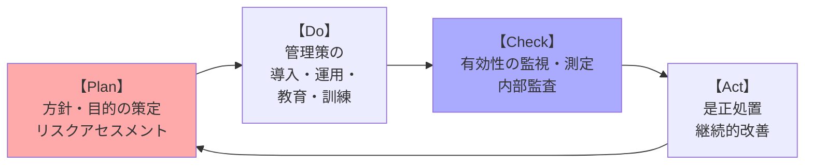
```mermaid
flowchart LR
  P["【Plan】<br>方針・目的の策定<br>リスクアセスメント"] --> D["【Do】<br>管理策の<br>導入・運用・<br>教育・訓練"]
  D --> C["【Check】<br>有効性の監視・測定<br>内部監査"]
  C --> A["【Act】<br>是正処置<br>継続的改善"]
  A --> P

  style P fill:#faa
  style C fill:#aaf
```

| 規格              | 内容                                                                          |
| ----------------- | ----------------------------------------------------------------------------- |
| **JIS Q 27000**   | ISMSの**用語・概要**を定義した規格                                            |
| **JIS Q 27001**   | ISMSの**要求事項**。<font color=red>認証（第三者認証）の基準となる規格</font> |
| **JIS Q 27002**   | 情報セキュリティ**管理策の実践のための規範**（具体的な対策のガイド）          |
| **JIS Q 27014**   | 情報セキュリティ**ガバナンス**（経営陣による方向付け・監視）                  |
| **ISO/IEC 27017** | **クラウドサービス**の情報セキュリティ管理策                                  |

**情報セキュリティの7要素**

- 【**機密性（Confidentiality）**】認可された者だけが情報にアクセスできる特性。
- 【**完全性（Integrity）**】情報が正確であり、改ざんされていない特性。
- 【**可用性（Availability）**】認可された者が必要なときに情報にアクセスできる特性。
- 【**真正性（Authenticity）**】利用者や情報が<font color=red>主張どおり本物である</font>ことを確実にする特性。
- 【**責任追跡性（Accountability）**】<font color=red>誰がいつ何をしたかを事後に追跡できる</font>特性（ログの取得・保全）。
- 【**否認防止（Non-repudiation）**】<font color=red>行為を後から「していない」と否定できない</font>ようにする特性（デジタル署名など）。
- 【**信頼性（Reliability）**】意図した動作と結果が一貫している特性。

**押さえておきたい文書**

- 【**情報セキュリティポリシ**】<font color=red>基本方針</font>（なぜ守るか）／<font color=red>対策基準</font>（何を守るか）／<font color=red>実施手順</font>（どう守るか）の3階層で構成される。
- 【**適用宣言書（SoA：Statement of Applicability）**】<font color=red>採用する管理策と、採用しない管理策およびその理由</font>を明記した文書。ISMS認証で必須となる。
- 【**情報資産台帳**】守るべき情報資産を洗い出し、**管理責任者・重要度（機密性・完全性・可用性の評価値）**を明確にした一覧。リスクアセスメントの出発点となる。

#### CSIRTとSOC <!-- omit in toc -->

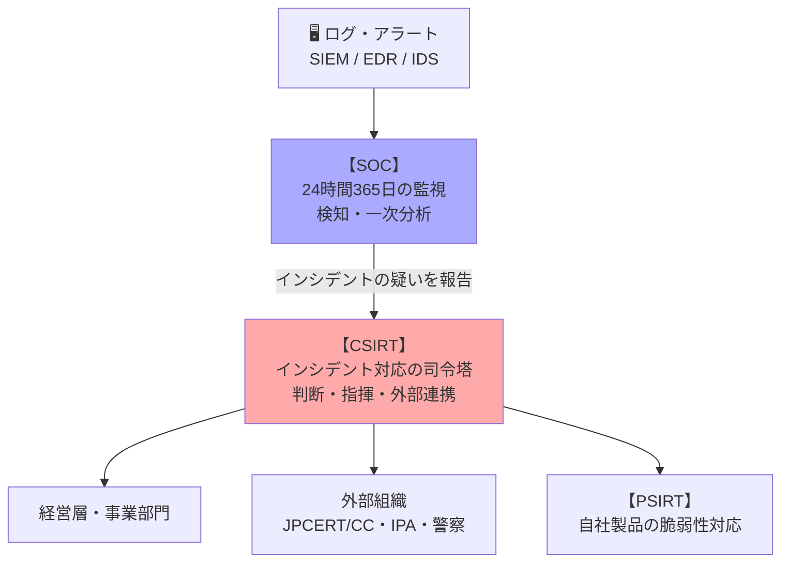
```mermaid
flowchart 
  L["🖥️ ログ・アラート<br>SIEM / EDR / IDS"] --> SOC["【SOC】<br>24時間365日の監視<br>検知・一次分析"]
  SOC -- "インシデントの疑いを報告" --> CSIRT["【CSIRT】<br>インシデント対応の司令塔<br>判断・指揮・外部連携"]
  CSIRT --> BIZ["経営層・事業部門"]
  CSIRT --> OUT["外部組織<br>JPCERT/CC・IPA・警察"]
  CSIRT --> PSIRT["【PSIRT】<br>自社製品の脆弱性対応"]

  style SOC fill:#aaf
  style CSIRT fill:#faa
```

| 比較項目 | **SOC**（Security Operation Center）     | **CSIRT**（Computer Security Incident Response Team） |
| -------- | ---------------------------------------- | ----------------------------------------------------- |
| 主な役割 | **監視・検知・分析**                     | **インシデント対応の統括・意思決定**                  |
| 活動時期 | 平時から**常時監視**                     | インシデント**発生時の対応**が中心                    |
| 主な活動 | ログ監視、アラート分析、脅威ハンティング | 影響範囲の判断、対応方針の決定、社内外の調整・広報    |
| 位置づけ | 技術的な**監視部隊**                     | 組織横断の**司令塔**（経営層・法務・広報とも連携）    |

※自社製品の脆弱性に対応する**PSIRT**との違いは、前掲の「PSIRT」の項を参照。

**外部の情報共有・届出の枠組み**

- 【**JPCERT/CC**】国内のインシデント報告の受付・対応支援・再発防止のための調整を行う組織。**脆弱性情報の調整機関**も担う。
- 【**IPA**】脆弱性関連情報やコンピュータウイルス・不正アクセスの**届出受付機関**。
- 【**情報セキュリティ早期警戒パートナーシップ**】<font color=red>発見者 → IPA（受付） → JPCERT/CC（調整） → 製品開発者 → JVNで公表</font>という流れで、脆弱性情報を安全に流通させる枠組み。
- 【**J-CSIP／J-CRAT**】重要インフラ等での**サイバー情報共有イニシアティブ**、および標的型攻撃の**サイバーレスキュー隊**。
- 【**NISC**】内閣サイバーセキュリティセンター。政府機関の統一基準を策定する。

<div style="page-break-before:always"></div>

#### セキュリティインシデント対応プロセス <!-- omit in toc -->

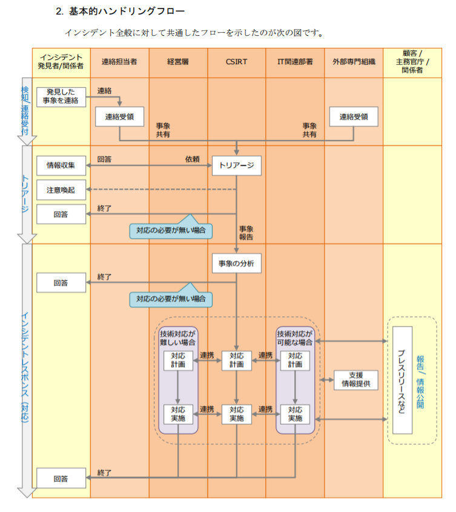

| フェーズ         | 主な活動                                                                                                                                                             |
| ---------------- | -------------------------------------------------------------------------------------------------------------------------------------------------------------------- |
| **① 準備**       | CSIRT体制と連絡体制の整備、対応手順（プレイブック）の策定、ログ取得設定、机上・実機訓練                                                                              |
| **② 検知・分析** | アラートや通報の受領、<font color=red>**トリアージ**（緊急度・重要度による優先順位付け）</font>、侵入経路と影響範囲の特定、証拠保全                                  |
| **③ 封じ込め**   | <font color=red>被害拡大の停止を最優先</font>にネットワークからの隔離・アカウント停止・通信遮断。<u>証拠保全の前に電源を落とすとメモリ上の証拠が失われる点に注意</u> |
| **④ 根絶**       | マルウェアの除去、不正アカウント・バックドアの削除、悪用された脆弱性の修正、パスワードの一斉変更                                                                     |
| **⑤ 復旧**       | クリーンな状態からの再構築、バックアップからのリストア、監視を強化したうえでの段階的な業務再開                                                                       |
| **⑥ 事後対応**   | 経営層・監督官庁・顧客への報告、原因分析と再発防止策の策定、手順書と教育内容への反映                                                                                 |

> **報告義務の観点**：個人データの漏えい等が生じた場合、個人情報保護法に基づき**個人情報保護委員会への報告と本人への通知**が必要となる（速報・確報の二段階）。事故対応では技術的対応と並行して**法令上の報告要否の判断**が求められる。

<div style="page-break-before:always"></div>

### セキュリティ技術評価

#### IoC（Indicator of Compromise） <!-- omit in toc -->


コンピュータやネットワークにおいて不正アクセスやマルウェア感 染といったセキュリティインシデントが発生した**痕跡や手掛かりとなる情報**。
IoCの該当例は以下のとおり。

- 不正な通信先のIPアドレス
- 悪意のあるファイルのハッシュ値
- 改ざんされたファイル名
- 不審なドメイン名URL
- 不正な通信パターン
- 異常な時間帯のログイン

システム管理者やセキュリティ担当者は、これらの情報をもとに攻撃の兆候や侵害の有無を確認したり、被害の拡大を防止したりする対応を行います。

#### CVSS（Common Vulnerability Scoring System：共通脆弱性評価システム） <!-- omit in toc -->

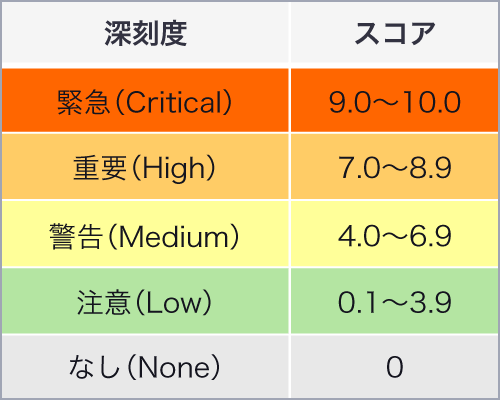

情報システムの脆弱性を評価するためのフレームワーク。ベンダーに依存しない共通かつ汎用的な方法が提供されているため、脆弱性の深刻度を同一の基準のもとで定量的に比較することが可能です。CVSSでは、脆弱性の性質や影響度を同じ基準で評価し、対策の優先順位（トリアージ）を決めるために以下の基準を用いて、最終的に脆弱性の深刻度を`0（低）〜 10.0（高）`のスコアで表します。算出されたスコアをもとに深刻度レベルを分類します。

- 【**基本評価基準 (Base Metrics)**】脆弱性自体の深刻度を評価する指標。機密性・可用性・完全性への影響の大きさや、攻撃に必要な条件などの項目から算出され、時間の経過や利用者の環境で変化しない。ベンダーや脆弱性を公表する組織などが、脆弱性の固有の深刻度を表すために評価する基順となる。
- 【**現状評価基準 (Temporal Metrics)**】脆弱性の現在の深刻度を評価する指標。攻撃を受ける可能性や利用可能な対応策のレベルなどの項目から算出され、時間の経過により変化する。ベンダーや脆弱性を公表する組織などが、脆弱性の現状を表すために評価する基準となる。
- 【**環境評価基準 (Environmental Metrics)**】製品利用者の利用環境も含め、最終的な脆弱性の深刻度を評価する指標。二次被害の可能性や影響を受ける範囲などの項目から算出され、製品利用者ごとに変化する。利用者が脆弱性への対応を決めるために評価する基準となる。

<div style="page-break-before:always"></div>

#### 脆弱性情報の識別と公表（CVE・CWE・JVN） <!-- omit in toc -->

脆弱性を組織間で正確にやり取りするため、**「何を」「どう数えるか」を共通化した識別子**が整備されている。

| 識別子   | 正式名称                             | 何を識別するか                                                        | 例                              |
| -------- | ------------------------------------ | --------------------------------------------------------------------- | ------------------------------- |
| **CVE**  | Common Vulnerabilities and Exposures | <font color=red>個別の脆弱性そのもの</font>に付与される一意の識別番号 | `CVE-2024-12345`                |
| **CWE**  | Common Weakness Enumeration          | <font color=red>脆弱性の「種類（型）」</font>の分類。原因の分類に使う | `CWE-89`（SQLインジェクション） |
| **CVSS** | Common Vulnerability Scoring System  | 脆弱性の<font color=red>深刻度</font>を0.0〜10.0のスコアで表す        | `9.8 CRITICAL`                  |
| **CPE**  | Common Platform Enumeration          | 脆弱性の影響を受ける<font color=red>製品・バージョン</font>の識別     | ベンダ名／製品名／版            |

- 【**JVN（Japan Vulnerability Notes）**】JPCERT/CCとIPAが共同運営する<font color=red>日本国内向けの脆弱性対策情報ポータル</font>。対策情報を公表する。
- 【**JVN iPedia**】国内外の脆弱性対策情報を蓄積した**データベース**。
- 【**NVD**】米国NISTが運営する脆弱性データベース。CVEに詳細情報とCVSSスコアを付与している。
- 【**KEV（Known Exploited Vulnerabilities）**】米国CISAが公開する<font color=red>実際に悪用が確認された脆弱性のカタログ</font>。CVSSスコアが高くても悪用されていない脆弱性は多いため、**対応の優先順位付け（トリアージ）に有効**。

#### 脆弱性検査の手法 <!-- omit in toc -->

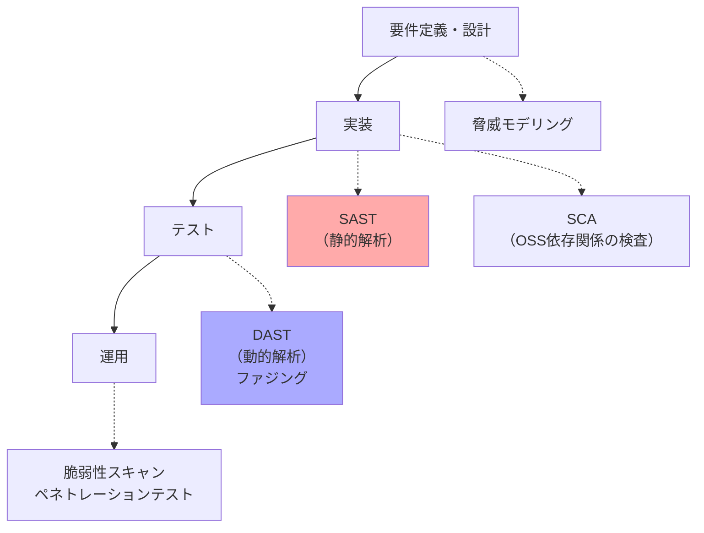
```mermaid
flowchart TD
  R["要件定義・設計"] --> C["実装"]
  C --> T["テスト"]
  T --> O["運用"]

  R -.-> TM["脅威モデリング"]
  C -.-> SAST["SAST<br>（静的解析）"]
  C -.-> SCA["SCA<br>（OSS依存関係の検査）"]
  T -.-> DAST["DAST<br>（動的解析）<br>ファジング"]
  O -.-> VS["脆弱性スキャン<br>ペネトレーションテスト"]

  style SAST fill:#faa
  style DAST fill:#aaf
```

| 手法                                               | 内容                                                                                                                                                                        |
| -------------------------------------------------- | --------------------------------------------------------------------------------------------------------------------------------------------------------------------------- |
| **ポートスキャン**                                 | 開いているポートと稼働サービスを調べ、**不要な公開サービス**を洗い出す                                                                                                      |
| **脆弱性スキャン**                                 | 既知の脆弱性の有無を**ツールで網羅的に**検査する。**幅広く浅く**調べる                                                                                                      |
| **ペネトレーションテスト**                         | <font color=red>実際に攻撃を試み、侵入できるか・どこまで到達できるかを検証</font>する。**狭く深く**調べる。実施前に**対象範囲・期間・手法・免責を書面で合意**することが必須 |
| **ファジング（fuzzing）**                          | <font color=red>予期しない値や極端に長い値などのデータ（ファズ）を大量に入力し、異常終了や例外から未知の脆弱性を発見</font>する手法                                         |
| **SAST**（静的アプリケーションセキュリティテスト） | <font color=red>ソースコードを実行せずに解析</font>する。**開発の早期に発見できる**が、偽陽性が出やすい                                                                     |
| **DAST**（動的アプリケーションセキュリティテスト） | <font color=red>稼働中のアプリケーションに実際にリクエストを送って検査</font>する。実際に動く問題を検出できるが、コードの場所は特定しにくい                                 |
| **IAST**                                           | アプリ内部にエージェントを組み込み、**実行時の内部挙動を観測**しながら検査する（SASTとDASTの中間）                                                                          |
| **SCA**（ソフトウェアコンポジション解析）          | <font color=red>利用しているOSSライブラリとそのバージョンを洗い出し、既知の脆弱性やライセンスを検査</font>する。SBOMと組み合わせて管理する                                  |

- 【**レッドチーム**】攻撃側の視点で実際に侵入を試みるチーム。【**ブルーチーム**】防御・検知側のチーム。【**パープルチーム**】両者の知見を突き合わせて検知能力の改善につなげる取組み。
- 【**バグバウンティ（報奨金制度）**】外部の研究者からの脆弱性報告に報奨金を支払う制度。

<div style="page-break-before:always"></div>

### 情報セキュリティ対策

#### IPSとIDS <!-- omit in toc -->


| 項目           | IDS（Intrusion Detection System：侵入<font color=red>検知</font>システム） | IPS（Intrusion Prevention System：侵入<font color=red>防止</font>システム） |
| -------------- | -------------------------------------------------------------------------- | --------------------------------------------------------------------------- |
| 目的           | 不正アクセスや攻撃を**検知**する                                           | 不正アクセスや攻撃を**検知・防止**する                                      |
| 主な動作       | 攻撃を検知して**警告・通知**する                                           | 攻撃を検知して**通信を遮断**する                                            |
| 配置イメージ   | ネットワークに設置し、ネットワークを**監視**する                           | ネットワークの**経路上**に配置する                                          |
| 誤検知時の影響 | 警告だけなので、通信への影響は小さい                                       | 正常な通信を攻撃と判断すると、通信を遮断する可能性がある                    |

|         | メリット                                                                                    | デメリット                                                                                                                                 |
| ------- | ------------------------------------------------------------------------------------------- | ------------------------------------------------------------------------------------------------------------------------------------------ |
| **IDS** | ・管理者に侵入の通知が可能<br>・誤検知による業務影響が小さい                                | ・**自動的に防御できない**<br>・侵入検知後は管理者が対応する                                                                               |
| **IPS** | ・**自動的に通信を遮断可能**<br>・IDSより迅速に攻撃を防御可能<br>・既知の不正通信を防止可能 | ・**正常な通信まで遮断する可能性**がある<br>・経路上に配置するため、障害時は<br>　通信に影響する可能性がある<br>・適切なルーティングが必要 |

**IDS/IPSの検知方法**

IDSやIPSでは、ヘッダー情報やペイロード部分など全内容の確認、トラフィック状況の監視などで不正侵入かどうかを判断します。その判断方法の違いによってシグネチャ型とアノマリ型に分類されます。

- 【**シグネチャ型**】<font color=red>不正侵入に現れる特徴的なパターンを登録し、登録したパターンにマッチした通信を異常と判断する</font>。<u>新たに発生した登録されていない異常パターンなどが見逃される偽陰性に注意する必要がある</u>。
- 【**アノマリ型**】TCP/IPプロトコルの標準仕様が記載されたRFC等で規定される手順を踏まない通信や、トラフィック量の急激な増加や通常とは異なるアクセスなど、<font color=red>正常な状態から逸脱している通信を異常と判断する</font>。<u>閾値の設定によっては、誤って異常となる疑陽性が発生するので注意が必要である</u>

**IPSの設置モード**

また、IPSは設置場所の違いにより、プロミスキャスモードとインラインモードに分類されます。 

- 【**プロミスキャスモード (ステルスモード)**】通信経路上にある<font color=red>スイッチのミラーポートにIPSを接続</font>することで、本来の経路上を流れる全てのパケットのコピーを監視する。異常な通信を検知しても遮断することはできないので、基本的には NIDSと同様に監視が主な役割となる
- 【**インラインモード**】<font color=red>監視対象の通信経路上にIPSを設置</font>します。異常を検知した場合はすぐに通信が遮断され、異常パケットの進入を防げるが、プロミスキャスモードに比べ、IPSの処理性能や信頼性がネットワークの性能に与える影響が大きい。

**IDS/IPSの導入形態や運用方法**

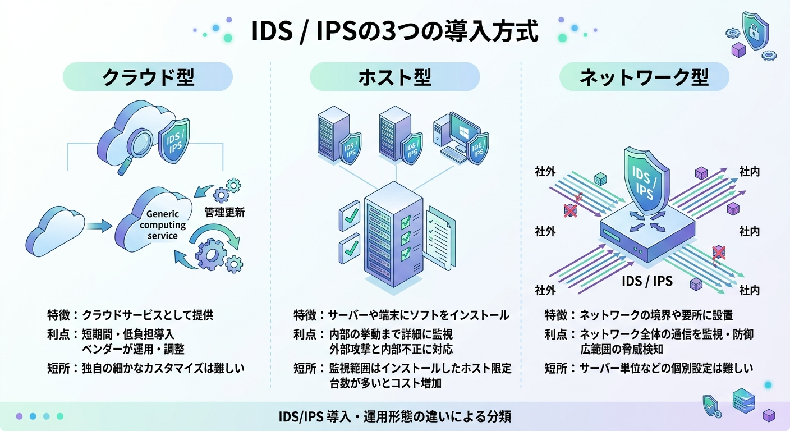

- 【**クラウド型**】クラウドサービスとして利用する。自社に設置せず、ベンダー側が設定やシグネチャの調整を行う。
  - 【**メリット**】①短期間・低負担で導入可能、②物理機器の導入・保守が不要、③ベンダー側の対応により運用工数を削減できる、④規模を拡張しやすい
  - 【**デメリット**】①監視・制御範囲がサービス依存になる、②カスタマイズが難しい場合がある、③ベンダーの依存度が高くなる
- 【**ホスト型**】監視対象となるサーバーや端末にIDS/IPSを直接インストールし、**ホスト内部の動作や通信**を監視
  - 【**メリット**】①ホスト内部の挙動を監視できる、②外部攻撃と内部プロセスを検知可能
  - 【**デメリット**】①導入したホストしか監視できない、②監視対象が増えるほどコストが増加する、③各ホストへの導入・設定・更新が必要
- 【**ネットワーク型**】社内外のネットワーク境界やNW内の要所にIDS/IPSを設置し、**ネットワークの通信を監視・防御**
  - 【**メリット**】①ネットワーク全体を横断的に監視可能、②サーバや端末をまとめて監視可能、③広範囲の攻撃を検知・防御可能、④個々の端末への導入不要
  - 【**デメリット**】①個々の端末の詳細な挙動は把握しにくい、②ホスト単位の細かな設定・制御が難しい、③構成によっては監視不可の通信がある

#### FW、IDS/IPS、WAFの違い <!-- omit in toc -->

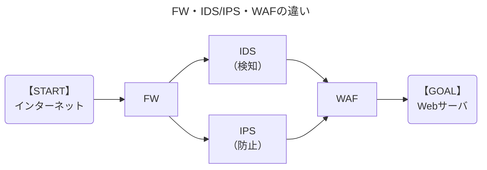
```mermaid
---
title: FW・IDS/IPS・WAFの違い
---

graph LR
  internet(【START】<br>インターネット)
  fw[FW]
  ids[IDS<br>（検知）]
  ips[IPS<br>（防止）]
  waf[WAF]
  web(【GOAL】<br>Webサーバ)

  internet --> fw --> ids & ips --> waf --> web
```

- **FW**：誰が・どこへ・何番ポートで通信しているか
- **IDS／IPS**：その通信は攻撃パターンではないか・DDoS/DoS攻撃ではないか
- **WAF**：Webアプリへのリクエストは攻撃ではないか

|       項目       | FW                                         | IDS                                            | IPS                                            | WAF                                             |
| :--------------: | ------------------------------------------ | ---------------------------------------------- | ---------------------------------------------- | ----------------------------------------------- |
|     **役割**     | **不正アクセス<br>制御**                   | 不正な通信や攻撃の<br>**検知・通知**           | 不正な通信や攻撃の<br>**検知・遮断**する       | Webアプリへの<br>攻撃の**検知・遮断**           |
|    **Layer**     | 主に**L3・L4**                             | 主に**L3・L4・L7**                             | 主に**L3・L4・L7**                             | **L7**                                          |
| **監視<br>項目** | IPアドレス、<br>ポート番号、<br>プロトコル | DoS/DDoS攻撃、<br>攻撃パターン、<br>異常な通信 | DoS/DDoS攻撃、<br>攻撃パターン、<br>異常な通信 | HTTPリクエスト、<br>URL、パラメータ、<br>Cookie |
|     **動作**     | ルールに従って<br>通信を許可・拒否         | **検知・通知**                                 | **検知・遮断**                                 | Webアプリへの<br>攻撃を**検知・遮断**           |

#### サイドチャネル攻撃 <!-- omit in toc -->

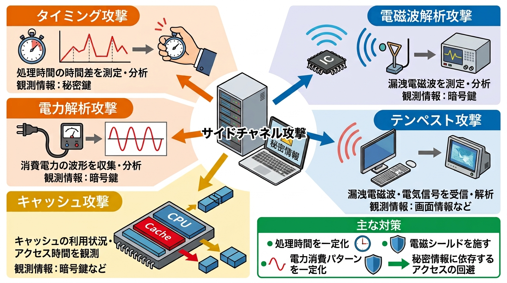

対象の動作状況を観察し、漏洩電磁波・電力消費等のサイドチャネル情報から暗号鍵推定等を行う非破壊型解析攻撃の総称。サイドチャネル（Side Channel）には、非正規の入出力経路という意味があり、サイドチャネル攻撃の一つである「タイミング攻撃」は暗号処理のタイミングが暗号鍵の論理値に依存して変化することに着目し、暗号化や復号に要する時間の差異を統計的に解析して暗号鍵を推定する手法です。暗号アルゴリズムの実装方法に対する攻撃方法なので、次のような対策が有効となります。 

- <font color=red>演算アルゴリズムの処理を追加して秘密情報の違いによって演算の処理時間に差異が出ないようにする</font>
- 時間計測を正確に行えないようにする
- ブラインド署名のアルゴリズムの応用 

**サイドチャネル攻撃の種類**

- **タイミング攻撃** 暗号処理の<font color=red>処理時間</font>を測定し、内容や回数により生じる時間差を統計分析することで、パスワードや暗号鍵などの秘密情報を盗み出す。
- **電力解析攻撃** 暗号処理で生じる<font color=red>消費電力</font>の波形を収集・分析し、暗号鍵や内部データを推測する。
- **電磁波解析攻撃** 暗号処理中で生じる<font color=red>電磁波</font>を測定・分析し、暗号鍵や内部データを推測する。
- **テンペスト攻撃** 電子機器から<font color=red>漏洩する電磁波や電気信号</font>を受信・解析し、画面表示や処理内容などを復元する。
- **キャッシュ攻撃** <font color=red>キャッシュの利用状況やアクセス時間</font>を観測・分析することで、秘密情報を推測する。

| 攻撃の種類             | 具体例                                            | 観測情報                   | 主な対策                                                                                                                 |
| ---------------------- | ------------------------------------------------- | -------------------------- | ------------------------------------------------------------------------------------------------------------------------ |
| **タイミング<br>攻撃** | RSAの復号処理時間<br>を測定                       | 秘密鍵                     | ・**処理時間を一定化する**<br>・処理時間が不変の暗号処理の使用<br>・乱数を用いた入力値の変換処理<br>　（Blinding）の使用 |
| **電力解析<br>攻撃**   | スマートカードの<br>AES実行時の<br>消費電力を測定 | 暗号鍵                     | ・**電力消費パターンを一定化する**<br>・マスキングを行う<br>・電力解析を考慮した暗号処理の使用                           |
| **電磁波解析<br>攻撃** | ICチップのAES実行時に<br>発生する電磁波を測定     | 暗号鍵                     | ・**電磁シールドを施す**<br>・不要な電磁放射を抑制する                                                                   |
| **キャッシュ<br>攻撃** | CPUのキャッシュ<br>アクセスを観測                 | 暗号鍵など                 | ・**秘密情報に依存するアクセスの回避**<br>・一定時間で動作する実装を使用する                                             |
| **テンペスト<br>攻撃** | 画面の漏洩電磁波を<br>受信して内容を推測          | 画面情報・<br>通信内容など | ・**電磁シールドを施す**<br>・機器からの電磁波漏洩を抑制する<br>・機器を適切に隔離・配置する                             |

#### Enhanced Open <!-- omit in toc -->

Wi-Fiのオープンネットワーク（パスワードなしの接続）において、通信内容を自動で個別暗号化するセキュリティ規格。具体的には、Wi-Fi Allianceが定義したセキュリティ規格で、端末とアクセスポイントの認証プロセスで`Diffie-Hellman`鍵交換を実行し、得られた独自の鍵を利用して暗号化通信を行う仕組みです（認証は行わない）。SSIDを指定するだけで使える公衆無線LANの利便性を保ったまま無線通信が保護されます。これにより、パスワード入力の手間をなくしたまま通信の盗聴を防ぎます。

- **メリット**
  - **パスワードがいらない** 名前（SSID）を選ぶだけで、すぐに繋がります。
  - **通信が安全になる** 電波を盗み見られても、内容が暗号化されているので見られません。
  - **個別で鍵を作る** まわりの人と違う専用の暗号キーを端末ごとに自動で作るため、他の人の通信は覗けません。
- **デメリット（注意点）**
  - **本人確認はできない** パスワードがないため、誰でも接続できます。悪い人が入るのを防ぐことはできません。
  - **偽物に弱い** 本物に似せた「ニセのWi-Fiスポット」を見分ける機能はありません。
  - **古い機器は使えない** 古いスマホやパソコンは、この新しい機能に対応していないことがあります

#### デジタルフォレンジックス <!-- omit in toc -->

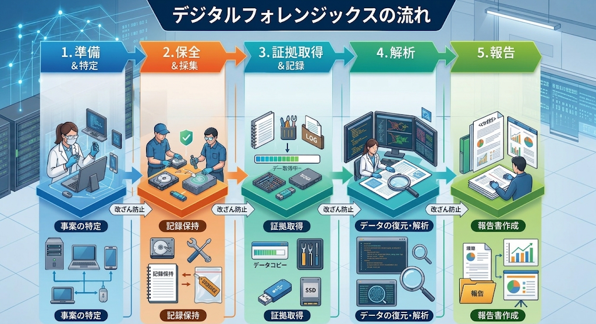

インシデントの発生時に関連するパソコンやスマホなどの電子機器に残るデータを集めて、**法的な証拠や事件の原因を調べる技術**。電磁的記録を適切に保全することは、サイバー攻撃への対策となるだけではなく、犯罪や内部不正など の法的紛争に対処する観点からも重要であり、デジタルフォレンジックスに対するニーズは高まってきています。

#### SBOM（Software Bill Of Materials） <!-- omit in toc -->


ある製品に含まれるソフトウェアに含まれるすべてのコンポーネントの名称、バージョン・ビルド情報、ライセンス情報、依存関係、その他関連情報を含めて機械処理可能なリストにしたもの。SBOMはソフトウェアの脆弱性管理のためのツールとしても利用されており、以下の目的で作成される。

- 新しい脆弱性が見つかった際の影響範囲の迅速な特定
- サイバー攻撃やサプライチェーン上のリスクの防止
- どのソフトウェアにどのバージョンのOSSやライブラリが含まれているかの把握

#### ステートフルインスペクション <!-- omit in toc -->


ステートフルインスペクションは、ダイナミックパケットフィルター方式とも呼ばれ、FWを通過する個々のセッションの状態を管理し、その情報に基づいて動的にポートを開閉することで詳細なアクセス制御を行うファイアウォールの方式。ステートフルとはシステムが一連のセッション状態を保持し、個々の通信とセッション情報を照らし合わせて処理を決定する方式や考え方をいいます。

ステートフルインスペクション方式の初期フィルタリングテーブルには「**通信の開始時に使われるパケットのみを通過許可ルール**」として設定しておきます。

実際に通信要求があると、接続要求に対する応答、それに付随するコネクションなどの通信を許可する一時的なルールが自動的にフィルタリングテーブルに追加されます。さらに通信後のセッション終了に伴い、追加された一時的ルールは破棄されます。
この仕組みにより、ルール設定の平易化、およびフィルタリングテーブルの不備を悪用した不正アクセスや順序関係の矛盾したパケットの通過を防止するセキュリティ効果が期待できます。

#### IaaS・PaaS・SaaS <!-- omit in toc -->

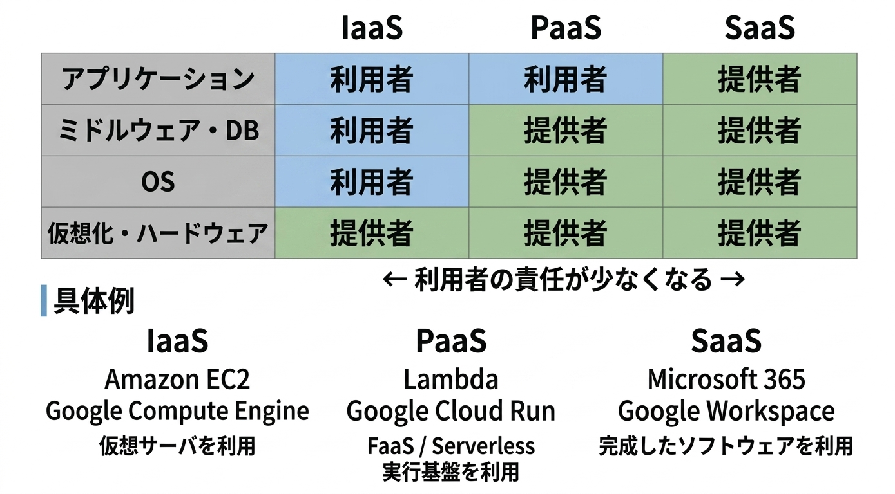

> **IaaS**：Amazon EC2 → サーバを借りる
> **PaaS**：Lambda → アプリ実行環境を借りる
> **SaaS**：Microsoft365 → 完成したサービスを使う

#### CAA（Certification Authority Authorization）レコード <!-- omit in toc -->

ドメイン名に対してSSL/TLSサーバー証明書の発行を許可する認証局（CA）を指定するためのDNSリソースレコードであり、RFC8659 として標準化されています。CAAレコードを使用することで意図しない認証局から証明書が不正発行されるリスクを軽減することができ、他にも以下のような効果があります。

- 【**不正発行の防止**】意図しないまたは権限のない認証局から勝手に証明書が発行されるリスクを減らします。
- 【**セキュリティ向上**】ドメインの所有者が管理する認証局（例：デジサートの案内など）のみが証明書を発行できるように制限します。

認証局は証明書の発行前にドメインのCAAレコードを確認することが義務付けられています。

> ca.example.comに証明書の発行を許可する CAAレコードの設定例
> example.jp. IN **CAA** 0 issue "ca.example.com"

#### トランザクション署名（Transaction Signature） <!-- omit in toc -->

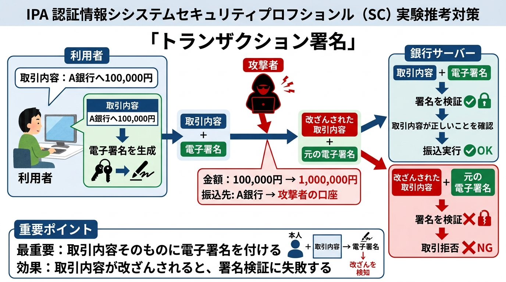

マルウェアの影響を受けないハードウェアトークンが振込先口座番号や振込金額といった取引内容を入力として**専用の署名コードを生成**し、そのコードを用いて取引の正当性を確認する仕組み。**MITB（Man-in-the-Browser）攻撃の対策**として使用されます。
金融機関から提供されるハードウェアトークンは利用者が振込先口座番号や振込金額を入力すると、その内容に基づいた署名を生成する仕組みになっています。利用者はWebブラウザ上で振込先情報と金額に加えて、トークンが作成した署名文字列を入力し、Web サーバに送信します。Web サーバ側では、送信された情報と署名の整合性を確認し、正しい場合にのみ振込処理を実施します。マルウェアはトークンが生成する署名を入手できないため、もし通信途中で内容が書き換えられても、Web サーバが不正と判断して処理を拒否することでMITB攻撃を防止できます。

#### SASE（Secure Access Service Edge：サシー） <!-- omit in toc -->

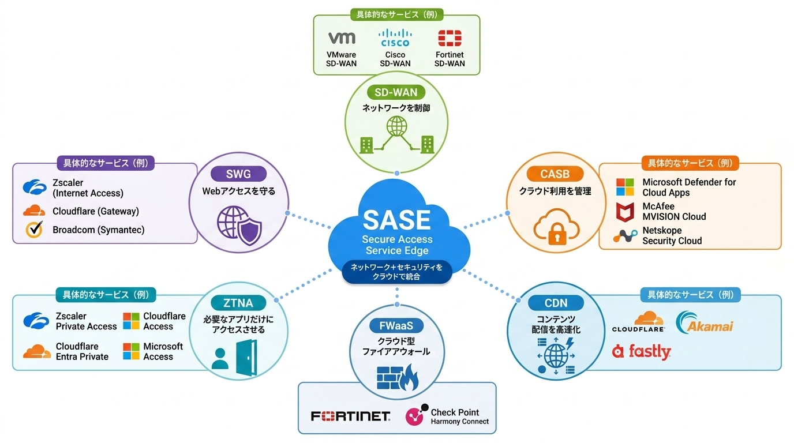

ネットワークとセキュリティの機能をクラウド上で統合して提供するアーキテクチャ。**CND・SD-WANなどのネットワーク機能と、SWG・CASB・ZTNA・FWaaSなどのセキュリティ機能**などがあります。一方で、<font color=red>単一障害点や運用管理の複雑化などの負の側面</font>もある。

| 構成要素                                    | 内容                                                                            | キーワード                   |
| ------------------------------------------- | ------------------------------------------------------------------------------- | ---------------------------- |
| **SD-WAN**（Software-<br>Defined WAN）      | WAN・ネットワークを柔軟に制御。<br>拠点・クラウド間の通信経路を最適化。         | **ネットワーク制御**         |
| **SWG**（Secure<br>Web Gateway）            | Webアクセスを守る（検査・制御）。<br>URLフィルタリングやマルウェア対策。        | **Webアクセス保護**          |
| **CASB**（Cloud Access<br>Security Broker） | クラウド利用を管理（監視・制御）。<br>クラウド上のデータ漏えい対策など          | **クラウド利用管理**         |
| **ZTNA**（Zero Trust<br> Network Access）   | 認証・認可でのアクセス制御                                                      | **ゼロトラスト・最小権限**   |
| **FWaaS**（Firewall <br>as a Service）      | クラウド型ファイアウォール。<br>通信の許可・拒否やアクセス制御。                | **通信制御**                 |
| **CDN**（Content <br>Delivery Network）     | 利用者に近い拠点からコンテンツを配信。<br>Webコンテンツの配信を高速化・負荷分散 | **コンテンツ<br>配信高速化** |

#### CASB（Cloud Access Security Broker：キャスビー） <!-- omit in toc -->

利用者とクラウドサービスプロバイダとの間に単一のコントロールポイントを設けて、クラウドサービス利用の①可視化、②コンプライアンス、③データセキュリティ、④脅威防御、を提供する仕組みです。CASBを導入することで、組織の管理者はシャドーAIを発見し、管理することが可能となります。CASB導入の主な効果は以下の通り。

- 【**シャドーIT防止**】従業員がどの端末でどのサービスを使用しているのか可視化できる
- 【**システム管理者の業務負荷軽減**】複数のクラウドサービスの利用状況や安全性をまとめて可視化できる。自社のセキュリティ基準を満たさない場合、サービスを利用制限し、コンプライアンス遵守につながる。

**導入方式**

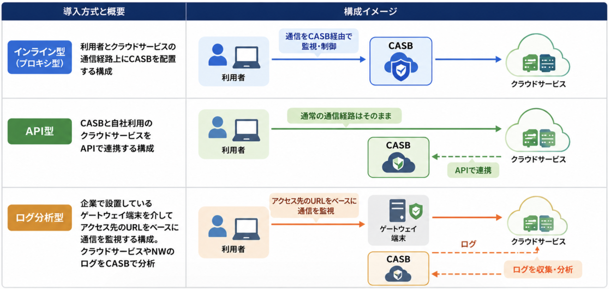

- 【**インライン型（プロキシ型）**】利用者とクラウドサービスの**通信経路上にCASBを配置**する構成
- 【**API型**】CASBと自社利用のクラウドサービスを**APIで連携**する構成
- 【**ログ分析型**】企業で設置しているゲートウェイ端末を介してアクセス先のURLをベースに通信を監視する構成。クラウドサービスやNWの**ログをCASBで分析**

| 導入方式         | メリット                                       | デメリット                                                    |
| ---------------- | ---------------------------------------------- | ------------------------------------------------------------- |
| **インライン型** | **リアルタイムで通信を監視・制御**できる       | **ネットワーク構成や<br>端末設定の変更**が必要                |
| **API型**        | **通信経路を変更せず導入**できる               | APIの取得情報に依存し、<br>**リアルタイムの通信制御が難しい** |
| **ログ分析型**   | 既存環境への影響が小さく、<br>**導入しやすい** | ログ分析のため、<br>**リアルタイム制御ができない**            |

#### UEBA（User and Entity Behavior Analytics：ユー・イー・ビー・エー） <!-- omit in toc -->

**機械学習を利用して利用者や端末、サーバなどの振る舞いを分析し、通常とは異なる動きを自動的に検知する仕組み**。UEBAでは機械学習でログから利用者の通常の行動パターンを学習し、パターンから外れた行動を異常として把握します。

- 【**効果1**】未知の攻撃手法
- 【**効果2**】内部不正
- 【**効果3**】アカウントの乗っ取り

**UEBA・SIEMの違い**

SIEM は各機器のログを集めて突き合わせ、**ルールベースの検知**をします（10分間に5回ログイン失敗、深夜に管理者アカウントでログイン成功など）。一方、UEBA はログから機械学習でベースラインを作り、**機械学習のルールに書き起こせない異常を拾います**（いつも日中に営業部のファイルサーバへ数十MBアクセスする人が今日は深夜に開発部のサーバへ数GBアクセスした）。
　SIEMが「ログ収集・保管する基盤」、UEBAが「ログ分析エンジン」という**レイヤの違い**。

| 観点       | SIEM                                                         | UEBA                                                         |
| ---------- | ------------------------------------------------------------ | ------------------------------------------------------------ |
| 検知の根拠 | 相関ルール／シグネチャ<br>（**既知**の攻撃パターン）         | ベースラインからの逸脱<br>（**未知**・正常を装う挙動）       |
| 出力       | アラート（合致した／しない の固定閾値）                      | **リスクスコア**（連続値での動的閾値）                       |
| 主目的     | ログの一元管理・相関分析・**証跡保全とコンプライアンス対応** | **内部不正・アカウント乗っ取り・ラテラルムーブメントの発見** |
| 弱点       | 正規のIDを使った不正、ルール保守の負荷                       | 学習期間とチューニングが必要、単体では証跡管理に向かない     |

- **SIEMのサービス**
  - Microsoft Sentinel（旧 Azure Sentinel）
  - Google Security Operations（旧 Chronicle）
  - Elastic Security、Sumo Logic、Rapid7 InsightIDR
  - 国産・国内でよく見るもの：Logstorage（インフォサイエンス）、ALog（網屋）、LogStare
- **UEBAのサービス**
  - Securonix UEBA
  - Splunk UBA ※製品名は "UBA" ですが実体はエンティティも扱う UEBA
  - Microsoft Sentinel UEBA / Microsoft Defender for Cloud Apps / Entra ID Protection

#### SOAR（Security Orchestration, Automation and Response） <!-- omit in toc -->

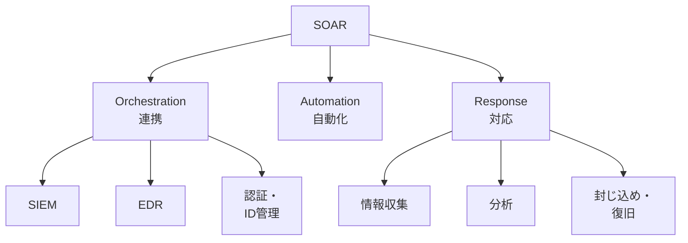
```mermaid
flowchart TB
  SOAR[SOAR]

  SOAR --> ORCH[Orchestration<br>連携]
  SOAR --> AUTO[Automation<br>自動化]
  SOAR --> PB[Response<br>対応]

  ORCH --> SIEM[SIEM]
  ORCH --> EDR[EDR]
  ORCH --> IAM[認証・<br>ID管理]

  PB --> A1[情報収集]
  PB --> A2[分析]
  PB --> A3[封じ込め・<br>復旧]
```

セキュリティ運用業務の自動化を目的としたソリューション。インシデントの検知、分析、判断、対応といった一連のプロセスをシステム同士が連携しながら自動で実行する仕組みを提供する。SOARは次の三つの要素を持つ。

| 要素              | 意味                 | 何をするか                                                                             |
| ----------------- | -------------------- | -------------------------------------------------------------------------------------- |
| **Orchestration** | オーケストレーション | データ収集や対応プロセスを統合的な管理する                                             |
| **Automation**    | 自動化               | 定型的な調査・対応を自動実行（効率化）                                                 |
| **Response**      | 対応                 | 事前に定義されたプレイブックに基づいて<br>インシデントに対する封じ込め・復旧などを実施 |

- **メリット**
  - **運用の自動化と効率化**：アラート対応などの定型業務を自動化し、作業ミスや対応漏れを防ぎます。
  - **対応時間の短縮**：検知から初期対応までの時間を短縮し、被害の拡大を抑えます。
  - **対応品質の均一化**：あらかじめ定められた手順（プレイブック）に沿って処理するため、担当者のスキル差が出にくくなります
- **デメリット**
  - **導入・運用コストが高い**：初期費用やライセンス費用が高額になるケースが多いです。
  - **初期設計に手間がかかる**：自動化のためのルールや「プレイブック」の構築・調整に、専門知識と多くの工数がかかります。
  - **設定ミスによるリスク**：自動化の範囲を誤ると、正当な業務を止めてしまうなどの悪影響が出る恐れがあります。

<div style="page-break-before:always"></div>

#### アクセス制御モデル（DAC・MAC・RBAC・ABAC） <!-- omit in toc -->

```mermaid
flowchart LR
  DAC["【DAC】<br>任意アクセス制御<br>所有者が権限を決める"] --> MAC["【MAC】<br>強制アクセス制御<br>管理者の方針で強制"]
  MAC --> RBAC["【RBAC】<br>役割ベース<br>職務ごとに権限を束ねる"]
  RBAC --> ABAC["【ABAC】<br>属性ベース<br>属性と状況で動的に判断"]

  style DAC fill:#faa
  style ABAC fill:#aaf
```

| モデル                                       | 誰が権限を決めるか                                  | 特徴                                                                                                                                  |
| -------------------------------------------- | --------------------------------------------------- | ------------------------------------------------------------------------------------------------------------------------------------- |
| **DAC**<br>(Discretionary Access Control)    | <font color=red>情報の所有者</font>                 | 所有者が自由に他者へ権限を付与できる。柔軟だが**権限が拡散しやすい**。一般的なOSのファイル権限                                        |
| **MAC**<br>(Mandatory Access Control)        | <font color=red>システム管理者（組織の方針）</font> | 主体と客体に**セキュリティラベル**を付与し、所有者でも変更できない。軍事・政府系や**セキュアOS**で採用                                |
| **RBAC**<br>(Role-Based Access Control)      | 役割（ロール）に基づき管理者が設定                  | <font color=red>職務（役割）に権限を紐付け、利用者を役割に割り当てる</font>。人事異動時の権限変更が容易で**大規模組織の運用に適する** |
| **ABAC**<br>(Attribute-Based Access Control) | 属性と環境条件による動的判断                        | <font color=red>利用者・端末・時刻・場所・リスクなどの属性を組み合わせて都度判定</font>する。ゼロトラストの条件付きアクセスの基礎     |

**権限管理の原則**

- 【**最小権限の原則（Least Privilege）**】<font color=red>業務の遂行に必要な最小限の権限のみを付与</font>する。侵害されたときの被害範囲を限定できる。
- 【**知る必要性の原則（Need-to-Know）**】業務上知る必要がある者だけに情報を開示する。
- 【**職務の分離（Separation of Duties）**】<font color=red>申請者と承認者、開発者と本番環境の運用者を分ける</font>など、単独で不正を完結できないようにする。
- 【**特権アクセス管理（PAM）**】管理者権限アカウントを常時付与せず、**必要なときだけ一時的に払い出す（Just-In-Time）**、操作を録画・記録するなどの管理。
- 【**権限の棚卸し**】<font color=red>異動・退職時の権限削除漏れ</font>を防ぐため、定期的に付与状況を見直す。

#### EDR・XDR <!-- omit in toc -->

| 略語    | 正式名称                        | 監視対象と役割                                                                                                                            |
| ------- | ------------------------------- | ----------------------------------------------------------------------------------------------------------------------------------------- |
| **EPP** | Endpoint Protection Platform    | 従来型のウイルス対策。<font color=red>侵入・実行を「防ぐ」</font>ことが目的（パターンマッチング中心）                                     |
| **EDR** | Endpoint Detection and Response | <font color=red>端末の挙動を常時記録し、侵入後の不審な振る舞いを検知して対応（隔離・調査）</font>する。**侵入されることを前提**とした対策 |
| **NDR** | Network Detection and Response  | **ネットワーク通信**を分析して不審な挙動を検知する                                                                                        |
| **XDR** | Extended Detection and Response | <font color=red>エンドポイント・ネットワーク・クラウド・メールなど複数の領域の情報を統合</font>して相関分析する                           |
| **MDR** | Managed Detection and Response  | 上記の運用を**専門ベンダに委託**するサービス。人材不足を補う                                                                              |

> **EPPとEDRは対立するものではなく併用する**。EPPで既知の脅威の大半を防ぎ、すり抜けた未知の攻撃や環境寄生型攻撃（LotL）をEDRの挙動監視で検知する、という多層防御の考え方をとる。

#### コンテナ・CI/CDのセキュリティ <!-- omit in toc -->

```mermaid
flowchart LR
  SRC["📦 ソースコード<br>・secretsを含めない<br>・SAST/SCA"] --> BLD["🏗️ ビルド<br>・脆弱性スキャン<br>・SBOM生成、署名"]
  BLD --> REG["🗄️ レジストリ<br>・署名検証"]
  REG --> RUN["🚀 実行環境<br>・非root実行<br>・最小権限<br>・挙動監視"]

  style BLD fill:#faa
  style RUN fill:#aaf
```

- 【**イメージの脆弱性管理**】コンテナイメージには**OSパッケージやライブラリが同梱**されるため、ベースイメージごと脆弱性を抱え込む。<font color=red>ビルド時のイメージスキャンと、軽量なベースイメージの採用</font>で攻撃面を減らす。
- 【**信頼できるイメージの利用**】出所不明の公開イメージにはマルウェアが混入している場合がある。**署名の検証**と、社内レジストリでの管理を行う。
- 【**実行時の権限**】<font color=red>コンテナを非rootユーザで実行し、特権コンテナ（privileged）を禁止</font>する。ホストのディレクトリや`docker.sock`のマウントは、**コンテナからホストへの脱出（コンテナブレイクアウト）**につながるため制限する。
- 【**シークレット管理**】接続情報や鍵を**イメージや環境変数に直接埋め込まず**、シークレット管理の仕組みから実行時に注入する。
- 【**ソフトウェアサプライチェーンの保護**】依存ライブラリやCI/CDの認証情報が汚染されると、正規の配布経路を通じてマルウェアが配られる。**SBOMによる構成把握**（前掲「SBOM」の項を参照）、ビルド成果物への署名、CI/CDの権限最小化が対策となる。

<div style="page-break-before:always"></div>

### セキュリティ実装技術

#### OAuth2.0 <!-- omit in toc -->


**OAuth2.0**は異なるドメインやプラットフォーム間でサードパーティアプリケーションによるHTTPサービスへの限定的なアクセスを可能にするオープンな**認可フレームワーク**（RFC6749）。ユーザーの許可のもと、ユーザーの代理としてWebサービスにアクセスできる仕組みです。ユーザーの認証情報を直接アプリケーションに渡さなくても、ユーザーの権限を委譲するための安全な方法として利用されます。OAuth2.0では以下の3種類の口ール（役）が登場します。 

- **リソースオーナー（resource owner）** リソースサーバ内の保護された情報へのアクセスを許可するエンドユーザーであり、クライアントの利用者のこと。
- **リソースサーバ（resource server）** 保護された情報を保持し、Webサービスを提供するアプリケーションのこと。リソースオーナーを認証しクライアントにアクセストークンを発行する認可サーバ（authorization server）の役割を兼ねることが多い。
- **クライアント（client）** リソースオーナーの認可を得てリソースサーバにアクセスするサードパーティアプリケーションのこと。

#### IP25B（Inbound Port 25 Blocking）とOP25B（Outbound Port 25 Blocking） <!-- omit in toc -->


| 項目                 | IP25B                                                                                  | OP25B                                                                                  |
| -------------------- | -------------------------------------------------------------------------------------- | -------------------------------------------------------------------------------------- |
| **対象**             | ISPなどのNW事業者が、<br>**外部→自社ネットワーク**への<br>TCP/25番ポート通信を遮断する | ISPなどのNW事業者が、<br>**自社ネットワーク→外部**への<br>TCP/25番ポート通信を遮断する |
| **通信方向**         | インターネット → ISP利用者側                                                           | ISP利用者側 → インターネット                                                           |
| **主な目的**         | **外部→利用者側のメールサーバ**へ<br>不正に接続されることを防ぐ                        | **利用者の端末→外部メールサーバ**へ<br>迷惑メールを送信されることを防ぐ                |
| **防止する<br>脅威** | ・外部→SMTPサーバへの不正アクセス<br>・迷惑メール送信                                  | ・マルウェア感染端末からの<br>　大量の迷惑メール送信                                   |
| **影響**             | 自宅や社内にSMTPサーバを設置して<br>外部メールを受信する構成が制限される               | ISPの指定外メールサーバへ<br>TCP/25番ポートのメール送信が<br>できなくなる              |
| **代替手段**         | ISPが提供するメールサービスや<br>適切な受信用サービスを利用する                        | **587番ポート(Submission)を利用し、<br>認証済みのメールサーバ経由で送信する**          |

#### IEEE802.1Xの認証システム <!-- omit in toc -->


**IEEE802.1X**は正当な端末以外のLAN参加を防ぐためにLANにおけるクライアント認証の方式を定めた規格であり、当初は有線LAN向けとして策定されたが、その後EAP（Extensible Authentication Protocol）として実装され、現在では無線LAN環境における標準の認証規格として利用されている。

IEEE802.1X方式の認証システムは3つの構成要素からなる。

- **サプリカント（supplicant）** LANに接続するために認証を受けるクライアント
- **オーセンティケータ（authenticator）** サプリカントと認証サーバ間の認証プロセスを相互に中継する装置。有線接続ではL2SWやL3SW、無線接続ではアクセスポイントがこの役割を担う。RADIUSを使う場合は、ここに<font color=red>RADIUSクライアント</font>の機能を持たせる。
- **認証サーバ（authentication server）** 実際に認証を行うサーバ。<font color=red>RADIUSサーバ</font>が使用されることが多い。

#### IEEE802.1Xの認証プロトコル(EAP) <!-- omit in toc -->

IEEE802.1Xは、有線LANまたは無線LANにおける利用者認証の規格です。IEEE802.1Xでは、サプリカント（利用者端末）と認証サーバの認証に様々な方式を選択できるように、認証プロトコルに**EAP（Extensible Authentication Protocol）** を使用する。
具体的な認証方式としては以下のようなものがある。

- <font color=red><b>EAP-TLS</b></font> デジタル証明書によるサーバ・クライアントの相互認証。クライアント側にはデジタル証明書を組み込んだUSBキーやICカードがよく用いられる。
- **EAP-TTLS（EAP Tunneled TLS）** TLSの仕組みでサーバを認証後、TLSのセキュアな伝送路上で様々な方法を用いてクライアントを認証する
- **PEAP（Protected EAP）** TLSの仕組みでサーバを認証後、TLSのセキュアな伝送路上でID・パスワードによるクライアント認証をする
- **EAP-MD5** チャレンジレスポンスでクライアントのみを認証

#### RADIUS と DIAMETER <!-- omit in toc -->

| 項目               | RADIUS（半径）                       | DIAMETER（直径）                            |
| ------------------ | ------------------------------------ | ------------------------------------------- |
| **位置付け**       | AAAプロトコル                        | **RADIUSを発展させた<br>AAAプロトコル**     |
| **トランスポート** | **UDP**                              | **TCP / SCTP**                              |
| **メッセージ形式** | Attribute-Value形式                  | AVP（Attribute-Value Pair）                 |
| **主な用途**       | **Wi-Fi・VPN・ネットワークアクセス** | **携帯電話網・ISPなどの大規模ネットワーク** |

- 【**RADIUS（Remote Authentication Dial-In User Service）**】ネットワークへの接続ユーザーを認証・認可するためのプロトコルです。
- 【**DIAMETER（Diameter）**】RADIUSを発展させたAAAプロトコルです。

**RADIUS**

```mermaid
sequenceDiagram
  participant U as ユーザー
  participant NAS as VPN装置（NAS）
  participant R as RADIUSサーバ

  U->>NAS: VPN接続・認証要求
  NAS->>R: Access-Request
  R->>R: ユーザー情報を確認
  R-->>NAS: Access-Accept / Reject
  NAS-->>U: VPN接続許可 / 拒否
```

**DIAMETER**

```mermaid
sequenceDiagram
  participant C as クライアント
  participant D as DIAMETERサーバ
  participant DB as ユーザーDB

  C->>D: 認証・認可要求
  D->>DB: ユーザー情報を照会
  DB-->>D: 認証情報
  D-->>C: 認証・認可結果
```

**【補足】AAAとは**

| 機能                         | 内容                       | 具体例                       |
| ---------------------------- | -------------------------- | ---------------------------- |
| **Authentication（認証）**   | 「誰か」を確認する         | ユーザー名・パスワードを確認 |
| **Authorization（認可）**    | 「何をしてよいか」を決める | VLANへの接続を許可           |
| **Accounting（課金・記録）** | 「何をしたか」を記録する   | 接続時間・通信量を記録       |


#### クロスサイトリクエストフォージェリ（CSRF：Cross-Site Request Forgery） <!-- omit in toc -->


悪意のあるスクリプトを埋め込んだ Web ページを訪問者に閲覧させて利用者認証やセッション管理の脆弱性のある別の Web サイトでその訪問者が意図しない操作（ショッピングでの決済・退会等）を行わせる攻撃です。CSRF 被害を回避するには不正なリクエストを退ける次のような手順を処理確定前に組み込むことが求められます。

- 秘密情報（CSPF ページトークン）による認証
- パスワードの再入力
- 参照元情報（Referrer：リファラー）の検証

#### SMTP-AUTH <!-- omit in toc -->


電子メール送信・転送のプロトコルであるSMTPは策定されたのが1982年と歴史が古く、電子メール送信に当たって以下の脆弱性があることが広く知られています。

- 送信処理と転送処理を同一の仕組みで扱っている
- 電子メールの投稿をするユーザーを認証する仕組みがない
- 暗号化機能が標準で実装されていないため、 通信経路上を平文のメッセージが流れる

特に上記2つの仕様が原因となり、複数のメールサーバの第三者中継を利用したスパムメールの温床となっていました。
SMTP-AUTH（SMTP Authentication）は SMTP を拡張し、ユーザー認証機能を追加したものです。使用するにはメールサーバとメールクライアント（メールソフト）の双方が対応していることが必要ですが、**メール送信するときにユーザー名とパスワードで認証**を行い、認証されたユーザーのみからのメール送信を許可することで不正な送信要求を防止することができます。

#### 電子メール通信の暗号化（PGP、S/MIME、SMTP over TLS） <!-- omit in toc -->

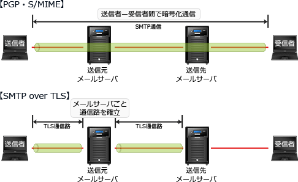

**どの方式もデジタル証明書（公開鍵証明書）を使用した技術**ですが、使用する証明書が異なります。<font color=red>PGPとS/MIMEでは電子メール自体を暗号化</font>し送信者・受信者間でエンドツーエンドの暗号化通信を行うためメールアドレスごとの証明書を使用します。一方、<font color=red>SMTP over TLS では通信経路を暗号化</font>するためメールサーバの証明書を使用し、「メールソフトと送信元メールサーバ」及び「送信元メールサーバと送信先メールサーバ」のそれぞれで安全なセッションを確立します。

- 【**PGP：Pretty Good Privacy**】公開鍵暗号方式を使用してファイルや電子メールの「暗号化」「認証」「改ざん検知」を行うツール。`RFC4880`として標準化されている。S/MIMEと同様に暗号化メールを送受信するには通信を行う両者のメールソフトがこの規格に対応していることが必要となる。公開鍵の検証にハッシュ値を使用し、さらに使用者が公開鍵に信頼度を設定し合う仕組み（web of trust：信頼の輪）で公開鍵の正当性を確保しているため、認証局を必要としないことが特徴
- 【**S/MIME(Secure/Multipurpose Internet Mail Extensions)**】電子メールを盗聴や改ざんなどから守るために**公開鍵暗号技術**を使用して 「認証」 「改ざん検出」 「暗号化」 などの機能を電子メールソフトに提供する仕組み。ただし、S/MIMEを使用するにあたり、送受信する当事者同士のメールソフトがこの規格に対応していること、およびデジタル証明書を通信当事者同士で共有しておく必要がある。
- 【**SMTP over TLS (SMTP over Transport Layer Security)**】TLSによって確立された安全な伝送路上で電子メールを送信・転送するプロトコル。導入により「送信者」から「送信者のメールサーバ」までの通信経路の暗号化が保証される。さらに、相手のメールサーバもこの方式に対応していればインターネット上でも暗号化した電子メールやり取りすることができる。

#### TLS（Transport Layer Security） <!-- omit in toc -->

OSI基本参照モデルのトランスポート層において、①通信の暗号化、②デジタル証明書を利用した改ざん検知、③ノード認証などの機能を提供する統合セキュアプロトコル。主にWebブラウザとWebサーバ間でデータを安全にやり取りするための業界標準プロトコルとして使用され、

- サーバ認証
- クライアント認証（オプション）
- 共有秘密鍵（暗号化鍵）の安全な生成

といった目的を持ちます。また、TLSは以下の特徴を持ちます。

- TLSで使用するWebサーバのデジタル証明書は **`IPアドレス`だけでなく`FQDN`でも使用可能**。
- TLSでは**鍵長40~256ビット**の共通鍵を使用して暗号化通信を行います。ただし、TLS1.1以降では40ビットの鍵の使用は禁止されています。
- TLSのデジタル証明書の内容はICカードやUSBトークン、TPM（Trusted Platform Module）などの様々な媒体に格納することができます。公的認証サービスなどを利用すると電子証明書が記録されたICカードの発行をうけることができ、例えば、**ICカードに格納**すれば認証情報を持ち運べるので、利用する端末が限定されることもありません。
- `TLS`は事前の利用者登録は不要で、また接続先もWebサーバに限られません。　<font color=red>※対応するレイヤーが違うため</font>

#### OpenID Connect（OIDC） <!-- omit in toc -->

**OAuth2.0（認可の仕組み）を拡張し、「利用者が誰であるか」を伝える認証の層を追加した規格**。OAuth2.0がアクセストークンで<font color=red>「何をしてよいか（認可）」</font>を扱うのに対し、OIDCは**IDトークン**で<font color=red>「誰であるか（認証）」</font>を伝える。

| 比較項目       | **OAuth 2.0**                                      | **OpenID Connect**                                |
| -------------- | -------------------------------------------------- | ------------------------------------------------- |
| 目的           | <font color=red>**認可**</font>（権限の委譲）      | <font color=red>**認証**</font>（本人確認）＋認可 |
| 発行されるもの | アクセストークン                                   | **IDトークン**＋アクセストークン                  |
| トークン形式   | 規定なし（不透明でよい）                           | **JWT（JSON Web Token）**で、署名により検証可能   |
| 用途の例       | 「このアプリに写真フォルダへのアクセスを許可する」 | 「〇〇アカウントでログインする」                  |

- 【**IDトークン**】<font color=red>発行者（iss）、利用者の識別子（sub）、宛先（aud）、有効期限（exp）、認証時刻（iat/auth_time）</font>などのクレームを含むJWT。**署名・aud・expの検証**を行わないと、他サービス向けのトークンの使い回しや偽造を許すことになる。
- 【**UserInfoエンドポイント**】アクセストークンを用いて、利用者の属性情報（プロフィール）を取得するためのAPI。
- <u>OAuth2.0を「ログイン」に流用すると、アクセストークンは「誰が」を保証しないため**なりすまし**が生じうる。認証にはOIDCを用いる</u>のが原則。

<div style="page-break-before:always"></div>

#### 送信ドメイン認証（SPF・DKIM・DMARC） <!-- omit in toc -->

SMTPには<font color=red>送信者を検証する仕組みが無い</font>ため、From欄は自由に詐称できる。そこで**DNSを利用して「そのドメインからの正規のメールか」を受信側が検証する**仕組みが送信ドメイン認証である。

```mermaid
flowchart TD
  S["📧 送信メールサーバ"] -- "メール送信" --> R["📥 受信メールサーバ"]
  R -- "①【SPF】送信元IPは正規か？<br>②【DKIM】署名は正しいか？<br>③【DMARC】認証失敗時どう扱うか？" --> D["🌐 送信元ドメインの<br>DNSサーバ<br>（TXT / DKIMレコード）"]
  R --> J{"判定"}
  J -- "pass" --> IN["受信箱へ"]
  J -- "fail" --> P["DMARCポリシーに従い<br>隔離 / 拒否"]

  style D fill:#aaf
  style J fill:#faa
```

| 方式      | 何を検証するか                                                                              | 検証に使うFrom                             | 弱点                                                          |
| --------- | ------------------------------------------------------------------------------------------- | ------------------------------------------ | ------------------------------------------------------------- |
| **SPF**   | <font color=red>送信元IPアドレスが、そのドメインの正規の送信サーバか</font>                 | **エンベロープFrom**（MAIL FROM）          | <font color=red>メールが転送されるとIPが変わり失敗する</font> |
| **DKIM**  | <font color=red>メールに付与された電子署名が正しく、改ざんされていないか</font>             | **署名対象のヘッダ**（通常ヘッダFrom含む） | 転送で本文やヘッダが書き換わると失敗する                      |
| **DMARC** | <font color=red>SPF/DKIMの結果と**ヘッダFrom**のドメインが一致（アライメント）するか</font> | **ヘッダFrom**（利用者が見るFrom）         | 送信側でのポリシー公開と運用が必要                            |

#### IPsecとVPN <!-- omit in toc -->

**IPsec**は<font color=red>ネットワーク層（IP層）で暗号化・認証を行う</font>プロトコル群。上位のアプリケーションを変更せずに通信を保護できるため、拠点間接続やリモートアクセスVPNの基盤として使われる。

```mermaid
flowchart 
  subgraph "【トランスポートモード】"
    direction TD
    T1["IPヘッダ"] --> T2["ESPヘッダ"] --> T3["🔒 TCP/UDP＋データ"]
  end
  subgraph "【トンネルモード】"
    direction TD
    N1["新IPヘッダ"] --> N2["ESPヘッダ"] --> N3["🔒 元のIPヘッダ＋TCP/UDP＋データ"]
  end

  style T3 fill:#faa
  style N3 fill:#faa
```

| 構成要素                                    | 役割                                                                                                                                                    |
| ------------------------------------------- | ------------------------------------------------------------------------------------------------------------------------------------------------------- |
| **AH**<br>(Authentication Header)           | <font color=red>認証と完全性の確認のみ</font>を行い、**暗号化はしない**。IPヘッダも保護対象に含むため、<u>NAT環境では使えない</u>                       |
| **ESP**<br>(Encapsulating Security Payload) | <font color=red>暗号化＋認証</font>を行う。実運用ではほぼESPが使われる                                                                                  |
| **IKE**<br>(Internet Key Exchange)          | <font color=red>鍵交換とSA（Security Association）の確立</font>を行うプロトコル。フェーズ1で管理用の安全な通信路を作り、フェーズ2で実データ用のSAを作る |
| **SA**<br>(Security Association)            | 暗号アルゴリズム・鍵・有効期間などの取り決め。**片方向ごとに確立**されるため、双方向通信では2本必要                                                     |

| モード                       | 暗号化される範囲                                                  | 主な用途                                      |
| ---------------------------- | ----------------------------------------------------------------- | --------------------------------------------- |
| **トランスポート<br>モード** | <font color=red>ペイロード（データ）のみ</font>                   | **ホスト間**（エンドツーエンド）の通信保護    |
| **トンネル<br>モード**       | <font color=red>元のIPパケット全体</font>（新しいIPヘッダを付加） | **拠点間VPN**。内部の実IPアドレスを隠蔽できる |

**VPNの分類**

| 方式                  | 動作レイヤ | 特徴                                                                                     |
| --------------------- | ---------- | ---------------------------------------------------------------------------------------- |
| **IPsec-VPN**         | L3         | 専用クライアントが必要だが、**あらゆるプロトコルの通信を保護**できる。拠点間接続に適する |
| **SSL/TLS-VPN**       | L4〜L7     | <font color=red>Webブラウザだけで利用でき</font>、導入が容易。リモートアクセスに適する。 |
| **L2TP/IPsec**        | L2＋L3     | L2TPでトンネルを作り、IPsecで暗号化する（L2TP単体では暗号化しない）                      |
| **インターネットVPN** | —          | インターネット上に暗号化トンネルを構築。**安価**だが品質保証はない                       |
| **IP-VPN**            | —          | 通信事業者の**閉域網**を利用（MPLSなど）。品質保証があるが高価                           |

> **リモートアクセスVPN機器は攻撃の主要な侵入口**になっている。<font color=red>VPN装置の脆弱性の速やかな修正、多要素認証の導入、アカウントの棚卸し、接続ログの監視</font>が実務上の重要な対策となる。

<div style="page-break-before:always"></div>

#### Webアプリケーションの主な脆弱性と対策 <!-- omit in toc -->

```mermaid
flowchart LR
  U["👤 利用者<br>（攻撃者）"] -- "① 細工した入力" --> W["🖥️ Webアプリ"]
  W -- "② 命令として解釈させる" --> DB[("🗄️ データベース")]
  W -- "③ そのまま出力する" --> B["🌐 他利用者の<br>ブラウザ"]
  W -- "④ ファイル名として使う" --> F["📁 サーバ内の<br>ファイル"]
  W -- "⑤ コマンドとして渡す" --> OS["⚙️ OSのシェル"]

  style W fill:#faa
```

> 多くのWebアプリ脆弱性は<font color=red>**「利用者からの入力を、そのまま別の処理系（SQL・HTML・シェル・ファイルパス）へ渡してしまう」**</font>という同じ構図から生じる。対策の基本は**入力値の検証**と、渡す先ごとの**適切なエスケープ／APIの使用**である。

| 脆弱性                                         | 攻撃の内容                                                                                                                        | 主な対策                                                                                                                                                                                                    |
| ---------------------------------------------- | --------------------------------------------------------------------------------------------------------------------------------- | ----------------------------------------------------------------------------------------------------------------------------------------------------------------------------------------------------------- |
| **SQLインジェクション**                        | 入力値にSQL文の断片を混入させ、<font color=red>DBの不正操作・情報漏えい・認証回避</font>を行う                                    | <font color=red>**プレースホルダ（プリペアドステートメント）によるバインド機構の使用**</font>／やむを得ない場合は特殊文字のエスケープ／**DB接続アカウントの権限を最小化**／エラーメッセージを画面に出さない |
| **クロスサイトスクリプティング（XSS）**        | 罠のリンクや投稿を通じて、<font color=red>他の利用者のブラウザ上で任意のスクリプトを実行</font>させ、Cookie窃取や画面改ざんを行う | <font color=red>**出力時のエスケープ**（`< > & " '`のHTMLエンティティ化）</font>／`Content-Type`と文字コードの明示／**CSP**の設定／CookieへのHttpOnly付与                                                   |
| **ディレクトリトラバーサル**                   | ファイル名パラメータに`../`などを与え、<font color=red>公開領域外のファイルを閲覧・取得</font>する                                | <font color=red>**外部からファイル名を直接指定させない**</font>／ファイル名から**ディレクトリ部分を除去**する／固定ディレクトリ配下に限定する／Webサーバの権限を最小化                                      |
| **OSコマンドインジェクション**                 | 入力値に`;`や`\|`などを混入させ、<font color=red>サーバ上で任意のOSコマンドを実行</font>させる                                    | <font color=red>**シェルを起動する関数を使用しない**</font>／使う場合は引数を厳密に検証し、シェルのメタ文字をエスケープする                                                                                 |
| **クリックジャッキング**                       | 透明化した罠ページを重ね、<font color=red>利用者に意図しないボタンを押させる</font>                                               | <font color=red>**`X-Frame-Options`** または **CSPの`frame-ancestors`**</font>で他サイトからのフレーム表示を禁止／重要操作の前に再認証・確認画面                                                            |
| **HTTPヘッダインジェクション**                 | リダイレクト先などに改行コードを混入させ、<font color=red>任意のレスポンスヘッダやボディを挿入</font>する                         | ヘッダ出力用のAPIを使用する／**改行コードを許可しない**                                                                                                                                                     |
| **オープンリダイレクト**                       | 遷移先URLを外部サイトに変更させ、フィッシングに悪用する                                                                           | 遷移先を**固定またはホワイトリスト**で管理する                                                                                                                                                              |
| **サーバサイドリクエストフォージェリ（SSRF）** | サーバに内部ネットワークやクラウドのメタデータへリクエストさせる                                                                  | 接続先を**許可リスト**で制限する／内部アドレスへの接続を禁止する                                                                                                                                            |

**多層での対策**

- 【**WAF**】アプリケーションの改修が間に合わない場合の**緩和策**として有効だが、<font color=red>根本対策はアプリケーション側の修正</font>である。
- 【**セキュリティバイデザイン**】<font color=red>企画・設計段階からセキュリティを考慮</font>する考え方。運用開始後の改修よりも対策コストが小さい。
- IPA「**安全なウェブサイトの作り方**」が具体的な実装指針として参照される。

#### HSTS（HTTP Strict Transport Security） <!-- omit in toc -->

ブラウザに対して「**常にHTTPS（暗号化通信）でアクセスせよ**」と強制する機能。

1. **利用者がWebサイトへHTTPSでアクセスする**（例：`https://example.com`）
2. **WebサーバがHTTPS通信でレスポンスを返す**
3. **ブラウザがHSTS情報を記憶する**
※`max-age` で指定された期間、対象サイトへのHTTPアクセスを禁止する。
1. **利用者がHTTPのURLを入力する**（例：`http://example.com`）
2. **ブラウザがHTTP通信を行う前にHTTPSへ変更する**（`http://example.com`→`https://example.com`）
3. **ブラウザがHTTPSでWebサーバへ接続する**。これにより、HTTP通信自体が発生しないため、**SSLストリッピング攻撃などのHTTPへのダウングレードを防止できる**。

手順2.について、具体的にはWebサーバのHTTPレスポンスヘッダーに`Strict-Transport-Security`を付与します。

```bash
// アクセスから365日間、サブドメインも含めてHTTPS接続を強制
Strict-Transport-Security: max-age=31536000; includeSubDomains; preload
```

- **max-age=<秒数>（必須）** HSTSの効果をブラウザにキャッシュさせる期間です。上記（31536000秒）は1年間を意味します。この期間内は、ブラウザが自動的にHTTPSに変換します。
- **includeSubDomains（任意）** 本ドメイン（`example.com`）だけでなく、すべてのサブドメイン（`api.example.com`や`blog.example.com`など）にもHSTSを強制します。
- **preload（任意）** 後述する「HSTSプリロードリスト」への登録を申請する際に必要な属性です。

<font color=red>ただし、初回のHTTPアクセスは暗号化されていないため、HTTPSページへのリダイレクト前に攻撃（リダイレクト先の書換えや中間者攻撃など）を受ける可能性が残されています</font>。

## その他の分野

### データベース


### ネットワーク

#### URL・FQDN・ドメイン <!-- omit in toc -->


- 【**URL（Uniform Resource Locator）**】Webページのアドレスを表す文字列。WebブラウザのアドレスバーにURLを入力することでWebページをブラウザに取ってくることができます。
- 【**ドメイン**】組織・サービスなどを識別するDNS上の範囲。インターネット上（またはLAN上）のネットワークを特定する文字列
- 【**FQDN（Fully Qualified Domain Name：完全就職ドメイン名）**】「ホスト名＋ドメイン」で表現される、ホスト名を含めた完全な名前（【例】`www`＋`google.com`）
- 【**ホスト名**】ドメイン内の個々のコンピュータやサービスを識別する名前（例：`www`、`news`、`mail`、`blog`など）

#### GETメソッド / POSTメソッド <!-- omit in toc -->


HTMLフォームからの入力データがWebサーバに送付される時、GETメソッドではURLの一部としてパラメータが記述され、リクエストライン（HTTPリクエストの1行目）に含まれます。一方、POSTメソッドではパラメータはメッセージボディに含まれます。 

**GETメソッド→URL内のクエリパラメータに記述**

送信するパラメータを**URLの末尾に付加する方式**。URL本体とパラメータをIt? IIで区切り、その後に 「キー＝値」の形式でパラメータを指定する 

> GET /search?<font color=red>q=security</font> HTTP/1.1
> Host: www.example.com
> User-Agent:Mozilla/5.0(Windows NT 10.0;Win64;x64)
> ...
> Connection:keep-alive

**POSTメソッド→メッセージボディに含まれる**

送信するパラメータを**メッセージボディに含める方式**。<u>URLにパラメータが含まれないためアクセスログ等にパラメータが記録されにくい</u>。

> POST /login HTTP/1.1
> Host: www.example.com
> User-Agent:Mozilla/5.0(Windows NT 10.0;Win64;x64)
> ...
> Connection:keep-alive
> 
> <font color=red>username=taro&password=abcdl234</font>

#### ARP（Address Resolution Protocol）とRARP（Reverse ARP） <!-- omit in toc -->

- **ARP**：IPアドレスからMACアドレスを求める。GARP（Gratutious ARP）は自分自身のIPアドレスをネットワークに自発的に知らせる特殊なARPパケットである。<font color=red>DHCPサーバから配布されたIPv4アドレスが使用されていないことをクライアント自身でも確認する際に使用するプロトコルである</font>。
- **RARP**：MACアドレスからIPアドレスを求める。

#### スパニングツリープロトコル（STP） <!-- omit in toc -->


スパニングツリープロトコル(STP)は、ループ状になっているネットワークをルートブリッジを根とした論理的なツリー構造のトポロジーとして扱うためのプロトコルでIEEE802.1D として標準化されています。スパニングツリーを形成するために決定されるのがツリー構造の根となるルートブリッジ、枝を形成するためのルートポート、代表ポートです。

- **ルートポート（Root Port）** ルートブリッジ以外のブリッジにおいて、ルートブリッジまでの経路コストが最小となるポートのこと。経路コストは使用している経路の帯域幅によって求められ、帯域幅が大きいほどコストは小さくなる。
- **代表ポート（Designated Port）** ブリッジや機器を接続する各リンクにおいて、ルートブリッジまでの経路コストが最小となるポートのこと。
- **非代表ポート（Non Designated Port）** スパニングツリー内のブリッジの中で、ルートポートでも代表ポートでもないポート。

#### IPv4とIPv6 <!-- omit in toc -->

セキスペ向け暗記ポイントは次のとおり。特に、「**IPv6ではARPではなくNDPを使う**」、「**IPv6ではブロードキャストを使わない」**、**「フラグメントは送信元が行う**」の3点が重要です。

> **IPv6 = 128bit / ARPなし / NDP / ブロードキャストなし / ルータはフラグメントしない**


**IPv4 / IPv6 共通点**

| 項目             | 共通点                                                |
| ---------------- | ----------------------------------------------------- |
| 役割             | **ネットワーク層**でIPパケットを配送                  |
| 通信             | **送信元IPアドレス → 宛先IPアドレス**で通信相手を識別 |
| ルーティング     | **ルータ**を経由して異なるネットワークへ配送          |
| 上位層           | TCP / UDP / ICMPなどと組み合わせて利用                |
| ベストエフォート | IP自体は**到達保証・順序保証をしない**                |

**IPv4 / IPv6 主な違い**

| 項目               | IPv4（`192.168.1.1`） | IPv6（`2001:db8::1`）    |
| ------------------ | --------------------- | ------------------------ |
| アドレス長         | **32ビット**          | **128ビット**            |
| アドレス数         | 約 **43億**           | 約 **3.4×10³⁸**          |
| アドレス表記       | 10進数＋`.`           | 16進数＋`:`              |
| ブロードキャスト   | **あり**              | **なし**                 |
| ARP                | **使用する**          | **使用しない**           |
| アドレス解決       | ARP                   | **NDP**                  |
| IPヘッダ           | 可変長                | **基本40バイト・固定長** |
| ヘッダチェックサム | **あり**              | **なし**                 |
| フラグメント       | ルータでも可能        | **送信元ホストのみ**     |
| NAT                | **広く利用**          | 原則不要                 |
| 自動設定           | DHCPなど              | **SLAAC / DHCPv6**       |

#### VRRP（Virtual Router Redundancy Protocol） <!-- omit in toc -->

ネットワークのデフォルトゲートウェイとなるルータやL3スイッチの冗長構成を実現するプロトコル。VRRPでは複数台のルータに共通して使える仮想IPアドレス・仮想MACアドレスを用意し、障害発生時には2つのアドレスをフェールオーバーで待機系に移すことで継ぎ目なく処理を続行します。この仕組みによってホストのデフォルトゲートウェイの設定値などを変更することなしに、送信先の装置を正常稼働するものに置き換えることが可能になっています。

#### pingコマンド（ICMP：Internet Control Message Protocol） <!-- omit in toc -->

ICMP(Internet Control Message Protocol)は、インターネットプロトコル（IP）の通信制御を補完するプロトコルでデータ配送中のエラー通知や送達エラーを通知する機能を持ちます。ネットワークのトラブルシューティングや管理のために非常に重要なプロトコルです。

| ICMP Type | 名前                    | `ping`との関係                 |
| --------: | ----------------------- | ------------------------------ |
|     **0** | Echo Reply              | pingの**応答**                 |
|     **3** | Destination Unreachable | pingが**到達不能になった場合** |
|     **5** | Redirect                | pingとは直接関係しない         |
|     **8** | Echo Request            | pingの**要求**                 |
|    **11** | Time Exceeded           | TTL切れ時に返る                |


**tcpdumpコマンドで確認**

```bash
$ sudo tcpdump -n -i any icmp
tcpdump: data link type PKTAP
tcpdump: verbose output suppressed, use -v[v]... for full protocol decode
listening on any, link-type PKTAP (Apple DLT_PKTAP), snapshot length 524288 bytes
...

# Type 8 Echo Request
09:09:29.744704 IP 192.168.151.13 > 8.8.8.8: ICMP echo request, id 53867, seq 3, length 64

# Type 0 Echo Reply
09:09:29.762604 IP 8.8.8.8 > 192.168.151.13: ICMP echo reply, id 53867, seq 3, length 64

# Type 3 Destination Unreachable
09:09:34.649490 IP 192.168.150.1 > 192.168.151.13: ICMP 52.43.0.106 unreachable - need to frag (mtu 1454), length 556
```

### システム開発技術

#### 障害対策（fault・fail・fool） <!-- omit in toc -->

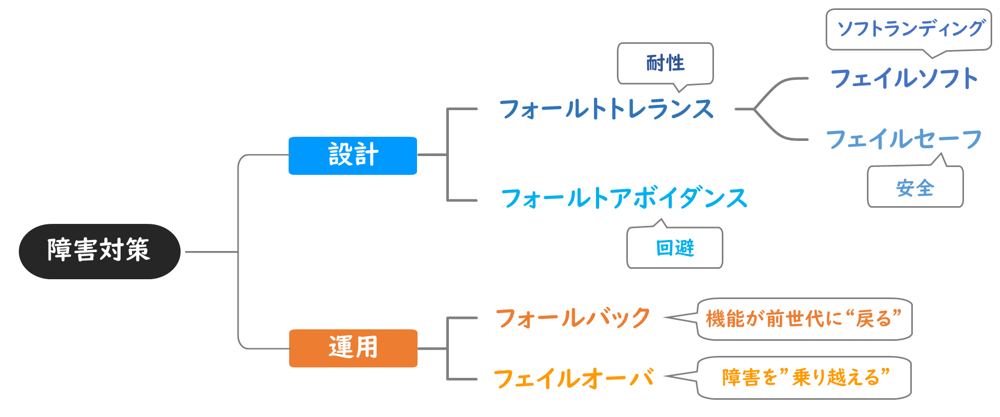

| 用語                       | 一言でいうと                     | 覚え方               |
| -------------------------- | -------------------------------- | -------------------- |
| **フォールトアボイダンス** | 障害を発生させない               | **障害を避ける**     |
| **フォールトトレランス**   | 障害が起きても継続する           | **障害に耐える**     |
| **フェイルオーバー**       | 障害系から別系へ切り替える       | **系を替える**       |
| **フォールバック**         | 別の代替手段へ切り替える         | **方法を替える**     |
| **フェイルセーフ**         | 障害時に安全側へ移行する         | **安全を優先**       |
| **フェイルソフト**         | 一部機能を停止して重要機能を継続 | **機能を縮退**       |
| **フールプルーフ**         | 人がミスしても事故を起こさない   | **ミスしても大丈夫** |

### ソフトウェア開発管理技術

#### 開発請負契約における著作権の帰属先 <!-- omit in toc -->

<u>請負契約書に特段の取決めがない場合、**請負契約で開発した成果物の著作権は請負人に帰属する**</u>。
著作権が請負人にある状況では、納品されたソフトウェアの使用や改変が自由にできず、また他社への流用なども防止できない。このため次の2点はソフトウェア請負契約書における最低限のチェックポイントになる。

1. 【**チェックポイント1**】<font color=red>一般的には請負契約書に「著作権を注文者に譲渡する特約」を設けることで発注元が著作物を自由に取り扱えるようにする</font>。 
2. 【**チェックポイント2**】著作者人格権に関しても不行使という形で約定する。

#### プログラムの著作権管理 <!-- omit in toc -->

プログラムの著作権は結果的に既存ソフトウェアと同等の機能を持つものを開発したとしても、**その創作方法に独自性があれば別個の著作物として認められる**。そのほか見るべき観点は次のとおり。

- 使用許諾契約を締結した上で許諾契約の範囲内で販売していれば著作権の侵害にはならない。
- ①技術の実用化試験、②情報解析、③AI開発等の情報処理の過程における利用、などのように著作物に表現された思想や感情の享受を目的にしない場合には、必要と認められる限度において著作物を許諾なく利用することができる。

一方、<font color=red>著作物に技術的利用制限手段が施されている場合、それを回避する行為は著作権を侵害する行為とみなされます。</font>

### サービスマネジメント


### システム監査

#### 財務報告に係る内部統制の評価及び監査に関する実施基準（令和5年）におけるITに係る全般統制 <!-- omit in toc -->

ITを取り入れた情報システムに関する統制は「全般統制」と「業務処理統制」の2つから構成される。

- 【**全般統制**】組織や集団全体としての統制環境整備を目的として、業務処理統制が有効に機能する環境を保証するための統制活動を意味しており、通常、複数の業務処理統制に関係する方針と手続きをいう。
  1. <font color=red>システムの開発・保守に係る管理</font>
  2. システムの運用・管理
  3. 内外からのアクセス管理などのシステムの安全性の確保
  4. 外部委託に関する契約の管理
- 【**業務処理統制**】個々の業務の正確性を保証するための手続きであり、業務を管理するシステムにおいて承認された業務がすべて正確に処理・記録されることを確保するために業務プロセスに組み込まれたITにかかる内部統制である。
  1. 入力情報の完全性、正確性、正当性等を確保する統制
  2. 例外処理の修正と再処理
  3. マスタデータの維持管理
  4. システムの利用に関する認証、操作範囲の限定
