# 情報処理安全確保支援士 <!-- omit in toc -->

- [セキュリティ](#セキュリティ)
  - [情報セキュリティ](#情報セキュリティ)
  - [情報セキュリティ管理](#情報セキュリティ管理)
  - [セキュリティ技術評価](#セキュリティ技術評価)
  - [情報セキュリティ対策](#情報セキュリティ対策)
  - [セキュリティ実装技術](#セキュリティ実装技術)
- [その他の分野](#その他の分野)
  - [データベース](#データベース)
  - [ネットワーク](#ネットワーク)
  - [システム開発技術](#システム開発技術)
  - [ソフトウェア開発管理技術](#ソフトウェア開発管理技術)
  - [サービスマネジメント](#サービスマネジメント)
  - [システム監査](#システム監査)

<div style="page-break-before:always"></div>

## セキュリティ

### 情報セキュリティ

#### 境界型防御とゼロトラスト（例：ADとEntraID） <!-- omit in toc -->

```Mermaid
flowchart LR
  subgraph "【<b>境界型防御</b>】"
    AD["AD DS"]
    AD --> OnPrem["オンプレミス<br>ファイルサーバ・<br>業務システム"]
  end
  
  AD -- ID同期 ---> Entra

  subgraph "【<b>ゼロトラスト</b>】"
    Entra --> M365["Microsoft 365"]
    Entra --> Azure["Azure"]
    Entra --> SaaS["SaaS"]
  end

  style AD fill:#faa
  style Entra fill:#aaf
```

|              | AD                                      | Entra ID                                           |
| ------------ | --------------------------------------- | -------------------------------------------------- |
| 主な環境     | オンプレミス                            | クラウド                                           |
| 管理対象     | PC、サーバー、ユーザー                  | ユーザー、アプリ、クラウドサービス                 |
| ネットワーク | 社内LANとの結び付きが強い               | インターネット前提                                 |
| 認証         | Kerberos / NTLM など                    | OAuth 2.0 / SAML / SCIM <br> / OpenID Connect など |
| 管理単位     | ドメイン                                | テナント                                           |
| 代表用途     | Windowsログイン、<br>ファイルサーバ認証 | Microsoft 365、Azure、SaaS                         |
| 重要な考え方 | ドメイン中心                            | ID中心                                             |

<div style="page-break-before:always"></div>

**境界型防御**

> **基本的な考え：外部は危険、内部は信頼できる**

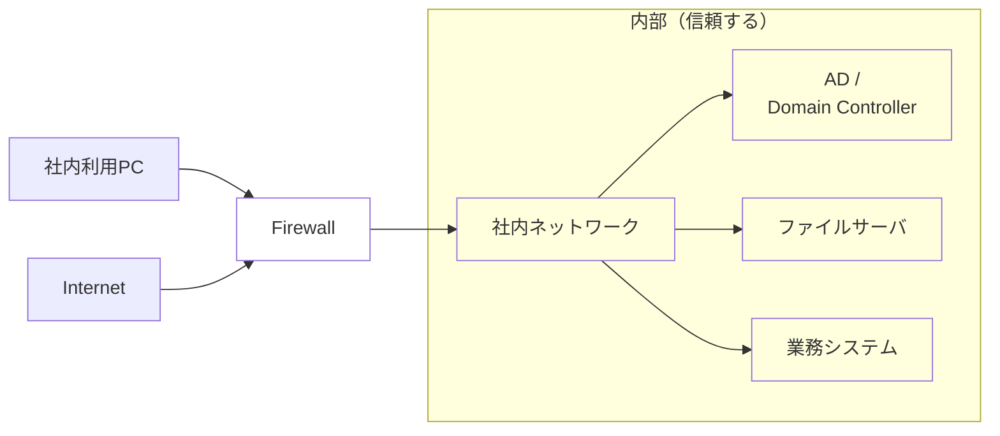

| 項目             | 境界型防御                                 |
| ---------------- | ------------------------------------------ |
| **防御の中心**   | **ネットワーク境界**                       |
| **外部**         | 信頼しない                                 |
| **内部**         | 比較的信頼する                             |
| **代表技術**     | Firewall、VPN                              |
| **ID管理**       | AD                                         |
| **認証**         | Kerberos、NTLMなど                         |
| **アクセス制御** | ネットワークの場所や接続元などを基準に判断 |
| **権限**         | ADのユーザー・グループなどに基づいて付与   |
| **前提**         | 社内ネットワークをある程度信頼             |

<div style="page-break-before:always"></div>

**ゼロトラスト**

> **注目された背景**：クラウドやテレワークの拡大により、従来の「社内＝信頼、社外＝危険」という境界が崩れた。また、フィッシングなどによる認証情報を窃取する攻撃も増加したため、ネットワークの場所だけでアクセスを信頼する境界型防御では不十分になった。
> 
> **基本的な考え：社内外問わず、何も信頼せず常に検証する**

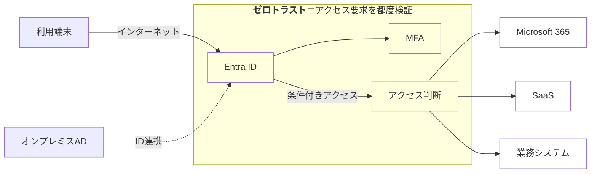

| 項目             | ゼロトラスト                                           |
| ---------------- | ------------------------------------------------------ |
| **防御の中心**   | **ID・端末・アクセス・データなど**                     |
| **外部**         | 信頼しない                                             |
| **内部**         | 信頼しない                                             |
| **代表技術**     | Entra ID、MFA、Conditional Access                      |
| **ID管理**       | Entra ID                                               |
| **認証**         | OAuth 2.0、OpenID Connect、SAML、MFAなど               |
| **アクセス制御** | 利用者・端末・場所・リスクなどの条件で判断             |
| **権限**         | 最小権限                                               |
| **前提**         | **侵害されることを前提に、アクセスを継続的に検証する** |

<div style="page-break-before:always"></div>


#### SSO（Single Sign-On） <!-- omit in toc -->


- 【**エージェント方式**】Webサーバに**エージェントを導入**し、Cookieなどで認証情報を共有してSSOを実現する方式。
- 【**代理認証方式**】SSOシステムが利用者に代わって**ID・パスワードを各システムへ入力**してSSOを実現する方式。
- 【**リバースプロキシ方式**】Webシステムの**前段にリバースプロキシを配置**し、認証済みの通信を各システムへ中継してSSOを実現する方式。
- 【**フェデレーション方式**】**IdPが利用者を認証し、認証結果をSPへ連携**する認証方式。

| 方式                         | メリット                                                                                   | デメリット                                                                                                     |
| ---------------------------- | ------------------------------------------------------------------------------------------ | -------------------------------------------------------------------------------------------------------------- |
| **エージェント<br>方式**     | ・既存サービスに組込みやすい<br>・サービス毎に認証を制御可能                               | ・SSO対象の各サーバに<br>　導入が必要<br>・同じドメインでの利用が基本                                          |
| **代理認証<br>方式**         | ・既存サービスを大きく<br>　変更せずに導入できる<br>・ログイン操作を自動化できる           | ・クライアントPCにIDと<br>　パスワードの保持が必要<br>・認証情報漏えい時の影響大<br>・ログイン画面の変更に弱い |
| **リバースプロキシ<br>方式** | ・各サービスにエージェントを<br>　導入する必要がない<br>・認証を一元管理できる             | ・リバースプロキシが**単一<br>　障害点**になる可能性がある<br>・冗長化が必要                                   |
| **フェデレーション<br>方式** | ・異なるドメイン間でSSOできる<br>・認証をIdPに集約できる<br>・クラウド製品との連携に適する | ・IdPとSP間の連携設定が必要<br>・IdP障害時に複数サービスへ<br>　影響する                                       |

#### SAML（Security Assertion Markup Language） <!-- omit in toc -->

認証情報を安全に交換するためのXMLベースのマークアップ言語。SAMLを使用することで、同一ドメインに留まらないサイトにおいてもSSOの仕組みやセキュアな認証情報管理を実現できる。

| メリット                       | 内容                                                |
| ------------------------------ | --------------------------------------------------- |
| **SSO**                        | 1回の認証で複数のサービスを利用できる               |
| **認証の一元管理**             | パスワード管理をIdPに集約できる                     |
| **異なるドメイン間で利用可能** | Cookieだけでは実現しにくいドメイン間SSOを実現できる |
| **標準規格**                   | ベンダー独自方式ではなく標準的な方式で連携できる    |
| **パスワードをSPに渡さない**   | SPはユーザーの認証情報そのものを管理しなくてよい    |

| デメリット                | 内容                                                     |
| ------------------------- | -------------------------------------------------------- |
| **IdPへの依存が大きい**   | IdPが停止すると複数サービスにログインできなくなる        |
| **構築・設定が複雑**      | IdP・SP間の信頼関係、証明書、Assertionなどの設定が必要   |
| **証明書管理が必要**      | 署名検証用証明書の更新・失効管理が必要                   |
| **Assertionの漏洩に注意** | 攻撃者に盗まれると、不正ログインに利用される可能性がある |

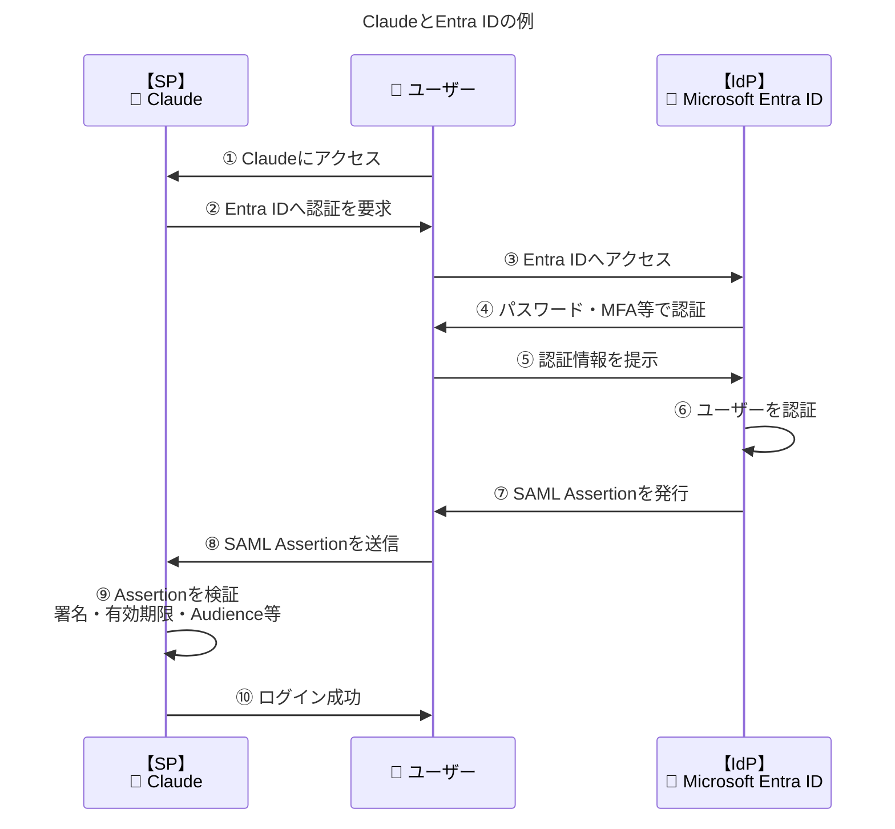

|   No.    | 攻撃例                          | 具体的な攻撃                 | 主な対策                                        |
| :------: | ------------------------------- | ---------------------------- | ----------------------------------------------- |
|  **①**   | **フィッシング**                | 偽の認証画面で認証情報を窃取 | **MFA / FIDO2**                                 |
| **③〜⑤** | **中間者攻撃**                  | 認証通信を盗聴・改ざん       | **HTTPS / TLS**                                 |
|  **⑧**   | **リプレイ攻撃**                | 盗んだSAML Assertionを再利用 | **有効期限・発行時刻・<br>AssertionID等の検証** |
|  **⑧**   | **Assertion流用**               | 別のSP向けにAssertionを使用  | **Audienceの検証**                              |
|  **⑨**   | **Assertionの<br>改ざん・偽造** | Assertionを改ざん・偽造      | **XML電子署名の検証**                           |

#### マルウェアMirai <!-- omit in toc -->

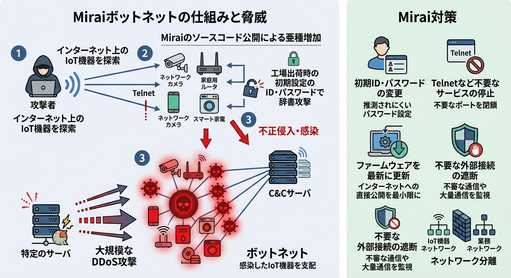

ネットワークカメラや家庭用ルータやスマート家電などのIoT機器に感染してボット化するマルウェア。`Mirai` が構築したボットネットは過去最大級の規模のDDoS攻撃を引き起こしています。
　また、`Mirai` はソースコードが公開されているため様々な亜種が生まれており、IoT機器におけるセキュリティ上の脅威となっています。

1. 攻撃者がインターネット上のIoT機器をランダムに探索する
2. `Telnet`などの公開サービスに接続を試みる
3. 工場出荷時の初期設定のID・パスワードなどを使って辞書攻撃を行う
4. IoT機器に不正侵入し、`Mirai`に感染させる
5. 感染したIoT機器をボットネットとして支配する
6. C&Cサーバの指示に従って大量の感染IoT機器から特定のサーバへDDoS攻撃を行う

**対策**

- 工場出荷時のIoT機器の<font color=red>初期ID・パスワードを変更</font>する（**推測されにくいパスワード**設定）
- <font color=red>Telnetなど不要なサービスを停止</font>する
- **不要なポートを閉鎖**する
- IoT機器の<font color=red>ファームウェアを最新の状態に更新</font>し、**インターネットへの直接公開を最小限にする**
- FWなどで<font color=red>不要な外部からの接続を遮断</font>し、IoT機器からの**不審な通信や大量通信を監視**する
- IoT機器を業務ネットワークなどから**ネットワーク分離**する

#### NTP（Network Time Protocol）リフレクション攻撃 <!-- omit in toc -->


ネットワーク機器を正しい時刻に合わせるためのNTPの仕組みを悪用した**反射型DoS攻撃の一種**。

1. 送信元IPアドレスを詐称したリクエストパケットを公開NTPサーバに対して大量に送り付ける。リクエストパケットにはNTPサーバが過去にやり取りした最大600件のアドレスを返す`monlist`コマンドを指定する。
<font color=red>※【**`monlist`**】NTPサーバが保持している最近のクライアントIPアドレス、接続時刻、接続回数アドを取得するためのNTPサーバの管理用コマンド</font>
2. 公開NTPサーバは大量のアドレスが記述されたレスポンスパケットを詐称された送信元IPアドレス宛に送信する。
3. 大量のレスポンスパケットが送信されたサイトではトラフィックが大幅に増加し、サービス不能に陥る。
4. 大量のNTPサーバーから増幅された巨大な応答データが一斉に標的に送りつけられ、回線やサーバーの処理能力が低下・パンクする。

攻撃の流れとしてはDNS amp攻撃などと同様ですが、NTPの`monlist`の仕様上、200バイト程度のリクエストに対して、その100倍以上のレスポンスパケットが生じることもあり、パケットの増幅率の大きさが特徴の1つになっています。対策は以下の通りです。

- 【**対策1：monlistの無効化**】設定ファイル（/etc/ntp.conf）に disable monitor を追加します。統計情報の要求（MONLISTコマンド）に対する応答を止めます。
- 【**対策2：アクセス制限（ファイアウォール）**】外部へ公開する必要がないNTPサーバーは、インターネットからのUDP 123番ポートへのアクセスを遮断します。内部ネットワークや信頼できるIPからのアクセスのみ許可します。
- 【**対策3：NTP機能の停止**】サーバーやルーターでNTPサーバー機能を使わない場合は、サービス自体を停止します。

#### Smurf攻撃 <!-- omit in toc -->


Smurf 攻撃(スマーフアタック)とは、ネットワークの疎通確認に使用される **`ICMP echo request(ping)`** の仕組みを悪用して、相手のコンピュータやネットワークに大量のパケットを送りつける反射型のDoS攻撃です。攻撃者は以下の手順で攻撃対象のサービスを妨害します。

1. 送信元IPアドレスを攻撃対象のコンピュータに**偽装**した `ICMP echo request` を、攻撃対象が属す るネットワークに**ブロードキャスト**で大量に送りつける
2. `ICMP echo request` を受け取ったネットワーク内の端末が一斉に攻撃対象に "echo reply"パケットで応答する
3. 大量の応答パケットの発生により、攻撃対象のコンピュータおよびネットワークが過負荷状態になり正常なサービスが阻害される

- 【**対策1：ブロードキャストの無効化**】ルーターでICMPブロードキャスト要求を無視するように設定する。
- 【**対策2：パケットフィルタリング**】自社ネットワーク外からの偽装IPパケット（送信元が内部IPの外部パケットなど）を遮断する。

<div style="page-break-before:always"></div>

#### サイバーキルチェーン攻撃 <!-- omit in toc -->


サイバーキルチェーンは、サイバー攻撃の手順を攻撃者の視点からモデルしたものであり、以下の7段階が一般的。各段階における防御策の立案に役立てることができます。

1. **偵察** 標的に関する情報を収集して調査する
2. **武器化** 攻撃のためのマルウェアを用意する
3. **配送（デリバリ）** メールやWebサイトを使って標的にマルウェアを送付／配信する、または標的のシステムに侵入する
4. **エクスプロイト（攻撃）** 標的にマルウェアを実行させる
5. **インストール** 標的のPCがマルウェアに感染する
6. **遠隔操作（c&c）** マルウェアとC&Cサーバを通信させて標的のサーバを遠隔操作する
7. **目的の実行** 秘密情報を得る、サービス停止、改ざんなど攻撃者の目的を達成する 

#### メッセージ認証符号（MAC: Message Authentication Code） <!-- omit in toc -->

メッセージ認証符号とは、やり取りされるメッセージと送信者と受信者が持つ共通鍵をもとに生成される固定長のビット列で受信者側でメッセージ生成元の認証とメッセージの完全性を確認するために使われます。以下の2つの方式が代表的です。

- **CMAC（Cipher-based MAC）** メッセージをブロック暗号アルゴリズムで暗号化し、暗号文の最後のブロックをMACとして利用する
- **HMAC（Hash function-based MAC）** メッセージと共通鍵を組み合わせたものをハッシュ化したものをMACとして利用するMACを用いたメッセージ認証。手順は次のとおり。なおメッセージ自体は暗号化されていないため受信者側での復号は不要。
  1. 送信者はメッセージを共通鍵で暗号化してMACを生成し、メッセージとともに送信する
  2. 受信者は受け取ったメッセージと共通鍵を使用して同様の方法でMACを生成し、受信したMACと自分が生成したMACを比較する
  3. メッセージ、鍵、アルゴリズムが同じであれば、生成されるMACは同じになるので、両者が一致すればメッセージの破損・改ざんがないことを確認できる

#### PQC（Post-Quantum Cryptography：耐量子暗号） <!-- omit in toc -->

`Post-Quantum`とは、量子コンピュータ実現後の世界のことを示しています。現代において基礎技術となっている公開鍵暗号では、素因数分解や離散対数問題を解く際に天文学的な計算量を要することを安全性の根拠としていますが、量子コンピュータが実現するとこれらが効率的に解けるようになってしまいます。
PQCは量子コンピュータによる解読に対しても耐性をもつ暗号化方式を指します。量子コンピュータの登場を見据えて開発が進められています。

#### AES（Advanced Encryption Standard） <!-- omit in toc -->

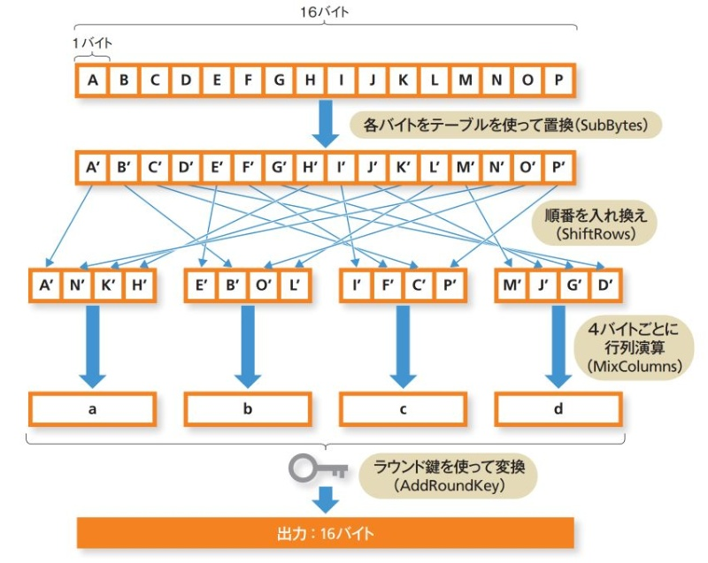

データの暗号化と復号に同じ鍵を使う「共通鍵暗号方式」の代表的な規格。以下の特徴を持つ。

- <font color=red>鍵の長さは 128ビット・192ビット・256ビット の3種類</font>から選べ、数字が大きいほど安全性が高くなる。
- 暗号化処理では、①SubBytes、②ShiftRows、③MixColumns、④AddRoundKeyの4つを行います。
  1. 【**①SubBytes**】専用の変換表（S-box）を使って1バイトずつ別の値に置き換える。
  2. 【**②ShiftRows**】行列の行ごとにバイトを左へ巡回シフトさせる。
  3. 【**③MixColumns**】列単位でデータを数学的に混合・撹拌する。
  4. 【**④AddRoundKey**】 拡張された鍵（ラウンド鍵）とデータの排他的論理和を取る。

#### ブロック暗号 <!-- omit in toc -->

**固定長のビット列ごとにまとめて暗号化する仕組み**。実際にプログラム上などで暗号方式を指定する際には、仮に AESであれば 「AES -128-CBC」といった形で指定します。最後の「CBC」が暗号利用モードの指定です。ブロック暗号の暗号利用モードは`CTR`の他に`ECB`、`CBC`、`CFB`、`OFB`などがあります。

- **ECB(Electronic CodeBook)** 平文ブロックごとに暗号化したものを、 そのままを暗号文ブロックとする (解析される危険性があるため非推奨)
- **CBC(Cipher Block Chaining)** ひとつ前の暗号文ブロックと平文ブロックの排他的論理和をとり、 排他的論理和の値に暗号化を行っ て暗号文ブロックを得る
- **CFB (Cipher FeedBack)** ひとつ前の暗号文ブロックをさらに暗号化し、 それと平文ブロックの排他的論理和を行って暗号文ブ ロックを得る
- **OFB (Output FeedBack)** 暗号アルゴリズムの出力と平文ブロックの排他的論理和を行って暗号文ブロックを得る
- <font color=red><b>CTR (CounTeR)</b> 1ずつ増加していくカウンターを利用した鍵ストリームと、平文ブロックの排他的論理和をとって暗号文ブロックを得る</font>


```text
ブロック暗号
  │
  ├─ ブロック単位
  │   ├─ ECB  ── 独立処理だが安全性に問題
  │   └─ CBC  ── 前ブロックに依存
  │
  └─ ストリーム的
      ├─ CFB
      ├─ OFB
      └─ CTR ── 並列処理可能
                  │
                  └─ CTR + 認証
                         ↓
                        GCM
                   （暗号化＋認証）
```

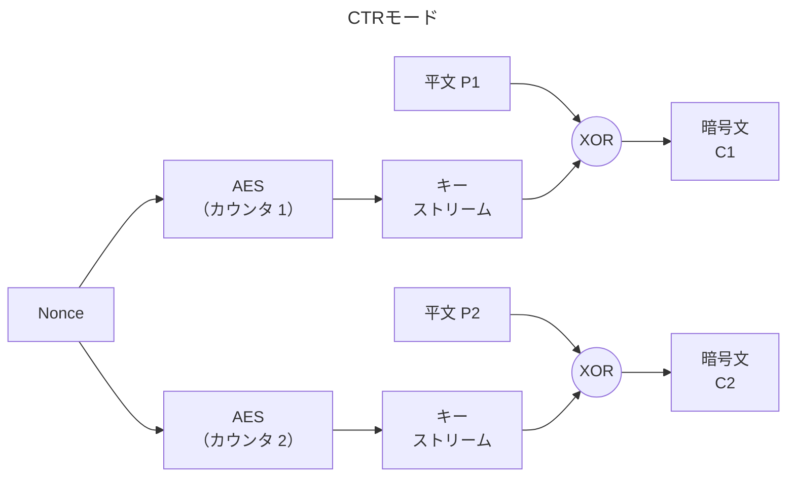

#### XMLデジタル署名 <!-- omit in toc -->

```xml
<!-- 元データ：invoice.xml -->
<invoice>
    <amount>10000</amount>
    <customer>山田太郎</customer>
</invoice>

<!-- 署名：signature.xml -->
<Signature>
    <SignedInfo>
        <Reference URI="invoice.xml"/>
    </SignedInfo>
    <SignatureValue>
        ABCDEFG...
    </SignatureValue>
</Signature>
```

XMLデジタル署名は、 XML文書にデジタル署名を埋め込むための仕様で、 RFC 3075として標準化され ています。 デジタル署名と同様に完全性・認証・ 否認防止などのセキュリティ機能を提供します。

XMLデジタル署名には、署名と署名対象の関係性によって3つがあります。

- **デタッチ署名 (Detached Signature)** 署名と署名対象が独立している方式。上の`invoid.xml`と`signature.xml`を完全に分離したものであり、紙の契約書と別紙の署名証明書のようなもののイメージ。
- **エンベロープ署名 (Enveloped Signature)** 署名対象の内部に署名を埋め込む方式
  ```xml
  <!-- エンベロープ署名 -->
  <invoice>
      <amount>10000</amount>
      <customer>山田太郎</customer>
      <Signature>
          <SignedInfo>
              ...
          </SignedInfo>
          <SignatureValue>
              ABCDEFG...
          </SignatureValue>
      </Signature>
  </invoice>
  ```
- **エンベローピング署名 (Enveloping Signature)** 署名の内部に署名対象を埋め込む方式
  ```xml
  <!-- エンベローピング署名 -->
  <Signature>
      <SignedInfo>
          ...
      </SignedInfo>
      <SignatureValue>
          ABCDEFG...
      </SignatureValue>
      <Object>
          <invoice>
              <amount>10000</amount>
              <customer>山田太郎</customer>
          </invoice>
      </Object>
  </Signature>
  ```

<div style="page-break-before:always"></div>

### 情報セキュリティ管理

#### PSIRT（Product Security Incident Response Team） <!-- omit in toc -->

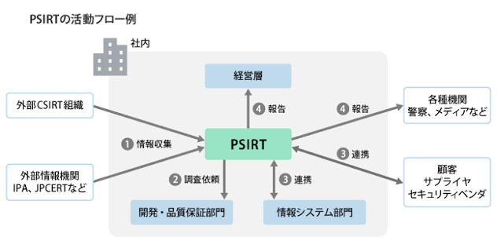

**自社製品の脆弱性に起因するリスクに対応するべき社内機能**。情報収集、対策実施、開発へのフィードバックなどが主な業務としてある。
CSIRT（Computer Security Incident Response Team）との違いは「**守るスコープ**」にある。CSIRTは自社のパソコンやサーバーなどの情報システム全体を守る。

| 比較項目     | **CSIRT**                                                                    | **PSIRT**                                                      |
| ------------ | ---------------------------------------------------------------------------- | -------------------------------------------------------------- |
| 目的         | **組織のセキュリティを<br>維持・回復する**                                   | **製品のセキュリティを確保し、<br>利用者への影響を最小化する** |
| 主な対象     | **組織・企業のIT環境**                                                       | **自社が提供する製品・サービス**                               |
| 主な脅威     | マルウェア、フィッシング、<br>不正アクセス、情報漏洩、<br>アカウント侵害など | 製品の脆弱性、ゼロデイ脆弱性、<br>製品を介した攻撃など         |
| 対応の起点   | 社内でセキュリティ<br>インシデントを検知                                     | 顧客・研究者などから<br>製品の脆弱性報告を受領                 |
| 代表的な問い | 「会社のシステムが攻撃された。<br>どう対応するか？」                         | 「自社製品に脆弱性が見つかった。<br>どう対応するか？」         |

#### ISMAP（Information system Security Management and Assessment Program） <!-- omit in toc -->

政府情報システムにおけるクラウドサービスのセキュリティ評価制度。登録されたサービスは「**ISMAP クラウドサービスリスト**(以下、本リスト)」として公開され、政府機関は本リストに掲載されたサービスから調達を行うことが原則となっています。 また民間事業者においても、本リストを参照することでクラウドサービスの適切な活用が推進されることが期待されていま す。
国が政府情報システムを整備する際に、クラウドサービスの利用を第一候補とする方針（**クラウド・バイ・デフォルト原則**）を受け、政府機関等におけるクラウドサービスの導入に当たって、統一的な安全性評価基準のもとで情報セキュリティ対策が十分に行われているサービスを円滑に導入できるように立ち上げられたものです。

#### CRYPTREC（CRYPTography Research and Evaluation Committees） <!-- omit in toc -->

```plantuml
title CRYPTREC

rectangle CRYPTREC as parent {
  rectangle 暗号技術評価委員会 as child1
  rectangle 暗号技術活用委員会 as child2
}
```

**電子政府推奨暗号の安全性を評価・監視し、暗号技術の適切な実装法・運用法を調査・検討するプロジェクト**。暗号の安全性に関する情報を提供することを目的として、「共通鍵暗号」「公開鍵暗号」「ハッシュ関数」「擬似乱数生成系」の4種類の暗号技術に対して国内外の暗号研究者による評価を行い、評価レポートや推奨可能な暗号のリストを作成することが主な活動内容です。CRYPTRECは2つの委員会で構成されており、それぞれ以下の活動を行なっている。

- 【**暗号技術評価委員会**】暗号技術の安全性評価を中心とした技術的検討
- 【**暗号技術活用委員会**】暗号技術における国際競争力の向上及び運用面での安全性向上に関する検討

<div style="page-break-before:always"></div>

### セキュリティ技術評価

#### IoC（Indicator of Compromise） <!-- omit in toc -->

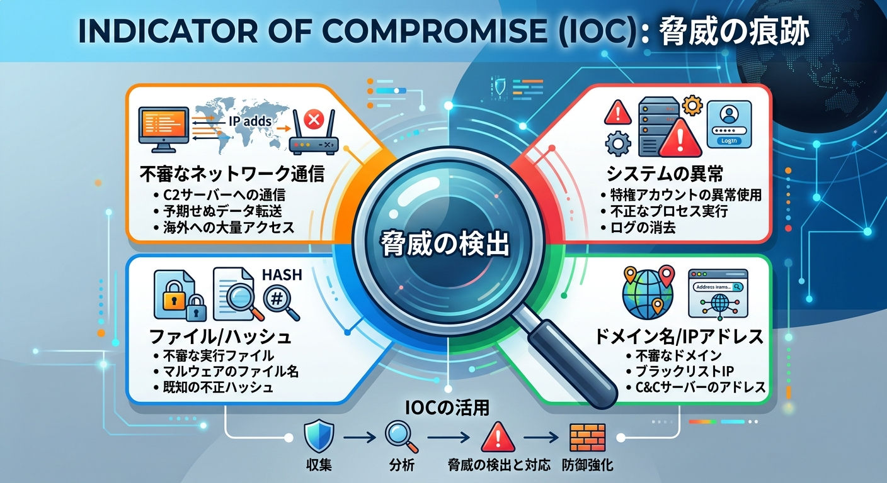

コンピュータやネットワークにおいて不正アクセスやマルウェア感 染といったセキュリティインシデントが発生した**痕跡や手掛かりとなる情報**。
IoCの該当例は以下のとおり。

- 不正な通信先のIPアドレス
- 悪意のあるファイルのハッシュ値
- 改ざんされたファイル名
- 不審なドメイン名URL
- 不正な通信パターン
- 異常な時間帯のログイン

システム管理者やセキュリティ担当者は、これらの情報をもとに攻撃の兆候や侵害の有無を確認したり、被害の拡大を防止したりする対応を行います。

<div style="page-break-before:always"></div>

### 情報セキュリティ対策

#### IPSとIDS <!-- omit in toc -->

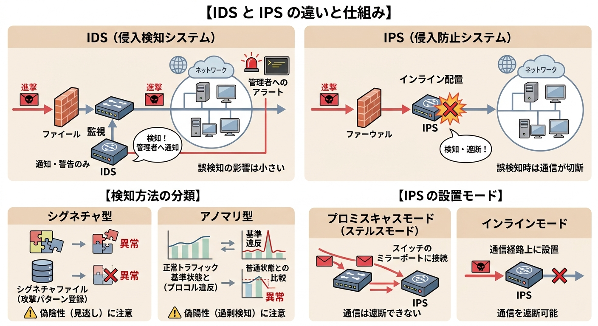

| 項目           | IDS（Intrusion Detection System：侵入<font color=red>検知</font>システム） | IPS（Intrusion Prevention System：侵入<font color=red>防止</font>システム） |
| -------------- | -------------------------------------------------------------------------- | --------------------------------------------------------------------------- |
| 目的           | 不正アクセスや攻撃を**検知**する                                           | 不正アクセスや攻撃を**検知・防止**する                                      |
| 主な動作       | 攻撃を検知して**警告・通知**する                                           | 攻撃を検知して**通信を遮断**する                                            |
| 配置イメージ   | ネットワークに設置し、ネットワークを**監視**する                           | ネットワークの**経路上**に配置する                                          |
| 誤検知時の影響 | 警告だけなので、通信への影響は小さい                                       | 正常な通信を攻撃と判断すると、通信を遮断する可能性がある                    |

|         | メリット                                                                                    | デメリット                                                                                                                                 |
| ------- | ------------------------------------------------------------------------------------------- | ------------------------------------------------------------------------------------------------------------------------------------------ |
| **IDS** | ・管理者に侵入の通知が可能<br>・誤検知による業務影響が小さい                                | ・**自動的に防御できない**<br>・侵入検知後は管理者が対応する                                                                               |
| **IPS** | ・**自動的に通信を遮断可能**<br>・IDSより迅速に攻撃を防御可能<br>・既知の不正通信を防止可能 | ・**正常な通信まで遮断する可能性**がある<br>・経路上に配置するため、障害時は<br>　通信に影響する可能性がある<br>・適切なルーティングが必要 |

**IDS/IPSの検知方法**

IDSやIPSでは、ヘッダー情報やペイロード部分など全内容の確認、トラフィック状況の監視などで不正侵入かどうかを判断します。その判断方法の違いによってシグネチャ型とアノマリ型に分類されます。

- 【**シグネチャ型**】<font color=red>不正侵入に現れる特徴的なパターンを登録し、登録したパターンにマッチした通信を異常と判断する</font>。<u>新たに発生した登録されていない異常パターンなどが見逃される偽陰性に注意する必要がある</u>。
- 【**アノマリ型**】TCP/IPプロトコルの標準仕様が記載されたRFC等で規定される手順を踏まない通信や、トラフィック量の急激な増加や通常とは異なるアクセスなど、<font color=red>正常な状態から逸脱している通信を異常と判断する</font>。<u>閾値の設定によっては、誤って異常となる疑陽性が発生するので注意が必要である</u>

**IPSの設置モード**

また、IPSは設置場所の違いにより、プロミスキャスモードとインラインモードに分類されます。 

- 【**プロミスキャスモード (ステルスモード)**】通信経路上にある<font color=red>スイッチのミラーポートにIPSを接続</font>することで、本来の経路上を流れる全てのパケットのコピーを監視する。異常な通信を検知しても遮断することはできないので、基本的には NIDSと同様に監視が主な役割となる
- 【**インラインモード**】<font color=red>監視対象の通信経路上にIPSを設置</font>します。異常を検知した場合はすぐに通信が遮断され、異常パケットの進入を防げるが、プロミスキャスモードに比べ、IPSの処理性能や信頼性がネットワークの性能に与える影響が大きい。

**IDS/IPSの導入形態や運用方法**


- 【**クラウド型**】クラウドサービスとして利用する。自社に設置せず、ベンダー側が設定やシグネチャの調整を行う。
  - 【**メリット**】①短期間・低負担で導入可能、②物理機器の導入・保守が不要、③ベンダー側の対応により運用工数を削減できる、④規模を拡張しやすい
  - 【**デメリット**】①監視・制御範囲がサービス依存になる、②カスタマイズが難しい場合がある、③ベンダーの依存度が高くなる
- 【**ホスト型**】監視対象となるサーバーや端末にIDS/IPSを直接インストールし、**ホスト内部の動作や通信**を監視
  - 【**メリット**】①ホスト内部の挙動を監視できる、②外部攻撃と内部プロセスを検知可能
  - 【**デメリット**】①導入したホストしか監視できない、②監視対象が増えるほどコストが増加する、③各ホストへの導入・設定・更新が必要
- 【**ネットワーク型**】社内外のネットワーク境界やNW内の要所にIDS/IPSを設置し、**ネットワークの通信を監視・防御**
  - 【**メリット**】①ネットワーク全体を横断的に監視可能、②サーバや端末をまとめて監視可能、③広範囲の攻撃を検知・防御可能、④個々の端末への導入不要
  - 【**デメリット**】①個々の端末の詳細な挙動は把握しにくい、②ホスト単位の細かな設定・制御が難しい、③構成によっては監視不可の通信がある

#### FW、IDS/IPS、WAFの違い <!-- omit in toc -->

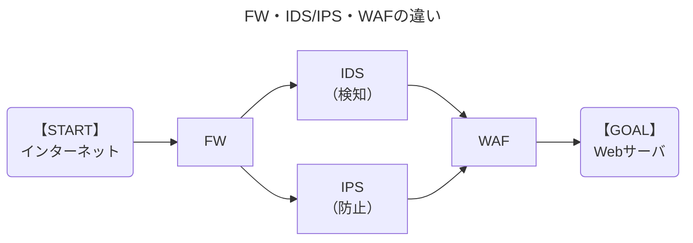

- **FW**：誰が・どこへ・何番ポートで通信しているか
- **IDS／IPS**：その通信は攻撃パターンではないか・DDoS/DoS攻撃ではないか
- **WAF**：Webアプリへのリクエストは攻撃ではないか

|       項目       | FW                                         | IDS                                            | IPS                                            | WAF                                             |
| :--------------: | ------------------------------------------ | ---------------------------------------------- | ---------------------------------------------- | ----------------------------------------------- |
|     **役割**     | **不正アクセス<br>制御**                   | 不正な通信や攻撃の<br>**検知・通知**           | 不正な通信や攻撃の<br>**検知・遮断**する       | Webアプリへの<br>攻撃の**検知・遮断**           |
|    **Layer**     | 主に**L3・L4**                             | 主に**L3・L4・L7**                             | 主に**L3・L4・L7**                             | **L7**                                          |
| **監視<br>項目** | IPアドレス、<br>ポート番号、<br>プロトコル | DoS/DDoS攻撃、<br>攻撃パターン、<br>異常な通信 | DoS/DDoS攻撃、<br>攻撃パターン、<br>異常な通信 | HTTPリクエスト、<br>URL、パラメータ、<br>Cookie |
|     **動作**     | ルールに従って<br>通信を許可・拒否         | **検知・通知**                                 | **検知・遮断**                                 | Webアプリへの<br>攻撃を**検知・遮断**           |

#### サイドチャネル攻撃 <!-- omit in toc -->


対象の動作状況を観察し、漏洩電磁波・電力消費等のサイドチャネル情報から暗号鍵推定等を行う非破壊型解析攻撃の総称。サイドチャネル（Side Channel）には、非正規の入出力経路という意味があり、サイドチャネル攻撃の一つである「タイミング攻撃」は暗号処理のタイミングが暗号鍵の論理値に依存して変化することに着目し、暗号化や復号に要する時間の差異を統計的に解析して暗号鍵を推定する手法です。暗号アルゴリズムの実装方法に対する攻撃方法なので、次のような対策が有効となります。 

- <font color=red>演算アルゴリズムの処理を追加して秘密情報の違いによって演算の処理時間に差異が出ないようにする</font>
- 時間計測を正確に行えないようにする
- ブラインド署名のアルゴリズムの応用 

**サイドチャネル攻撃の種類**

- **タイミング攻撃** 暗号処理の<font color=red>処理時間</font>を測定し、内容や回数により生じる時間差を統計分析することで、パスワードや暗号鍵などの秘密情報を盗み出す。
- **電力解析攻撃** 暗号処理で生じる<font color=red>消費電力</font>の波形を収集・分析し、暗号鍵や内部データを推測する。
- **電磁波解析攻撃** 暗号処理中で生じる<font color=red>電磁波</font>を測定・分析し、暗号鍵や内部データを推測する。
- **テンペスト攻撃** 電子機器から<font color=red>漏洩する電磁波や電気信号</font>を受信・解析し、画面表示や処理内容などを復元する。
- **キャッシュ攻撃** <font color=red>キャッシュの利用状況やアクセス時間</font>を観測・分析することで、秘密情報を推測する。

| 攻撃の種類             | 具体例                                            | 観測情報                   | 主な対策                                                                                                                 |
| ---------------------- | ------------------------------------------------- | -------------------------- | ------------------------------------------------------------------------------------------------------------------------ |
| **タイミング<br>攻撃** | RSAの復号処理時間<br>を測定                       | 秘密鍵                     | ・**処理時間を一定化する**<br>・処理時間が不変の暗号処理の使用<br>・乱数を用いた入力値の変換処理<br>　（Blinding）の使用 |
| **電力解析<br>攻撃**   | スマートカードの<br>AES実行時の<br>消費電力を測定 | 暗号鍵                     | ・**電力消費パターンを一定化する**<br>・マスキングを行う<br>・電力解析を考慮した暗号処理の使用                           |
| **電磁波解析<br>攻撃** | ICチップのAES実行時に<br>発生する電磁波を測定     | 暗号鍵                     | ・**電磁シールドを施す**<br>・不要な電磁放射を抑制する                                                                   |
| **キャッシュ<br>攻撃** | CPUのキャッシュ<br>アクセスを観測                 | 暗号鍵など                 | ・**秘密情報に依存するアクセスの回避**<br>・一定時間で動作する実装を使用する                                             |
| **テンペスト<br>攻撃** | 画面の漏洩電磁波を<br>受信して内容を推測          | 画面情報・<br>通信内容など | ・**電磁シールドを施す**<br>・機器からの電磁波漏洩を抑制する<br>・機器を適切に隔離・配置する                             |


#### Enhanced Open <!-- omit in toc -->

Wi-Fiのオープンネットワーク（パスワードなしの接続）において、通信内容を自動で個別暗号化するセキュリティ規格。具体的には、Wi-Fi Allianceが定義したセキュリティ規格で、端末とアクセスポイントの認証プロセスで`Diffie-Hellman`鍵交換を実行し、得られた独自の鍵を利用して暗号化通信を行う仕組みです（認証は行わない）。SSIDを指定するだけで使える公衆無線LANの利便性を保ったまま無線通信が保護されます。これにより、パスワード入力の手間をなくしたまま通信の盗聴を防ぎます。

- **メリット**
  - **パスワードがいらない** 名前（SSID）を選ぶだけで、すぐに繋がります。
  - **通信が安全になる** 電波を盗み見られても、内容が暗号化されているので見られません。
  - **個別で鍵を作る** まわりの人と違う専用の暗号キーを端末ごとに自動で作るため、他の人の通信は覗けません。
- **デメリット（注意点）**
  - **本人確認はできない** パスワードがないため、誰でも接続できます。悪い人が入るのを防ぐことはできません。
  - **偽物に弱い** 本物に似せた「ニセのWi-Fiスポット」を見分ける機能はありません。
  - **古い機器は使えない** 古いスマホやパソコンは、この新しい機能に対応していないことがあります

#### デジタルフォレンジックス <!-- omit in toc -->


インシデントの発生時に関連するパソコンやスマホなどの電子機器に残るデータを集めて、**法的な証拠や事件の原因を調べる技術**。電磁的記録を適切に保全することは、サイバー攻撃への対策となるだけではなく、犯罪や内部不正など の法的紛争に対処する観点からも重要であり、デジタルフォレンジックスに対するニーズは高まってきています。

#### SBOM（Software Bill Of Materials） <!-- omit in toc -->

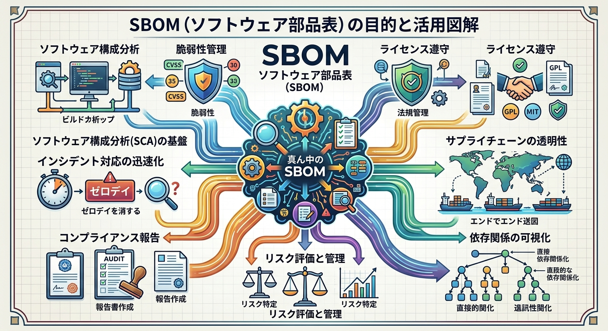

ある製品に含まれるソフトウェアに含まれるすべてのコンポーネントの名称、バージョン・ビルド情報、ライセンス情報、依存関係、その他関連情報を含めて機械処理可能なリストにしたもの。SBOMはソフトウェアの脆弱性管理のためのツールとしても利用されており、以下の目的で作成される。

- 新しい脆弱性が見つかった際の影響範囲の迅速な特定
- サイバー攻撃やサプライチェーン上のリスクの防止
- どのソフトウェアにどのバージョンのOSSやライブラリが含まれているかの把握

#### ステートフルインスペクション <!-- omit in toc -->

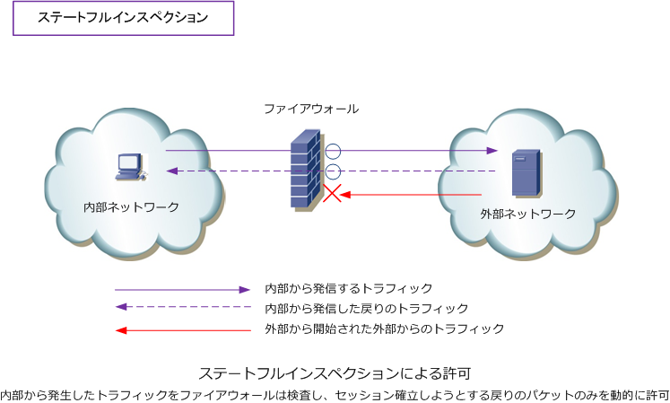

ステートフルインスペクションは、ダイナミックパケットフィルター方式とも呼ばれ、FWを通過する個々のセッションの状態を管理し、その情報に基づいて動的にポートを開閉することで詳細なアクセス制御を行うファイアウォールの方式。ステートフルとはシステムが一連のセッション状態を保持し、個々の通信とセッション情報を照らし合わせて処理を決定する方式や考え方をいいます。

ステートフルインスペクション方式の初期フィルタリングテーブルには「**通信の開始時に使われるパケットのみを通過許可ルール**」として設定しておきます。

実際に通信要求があると、接続要求に対する応答、それに付随するコネクションなどの通信を許可する一時的なルールが自動的にフィルタリングテーブルに追加されます。さらに通信後のセッション終了に伴い、追加された一時的ルールは破棄されます。
この仕組みにより、ルール設定の平易化、およびフィルタリングテーブルの不備を悪用した不正アクセスや順序関係の矛盾したパケットの通過を防止するセキュリティ効果が期待できます。

<div style="page-break-before:always"></div>

### セキュリティ実装技術

#### OAuth2.0 <!-- omit in toc -->


**OAuth2.0**は異なるドメインやプラットフォーム間でサードパーティアプリケーションによるHTTPサービスへの限定的なアクセスを可能にするオープンな**認可フレームワーク**（RFC6749）。ユーザーの許可のもと、ユーザーの代理としてWebサービスにアクセスできる仕組みです。ユーザーの認証情報を直接アプリケーションに渡さなくても、ユーザーの権限を委譲するための安全な方法として利用されます。OAuth2.0では以下の3種類の口ール（役）が登場します。 

- **リソースオーナー（resource owner）** リソースサーバ内の保護された情報へのアクセスを許可するエンドユーザーであり、クライアントの利用者のこと。
- **リソースサーバ（resource server）** 保護された情報を保持し、Webサービスを提供するアプリケーションのこと。リソースオーナーを認証しクライアントにアクセストークンを発行する認可サーバ（authorization server）の役割を兼ねることが多い。
- **クライアント（client）** リソースオーナーの認可を得てリソースサーバにアクセスするサードパーティアプリケーションのこと。

#### IP25B（Inbound Port 25 Blocking）とOP25B（Outbound Port 25 Blocking） <!-- omit in toc -->

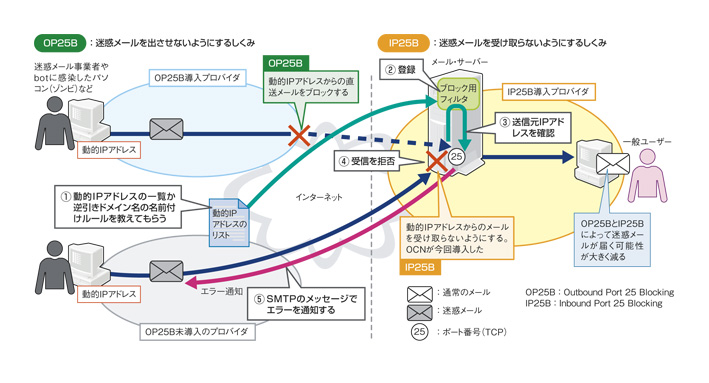

| 項目                 | IP25B                                                                                  | OP25B                                                                                  |
| -------------------- | -------------------------------------------------------------------------------------- | -------------------------------------------------------------------------------------- |
| **対象**             | ISPなどのNW事業者が、<br>**外部→自社ネットワーク**への<br>TCP/25番ポート通信を遮断する | ISPなどのNW事業者が、<br>**自社ネットワーク→外部**への<br>TCP/25番ポート通信を遮断する |
| **通信方向**         | インターネット → ISP利用者側                                                           | ISP利用者側 → インターネット                                                           |
| **主な目的**         | **外部→利用者側のメールサーバ**へ<br>不正に接続されることを防ぐ                        | **利用者の端末→外部メールサーバ**へ<br>迷惑メールを送信されることを防ぐ                |
| **防止する<br>脅威** | ・外部→SMTPサーバへの不正アクセス<br>・迷惑メール送信                                  | ・マルウェア感染端末からの<br>　大量の迷惑メール送信                                   |
| **影響**             | 自宅や社内にSMTPサーバを設置して<br>外部メールを受信する構成が制限される               | ISPの指定外メールサーバへ<br>TCP/25番ポートのメール送信が<br>できなくなる              |
| **代替手段**         | ISPが提供するメールサービスや<br>適切な受信用サービスを利用する                        | **587番ポート(Submission)を利用し、<br>認証済みのメールサーバ経由で送信する**          |

#### IEEE802.1Xの認証システム <!-- omit in toc -->

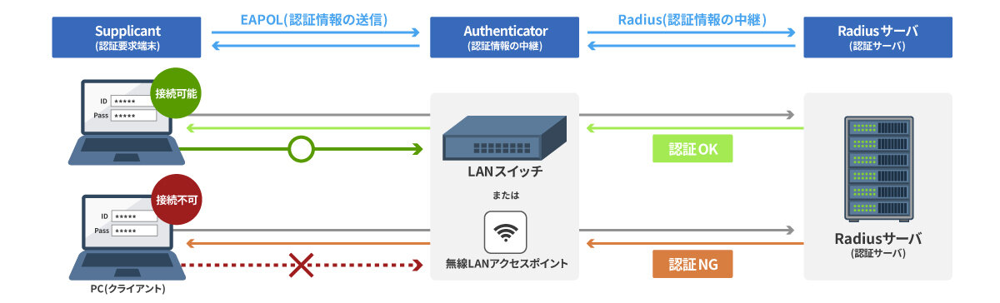

**IEEE802.1X**は正当な端末以外のLAN参加を防ぐためにLANにおけるクライアント認証の方式を定めた規格であり、当初は有線LAN向けとして策定されたが、その後EAP（Extensible Authentication Protocol）として実装され、現在では無線LAN環境における標準の認証規格として利用されている。

IEEE802.1X方式の認証システムは3つの構成要素からなる。

- **サプリカント（supplicant）** LANに接続するために認証を受けるクライアント
- **オーセンティケータ（authenticator）** サプリカントと認証サーバ間の認証プロセスを相互に中継する装置。有線接続ではL2SWやL3SW、無線接続ではアクセスポイントがこの役割を担う。RADIUSを使う場合は、ここに<font color=red>RADIUSクライアント</font>の機能を持たせる。
- **認証サーバ（authentication server）** 実際に認証を行うサーバ。<font color=red>RADIUSサーバ</font>が使用されることが多い。

#### IEEE802.1Xの認証プロトコル(EAP) <!-- omit in toc -->

IEEE802.1Xは、有線LANまたは無線LANにおける利用者認証の規格です。IEEE802.1Xでは、サプリカント（利用者端末）と認証サーバの認証に様々な方式を選択できるように、認証プロトコルに**EAP（Extensible Authentication Protocol）** を使用する。
具体的な認証方式としては以下のようなものがある。

- <font color=red><b>EAP-TLS</b></font> デジタル証明書によるサーバ・クライアントの相互認証。クライアント側にはデジタル証明書を組み込んだUSBキーやICカードがよく用いられる。
- **EAP-TTLS（EAP Tunneled TLS）** TLSの仕組みでサーバを認証後、TLSのセキュアな伝送路上で様々な方法を用いてクライアントを認証する
- **PEAP（Protected EAP）** TLSの仕組みでサーバを認証後、TLSのセキュアな伝送路上でID・パスワードによるクライアント認証をする
- **EAP-MD5** チャレンジレスポンスでクライアントのみを認証

#### クロスサイトリクエストフォージェリ（CSRF：Cross-Site Request Forgery） <!-- omit in toc -->

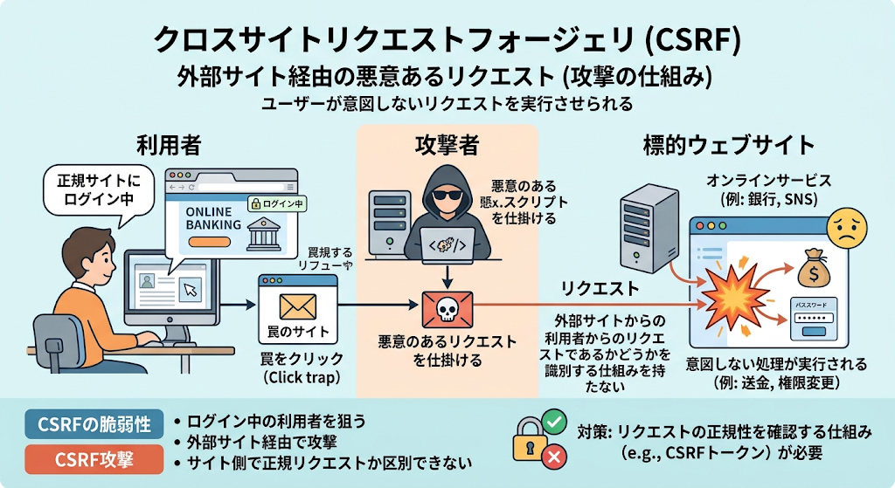

悪意のあるスクリプトを埋め込んだ Web ページを訪問者に閲覧させて利用者認証やセッション管理の脆弱性のある別の Web サイトでその訪問者が意図しない操作（ショッピングでの決済・退会等）を行わせる攻撃です。CSRF 被害を回避するには不正なリクエストを退ける次のような手順を処理確定前に組み込むことが求められます。

- 秘密情報（CSPF ページトークン）による認証
- パスワードの再入力
- 参照元情報（Referrer：リファラー）の検証

#### SMTP-AUTH <!-- omit in toc -->

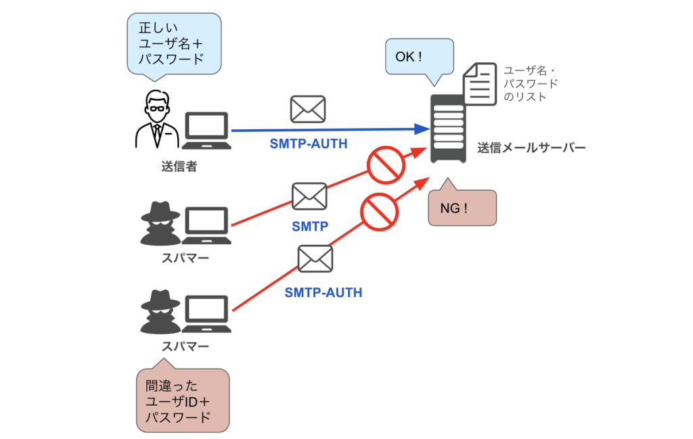

電子メール送信・転送のプロトコルであるSMTPは策定されたのが1982年と歴史が古く、電子メール送信に当たって以下の脆弱性があることが広く知られています。

- 送信処理と転送処理を同一の仕組みで扱っている
- 電子メールの投稿をするユーザーを認証する仕組みがない
- 暗号化機能が標準で実装されていないため、 通信経路上を平文のメッセージが流れる

特に上記2つの仕様が原因となり、複数のメールサーバの第三者中継を利用したスパムメールの温床となっていました。
SMTP-AUTH（SMTP Authentication）は SMTP を拡張し、ユーザー認証機能を追加したものです。使用するにはメールサーバとメールクライアント（メールソフト）の双方が対応していることが必要ですが、**メール送信するときにユーザー名とパスワードで認証**を行い、認証されたユーザーのみからのメール送信を許可することで不正な送信要求を防止することができます。

#### TLS（Transport Layer Security） <!-- omit in toc -->

OSI基本参照モデルのトランスポート層において、①通信の暗号化、②デジタル証明書を利用した改ざん検知、③ノード認証などの機能を提供する統合セキュアプロトコル。主にWebブラウザとWebサーバ間でデータを安全にやり取りするための業界標準プロトコルとして使用され、

- サーバ認証
- クライアント認証（オプション）
- 共有秘密鍵（暗号化鍵）の安全な生成

といった目的を持ちます。また、TLSは以下の特徴を持ちます。

- TLSで使用するWebサーバのデジタル証明書は **`IPアドレス`だけでなく`FQDN`でも使用可能**。
- TLSでは**鍵長40~256ビット**の共通鍵を使用して暗号化通信を行います。ただし、TLS1.1以降では40ビットの鍵の使用は禁止されています。
- TLSのデジタル証明書の内容はICカードやUSBトークン、TPM（Trusted Platform Module）などの様々な媒体に格納することができます。公的認証サービスなどを利用すると電子証明書が記録されたICカードの発行をうけることができ、例えば、**ICカードに格納**すれば認証情報を持ち運べるので、利用する端末が限定されることもありません。
- `TLS`は事前の利用者登録は不要で、また接続先もWebサーバに限られません。　<font color=red>※対応するレイヤーが違うため</font>

## その他の分野

### データベース


### ネットワーク

#### URL・FQDN・ドメイン <!-- omit in toc -->

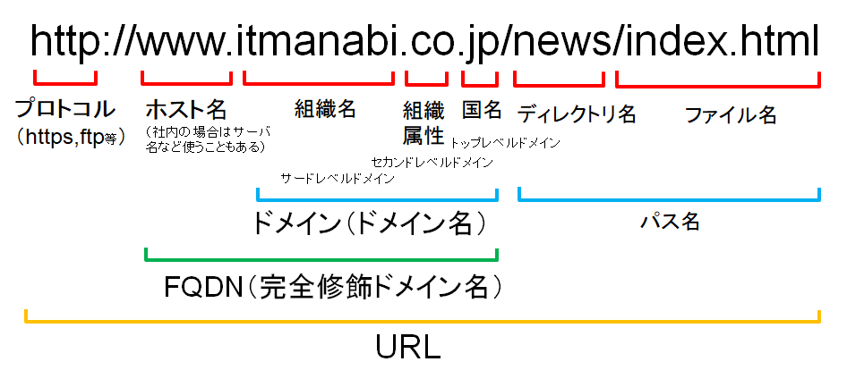

- 【**URL（Uniform Resource Locator）**】Webページのアドレスを表す文字列。WebブラウザのアドレスバーにURLを入力することでWebページをブラウザに取ってくることができます。
- 【**ドメイン**】組織・サービスなどを識別するDNS上の範囲。インターネット上（またはLAN上）のネットワークを特定する文字列
- 【**FQDN（Fully Qualified Domain Name：完全就職ドメイン名）**】「ホスト名＋ドメイン」で表現される、ホスト名を含めた完全な名前（【例】`www`＋`google.com`）
- 【**ホスト名**】ドメイン内の個々のコンピュータやサービスを識別する名前（例：`www`、`news`、`mail`、`blog`など）

#### GETメソッド / POSTメソッド <!-- omit in toc -->


HTMLフォームからの入力データがWebサーバに送付される時、GETメソッドではURLの一部としてパラメータが記述され、リクエストライン（HTTPリクエストの1行目）に含まれます。一方、POSTメソッドではパラメータはメッセージボディに含まれます。 

**GETメソッド→URL内のクエリパラメータに記述**

送信するパラメータを**URLの末尾に付加する方式**。URL本体とパラメータをIt? IIで区切り、その後に 「キー＝値」の形式でパラメータを指定する 

> GET /search?<font color=red>q=security</font> HTTP/1.1
> Host: www.example.com
> User-Agent:Mozilla/5.0(Windows NT 10.0;Win64;x64)
> ...
> Connection:keep-alive

**POSTメソッド→メッセージボディに含まれる**

送信するパラメータを**メッセージボディに含める方式**。<u>URLにパラメータが含まれないためアクセスログ等にパラメータが記録されにくい</u>。

> POST /login HTTP/1.1
> Host: www.example.com
> User-Agent:Mozilla/5.0(Windows NT 10.0;Win64;x64)
> ...
> Connection:keep-alive
> 
> <font color=red>username=taro&password=abcdl234</font>

#### ARP（Address Resolution Protocol）とRARP（Reverse ARP） <!-- omit in toc -->

- **ARP**：IPアドレスからMACアドレスを求める。GARP（Gratutious ARP）は自分自身のIPアドレスをネットワークに自発的に知らせる特殊なARPパケットである。<font color=red>DHCPサーバから配布されたIPv4アドレスが使用されていないことをクライアント自身でも確認する際に使用するプロトコルである</font>。
- **RARP**：MACアドレスからIPアドレスを求める。

#### スパニングツリープロトコル（STP） <!-- omit in toc -->

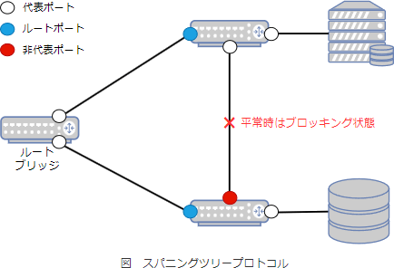

スパニングツリープロトコル(STP)は、ループ状になっているネットワークをルートブリッジを根とした論理的なツリー構造のトポロジーとして扱うためのプロトコルでIEEE802.1D として標準化されています。スパニングツリーを形成するために決定されるのがツリー構造の根となるルートブリッジ、枝を形成するためのルートポート、代表ポートです。

- **ルートポート（Root Port）** ルートブリッジ以外のブリッジにおいて、ルートブリッジまでの経路コストが最小となるポートのこと。経路コストは使用している経路の帯域幅によって求められ、帯域幅が大きいほどコストは小さくなる。
- **代表ポート（Designated Port）** ブリッジや機器を接続する各リンクにおいて、ルートブリッジまでの経路コストが最小となるポートのこと。
- **非代表ポート（Non Designated Port）** スパニングツリー内のブリッジの中で、ルートポートでも代表ポートでもないポート。

#### IPv4とIPv6 <!-- omit in toc -->

セキスペ向け暗記ポイントは次のとおり。特に、「**IPv6ではARPではなくNDPを使う**」、「**IPv6ではブロードキャストを使わない」**、**「フラグメントは送信元が行う**」の3点が重要です。

> **IPv6 = 128bit / ARPなし / NDP / ブロードキャストなし / ルータはフラグメントしない**


**IPv4 / IPv6 共通点**

| 項目             | 共通点                                                |
| ---------------- | ----------------------------------------------------- |
| 役割             | **ネットワーク層**でIPパケットを配送                  |
| 通信             | **送信元IPアドレス → 宛先IPアドレス**で通信相手を識別 |
| ルーティング     | **ルータ**を経由して異なるネットワークへ配送          |
| 上位層           | TCP / UDP / ICMPなどと組み合わせて利用                |
| ベストエフォート | IP自体は**到達保証・順序保証をしない**                |

**IPv4 / IPv6 主な違い**

| 項目               | IPv4           | IPv6                     |
| ------------------ | -------------- | ------------------------ |
| アドレス長         | **32ビット**   | **128ビット**            |
| 表記例             | `192.168.1.1`  | `2001:db8::1`            |
| アドレス数         | 約 **43億**    | 約 **3.4×10³⁸**          |
| アドレス表記       | 10進数＋`.`    | 16進数＋`:`              |
| ブロードキャスト   | **あり**       | **なし**                 |
| マルチキャスト     | あり           | あり                     |
| ARP                | **使用する**   | **使用しない**           |
| アドレス解決       | ARP            | **NDP**                  |
| IPヘッダ           | 可変長         | **基本40バイト・固定長** |
| ヘッダチェックサム | **あり**       | **なし**                 |
| フラグメント       | ルータでも可能 | **送信元ホストのみ**     |
| NAT                | **広く利用**   | 原則不要                 |
| 自動設定           | DHCPなど       | **SLAAC / DHCPv6**       |
| ICMP               | ICMPv4         | **ICMPv6**               |

### システム開発技術


### ソフトウェア開発管理技術

#### 開発請負契約における著作権の帰属先 <!-- omit in toc -->

<u>請負契約書に特段の取決めがない場合、**請負契約で開発した成果物の著作権は請負人に帰属する**</u>。
著作権が請負人にある状況では、納品されたソフトウェアの使用や改変が自由にできず、また他社への流用なども防止できない。このため次の2点はソフトウェア請負契約書における最低限のチェックポイントになる。

1. 【**チェックポイント1**】<font color=red>一般的には請負契約書に「著作権を注文者に譲渡する特約」を設けることで発注元が著作物を自由に取り扱えるようにする</font>。 
2. 【**チェックポイント2**】著作者人格権に関しても不行使という形で約定する。

#### プログラムの著作権管理 <!-- omit in toc -->

プログラムの著作権は結果的に既存ソフトウェアと同等の機能を持つものを開発したとしても、**その創作方法に独自性があれば別個の著作物として認められる**。そのほか見るべき観点は次のとおり。

- 使用許諾契約を締結した上で許諾契約の範囲内で販売していれば著作権の侵害にはならない。
- ①技術の実用化試験、②情報解析、③AI開発等の情報処理の過程における利用、などのように著作物に表現された思想や感情の享受を目的にしない場合には、必要と認められる限度において著作物を許諾なく利用することができる。

一方、<font color=red>著作物に技術的利用制限手段が施されている場合、それを回避する行為は著作権を侵害する行為とみなされます。</font>

### サービスマネジメント


### システム監査

#### 財務報告に係る内部統制の評価及び監査に関する実施基準（令和5年）におけるITに係る全般統制 <!-- omit in toc -->

ITを取り入れた情報システムに関する統制は「全般統制」と「業務処理統制」の2つから構成される。

- 【**全般統制**】組織や集団全体としての統制環境整備を目的として、業務処理統制が有効に機能する環境を保証するための統制活動を意味しており、通常、複数の業務処理統制に関係する方針と手続きをいう。
  1. <font color=red>システムの開発・保守に係る管理</font>
  2. システムの運用・管理
  3. 内外からのアクセス管理などのシステムの安全性の確保
  4. 外部委託に関する契約の管理
- 【**業務処理統制**】個々の業務の正確性を保証するための手続きであり、業務を管理するシステムにおいて承認された業務がすべて正確に処理・記録されることを確保するために業務プロセスに組み込まれたITにかかる内部統制である。
  1. 入力情報の完全性、正確性、正当性等を確保する統制
  2. 例外処理の修正と再処理
  3. マスタデータの維持管理
  4. システムの利用に関する認証、操作範囲の限定

