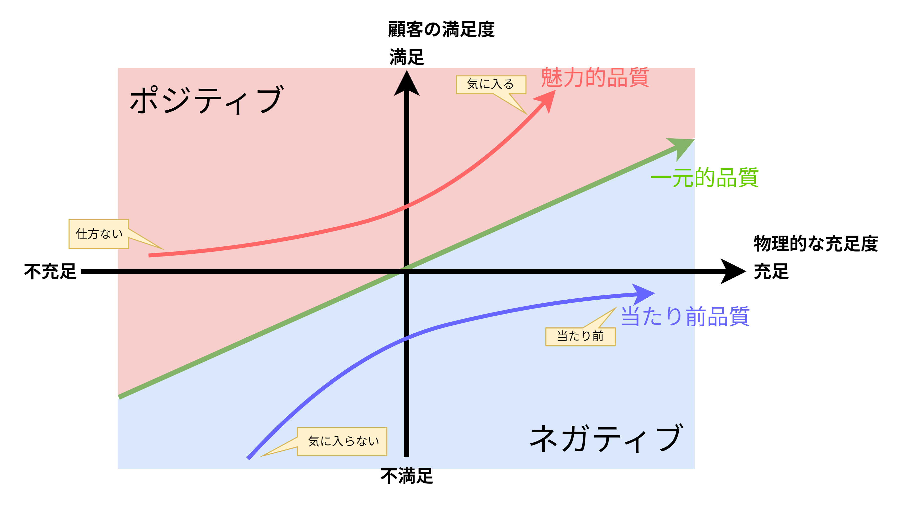

## ソフトウェアテストとは

### ソフトウェアテストの必要性

```plantuml
title ソフトウェアテストの構成要素
left to right direction

rectangle "**ソフトウェアテストの構成要素**" {
	rectangle 欠陥の最小化 as detect
	rectangle 品質の追求 as quality
}
file "設計書・仕様書" as doc

detect --> doc: 確認
quality --> doc: 追求
```

- ソフトウェアテストとは「<font color=red><b>欠陥を取り除いてユーザー要求を満たす、品質の良いソフトウェアを作ること</b></font>」であり、設計書や仕様書といった様々なドキュメントから「**欠陥**」や「**品質**」を追求する必要がある。
- 例えば、日常よく利用するソフトウェアが誤動作を起こすとどうなるのかを考える。下記に例を示すが、いずれの事象も「**時間とお金を失う事態**」になっている。
  - 炊飯器に設定した時刻にご飯が炊きあがらない。
  - 500円の硬貨を投入して200円の切符を購入したが、おつりが100円しか出てこない。
  - 有効期間中の定期券を使っているが自動改札機を通れない。
- ソフトウェアテストでは、各ドキュメントの作成者である設計者・開発者の「**真の意図**」を理解して、欠陥を取り除き、良品質なソフトウェアを作る必要がある。

<div style="page-break-before:always"></div>

### 欠陥とは

$$
欠陥とは「\bold{誤動作の原因がソフトウェアにあることが特定されたもの}」である
$$

```plantuml
title 欠陥と不具合
left to right direction

rectangle "ソフトウェア\nの誤動作" as problem
rectangle 欠陥 as defect
rectangle 不具合 as malfunction

problem --> defect: 原因が<color red>特定されている
problem --> malfunction: 原因が<color red>特定されていない
```

- ソフトウェアが誤動作を起こすことを「**ソフトウェアに欠陥がある**」と言うが、原因は①ハードウェア、②操作手順、③ソフトウェア、などがあり、原因が特定されていない誤動作もある。本書では欠陥と不具合の2つを扱い、以下のように定義する。<font color=blue>大前提、<b>欠陥・バグ・不具合・障害</b>などの呼び方は組織やプロジェクトによって異なるため、<u>プロジェクトの開始前に予め用語集などにまとめ、共通認識を作る必要がある</u></font>。
  - 【**欠陥**】誤動作の原因がソフトウェアにあることが特定された現象
  - 【**不具合**】誤動作の原因がソフトウェアにあると思われる現象（特定される前の現象）
- 下記にソフトウェアのトラブル事例を示す。各事例について、まず、1.東京証券取引所でのシステム障害は1日で復旧したが、世界中の損害を与えた。次に、2.電子マネー決済端末の不具合は一般人の財産にまで影響が及び始めていることを示している。そして、残りのCOCOAや雇用調整助成金に関する障害は、急激な新型コロナウイルスの拡大に伴う急ぎの開発だったために発生した事象であり、<font color=red><b>短納期開発に潜むソフトウェアリスクやシステムリスクが顕在化した事例</b></font>と言える。

#### 【事例紹介】ソフトウェア関連のトラブル

1. 【**東京証券取引所：大規模システム障害により取引停止**】2020年10月1日、共有ディスクの1号機にメモリ障害が発生した際に、2号機に切り替わらず、その影響で終日取引停止となった。原因は障害発生時に行われるべき切り替え処理が正しく設定されていなかったためである。
→ https://www.jpx.co.jp/corporate/news/news-releases/0060/20201005-01.html
2. 【**電子マネー決済端末：重複取引**】2020年10月19日、トランザクションメディアネットワークス社が提供する電子マネーサービスの決済端末を利用する一部の店舗で電子マネーの重複取引が発生した。原因はシステムの不具合と言われている。
→ https://www.tm-nets.com/2020/10/info/
3. 【**新型コロナウイルス接触確認アプリ：プッシュ通知が表示されない**】2020年9月24日、新型コロナウイルス接触確認アプリ**COCOA**にて、陽性者との接触をプッシュ通知する機能があるが、実際に接触すると「陽性者との接触はありませんでした」と表示されてしまった。
→ https://www.mhlw.go.jp/stf/newpage_13736.html
4. 【**雇用調整助成金の受付アプリ：システム障害**】2020年5月20日、雇用調整助成金の申請時に、他人の氏名やメールアドレス、電話番号を閲覧できてしまう不具合が発生。
→ https://xtech.nikkei.com/atcl/nxt/mag/nc/18/020600011/071400059

### 欠陥の無いソフトウェアを開発するために

```plantuml
title 近年のソフトウェア開発
left to right direction

rectangle "【**要素1**】\n開発期間の短縮" as factor1
rectangle "【**要素2**】\n多機能化\n（開発の質・量の増大）" as factor2
actor 開発者 as developer
cloud "【**求められること**】\n一人でも多くのエンジニアが\n欠陥を検出する技術や方法を\n身に着ける" as need #afa
rectangle "【**課題**】\n効果的・効率的にテストし、\n**欠陥を最小化**する" as task #ffa
rectangle "【**結果**】十分な余裕がなく、\n**欠陥**が作りこまれる。" as result #faa

factor1 --> developer
factor2 --> developer
developer --> result
developer --> task
need . developer
```

- 近年、ソフトウェアは「**開発期間の短縮**」と「**多機能化**」の傾向か強く、エンジニアの負担が急激に増している。例えば、スケジュール機能やメール機能、カメラ機能やインターネット閲覧機能、テレビ機能、電子マネー機能などが挙げられる。つまり、<font color=red>機能実装の質・量は日々増大するが開発期間は短縮されるため、十分な余裕がなく、欠陥が作りこまれてしまう</font>。
- ソフトウェア開発において、<font color=red><u>効果的・効率的にテストを行い、欠陥を最小化する必要がある</u>が、ソフトウェアテストのノウハウはまだ十分に認知されておらず、KKD(勘、経験、度胸)に頼ったテストが多い</font>。

### ソフトウェアの品質とは

$$
品質とは「\bold{ユーザーの要求を満たし、ユーザーに価値を提供するソフトウェア}」である
$$

- 品質の良いソフトウェアについて、2人の言葉を借りる。
  - 【**アメリカのコンサルタント：フィリップB.クロスビー**】品質とは要求を満たすことである。
  - 【**アメリカのコンサルタント：G.M.ワインバーグ**】品質は誰かにとっての価値である。
- テスト時に意識することとして「**ユーザーにとっての品質**」があり、ユーザーの要求やユーザーの価値を考えながらテストを行う。

#### 品質モデル（ISO/IEC 25010）


- ISO/IEC 25010はSQuaRE(Software Quality and Evaluation)シリーズとして2005年にリリースしており、ソフトウェアの品質を8つの特性に分類している。
  1. 【**機能適合性**】明示的/暗黙的ニーズを満足させる機能(入力/表示/計算/動作)を提供する度合い。他システムと連携する場合の機能適合性を幅広く検討したい場合や機能要求や仕様が抽象的・複雑・膨大な場合に求められる項目である。
  2. 【**性能効率性**】リソース量に関係する性能の度合い。処理時間や応答時間、メモリ量やディスク容量や通信量などを評価項目としており、「人の稼働量」は利用時の品質の評価項目となる。
  3. 【**互換性**】他の製品やシステムなどと情報交換できる度合い。相互に独立して動くべき場合に相互に相手方の動作障害にならず、適切かつ円滑に情報交換が行われているかどうかを評価する。<u>利用時の品質である「利用状況網羅性」を支える品質の一つ</u>である。
  4. 【**使用性**】明示された利用状況で目標を達成するために利用できる度合い。<u>カバー範囲が広く、6つの副特性によって具体的に定められている品質特性</u>であり、利用者マニュアルや保守マニュアルの使い勝手も含まれる。
  5. 【**信頼性**】明示された時間帯・条件において機能を実行する度合い。システム停止や誤作動からの復帰、データ回復などを含む。
  6. 【**セキュリティ**】システムやデータを保護する度合い。
  7. 【**保守性**】意図した保守作業者によって修正できる有効性及び効率性の度合い。<font color=red>ソースコードの修正しやすさ</font>や<font color=red>構造の解析しやすさ</font>、<font color=red>機能追加のしやすさ</font>に加え、<font color=red>マニュアルやドキュメント</font>も含まれる。
  8. 【**移植性**】別環境へ移してもそのまま動作する度合い。<u>「再利用性」</u>とも関係するが異なる環境への移行作業や新規導入作業に焦点を当てており、移植可能性や移植容易性を評価する。

##### 【補足】品質の分類と関係

```plantuml
title 品質の分類
left to right direction

rectangle 品質 as quality
rectangle 利用時の品質 as used_quality
rectangle 製品品質 as product_quality
rectangle 外部品質 as ext_quality
rectangle 内部品質 as int_quality

quality -- used_quality
quality -- product_quality
product_quality -- ext_quality
product_quality -- int_quality

note top of used_quality
【**利用者視点**】製品の利用者に対する品質

【**例**】作業効率の向上、使用時の満足度など
end note
note bottom of product_quality
【**開発者視点**】製品自体が備えている特徴

【**例**】機能の豊富さ、操作のしやすさなど
end note
```

```plantuml
title 製品品質と利用時の品質の関係
left to right direction

rectangle 製品品質 {
  rectangle 機能適合性 as functional_suitability
  rectangle 性能効率性 as performance_efficiency
  rectangle 互換性 as compatibility
  rectangle 使用性 as usability
  rectangle 信頼性 as reliability
  rectangle セキュリティ as security
  rectangle 保守性 as maintainability
  rectangle 移植性 as portability

  performance_efficiency -[hidden] functional_suitability
  compatibility -[hidden] performance_efficiency
  usability -[hidden] compatibility
  reliability -[hidden] usability
  security -[hidden] reliability
  maintainability -[hidden] security
  portability -[hidden] maintainability
}
rectangle 利用時の品質品質 {
   rectangle 有効性 as effectiveness
   rectangle 効率性 as efficiency
   rectangle 満足性 as satisfaction
   rectangle リスク回避性 as freedom_from_risk
   rectangle 利用状況網羅性 as context_coverage

   efficiency -[hidden] effectiveness
   satisfaction -[hidden] efficiency
   freedom_from_risk -[hidden] satisfaction
   context_coverage -[hidden] freedom_from_risk
}

note right of efficiency
利用時の品質「効率性」のニーズが
あるならば、製品品質「性能効率性」と
「使用性」のそれぞれの観点から
要求事項を定義することになることを表す。
end note

functional_suitability -- effectiveness
performance_efficiency -- efficiency
compatibility -- context_coverage
usability -- efficiency
usability -- satisfaction
reliability -- freedom_from_risk
security -- freedom_from_risk
maintainability -- context_coverage
portability -- context_coverage
```

#### 求められる品質意識



<table>
    <caption>狩野モデルにおける品質の分類</caption>
	<tbody>
		<tr>
			<th>品質要素</th>
			<th>充足</th>
			<th>不充足</th>
		</tr>
		<tr>
			<td>当たり前品質</td>
			<td>当たり前</td>
			<td>不満</td>
		</tr>
		<tr>
			<td>一元的品質</td>
			<td>満足</td>
			<td>不満</td>
		</tr>
		<tr>
			<td>魅力的品質</td>
			<td>満足</td>
			<td>仕方がない</td>
		</tr>
	</tbody>
</table>

- 多様化するユーザー要求に対応するために有用な品質モデルに「**狩野モデル**」がある。狩野モデルには3つの品質がある
  - 【**当たり前品質**】ユーザーの「基本要求」を満たす品質であり、<font color=red>ユーザーの「これだけは絶対に満たしてほしい」と考える品質</font>である。<u>充足されている場合は**当たり前**、不充足の場合は**不満**に感じる</u>。
  - 【**一元的品質**】ユーザーが満足するための品質であり、<font color=red>ユーザー評価の正負に関連する品質</font>である。<u>充足されている場合は**満足**、不充足の場合は**不満**に感じる</u>。
  - 【**魅力的品質**】ユーザーの期待を上回っているかどうかを決める品質であり、<font color=red>製品の独自性（＋α）のある品質</font>である。<u>充足されている場合は**満足**、不充足の場合は**仕方がない**と感じる</u>。
- ソフトウェアテストにおいては、**テストの優先順位を付けるために狩野モデルを利用**する。具体的には、<u>検証する機能が①当たり前品質・②一元的品質・③魅力的品質のどの品質に該当するのか振り分ける</u>。効果は以下の通り。
  - 「魅力的品質の機能」よりも「当たり前品質の機能」を優先してテスト設計の時間を割り当てることができる。
  - ユーザーが不満に思うと考えられる欠陥を拾い上げ、品質を高められる。
  - 各品質に対して適切なテスト作業・項目を洗い出すことができる。

### テストの視点

- **開発担当者**は「開発仕様書を重視」して製品を作る。一方、**テスト担当者**は「Verification & Validationの視点でテストを行い」製品を作る。

#### V&V：Verification & Validation

<table>
	<tbody>
		<tr>
			<th>項目</th>
			<th>Verification（検証）</th>
			<th>Validation（妥当性確認）</th>
		</tr>
		<tr>
			<td>視点</td>
			<td>■<b>開発仕様書通り</b>にソフトウェアが<br>　作成されているかどうか</td>
			<td>■<b>ユーザーの要求通り</b>にソフトウェアが<br>　作成されているかどうか</td>
		</tr>
		<tr>
			<td>作業</td>
			<td>■ソフトウェアを実際に動作させて検証する。</td>
			<td>■ソフトウェアを実際に動作させて検証する。<br>■開発仕様書の妥当性をチェックする。</td>
		</tr>
		<tr>
			<td>欠陥の具体例</td>
			<td>■モノクロコピーを指定したのに、<br>　カラーコピーされてしまう。</td>
			<td>■1枚だけコピーを取るのにも枚数指定<br>　しなければならない（ユーザー視点だと手間が多い）。</td>
		</tr>
	</tbody>
</table>

- Verificationは検証を意味し、「**開発仕様書の通り**」にソフトウェアが作成されているかを確認することである。
- Validationは妥当性確認を意味し、「**ユーザーの要求通り**」にソフトウェアが作成されているかを確認することである。

#### Never・Must・Want

<table>
	<tbody>
		<tr>
			<th>項目</th>
			<th>Never</th>
			<th>Must</th>
			<th>Want</th>
		</tr>
		<tr>
			<td>狩野モデル<br>との対応</td>
			<td>当たり前品質</td>
			<td>当たり前品質</td>
			<td>魅力的品質</td>
		</tr>
		<tr>
			<td>想定ケース</td>
			<td>人の生命や財産に<br>影響を及ぼすような<br>事態</td>
			<td>ユーザーが思った通り<br>に要求を達成できるか<br>どうか</td>
			<td>製品に求める要望<br>(テスト中に発生しやすい)</td>
		</tr>
		<tr>
			<td>具体例<br>(電子レンジの場合)</td>
			<td>
			■発火・爆発<br>
			■感電<br>
			■処理が止まらない<br>
			■漏電
			</td>
			<td>
			■温め・解凍<br>
			■出力調整・温度調整<br>
			■タイマー・取消
			</td>
			<td>
			■自動調理<br>
			■カロリーの自動計算<br>
			</td>
		</tr>
	</tbody>
</table>

