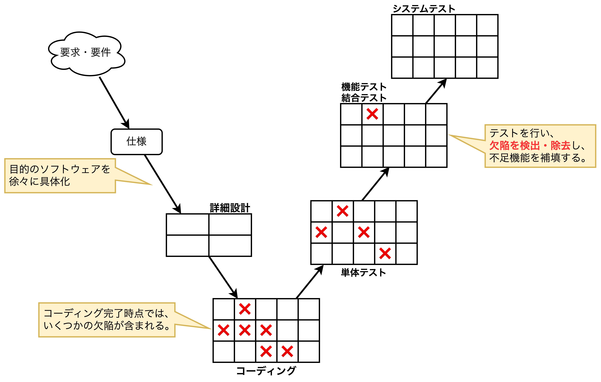
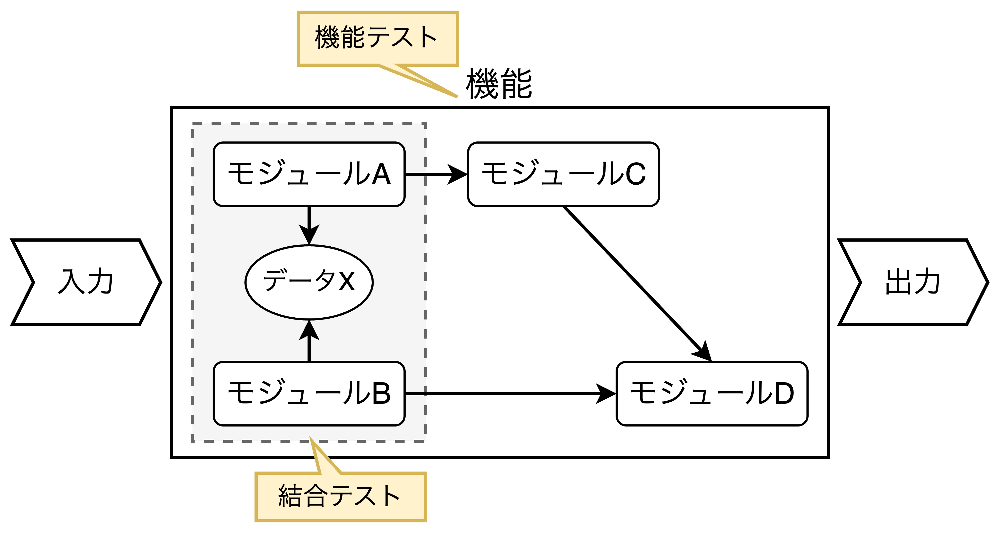
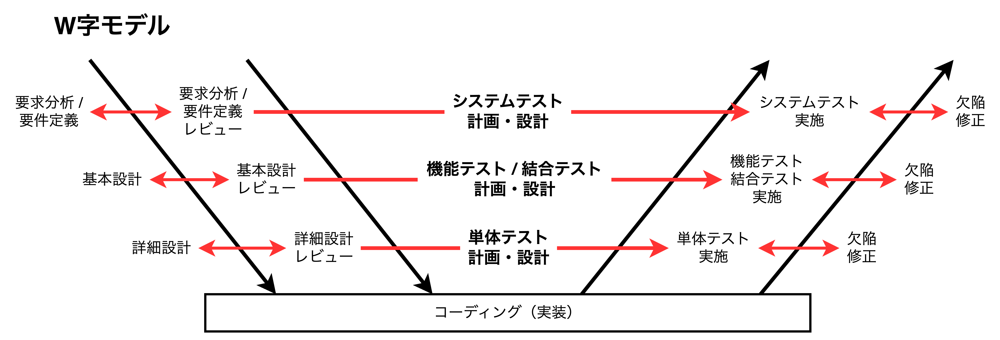
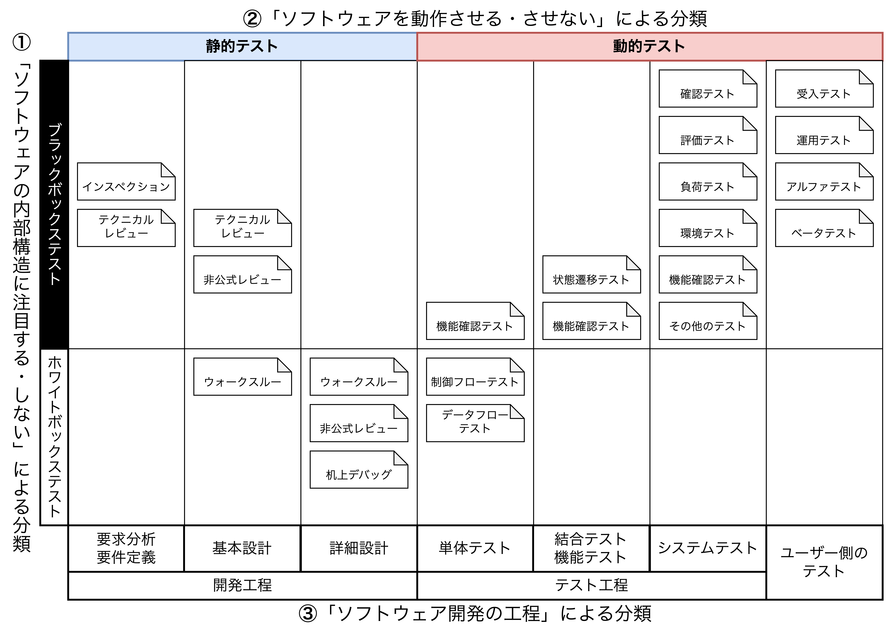
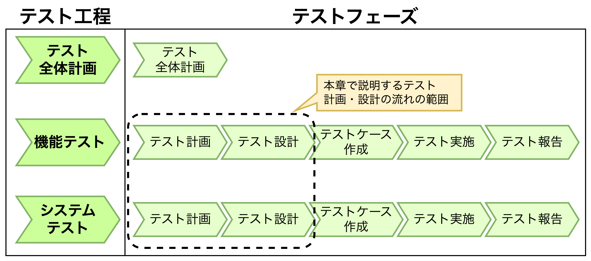
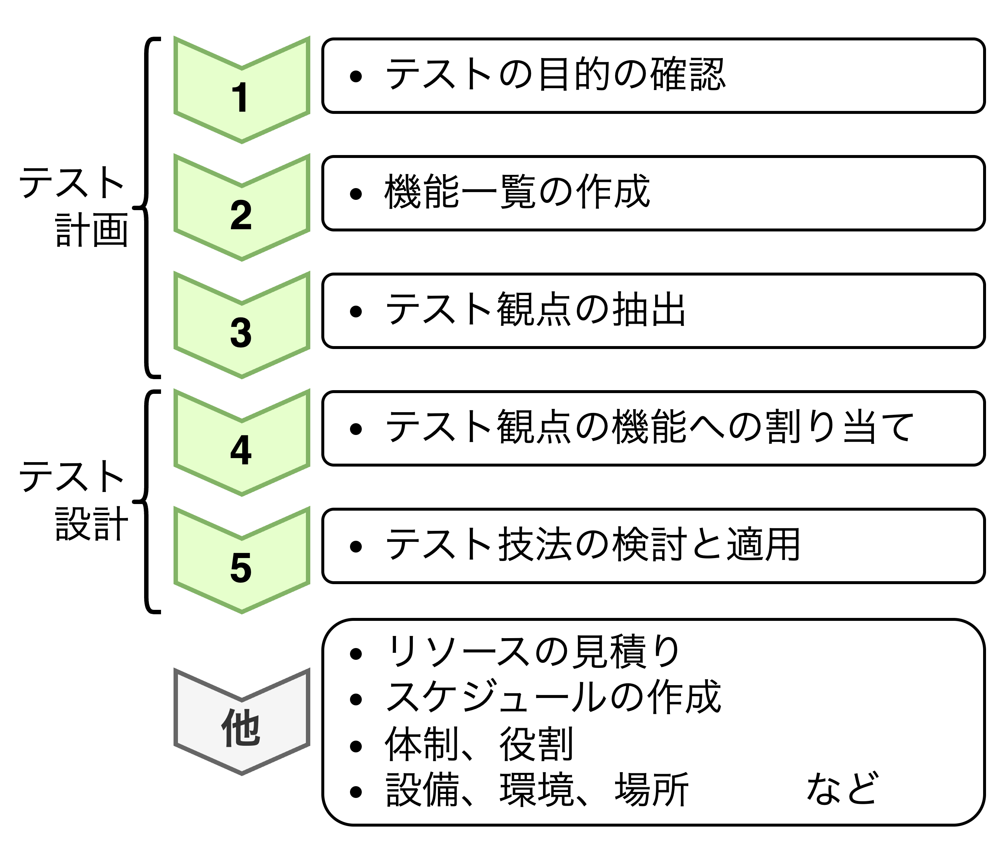

## ソフトウェア開発の流れとテスト工程

### ソフトウェア開発の流れ

#### ウォーターフォール型開発モデル（予測型開発アプローチ）


- **ウォーターフォール型開発モデル**は「1つの工程が完了してから次の工程を開始する開発モデル」であり、$①要求分析・要件定義→②基本設計→③詳細設計→④コーディング→⑤テスト$、の順に行う。特に⑤のテストについて、テスト工程はいくつかの工程に分けられ、上流工程の各工程ごとにテストが対応させたモデルを**V字モデル**と言う。

#### 要求分析・要件定義

> 【**企画→開発者への依頼例：スポーツジムで見かけるエアロバイクのメーカー**】
> エアロバイクのユーザーに聞き取り調査をしたところ、「運動に飽きやすい」と言う声が多かった。
> また、「知らず知らずのうちにペースが落ちてしまうから時間をかけている割に運動できていない」
> という不満の声が上がっている。そこで、新製品では運動している人を励ます機能を入れてほしい。
> 具体的には、ゆっくり漕いでいる時にはバイクからゆっくりとしたテンポの曲が流れ、漕ぐスピードを
> あげたら自動的に早いテンポの曲に切り替わる、そんな風にしてほしい。

<div style="border: 2px solid black; padding: 10px; margin: 10px;">
<b>＜企画→開発者への依頼から行なった要求分析・要件定義の例＞</b><br>
<b>利用者環境）</b><br>
スポーツジムにて、一般ユーザーが使用する<br>
→ 運動することが目的なので、複雑な操作にすべきではない
<br>
<b>機能要求）</b><br>
運動中のペースを維持したい。運動に疲れてしまうとペースを維持できない<br>
→ 解決策（要求仕様）：ペダルを漕ぐペースにあったテンポの音楽を聴きながら運動できる
<br>
<b>制約条件）</b><br>
同じ時間内でより効率よく運動したい<br>
→ 解決策（要求仕様）：ペダルを漕ぐペースよりも少しテンポの速い音楽に自動的に切り替わる
</div>


```plantuml
title 要求分析・要件定義の流れ
left to right direction

cloud "顧客のニーズ" as need
cloud "企画の要望" as req
rectangle "①ヒアリング" as step1
rectangle "②情報整理" as step2
rectangle "③解決すべき課題の定義" as step3

need --> step1
req --> step1
step1 --> step2
step2 --> step3
```

- **要求分析・要件定義**とは、開発するソフトウェアの到達目標を明らかにするために、「顧客のニーズ」や「企画が頭に描く要望」を引き出し、整理した後、解決すべき課題を定義することである。

#### 基本設計

```plantuml
title 基本設計の流れ
left to right direction

rectangle "要件" as req
rectangle 仕様1 as spec1
rectangle 仕様2 as spec2
rectangle 仕様3 as spec3
file 仕様書 as spec_doc
file 設計書 as design_doc

note right of spec_doc
「**何を作るか**」を
書いている。機能仕様書など
end note
note right of design_doc
「**どうやって作るか**」を
書いている。基本設計書など。
end note

req --> spec1
req --> spec2
req --> spec3
spec1 --> spec_doc
spec1 --> design_doc
spec2 --> spec_doc
spec2 --> design_doc
spec3 --> spec_doc
spec3 --> design_doc
```

- 要件定義の次は**基本設計**を行う。基本設計では要求事項を実現するために必要なソフトウェアの機能や構成といった基本的な仕様をまとめる。要件を実現するための機能や構成をまとめ、仕様として落とし込む。
- 基本設計では<font color=red><b>外部システム</b>の存在も明確化</font>する。

#### 詳細設計

```plantuml
title 詳細設計の流れ
left to right direction

rectangle 基本設計 as design_doc
rectangle 詳細設計の範囲を決める as decision
file 詳細設計書 as detail_design_doc
note top of decision
開発スコープの区切り方は
開発体制や方針によって異なる。

◼モジュール単位
◼機能単位
◼ユーザーストーリー単位
◼Etc...
end note

design_doc --> decision
decision ---> detail_design_doc
```

- **詳細設計**では基本設計で定義した仕様からコーディングに必要な各処理の詳細な仕様を決める。
- 開発スコープや組織の文化によって、<font color=red>詳細設計は基本設計と同じ工程で行うこともある</font>。
- 詳細設計では開発システム間のインタフェース連携だけでなく、<u>外部システムとの連携内容も具体的に記述する</u>必要がある。

### テスト工程の流れ



#### 単体テスト

```plantuml
title 単体テスト
left to right direction

component モジュール as module
file 詳細設計書 as detail_design_doc
actor "プログラマ\n（テスター）" as tester
process 単体テスト as test

module --> tester
detail_design_doc --> tester
tester --> test
```

- 単体テストは「**モジュールごとに行うテスト**」である。
- コーディングを行なった**プログラマが単体テストを担当**し、詳細設計通りにモジュールが動作するかをテストする。

#### 結合テスト・機能テスト



- 結合テストは「**複数のモジュールを組合せて行うテスト**」であり、機能テストは「**機能として正しく役割を果たしているかを確認するテスト**」である。結合テストは機能テストの一部としてテストすることもある。
- 基本設計を行なった**設計担当者が結合テスト・機能テストを担当**する。

#### システムテスト

- システムテストは「**ユーザーの要求を実現しているかを確認するテスト**」である。テストは要件定義書に基づいて行い、「**製品として出荷する状態**」もしくは「**サービスとして提供する状態**」としてテストする。
- <u>想定される限りのさまざまなユースケースを試し、**欠陥を検出**する</u>。

### 【Column】W字モデル



- V字モデルを発展させた考え方として**W字モデル**がある。**W字モデル**では、各開発工程ごとの成果物に対してレビューし、テスト計画・設計を行う。W字モデルのメリットとデメリットは以下の通り。
  - 【**メリット**】①仕様の抜け漏れの予防、<font color=red>②ソフトウェアの品質向上</font>、③開発者とテスト担当者間での認識齟齬の軽減・解消
  - 【**デメリット**】<font color=red>①経験豊富な開発メンバが必要</font>、②レビューに伴う開発コストの増加

### さまざまなテストと分類



<table>
    <caption><b>①「ソフトウェアの内部構造に注目する・しない」による分類</caption>
	<tbody>
		<tr>
			<th>分類</th>
			<th>説明</th>
		</tr>
		<tr>
			<td>ホワイトボックス<br>テスト</td>
			<td>
            ソフトウェア内部の<b><font color=red>論理構造に注目</font></b>して、処理や分岐命令の動作、<br>
            データ処理などが正しく行われるかを確認するテスト。
            </td>
		</tr>
		<tr>
			<td>ブラックボックス<br>テスト</td>
			<td>
            ソフトウェアの<b><font color=red>入力と出力のみに注目</font></b>して、ソフトウェアが正しく動作するかを<br>
            確認するテスト。処理内容を見ないことから「黒い箱」になぞられている。
            </td>
		</tr>
	</tbody>
</table>
<table>
    <caption><b>②「ソフトウェアを動作させる・させない」による分類</caption>
	<tbody>
		<tr>
			<th>分類</th>
			<th>説明</th>
		</tr>
		<tr>
			<td>静的テスト</td>
			<td>
            <u>ソフトウェアを動作させることなく行うテスト</u>。開発仕様書やビルド前の<br>
            ソースコードの状態でテストを行う。V字モデルで言う<b><font color=red>開発工程</font></b>で行う。
            </td>
		</tr>
		<tr>
			<td>動的テスト</td>
			<td>
            <u>作成したソフトウェアで実際に動作確認するテスト</u>。V字モデルで言う<b><font color=red>テスト工程</font></b>で行う。
            </td>
		</tr>
	</tbody>
</table>
<table>
    <caption><b>③「ソフトウェア開発の工程」による分類</caption>
	<tbody>
		<tr>
			<th>分類</th>
			<th>説明</th>
		</tr>
		<tr>
			<td>開発工程</td>
			<td>
            <u>開発工程では主にレビューが行われる</u>。レビューは開発工程におけるテスト<br>
            と言え、インスペクションなどはレビューの一種である。
            </td>
		</tr>
		<tr>
			<td>テスト工程</td>
			<td>
            通常、<u>テスト工程で行われるテストのことを「ソフトウェアテスト」と呼ぶ</u>。
            </td>
		</tr>
	</tbody>
</table>

### テストの概要

<table>
    <caption><b>開発工程で行うテスト（レビュー）</caption>
	<tbody>
		<tr>
			<th>種類</th>
			<th>説明</th>
		</tr>
		<tr>
			<td>インスペクション</td>
			<td>
            ①プロセス、②ルール、③役割分担が明確であり、<br>
            公式記録に残すべき需要度の高い文書に適したレビュー。
            </td>
		</tr>
		<tr>
			<td>テクニカルレビュー</td>
			<td>
            専門知識を持つレビュワーから技術的な問題を確認するレビュー。
            予め決められたレビュープロセスに沿って進められる。
            </td>
		</tr>
		<tr>
			<td>非公式レビュー</td>
			<td>
            特に決まったルールや方法がないレビュー。レビュワーが1人の時は<br>
            「ペアレビュー」とも言われる。
            </td>
		</tr>
		<tr>
			<td>ウォークスルー</td>
			<td>
            作成者がレビュー対象を説明し、レビュー担当者にコメントを求める形式<br>
            で進行するレビュー。
            </td>
		</tr>
		<tr>
			<td>机上デバッグ</td>
			<td>
            ソフトウェアのソースコードを目視確認し、検出した誤りを修正する作業。<br>
            <font color=red>ソースコードの作成者自身が1人で確認・修正することが多い</font>。
            </td>
		</tr>
	</tbody>
</table>
<table>
    <caption><b>テスト工程で行うテスト（単体テスト）</caption>
	<tbody>
		<tr>
			<th>種類</th>
			<th>説明</th>
		</tr>
		<tr>
			<td>機能確認テスト</td>
			<td>
            <b>各モジュール</b>が詳細設計書や機能仕様書通りに動作することを確認するテスト。
            </td>
		</tr>
		<tr>
			<td>制御フローテスト</td>
			<td>
            「命令」や「分岐」などが全て実行されるかを確認するテスト
            </td>
		</tr>
		<tr>
			<td>データフローテスト</td>
			<td>
            データや変数が<code>定義→使用→消滅</code>の順に行われているかを確認するテスト。<br>
            静的解析ツールなどを用いる。
            </td>
		</tr>
	</tbody>
</table>
<table>
    <caption><b>テスト工程で行うテスト（結合テスト・機能テスト）</caption>
	<tbody>
		<tr>
			<th>種類</th>
			<th>説明</th>
		</tr>
		<tr>
			<td>状態遷移テスト</td>
			<td>
            状態遷移図、状態遷移表に基づいて動作確認するテスト
            </td>
		</tr>
		<tr>
			<td>機能確認テスト</td>
			<td>
            <b>モジュール同士の連携</b>や<b>複数モジュール</b>で実現される機能が詳細設計書通りに<br>動作することを確認するテスト
            </td>
		</tr>
	</tbody>
</table>

<div style="page-break-before:always"></div>

<table>
    <caption><b>テスト工程で行うテスト（システムテスト）</caption>
	<tbody>
		<tr>
			<th>種類</th>
			<th>説明</th>
		</tr>
		<tr>
			<td>確認テスト</td>
			<td>
            一度実行したテストを再度確認するテストであり、4つに分類できる。<br>
            <b>①修正確認テスト</b>：変更箇所および関連箇所が正しく動作するかを確認するテスト。<br>
            <b>②リグレッションテスト</b>：変更後のソースコードにおいて新しい不具合が<br>
            　混入されていないことを確認するテスト。<br>
            <b>③スモークテスト</b>：テスト実施前に対象のソフトウェアがテストする品質であるかを<br>
            　確認するテスト。前工程のテストとこれから行うテストの代表的なテストを<br>
            　簡易的に行うなどして確認する。<br>
            <b>④リリースチェックテスト</b>：出荷候補に対する動作確認テスト。
            </td>
		</tr>
		<tr>
			<td>評価テスト</td>
			<td>
            単純に⚪︎×で判定しにくい品質に対して程度を判断するテストであり、3つに分類できる。<br>
            <b>①セキュリティテスト</b>：悪意ある外部からの攻撃への対応や脆弱性がないことを<br>
            　確認するテスト。<br>
            <b>②ユーザビリティテスト</b>：操作性・学習容易性・見やすさなどの使いやすさを<br>
            　確認するテスト。<br>
            <b>③障害許容性テスト</b>：障害発生時に指定された機能が維持されることを確認するテスト。
            </td>
		</tr>
		<tr>
			<td>負荷テスト</td>
			<td>
            システムに負荷をかけるテストであり、6つに分類できる。<br>
            <b>①性能テスト</b>：処理能力が仕様を満たしていることを確認するテスト。<br>
            <b>②ロングランテスト</b>：長時間の連続稼働によって処理能力や稼働率<br>
            　（障害発生頻度・復旧時間など）に問題がないかを確認するテスト。<br>
            <b>③ボリュームテスト</b>：容量の大きいデータや大量データを処理できることを<br>
            　確認するテスト。<br>
            <b>④ストレージテスト</b>：リソースが不足している状況下で動作確認するテスト。<br>
            <b>⑤高頻度テスト</b>：一定時間内に繰り返し大量の処理を行った場合に問題が<br>
            　生じないことを確認するテスト。<br>
            <b>⑥ストレステスト</b>：極端に高い負荷をかけた状況下での動作を確認するテスト<br>（短時間で大量データを処理するテスト）。
            </td>
		</tr>
		<tr>
			<td>環境テスト</td>
			<td>
            ソフトウェアを取り巻くプラットフォームや周辺機器に注目して行うテストであり、<br>
            3つに分類できる。<br>
            <b>①構成テスト</b>：ハードウェアとソフトウェアを組み合わせたさまざまな動作環境下で<br>
            　ソフトウェアの動作に影響がないことを確認するテスト。<br>
            <b>②互換性テスト</b>：外部のハードウェアやソフトウェアと正しく連携してデータを<br>
            　やり取り出来るかを確認するテスト。<br>
            <b>③両立性テスト</b>：同時に使用される外部環境に対して障害発生の影響がないことを<br>
            　確認するテスト。
            </td>
		</tr>
		<tr>
			<td>機能確認テスト</td>
			<td>
            ユーザー要求を満たすために各機能の働きが詳細設計書通りに動作することを<br>
            確認するテスト。OS、環境、複数の機能、設定値、入力値などを組み合わせて行う。
            </td>
		</tr>
	</tbody>
</table>

<div style="page-break-before:always"></div>

<table>
    <caption><b>テスト工程で行う「その他」のテスト</caption>
	<tbody>
		<tr>
			<th>種類</th>
			<th>説明</th>
		</tr>
		<tr>
			<td>アドホックテスト<br>（ランダムテスト）</td>
			<td>
            テスト設計を行わず、場当たり（ad hoc）的に行うテスト。
            </td>
		</tr>
		<tr>
			<td>探索型テスト</td>
			<td>
            テスト担当者が自らの経験をベースに行うテスト。
            </td>
		</tr>
		<tr>
			<td>リスクベースド<br>テスト</td>
			<td>
            テスト対象のリスクを想定し、リスクの大きい部分から優先的に確認するテスト。
            </td>
		</tr>
		<tr>
			<td>モデルベースド<br>テスト</td>
			<td>
            テスト設計モデルを用いてテストケースを設計する技術の総称。
            </td>
		</tr>
		<tr>
			<td>エラー推測テスト</td>
			<td>
            開発者が起こしやすいエラーを調査し、作り込まれる可能性が高い欠陥を<br>
            推測してテストケースを作成する手法。
            </td>
		</tr>
		<tr>
			<td>ミューテーション<br>テスト</td>
			<td>
            誤りを含むプログラム（ミュータント）を機械的に生成し行うテスト。
            </td>
		</tr>
		<tr>
			<td>バックトゥバック<br>テスト</td>
			<td>
            同じテストケースを異なるソフトウェア（別バージョン、別のモデル・<br>
            コードなど）に適用し、結果を比較するテスト。
            </td>
		</tr>
		<tr>
			<td>ローカライゼーション<br>テスト</td>
			<td>
            ある国・地域用に作られたソフトウェアを別の国・地域用に変更する際、<br>
            適切に現地化（ローカライゼーション）できているかを確認するテスト。
            </td>
		</tr>
	</tbody>
</table>
<table>
    <caption><b>ユーザー側のテスト</caption>
	<tbody>
		<tr>
			<th>種類</th>
			<th>説明</th>
		</tr>
		<tr>
			<td>受入テスト</td>
			<td>
            対象のソフトウェアがユーザー要求を満たしているかを公式に確認し、<br>
            <font color=red>ソフトウェアの受け入れを判定・承認するテスト</font>。
            </td>
		</tr>
		<tr>
			<td>運用テスト</td>
			<td>
            実際の操作環境下でソフトウェアが正しく動くかを確認するテスト。
            </td>
		</tr>
		<tr>
			<td>アルファテスト</td>
			<td>
            <font color=red>試作段階の製品</font>を「開発者以外の人間」が操作して、<br>
            不具合がないことを確認するテスト。
            </td>
		</tr>
		<tr>
			<td>ベータテスト</td>
			<td>
            <font color=red>販売・リリース前の製品</font>を「開発者以外の一般ユーザー」が操作して、<br>
            使用性や不具合がないことを確認するテスト。
            </td>
		</tr>
	</tbody>
</table>

### テスト工程とテストフェーズ



<table>
	<tbody>
		<tr>
			<th>テストフェーズ</th>
			<th>説明</th>
		</tr>
		<tr>
			<td>テスト計画</td>
			<td>
            <font color=red>各テストフェーズの目的と範囲を明確化</font>し、どのようなアプローチでテストするのかを<br>
            検討する。テストに必要な資源（設備、環境、人員）の調達やスケジュールも定める。
            </td>
		</tr>
		<tr>
			<td>テスト設計</td>
			<td>
            テストフェーズで実施する<b>テストの①種類、②目的、③対象機能、④技法、<br>
            ⑤入出力データ</b>を定める。また、テスト実施に必要な機材や環境、<b>⑥合否判定基準</b><br>
            も具体的に定める。
            </td>
		</tr>
		<tr>
			<td>テストケース作成</td>
			<td>
            テスト開始前の状態、操作手順、期待結果、判定欄などを含む<br>
            <font color=red>テストドキュメントを作成する</font>。
            </td>
		</tr>
		<tr>
			<td>テスト実施</td>
			<td>
            テストケースを見ながら<font color=red>実際にソフトウェアテスト行い、結果を記録する</font>。<br>
            期待結果と異なるテストケースは<b>「保留」、「条件付き合格」、「不具合」</b>などで<br>
            記録し、その現象の説明や発生状況などを記入する。
            </td>
		</tr>
		<tr>
			<td>テスト報告</td>
			<td>
            <font color=red>テスト結果を要約して報告する</font>。テストの合否基準を満たしているかを<br>
            各種データ（実施項目数、テスト消化率、実施工数など）や<br>
            不具合データ（検出不具合件数、ランク別の不具合件数など）を元に評価する。<br>
            また、「リリース後に懸念されるリスク」や「次期プロジェクトでの推奨事項」<br>
            なども提案する。
            </td>
		</tr>
	</tbody>
</table>

- テスト計画には「テスト全体計画」と「個別テスト計画」の2つがある。
  - 【**テスト全体計画**】単体テスト、機能テスト、システムテストを含むテスト工程全体の計画を行い、各テスト工程における方針や目的、対象範囲、開始・修了・移行判定基準を明確にする。
  - 【**個別テスト計画**】単体テストや機能テスト（＋結合テスト）、システムテストなど個別のテストフェーズに対する計画を行う。

#### テスト計画・設計の流れ



- テスト計画（1〜3）は**テスト工程単位**で、テスト設計（4〜5）は**テスト観点単位**で各内容を検討する。
- 【**1.テストの目的を確認する**】<u>テスト工程における「テストのアプローチ」を決定する</u>。具体的には、テストの①範囲、②概要、③技法、を定める。
- 【**2.機能一覧表を作成する**】<u>テスト全体計画書で定めた範囲にある全機能を洗い出し、各機能の概要を理解する</u>。<b>機能は抜け漏れなく洗い出すことを重視</b>し、テスト対象にするかどうかはここでは判断しない。
- 【**3.テスト観点を抽出する**】<u>テスト対象のソフトウェアに対して確認すべき「テストの切り口」を抽出する</u>。例えば<font color=red><b>ユーザー要求を品質特性に変換</b></font>し、使いやすさや正確性、処理時間を確認する視点・観点を抽出する。
- 【**4.テスト観点を機能へ割り当てる**】<u>機能の1つひとつ（2.の内容）に対して、どのテスト観点（3.の内容）からどのようにテストすべきを検討する</u>。全ての機能で確認すべきテスト観点もあれば、ある機能でのみ確認するテスト観点もある。<font color=red>テスト対象の機能を縦軸、テスト観点を横軸にしてマトリクス（<b>テストマップ</b>）を作成し、機能ごとにテスト観点の適用有無を視覚化する</font>。
- 【**5.テスト技法の検討と適用**】<u>テストマップからテスト設計を進め、最も効果的・効率的に欠陥や不具合を検出できるテスト技法を選定する</u>。例えば、テキストボックスの入力に関するテストは**同値分割法**や**境界値分析**を適用し、状態遷移や画面遷移などがある場合は**状態遷移テスト**などを考える。
- 【**その他の検討事項**】テスト計画・設計の際に<font color=red>人員・予算・スケジュール</font>を考慮して実現可能なテストのアプローチを定める必要がある。具体的には以下の通り。
  - 必要なリソース（人員、予算）
  - スケジュール
  - テスト実施時の体制・役割
  - テスト実施に必要な設備、環境、作業場所など

##### 【例】テストマップ


- 【**メリット1：各機能へのテスト観点の適用し忘れを防止できる**】機能ごとのテスト項目とテスト観点の煩雑な組み合わせを整理でき、重要なテストの抜け漏れを予防できる。
- 【**メリット2：実施するテストを具体的にイメージできる**】早い段階からテストの認識を関係者間で合わせることができ、具体的なテスト作業を共有・認識できる。
- 【**メリット3：各テスト観点の重要度やテストの規模を把握できる**】テストマップのマス目についた印の数がテストの重要度や規模感として把握することができ、テストの影響度を視覚化できる。

<div style="page-break-before:always"></div>

### テスト観点の必要性（前述の手順3の詳細）

$$
\begin{align*}
&【\bold{例}】\\
&目の前の完成間近の携帯電話をテストしてください
\end{align*}
$$

- 上記の内容に取り組む場合、どのようにテストすれば良いのか。考えられる方法は以下の通り。
  - 【**方法1**】思いつきに任せてテストする
  - 【**方法2**】特定の機能（メール機能や通話機能）のみテストする
  - 【**方法3**】取扱説明書に書かれている操作を順にテストする
  - 【**方法4**】ソフトウェアテストの書籍を買い、記載のテスト技法を試す
- 上記のように、<font color=red>漠然とした指示ではテストはできない</font>。
- <font color=blue>テスト観点一覧表とは、<b>テスト観点を再利用可能な形式にまとめた一覧表</b>であり、<u>テストノウハウの集積</u>と言える</font>。テスト観点一覧表はテストを重ねるごとに観点を追加できることから有用であり、具体的には以下のメリットがある。
  - 【**メリット1**】個人の勘と経験に頼ったテストではなく、<font color=red>体系的なテストを実施できる</font>。
  - 【**メリット2**】<font color=red>個人のスキルの差（ベテランと新人の差）を軽減できる</font>。
  - 【**メリット3**】テストすべき観点の抜け漏れや重複を回避できる。
  - 【**メリット4**】テスト全体の中での個々のテスト観点の位置付けや重要度を検討できるため、適切な判断が容易になる。

### テスト観点一覧表の作り方（前述の手順4の詳細）

<table>
	<tbody>
		<tr>
			<th>指標</th>
			<th>具体例</th>
		</tr>
		<tr>
			<td>
			ISO/IEC 25010の<br>8つの品質特性
			</td>
			<td>
			◼機能適合性　　　　◼性能効率性<br>
			◼信頼性　　　　　　◼互換性<br>
			◼使用性　　　　　　◼保守性<br>
			◼セキュリティ　　　◼移植性
			</td>
		</tr>
		<tr>
			<td>
			Ostrandの<br>4つのビュー
			</td>
			<td>
			◼ユーザービュー　　◼設計・実装ビュー<br>
			◼使用ビュー　　　　◼バグビュー
			</td>
		</tr>
		<tr>
			<td>
			Myersの14の<br>
			システムテストカテゴリ
			</td>
			<td>
			◼ボリューム　　　　◼設置<br>
			◼ストレス　　　　　◼回復<br>
			◼効率　　　　　　　◼操作性<br>
			◼ストレージ　　　　◼セキュリティ<br>
			◼信頼性　　　　　　◼サービス性<br>
			◼構成　　　　　　　◼文書<br>
			◼互換性　　　　　　◼手続き
			</td>
		</tr>
	</tbody>
</table>

- テスト観点一覧表は階層的に作成することで作業が進めやすくなる。本章では4つの大分類と3つの中分類から構成する。

#### 【例】テスト観点一覧表

```plantuml
title テスト観点の分類例

rectangle 大分類 {
	rectangle 機能 as func
	rectangle 非機能 as non_func
	rectangle ユーザー as user
	rectangle テスト as test
	non_func -[hidden] func
	user -[hidden] non_func
	test -[hidden] user
}
rectangle 中分類 {
	rectangle 組合せ as comb
	rectangle 異常系 as abnormal
	rectangle 正常系 as normal
}
func -- normal
func -- abnormal
func -- comb
```
<table>
	<caption>テスト観点一覧表の例</caption>
	<tbody>
		<tr>
			<th>大分類</th>
			<th>中分類</th>
			<th>テスト観点</th>
		</tr>
		<tr>
			<th rowspan="3">機能</th>
			<td>正常系</td>
			<td>
			◼基本機能　　　　　　　　　　　◼表示<br>
			◼状態遷移、画面遷移　　　　　　◼データ登録、反映、更新、削除（CRUD）<br>
			◼設定　　　　　　　　　　　　　◼ユーザーインタフェース（GUI）<br>
			◼アップロード／ダウンロード　　◼セキュリティ<br>
			◼インストール　　　　　　　　　◼外部接続
			</td>
		</tr>
		<tr>
			<td>異常系</td>
			<td>
			◼異常値入力　　　　　　　　　　◼記憶装置異常<br>
			◼エラー検知　　　　　　　　　　◼異常状態<br>
			◼エラーメッセージ確認　　　　　◼異常環境<br>
			◼エラー復旧　　　　　　　　　　◼異常操作（ボタン連打など）<br>
			◼異常データ　　　　　　　　　　◼エラーログ確認
			</td>
		</tr>
		<tr>
			<td>組合せ</td>
			<td>
			◼同時動作　　　　　　　　　　　◼構成<br>
			◼割込動作　　　　　　　　　　　◼設定<br>
			◼排他処理、同時アクセス　　　　◼相互運用性<br>
			◼互換性　　　　　　　　　　　　◼オプション／付属品
		</td>
		</tr>
		<tr>
			<th>非機能</th>
			<td>ー</td>
			<td>
			◼処理速度　　　　　　　　　　　◼連続動作<br>
			◼負荷　　　　　　　　　　　　　◼通信帯域不足<br>
			◼大容量　　　　　　　　　　　　◼リソース不足
			</td>
		</tr>
		<tr>
			<th>ユーザー</th>
			<td>ー</td>
			<td>
			◼業務シナリオ　　　　　　　　　◼出力品質（印刷、音声など）<br>
			◼ユーザビリティ、操作性　　　　◼導入、保守<br>
			◼魅力性
			</td>
		</tr>
		<tr>
			<th>テスト</th>
			<td>ー</td>
			<td>
			◼修正テスト　　　　　　　　　　◼リグレッションテスト<br>
			◼過去欠陥　　　　　　　　　　　◼テスタビリティ
			</td>
		</tr>
	</tbody>
</table>
