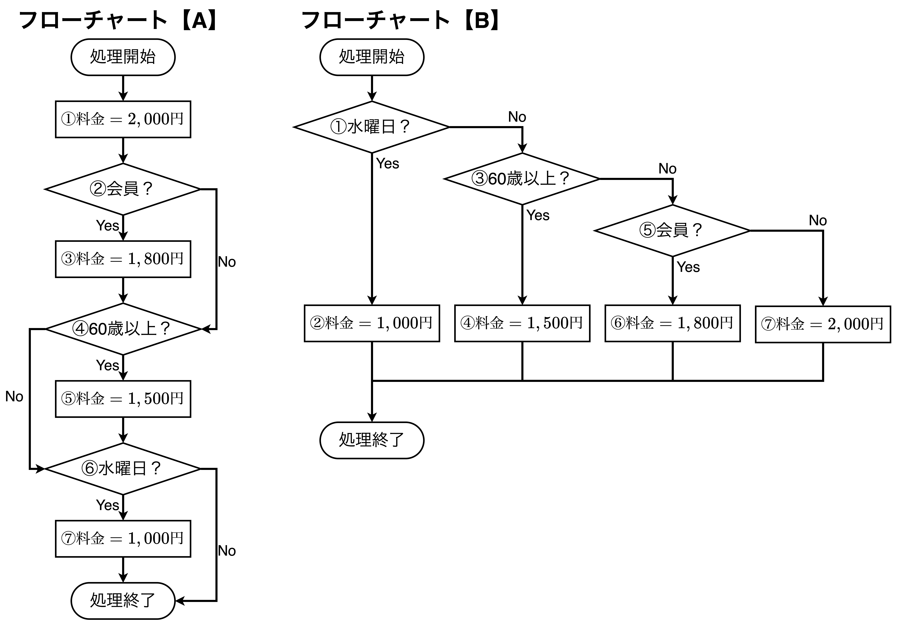
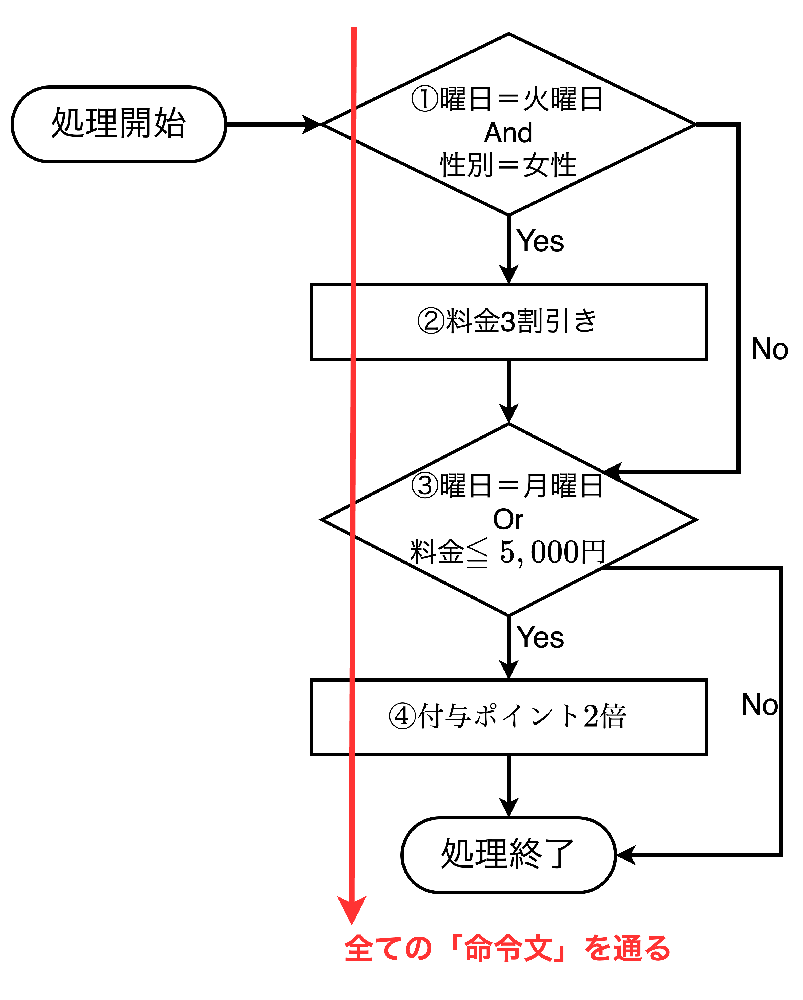
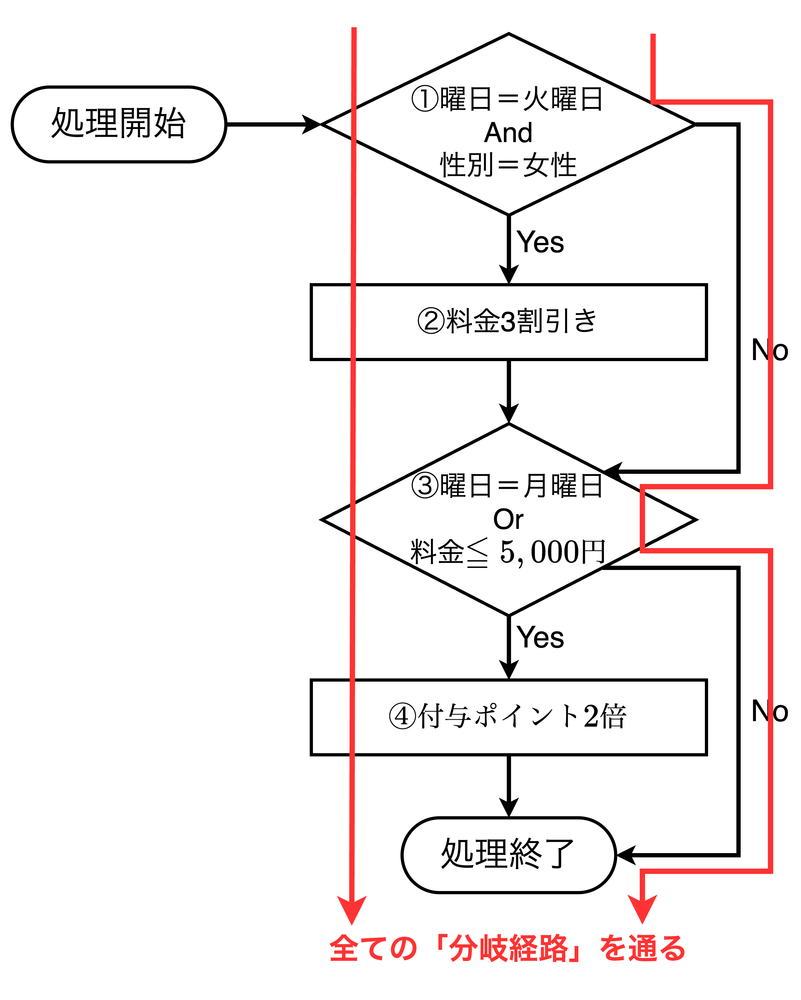
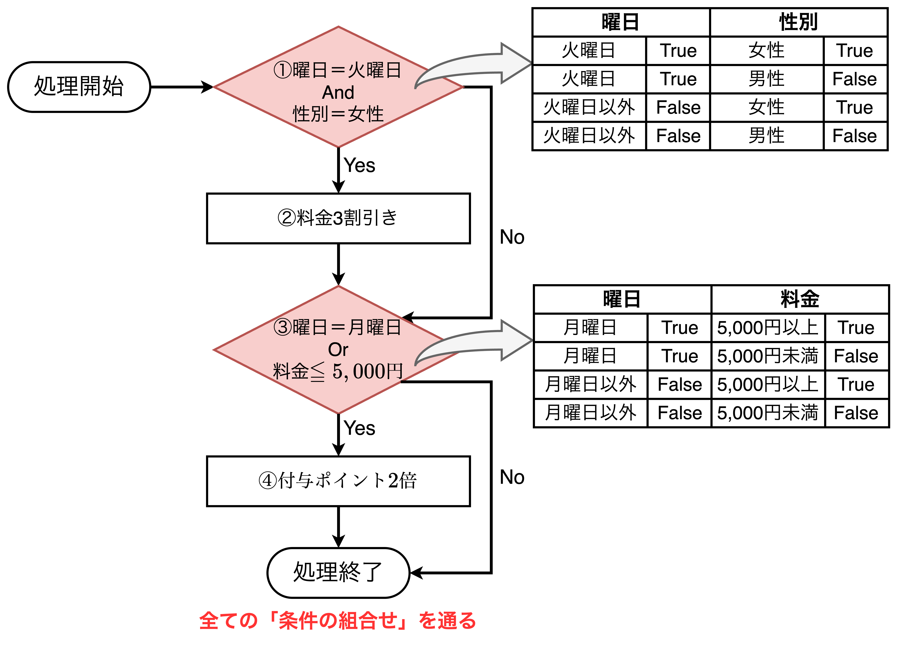
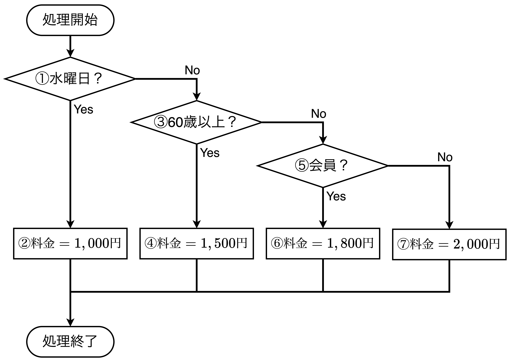
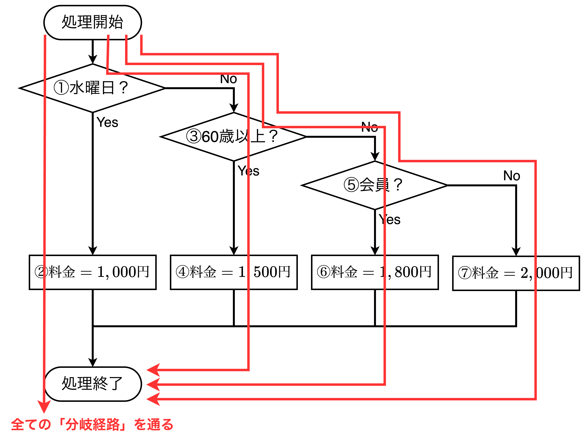
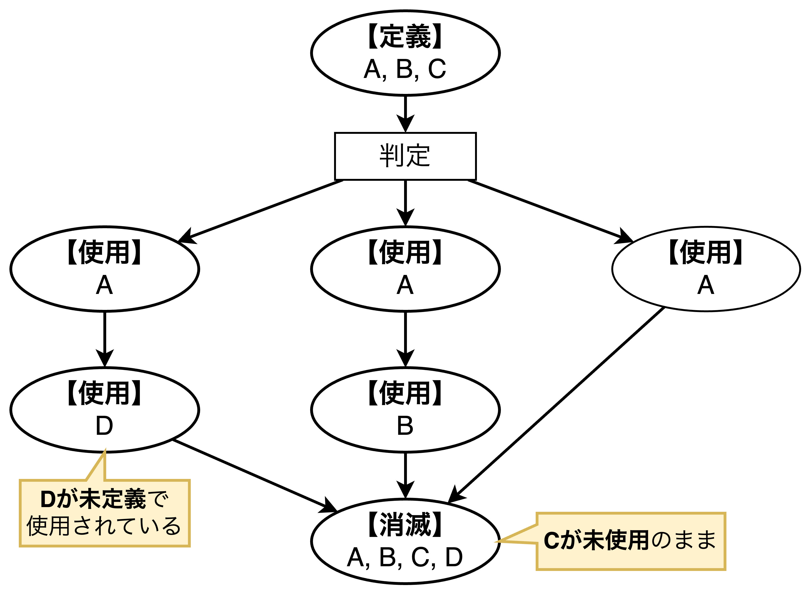
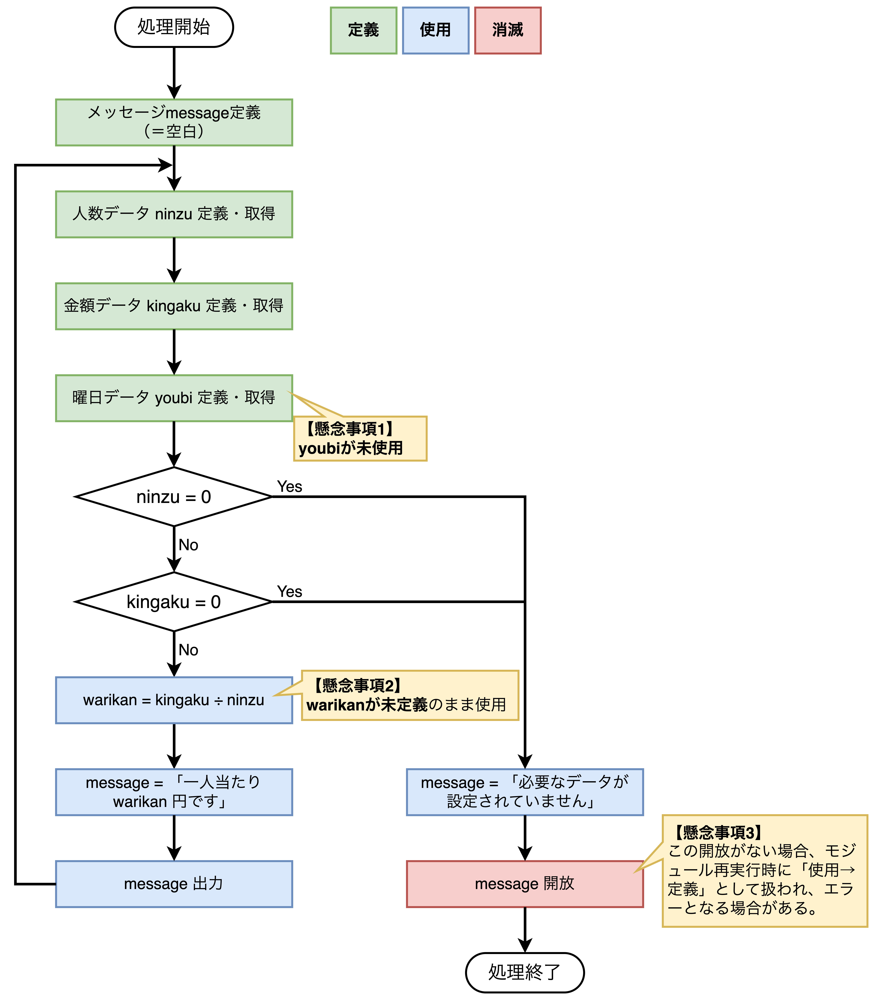

## ホワイトボックステストとブラックボックステスト


### ホワイトボックステストとは

```plantuml
title ホワイトボックステスト
left to right direction

rectangle ホワイトボックステスト as whitebox
rectangle 単体テスト as unittest
rectangle 結合テスト as combtest
rectangle 制御フローテスト as ctrl_flow
rectangle データフローテスト as data_flow

whitebox -- unittest
whitebox -- combtest
unittest -- ctrl_flow
unittest -- data_flow
```

- ホワイトボックステストとは、「**ソフトウェアの中身を理解した上で論理構造を確認するテスト**」であり、<u>ソフトウェアの最小単位であるモジュールの1つひとつを対象とした単体テスト</u>で用いられる。広い意味では、モジュール間の処理やデータの流れを確認する<u>結合テストでもホワイトボックステストは利用される</u>。
- ホワイトボックステストには、命令文の処理順序を確認する「**制御フローテスト**」と、データの流れを確認する「**データフローテスト**」の2種類があり、いずれも単体テストレベルのテストになる。

<div style="page-break-before:always"></div>

### モジュールと論理構造

- 各モジュールには必要な結果を得るために複数の処理が含まれており、この処理の流れや実行順序のことを「**論理構造**」と呼ぶ。

#### 【例】食事の代金を割り勘で払う際の計算

```plantuml
title 【正常：変更前】処理フロー
left to right direction
skinparam linetype ortho

rectangle "【**処理A**】\n合計金額を入力する" as step1
rectangle "【**処理B**】\n入力された金額が\n0ならば処理1に戻る" as step2
rectangle "【**処理C**】\n人数を入力する" as step3
rectangle "【**処理D**】\n入力された人数が\n0ならば処理3に戻る" as step4
rectangle "【**処理E**】\n割勘額を計算する" as step5
rectangle "【**処理F**】\n計算結果を表示する" as step6

step1 --> step2
step2 --> step3
step4 <--- step3
step4 --> step5
step5 --> step6
```

```plantuml
title 【変更後】処理フロー
left to right direction
skinparam linetype ortho

rectangle "【**処理A**】\n合計金額を入力する" as step1
rectangle "【**処理C**】\n人数を入力する" as step2
rectangle "【**処理E**】\n割勘額を計算する" as step3
rectangle "【**処理B**】\n入力された金額が\n0ならば処理1に戻る" as step4
rectangle "【**処理D**】\n入力された人数が\n0ならば処理3に戻る" as step5
rectangle "【**処理F**】\n計算結果を表示する" as step6
note top of step3
処理Cで「0」が入力された場合、
0除算により<color red>論理構造に誤り
が起こる。
end note

step1 --> step2
step2 --> step3
step4 <--- step3
step4 --> step5
step5 --> step6
```

- 上記処理より、各行の処理自体に誤りはなくても、その順番を誤るとモジュール全体での処理は実行できなくなる。
- また、<font color=red>正しい結果を導き出す論理構造は常に1つだけになるとは限らない</font>。

<div style="page-break-before:always"></div>

#### 同じ結果になる2つの論理構造

> **【サービス料金表】**
> - 通常料金　　2,000円
> - 会員料金　　1,800円
> - 60歳以上　　1,500円
> - 毎週水曜日　1,000円



- フローチャートAとBについて、どちらも論理構造としては同じであるが、それぞれ特徴があり、トレードオフの関係にある。
- 【**フローチャートA**】視認性・可読性優位
  - 最多ステップ数$=7$：①②③④⑤⑥⑦
  - 最小ステップ数$=4$：①②④⑥
- 【**フローチャートB**】処理効率優位
  - 最多ステップ数$=4$：①③⑤⑥ or ①③⑤⑦
  - 最小ステップ数$=2$：①②

<div style="page-break-before:always"></div>

### 制御フローテスト（制御パステスト）の実施方法

```plantuml
title 制御フローテスト
left to right direction

rectangle "**手順1**\nフローチャートを描く" as step1
rectangle "**手順2**\nカバレッジ基準の選定" as step2
rectangle "**手順3**\nフローチャートを\n全て網羅する経路の\n洗い出し" as step3
rectangle "**手順4**\nテストケース\n(選択経路)の実行" as step4
rectangle "**手順5**\n結果確認" as step5

note right of step3
可能な限り少ない経路で
効率的にテストができるように
経路を選択する
end note

step1 --> step3
step2 --> step3
step3 --> step5
step4 --> step5
```

- 制御フローテストでは、**①命令文・②分岐経路・③条件**のいずれかに着目し、これらが全て実行されるかを確認する。
- 【**手順1：ソースコードを元にフローチャートを描く**】紙面や図形描画ソフトウェアなどを使ってフローチャート（制御フロー図）を描き、モジュールの論理構造を図示する。<font color=red>この時点ではテスト対象のモジュールは動かさない</font>。
- 【**手順2：カバレッジ基準（網羅したい要素）を決める**】「<font color=red>カバレッジ基準（網羅率の基準）</font>」として、命令文・分岐経路・条件の3要素から1つ選択する。カバレッジ基準は網羅率を計測するための基準である。
- 【**手順3：カバレッジ基準を網羅する経路を抽出する**】手順1で描いたフローチャートを見ながら手順2で定めたカバレッジ基準を全て通るフローチャート上の経路を決定する。可能な限り少ない経路で効率的にテストができるように経路を選択する。
- 【**手順4：抽出した経路を通るようにテストする**】手順3で抽出した経路を通る入力値を指定して、モジュールのテストを行う。
- 【**手順5：結果を確認する**】手順4を行った結果として、手順3で抽出した全ての経路を通ったかを確認する。

<div style="page-break-before:always"></div>

#### カバレッジ基準①：ステートメントカバレッジ（命令文）

> ◼レディースデー
> 　・火曜日は女性に限り 3割引
> ◼ポイント 2倍
> 　・月曜日は購入額に関わらずポイント 2倍
> 　・曜日に関わらず 5,000円以上購入するとポイント 2倍



- ①処理、②分岐、③繰り返しをまとめて「**命令文**」と言い、この<u>命令文をカバレッジ基準とする場合、ステートメントカバレッジと呼ばれる</u>。
- <font color=red>ステートメントカバレッジでは「<b>全ての命令文</b>」を通るようにテストを行い、カバレッジを計測する</font>。
- 以降、上記の例に示す店頭レジ端末の割引・ポイント計算を行うモジュールを例にする。ステートメントカバレッジでは**1回のテスト**でカバレッジが100%になる。

<div style="page-break-before:always"></div>

#### カバレッジ基準②：デシジョンカバレッジ（分岐経路）



- <u>経路をカバレッジ基準とする場合、デシジョンカバレッジ</u>と呼ばれ、<font color=red>デシジョンカバレッジでは「<b>全ての分岐経路</b>」を通るようにテストを行い、カバレッジを計測する</font>。
- 上記の店頭レジ端末の割引・ポイント計算ロジックを例にすると、デシジョンカバレッジでは**2回のテスト**で100%のカバレッジになる。

<div style="page-break-before:always"></div>

#### カバレッジ基準③：複合条件カバレッジ（条件）



- 論理積や論理和で結ばれた複合条件が設定されていることを前提に、<u>条件をカバレッジ基準とする場合、複合条件カバレッジ</u>と呼ばれ、<font color=red>複合条件カバレッジでは「<b>全ての条件の組合せ</b>」を通るようにテストを行い、カバレッジを計測する</font>。
- 上記店頭レジ端末の割引・ポイント計算ロジックを例にすると、複合条件カバレッジでは**最小4回、最大8回のテスト**で100%のカバレッジになる。

#### カバレッジレベルの違い


$$
ステートメントカバレッジ\subseteq デシジョンカバレッジ\subseteq 複合条件カバレッジ
$$

- ①ステートメントカバレッジ、②デシジョンカバレッジ、③複合条件カバレッジ、それぞれはカバレッジ100%にするためのテスト回数が異なるが、カバレッジ基準に包含関係がある。

#### 制御フローテストの実践

- 前述の手順に従って制御フローテストを行う。

##### 【手順1】ソースコードを元にフローチャートを描く

```ruby
if 曜日 = 水曜日 then            # ①
    料金 = 1000円               # ②
else
    if 年齢 ≧ 60 then           # ③
        料金 = 1500円           # ④
    else
        if 会員カード = 有 then  # ⑤
            料金 = 1800円       # ⑥
        else
            料金 = 2000円       # ⑦
        end if
    end if
end if
```


- 上記のソースコードからフローチャートを作成したものを上図に示す。

##### 【手順2】カバレッジ基準（網羅したい要素）を決める

- 今回の例ではデシジョンカバレッジ（**分岐経路**）、つまり、①③⑤の条件分岐を網羅することを目指す。

##### 【手順3】カバレッジ基準を網羅する経路を抽出する



- 手順2で抽出した①③⑤の条件分岐の後の全ての経路を通るには上図の4本の経路が必要である。

##### 【手順4】抽出した経路を通るようにテストする

<table>
    <caption>テストケース</caption>
	<tbody>
		<tr>
			<th>No.</th>
			<th>曜日</th>
			<th>年齢</th>
			<th>会員</th>
			<th>期待結果</th>
			<th>判定欄</th>
		</tr>
		<tr>
			<td>1</td>
			<td>水曜日</td>
			<td>ー</td>
			<td>ー</td>
			<td>1000円</td>
			<td>合格</td>
		</tr>
		<tr>
			<td>2</td>
			<td>水曜日以外</td>
			<td>60歳以上</td>
			<td>ー</td>
			<td>1500円</td>
			<td>不合格</td>
		</tr>
		<tr>
			<td>3</td>
			<td>水曜日以外</td>
			<td>60歳未満</td>
			<td>会員</td>
			<td>1800円</td>
			<td>条件付き合格</td>
		</tr>
		<tr>
			<td>4</td>
			<td>水曜日以外</td>
			<td>60歳未満</td>
			<td>非会員</td>
			<td>2000円</td>
			<td>保留</td>
		</tr>
	</tbody>
</table>

- 手順3で洗い出した経路を通るテストケースを作成し、実行する。

##### 【手順5】結果を確認する

- 実行結果が期待する結果になっているか照合する。

### データフローテストの実施方法



- データフローテストは、「<font color=red>ソフトウェアの中で使われているデータや変数が<b>定義→使用→消滅</b>の順に正しく処理されているかを確認するテスト</font>」である。
- データフローテストの効果は以下の通り。
  - 【**効果1**】未定義・未使用のデータ検出
  - 【**効果2**】リソース未開放のデータ（消滅できていないデータ）検出
  - 【**効果3**】<font color=red>処理されるデータの可視化</font>

#### データフローテストの実践

> 【**処理手順**】
> 処理A: 合計金額を入力する
> 処理B: 入力金額が0ならば処理Aに戻る
> 処理C: 人数を入力する
> 処理D: 入力人数が0ならば処理Cに戻る
> 処理E: 割勘額（合計金額÷人数）を計算する
> 処理F: 計算結果を表示する



- 上記フローチャートは、定義・使用・消滅のそれぞれ1つずつの懸念事項がある。
  - 【**懸念事項1**】データyoubiが未使用
  - 【**懸念事項2**】データwarikanが未定義
  - 【**懸念事項3**】データmessage未開放の場合エラーになる可能性

### ブラックボックステストとは

#### ブラックボックステストの種類と技法

<table>
    <caption>ブラックボックステストで活用できるテスト技法</caption>
	<tbody>
		<tr>
			<th rowspan="2">種別</th>
			<th rowspan="2">ブラックボックス<br>テストの種類</th>
			<th colspan="4">テスト技法</th>
		</tr>
		<tr>
			<th>境界値テスト<br>同値分割テスト</th>
			<th>デシジョン<br>テーブルテスト</th>
			<th>状態遷移<br>テスト</th>
			<th>組合せ<br>テスト</th>
		</tr>
		<tr>
			<td>単体テスト</td>
			<td>機能確認テスト</td>
			<td align="center">⚪︎</td>
			<td align="center">×</td>
			<td align="center">×</td>
			<td align="center">×</td>
		</tr>
		<tr>
			<td rowspan="2">結合テスト<br>機能テスト</td>
			<td>確認テスト</td>
			<td align="center">×</td>
			<td align="center">×</td>
			<td align="center">⚪︎</td>
			<td align="center">×</td>
		</tr>
		<tr>
			<td>評価テスト</td>
			<td align="center">⚪︎</td>
			<td align="center">⚪︎</td>
			<td align="center">⚪︎</td>
			<td align="center">⚪︎</td>
		</tr>
		<tr>
			<td rowspan="6">システム<br>テスト</td>
			<td>確認テスト</td>
			<td colspan="4" align="center">特になし</td>
		</tr>
		<tr>
			<td>評価テスト</td>
			<td colspan="4" align="center">特になし</td>
		</tr>
		<tr>
			<td>負荷テスト</td>
			<td align="center">⚪︎</td>
			<td align="center">×</td>
			<td align="center">×</td>
			<td align="center">×</td>
		</tr>
		<tr>
			<td>環境テスト</td>
			<td align="center">×</td>
			<td align="center">△</td>
			<td align="center">×</td>
			<td align="center">⚪︎</td>
		</tr>
		<tr>
			<td>機能確認テスト</td>
			<td align="center">⚪︎</td>
			<td align="center">⚪︎</td>
			<td align="center">⚪︎</td>
			<td align="center">⚪︎</td>
		</tr>
		<tr>
			<td>その他のテスト</td>
			<td colspan="4" align="center">特になし</td>
		</tr>
	</tbody>
</table>
<b>⚪︎：活用が期待できる、△：条件次第、×：活用が期待できない</b>

- 4章以降で4つのブラックボックステストの技法を紹介する。
