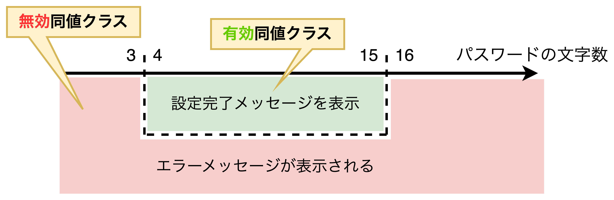
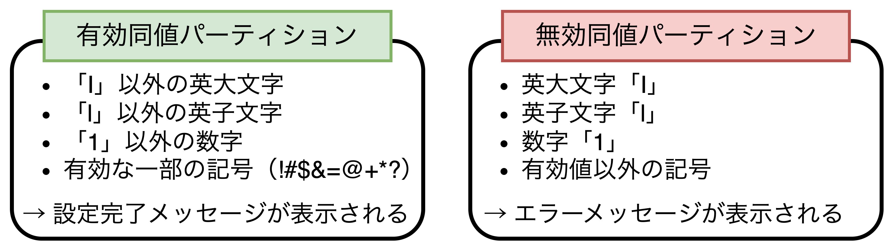

## 同値分割テスト・境界値テスト

- 本章では**①同値分割テスト**と**②境界値テスト**について解説する。本技法は単体テスト、結合テスト、機能テスト、システムテスト（負荷テスト、機能確認テスト）で使用可能。
- 同値分割テスト・境界値テストはともに「<b>ソフトウェアの動作が変わる条件の境目</b>」に注目するテスト技法であり、一般的に、<u>欠陥は条件の境目付近に多いため、同値分割テスト・境界値テストによってお効率的に欠陥を検出できる</u>。

### すべての値をテストすることはできない

> 【**パスワードの仕様令**】
> 4文字以上、15文字以下であること
>
> 【**パスワードの文字数判定テスト例**】
> パスワードを入力せず（0文字）OKボタンをクリック 　　　 → エラーメッセージを表示
> 1文字のパスワードを入力し、OKボタンをクリック 　　　　 → エラーメッセージを表示
> 2文字のパスワードを入力し、OKボタンをクリック 　　　　 → エラーメッセージを表示
> 3文字のパスワードを入力し、OKボタンをクリック 　　　　 → エラーメッセージを表示
> 4文字のパスワードを入力し、OKボタンをクリック 　　　　 → 設定完了メッセージを表示
> 5文字のパスワードを入力し、OKボタンをクリック 　　　　 → 設定完了メッセージを表示
> ...
> 13文字のパスワードを入力し、OKボタンをクリック 　　　　→ 設定完了メッセージを表示
> 14文字のパスワードを入力し、OKボタンをクリック 　　　　→ 設定完了メッセージを表示
> 15文字のパスワードを入力し、OKボタンをクリック 　　　　→ エラーメッセージを表示
> 16文字のパスワードを入力し、OKボタンをクリック 　　　　→ エラーメッセージを表示
> ...

- ソフトウェアでは入力値や条件によって処理方法が決まるが、多くの場合、その組合せは膨大になるため、**通常は「全ての入力値」や「全ての条件」を1つひとつテストすることはできない**。
- <u>上記のようなテストを延々とする場合、同値分割テストや境界値テストが有用である</u>。

### 同値分割テストとは

- 同値分割テストは「**同値パーティション（同じ動作をする条件の集まり）ごとにテストを行うテスト技法**」である。ここで同値パーティションの例は以下の通り。
  - 同じ処理結果となる「入力値」の集まり
  - 同じ処理結果となる「時間」の集まり
  - 同じ入力値から処理される「出力結果」の集まり
- 同値パーティションの考え方を先ほどのパスワードの文字数を例に考える。パスワードの仕様を確認すると「4〜15文字の同値パーティション（<b>有効同値クラス</b>）」と「3文字以下または16文字以上の同値パーティション（<b>無効同値クラス</b>）」があることがわかる。

#### 【同値分割の特徴】連続した値の分割だけではない

- 同値パーティションは「**同じ動作をする条件の集まり**」であり、連続値を表すわけではない。例えば、パスワードに使用できない文字として、判読性の低い**英大文字のアイ「I」、英小文字のエル「l」、数字のイチ「1」** が指定されている場合、同値パーティションは上図のようになる。

### 同値分割テストの実施方法

$$
\begin{align*}
&代表地でテストし、欠陥が見つかれば同値パーティション内の他の値でも\\
&同じ欠陥が見つかるだろう。\\
&欠陥が見つからなければ、同値パーティション内の他の値でも\\
&同じ欠陥は見つからないだろう。
\end{align*}
$$

- 同値分割テストでは各同値パーティションから最低1つの**代表値**を選んでテストを行う。例えば上記のパスワードの文字数で言えば、以下のようになる。
  - 【<b>有効同値パーティション</b>】9文字（設定完了メッセージが表示される）
  - 【<b>無効同値パーティション</b>】2文字（エラーメッセージが表示される）
- 代表値には「**範囲の中間値**」を選択することが多い。この例の場合は、、、

### 内部構造と同値パーティションの関係

- 

### 境界値テストとは

- 

### 境界値テストの実施方法

- 

### 境界値テストの効果

- 

### 隠れた境界値

- 

### 同値分割テストと境界値テストのまとめ

- 
