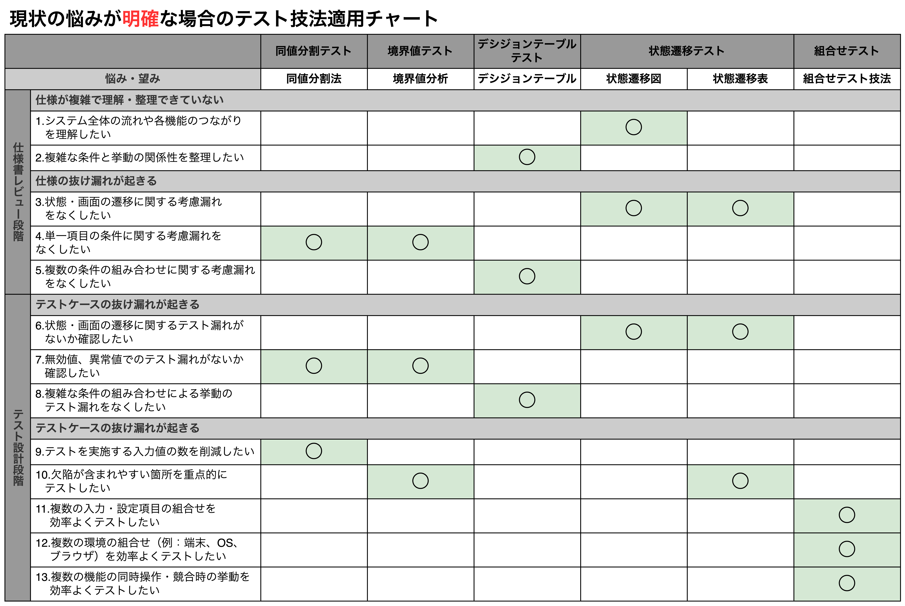
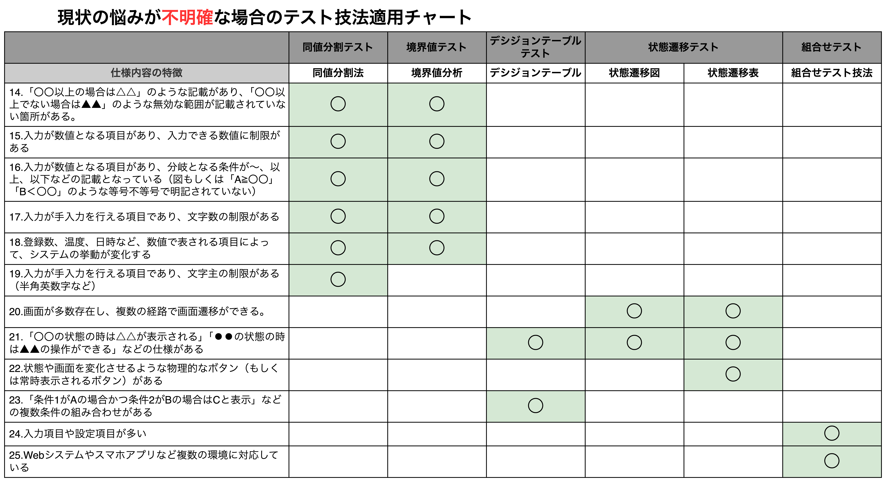
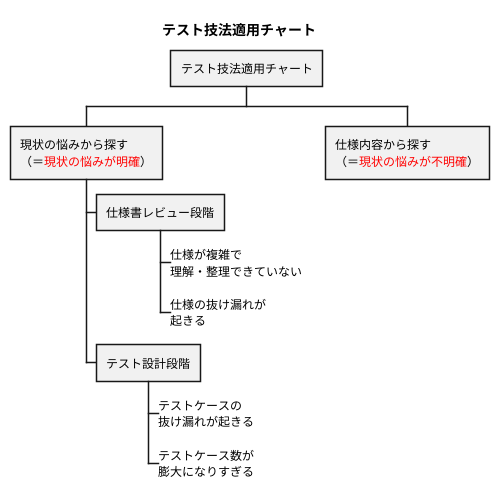

## テスト技法適用チャート

### テスト技法適用チャートの使い方

- テスト技法を使用する際、「**①各テスト技法の特徴や使用方法を理解すること**」に加え、「<b>②最適なテスト技法の選択</b>」も必要になる。②を実現するために、本書では「テスト技法適用チャート」を紹介する。当チャートをベースに職場の環境や組織の運営に応じて加工・編集していけば良い。
- テスト技法適用チャートは次の流れで使用する。
  - 【**ステップ1**】現状の悩みが「**明確か・明確でないか**」を区別する。**悩みが明確である場合**、現状の悩みを解決するためのテスト技法を適用する。**悩みが明確でない場合**、仕様からテスト技法を検討し、選択する。
  - 【**ステップ2**】ステップ1から分類した結果を元に、上表に基づいて適用するテスト技法を選択する。

### 適用方法の解説

#### 現状の悩みから探す（13個）

- 【**1**】ソフトウェア開発において自身の担当箇所の使用であればよく理解しているが、**全体の流れや他の箇所とのつながりがわからない**ということはよくある。<u>システム全体を俯瞰し、各機能の繋がりを理解するために状態遷移図（画面遷移図）を作成する</u>。
- 【**2・5**】「年齢80歳以上の人は金額60%引き、体重100kg以上の人は金額50%引き」といった仕様の場合、「年齢80歳以上で体重100kg以上の人」はどうなるのでしょうか。このケースのように条件が多くなればなるほど考慮漏れが発生しやすくなる。<u>条件数が多く、考慮漏れが発生しやすい場合はデシジョンテーブルで条件と挙動の関係を整理することが肝要</u>。
- 【**3**】開発仕様書において、状態遷移（画面遷移）が文章であると、考慮漏れの仕様発見が難しくなる。一方、<u>状態遷移図（画面遷移図）を使用すれば遷移の考慮漏れを発見できる</u>。例えば、「状態Aから状態Bに遷移はできるが状態Aには戻す方法がない」などがある。また、<u>状態遷移表（画面遷移表）を使用することで無効遷移の考慮漏れも発見できる</u>。例えば、「状態Aでは本来使用しないボタンBを押下したらどうなるか」などがある。
- 【**4**】「個数を入力すると、単価を元にして総額が表示される」といった仕様の場合、「文字を入力する」「0やマイナス値を入力する」といった不正な値の入力に関する仕様が漏れることがある。このような<u>入力値のバリデーションチェックに関する考慮漏れは同値分割法や境界値分析を使って入力項目や設定値を網羅することで防ぐことができる</u>。数直線を使用し、同値パーティションをわかりやすく整理すると良い。
- 【**6**】遷移に関するテスト漏れを防止するために、<u>状態遷移図（画面遷移図）からテストケースを作成する</u>。無効な遷移（仕様上できないこと）もテストに含める場合は状態遷移表（画面遷移表）を使用すると良い。
- 【**7**】無効値や異常値に対するテスト漏れを防止するために、<u>同値分割法で「有効同値パーティション」と「無効同値パーティション」を整理し、全ての同値パーティションの入力値に対するテストケースを作成する</u>。
- 【**8**】テスト設計の漏れを防止するために、<u>デシジョンテーブルからテストケースを作成し、テストケースがデシジョンテーブルのルールを網羅しているかどうかを確認する</u>。条件の中で「数値の範囲」を表す条件がある場合は、**境界値も考慮した確認**も必要である。
- 【**9**】<u>各入力項目に関する値の削減を行う場合は同値分割法が有用であるが、**入力値を減らした分だけ欠陥を見逃す可能性が高まる**ことには注意が必要</u>。
- 【**10**】<u>同値パーティションの境界に欠陥が潜んでいる可能性が高いため、境界値分析からテストケースを作成する。具体的には、①入力値の境界、②出力値の境界、③処理中の境界、④ユーザーにとっての境界、などがある</u>。また、状態遷移表（画面遷移表）を使用し、状態とイベントの組合せを網羅的に確認することで「作り込まれてしまった欠陥」を発見することができる。
- 【**11・12・13**】保険料の計算や複合機の設定などの入力・設定項目の**組合せのテスト**、Webシステムにおける**多環境のテスト**、複数機能の**同時操作・競合テスト**などは、すべてのパターンをテストすると膨大な件数になる。このような場合は、<u>組合せテスト技法を用いて最低限の件数で効率よくテストを行うことができ、機能追加や欠陥修正の際に行うリグレッションテストを最低限の工数で行いたい場合にも有効である</u>。また、同時操作・競合テストにおいて、動作の組合せと挙動の関係を整理するために、状態遷移表（状態$\times$状態）を応用して**動作組合せ表（動作$\times$動作）** を作成し、視覚化すると良い。

#### 使用内容から探す（12個）

- 【**14・15・16・17・18・19**】数直線で表すことができない入力値（半角英数字、全角ひらがな、半角カタカナ、記号などの文字種）のテストを行う場合、<u>同値分割法を使って仕様整理し、入力「**できる**」文字種と入力「**できない**」文字種を明確にする</u>。また、①エラーメッセージの表示、②所定の画面へのリダイレクト、など異常時の適切な処理がされているかどうかも確認する。
- 【**20**】多くの機能や複雑な機能を持つシステムでは画面遷移も複雑になり、開発時の考慮漏れが発生しやすくなる。そこで、<u>状態遷移図（画面遷移図）や状態遷移表（画面遷移表）で仕様を整理し、適切に視覚化することで、**テストケースの抜け漏れを防ぐ**</u>。
- 【**21・22**】組み込み系のシステムでは、状態が違えば同じ操作をしても期待される挙動が異なる。例えば、本来のタイミングとは異なるタイミングでボタンを押下した場合の考慮漏れなどがあり、欠陥が作り込まれやすい。そこで、<u>状態遷移図（画面遷移図）を用いて状態と操作の流れを整理したり、状態遷移表（画面遷移表）を用いて状態と操作の組合せを確認したりすることで、**仕様の抜け漏れを発見する**。また、複数の状態が同時に発生する場合はデシジョンテーブルを作成し、挙動を整理する</u>。
- 【**23**】複数の条件判定がある場合、<u>組合せの考慮が漏れることを防ぐためにデシジョンテーブルで情報を整理し、仕様の抜け漏れを発見し、全条件の組合せをテストする</u>。
- 【**24・25**】Webやモバイルなどの複数環境でのテストにおいて、<u>テスト項目数を削減するには、同値分割テストと境界値テストが有用であり、複数条件項目の組合せ数を削減したい場合は組合せテストが適している</u>。

### 適用事例

<table>
    <caption>適用事例1</caption>
	<tbody>
		<tr>
			<th>前提条件</th>
			<th>内容</th>
		</tr>
		<tr>
			<td>担当箇所</td>
			<td>Webサイトにおける画面遷移の設計</td>
		</tr>
		<tr>
			<td>現在の状況</td>
			<td>開発仕様書のレビュー段階</td>
		</tr>
		<tr>
			<td>現状の悩み</td>
			<td>
            ◼多くの画面を頻繁に遷移しながら処理が進む 
            ◼ユーザーの処理内容によって多くの画面遷移パターンがある 
            　→遷移の考慮漏れが発生する可能性がある
            </td>
		</tr>
		<tr>
			<td>やりたいこと</td>
			<td>
            ◼画面使用を整理し、遷移の考慮が漏れていないか確認したい 
            ◼無効な遷移も含めて考慮が漏れていないか確認したい
            </td>
		</tr>
	</tbody>
</table>

<table>
    <caption>適用事例2</caption>
	<tbody>
		<tr>
			<th>前提条件</th>
			<th>内容</th>
		</tr>
		<tr>
			<td>担当箇所</td>
			<td>ユーザーが手入力する欄が存在するソフトウェアの動作確認テスト</td>
		</tr>
		<tr>
			<td>現在の状況</td>
			<td>テスト設計段階</td>
		</tr>
		<tr>
			<td>現状の悩み</td>
			<td>
            入力値に使用できる数値の範囲が非常に広く、 
            すべての値をテストすることは納期的に難しい。
            </td>
		</tr>
		<tr>
			<td>やりたいこと</td>
			<td>テスト実施時に入力欄を効率よく減らしたい。</td>
		</tr>
	</tbody>
</table>

- 使用するテスト技法を選択する際は、①担当箇所、②現在の状況、③現状の悩み、④やりたいこと、の4点について十分に検討しておくことが必要である。
- 【**適用事例1で適用するテスト技法**】←【3】に該当
  - 画面の遷移に関する考慮漏れを確認したいので、状態遷移図（画面遷移図）で整理する。
  - 無効な遷移の考慮漏れを確認したいので、状態遷移表（画面遷移表）で確認する。
- 【**適用事例2で適用するテスト技法**】←【9】に該当
  - テストを実施する入力値を削減したいので、同値分割テストを使用する。
  - 教会が存在する場合は、効率よく欠陥を検出できる境界値テストも効果的である。
