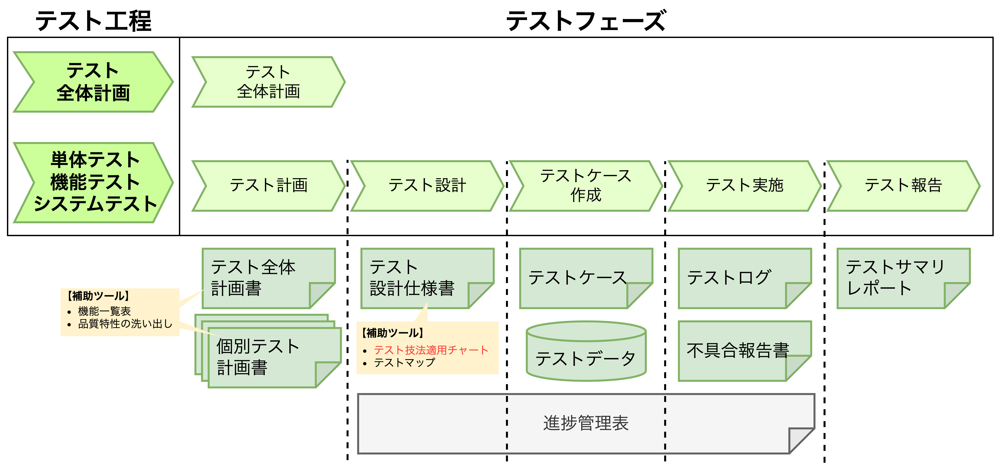
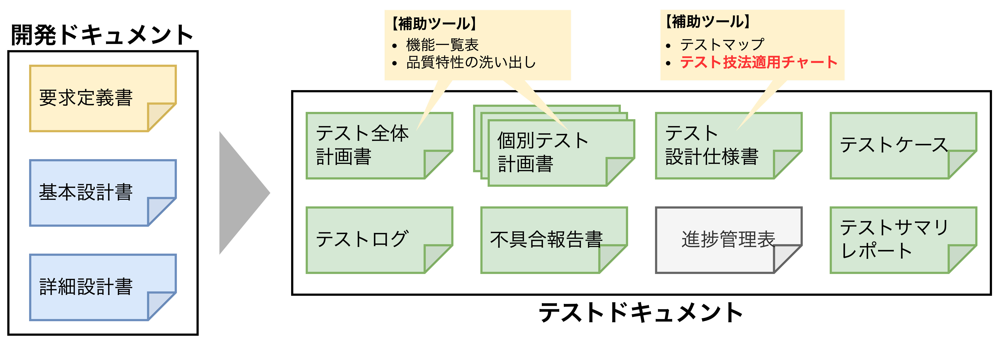

## テストドキュメントの作成

### テストドキュメントの必要性

- テストドキュメントはテストフェーズ単位で作成する。理由は以下の2つ。
- 【**理由1：テスト肯定感で品質が劣化することを防ぐため**】多くの場合、テスト工程はある一定期間、複数人のチームによって進められ、その間にさまざまなテスト作業の実施と担当者の入れ替えが起きる。上記を踏まえ、**テストドキュメントがない場合**、テストの目的や内容を担当者間で正確に伝達することができず、認識齟齬が発生し、結果的に不具合ではないものを不具合として報告してしまったり、修正不要の箇所を修正してしまったりすることになる。一方、**テストドキュメンがある場合**、前のテスト工程・フェーズの担当者の意図を正確に把握することができ、さらに、後のテスト工程・フェーズの担当者に正確に意図を伝えることもできる。
- 【**理由2：テスト対象のソフトウェアの品質状況を可視化するため**】テストフェーズのうち、①テスト計画、②テスト設計、③テストケース作成の3つのフェーズでは実施するテストの具体的な内容や期間などを決定する。この時、テストドキュメントを適切に作成できていれば、テストの予定と実績を比較し、テストのスコープ・スケジュール・品質を正確に把握することができる。

### テストドキュメントの種類

#### テスト全体計画書と個別テスト計画書について

<table>
    <caption>テスト全体計画書と個別テスト計画書の比較</caption>
    <tr>
        <th>比較項目</th>
        <th>テスト全体計画書</th>
        <th>個別テスト計画書</th>
    </tr>
    <tr>
        <td>定義</td>
        <td>
        テスト対象に対して実施する 
        <b>全テスト工程の計画</b>を定義する
        </td>
        <td>
        <b>個別のテスト工程（単体テスト、 
        結合・機能テスト、システムテスト） 
        の計画</b>を定義する
        </td>
    </tr>
    <tr>
        <td>対象範囲</td>
        <td>
        <u>開発プロジェクトにおけるテスト全体</u> の目的、方針、スコープ
        </td>
        <td>
        <u>対象となるテスト工程</u> の目的、スコープ
        </td>
    </tr>
    <tr>
        <td>スケジュール</td>
        <td>
        テスト工程全体のスケジュール （開始条件・終了条件）
        </td>
        <td>
        個別のテスト工程の スケジュール
        </td>
    </tr>
    <tr>
        <td>リソース</td>
        <td>
        テスト工程を構成する各テストの 
        説明とリソース配分
        </td>
        <td>
        設備や環境、人員などの 
        必要なリソース
        </td>
    </tr>
    <tr>
        <td>記載する テスト作業</td>
        <td>
        使用するテスト<b>ツール</b>
        </td>
        <td>
        具体的なテストのアプローチと 
        使用するテスト<b>技法</b>
        </td>
    </tr>
    <tr>
        <td>リスク管理</td>
        <td>
        テスト業務中のリスクと対応策
        </td>
        <td>
        テスト作業の内容と 
        合否判定基準（根拠付き）
        </td>
    </tr>
</table>

#### 【例】個別テスト計画書

> 
【<b>個別テスト計画書</b>】ID: AERO1_TPLAN（Ver.2.0.3） 音楽自動切り替え機能付きエアロバイクの機能テスト、システムテスト

> <b>1. テスト対象</b>　　※テスト非対象 ：運動メニュー、履歴メニュー 
> 　・テスト対象製品：音楽自動切替機能付きエアロバイク 
> 　・テスト対象機能：音楽メニュー 
> 　・前提情報　　　：音楽自動切替機能付きエアロバイクの仕様書（要求定義書、基本設計書）  
> <b>2. 参照資料</b> 
> 　・エアロバイク開発計画書　ID：AERO1_PLAN（Ver.1.1.1） 
> 　・エアロバイク仕様書　　　ID：AERO1_SPEC（Ver.1.0.2）  
> <b>3. テストの目的および範囲</b> 
> （1）システムテスト 
> 　　・テスト対象製品のユーザーの期待する要求を満たしていることを確認する。 
> （2）機能テスト 
> 　　・対象製品の基本機能および画面設計を確認する。 
> 　　・テスト対象機能が全て実装され、要求を満たす動作を行うことを確認する。  
> <b>4. テストの種類とアプローチ</b> 
> （1）システムテスト 
> 　　◼通常利用テスト：音楽の再生中に通常利用が可能であることを確認する。 
> 　　　・利用時間：5分以上、30分以下 
> 　　　・停止操作（通常操作における音楽の停止操作、停止からの再生操作）を含むこと。 
> 　　◼操作テスト：エアロバイクが運動中に様々な操作を行い、問題ないことを確認する。 
> 　　　・機能性に問題ないことを確認する。 
> 　　　・使用性に問題ないことを確認する。 
> 　　　・同じ操作を繰り返しても問題ないこと（ボタンの連打など）を確認する。 
> 　　◼長時間テスト：長時間利用しても、問題ないことを確認する。 
> 　　　・利用時間：31分以上（最長120分程度） 
> 　　　・内蔵音楽の総再生時間を超えて再生し続けた場合、繰り返し再生されること。 
> 　　◼官能テスト：テンポ自動変更機能の適否による「運動継続のしやすさ」と「運動効率の良さ」を比較する 
> 　　　・音楽を聴いている方が「飽きるまでの時間」が長いか 
> 　　　・音楽を聴いている方が「疲労を感じるまでの時間」が長いか 
> 　　　・音楽を聴いている方が「時速は速いか」 
> 

> （2）機能テスト 
> 　　◼画面設計テスト 
> 　　　・画面デザイン：利用するテスト技法→特になし 
> 　　　　・ホームメニュー、音楽メニューの画面デザイン 
> 　　　　・位置、色、文字の属性（フォント、大きさ、太さ）、図形（線の太さ、線の種類） 
> 　　　・画面遷移：利用するテスト技法→状態（画面）遷移 
> 　　　　1）ホームメニュー（音楽ボタン）↔︎音楽メニュー（ホームボタン） 
> 　　　　2）ホームメニュー（運動ボタン）↔︎運動メニュー（ホームボタン） 
> 　　　　3）ホームメニュー（履歴ボタン）↔︎履歴メニュー（ホームボタン） 
> 　　◼基本機能テスト 
> 　　　・音楽再生 PLAY/STOP 切替機能：[利用するテスト技法]→デシジョンテーブル 
> 　　　　・音楽メニューの<code>START</code>ボタン、<code>STOP</code>ボタン 
> 　　　　・再生STOPでペダルを漕ぐと自動的に再生開始 
> 　　　・音量調整機能：[利用するテスト技法]→デシジョンテーブル 
> 　　　　・音楽メニューの<code>ー</code>ボタン、<code>＋</code>ボタン 
> 　　　・再生テンポ変更機能：[利用するテスト技法]→デシジョンテーブル 
> 　　　　・音楽メニューの<code>スロー</code>ボタン、<code>アップ</code>ボタン 
> 　　　・テンポ自動変更機能：[利用するテスト技法]→同値分割テスト、境界値分析、状態遷移 
> 　　　　・音楽メニューの<code>自動</code>ボタン 
> 　　　・音楽メニュー組合せテスト：[利用するテスト技法]組合せテスト 
> 　　　　・再生状態、音量設定、テンポ設定、運動状態の機能で2機能間のテストを行う。  
> <b>5. 予想不具合検出率（不具合数／テストケース数）</b> 
> 　（1）システムテスト 
> 　　　◼通常利用テスト　　　　　　　　　　・・・3.0% 
> 　　　◼操作テスト　　　　　　　　　　　　・・・5.0% 
> 　　　◼長時間テスト　　　　　　　　　　　・・・3.0% 
> 　　　◼官能テスト　　　　　　　　　　　　・・・3.0% 
> 　（2）機能テスト 
> 　　　◼画面設計テスト 
> 　　　　・画面デザイン　　　　　　　　　　・・・10.0% 
> 　　　　・画面遷移　　　　　　　　　　　　・・・5.0% 
> 　　　◼基本機能テスト 
> 　　　　・音楽再生 PLAY/STOP 切替機能　　・・・15.0% 
> 　　　　・音量調整機能　　　　　　　　　　・・・15.0% 
> 　　　　・再生テンポ変更機能　　　　　　　・・・20.0% 
> 　　　　・テンポ自動変更機能　　　　　　　・・・20.0% 
> 　　　　・音楽メニュー組合せテスト　　　　・・・5.0%  
> <b>6. 留意事項</b> 
> 対象製品の本来の目的は音楽を聴くことではなく、身体運動を行うことである。本テストでは、あくまでも身体運動を促進する機能としての「音楽再生」機能であることに留意してテストを行う。また、音楽再生機能の不具合により、エアロバイクによる身体運動ができなくなることがあってはならない。  
> <b>7. テストアイテム</b> 
> 　・エアロバイク（テスト対象製品） 
> 　・イヤホン（製品付属品、市販品）　※ケーブル長 1.2m  
> <b>8. テストフェーズとテストドキュメント</b> 
> テストは次のフェーズに従って進め、その成果としてテストドキュメントを作成する。 
> ・テスト計画　　　　↔︎　テスト計画書（本書） 
> ・テスト設計　　　　↔︎　テスト設計書 
> ・テストケース作成　↔︎　テストケース 
> ・テスト実施　　　　↔︎　テストデータ、テスト結果、不具合報告書 
> ・テスト終了　　　　↔︎　サマリレポート  
> <b>9. スケジュール</b> 
> テスト期間：20XX年1月5日〜3月31日 
> ・1月31日：テスト設計完了 
> ・2月14日：テスト実施期間 
> ・2月28日：テストケース作成完了 
> ・3月31日：テスト実施終了  
> <b>10. テスト体制</b> 
> 　テストマネジャー　　　　・・・　テスト計画、テスト終了を担当 
> 　　┗テストリーダー　　　・・・　テスト設計、テストケース作成を担当 
> 　　　┣テストメンバーA　 ・・・　テスト設計、テストケース作成、テスト実施を担当 
> 　　　┣テストメンバーB　 ・・・　テストケース作成、テスト実施を担当 
> 　　　┗テストメンバーC　 ・・・　テスト実施を担当
> 

> <b>11. リスク</b> 
> （1）実利用環境との差異 
> 　　<リスク> 
> 　　　テストは全てエアロバイクを動作させながら実施する。しかし、ペダルを漕ぎ運動しなが 
> 　　　ら全てのテスト実施を行うのは、すぐに疲労してしまうため不可能である。実際にはエア 
> 　　　ロバイクに乗らず、ペダルを手で回しながら行うことになる。この時、本来のこのユーザ 
> 　　　ーの利用方法とは異なる状況でのテスト実施となるため、「エアロバイクで運動中に音楽 
> 　　　を聴く」という状況でしか検出できない不具合を逃してしまう恐れがある。 
> 　　<対策> 
> 　　　以下のシステムテストは最低限一度は実利用環境の状況でテストを行うことを条件とする。 
> 　　　　・通常利用テスト全般の確認 
> 　　　　・操作テストの使用性の確認 
> 　　　　・感応テストにおける運動継続のしやすさ、運動効率の良さの確認 
> （2）音楽データの選定 
> 　　<リスク> 
> 　　　テスト対象のエアロバイクで再生することができる音楽は内蔵曲だけであり、ユーザーが 
> 　　　自由に選定できるわけではない。そのため、要求事項を確認するシステムテスト、中でも 
> 　　　官能テストは、テスト実施担当者の主観が判断基準となるため、適切なテスト結果が得ら 
> 　　　れない恐れがある。 
> 　　<対策> 
> 　　　製品に採用される内蔵曲の良し悪しについては本テストでは評価しない。テスト実施にお 
> 　　　いては必ず同じ曲でテストを実施し、テスト条件を一定にする。また、システムテストの 
> 　　　官能テストは複数人で実施し、人による違いを評価検討できるようにしておく。テストの 
> 　　　進捗に余裕があれば製品の内蔵曲以外で感応テストを行い、参考データとして提供する。  
> 以上

#### テスト設計仕様書

- テスト設計仕様書は「各テスト工程で行われるテストに対して、**機能ごと・確認したいテストの目的ごとに作成した記述内容が具体的なドキュメント**」である。項目は以下の通り。
  - そのテストの目的
  - テスト対象機能
  - テスト方法
  - 使用するテスト技法
  - テストの入力・出力に何を使うかの定義
  - テスト実施に必要となる環境
  - テスト実施手順に関する特記事項や合否判定基準

##### 【例】音楽再生PLAY／STOP切替機能テスト

> 
【<b>テスト設計仕様書</b>】ID：AERO1_FT_SPEC_PLYSTP_01（Ver.1.0.0） 音楽自動切替機能付きエアロバイクの機能テスト

> <b>1.テスト名称</b> 
> 　音楽再生 PLAY／STOP 切り替え機能テスト  
> <b>2.テストの目的</b> 
> 　再生機能のボタン操作、ペダルの駆動開始によって、再生状態が適切に変化することを確認する。  
> <b>3.参照資料</b> 
> 　・エアロバイクテスト計画書　ID：AERO1_TPLAN（Ver.2.0.3） 
> 　・エアロバイク仕様書　　　　ID：AERO1_SPEC（Ver.1.0.2）  
> <b>4.テストの方法</b> 
> 　・音楽メニューの再生機能に関するデシジョンテーブルの全てのルールについて、デシジョン 
> 　　テーブルの通りに機能することを確認する。 
> 　・動作結果の曲のテンポについては別途「再生テンポ変更機能テスト」で確認するため、本テ 
> 　　ストでは、再生が開始するか、終了するかのみの確認とする。  
> <b>5.デシジョンテーブル</b> 
> <table>
> 	<tbody>
> 		<tr>
> 			<th colspan="2"></th>
> 			<th></th>
> 			<th></th>
> 			<th></th>
> 			<th></th>
> 			<th></th>
> 			<th></th>
> 		</tr>
> 		<tr>
> 			<td rowspan="4"></td>
> 			<td></td>
> 			<td></td>
> 			<td></td>
> 			<td></td>
> 			<td></td>
> 			<td></td>
> 			<td></td>
> 		</tr>
> 		<tr>
> 			<td></td>
> 			<td></td>
> 			<td></td>
> 			<td></td>
> 			<td></td>
> 			<td></td>
> 			<td></td>
> 		</tr>
> 		<tr>
> 			<td></td>
> 			<td></td>
> 			<td></td>
> 			<td></td>
> 			<td></td>
> 			<td></td>
> 			<td></td>
> 		</tr>
> 		<tr>
> 			<td></td>
> 			<td></td>
> 			<td></td>
> 			<td></td>
> 			<td></td>
> 			<td></td>
> 			<td></td>
> 		</tr>
> 		<tr>
> 			<td></td>
> 			<td></td>
> 			<td></td>
> 			<td></td>
> 			<td></td>
> 			<td></td>
> 			<td></td>
> 			<td></td>
> 		</tr>
> 	</tbody>
> </table>
> 【凡例】ー：変化しない  
> 以上

##### 【例】テンポ自動変更機能テスト

> 
【<b>テスト設計仕様書</b>】ID：AERO1_FT_SPEC_ATCHG_01（Ver.1.0.0） 音楽自動切替機能付きエアロバイクの機能テスト

> <b>1.テスト名称</b> 
> 　テンポ自動変更機能テスト  
> <b>2.テストの目的</b> 
> 　テンポ「自動」の際にペダルを漕ぐ速度によって自動的に再生曲のテンポが切り替わるかを確認する。  
> <b>3.参照資料</b> 
> 　・エアロバイクテスト計画書　ID：AERO1_TPLAN（Ver.2.0.3） 
> 　・エアロバイク仕様書　　　　ID：AERO1_SPEC（Ver.1.0.2）  
> <b>4.テストの方法</b>：状態遷移図、状態遷移表に表された遷移の通りに機能することを確認する。 
> 　【前提条件】 
> 　・テンポ「自動」であること 
> 　・速度の自動検知は再生開始から20秒周期で行われる 
> 　　（イベントは20秒周期で自動的に発生する）  
> <b>5.動作速度（イベント）の分析</b> 
>   
> <b>6.状態遷移図</b> 
>   
> <b>7.状態遷移表</b> 
> <table>
> 	<tbody>
> 		<tr>
> 			<th></th>
> 			<th>0km/h</th>
> 			<th>1〜29km/h</th>
> 			<th>30km/h以上</th>
> 		</tr>
> 		<tr>
> 			<td>再生停止中</td>
> 			<td>ー</td>
> 			<td>→スローテンポ 　再生中</td>
> 			<td>→スローテンポ 　再生中（注1）</td>
> 		</tr>
> 		<tr>
> 			<td>スローテンポ 　再生中</td>
> 			<td>→再生停止中</td>
> 			<td>ー</td>
> 			<td>アップテンポ 　再生中</td>
> 		</tr>
> 		<tr>
> 			<td>アップテンポ 　再生中</td>
> 			<td>→再生停止中</td>
> 			<td>→スローテンポ 　再生中</td>
> 			<td>ー</td>
> 		</tr>
> 	</tbody>
> </table>
> 【凡例】ー：遷移しない 
> （注1）基本メニューの基本設計より「常に"スローテンポ曲"から再生を開始する」  
> 以上

##### 【例】音楽メニュー組合せテスト

> 
【<b>テスト設計仕様書</b>】ID：AERO1_FT_SPEC_COMBI_01（Ver.1.0.0） 音楽自動切替機能付きエアロバイクの機能テスト

> <b>1.テスト名称</b> 
> 　音楽メニュー組合せテスト  
> <b>2.テストの目的</b> 
> 　音楽メニューの項目を組合せ、様々な操作をした時、適切に動作することを確認する。  
> <b>3.参照資料</b> 
> 　・エアロバイクテスト計画書　ID：AERO1_TPLAN（Ver.2.0.3） 
> 　・エアロバイク仕様書　　　　ID：AERO1_SPEC（Ver.1.0.2）  
> <b>4.テストの方法</b> 
> 　・音楽メニューの組合せ表の全てのケースの操作前状態から組合せ表の「操作」を行い、適切 
> 　　に動作することを確認する。 
> 　・操作ごとに動作を確認する。操作は連続して行わず、例えば"再生"操作を行ったら、一度操 
> 　　作前状態に戻した後で"音量"などその他の操作を行う。  
> <b>5.音楽メニューの因子水準表</b> 
> <table>
> 	<tbody>
> 		<tr>
> 			<th>因子</th>
> 			<th>再生状態</th>
> 			<th>音量設定</th>
> 			<th>テンポ設定</th>
> 			<th>運動状態</th>
> 		</tr>
> 		<tr>
> 			<td rowspan=3>水準</td>
> 			<td>停止中</td>
> 			<td>1</td>
> 			<td>スロー</td>
> 			<td>ペダル駆動中</td>
> 		</tr>
> 		<tr>
> 			<td>再生中</td>
> 			<td>2〜9</td>
> 			<td>アップ</td>
> 			<td>ペダル停止中</td>
> 		</tr>
> 		<tr>
> 			<td>ー</td>
> 			<td>10</td>
> 			<td>自動</td>
> 			<td>ー</td>
> 		</tr>
> 	</tbody>
> </table>
> ※各因子における水準の選択理由 
> 　・再生状態　：選択可能な設定を全て選択 
> 　・音量設定　：選択可能な設定から最小、中間、最大の観点から3つを選択 
> 　・テンポ設定：選択可能な設定を全て選択 
> 　・運動状態　：選択可能な設定を全て選択  
> <b>6.音楽メニューの組合せ表</b> 
>   
> 以上

### テストケース作成のための中間成果物

- テスト設計仕様書の作成前後で以下のドキュメントも作成することを推奨する。
  - **機能動作確認一覧**：
  - **テストマップ**：
  - **テスト明細**：

#### 機能動作確認一覧

- 

#### テストマップ

- 

#### テスト明細

- 

### テストケース

- 

### テストログ

- 

### 不具合報告書

- 

### 進捗管理表

- 

### テストサマリレポート

- 

### ISO/IEC/IEEE 29119のテストドキュメント項目

- 

### テストプロジェクトにおける役割分担

- 

### 各管理職の工程別作業とドキュメント

- 
