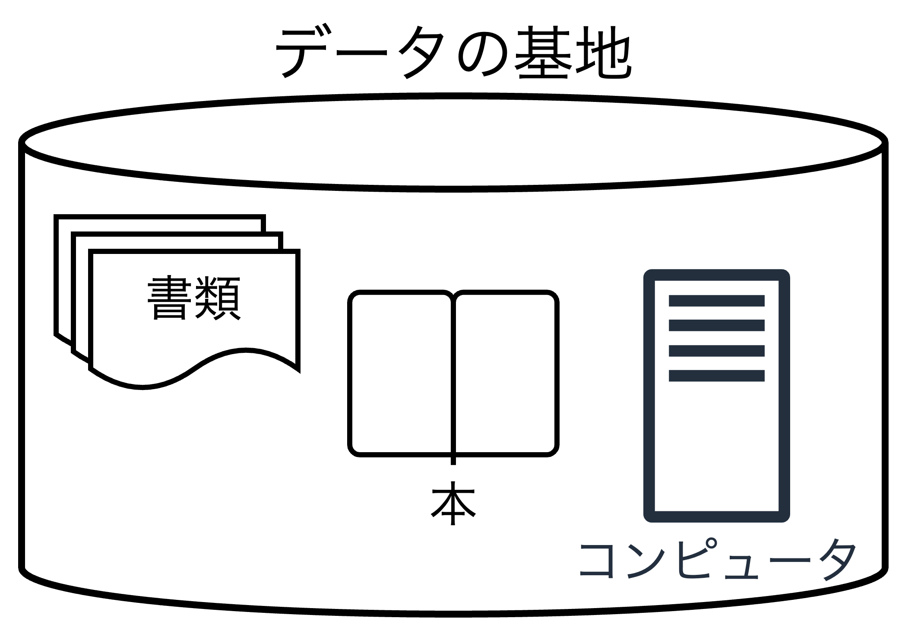
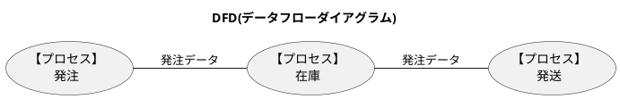
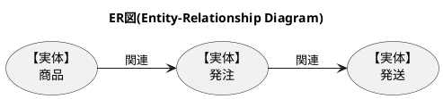
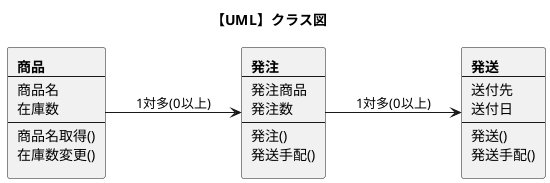
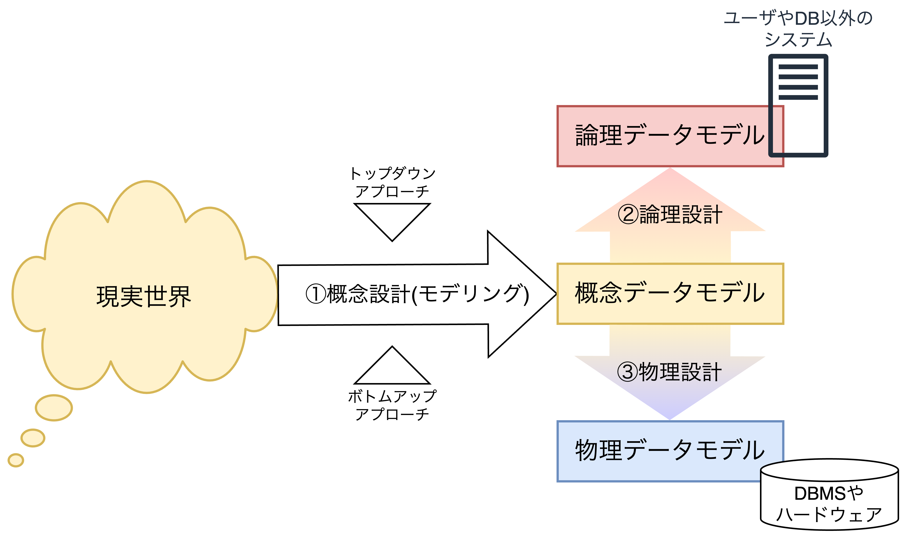
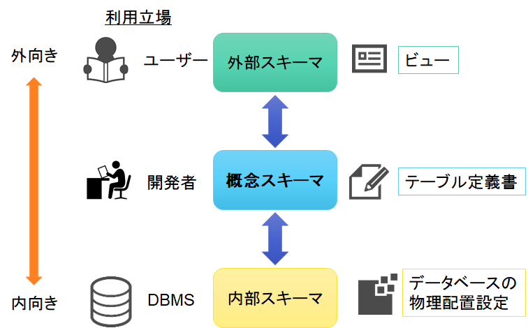
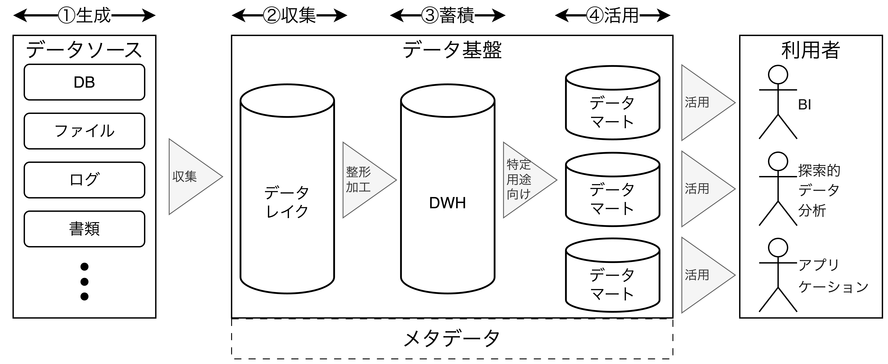

# データベースとは

## データベースの基礎

### データベースとは

データベースという用語は1950年頃のDoD(Department of Defense: 米国国防省)において、各所に分散していた軍事情報を1箇所に集め、すべての情報を見られるように「データ基地(DataBase)」に由来して移設が一般的である。

## システム開発とデータベース

### システム開発のアプローチ

システム開発には大きく3つのアプローチがある。

##### ①プロセス中心アプローチ(POA)

POAはソフトウェアの機能(プロセス)を中心としたアプローチであり、「機能」を一つのプロセスと考え、そのプロセスを段階的に詳細化していきモジュールに分割する。**POAではDFDや状態遷移図をよく用いる**。

##### ②データ中心アプローチ(DOA)

DOAは業務で扱うデータに着目したアプローチであり、業務データ全体をモデル化し、DB設計を行う。アプリケーションとデータベースを分離するデータ独立の考え方が元になっており、データの整合性・一貫性が保証される。**DOAではER図が用いられる**。

##### ③オブジェクト指向アプローチ(OOA)

OOAはプログラムやデータをオブジェクトとして捉え、それらを組み合わせてシステム構築するアプローチであり、**OOAではクラス図やシーケンス図などのUMLが用いられる**。

### データ中心アプローチ

#### DOAの流れ

システム開発の際、DOAではまず概念設計(データモデリング)を行い、トップダウン/ボトムアップの2つの観点から<u>**概念データモデル**</u>を設計する。次に概念データモデルに対して論理設計を行い、<u>「データベース」と「アプリケーション」とを結びつける**論理データモデル**</u>を設計する。さらに概念データモデルに対して物理設計を行い、<u>「データベース」と「DBMS(データベース管理システム)やハードウェア」を結びつける**物理データモデル**</u>を設計する。

①概念/②論理/③物理の3つのデータモデルに分けることで、データ独立を行い、変更に強いシステムを構築できる。それぞれのデータモデルを構築することで独立性(論理データ独立、物理データ独立)を担保できる。特徴としては以下の通り。

- アプリケーション側の修正は<b>論理データモデルの修正</b>だけで済む。
- DBMSやハードウェアの変更があった際は<b>物理データモデルのみの修正</b>だけで済む。
- 上記のいずれも概念データモデルとは独立したデータモデルであるため、<b>概念データモデル</b>には影響を与えない。

#### 3層スキーマアーキテクチャ(ANSI: アメリカ規格協会)

DBを3層に分ける方式は前述した3層のデータモデルの他にもあり、ANSI/X3/SPARCの3層スキーマアーキテクチャがある。スキーマとはデータベースの構造であり、SQLなどで定義される①ストアドファンクションや②ストアドプロシージャ、③テーブルや④ビュー、⑤インデックスなどである。

- 【**外部スキーマ**】データベースに関係のないプログラムやユーザが使用するDBの記述。不要なデータへのアクセスを防ぐことでセキュリティを向上させる。代表的なものに**ビュー**がある。
- 【**概念スキーマ**】エンティティやテーブル、テーブル間の関連などの記述。データ間の関係や制約などを定義し、データの整合性や全体像を把握するための中心的な役割を果たす。代表的なものに**テーブル定義書**がある。
- 【**内部スキーマ**】DBMSで使用するDBを物理的にどのように配置するかなどの具体的な実装の記述。効率的なデータアクセスを実現する。代表的なものにインデックスやデータの格納場所がある。

## データ分析とデータベース

### データ分析基盤

#### 基幹システムと分析システム

データベースを使用するシステムは①基幹システムと②分析システムの大きく2つに分けられる。

- 【**基幹システム**】業務上必須となるシステムで在庫管理、物流管理、販売管理など、様々な基幹業務を行うために稼働するシステム。基幹システムは以下の特性を持つ。
  - 正確で高速にデータ行を追加・更新・削除できる仕組みが必要であり、トランザクション単位でDBを更新するOLTP(OnLine Transaction Processing)が重要になる。
  - 行に対するアクセスが高速に動作する関係データベース(行指向DB)がよく用いられる。
- 【**分析システム**】売り上げ分析やWebサイトのアクセス分析などのデータ分析のシステム。分析システムは以下の特性を持つ。
    - 基幹システムのデータを取得して分析を行い、更新はせず、複雑で分析的な問合せを素早く取得する処理が必要であり、このような処理をOLAP(OnLine Analytical Processing)という。
    - 関係データベースなどのスナップショットからデータを収集し、列の集計操作などを頻繁に行うことから、DWH(列指向DB)がよく用いられる。

#### BIとデータ分析基盤

BIとは企業などの組織データを収集・蓄積し、それらを分析して経営層の意思決定を支援する方法である。過去や現在のデータから未来の予測を行い、経営判断のミスを軽減・解消する。BIにはデータ分析基盤が必要不可欠であり、継続的なデータ収集や加工・変換を行い、利活用できる仕組み作りが重要になる。データ分析基盤には4つの段階でデータ加工が進む。

1. 【**生成**】データソースの部分。基幹システムの処理で生成したデータやWebのアクセスログ、IoTデバイスのセンサデータなどが該当する。ここでは、<u>分析する内容を想定してデータ生成することが重要である</u>。
2. 【**収集**】データレイクの部分。生成されたデータを収集する段階であり、基のデータ、ファイルなどを全て保管しておく場所。
3. 【**蓄積**】データウェアハウスの部分。収集データを整形加工して蓄積する段階であり、重複や誤記、表記揺れなどを削除・修正・正規化する<u>「データクレンジング」</u>を行う。加工はETLツールを用いて行われる。
4. 【**活用**】データマートの部分。データマイニング(大量のデータから新たな知識を取り出すこと)を行い、分析結果を経営層のために可視化し、意思決定に利用できるようにすることを目的とする。ユースケースごとにデータマートは用意され、特定の利用者・用途でデータを取り出す。

### AIで活用するためのデータベース

AIではビッグデータを分析した結果を用いて様々な場面で応用する。ビッグデータはRDBMSでは扱いきれないデータを指し、3Vと呼ばれる3つの特徴を持つ。

1. 【**データの量(Volume)**】データの量が多く、1代のサーバで処理しきれない。
2. 【**データの種類(Variety)**】非構造化データを前提としており、頻繁に構造が変化することから、管理コストが大きい。
3. 【**データ発生/処理頻度・速度(Velocity)**】データ処理の頻度が多く、連続してクエリが発行されるため、トランザクションコストが大きい。
