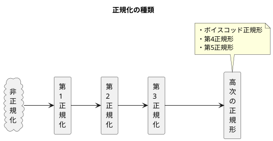

<style>
    body {
      counter-reset: chapter 1;
    }
    h1 {
        counter-reset: sub-chapter;
    }
    h2 {
        counter-reset: section;
    }

    h1::before {
        counter-increment: chapter;
        content: counter(chapter) "章 ";
    }
    h2::before {
        counter-increment: sub-chapter;
        content: counter(chapter) "-" counter(sub-chapter) " ";
    }
    h3::before {
        counter-increment: section;
        content: counter(chapter) "-" counter(sub-chapter) "-" counter(section) " ";
    }
</style>

# データベース基礎理論

## 正規化理論

### 正規化とは

正規化(Normalization)は一般的に、一定のルールに従って変形を行うことであり、<font color=red>更新時異状を排除することを正規化の目的</font>としている。ここでいう「更新」とは追加/更新(修正)/削除の3つを指す。

#### 正規化を行わない理由

以下の3つのいずれかに該当する場合、正規化を行わない(非正規化を行う)ことがある。

1. 【**データ更新を行わない**】DWHやアクセスログなどデータ追記だけで更新しないものは正規化の必要がない。
1. 【**データ履歴を残すもの**】社員移動履歴や単価改変履歴など、古いデータの履歴を残すものは更新されては困るため、正規化は行わない。
1. 【**高速化が特別に必要なもの**】データの更新時異状よりも高速化が優先される場合、あえて正規化を行わない。この時、更新時以上への対策を講じる必要がある。

#### 正規化の種類

正規化は6種類あり、ほとんどの場合は「**第3正規形まで**」の正規化を行う。



#### 更新時異状

更新時異状は正規化を行なっていない時に起こる事象であり、次の3パターンがある。

- 【**パターン1**】タプル**挿入**時異状
- 【**パターン2**】タプル<b>更新(修正)</b>時異状
- 【**パターン3**】タプル**削除**時異状

#### 関数従属性

正規化を理解するための大切な考え方の一つに「<font color=red><b>関数従属性</b></font>」がある。これはある属性Xの値が決まれば、別の属性Yの値が一意に決まる性質である。これ$X\rightarrow Y$で表現し、Xを決定項、Yを従属項という。例えば、「科目番号→科目名」や「所属コード→所属名」、「社員番号→社員名」などがある。

#### 導出属性の排除

DBの属性の中には他の属性から演算を行うことによって導くことができる「**導出属性**」がある。例えば、伝票でよく見かける「単価×数量=金額」などは導出属性である。<u>導出属性は正規化の過程で削除される</u>が、逆に非正規化の過程で残すこともあるため臨機応変に考えていくことが重要である。

#### メタデータ

メタデータとは、「データについてのデータ」であり、あるデータが付随して持つ、データ自身に関する抽象度の高いデータ。

- 【**記述メタデータ**】データの内容を記述するメタデータ。例えば、書籍のタイトル、著者、出版年などが該当する。
- 【**構造メタデータ**】データがどのように構成されているかを記述するメタデータ。例えば、データベースのテーブル構造や、XMLファイルの要素などが該当する。
- 【**管理メタデータ**】データの管理に関するメタデータ。例えば、ファイル名、作成者、作成日時、アクセス権などが該当する。

### 第1正規形

<font color=red>第1正規形の定義は関係$R$について「<b>属性がすべて単一値を取ること</b>」である。</font>具体的にはドメインに**直積集合**や**冪集合**がある場合には、それを排除していきます。
例えば次のような関係"伝票"を考える。表の<font color=red>赤色部分が直積集合</font>、<font color=blue>青色部分が冪集合</font>を表している。直積集合は複数の値が入っており単一値ではないデータを指し、冪集合は与えられた集合からその部分集合を元として含む集合のことである。

<div style="page-break-before:always"></div>

<table>
    <caption>①関係"伝票"</caption>
	<tbody>
		<tr>
			<th>伝票番号</th>
			<th><font color=red>顧客名(顧客番号)</th>
			<th>商品番号</th>
			<th>商品名</th>
			<th>数量</th>
		</tr>
		<tr>
			<td rowspan="2">1001</td>
			<td rowspan="2">ねこ商事(11)</td>
			<td>2001</td>
			<td>チョコレート</td>
			<td>5</td>
		</tr>
		<tr>
			<td>2002</td>
			<td>キャラメル</td>
			<td>10</td>
		</tr>
		<tr>
			<td rowspan="2">1002</td>
			<td rowspan="2">うさぎ開発(13)</td>
			<td>2001</td>
			<td>チョコレート</td>
			<td>5</td>
		</tr>
		<tr>
			<td>2003</td>
			<td>ドーナツ</td>
			<td>20</td>
		</tr>
		<tr>
			<td>1003</td>
			<td>くま工業(29)</td>
			<td>2005</td>
			<td>プロテイン</td>
			<td>30</td>
		</tr>
		<tr>
			<td>1004</td>
			<td>くま工業(29)</td>
			<td>2005</td>
			<td>プロテイン</td>
			<td>30</td>
		</tr>
	</tbody>
</table>


<table>
    <caption>②<font color=red>直積集合</font>を排除した関係"伝票"</caption>
	<tbody>
		<tr>
			<th><font color=blue>伝票番号</th>
			<th><font color=blue>顧客番号</th>
			<th><font color=blue>顧客名</th>
			<th>商品番号</th>
			<th>商品名</th>
			<th>数量</th>
		</tr>
		<tr>
			<td rowspan="2">1001</td>
			<td rowspan="2">11</td>
			<td rowspan="2">ねこ商事</td>
			<td>2001</td>
			<td>チョコレート</td>
			<td>5</td>
		</tr>
		<tr>
			<td>2002</td>
			<td>キャラメル</td>
			<td>10</td>
		</tr>
		<tr>
			<td rowspan="2">1002</td>
			<td rowspan="2">13</td>
			<td rowspan="2">うさぎ開発</td>
			<td>2001</td>
			<td>チョコレート</td>
			<td>5</td>
		</tr>
		<tr>
			<td>2003</td>
			<td>ドーナツ</td>
			<td>20</td>
		</tr>
		<tr>
			<td>1003</td>
			<td>29</td>
			<td>くま工業</td>
			<td>2005</td>
			<td>プロテイン</td>
			<td>30</td>
		</tr>
		<tr>
			<td>1004</td>
			<td>29</td>
			<td>くま工業</td>
			<td>2005</td>
			<td>プロテイン</td>
			<td>30</td>
		</tr>
	</tbody>
</table>

<table>
    <caption>③【<b>第1正規形</b>】<font color=blue>冪集合</font>と<font color=red>直積集合</font>を排除した関係"伝票"</caption>
	<tbody>
		<tr>
			<th>伝票番号</th>
			<th>顧客番号</th>
			<th>顧客名</th>
			<th>商品番号</th>
			<th>商品名</th>
			<th>数量</th>
		</tr>
		<tr>
			<td>1001</td>
			<td>11</td>
			<td>ねこ商事</td>
			<td>2001</td>
			<td>チョコレート</td>
			<td>5</td>
		</tr>
		<tr>
			<td>1001</td>
			<td>11</td>
			<td>ねこ商事</td>
			<td>2002</td>
			<td>キャラメル</td>
			<td>10</td>
		</tr>
		<tr>
			<td>1002</td>
			<td>13</td>
			<td>うさぎ開発</td>
			<td>2001</td>
			<td>チョコレート</td>
			<td>5</td>
		</tr>
		<tr>
			<td>1002</td>
			<td>13</td>
			<td>うさぎ開発</td>
			<td>2003</td>
			<td>ドーナツ</td>
			<td>20</td>
		</tr>
		<tr>
			<td>1003</td>
			<td>29</td>
			<td>くま工業</td>
			<td>2005</td>
			<td>プロテイン</td>
			<td>30</td>
		</tr>
		<tr>
			<td>1004</td>
			<td>29</td>
			<td>くま工業</td>
			<td>2005</td>
			<td>プロテイン</td>
			<td>30</td>
		</tr>
	</tbody>
</table>

<div style="page-break-before:always"></div>

#### 候補キーと主キー

候補キーと主キーと代理キーをそれぞれ以下に示す。候補キーは一つではなく複数の可能性がある。例えば、上記関係を例にすると、`{伝票番号, 商品番号}`や`{伝票番号, 商品名}`の2つが挙げられる。
<font color=red>候補キーは第2正規形や第3正規形で用いるため、候補キーの洗い出しは非常に重要である</font>。

- 【**候補キー**】関係のタプルを一意に識別できる属性または属性の組みのうち**極小**のもの
- 【**主キー**】候補キーの中から一つ選んだものであり、<u>①一意識別能力</u>を持ち、<u>②空値(NULL)を取らない属性</u>である。
- 【**代理キー**】主キーに選ばれなかった候補キー

#### 関係スキーマの表記ルール

- 主キーは実戦の下線(ー)をつける
- 外部キーは破線の下線(---)をつける

<div style="page-break-before:always"></div>

### 第2正規形

#### 第1正規形の問題点

<table>
    <caption>【<b>第1正規形</b>】関係"伝票"</caption>
	<tbody>
		<tr>
			<th><u>伝票番号</th>
			<th>顧客番号</th>
			<th>顧客名</th>
			<th><u>商品番号</th>
			<th>商品名</th>
			<th>数量</th>
		</tr>
		<tr>
			<td>1001</td>
			<td>11</td>
			<td>ねこ商事</td>
			<td>2001</td>
			<td>チョコレート</td>
			<td>5</td>
		</tr>
		<tr>
			<td>1001</td>
			<td>11</td>
			<td>ねこ商事</td>
			<td>2002</td>
			<td>キャラメル</td>
			<td>10</td>
		</tr>
		<tr>
			<td>1002</td>
			<td>13</td>
			<td>うさぎ開発</td>
			<td>2001</td>
			<td>チョコレート</td>
			<td>5</td>
		</tr>
		<tr>
			<td>1002</td>
			<td>13</td>
			<td>うさぎ開発</td>
			<td>2003</td>
			<td>ドーナツ</td>
			<td>20</td>
		</tr>
		<tr>
			<td>1003</td>
			<td>29</td>
			<td>くま工業</td>
			<td>2005</td>
			<td>プロテイン</td>
			<td>30</td>
		</tr>
		<tr>
			<td>1004</td>
			<td>29</td>
			<td>くま工業</td>
			<td>2005</td>
			<td>プロテイン</td>
			<td>30</td>
		</tr>
	</tbody>
</table>

第1正規化のままの関係で第2正規化になっていない場合には、**更新時異状**が起こる。例として上記の関係"伝票"を用いて説明する。

1. 【**タプル挿入時異状**】伝票番号1005の伝票を購入する商品(商品番号)が決まる前に`(1005, 15, かめ道場, NULL, NULL, NULL)`を登録しようとすると、主キーの商品番号がNULL孵化のため登録できない。
2. 【**タプル更新(修正)時異状**】伝票番号1001の顧客番号を「15」に、顧客名を「かめ道場」に変更しようとする場合、伝票番号1001の列は2行あるため、両方一度に修正する必要がある。1行だけ更新するとデータに矛盾が生じる。
3. 【**タプル削除時異状**】伝票番号1003の商品番号2005のタプルを削除すると伝票番号1003のその他の情報も消えてしまう。伝票内容に関する情報を保持できなくなる。

上記の更新時異状を解消するために第2正規形を行う。

#### 第2正規形の定義

第2正規形の定義は以下の2つの条件を満たす関係$R$を指す。

1. $R$は第1正規形(属性がすべて単一値)である
2. <font color=red>$R$の全ての非キー属性は$R$の各候補キーに<b>完全関数従属</b>している(=<b>部分関数従属がない</b>)</font>

つまり、**第1正規形を前提として、部分関数従属を排除した関係スキーマが第2正規形である**。

#### 完全関数従属と部分関数従属

完全関数従属とは、関数従属性$X\rightarrow Y$において、$X$の全ての真部分集合$X'$について、$X'\rightarrow Y$が成立しないことを指す。ここで真部分集合とは部分集合の中から全体集合を除いた集合を指す。
　上記の関係"伝票"を例とすると候補キーと非キー属性は以下の通り。

- 【**候補キー**】`{伝票番号, 商品番号}`、`{伝票番号, 商品名}`
- 【**非キー属性**】顧客番号、顧客名、数量

関係$R$を見ると以下のことがわかる。

- 顧客番号と顧客名は`伝票番号`が決まると一意に決まることがわかるため、`{伝票番号}→{顧客番号, 顧客名}`という関数重属性が成り立つ(**部分関数従属性**)。
- 数量は`{伝票番号, 商品番号}`もしくは`{伝票番号, 商品名}`が決まると一意にわかるため、`{伝票番号, 商品番号}→数量`が成り立つ(**完全関数従属**)。

#### 部分関数従属性の排除(第2正規形の実践)

上記の完全関数従属と部分関数従属の結果を踏まえ、第2正規形を行った結果を示す。

<table>
    <tr>
        <td>
            <table>
                <caption>【<b>第2正規形</b>】関係"伝票明細"</caption>
                <tbody>
                    <tr>
                        <th><u>伝票番号</th>
                        <th><u>商品番号</th>
                        <th>商品名</th>
                        <th>数量</th>
                    </tr>
                    <tr>
                        <td>1001</td>
                        <td>2001</td>
                        <td>チョコレート</td>
                        <td>5</td>
                    </tr>
                    <tr>
                        <td>1001</td>
                        <td>2002</td>
                        <td>キャラメル</td>
                        <td>10</td>
                    </tr>
                    <tr>
                        <td>1002</td>
                        <td>2001</td>
                        <td>チョコレート</td>
                        <td>5</td>
                    </tr>
                    <tr>
                        <td>1002</td>
                        <td>2003</td>
                        <td>ドーナツ</td>
                        <td>20</td>
                    </tr>
                    <tr>
                        <td>1003</td>
                        <td>2005</td>
                        <td>プロテイン</td>
                        <td>30</td>
                    </tr>
                    <tr>
                        <td>1004</td>
                        <td>2005</td>
                        <td>プロテイン</td>
                        <td>30</td>
                    </tr>
                </tbody>
            </table>
        </td>
        <td>
            <table>
                <caption>【<b>第2正規形</b>】関係"伝票"</caption>
                <tbody>
                    <tr>
                        <th><u>伝票番号</th>
                        <th>顧客番号</th>
                        <th>顧客名</th>
                    </tr>
                    <tr>
                        <td>1001</td>
                        <td>11</td>
                        <td>ねこ商事</td>
                    </tr>
                    <tr>
                        <td>1001</td>
                        <td>11</td>
                        <td>ねこ商事</td>
                    </tr>
                    <tr>
                        <td>1002</td>
                        <td>13</td>
                        <td>うさぎ開発</td>
                    </tr>
                    <tr>
                        <td>1002</td>
                        <td>13</td>
                        <td>うさぎ開発</td>
                    </tr>
                    <tr>
                        <td>1003</td>
                        <td>29</td>
                        <td>くま工業</td>
                    </tr>
                    <tr>
                        <td>1004</td>
                        <td>29</td>
                        <td>くま工業</td>
                    </tr>
                </tbody>
            </table>        
        </td>
    </tr>
</table>

第1正規形は次のような関係スキーマであった。

- **伝票**(<u>伝票番号</u>, 顧客番号, 顧客名, <u>商品番号</u>, 商品名, 数量)

部分関数従属性を排除した第2正規形は次のような関係スキーマである。

- **伝票明細**(<u>伝票番号</u>, <u>商品番号</u>, 商品名, 数量)
- **伝票**(<u>伝票番号</u>, 顧客番号, 顧客名)

<div style="page-break-before:always"></div>

### 第3正規形

#### 第2正規形の問題点

<table>
    <caption>【<b>第2正規形</b>】関係"伝票"</caption>
    <tbody>
        <tr>
            <th><u>伝票番号</th>
            <th>顧客番号</th>
            <th>顧客名</th>
        </tr>
        <tr>
            <td>1001</td>
            <td>11</td>
            <td>ねこ商事</td>
        </tr>
        <tr>
            <td>1001</td>
            <td>11</td>
            <td>ねこ商事</td>
        </tr>
        <tr>
            <td>1002</td>
            <td>13</td>
            <td>うさぎ開発</td>
        </tr>
        <tr>
            <td>1002</td>
            <td>13</td>
            <td>うさぎ開発</td>
        </tr>
        <tr>
            <td>1003</td>
            <td>29</td>
            <td>くま工業</td>
        </tr>
        <tr>
            <td>1004</td>
            <td>29</td>
            <td>くま工業</td>
        </tr>
    </tbody>
</table>

第2正規化のままの関係で第3正規化になっていない場合でも、**更新時異状**が起こる。例として上記の関係"伝票"を用いて説明する。

1. 【**タプル挿入時異状**】顧客番号が15、顧客名がかめ道場のデータを伝票が発生する前に`(NULL, 15, かめ道場)`と登録しようとすると主キーの伝票番号がNULL不可のため、登録できない。
2. 【**タプル更新(修正)時異状**】顧客番号29の「くま工場」が社名変更したので顧客名を「くまAK」に修正しようとした場合、顧客番号29の列は2行あるため、両方を一度に修正する必要がある。
3. 【**タプル削除時異状**】伝票番号1001のタプルを削除すると、顧客番号11のねこ商事の情報が消えてしまう。そのため、顧客に関する情報が保持できなくなる。

上記の更新時異状を解消するために第2正規形を行う。

#### 第3正規形の定義

第3正規形の定義は以下の2つの条件を満たす関係$R$を指す。

1. $R$は第2正規形である(全ての非キー属性が完全関数従属である)
2. <font color=red>$R$の全ての非キー属性は$R$のいかなる候補キーにも<b>推移的に関数従属しない</b></font>

つまり、**第2正規形を前提として、推移的関数従属を排除した関係スキーマが第3正規形である**。


#### 推移的関数従属性

推移的関数従属とは、関係$R$の異なる属性または属性の集合である$X, Y, Z$について、$X\rightarrow Y, Y\nrightarrow X, Y\rightarrow Z$の三つの制約が成立している関数従属性である。

- <font color=blue>$X$が決まると$Y$が決まる</font>
- <font color=green>$Y$が決まると$Z$が決まる</font>
- <font color=orange>$Y$が決まっても$X$は決まらない</font>

```plantuml
title 推移的関数従属性
left to right direction

entity "X(伝票番号)" as X
entity "Y(顧客番号)" as Y
entity "Z(顧客名)" as Z

X -[#blue,thickness=2]-> Y
Y -[#orange,thickness=2]-x X
Y -[#green,thickness=2]-> Z
```

#### 推移的関数従属性の排除

<table>
    <tr>
        <td>
            <table>
                <caption>【<b>第3正規形</b>】関係"伝票明細"</caption>
                <tbody>
                    <tr>
                        <th><u>伝票番号</th>
                        <th><u>商品番号</th>
                        <th>商品名</th>
                        <th>数量</th>
                    </tr>
                    <tr>
                        <td>1001</td>
                        <td>2001</td>
                        <td>チョコレート</td>
                        <td>5</td>
                    </tr>
                    <tr>
                        <td>1001</td>
                        <td>2002</td>
                        <td>キャラメル</td>
                        <td>10</td>
                    </tr>
                    <tr>
                        <td>1002</td>
                        <td>2001</td>
                        <td>チョコレート</td>
                        <td>5</td>
                    </tr>
                    <tr>
                        <td>1002</td>
                        <td>2003</td>
                        <td>ドーナツ</td>
                        <td>20</td>
                    </tr>
                    <tr>
                        <td>1003</td>
                        <td>2005</td>
                        <td>プロテイン</td>
                        <td>30</td>
                    </tr>
                    <tr>
                        <td>1004</td>
                        <td>2005</td>
                        <td>プロテイン</td>
                        <td>30</td>
                    </tr>
                </tbody>
            </table>
        </td>
        <td>
            <table>
                <caption>【<b>第3正規形</b>】関係"伝票"</caption>
                <tbody>
                    <tr>
                        <th><u>伝票番号</th>
                        <th><span style="border-bottom: 1px dashed #000;">顧客番号</th>
                    </tr>
                    <tr>
                        <td>1001</td>
                        <td>11</td>
                    </tr>
                    <tr>
                        <td>1002</td>
                        <td>13</td>
                    </tr>
                    <tr>
                        <td>1003</td>
                        <td>29</td>
                    </tr>
                    <tr>
                        <td>1004</td>
                        <td>29</td>
                    </tr>
                </tbody>
            </table>
        </td>
    </tr>
    <tr>
        <td>
            <table>
                <caption>【<b>第3正規形</b>】関係"顧客"</caption>
                <tbody>
                    <tr>
                        <th><u>顧客番号</th>
                        <th>顧客名</th>
                    </tr>
                    <tr>
                        <td>11</td>
                        <td>ねこ商事</td>
                    </tr>
                    <tr>
                        <td>13</td>
                        <td>うさぎ開発</td>
                    </tr>
                    <tr>
                        <td>29</td>
                        <td>くま工業</td>
                    </tr>
                </tbody>
            </table>    
        </td>
    </tr>
</table>

#### 外部キー

外部キーは複数の関係を結びつけるためのキーであり、先ほど第3正規形にした、関係"伝票"の「顧客番号」が外部キーに該当する。

```sql
-- 外部キーの設定方法1
CREATE TABLE 伝票(
    伝票番号 INTEGER PRIMARY KEY, -- 主キー制約
    顧客番号 INTEGER REFERENCES 顧客(顧客番号)  -- 参照制約
        ON [UPDATE/DELETE] [CASCADE/RESTRICT/...]
)

-- 外部キーの設定方法2
CREATE TABLE 伝票(
    伝票番号 INTEGER PRIMARY KEY, -- 主キー制約
    顧客番号 INTEGER

    -- 参照制約
    FOREIGN KEY 顧客番号 REFERENCES 顧客(顧客番号) 
        ON [UPDATE/DELETE] [CASCADE/RESTRICT/...]
)
```

参照する側(外部キーを持つテーブル)を子、参照される側(主キーとして持つテーブル)を親としたとき、参照制約のオプションは以下のように整理できる。

<table>
    <caption>参照制約のオプション</caption>
    <thead>
        <tr>
            <th></th>
            <th>ON DELETE</th>
            <th>ON UPDATE</th>
        </tr>
    </thead>
    <tbody>
        <tr>
            <th>RESTRICT</th>
            <td>子が存在していると親の削除を拒否<br>（即時チェック）</td>
            <td>子が存在していると親の更新を拒否<br>（即時チェック）</td>
        </tr>
        <tr>
            <th>CASCADE</th>
            <td>親の削除に伴い、子の該当行も<br>自動で削除される</td>
            <td>親の更新に伴い、子の該当行も<br>自動で更新される</td>
        </tr>
        <tr>
            <th>SET NULL</th>
            <td>親の削除に伴い、子の該当行に<br> NULL を設定する</td>
            <td>親の更新に伴い、子の該当行に<br> NULL を設定する</td>
        </tr>
        <tr>
            <th>SET DEFAULT</th>
            <td>親の削除に伴い、子の該当行に<br>デフォルト値を設定する</td>
            <td>親の更新に伴い、子の該当行に<br>デフォルト値を設定する</td>
        </tr>
        <tr>
            <th>NO ACTION</th>
            <td>子が存在していると親の削除を拒否<br>(遅延チェック) ※ほぼ RESTRICT 同等</td>
            <td>子が存在していると親の更新を拒否<br>(遅延チェック) ※ほぼ RESTRICT 同等</td>
        </tr>
    </tbody>
</table>


<div style="page-break-before:always"></div>

## 関係演算

### 関係演算の種類

関係演算は和・差・共通・直積・射影・選択・結合・商の8種類から成る。

#### 和両立

関係演算のうち、和、差、共通演算の3つを行うときは前提条件として「**和両立**」を満たす必要がある。和両立は関係$R(A_1, A_2, ..., A_n)$と$S(B_1, B_2, ..., B_m)$が以下の2つの条件を満たすことを指す。

1. $R$と$S$の字数が等しい(すなわち$n=m$)
2. 各 $i(1\leqq i \leqq n)$ について、$A_i$と$B_i$のドメイン(範囲)が等しい

#### 【集合演算】和・差・共通(積)・直積

- 【**和演算**】<u>二つの関係のどちらかに存在するタプルを挙げる演算</u>であり、重複するタプルは1つにまとめられる。SQLでは`UNION`を用いて表す。OR演算とも呼ばれる。
- 【**差演算**】<u>一方の関係からもう一方の関係に含まれるものを除く演算</u>であり、SQLでは`EXCEPT`を用いて表す。
- 【**共通演算**】<u>二つの関係のどちらにもあるタプルを挙げる演算</u>であり、SQLでは`INTERSECT`を用いて表す。AND演算とも呼ばれる。
- 【**直積演算**】<u>二つの関係のそれぞれのタプルを全て掛け合わせた演算</u>であり、SQLでは`CROSS JOIN`を用いて表す。

<table>
	<tbody>
		<tr>
			<td>
                <table>
                    <caption>関係"DB研究会"</caption>
                    <tbody>
                        <tr>
                            <th>氏名</th>
                            <th>所属</th>
                            <th>連絡先</th>
                        </tr>
                        <tr>
                            <td>うさぎ</td>
                            <td>陸上部</td>
                            <td>1234-5678</td>
                        </tr>
                        <tr>
                            <td>いぬ</td>
                            <td>野球部</td>
                            <td>0000-1111</td>
                        </tr>
                        <tr>
                            <td>あひる</td>
                            <td>水泳部</td>
                            <td>9876-5432</td>
                        </tr>
                    </tbody>
                </table>
            </td>
			<td>
                <table>
                    <caption>関係"NW研究会"</caption>
                    <tbody>
                        <tr>
                            <th>氏名</th>
                            <th>所属</th>
                            <th>連絡先</th>
                        </tr>
                        <tr>
                            <td>かめ</td>
                            <td>囲碁部</td>
                            <td>3333-2222</td>
                        </tr>
                        <tr>
                            <td>うさぎ</td>
                            <td>陸上部</td>
                            <td>1234-5678</td>
                        </tr>
                    </tbody>
                </table>
            </td>
		</tr>
	</tbody>
</table>

上記二つの関係を用いて集合演算の結果を以下に示す。

<div style="page-break-before:always"></div>

<table>
	<tbody>
		<tr>
			<td>
                <table>
                    <caption><b>【和】</b>関係"DB研究会" ∪ 関係"NW研究会"</caption>
                    <tbody>
                        <tr>
                            <th>氏名</th>
                            <th>所属</th>
                            <th>連絡先</th>
                        </tr>
                        <tr>
                            <td>うさぎ</td>
                            <td>陸上部</td>
                            <td>1234-5678</td>
                        </tr>
                        <tr>
                            <td>いぬ</td>
                            <td>野球部</td>
                            <td>0000-1111</td>
                        </tr>
                        <tr>
                            <td>あひる</td>
                            <td>水泳部</td>
                            <td>9876-5432</td>
                        </tr>
                        <tr>
                            <td>かめ</td>
                            <td>囲碁部</td>
                            <td>3333-2222</td>
                        </tr>
                    </tbody>
                </table>
            </td>
			<td>
                <table>
                    <caption><b>【差】</b>係"DB研究会" ー 関係"NW研究会"</caption>
                    <tbody>
                        <tr>
                            <th>氏名</th>
                            <th>所属</th>
                            <th>連絡先</th>
                        </tr>
                        <tr>
                            <td>いぬ</td>
                            <td>野球部</td>
                            <td>0000-1111</td>
                        </tr>
                        <tr>
                            <td>あひる</td>
                            <td>水泳部</td>
                            <td>9876-5432</td>
                        </tr>
                    </tbody>
                </table>
            </td>
		</tr>
		<tr>
			<td>
                <table>
                    <caption><b>【共通(積)】</b>関係"DB研究会" ∩ 関係"NW研究会"</caption>
                    <tbody>
                        <tr>
                            <th>氏名</th>
                            <th>所属</th>
                            <th>連絡先</th>
                        </tr>
                        <tr>
                            <td>うさぎ</td>
                            <td>陸上部</td>
                            <td>1234-5678</td>
                        </tr>
                    </tbody>
                </table>
            </td>
			<td></td>
		</tr>
	</tbody>
</table>

<table>
    <caption><b>【直積】</b>関係"DB研究会" × 関係"NW研究会"</caption>
    <thead>
        <tr>
            <th>DB_氏名</th>
            <th>DB_所属</th>
            <th>DB_連絡先</th>
            <th>NW_氏名</th>
            <th>NW_所属</th>
            <th>NW_連絡先</th>
        </tr>
    </thead>
    <tbody>
        <tr>
            <td>うさぎ</td>
            <td>陸上部</td>
            <td>1234-5678</td>
            <td>かめ</td>
            <td>囲碁部</td>
            <td>3333-2222</td>
        </tr>
        <tr>
            <td>うさぎ</td>
            <td>陸上部</td>
            <td>1234-5678</td>
            <td>うさぎ</td>
            <td>陸上部</td>
            <td>1234-5678</td>
        </tr>
        <tr>
            <td>いぬ</td>
            <td>野球部</td>
            <td>0000-1111</td>
            <td>かめ</td>
            <td>囲碁部</td>
            <td>3333-2222</td>
        </tr>
        <tr>
            <td>いぬ</td>
            <td>野球部</td>
            <td>0000-1111</td>
            <td>うさぎ</td>
            <td>陸上部</td>
            <td>1234-5678</td>
        </tr>
        <tr>
            <td>あひる</td>
            <td>水泳部</td>
            <td>9876-5432</td>
            <td>かめ</td>
            <td>囲碁部</td>
            <td>3333-2222</td>
        </tr>
        <tr>
            <td>あひる</td>
            <td>水泳部</td>
            <td>9876-5432</td>
            <td>うさぎ</td>
            <td>陸上部</td>
            <td>1234-5678</td>
        </tr>
    </tbody>
</table>

#### 【関係代数】射影・選択・結合・商

- 【**射影**】関係を縦方向に切り出した関係。カラム(列)を取り出す。
- 【**選択**】関係を横方向に切り出した関係。タプル(行)を取り出す。
- 【**結合**】二つの関係を共通の属性で結びつけた関係。自然結合の場合、二つの関係の**①直積**から共通の属性値が等しいものを**②選択**し、共通の属性の一つを除いたものの**③射影**を取り出す。
- 【**商**】ある関係をある関係で割った時の関係を表し、商$R\div S$は$S$の関係を含む$R$の列を取り出す。

<table>
	<tbody>
		<tr>
			<td>
                <table>
                    <caption>関係R</caption>
                    <tbody>
                        <tr>
                            <th>A</th>
                            <th>B</th>
                        </tr>
                        <tr>
                            <td>1</td>
                            <td>あ</td>
                        </tr>
                        <tr>
                            <td>2</td>
                            <td>い</td>
                        </tr>
                        <tr>
                            <td>3</td>
                            <td>う</td>
                        </tr>
                    </tbody>
                </table>
            </td>
			<td>
                <table>
                    <caption>関係S</caption>
                    <tbody>
                        <tr>
                            <th>A</th>
                            <th>C</th>
                        </tr>
                        <tr>
                            <td>1</td>
                            <td>か</td>
                        </tr>
                        <tr>
                            <td>2</td>
                            <td>き</td>
                        </tr>
                        <tr>
                            <td>3</td>
                            <td>く</td>
                        </tr>
                    </tbody>
                </table>
            </td>
		</tr>
	</tbody>
</table>

上記関係$R, S$から射影、選択、結合を行う。

```sql
-- 射影: 関係RからカラムAを取り出す
SELECT A FROM R;

-- 選択: 関係Rから A < 3 のタプルを取り出す
SELECT * FROM R
WHERE A < 3;

-- 結合(自然結合): 「直積R×S」からAの値が等しい行を「選択」し、3つの列の「射影」を取る
SELECT R.A, R.B, S.C FROM R
INNER JOIN S ON R.A = S.A;
```

さらに以下の関係"履修"と"授業"を用いて、$履修\div 授業$を取り出す。この例では授業の「データベース」と「ネットワーク」の両方を持つ「氏名」を取り出す。

<table>
	<tbody>
		<tr>
			<td>
                <table>
                    <caption>関係"履修"</caption>
                    <tbody>
                        <tr>
                            <th>氏名</th>
                            <th>授業</th>
                        </tr>
                        <tr>
                            <td>うさぎ</td>
                            <td>データベース</td>
                        </tr>
                        <tr>
                            <td>うさぎ</td>
                            <td>ネットワーク</td>
                        </tr>
                        <tr>
                            <td>いぬ</td>
                            <td>データベース</td>
                        </tr>
                        <tr>
                            <td>いぬ</td>
                            <td>ネットワーク</td>
                        </tr>
                        <tr>
                            <td>あひる</td>
                            <td>ネットワーク</td>
                        </tr>
                    </tbody>
                </table>
            </td>
			<td>
                <table>
                    <caption>関係"授業"</caption>
                    <tbody>
                        <tr>
                            <th>授業</th>
                        </tr>
                        <tr>
                            <td>データベース</td>
                        </tr>
                        <tr>
                            <td>ネットワーク</td>
                        </tr>
                    </tbody>
                </table>
            </td>
			<td>
                <table>
                    <caption>履修÷授業</caption>
                    <tbody>
                        <tr>
                            <th>氏名</th>
                        </tr>
                        <tr>
                            <td>うさぎ</td>
                        </tr>
                        <tr>
                            <td>いぬ</td>
                        </tr>
                    </tbody>
                </table>
            </td>
		</tr>
	</tbody>
</table>
