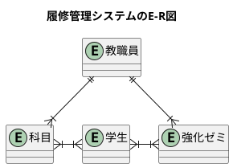
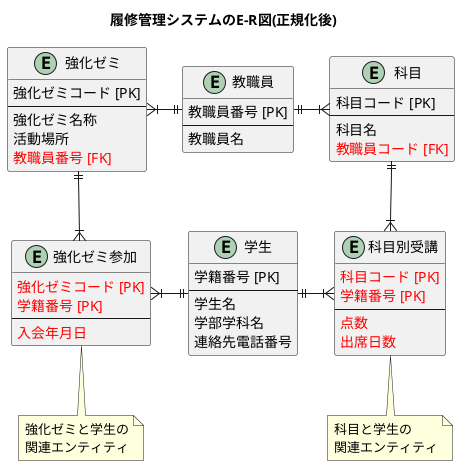
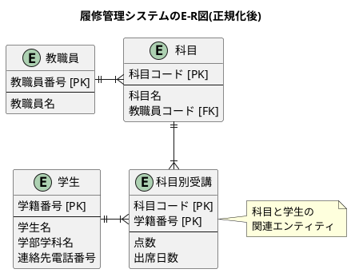

<style>
    body {
      counter-reset: chapter 2;
    }
    h1 {
        counter-reset: sub-chapter;
    }
    h2 {
        counter-reset: section;
    }

    h1::before {
        counter-increment: chapter;
        content: counter(chapter) "章 ";
    }
    h2::before {
        counter-increment: sub-chapter;
        content: counter(chapter) "-" counter(sub-chapter) " ";
    }
    h3::before {
        counter-increment: section;
        content: counter(chapter) "-" counter(sub-chapter) "-" counter(section) " ";
    }
    .diagonal tr:first-child th:first-child {
        background-image: linear-gradient(
            to right top, transparent calc(50% - 0.5px), #eaeaea 50%, #eaeaea calc(50% + 0.5px), transparent calc(50% + 1px)
        );
        display: grid;
        width: max-content;
        justify-content: space-between;
        grid-template-columns: repeat(2, 1fr);
        grid-auto-rows: 1fr;
    }
    .col-header {
        grid-column-start: 2;
        text-align: right;
    }
    .row-header {
        grid-column-start: 1;
    }
</style>

# データベース設計

## データベース設計

### データベース設計の2つのアプローチ

データベース設計はデータベースの全体像を構築する「概念設計」、システムとの整合性を構築する「論理設計」、DBMSとの整合性を構築する「物理設計」から成る。DBスペシャリスト試験ではDOAを取り扱い、DOAではトップダウンとボトムアップの2つのアプローチで概念設計を行う。

- 【**トップダウンアプローチ**】DBの全体像を1からイメージして作成していく方法。全体的に必要なエンティティ(データのまとまり)を洗い出し、それを徐々に詳細化していく。
  1. 【**E-R図の作成**】エンティティの洗い出しとカーディナリティを考え、大まかなE-R図を作成する。
  2. 【**属性の洗い出し**】洗い出したエンティティの属性を洗い出す。
  3. 【**正規化**】洗い出した属性から正規化を行う。「多対多」の関係がある場合は関連エンティティを作成し、「多対多」の関係を排除する。
- 【**ボトムアップアプローチ**】帳票などDBの基となる資料がある場合に行う方法。実際のデータを細かく洗い出したものをまとめていき、それを徐々に統合していく。
  1. 【**属性の洗い出し**】帳票などからDBに入れる必要のある属性を洗い出す。
  2. 【**正規化**】洗い出した属性を正規化する。第1、第2、第3正規形の順でテーブル分解する。
  3. 【**E-R図の作成**】正規化されたテーブルをエンティティとしてE-R図を作成する。

次に以下の例を用いてトップダウンアプローチとボトムアップアプローチを実践する。

```plantuml
title トップダウン/ボトムアップアプローチ

rectangle トップダウンアプローチ {
    rectangle "①E-R図の作成" as topdown_step1 #faa
    rectangle "②属性の洗い出し" as topdown_step2 #afa
    rectangle "③正規化" as topdown_step3 #aaf

    topdown_step1 ==> topdown_step2
    topdown_step2 => topdown_step3
    topdown_step1 <== topdown_step3
}

rectangle ボトムアップアプローチ {
    rectangle "①属性の洗い出し" as bottomup_step1 #afa
    rectangle "②正規化" as bottomup_step2 #aaf
    rectangle "③E-R図の作成" as bottomup_step3 #faa

    bottomup_step1 ==> bottomup_step2
    bottomup_step2 => bottomup_step3
    bottomup_step1 <== bottomup_step3
}
```

<div style="page-break-before:always"></div>

<div style="padding: 5px; margin-bottom: 5px; border: 2px solid #333333;">
    <h4>【例題】履修管理システムの仕様</h4>
    　ある大学では現在、学生の科目の履修状況を管理するシステム(旧システム)を作成し、運用しています。このシステムを見直し、科目だけでなく強化ゼミに関する情報も管理できるようにする新システムを構築することになりました。<br>
    　新システムを設計するにあたり、旧システムの調査を実施しました。学生は、必ず一つの学部学科に所属し、複数の科目を受講します。また、一つの科目は1人の教職員が担当しますが、1人の教職員が複数の科目を担当することもあります。旧システムで出力する"科目別受講状況表"のレイアウトは、次のようになります。<br>
    <table>
        <caption>【<b>科目別受講状況表</b>】<br>科目コード: C0101、出力日: 2017.07.01、科目名: 体育実技、指導教員名: 先生英一郎</caption>
        <tbody>
            <tr>
                <th>学籍番号</th>
                <th>学生名</th>
                <th>学部学科名</th>
                <th>点数</th>
                <th>出席日数</th>
            </tr>
            <tr>
                <td>E11-1543</td>
                <td>骨川 常夫</td>
                <td>経済学部経済学科</td>
                <td>90</td>
                <td>12</td>
            </tr>
            <tr>
                <td>S12-0227</td>
                <td>源本 静香</td>
                <td>社会学部福祉学科</td>
                <td>75</td>
                <td>14</td>
            </tr>
            <tr>
                <td>T13-1025</td>
                <td>剛田 剛史</td>
                <td>工学部電子工学科</td>
                <td>60</td>
                <td>10</td>
            </tr>
            <tr>
                <td>U13-7941</td>
                <td>野比 伸太</td>
                <td>総合情報学部AI学科</td>
                <td>55</td>
                <td>15</td>
            </tr>
            <tr>
                <td>...</td>
                <td>...</td>
                <td>...</td>
                <td>...</td>
                <td>...</td>
            </tr>
        </tbody>
    </table><br>
    また、新システムで作成する強化ゼミの"強化ゼミ参加者名簿"の要件は、次のようになります。なお、強化ゼミは、複数開講されています。<br>
    [強化ゼミ参加者名簿の要件]<br>
    <ol>
        <li>【<b>強化ゼミ参加者名簿に掲載する項目</b>】</li>
        <ol>
            <li>強化ゼミ参加者名簿の見出し部に印刷する項目</li>
            <ul>
                <li>強化ゼミコード、強化ゼミ名称、顧問の教職員名</li>
                <li>活動場所、出力年月日、ページ番号</li>
            </ul>
            <li>強化ゼミ参加者名簿の明細部に、次の項目を横1行に印刷</li>
            <ul>
                <li>学生名、学籍番号、連絡先電話番号、入会年月日</li>
            </ul>
        </ol>
        <li>【<b>強化ゼミ参加者名簿の出力単位</b>】強化ゼミ参加者名簿は、強化ゼミごとに改ページして出力します。また、明細部は40行印刷するごとに改ページします。</li>
        <li>【<b>顧問</b>】強化ゼミの顧問は、1人の教職員が担当します。また、1人の教職員は、複数の強化ゼミの顧問を担当することができます。</li>
        <li>【<b>学生</b>】学生は、複数の強化ゼミに参加することができます。</li>
    </ol>
</div>

<div style="page-break-before:always"></div>

### トップダウンアプローチ

#### ①E-R図の作成

まずはエンティティの洗い出しやリレーションシップ、カーディナリティ(多重度)を求めていく。エンティティは以下の4つが洗い出せる。

- **洗い出したエンティティ**
  1. 学生
  2. 教職員
  3. 科目
  4. 強化ゼミ

ここからリレーションシップとカーディナリティを考える。

- **リレーションシップとカーディナリティ**
  1. 学生は複数の科目を受講する
  2. 1つの科目には複数の学生が登録している
  3. 1つの科目は1人の教職員が担当する
  4. 1人の教職員が複数の科目を担当する
  5. 学生は複数の強化ゼミに参加する
  6. 強化ゼミ参加者名簿は40行印刷するごとに改ページするため、「1つの強化ゼミには複数の学生が参加する」と読み取れる
  7. 強化ゼミの顧問は1人の教職員が担当
  8. 1人の教職員は複数の強化ゼミの顧問を担当する

上記の仕様説明から以下のE-R図が書き出せる。



#### ②属性の洗い出し

作成したE-R図と仕様や図表から属性を洗い出す。赤色の「教職員番号」は仕様にはないが、あったほうが都合が良いために加えている。洗い出した属性以下に示す。

1. 学生(<u>学籍番号</u>, 学生名, 学部学科名, 連絡先電話番号)
2. 教職員(<font color=red><u>教職員番号</u></font>, 教職員名)
3. 科目(<u>科目コード</u>, 科目名)
4. 強化ゼミ(<u>強化ゼミコード</u>, 強化ゼミ名称, 活動場所)

#### ③正規化

洗い出した属性を用いて関係スキーマを第3正規形まで正規化する。作業としては以下の2つであり、正規化後のE-R図を示す。作業方針としては以下の2つ。

1. 【**1対多の場合**】多の方のエンティティに外部キーとして**属性を追加する**。
→ 教職員コードを外部キーとして追加。
2. 【**多対多の場合**】両方の主キーを属性として持つ**関連エンティティを追加する**。
→ 「科目別受講」と「強化ゼミ参加」の関連エンティティを追加している。



<div style="page-break-before:always"></div>

### ボトムアップアプローチ

#### ①属性の洗い出し

ボトムアップアプローチでは**帳票など1つにまとまったデータから1つずつ属性を洗い出す**。例題にある「科目別受講状況表」から属性を洗い出す。ここで、教職員については番号の追加と属性名を取り扱いやすいように変更している。

- 科目別受講(科目コード, 科目名, <font color=red>教職員番号</font>, <font color=red>教職員名</font>, 学籍番号, 学生名, 学部学科名, 点数, 出席日数)

#### ②正規化

まずは洗い出した属性を第一正規形で以下に示す。ここで仕様の説明より、「学生」と「科目」は多対多の関係にあることから、「科目コード」と「学籍番号」の2つが主キーとなる。

<table>
    <caption><b>科目別受講状況表</b></caption>
    <tbody>
        <tr>
            <th><u>科目<br>コード</th>
            <th>科目名</th>
            <th>教職員名</th>
            <th><u>学籍番号</th>
            <th>学生名</th>
            <th>学部学科名</th>
            <th>点数</th>
            <th>出席<br>日数</th>
        </tr>
        <tr>
            <td>C0101</td>
            <td>体育実技</td>
            <td>先生英一郎</td>
            <td>E11-1543</td>
            <td>骨川 常夫</td>
            <td>経済学部<br>経済学科</td>
            <td>90</td>
            <td>12</td>
        </tr>
        <tr>
            <td>C0101</td>
            <td>体育実技</td>
            <td>先生英一郎</td>
            <td>S12-0227</td>
            <td>源本 静香</td>
            <td>社会学部<br>福祉学科</td>
            <td>75</td>
            <td>14</td>
        </tr>
        <tr>
            <td>...</td>
            <td>...</td>
            <td>...</td>
            <td>...</td>
            <td>...</td>
            <td>...</td>
            <td>...</td>
            <td>...</td>
        </tr>
    </tbody>
</table>

次に第2正規形と第3正規形を順番に以下に示す。まず、第2正規形は科目コードと学籍番号それぞれの部分関数従属性排除であり、そして、第3正規形は教職員番号の推移的関数従属性の排除である。

- **第2正規形**
  - 科目別受講(<u>科目コード</u>, <u>学籍番号</u>, 点数, 出席日数)
  - 科目(<u>科目コード</u>, 科目名, 教職員番号, 教職員名)
  - 学生(<u>学籍番号</u>, 学生名, 学部学科名)
- **第3正規形**
  - 科目別受講(<u>科目コード</u>, <u>学籍番号</u>, 点数, 出席日数)
  - 科目(<u>科目コード</u>, 科目名, <span style="border-bottom: 1px dashed #000;">教職員番号</span>)
  - 学生(<u>学籍番号</u>, 学生名, 学部学科名)
  - 教職員(<u>教職員番号</u>, 教職員名)

#### ③E-R図の作成

正規化して完成した関係をE-R図に書き出す。**ボトムアップアプローチでは帳票一つ一つに関して属性を洗い出し、正規化、E-R図を作成していく**。そのため、<u>今回の例題にはないが「強化ゼミ参加者名簿」に関する帳票と合わせてボトムアップアプローチを行うと、トップダウンアプローチと同じE-R図の結果が得られる</u>。



<div style="page-break-before:always"></div>

### 正規化による不都合と非正規化

正規化を行う理由はエンティティの抽出に加え、**更新時異状を排除する**という目的もある。つまり、「**データが常に最新の状態になるようにする**」という目的がある。しかし、以下のような理由から最新の状態にすると不都合が生じる場合がある。

- 【**不都合1**】<font color=red>履歴を残す必要がある場合</font>
- 【**不都合2**】<font color=red>当時の伝票や商品単価などの発生時点の情報を保持したい場合</font>

#### 【正規化しないケース1】履歴や事象発生時点の情報を保持したい場合

データの履歴保持にはテーブル構造の変更が必要になる。典型的なのは「更新連番」や「適用開始日」、「適用終了日」などの項目を新たに設け、更新されるために行を追加する方法です。

##### 【例】変更履歴をもつ顧客情報を管理する場合

<table>
    <caption><b>変更履歴をもつ顧客テーブル</b></caption>
    <tbody>
        <tr>
            <th><u>顧客<br>コード</th>
            <th><font color=red>変更連番</th>
            <th>氏名</th>
            <th>...</th>
            <th>電話番号</th>
            <th><font color=red>適用開始日</th>
            <th><font color=red>適用終了日</th>
        </tr>
        <tr>
            <td>A111111</td>
            <td>1</td>
            <td>山田 太郎</td>
            <td>...</td>
            <td>111-1111</td>
            <td>2017-06-16</td>
            <td>NULL</td>
        </tr>
        <tr>
            <td>B222222</td>
            <td>1</td>
            <td>源本 静香</td>
            <td>...</td>
            <td>222-1111</td>
            <td>2017-02-16</td>
            <td>2017-02-29</td>
        </tr>
        <tr>
            <td>B222222</td>
            <td>2</td>
            <td>源本 静香</td>
            <td>...</td>
            <td>222-2222</td>
            <td>2017-03-01</td>
            <td>2017-11-15</td>
        </tr>
        <tr>
            <td>C333333</td>
            <td>1</td>
            <td>剛田 剛史</td>
            <td>...</td>
            <td>333-1111</td>
            <td>2017-01-07</td>
            <td>2017-01-14</td>
        </tr>
        <tr>
            <td>C333333</td>
            <td>2</td>
            <td>剛田 剛史</td>
            <td>...</td>
            <td>333-2222</td>
            <td>2017-01-15</td>
            <td>2017-01-31</td>
        </tr>
        <tr>
            <td>C333333</td>
            <td>3</td>
            <td>剛田 剛史</td>
            <td>...</td>
            <td>333-3333</td>
            <td>2017-02-01</td>
            <td>NULL</td>
        </tr>
    </tbody>
</table>

##### 【例】伝票などの発生時点の履歴を残す場合

- 伝票明細(<u>伝票番号</u>, 商品コード, 数量, <font color=red>単価</font>) ← 伝票作成時点の単価情報を保持
- 商品(商品コード, 商品名, 単価)

<div style="page-break-before:always"></div>

#### 【正規化しないケース2】処理高速化の場合

処理速度の低下を防ぐために正規化を行わないこともある。具体的には結合による処理遅延をなくすために非正規化という選択肢を取る。具体的には以下の3つの例がある。

##### 【例】導出属性を持たせる

合計金額や平均値など、SQLの演算で求められる導出属性は参照するために計算を行うと処理に時間がかかるため、導出属性をあらかじめ計算しておき、属性として持たせる方法がある。
　例えば、以下のように顧客テーブルに「<font color=red>購入累計額</font>」という属性を持たせるなどがある。**メリット**として、優遇レベルの確認に利活用できるなどの処理高速化に寄与する。**デメリット**として、データ変更のたびに都度計算が必要になるため、整合性担保の仕組みが必要になる。

- 顧客(<u>顧客コード</u>, 顧客名, <font color=red>購入累計額</font>)

##### 【例】属性を重複して持たせる

よく参照されるテーブルに別のテーブルの列情報を重複して持たせることで複雑な処理を減らし、高速化に寄与する方法である。こちらも導出属性を持たせることと同様、**デメリット**として、データ変更のたびに都度計算が必要になるため、整合性担保の仕組みが必要になる。
　例えば、以下のようにマイレージ(ポイント)サービスを実現するためにテーブル設計をする際、顧客テーブルに直接マイレージ倍率を持たせることで複雑な結合や計算処理を省くことができる。

- マイレージサービス(<u>購入累計額の下限</u>, マイレージ倍率)
- 顧客(<u>顧客コード</u>, 顧客名, 購入累計額, <font color=red>マイレージ倍率</font>) ← **別テーブルにある列情報を顧客テーブルにも追加**

##### 【例】テーブルを一つにまとめる(非正規化)

複数のテーブルを一つにまとめる作業である。あえて第1正規形や第2正規形にとどめることで処理の高速化を図る。<u>第2正規形の方が第1正規形より更新時異状が少ないので、必要最小限の非正規化を行うことが大切</u>である。

<div style="page-break-before:always"></div>

### データベースの制約

データベースでは制約を設定し、格納するデータに制限をかけることで、データベースの整合性を保つ仕組みがある。

1. **検査制約(CHECK制約)** 列のデータ値が特定の条件を満たすかどうかを検査する制約。例えば100以下の価格は登録できないような制約を使える場合、$価格\leqq 100$という設定をすることを指す。
2. **非ナル制約(NOT NULL制約)** 列のデータが$NULL$でないことを保証する制約。データがないと問題が生じる場合に設定する。
3. **一意性制約(UNIQUE制約)** 列(または列の組)のデータが他の行と重複しないことを保証する制約。その列(または列の組)が決まれば行を一意に特定できる場合に使用し、<u>主キーではない候補キーでの使用が一般的</u>。
4. **主キー制約(PRIMARY KEY制約)** 主キーの列(または列の組)に設定する制約。$一意性制約＋非ナル制約$である。
5. **参照制約(外部キー制約, FOREIGN KEY制約)** 列(または列の組)のデータが、他のテーブルデータを参照して一致していることを保証する制約。

### データベースシステム設計

#### CRUD分析(Create, Read, Update, Delete)

CRUD分析は「どの処理」が「どのテーブル」に「どのような操作(CRUD)をするのか」を明確にする手法である。また、<font color=red><b>テーブルのアクセス数を推定することにも利活用できる</b></font>。ディスクの処理分散を考慮する際にも参考になる。条件の真偽(Y/N)と結果の有無(X/-)を表に記載する。

<table class="diagonal">
    <caption><b>【例】CRUD分析</caption>
    <tr>
        <th>
            <span class="col-header">処理</span>
            <span class="row-header">テーブル</span>
        </th>
        <th>受注</th>
        <th>出荷指示</th>
        <th>受注取消</th>
        <th>出荷</th>
        <th>納品</th>
        <th>返品</th>
    </tr>
    <tr>
        <th>顧客</th>
        <td>RU</td>
        <td>R</td>
        <td>R</td>
        <td>R</td>
        <td>R</td>
        <td>R</td>
    </tr>
    <tr>
        <th>商品</th>
        <td>R</td>
        <td>R</td>
        <td>R</td>
        <td>R</td>
        <td>R</td>
        <td>R</td>
    </tr>
    <tr>
        <th>SKU</th>
        <td>R</td>
        <td>R</td>
        <td>R</td>
        <td>R</td>
        <td>R</td>
        <td>R</td>
    </tr>
    <tr>
        <th>在庫</th>
        <td>RU</td>
        <td>R</td>
        <td>RU</td>
        <td>R</td>
        <td></td>
        <td>RU</td>
    </tr>
    <tr>
        <th>受注明細</th>
        <td>C</td>
        <td>RU</td>
        <td>CRU</td>
        <td></td>
        <td></td>
        <td>CRU</td>
    </tr>
    <tr>
        <th>出荷</th>
        <td></td>
        <td>C</td>
        <td>CRU</td>
        <td>RU</td>
        <td>RU</td>
        <td>CRU</td>
    </tr>
</table>

#### 決定表

決定表(デシジョンテーブル)とは、処理の条件$(IF)$と処理の結果$(THEN)$に関する表になる。**複数の条件が組み合わさった複雑な条件判定を記述する際に役立つ**。

<table>
    <caption><b>【例】決定表</caption>
    <tr>
        <td style="border: 1px solid black;border-right: 4px double #000;">プレミアム会員</td>
        <td style="border: 1px solid black;">Y</td>
        <td style="border: 1px solid black;">Y</td>
        <td style="border: 1px solid black;">Y</td>
        <td style="border: 1px solid black;">Y</td>
        <td style="border: 1px solid black;">N</td>
        <td style="border: 1px solid black;">N</td>
        <td style="border: 1px solid black;">N</td>
        <td style="border: 1px solid black;">N</td>
    </tr>
    <tr>
        <td style="border: 1px solid black;border-right: 4px double #000;">20代(20〜29)</td>
        <td style="border: 1px solid black;">Y</td>
        <td style="border: 1px solid black;">Y</td>
        <td style="border: 1px solid black;">N</td>
        <td style="border: 1px solid black;">N</td>
        <td style="border: 1px solid black;">Y</td>
        <td style="border: 1px solid black;">Y</td>
        <td style="border: 1px solid black;">N</td>
        <td style="border: 1px solid black;">N</td>
    </tr>
    <tr style="border-bottom: 4px double #000;">
        <td style="border: 1px solid black;border-right: 4px double #000;">クーポン</td>
        <td style="border: 1px solid black;">Y</td>
        <td style="border: 1px solid black;">N</td>
        <td style="border: 1px solid black;">Y</td>
        <td style="border: 1px solid black;">N</td>
        <td style="border: 1px solid black;">Y</td>
        <td style="border: 1px solid black;">N</td>
        <td style="border: 1px solid black;">Y</td>
        <td style="border: 1px solid black;">N</td>
    </tr>
    <tr>
        <td style="border: 1px solid black;border-right: 4px double #000;">通常料金</td>
        <td style="border: 1px solid black;">-</td>
        <td style="border: 1px solid black;">-</td>
        <td style="border: 1px solid black;">-</td>
        <td style="border: 1px solid black;">X</td>
        <td style="border: 1px solid black;">-</td>
        <td style="border: 1px solid black;">X</td>
        <td style="border: 1px solid black;">-</td>
        <td style="border: 1px solid black;">X</td>
    </tr>
    <tr>
        <td style="border: 1px solid black;border-right: 4px double #000;">値引き</td>
        <td style="border: 1px solid black;">X</td>
        <td style="border: 1px solid black;">X</td>
        <td style="border: 1px solid black;">X</td>
        <td style="border: 1px solid black;">-</td>
        <td style="border: 1px solid black;">X</td>
        <td style="border: 1px solid black;">-</td>
        <td style="border: 1px solid black;">X</td>
        <td style="border: 1px solid black;">-</td>
    </tr>
    <tr>
        <td style="border: 1px solid black;border-right: 4px double #000;">駐車時間延長</td>
        <td style="border: 1px solid black;">X</td>
        <td style="border: 1px solid black;">X</td>
        <td style="border: 1px solid black;">X</td>
        <td style="border: 1px solid black;">X</td>
        <td style="border: 1px solid black;">-</td>
        <td style="border: 1px solid black;">-</td>
        <td style="border: 1px solid black;">-</td>
        <td style="border: 1px solid black;">-</td>
    </tr>
</table>

#### コード設計

長期に渡りデータを扱う際に、以下の3種類のコードを扱うことが多い。<u>コード設計では「重複ないこと」と「十分な桁数を用意すること」の**2つに注意**する必要がある</u>。

1. 【**順番コード(シーケンスコード)**】連続した番号を順番に付与する
2. 【**けた別コード**】けた別に意味を持ったコード、先頭から大分類、中分類、小分類の順番を持たせるなど考えられる
3. 【**区分コード**】グループごとにコードの範囲を決め、値を割り当てる

#### データ移行

DBの統合や更新、新設などで新しいDBへデータを移行するケースはよくある。以下に注意事項を示す。**実際のデータを調査・確認することが重要**である。

- <font color=red>データの保存方法(RDB、NoSQL、CSV、バイナリファイルなど)</font>
- 更新の有無とタイミング
- データ量やデータ形式
- 文字コード体系
- <font color=red>データ加工・変換の有無</font>
