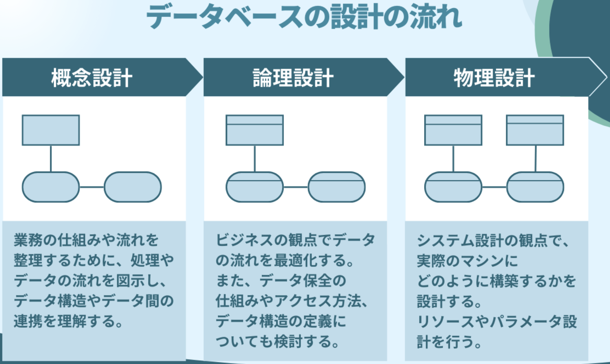
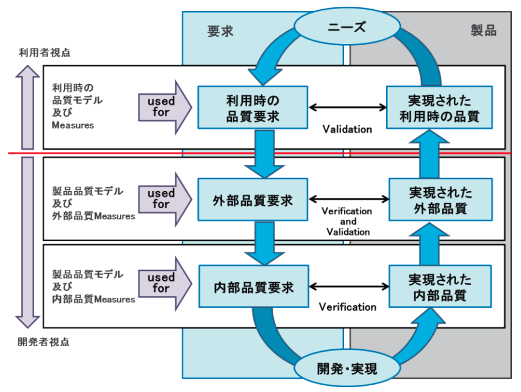
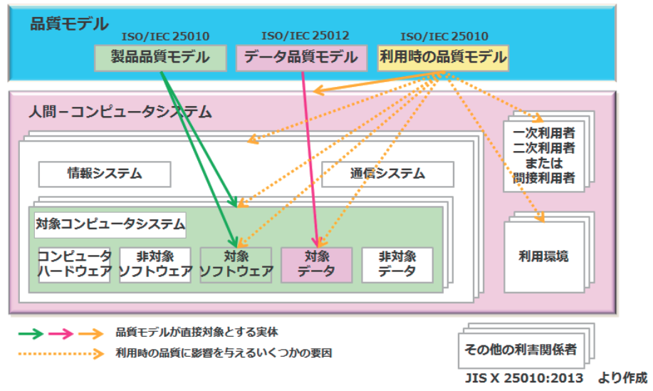
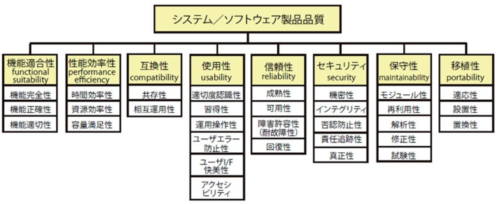
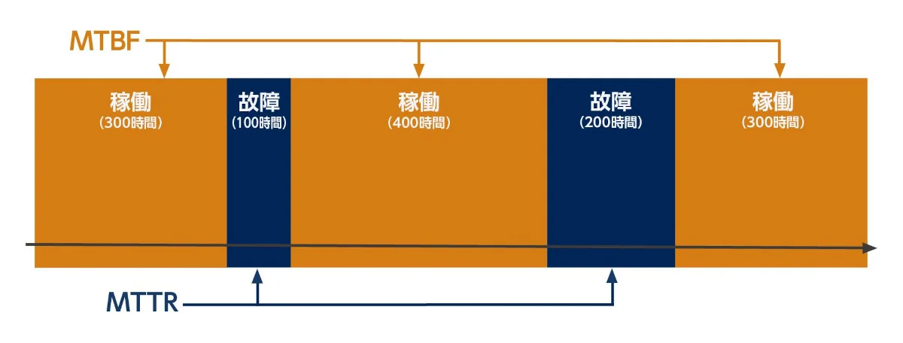
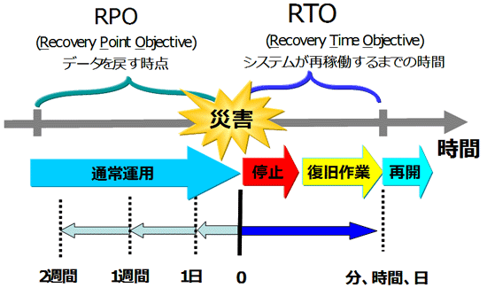
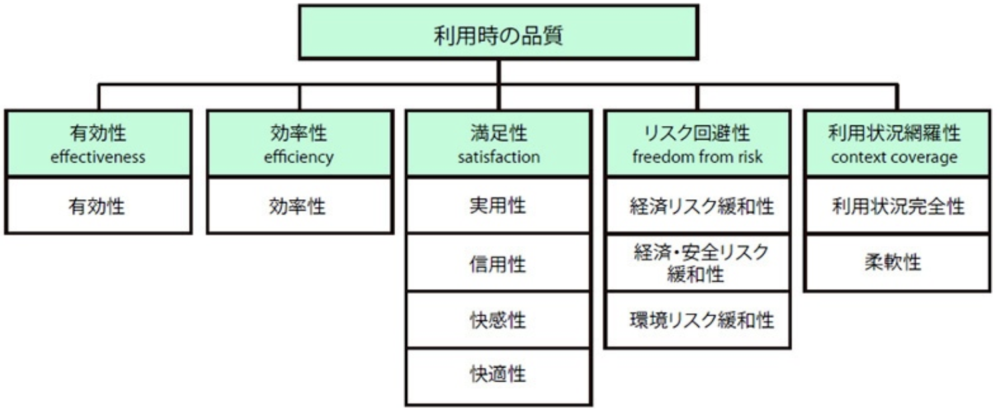

<style>
    body {
      counter-reset: chapter 6;
    }
    h1 {
        counter-reset: sub-chapter;
    }
    h2 {
        counter-reset: section;
    }

    h1::before {
        counter-increment: chapter;
        content: counter(chapter) "章 ";
    }
    h2::before {
        counter-increment: sub-chapter;
        content: counter(chapter) "-" counter(sub-chapter) " ";
    }
    h3::before {
        counter-increment: section;
        content: counter(chapter) "-" counter(sub-chapter) "-" counter(section) " ";
    }
</style>

# 論理設計・物理設計

## 論理設計

論理設計は、「DBとユーザ」や「DBとシステム」を結びつけるための設計を指し、概念データモデルを詳細か・具体化し、**正規化**を主な作業とする。論理設計はシステム開発において、外部設計(基本設計)で行われることが一般的であり、以下のような作業がある。

- 【**システム開発**】CRUD分析、決定表
- 【**コード設計**】テーブル設計、キー設計(主キー、外部キー)
- 【**移行設計**】DBの移行準備、システムの移行方式(単純移行、パイロット移行、並行運用移行)、バージョンアップ移行、マスタデータ統合

### 論理設計とは



#### インスタンス(データ)の設定

論理設計ではデータの取り扱いを考慮する必要があり、以下の3点に気をつける。

1. 値の取得元(**どのテーブルから取得するのか**)
2. 値が設定・更新されるタイミング(**いつ処理するのか**)
3. 連動して更新される列や表(**関連テーブルは何なのか**)

上記の注意点は「<font color=red><b>新規開発</b></font>」、「<font color=red><b>派生開発</b></font>」ともに考慮する必要があり、テーブルの新設計や新システム変更に伴うデータ移行などがある。

#### 制約条件

論理設計ではシステム特有の制約条件を考える必要がある。例えば、以下の例がある。

- ホテルの部屋が改修中でない場合のみ、宿泊予約を受け付ける。
- 工場内の在庫数が上限を超えている場合、商品の受注・納入を受け付けない。
- 車両の積載重量が所定の重量を超えている場合、輸送ルートを見直す。

### システム開発

#### システム開発環境

システム開発の環境は大きく3つに大別される。


- 【**開発環境**】<font color=red>開発者が新しい機能やバグ修正を行うための環境</font>。コードの変更が頻繁に行われる。
- 【**ステージング環境**】本番環境に展開する前に、<font color=red>本番環境と同じ条件下でソフトウェアをテストするための環境</font>。本番環境とほぼ同じハードウェア、ソフトウェア、データベースを使用する。
- 【**本番環境**】<font color=red>実際にユーザが使用する環境</font>。ソフトウェアの最終形態がここで動作する。

<div style="page-break-before:always"></div>

#### ソフトウェア品質

##### 【補足】品質ライフサイクルと品質モデル

ソフトウェア品質において品質ライフサイクルと品質モデルが重要であり、それぞれ下図に示す。
　品質ライフサイクルの図は「ステークホルダのニーズ」と「開発・実現された成果物」のギャップを「利用者」と「開発者」それぞれの視点で評価し、製品として提供した後、継続的に品質の強化・改善のフィードバックがされていることを表している。

<table>
  <tr>
    <th>品質ライフサイクル</th>
    <th>品質モデル</th>
  </tr>
  <tr>
    <td></td>
    <td></td>
  </tr>
</table>

- 【**引用元**】https://www.ipa.go.jp/archive/publish/qv6pgp0000000wkj-att/000055008.pdf

```plantuml
title 品質の分類
left to right direction

rectangle 品質 as quality
rectangle 利用時の品質 as used_quality
rectangle 製品品質 as product_quality
rectangle 外部品質 as ext_quality
rectangle 内部品質 as int_quality

quality -- used_quality
quality -- product_quality
product_quality -- ext_quality
product_quality -- int_quality

note top of used_quality
【**利用者視点**】製品の利用者に対する品質

【例】
作業効率の向上、使用時の満足度など
end note
note bottom of product_quality
【**開発者視点**】製品自体が備えている特徴

【例】
機能の豊富さ、操作のしやすさなど
end note
```

##### システム/ソフトウェア製品品質(JIS X 25010:2013)



1. 【**機能適合性**】明示的/暗黙的ニーズを満足させる機能(入力/表示/計算/動作)を提供する度合い。他システムと連携する場合の機能適合性を幅広く検討したい場合や機能要求や仕様が抽象的・複雑・膨大な場合に求められる項目である。
   - **機能完全性**: 利用者の満足に足る機能が十分に網羅されているかどうか評価する

   $$
   \begin{align*}
   機能実装率=\frac{実装された機能件数}{要求事項の機能件数}
   \end{align*}
   $$
   - **機能正確性**: 計算の精度や誤差、端数処理、システム間のデータ受け渡しの正確性などを評価する

   $$
   \begin{align*}
   機能正確性=\frac{正しく実現されている機能件数}{機能要求の機能件数}
   \end{align*}
   $$
   - **機能適切性**: 機能の組合せが不必要に複雑にならず、「業務を適切に促進できること」を評価する

   $$
   \begin{align*}
   機能仕様安定率=1-\frac{ライフサイクル中に改定された機能件数}{機能要求と利用者マニュアル内の機能件数}
   \end{align*}
   $$

2. 【**性能効率性**】リソース量に関係する性能の度合い。処理時間や応答時間、メモリ量やディスク容量や通信量などを評価項目としており、「人の稼働量」は利用時の品質の評価項目となる。
   - **時間効率性**: 応答速度、処理完了時間、単位時間の処理件数などを評価する

   $$
   \begin{align*}
   ターンアラウンド充足率=\frac{ジョブ完了時刻-ジョブ開始時刻}{目標ターンアラウンド時間}
   \end{align*}
   $$
   - **資源効率性**: CPU使用率、メモリ量、ディスク容量、通信量、外部資源(プリンタやモータなど)の占有率を評価する

   $$
   \begin{align*}
   CPU/メモリ/ディスク/通信/外部資源の使用効率を測定
   \end{align*}
   $$
   - **容量満足性**: データ量・処理速度・同時アクセス数などを評価する

   $$
   \begin{align*}
   オンラインリクエスト処理率=\frac{処理されたリクエスト件数}{運用時間\times 最大処理容量}
   \end{align*}
   $$

3. 【**互換性**】他の製品やシステムなどと情報交換できる度合い。相互に独立して動くべき場合に相互に相手方の動作障害にならず、適切かつ円滑に情報交換が行われているかどうかを評価する。<u>利用時の品質である「利用状況網羅性」を支える品質の一つ</u>である。
   - **共存性**: 部品やライブラリのバージョンごとの動作両立性を評価する

   $$
   \begin{align*}
   利用可能な共存=\frac{共存可能なソフトウェア件数}{運用環境で共存を求められるソフトウェア件数}
   \end{align*}
   $$  
   - **相互運用性**: データ形式の規格やバージョン対応範囲を評価する

   $$
   \begin{align*}
   データ交換率=\frac{情報交換可能なファイルフォーマット数}{情報交換したいファイルフォーマット数}
   \end{align*}
   $$  

4. 【**使用性**】明示された利用状況で目標を達成するために利用できる度合い。<u>カバー範囲が広く、6つの副特性によって具体的に定められている品質特性</u>であり、利用者マニュアルや保守マニュアルの使い勝手も含まれる。
   - **適切度認識性**: 利用者のニーズに合致している度合いを評価する。無償提供(トライアル)版の製品の良し悪しを判断できる指標。

   $$
   \begin{align*}
   デモ表示装備率&=\frac{デモ表示能力がある機能数}{製品記述のある全機能件数}\\[4mm]
   起動直後の主たる表示項目表示率&=\frac{起動直後の主たる表示項目数}{起動直後の画面内のメニュー項目数}
   \end{align*}
   $$
   - **習得性**: 特別な学習や多くの時間を使わずに利用できるかを評価する。例えば、重要かつ利用頻度の高い機能はユースケースを想定した説明書が有効。

   $$
   \begin{align*}
   利用マニュアル・ヘルプ完全率=\frac{マニュアル・ヘルプで適切に説明されている機能件数}{実装・文書化の必要がある機能件数}
   \end{align*}
   $$
   - **運用操作性**: 画面の操作や表示の一貫性を評価する。例えば、不要な画面がないことや間接操作(クリックやボタン押下など)が最小限の設計であることなどを評価する。

   $$
   \begin{align*}
   操作遷移(戻る動作)の滑らかさ&=\frac{戻る動作が適切に設計されている数}{戻る操作の全数}\\[4mm]
   画面操作のしやすさ&=1-\frac{間接操作のための画面遷移数}{タスク遂行のための全画面遷移数}
   \end{align*}
   $$
   - **ユーザエラー防止性**: 利用者の入力ミスを軽減・解消できる程度を評価する。例えば、一時保存による再入力が不要な配慮や不正な入力を拒否する機能、ユーザの入力値が適切かどうかわかる画面設計などを評価する。

   $$
   \begin{align*}
   ユーザエラー検査率=\frac{入力エラーが識別され明確に修正される入力項目数}{エラー検出可能な入力項目数}
   \end{align*}
   $$
   <div style="page-break-before:always"></div>

   - **ユーザI/F快美性**: 色・フォント・不要コンテンツの有無を含む、UIの見栄えや対話のリズム感を評価する。<font color=red>快美性は受け取り手の好みに依存するため、対象ユーザの範囲を明確する必要がある</font>。

   $$
   \begin{align*}
   ユーザI/F要素のカスタマイズ可能率=\frac{カスタマイズ可能要素数}{ユーザI/F要素総数}
   \end{align*}
   $$
   - **アクセシビリティ**: 多様な言語や流行語、略語、表示速度、読みやすさを評価する。

   $$
   \begin{align*}
   視聴覚障害者のアクセシビリティ=\frac{視聴覚障害のある利用者が利用可能な機能数}{実装されている総機能件数}
   \end{align*}
   $$
5. 【**信頼性**】明示された時間帯・条件において機能を実行する度合い。システム停止や誤作動からの復帰、データ回復などを含む。
   - **成熟性**: システムが十分にテストされ、実運用で使い込まれ、どの程度長く正常に稼働しているかを評価する。例として、バグの収束度合いや運用後の正常稼働の程度を評価する。

   $$
   \begin{align*}
   欠陥修正率&=\frac{修正が完了した欠陥数}{指摘(発見)された信頼性に関する欠陥総数}\\[4mm]
   平均故障間隔(MTBF)&=\frac{総稼働時間}{システム/ソフトウェア故障発生件数}
   \end{align*}
   $$
   - **可用性**: システムの利用可能状態の時間割合を評価する。可用性のレベルを設定し、縮退運転の機能を持たせ、可用性の寄与率を評価する場合に計測する項目になる。

   $$
   \begin{align*}
   稼働率=\frac{実際に稼働した総時間}{運用スケジュールで規定された稼働時間}
   \end{align*}
   $$
   - **障害許容性、回復性**: 運用困難時の対応が有効かつ迅速であるかを評価する。
     - **障害許容性**: レベルごと(ユーザレベル、アプリレベル、ミドルウェアレベルなど)の意図しない誤作動を検出し、利用者へ内容を表示できる度合いを表す。
     - **回復性**: サービスが実際に回復するまでの時間等に着目し、「システム回復」や「保守のあり方」とも関係する項目。回復時間目標値$RTO(Recovery\hspace{1mm}Time\hspace{1mm}Objective)$とともに評価する。

   $$
   \begin{align*}
   平均回復時間(MTTR)=\frac{回復に要した時間}{回復が必要となった件数}
   \end{align*}
   $$

<table>
   <tr>
      <th>MTBF(成熟性)とMTTR(回復性)</th>
      <th>回復時間目標値RTOについて(回復性)</th>
   </tr>
   <tr>
      <td></td>
      <td></td>
   </tr>
</table>

<div style="page-break-before:always"></div>

6. 【**セキュリティ**】システムやデータを保護する度合い。
   - **機密性、インテグリティ**: システムの機密保護やデータ保護の観点からどの程度アクセス制御を実施しているかの度合いを評価する。
     - **機密性**: アクセス権限の逸脱がないように管理する品質上の能力を定めている。暗号化・複合の仕組みやバックアップデータの保護などが挙げられる。
     - **インテグリティ**: 攻撃防止の度合いであり、情報の全般的な生合成や破壊を免れている程度を表す。アクセスログの管理やバッファオーバーフローの防止措置なども含まれる。

   $$
   \begin{align*}
   &暗号アルゴリズムの強さ=1-\frac{リスクが顕在化しているアルゴリズム数}{使用されている暗号アルゴリズム総数}\\[4mm]
   &データインテグリティ適合性=1-\frac{データが実際に損傷したアクセス件数}{データ損傷を防止すべきアクセス総数}
   \end{align*}
   $$
   - **否認防止性**: 情報が偽って否認されないように作られているかの度合い。ログによるメッセージの記録やログイン記録を管理者の電子署名で保護し、否認防止する方法がある。

   $$
   \begin{align*}
   電子署名利用率=\frac{電子署名処理のイベント件数}{否認防止を要するイベント件数}
   \end{align*}
   $$
   - **責任追跡性**: 実体の行為がその実体に一意的に追跡可能である度合いであり、インシデント発生時の原因特定と品質上の問題抽出を行い再発防止先を行える程度を表す。システム内のリソースへのアクセスをすべて記録したい場合がある(いつ、誰が、何に、どうアクセスしたのか)。<font color=red>具体的には「ログインと主要な外部記憶・周辺機器・ネットワークアクセス、DBアクセスはすべて記録し、そのログをRAIDディスクを経由してクラウド上に永久保存する」というユースケースなどがある</font>。

   $$
   \begin{align*}
   アクセス監視性=\frac{システムログに記録されているアクセス数}{実際に発生しているアクセス数}
   \end{align*}
   $$
   - **真正性**: 主体または資源の同一性を証明できる度合い。セッション乗っ取りの防止やパスワードの機密性管理、電子署名による真正の保証などがある。

   $$
   \begin{align*}
   真正性手順適合性=\frac{正しく実現されている真正性確認手順件数}{仕様中で真正性確認手順が必要な件数}
   \end{align*}
   $$

7. 【**保守性**】意図した保守作業者によって修正できる有効性及び効率性の度合い。<font color=red>ソースコードの修正しやすさ</font>や<font color=red>構造の解析しやすさ</font>、<font color=red>機能追加のしやすさ</font>に加え、<font color=red>マニュアルやドキュメント</font>も含まれる。
   - **モジュール性**: 一つの構成要素の変更による他の構成要素の影響を最小化するように構成されている度合いであり、<u>オブジェクト指向においては凝集性や結合性からモジュール性を評価する</u>。

   $$
   \begin{align*}
   システム複雑度&=\frac{基準以上のサイクロマチック複雑度を持つモジュール数}{製品中のソフトウェアのモジュール総数}\\[4mm]
   構成要素結合度適合性&=\frac{変更の他への波及が基準以下の構成要素数}{独立性が要求される構成要素数}
   \end{align*}
   $$

<div style="page-break-before:always"></div>

   - **再利用性**: 汎用に作ったシステムの構成要素が多様な状況でも利用できる度合い。

   $$
   \begin{align*}
   資産再利用性=\frac{再利用可能なように設計/実装されている資産数}{システム中の総資産数}
   \end{align*}
   $$  
   - **解析性、修正性**: システムの変更や障害対応時、変更の影響範囲や障害原因を解析し、修正できる度合い。具体例として、コーディング規約や自己診断機能の実装が挙げられる。
     - **解析性(≠修正容易性)**: 動作時の不具合などに対する原因理解が容易にできる特性。<u>「モジュール性」と関連があり、モジュール性が高度であれば修正箇所は1箇所または狭い範囲で済むが、モジュール性が低い場合は修正箇所が広く波及してしまい、修正箇所の特定が困難になる</u>。
     - **修正性**: 修正実施においてデグレードが生じないで迅速・的確に修正できる特性。

   $$
   \begin{align*}
   診断機能有効性=\frac{原因分析に有効な診断機能数}{実装されている診断機能数}
   \end{align*}
   $$  
   - **試験性**: ある機能やシステムの構成要素の試験基準があり、その基準に基づいて的確に試験できる有効性及び効率性の度合い。試験可能性や試験容易性を評価し、支援機能(モニタリングやプロファイリング機能など)の充実度や検証担当者のテスト時の作業工数を測定する。

   $$
   \begin{align*}
   自立試験可能性=\frac{依存していてもスタブ等で実施できる試験数}{他システムに依存している試験項目数}
   \end{align*}
   $$  

8. 【**移植性**】別環境へ移してもそのまま動作する度合い。<u>「再利用性」</u>とも関係するが異なる環境への移行作業や新規導入作業に焦点を当てており、移植可能性や移植容易性を評価する。
   - **適応性、設置性**: 利用環境の変化に対応して、システムを移動させたり、インストールさせたりするのがどの程度容易にできるかの度合い。
     - **適応性**: 異なる動作環境に対して、製品またはシステムが適応できる有効性及び効率性の度合い。
     - **設置性**: 動作環境において、思い通りにインストール/アンインストールできる度合い。<u>考えうるエラー操作等に対して柔軟に対応できるかどうかも含む</u>。

   $$
   \begin{align*}
   インストール時間効率性=\frac{1}{N}\sum_{i=1}^{N}\frac{i番目のインストールの実際の時間}{i番目のインストールの期待時間}
   \end{align*}
   $$
   - **置換性**: 同じ稼働環境において、ある製品が同じ目的で別のバージョンや別の製品と容易に置き換えることができる度合い。他社の類似製品と交換する場合に必要な項目。

   $$
   \begin{align*}
   データの再利用性/インポート能力=\frac{従来同様の引続き使える件数}{旧ソフトウェア中データで引続き使われる件数}
   \end{align*}
   $$

<div style="page-break-before:always"></div>

##### 利用時の品質



1. 【**有効性**】明示された目標を達成する上での正確さ及び完全さの度合い。システムの導入や投資の効果を業務品質から評価したい場合の項目であり、制限事項や前提条件がある場合はその旨を明示する。
   - **有効性**: 新パージョンから旧バージョンのエラーや改善の度合いを比較し、改善の程度を明示する。

   $$
   \begin{align*}
   業務完了率=\frac{完了した業務項目数}{着手した業務項目数}
   \end{align*}
   $$

2. 【**効率性**】利用者が特定の目標を達成するための正確さ及び完全さに関連して使用したリソース(時間・人)の度合い。業務拡張やシステム結合の際に同時並行処理や同時アクセス可能な端末数などを計測する。
   - **効率性**: 熟練者と一般利用者の操作時間から$NE比$(一般利用者の操作時間を熟練者の操作時間で割った値)を計算する。<font color=red>有効性は項目数を変数とするが、効率性は作業時間を変数とする。</font>

   $$
   \begin{align*}
   利用効率=\frac{達成した業務目標数}{業務に要した時間}
   \end{align*}
   $$

3. 【**満足性**】製品またはシステムが明示された利用状況において使用されるとき、利用者ニーズが満足される度合い。(専門的な)アンケート調査により、<u>製品品質の「使用性」や、利用時の品質の「有効性」や「効率性」、「リスク回避性」などの他の品質特性の改善にも貢献する重要な特性である</u>。
   - **実用性**: 利用者が行いたいことが達成され、満足できる度合い。<font color=red>利用に際して見出されるシステム不安定等の不具合は、利用時の品質「満足性」の副特性「信用性」で扱う</font>。

   $$
   \begin{align*}
   選択利用率=\frac{特定の機能やシステムの利用回数}{評価対象全体の利用回数}
   \end{align*}
   $$
   - **信用性**: 利用者が意図した通りにシステムが動作するという確信の度合い。計測例として計量心理学的測定量があるが、これは5段階尺度等を用いたアンケートの結果に関して心理学的な観点からの歪み等を考慮しつつ数値的に取り扱う手法に基づいた測定量の総称である。

   $$
   \begin{align*}
   計量心理学的信用性=信用性に関する計量心理学的測定量
   \end{align*}
   $$
   - **快感性、快適性**: ユーザI/F快美性と関係のある品質であり、利用者の主観的な受け取り方に着目した評価項目である。計測量の例として計量心理学的快感があるが、これはSUS(the System Usability Scale)を用いて0〜100の間でスコア算出した値である。
     - **快感性**: 使って嬉しかったというシステムに対する好感の度合い。
     - **快適性**: 操作感のスムーズ性や素早いシステム動作の快適さ。マニュアルレスで使えるような直感的なシステムを目指す場合の評価項目。

   $$
   \begin{align*}
   計量心理学的快感/快適性=快感/快適性に関する計量心理学的測定量
   \end{align*}
   $$

4. 【**リスク回避性**】経済状況や人間の生活、環境に対する潜在的なリスクを緩和する度合い。<font color=red>ハードウェア(自動車や医療機器、航空管制機器など)の誤作動や個人情報(ECサイトや公共システム)のデータチェックや修正不備によるデータ不整合に伴って発生するリスクやインシデントを評価したい場合に計測する項目</font>であり、<u>製品品質の「機能適合性」や「互換性」、「使用性」などと合わせて評価することがある</u>。
   - **経済リスク緩和性**: 意図した利用状況において、資源に対する潜在的なリスクを緩和する度合い。**大前提**、個々の品質特性に対する経済的影響の評価は難しく、事例経験に頼る場合も多くある。

   $$
   \begin{align*}
   経済影響エラー率&=\frac{経済影響エラー発生件数}{システム利用状況数}
   \\[4mm]
   仕様外シナリオ想定度&=使用外のリスクシナリオを考慮している件数
   \end{align*}
   $$

   - **健康・安全リスク緩和性、環境リスク緩和性**: 「健康・安全リスク緩和性」は製品またはシステムが人々に対する潜在的なリスクを緩和する度合いを表し、データチェックの不備やシステムの誤表示だけでなく、眼精疲労や腰痛なども対象とする。一方、「環境リスク緩和性」は環境に対する潜在的なリスクを製品またはシステムが軽減する度合いを表、排気ガスや化学薬品などを取り扱う製品について考慮が必要な項目である。

   $$
   \begin{align*}
   システム利用で影響を受ける対人安全性=\frac{ハザードに晒される人数}{全利用人数}
   \end{align*}
   $$

5. 【**利用状況網羅性**】<u>「有効性」「効率性」「リスク回避性」及び「満足性」</u>に伴って製品やシステムが使用できる度合い。動作環境のOSや画面サイズ、メモリ量などの対応可能条件の広さや柔軟性を評価する項目であり、ゲームコンフィグなどの利用者ごとのカスタマイズ機能も考慮対象になる可能性がある。<u>製品品質の「アクセサビリティ」とも関連する</u>。
   - **利用状況完全性**: 開発者が予め想定している範囲と実際の範囲の差分を評価する測定量。

   $$
   \begin{align*}
   利用状況完全性=\frac{適切な使用性とリスク水準が維持可能な利用状況数}{要求にあるすべての利用状況数}
   \end{align*}
   $$

   - **柔軟性**: 予め意図しなかった状況でも対応可能な程度であり、<font color=red>高度な柔軟性は利用者の創造性を刺激することもある</font>。企業向けのシステム開発で要求事項が増えていくことが予想されるときの測定量。

   $$
   \begin{align*}
   製品柔軟性=\frac{追加要求に対して既存機能で対応可能な件数}{追加要求の総件数}
   \end{align*}
   $$

##### 製品品質と利用時の品質の関係

```plantuml
title 製品品質と利用時の品質の関係
left to right direction

rectangle 製品品質 {
  rectangle 機能適合性 as functional_suitability
  rectangle 性能効率性 as performance_efficiency
  rectangle 互換性 as compatibility
  rectangle 使用性 as usability
  rectangle 信頼性 as reliability
  rectangle セキュリティ as security
  rectangle 保守性 as maintainability
  rectangle 移植性 as portability

  performance_efficiency -[hidden] functional_suitability
  compatibility -[hidden] performance_efficiency
  usability -[hidden] compatibility
  reliability -[hidden] usability
  security -[hidden] reliability
  maintainability -[hidden] security
  portability -[hidden] maintainability
}
rectangle 利用時の品質品質 {
   rectangle 有効性 as effectiveness
   rectangle 効率性 as efficiency
   rectangle 満足性 as satisfaction
   rectangle リスク回避性 as freedom_from_risk
   rectangle 利用状況網羅性 as context_coverage

   efficiency -[hidden] effectiveness
   satisfaction -[hidden] efficiency
   freedom_from_risk -[hidden] satisfaction
   context_coverage -[hidden] freedom_from_risk
}

note right of efficiency
利用時の品質「効率性」のニーズが
あるならば、製品品質「性能効率性」と
「使用性」のそれぞれの観点から
要求事項を定義することになることを表す。
end note

functional_suitability -- effectiveness
performance_efficiency -- efficiency
compatibility -- context_coverage
usability -- efficiency
usability -- satisfaction
reliability -- freedom_from_risk
security -- freedom_from_risk
maintainability -- context_coverage
portability -- context_coverage
```

<div style="page-break-before:always"></div>

### 移行設計

#### DBの移行準備

DBを移行するためには新システムの稼働環境を用意し、以下の作業を行うことで導入・移行を行う。

1. 【**何を**】資産の引き継ぎ
2. 【**どこに**】稼働環境の準備
3. 【**どの手順で実施するのか**】実施計画の作成
4. 【**実現可否の確認**】導入時の運用テスト

#### システムの移行方式

システムの移行方式は以下のようにいくつか方法があるが、<font color=red>問題発生時に元の状態に戻せることが重要になる</font>。

- 全システムを一度に移行する**単純移行方式**
- 特定の一部(パイロットシステム)だけを専攻して移行する**パイロット移行方式**
- 新旧環境で並行運用を行う**並行運用移行方式**

#### バージョンアップによる移行

システムやDBのバージョンアップなどに伴ってデータ移行がある場合、新バージョンでシステムが正常稼働するかどうか、テスト環境などで予め確かめておく必要がある。

#### 性能の測定シナリオ

移行したDBの負荷などを測定する場合は事前に負荷テストを行なっておく必要がある。この時、<font color=red>性能の測定シナリオとして、本番環境を意識したデータを考え、用意しておく</font>。

#### マスタデータの統合

複数のDBを統合するとき、そのマスタデータの統合を考える必要がある。考慮事項としては以下の通り。


- <font color=red>列(カラム)のデータ型</font>
- <font color=red>コード設計(主キーや外部キー)</font>

- 例外データの有無を含む不具合の洗い出し


<div style="page-break-before:always"></div>

## 物理設計

### データベースの実装


### 信頼性設計

#### 信頼性設計


#### システムの冗長化


#### RAID


### 性能設計

#### パフォーマンスチューニングの手法


### 運用・保守設計

#### 運用・保守設計における考慮


#### スケジュール設計


#### BCP(事業継続計画)


