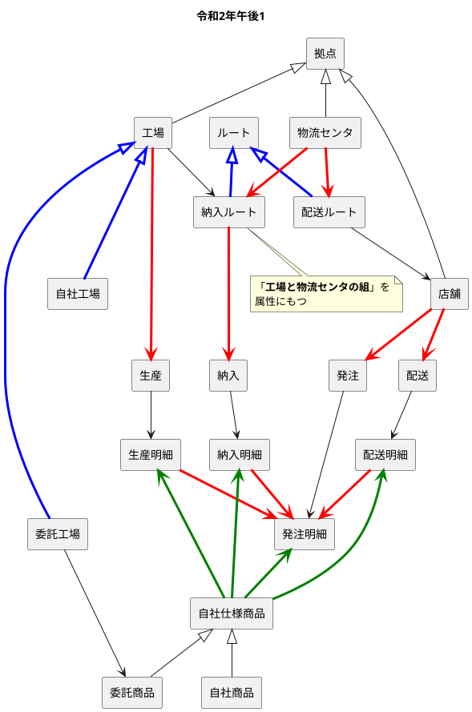
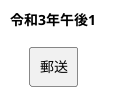
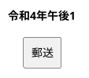

```plantuml
@startuml
title 令和2年午後1

rectangle 拠点 as base
rectangle 物流センタ as logistics_center
rectangle 工場 as factory
rectangle 委託工場 as contract_factory
rectangle 自社工場 as own_factory
rectangle 店舗 as store

rectangle ルート as route
rectangle 配送ルート as delivery_route
rectangle 納入ルート as shipping_route

rectangle 自社仕様商品 as product
rectangle 委託商品 as contract_product
rectangle 自社商品 as in_house_product

rectangle 発注 as order
rectangle 生産 as production
rectangle 配送 as delivery
rectangle 納入 as shipping
rectangle 発注明細 as order_detail
rectangle 生産明細 as production_detail
rectangle 配送明細 as delivery_detail
rectangle 納入明細 as shipping_detail
note bottom of shipping_route
「**工場と物流センタの組**」を
属性にもつ
end note

' 親子関係
base <|-- logistics_center
base <|- factory
base <|-- store
factory <|-[#blue,thickness=3]- contract_factory
factory <|-[#blue,thickness=3]-- own_factory
route <|-[#blue,thickness=3]- delivery_route
route <|-[#blue,thickness=3]- shipping_route
product <|-- contract_product
product <|-- in_house_product

' カーディナリティ
logistics_center -[#red,thickness=3]-> shipping_route
logistics_center -[#red,thickness=3]-> delivery_route
factory --> shipping_route
factory -[#red,thickness=3]---> production
delivery_route --> store
order ---> order_detail
production --> production_detail
delivery --> delivery_detail
shipping --> shipping_detail
shipping_route -[#red,thickness=3]--> shipping
store -[#red,thickness=3]-> delivery
store -[#red,thickness=3]-> order
contract_factory --> contract_product
production_detail -[#red,thickness=3]-> order_detail
delivery_detail -[#red,thickness=3]-> order_detail
shipping_detail -[#red,thickness=3]-> order_detail
order_detail <-[#green,thickness=3]- product
production_detail <-[#green,thickness=3]- product
delivery_detail <-[#green,thickness=3]- product
shipping_detail <-[#green,thickness=3]- product

' 位置調整用
shipping_route -[hidden] delivery_route
factory -[hidden] logistics_center
logistics_center -[hidden]- store
@enduml
```

```plantuml
@startuml
title 令和3年午後1

rectangle 郵送
@enduml
```

```plantuml
@startuml
title 令和4年午後1

rectangle 郵送
@enduml
```

```plantuml
@startuml
title 令和5年午後1

rectangle 郵送
@enduml
```
