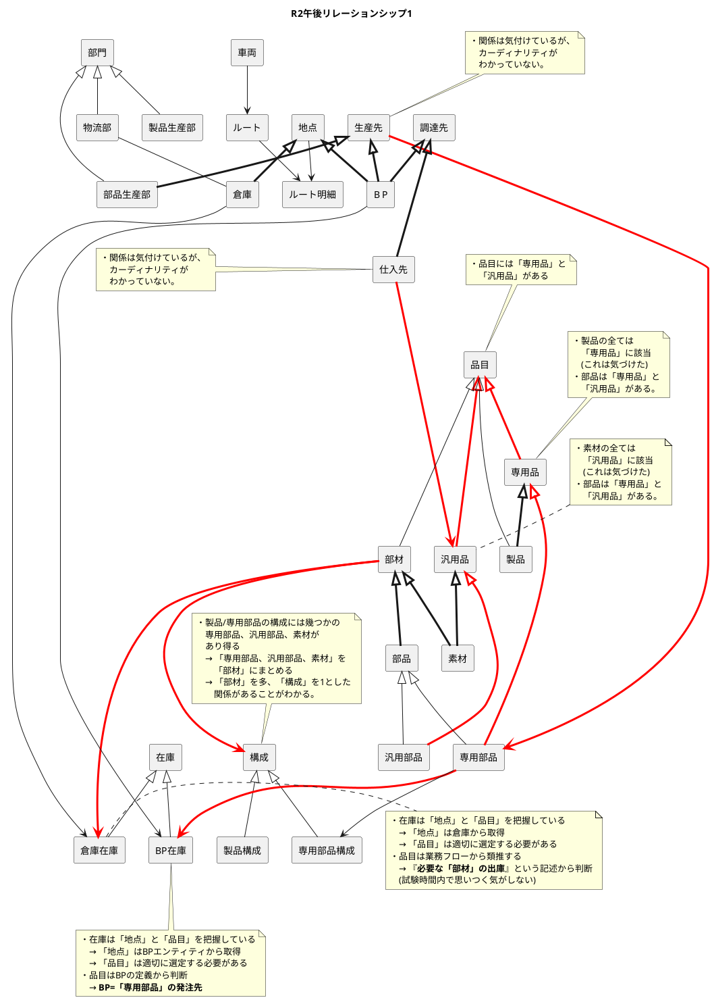
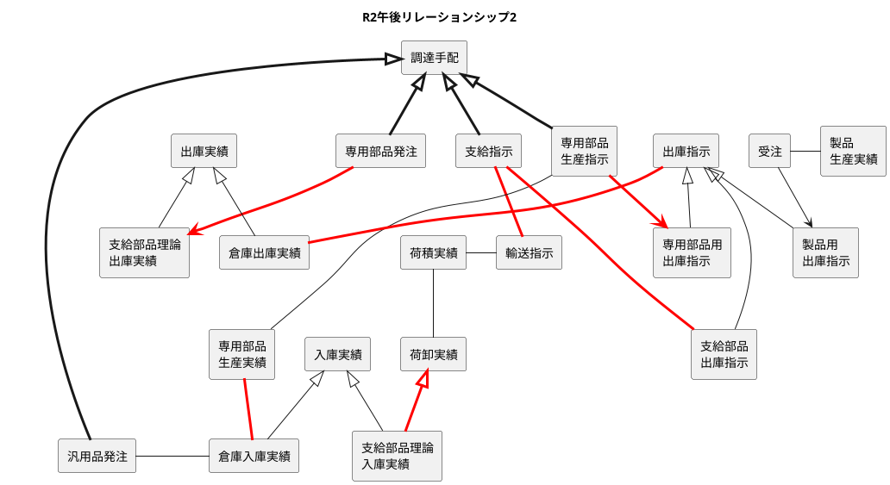
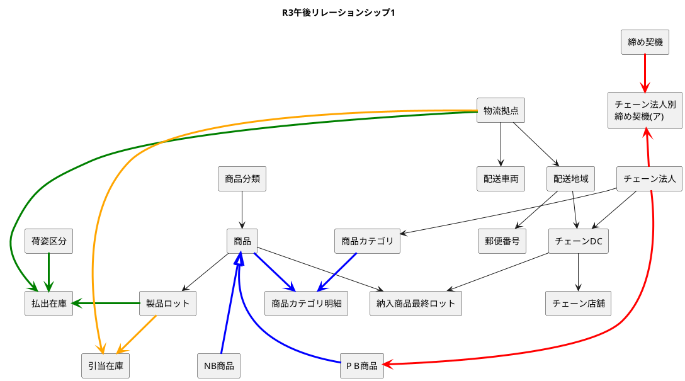
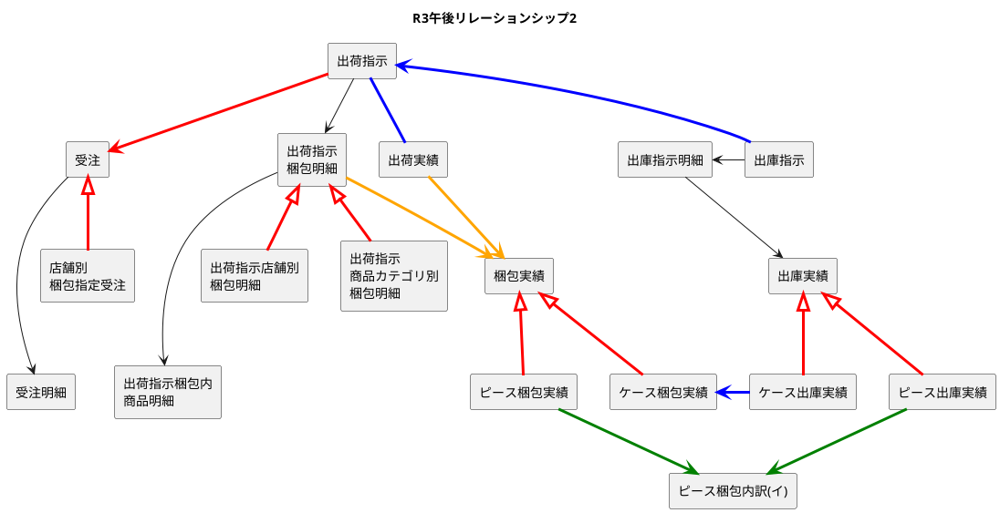
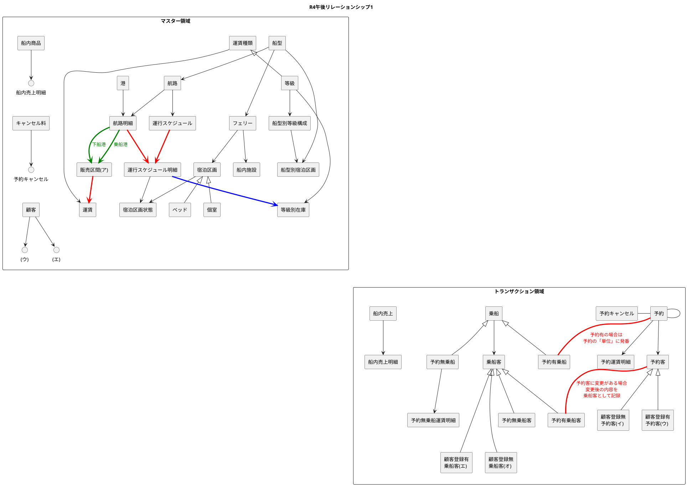
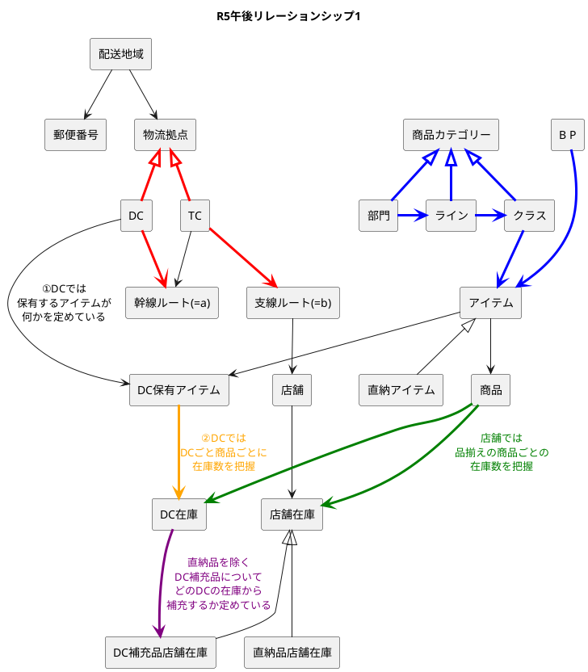
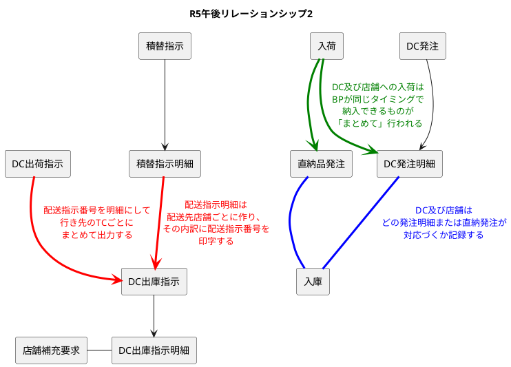

```plantuml
@startuml
title R2午後リレーションシップ1
together {
    rectangle "部門" as department
    rectangle "物流部" as logistics_department
    rectangle "製品生産部" as product_production_department
    rectangle "部品生産部" as component_production_department
}
together {
    rectangle "車両" as vehicle
    rectangle "ルート" as route
    rectangle "ルート明細" as route_detail
    rectangle "生産先" as production_department
    rectangle "仕入先" as supplier
    rectangle "調達先" as procurement
    rectangle "地点" as location
    rectangle "倉庫" as warehouse
    rectangle "B P" as bp
}
together {
    rectangle "在庫" as stock
    rectangle "倉庫在庫" as warehouse_stock
    rectangle "BP在庫" as bp_stock
    rectangle "構成" as structure
    rectangle "製品構成" as product_structure
    rectangle "専用部品構成" as special_component_structure
}
together {
    rectangle "品目" as item
    rectangle "汎用品" as general_purpose_item
    rectangle "専用品" as special_purpose_item
    rectangle "製品" as product
    rectangle "部材" as material
    rectangle "部品" as component
    rectangle "素材" as raw_material
    rectangle "専用部品" as special_component
    rectangle "汎用部品" as general_component
}

supplier -[#red,thickness=3]---> general_purpose_item
production_department -[#red,thickness=3]-> special_component

item <|-[#red,thickness=3]- general_purpose_item
item <|-[#red,thickness=3]- special_purpose_item
general_purpose_item <|-[thickness=3]- raw_material
general_purpose_item <|-[#red,thickness=3]- general_component
special_purpose_item <|-[thickness=3]- product
special_purpose_item <|-[#red,thickness=3]- special_component
item <|--- product
item <|--- material
material <|-[thickness=3]- raw_material
material <|-[thickness=3]- component
component <|-- general_component
component <|-- special_component

structure <|-- product_structure
structure <|-- special_component_structure

special_component -[#red,thickness=3]-> bp_stock
special_component --> special_component_structure
material -[#red,thickness=3]-> structure
material -[#red,thickness=3]-> warehouse_stock

vehicle --> route
route --> route_detail
location --> route_detail
location <|-[thickness=3]- warehouse
location <|-[thickness=3]- bp
logistics_department -- warehouse
department <|-- logistics_department
department <|-- product_production_department
department <|--- component_production_department
production_department <|-[thickness=3]- bp
production_department <|-[thickness=3]- component_production_department
procurement <|-[thickness=3]- bp
procurement <|-[thickness=3]-- supplier

bp --> bp_stock
warehouse --> warehouse_stock
stock <|-- bp_stock
stock <|-- warehouse_stock

note top of production_department
・関係は気付けているが、
　カーディナリティが
　わかっていない。
end note
note left of supplier
・関係は気付けているが、
　カーディナリティが
　わかっていない。
end note
note top of item
・品目には「専用品」と
　「汎用品」がある
end note
note top of general_purpose_item
・素材の全ては
　「汎用品」に該当
　(これは気づけた)
・部品は「専用品」と
　「汎用品」がある。
end note
note top of special_purpose_item
・製品の全ては
　「専用品」に該当
　(これは気づけた)
・部品は「専用品」と
　「汎用品」がある。
end note
note top of structure
・製品/専用部品の構成には幾つかの
　専用部品、汎用部品、素材が
　あり得る
　→ 「専用部品、汎用部品、素材」を
　　「部材」にまとめる
　→ 「部材」を多、「構成」を1とした
　　関係があることがわかる。
end note
note right of warehouse_stock
・在庫は「地点」と「品目」を把握している
　→ 「地点」は倉庫から取得
　→ 「品目」は適切に選定する必要がある
・品目は業務フローから類推する
　→ 『**必要な「部材」の出庫**』という記述から判断
　(試験時間内で思いつく気がしない)
end note
note bottom of bp_stock
・在庫は「地点」と「品目」を把握している
　→ 「地点」はBPエンティティから取得
　→ 「品目」は適切に選定する必要がある
・品目はBPの定義から判断
　→ **BP=「専用部品」の発注先**
end note
@enduml
```

```plantuml
@startuml
title R2午後リレーションシップ2

together {
    rectangle "専用部品\n生産実績" as special_component_production_record
    rectangle "荷卸実績" as unloading_record
    rectangle "入庫実績" as receiving_record
    rectangle "倉庫入庫実績" as warehouse_receiving_record
    rectangle "支給部品理論\n入庫実績" as supplied_component_theoretical_receiving_record
}
together {
    rectangle "調達手配" as procurement_arrangement
    rectangle "支給指示" as supply_instruction
    rectangle "専用部品発注" as special_component_order
    rectangle "専用部品\n生産指示" as special_component_production_instruction    
}
together {
    rectangle "受注" as order_receipt
    rectangle "製品\n生産実績" as product_production_record
    rectangle "出庫指示" as shipment_instruction
    rectangle "製品用\n出庫指示" as product_shipment_instruction
    rectangle "専用部品用\n出庫指示" as special_component_shipment_instruction
    rectangle "支給部品\n出庫指示" as supplied_component_shipment_instruction    
}
together {
    rectangle "出庫実績" as shipment_record
    rectangle "倉庫出庫実績" as warehouse_shipment_record
    rectangle "支給部品理論\n出庫実績" as supplied_component_theoretical_shipment_record
}

rectangle "汎用品発注" as general_item_order
rectangle "輸送指示" as transport_instruction
rectangle "荷積実績" as loading_record

special_component_order -[#red,thickness=3]-> supplied_component_theoretical_shipment_record

order_receipt - product_production_record
order_receipt --> product_shipment_instruction

shipment_instruction <|-- product_shipment_instruction
shipment_instruction <|-- special_component_shipment_instruction
shipment_instruction <|--- supplied_component_shipment_instruction

procurement_arrangement <|-[thickness=3]- supply_instruction
procurement_arrangement <|-[thickness=3]- special_component_order
procurement_arrangement <|-[thickness=3]- special_component_production_instruction
procurement_arrangement <|-[thickness=3]- general_item_order
warehouse_receiving_record - general_item_order

unloading_record <|-[#red,thickness=3]- supplied_component_theoretical_receiving_record
special_component_production_record -[#red,thickness=3]- warehouse_receiving_record
receiving_record <|-- supplied_component_theoretical_receiving_record
receiving_record <|-- warehouse_receiving_record

shipment_record <|-- warehouse_shipment_record
shipment_record <|-- supplied_component_theoretical_shipment_record

special_component_production_instruction -[#red,thickness=3]-> special_component_shipment_instruction

supply_instruction -[#red,thickness=3]- transport_instruction
transport_instruction - loading_record
loading_record -- unloading_record

special_component_production_instruction - special_component_production_record
supply_instruction -[#red,thickness=3]- supplied_component_shipment_instruction

shipment_instruction -[#red,thickness=3] warehouse_shipment_record

@enduml
```

```plantuml
@startuml
title R3午後リレーションシップ1

together {
    rectangle "物流拠点" as logistics_base
    rectangle "配送地域" as delivery_area
    rectangle "配送車両" as delivery_vehicle
    rectangle "郵便番号" as postal_code
    rectangle "チェーン法人" as chain_corporation
    rectangle "チェーンDC" as chain_dc
    rectangle "チェーン店舗" as chain_store
    rectangle "締め契機" as closing_trigger
    rectangle "チェーン法人別\n締め契機(ア)" as closing_trigger_by_chain_corporation    
}
together {
    rectangle "納入商品最終ロット" as delivered_product_final_lot
    rectangle "商品カテゴリ" as product_category
    rectangle "商品カテゴリ明細" as product_category_detail
    rectangle "商品分類" as product_classification
    rectangle "商品" as product    
    rectangle "P B商品" as pb_product
    rectangle "NB商品" as nb_product
    rectangle "製品ロット" as product_lot
}
rectangle "引当在庫" as allocated_stock
rectangle "払出在庫" as issued_stock
rectangle "荷姿区分" as packing_style_category

chain_dc --> delivered_product_final_lot
product --> delivered_product_final_lot
product --> product_lot
product_lot -[#green,thickness=3]> issued_stock
logistics_base -[#green,thickness=3]-> issued_stock
packing_style_category -[#green,thickness=3]-> issued_stock

logistics_base --> delivery_area
logistics_base --> delivery_vehicle
delivery_area --> postal_code
delivery_area --> chain_dc
chain_dc --> chain_store

product_lot -[#orange,thickness=3]-> allocated_stock
logistics_base -[#orange,thickness=3]-> allocated_stock

chain_corporation --> chain_dc
chain_corporation -[#red,thickness=3]-> pb_product
closing_trigger -[#red,thickness=3]-> closing_trigger_by_chain_corporation
closing_trigger_by_chain_corporation <-[#red,thickness=3]- chain_corporation
chain_corporation --> product_category

product_classification --> product
product_category -[#blue,thickness=3]-> product_category_detail
product -[#blue,thickness=3]-> product_category_detail
product <|-[#blue,thickness=3]-- pb_product
product <|-[#blue,thickness=3]-- nb_product


@enduml
```

```plantuml
@startuml
title R3午後リレーションシップ2

together {
    rectangle "受注" as order_receipt
    rectangle "受注明細" as order_receipt_detail
    rectangle "店舗別\n梱包指定受注" as store_specific_packing_order
    rectangle "出荷指示" as shipment_instruction
    rectangle "出荷指示\n梱包明細" as shipment_instruction_packing_detail
    rectangle "出荷指示梱包内\n商品明細" as shipment_instruction_packing_product_detail
    rectangle "出荷指示店舗別\n梱包明細" as shipment_instruction_store_specific_packing_detail
    rectangle "出荷指示\n商品カテゴリ別\n梱包明細" as shipment_instruction_category_specific_packing_detail
    rectangle "出荷実績" as shipment_record
}
together {
    rectangle "梱包実績" as packing_record
    rectangle "ピース梱包実績" as piece_packing_record
    rectangle "出庫指示" as shipment_withdrawal_instruction
    rectangle "出庫指示明細" as shipment_withdrawal_instruction_detail
    rectangle "出庫実績" as shipment_withdrawal_record
    rectangle "ピース出庫実績" as piece_withdrawal_record
    rectangle "ピース梱包内訳(イ)" as piece_packing_breakdown
    together {
        rectangle "ケース出庫実績" as case_withdrawal_record
        rectangle "ケース梱包実績" as case_packing_record        
    }
}

shipment_instruction -[#blue,thickness=3]- shipment_record
shipment_instruction -[#red,thickness=3]-> order_receipt
shipment_instruction --> shipment_instruction_packing_detail
shipment_instruction_packing_detail <|-[#red,thickness=3]- shipment_instruction_store_specific_packing_detail
shipment_instruction_packing_detail <|-[#red,thickness=3]- shipment_instruction_category_specific_packing_detail
shipment_instruction_packing_detail ---> shipment_instruction_packing_product_detail
order_receipt ---> order_receipt_detail
order_receipt <|-[#red,thickness=3]- store_specific_packing_order

shipment_withdrawal_instruction -[#blue,thickness=3]> shipment_instruction
shipment_withdrawal_instruction_detail <- shipment_withdrawal_instruction 
shipment_withdrawal_instruction_detail --> shipment_withdrawal_record

shipment_record -[#orange,thickness=3]-> packing_record
shipment_instruction_packing_detail -[#orange,thickness=3]-> packing_record

packing_record <|-[#red,thickness=3]- piece_packing_record
packing_record <|-[#red,thickness=3]- case_packing_record
shipment_withdrawal_record <|-[#red,thickness=3]- case_withdrawal_record
shipment_withdrawal_record <|-[#red,thickness=3]- piece_withdrawal_record
case_packing_record <-[#blue,thickness=3] case_withdrawal_record
piece_withdrawal_record -[#green,thickness=3]-> piece_packing_breakdown
piece_packing_record -[#green,thickness=3]-> piece_packing_breakdown

@enduml
```

```plantuml
@startuml
title R4午後リレーションシップ1

rectangle マスター領域 as master {
    together {
    }
    together {
        rectangle "運賃種類" as fare_type
        rectangle "等級" as class
        rectangle "船型別等級構成" as ship_type_class_structure
        rectangle "フェリー" as ferry
        rectangle "船型別宿泊区画" as ship_type_accommodation_section
        rectangle "船型" as ship_type
        rectangle "船内施設" as onboard_facility
    }
    together {
        rectangle "航路" as route
        rectangle "航路明細" as route_detail
        rectangle "運行スケジュール" as operation_schedule
        rectangle "運行スケジュール明細" as operation_schedule_detail
        rectangle "宿泊区画" as accommodation_section
        rectangle "ベッド" as bed
        rectangle "個室" as private_room
        rectangle "宿泊区画状態" as accommodation_section_status
        rectangle "港" as port
        rectangle "販売区間(ア)" as sales_section
        rectangle "運賃" as fare
    }
    rectangle "等級別在庫" as class_stock
    rectangle "船内商品" as onboard_product
    rectangle "顧客" as customer
    rectangle "キャンセル料" as cancellation_fee
    onboard_product --> "船内売上明細"
    customer --> "(ウ)"
    customer --> "(エ)"
    cancellation_fee --> "予約キャンセル"
    "船内売上明細" -[hidden]- cancellation_fee
    "予約キャンセル" -[hidden]- customer
}
rectangle トランザクション領域 as transaction {
    together {
        rectangle "予約" as reservation
        rectangle "予約キャンセル" as reservation_cancellation
        rectangle "予約運賃明細" as reservation_fare_detail
        rectangle "予約客" as reserved_customer
        rectangle "顧客登録無\n予約客(イ)" as non_registered_reserved_customer
        rectangle "顧客登録有\n予約客(ウ)" as registered_reserved_customer        
    }
    together {
        rectangle "乗船" as boarding
        rectangle "予約有乗船" as reserved_boarding
        rectangle "予約無乗船" as non_reserved_boarding
        rectangle "予約無乗船運賃明細" as non_reserved_boarding_fare_detail
        rectangle "乗船客" as passenger
        rectangle "顧客登録有\n乗船客(エ)" as registered_boarding_customer
        rectangle "顧客登録無\n乗船客(オ)" as non_registered_boarding_customer
        rectangle "予約有乗船客" as reserved_boarding_customer
        rectangle "予約無乗船客" as non_reserved_boarding_customer
    }
    
    together {
        
    }
    together {
        
    }
    rectangle "船内売上" as onboard_sales
    rectangle "船内売上明細" as onboard_sales_detail
}

together {
    rectangle "船内商品" as onboard_product
    rectangle "船内売上" as onboard_sales
    rectangle "船内売上明細" as onboard_sales_detail

}
master ---[hidden]---- transaction

' トランザクション領域の関係定義
onboard_sales --> onboard_sales_detail
reservation - reservation
reservation --> reservation_fare_detail
reservation_cancellation - reservation
reservation --> reserved_customer
boarding <|-- reserved_boarding
boarding <|-- non_reserved_boarding
non_reserved_boarding --> non_reserved_boarding_fare_detail
boarding --> passenger
passenger <|--- registered_boarding_customer
passenger <|--- non_registered_boarding_customer
passenger <|-- reserved_boarding_customer
passenger <|-- non_reserved_boarding_customer
reserved_customer <|-- non_registered_reserved_customer
reserved_customer <|-- registered_reserved_customer

reservation -[#red,thickness=3]- reserved_boarding : <color:red>予約有の場合は</color>\n<color:red>予約の「単位」に発番</color>
reserved_customer -[#red,thickness=3]- reserved_boarding_customer : <color:red>予約客に変更がある場合\n<color:red>変更後の内容を\n<color:red>乗船客として記録</color>

' マスター領域の関係定義
fare_type <|-- class
class --> ship_type_class_structure
ship_type_class_structure --> ship_type_accommodation_section
ship_type ----> ship_type_accommodation_section
ship_type ---> ferry
ship_type -> route
ferry --> onboard_facility
route --> route_detail
port --> route_detail
route --> operation_schedule
route_detail -[#red,thickness=3]-> operation_schedule_detail
operation_schedule -[#red,thickness=3]-> operation_schedule_detail
operation_schedule_detail --> accommodation_section_status
ferry --> accommodation_section
accommodation_section --> accommodation_section_status
accommodation_section <|-- bed
accommodation_section <|-- private_room

fare_type -> fare
sales_section -[#red,thickness=3]-> fare

class  --> class_stock
operation_schedule_detail  -[#blue,thickness=3]-> class_stock

route_detail -[#green,thickness=3]-> sales_section : <color:green>乗船港</color>
route_detail -[#green,thickness=3]-> sales_section : <color:green>下船港</color>

@enduml
```

```plantuml
@startuml
title "R5午後リレーションシップ1"

together {
    rectangle "配送地域" as delivery_area
    rectangle "郵便番号" as postal_code
    rectangle "物流拠点" as logistics_base
    rectangle "DC" as dc
    rectangle "TC" as tc
    rectangle "幹線ルート(=a)" as main_route
    rectangle "支線ルート(=b)" as branch_route
    rectangle "DC保有アイテム" as dc_owned_item
    rectangle "店舗" as store
    rectangle "DC在庫" as dc_stock
    rectangle "店舗在庫" as store_stock
    rectangle "DC補充品店舗在庫" as dc_replenished_store_stock
    rectangle "直納品店舗在庫" as direct_delivery_store_stock
}
together {
    rectangle "B P" as bp
    rectangle "商品カテゴリー" as product_category
    rectangle "部門" as department
    rectangle "ライン" as line
    rectangle "クラス" as class
    rectangle "アイテム" as item
    rectangle "直納アイテム" as direct_delivery_item
    rectangle "商品" as product
}

    delivery_area --> postal_code
    delivery_area --> logistics_base
    logistics_base <|-[#red,thickness=3]- dc
    logistics_base <|-[#red,thickness=3]- tc
    tc --> main_route
    dc -[#red,thickness=3]-> main_route
    tc -[#red,thickness=3]-> branch_route
    branch_route --> store
    dc ---> dc_owned_item : "①DCでは\n保有するアイテムが\n何かを定めている"
    item --> dc_owned_item
    store --> store_stock
    product -[#green,thickness=3]-> store_stock : <color green>店舗では\n<color green>品揃えの商品ごとの\n<color green>在庫数を把握
    product -[#green,thickness=3]-> dc_stock
    dc_stock -[#purple,thickness=3]-> dc_replenished_store_stock : <color purple>直納品を除く\n<color purple>DC補充品について\n<color purple>どのDCの在庫から\n<color purple>補充するか定めている
    dc_owned_item -[#orange,thickness=3]-> dc_stock : <color orange>②DCでは\n<color orange>DCごと商品ごとに\n<color orange>在庫数を把握
    store_stock <|-- dc_replenished_store_stock
    store_stock <|-- direct_delivery_store_stock

    product_category <|-[#blue,thickness=3]- department
    product_category <|-[#blue,thickness=3]- line
    product_category <|-[#blue,thickness=3]- class
    department -[#blue,thickness=3]> line
    line -[#blue,thickness=3]> class
    bp --[#blue,thickness=3]-> item
    class -[#blue,thickness=3]-> item
    item <|-- direct_delivery_item
    item --> product 

@enduml
```

```plantuml
@startuml
title "R5午後リレーションシップ2"

together {
    rectangle "積替指示" as transshipment_instruction
    rectangle "積替指示明細" as transshipment_instruction_detail
    rectangle "DC出荷指示" as dc_shipment_instruction
    rectangle "DC出庫指示" as dc_withdrawal_instruction
    rectangle "DC出庫指示明細" as dc_withdrawal_instruction_detail
    rectangle "店舗補充要求" as store_replenishment_request
}
together {
    rectangle "DC発注" as dc_order
    rectangle "DC発注明細" as dc_order_detail
    rectangle "直納品発注" as direct_delivery_order
    rectangle "入荷" as receiving
    rectangle "入庫" as warehousing
}

transshipment_instruction --> transshipment_instruction_detail
dc_shipment_instruction -[#red,thickness=3]-> dc_withdrawal_instruction : <color red>配送指示番号を明細にして\n<color red>行き先のTCごとに\n<color red>まとめて出力する
transshipment_instruction_detail -[#red,thickness=3]-> dc_withdrawal_instruction : <color red>配送指示明細は\n<color red>配送先店舗ごとに作り、\n<color red>その内訳に配送指示番号を\n<color red>印字する
dc_withdrawal_instruction --> dc_withdrawal_instruction_detail
store_replenishment_request - dc_withdrawal_instruction_detail
dc_order --> dc_order_detail
dc_order_detail -[#blue,thickness=3]- warehousing : <color blue>DC及び店舗は\n<color blue>どの発注明細または直納発注が\n<color blue>対応づくか記録する
direct_delivery_order -[#blue,thickness=3]- warehousing
receiving -[#green,thickness=3]-> dc_order_detail : <color green>DC及び店舗への入荷は\n<color green>BPが同じタイミングで\n<color green>納入できるものが\n<color green>「まとめて」行われる
receiving -[#green,thickness=3]-> direct_delivery_order

@enduml
```