# データベーススペシャリスト

## データベース方式

### ANSI/SPARC3層スキーマ

概念スキーマ、外部スキーマ、内部スキーマの3つのグループに分けてデータ定義を行うデータベースモデル。

- **外部スキーマ(=ビュー)**: **ユーザ**から見たデータ。ビューやサブスキーマに相当する。
- **概念スキーマ(=テーブル)**: **開発者**から見たデータ。<font color=red>論理データモデル</font>。ER図作成、表定義、正規化を行う。
- **内部スキーマ(=ファイル)**: DBMSから見たデータ。概念スキーマで定義されたデータモデルを**DBMS**上にどのような形式で格納するかを表現したもの。ファイル編成やインデックスの設定などが内部スキーマに相当。


### 概念データモデル

- **概念データモデル**： データベース化の対象となる実世界のデータ構造とその制約を表したモデル。E-R図を用いて視覚的に表現される。
- **論理データモデル**： 関係モデル、ネットワークモデル、階層モデル、オブジェクト指向モデル。
- **物理データモデル**： 集中型DBMSや分散型DBMSなどコンピュータ上に実装できるように変換したもの。

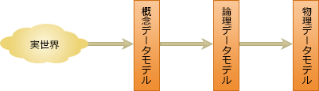

### B木の最大レコード数

①ルードノードは$i(1\leqq i\leqq 2k)$個のレコードを持つ、②ルードノード以外のノードは$i(k\leqq j\leqq 2k)$個のレコードを持つ、という2つの条件をもとにB木の1段目から$n$段目までの最大レコード数を求める。B木は「キー値＋1」のポインタを持つことを考慮すると、**$n$段目のレコード数$a_n$は**初項$2k$、公比$2k+1$の等比数列であり、**$a_n=2k(2k+1)^n$とわかる**。以上を踏まえ、1段目から$n$段目までの最大レコード数は以下の通り。

$$
\sum_{i=1}^na_i=\frac{2k\{(2k+1)^n-1\}}{(2k+1)-1}=(2k+1)^n-1
$$


<div style="page-break-before:always"></div>

## データベース設計

### E-R図の多重度とキーの関係(令和3年問4より)

E-R図において、エンティティ間の多重度が"1対多"であるとき、それをRDBに変換すると、"1"側のエンティティが主キー属性を持つ表、"多"側のエンティティが外部キーを持つ表になります。逆から捉えれば、表間に主キーと外部キーの関係があるとき、主キー側の表が"1"、外部キー側の表が"多"の多重度の関係を持つということです。

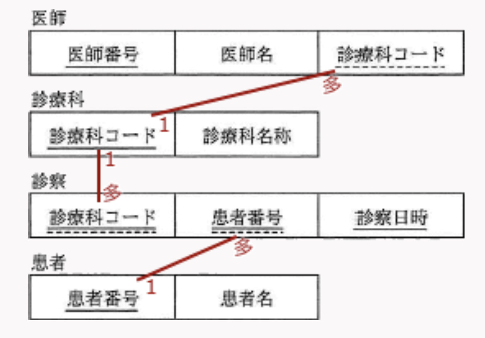

### 連関エンティティ(関連実体)

関係データベースでは「多対多」の関連をそのまま実装することができません。そこで、**「多対多」の関連が生じているエンティティ間に関連型エンテイティ（連関エンティティ）を入れ込んで2つの「1対多」の関連に分解します**。下図は1つの「注文」には複数の「商品」が含まれ、1つの「商品」が複数の「注文」に関連付けられる多対多のモデルを「注文明細」を介した表で実装する様子です。ここで、<b>「注文明細」の主キーは{注文番号、商品番号}であり、これは「注文」と「商品」を参照するための外部キーの組み合わせになる。</b>

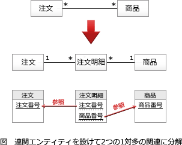

### 弱実体・強実体

**それ自体を識別するための主キー属性を持たず、それが属する実体型との関連を通してはじめて識別されるエンティティを弱実体(weak entity)と言う**。例えば、社員に対する扶養家族や、注文に対する注文明細が挙げられる。弱実体型のインスタンスは他の実体型のインスタンスに付属する形で存在する（存在従属する）ため、それを所有するインスタンスが存在しなくなれば、連鎖的に存在しなくなります。弱実体とは逆に、**他のエンティティに依存せずに存在できるエンティティを強実体、又は正実体(reaular entity)と呼びます**。


### 体現ビュー(Materialized View)

**実表のように実際の値をもちデータベースに格納されているビュー**。体現ビューはビュー操作のオーバーヘッド(変換処理やネットワーク負荷)を小さくするために考案された手法で、実表に対する問合せ結果のキャッシュを値としてもたせることで問合せを速く処理することを目的としている。また、インデックスの定義もでき、処理時間の短縮も可能。デメリットとして、データを重複して持つことから、一貫性の維持やディスク容量の面では 通常のビューよりも不利になる。特にデータウェア八ウスでは、問合せの度に実表に対して問合せを行うことは非常に高コス卜なので体現ビューが積極的にサポートされています。

### 複合キーの簡易化

そもそも、**複合主キーは複数の属性の組合せを主キーとして使用するもの**であり、持ち合わせている属性だけを使用してテーブルを構成することができるというメリットもある。しかし、<font color=red>主キーの属性数が多すぎると①SQLの結合演算記述が煩雑になる、②テーブル間の依存度が高くなる、③コードの仕様変更の影響を受けやすい、などの弊害がある</font>。このような時はデータをシンプルに扱うために、単一でレコードを特定可能な属性をテーブルに追加し、複合キーの代わりにそれを主キーとする手法が用いられます。この追加されて主キーとなる属性を代替キー(サロゲートキー)という。<b>主キーではなくなった複合キーは、主キーの要件を満たしていますが主キーに指定されていないため代理キー(alternate key)という扱いになる</b>。

### 情報無損失分解 / 関数従属性保存

<b><font color=red>情報無損失分解</font>とは、分解された部分同士の自然結合によって元の関係を過不足なく復元できる性質</b>、<b><font color=red>関数従属性保存</font>とは、分解後の部分が元の関係に存在した関数従属性を保っている性質</b>を言う。正規化では、データの更新時の異常を解消するために、`第1正規形→第2正規形→第3正規形→ボイスコッド正規形→第4正規形→第5正規形`の順で関係を情報無損失分解していくが、このうち、<u>①情報無損失分解ができ、かつ、②関数従属性保存が必ず成り立つ分解</u>は次の2つになる。

1. 第1正規形から第2正規形への変換
2. 第2正規形から第3正規形への変換

### 正規化

- **第1正規化**： 重複する行をなくす。 → 繰り返し項目の分離
- **第2正規化**： 主キーの「一部」に従属する列を抽出する。 → 部分関数従属の除去・完全関数従属のみテーブル作成
- **第3正規化**： 非キーの「一部」に従属する列を抽出する。 → 推移的関数従属の除去

**ボイスコッド正規化は、非キーから主キーへの関数従属をなくした状態**であり、第##正規化とも呼ばれる。<b><font color=red>ボイスコッド正規化では、非可逆な分解を起こす可能性があり、無損失分解に反することがある</font></b>ため、注意が必要である。<b>第4正規化では、関連エンティティがあるテーブルを<font color=red>分離</font>していく作業</b>になる。次に、<b>第5正規化では、エンティティ同士に関連がある場合は関連エンティティ(テーブル)を<font color=red>作る</font>作業</b>になる。一見、第##正規化でそれぞれ反対の操作をしているように見えるが、**どちらの操作も関連エンティティは##対応させる目的**で実施される作業である。

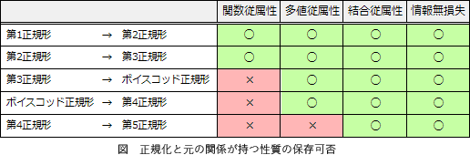


<div style="page-break-before:always"></div>

## データ操作

### SELECT文の実行順序

```sql
FROM → JOIN → WHERE → GROUP BY → HAVING → SELECT → ORDER BY → LIMIT
```

- WHERE句でSUM関数やCOUNT関数といった集約関数を使うことができない。
- WHERE句の時点ではグループ化はされていない。
- HAVING句よりGROUP BY句が先に実行されるため、HAVING句では集約関数(SUM, AVG, COUNTなど)を使える。

### 3値論理

SQLにおける3値論理とは、通常の"真(true)" と "偽 " (false) に " 不定 (unknown) " を追加したものです。DBにおいて、NULLは値でないため比較述語でNULLと値を比較した結果は、常にunknown になります。SQLではunknownをサポートするために3つの論理値が定義されています。

- 3つの真理値の間にある優先順位
  - ANDの場合 ： false $\gt$ unknown $\gt$ true
  - ORの場合　： true $\gt$ unknown $\gt$ false

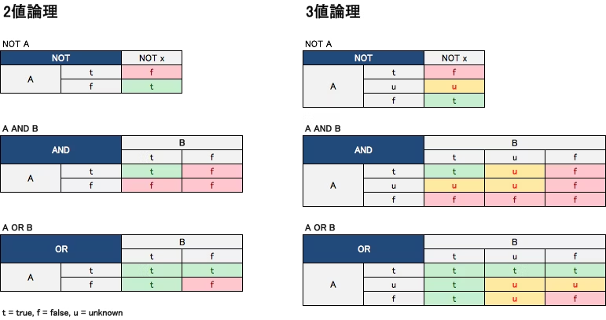

### COUNT関数

```sql
-- 問題
SELECT 部署コード, COUNT(CASE WHEN 役職 = '主任’ ??? END) AS 主任の人数, COUNT(CASE WHEN 役職 = '一般社員’ ??? END) AS 一般社員の人数
FROM 社員 GROUP BY 部署コード

-- 回答
SELECT 部署コード, COUNT(CASE WHEN 役職 = '主任’ THEN 1 ELSE NULL END) AS 主任の人数, COUNT(CASE WHEN 役職 = '一般社員’ THEN 1 ELSE NULL END) AS 一般社員の人数
FROM 社員 GROUP BY 部署コード
```

設問のSQL文ではCASE文がCOUNT関数の引数として使用されています。**COUNTは値がNULLではない行を集計対象とする関数**なので、条件に合致した行には"NULL以外" 、条件に合致しなかった行には"NULL"を返せば正しい行数が出力されるはずです。したがって`???`に入る適切な文字列は`THEN 1 ELSE NULL`になります。

### 導出表(VIEWは導出表の一つの形態)

1つ以上の基礎となる実表(DBに実データを持つ表)から関係演算・集合演算といったSQL問合せによって作成される仮想的な表全般を指します。SELECT文で得られる結果の他にも、GROUP BY句やWITH句を処理する際に内部的に作られる一時的な表も導出表の1つです。ビューは導出表の一つの形態であり、導出表に名前を付けて実表と同じように参照(条件次第では更新も)できるようにしたものです。導出表は実データを持たず、参照・更新要求の度に、実表に関係演算・集合演算を行って作り出されています。

### ビュー

関係データベースのビューは実表の一部、または複数の実表から関係演算(選択、射影、結合など)によって得られた結果を1つの表に見せかけた仮想の表であり、実データは存在しない。**ビューへのアクセス権限は実表へのアクセス権限とは独立**しており、実表と同じく、権限が無ければ他のユーザーがアクセスできない。

##### ビューの効果
1. 実表に公開したくないデータがある場合、ビューを定義することで利用者に非公開にできる。→**セキュリティ向上**
2. 複雑なSQLによって得られる表をビューとして定義することで簡便に利用することができる→**表操作の実行が容易**
3. 英数字で定義されている列名・表名を分かりやすい日本語に置き換えて定義することで見やすくなる。→**可読性の向上**

### ユーザのデータアクセス権限(GRANT)

GRANT文は、特定のユーザーに表などのDBオブジェクトに関する権限を付与するSQL文です。反対に付与されている権限を取り消すには、 REVOKE 文を使用します。

```sql
-- ユーザのアクセス権限付与
GRANT オブジェクトの権限 ON オブジェクト名
TO { ユーザー名 | ロール名 | PUBLIC }
[ WITH GRANT OPTION ]
```
```sql
-- ユーザのアクセス権限削除
REVOKE オブジェクトの権限 ON オブジェクト名
FROM { ユーザー名 | ロール名 | PUBLIC }
```
```sql
-- サンプル
GRANT OWNERSHIP ON DATABASE SAMPLE_DATABASE TO ROLE SYSADMIN;
GRANT OWNERSHIP ON SCHEMA SAMPLE_SCHEMA TO ROLE SECURITYADMIN;
GRANT OWNERSHIP ON FILE FORMAT SAMPLE_FILE_FORMAT TO ROLE USERADMIN;
REVOKE ALL ON DATABASE SAMPLE_DATABASE FROM ROLE SYSADMIN;
REVOKE ALL ON SCHEMA SAMPLE_SCHEMA FROM ROLE SECURITYADMIN;
REVOKE ALL ON FILE FORMAT SAMPLE_FILE_FORMAT FROM ROLE USERADMIN;
```

### カーソル

SELECT文で抽出されたレコードを1行ずつフェッチ(取得)して、複雑な処理をしたい場合に有効な機能。ただし、場合によっては処理のパフォーマンスを落ちる可能性もあり、カーソルの使用には検討の必要がある。

埋込み型SQLのカーソル操作によるデータ変更や削除は、通常のSQL(会話型SQL)と同じUPDATE /DELETE文によって行います。ただし以下のようにWHERE句には「**CURRENT OF カーソル名**」と記述し、カーソル位置を指定する点が異なります。

```sql
-- 更新処理におけるカーソル
UPDATE [テーブル名]
SET 列名 = 値 [,列名 = 値]...
WHERE CURRENT OF [カーソル名]

-- 削除処理におけるカーソル
DELETE FROM [テーブル名]
WHERE CURRENT OF [カーソル名]
```

### コミットポイント/セーブポイント/チェックポイント

- **コミットポイント**： 1つのトランザクションにおいて1回でコミットするのではなく、<b><font color=red>一定の件数の処理ごとにコミットする機能</font></b>です。
- **セーブポイント**： 長いトランザクションの途中でマーキングをし、<b><font color=red>途中からの処理を取り消す</font></b>のに使用される。SQLではSAVEPOINT文を用いて名前を付け、その部分までロールバックすることができます。
- **チェックポイント**： <b><font color=red>データベースの変更をハードディスクなどのストレージに書き込むタイミング</font></b>です。

### 条件のSQL化(令和3年問10)

条件は①同一"会員番号"をもつ複数の行によって、1人の会員の属性を表す、②新規に追加する行の行番号は最後に追加された行の行番号に1を加えた値とする、③同一"会員番号"で同一"項目名"の行が複数ある場合、より大きい行番号の項目値を採用する、の3つとする。

以下、問題のSQL→ 「???」を考える
```
SELECT 会員番号,
    ???(CASE WHEN 項目名='会員名' THEN 項目値 END) AS 会員名,
    ???(CASE WHEN 項目名='最終購入年月日’THEN 項目値 END) AS 最終購入年月日
FROM(
    SELECT 会員番号,項目名,項目 FROM 会員項目
    WHERE
    IN ( 
SELECT ???(行番号) FROM 会員項目
GROUP BY 会員番号,項目名 
    )
) T
GROUP BY 会員番号
ORDER BY 会員番号
```

以下、考え方。

まずGROUP BY句を用いている場合は、グループ化対象列または集計関数しかSELECT文に指定できません。 DISTINCTは集計関数ではないので誤りとわかります。次に、COUNTは行数を返す関数であり、〔結果表〕 の会員名と最終購入年月日が文字列になっていることから誤りと判断できます。残るMINとMAXですが、MINを採用すると一番内側のSELECT文で会員番号と項目名のグループから行番号を取得するときに、グループごとに最も小さい行番号が取得されてしまうことになり、「より大きい行番号の項目値を採用する」という条件に反するため誤りです。したがってaには「MAX」が当てはまります。MAXを指定した場合の動作は`SELECT MAX(行番号) FROM 会員項目 GROUP BY 会員番号, 項目名`であり、これが条件3を満たす。この結果表を`SELECT 会員番号,項目名,項目値 FROM 会員項目 WHERE 行番号 IN ①`の①に置き換えて会員項目表から、該当する行番号をもつレコードだけを選択します。 この結果表をTとします。すると、クエリは以下のようになります。
ここで、このSELECT文により、会員番号、会員名、最終購入年月日を抽出します。MAX関数を用いているのは、GROUP BY句を使用しているので集計関数しか指定できない、該当するレコードが存在しないときにNULLを表示したいからです。

```
SELECT 会員番号,
    MAX(CASE...) AS 会員名
    MAX(CASE.) AS 最終購入年月日
FROM (
SELECT 会員番号,項目名,項目値 FROM 会員項目 
WHERE 行番号 IN (
    SELECT MAX(行番号) FROM 会員項目 
    GROUP BY 会員番号, 項目名
)
    )
AS T
GROUP BY 会員番号
ORDER BY 会員番号
```

### COALESCE句の特徴

<b><font color=red>COALESCEは引数を最初から1つずつ走査し、NULLでない値が見つかった場合にその値を返す</font>。 COALESCE(A, B)はAがNULLのときBを返し、そうでないときAを返す</b>。完全外部結合FULL JOIN(FULL OUTER JOIN)を使用する際に使用する。

### 和両立(union compatible)と集合演算

2つの関係において、 次数 (属性数 / 列数) が等しく、対応する属性同士のドメイン (値の型・範囲)が等しく、 2つの関係の型が適合している様子をいう。<b>関係モデルにおける集合演算のうち<font color=red>和差・共通は、2つの関係が和両立であることが前提</font>となっている。したがって、<font color=red>和両立である必要のない演算は「直積」</font>である</b>。直積演算は、(A,B)と(C,D)という2つの関係があったときに、全ての属性を繋ぎ合わせた(A, B, C, D)というタプル(行)を得る演算であるため、和両立である必要はない。

### べき等(Idempotent)

コンピュータサイエンスの世界で使われる言葉で、**ある操作を1回実行しても複数回実行しても結果が同じにな性質**。主要なデータ操作SQL文のうち、SELECTと障害回復時のUNDO、REDOはべき等、INSERT・UPDATE・DELETEはベき等ではない。

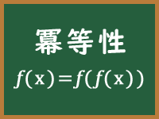

### 自然結合と等結合

直積結合の集合から、**①結合属性の値が等しい行を抽出したものが等結合**である。また、**②等結合から片方の結合属性を排除したものを自然結合**と言い、2つの関係をある属性の値を条件として結合した行の集合から、重複している結合属性の1つを排除してできる関係です。 

##### 自然結合

```sql
SELECT * 
FROM 学生,担当
WHERE 学生.科目
```

##### 等結合

```sql
SELECT * 
FROM 学生 
JOIN 担当
    ON 学生.科目
```

### UNION句の特徴

```sql
-- SQL1
SELECT * FROM R UNION SELECT * FROM R;

-- SQL2
SELECT * FROM R;
```

上記のSQL1とSQL2の結果が一致するための条件は<b>「元の関係Rに<font color=red>重複する行が存在しないこと</font>」</b>である。UNION句では、複数の結果の集合を得るという性質上、統合する際に重複している行を除外する。一方、①NULLを持つ行が存在する、②行数が0である、③列数が1である、などは関係がない。

### 大量データの格納データ型(BLOB型/TEXT型)

容量の大きなデータをデータベースの列値として格納するために 「BLOB型」と「TEXT型」というデータ型が用意されている。BLOB型の特徴として、等号(=)比較のみ可能であり、列値でのソートや文字列検索はできない。

- **BLOB型**：大量のバイナリデータ(バイト列)を格納する。いずれもバイナリ形式なので、比較・ソートの効果はほとんどない。メディアファイル、プログラムモジュール、音声データなどがある。
- **TEXT型**：大量の文字列データを格納する

### ハッシュ結合＝等結合以外の結合演算には使用できない結合

等結合(等価結合) とは、結合条件に等号 (=) を用いて結合属性の値が等しい行同士を結合する演算です。これに対して条件に等号以外 (≧,,> <,範囲)を使用する結合演算を非等値結合(非等価結合)といいます。

ハッシュ結合は、結合する表のうち規模が小さいほうの結合属性の値を全件読み込み、それらの値をハッシュ化した表(ハッシュテーブル)をメモリ上に作成することで結合すべき行かどうかを高速に判定していく方法です。ハッシュ値への変換には、たとえ元の値同士が近くても全く異なった値が生成され、ハッシュ値からは元の値を復元できないという特徴があります。ハッシュ結合は、その名の通り"実際の値"ではなく"値のハッシュ値"を用いるため用途は「比較対象同士が同値であるか」という点のみに限られます。このような理由からハッシュ結合は等結合以外の結合演算には使用できません。

<div style="page-break-before:always"></div>

## トランザクション処理

### ACID特性

ACID特性とは、トランザクション処理において必要とされる4つの要素、Atomicity（原子性）、Consistency（一貫性）、Isolation（独立性）、Durability（永続性）を頭字語で表したものである。トランザクション処理では、DBにおけるデータの一貫性を保証するため、一連の処理全体を一個の処理単位として管理している。このとき、ACID特性が遵守されていることが、データの一貫性を保証するためには不可欠とされている。

- **Atomicity（原子性）**：一連の処理は、**実行されるか、実行されないか**、どちらかであることが保証されること。
- **Consistency（一貫性）**：処理結果がある条件や**整合性を保つ**ことが保証されること。
- **Isolation（独立性/分離性）**：その処理について、結果だけが他から見ることができ、実行中の途中状態が他へ影響することが無いということ。
- **Durability（永続性）**：その処理が完了したという結果を受けた段階で、結果は失われることの無い永続的なものとしてDBに記録されている、ということ。

### WAL(Write Ahead Log：まずログを書け) プロトコル

トランザクションがログを安定記憶に書き出すタイミングについての取り決め。**更新前ログ**(DBの更新は、まずそれをログを書き出してから行う)と**更新後ログ**(トランザクションはコミットを行う前に、該当する全てのDB更新情報をログを書き出す)がある。
実際の操作に先だってログを書き出す理由は実操作とログとの同期をとり、トランザクションの原子性と永続性を担保するためです。ログの書出し完了をコミット時点とする正常なトランザクションはBEGIN TRANSACTION によって開始され、COMMITを経てEND TRANSACTIONで終了しますが、WALプロトコルに従えば、**①トランザクションの開始直後に更新前ログを書出し**、**②COMMIT直前に更新後ログを書き出す**ことになります。

1. begin transactionレコードの書出し
2. ログに更新前レコードの書出し
3. ログに更新後レコードの書出し
4. DBの実更新
5. commitレコードの書出し
6. end transactionレコードの書出し

### トランザクションの分離性レベル(ACIDのIの部分)

隔離性水準とは、トランザクションに指定できる直列化制約の度合いで、隔離性の低い順に①READ UNCOMMITTED、②READ COMMITTED、③REPEATABLE READ、④SERIALIZABLEの4種類がある。一般的なDBMSでは「READ COMMITTED」がデフォルトになっており、トランザクションの同時実行が原因で生じる以下の3つの異常(ダーティリード、ファジーリード、ファントムリード)と合わせて覚える。

- **ダーティリード**：トランザクションBでコミットされていないデータをトランザクションAで読み取ってしまう問題が起きます。
- **ファジーリード/ノンリピータブルリード**：トランザクションAでデータを複数回読み取っている途中で、**トランザクションBでデータを更新してコミットした場合**、トランザクションAで違う結果のデータを読み取ってしまう問題が起きます。(非再現リードとも呼ぶ)
- **ファントムリード**：トランザクションAで一定の範囲のレコードに対して処理を行っている途中で、**トランザクションBでデータを追加・削除してコミットした場合**、トランザクションAで幻影のようにデータが反映されるため、処理の結果が変わってしまう問題が起きます。

```sql
-- トランザクション分離性レベル
BEGIN TRANSACTION ISOLATION LEVEL READ UNCOMMITTED;
BEGIN TRANSACTION ISOLATION LEVEL READ COMMITTED;
BEGIN TRANSACTION ISOLATION LEVEL REPEATABLE READ;
BEGIN TRANSACTION ISOLATION LEVEL SERIALIZABLE;
```

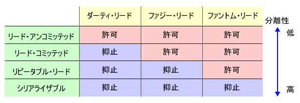

<div style="page-break-before:always"></div>

### 2相ロック方式

トランザクションがデータを操作する前にロックをかけ（第1相）、操作後にロックを解除(アンロック)する（第2相）というロックのルールを用いてトランザクションの実行を制御する方式。**全てのロックを獲得した後にだけロックの解除を行うことができるロッキングプロトコル**。ロックをかけたデータは以後必要が無くなるまで他のトランザクションの書込み用に読み込まれることはなくなるため、トランザクションの相反<u>直列化可能性が保証</u>される。具体的には、次の手順でコミットが行われます。
<b><font color=red>※デッドロックが発生する可能性あり</font></b>

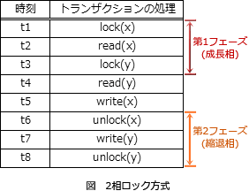

### 2相コミット (Two Phase Commit) 

トランザクションのコミットを次の2つのフェーズに分けて行い、分散DB環境でのトランザクションの原子性及び一貫性を保証する仕組みです。**第1フェーズ**では、他のサイトに更新可能かどうかを確認する。**第2フェーズ**では、全サイトからの合意が得られた場合に更新を確定する。
※第1フェーズと第2フェーズの間で主サイトがダウンした場合、従サイトは何も処理を行えない。

1. 調停者となったノードは、 ネットワーク上の他のノードにコミットの可否を問い合わせる。
2. 全参加者からコミットの合意を得られた場合は全参加者にコミットの実行要求を発行する。コミットの停止を応答した参加者がいた場合またはタイムアウトとなった場合は、全参加者にロールバックの実行要求を発行する。
3. 各参加者は、コミット(またはロールバック)の完了とともに調停者に処理完了のメッセージを送る。
4. 調停者が、 全参加者からの処理完了メッセージを受け取り、 トランザクションの完了となる。

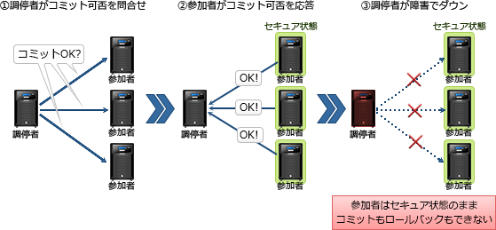

### インデックス(INDEX)

データベースの中のレコードを素早く探すために、検索対象となるデータ属性に対して設定されるもので、索引(さくいん)とも呼ばれる。インデックスの種類には**B+木インデックス**や**ビットマップインデックス**、**ハッシュインデックス**がある。インデックスが最大限の効果を発揮する時は「重複のない大量のデータをランダムに検索するとき」である。一方、**①少量のデータからの検索**や、**②とり得る値が少なく値の重複が多い**こと、そして、**③値の分布に偏りがある**と、アクセス速度の向上はおろか逆に低下してしまうこともある。

### ロールフォワード・ロールバック
**ロールフォワード**は更新<font color=red>後ログ</font>を使用してコミット済トランザクションをデータベースに適用する、**媒体障害からの回復方法**。媒体障害が発生したときには、バックアップファイルを用いてバックアップ時点の状態にした後に適用する。**ロールバック**は更新<font color=red>前ログ</font>を使用してデータベースをトランザクション以前の状態に戻す、**トランザクション障害からの回復方法**。
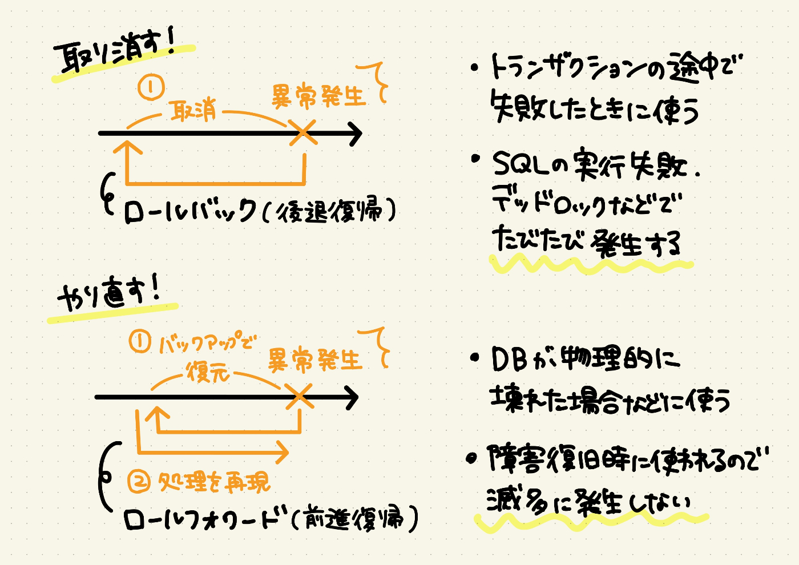


### B+木インデックス

木の深さが一定で葉のみが値をもつ平衡木を用いたインデックスで、RDBMSのインデックス法として現在最も普及しています。すべてのキー値が同じ深さにあるので、データ量が増加しても**パフォーマンスの低下が少なく**、**ランダム検索や範囲検索、挿入・更新・削除を効率よく行える**特徴を持ちます。<b><font color=red>①データの分布に偏りがある場合や、②NULL値及び否定を含む検索条件</font></b>では効果を発揮できません。

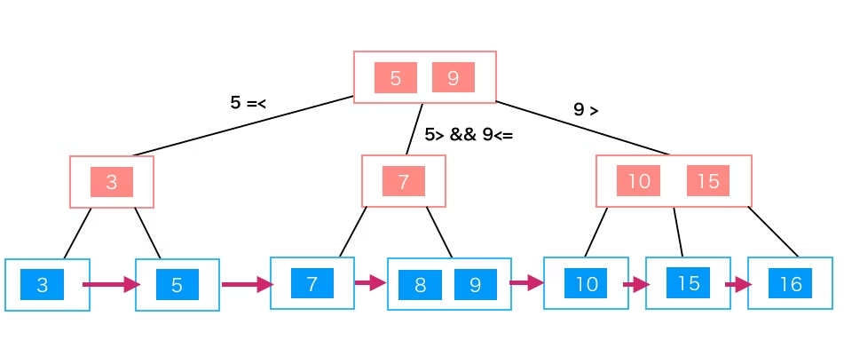

### 待ちグラフ

**待ちグラフは**、実行中の「トランザクションを各ノード」、「データのアンロック待ちの様子を矢印」で表現したグラフであり、<b><font color=red>デッドロックの検出に使用</font></b>される。**待ちグラフ内に閉路があればデッドロックが発生している**と判断できます。このときDBMSはいずれかのトランザクションを強制的にアボート(中止)させることでデッドロックを解消します。

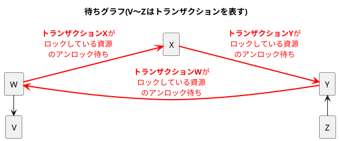
```plantuml
@startuml
title 待ちグラフ(V〜Zはトランザクションを表す)
left to right direction

rectangle V as v
rectangle W as w
rectangle X as x
rectangle Y as y
rectangle Z as z

w -> v
w -[#f00,thickness=2]-> x#text:red : **トランザクションX**が\nロックしている資源\nのアンロック待ち 
x -[#f00,thickness=2]-> y#text:red : **トランザクションY**が\nロックしている資源\nのアンロック待ち
y -[#f00,thickness=2]-> w#text:red : **トランザクションW**が\nロックしている資源\nのアンロック待ち
y <- z
@enduml
```

### 共有ロック・専有ロック
- **共有ロック**: データを読込むときに使うロックで、資源がこの状態の場合は他のトランザクションによる**更新処理ができなくなる(読込みは可能**)。
- **専有ロック**: データを更新するときに使うロックで、資源がこの状態の場合は他のトランザクションによる**読込みや更新が不可**。

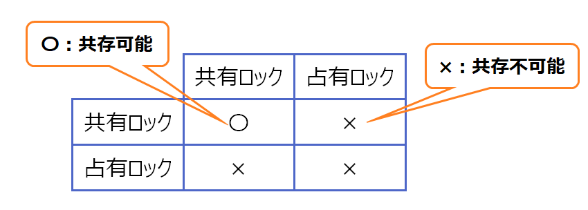

### 多版同時実行制御(MVCC: MultiVersion Concurrency Control)

複数の利用者から同時にDBの更新要求を受け取った場合でも、**同時並行性と一貫性の両方を保証する仕組み**。多版同時実行制御では、<b>①更新中のデータに対する参照要求に対しては<font color=red>トランザクション開始時点のデータのコピー(スナップショット)を提供</font>し、②参照中のデータに対する更新要求に対しては<font color=red>トランザクション開始前のデータのコピーを提供</font>する</b>。これにより、**読込みのロックと書込みのロックが競合を回避**し、トランザクションの同時並行性が向上します。

### トランザクションのコミット処理完了のタイミング

主記憶は揮発メモリなので、もし①コミット文実行と②補助記憶への書出しの間に障害が発生した場合は、トランザクションの情報が失われてしまうことになります。これではトランザクションの永続性(耐久性)を満たすことはできません。上記の理由から、トランザクションはコミット文が実行された時点ではなく、WALプロトコルに従って<b><font color=red>更新後ログが物理的記憶装置に書き込まれた瞬間にコミットした</font></b>と見なす。補助記憶への書出しは効率化のために一定時間ごとにまとめて行われるため、**COMMIT文を実行したからといって、その内容が補助記憶に書き出されているわけではない**。

コミット処理完了までの流れを以下に示す。

1. トランザクション開始
2. 必要なデータがデータベースから主記憶に読み出される
3. 主記憶上のデータが更新される
4. コミット〜トランザクション終了
5. 書出しのタイミング(チェックポイント)ごとに、それまでに主記憶上で更新されたデータをまとめて補助記憶に書き込む1

### トランザクションの直列化可能性

**複数のトランザクションを並列実行した結果が、1つずつを順番、すなわち直列に実行した結果と同じになる性質**。直列化可能スケジュールであればデータベースは一貫性のある状態になっていることが保証される。

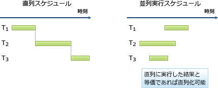

### DBMSの障害回復方法(3つ)

- **トランザクション障害**：計算途中や入出力の処理中のエラーでトランザクションが異常終了すること。この場合、<b>メモリ上のデータベースバッファは残っており、コミットされたトランザクションや実行中のトランザクションには影響がないため、<font color=red>障害が発生したトランザクションだけをロールバックする</font></b>ことにより回復を行います。
- **システム障害**：DBMSやOS、または電源等のハードウェアの異常でシステムを再起動しなければならない状態になること。この場合、<b>メモリ上のデータベースバッファが消えているため、<font color=red>障害前にコミットされていたトランザクションはログを使用してロールフォワードし、障害時に実行途中だったトランザクションはロールバックする</font></b>ことにより回復を行います。
- **媒体障害**：ディスク等の2次記憶装置が使えなくなってしまう状態になること。この場合、<b>バックアップからディスク内容を復元し、バックアップ時点から障害発生までにコミットされたすべてトランザクションについて、<font color=red>ログを使用してロールフォワード</font></b>を行います。バックアップの適用により実行途中だったトランザクションはなかったことにされるため、ロールバックは不要です。

### 同時実行制御における楽観的制御法

<b><font color=red>データに対してのロックを行わず、更新対象のデータをあらかじめ取得しておき、更新直前までに変化していないことを確認する</font>ことにより、データの整合性を保証する方法</b>。同時実行されるトランザクション間でデータの干渉が少ないときに有効な方法となり得ます。

### インデックスの設計技術

#### B+木インデックス
**木の深さが一定**で葉のみが値をもつ平衡木を用いたインデックスで現在最も普及している。

- **メリット**
  - データ量が増加してもパフォーマンスの低下が少ない。
  - どのキー値に対してもランダム検索や範囲検索、挿入・更新・削除を効率よく行うことができる。
- **デメリット**
  - データの分布に偏りがある場合や、NULL値及び否定を含む検索条件では効果を発揮できない。

#### ビットマップインデックス

キーが取り得る値の種類が数個程度と少ない場合に適したインデックスで、**それぞれのキ一値と対応するビットマップ(##の配列)を作成**する。

- **メリット**
  - NULL値の検索ができる。
  - WHERE句にANDやORなどが含まれる検索を高速に実行できる
- **デメリット**
  - 挿入・更新・削除には時間が掛かる。 データウェアハウス環境で広く使用されている。

<div style="page-break-before:always"></div>

## データベース応用

### セミジョイン法(準結合演算法)

分散型データベース演算に特有の転送コストを少なくするための結合手法。以下に、手順を示す。最初に結合属性の射影を転送するコストは余分に掛かるが、手順2の操作によって結合に必要な最小限のレコードが抽出されるため、どちらかの表の全てを他方のサイトに転送する場合と比較して**通信負荷の低減が期待できる**。

1. サイト1は表Rのうち結合する属性の射影だけをサイト2に転送する
2. サイト2は転送されてきた結合属性の射影と表Sの結合演算を行う
3. サイト2は手順2の結合演算結果をサイト1に転送する
4. サイト1は転送されてきた結果と表Rの結合演算を行う

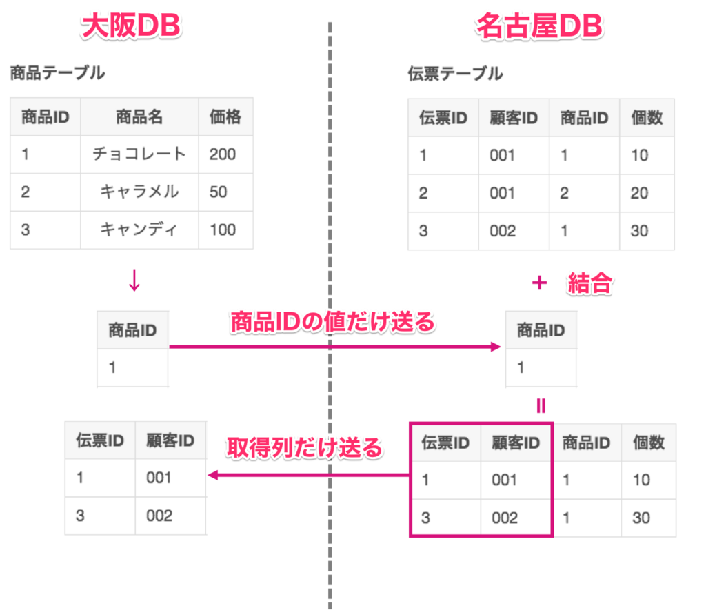

### マージジョイン法(ソートマージ法)

マージジョイン法は、他方のDBにソート済みのテーブルデータを送信してもらった上で結合を行います。結合回数は少なくなりますが、データ送信量は入れ子ループ法と比較して大きいです。
※通信量負荷の軽減とは無関係です。

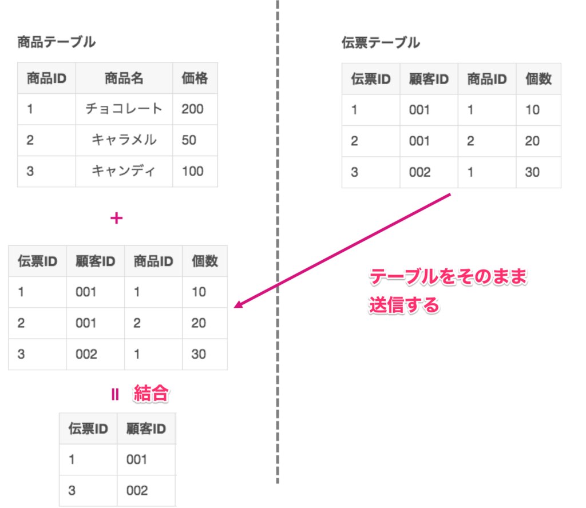

### 入れ子ループ法

入れ子ループ法では、DBがテーブル行を一行ずつ送信しながら、他方のDBによる結合結果を受け取る方式です。計算量は$O(n^2)$になる。
※通信量負荷の軽減とは無関係です。
```sql
// 入れ子ループ法による表Rと表Sの結合処理
for (t in R)
    for (t' in S)
if (t['A'] == t'['a'])
    結合(t, t');
    end
end
```

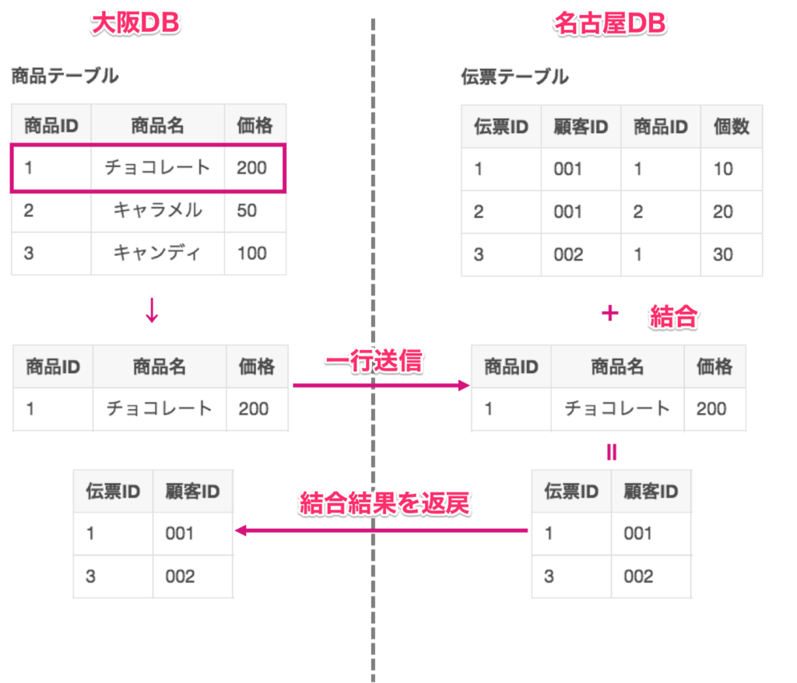

### NoSQL(Not only SQL)

NoSQLは、**拡張性**に優れ、非構造化・半構造化データなどのビッグデータに対応する**スキーマレスなデータ操作**を低コストで実行できる。NoSQLはトランザクションをサポートせず「**結果整合性**」というデータの即時反映ではなく、結果的に一貫性が保証されていればよいという考え方に基づく。NoSQLは、このアプローチに基づき一貫性の保証を弱めることでスケールアウトを容易にする。
<b><font color=red>※ロックによる整合性の確保はない</font></b>

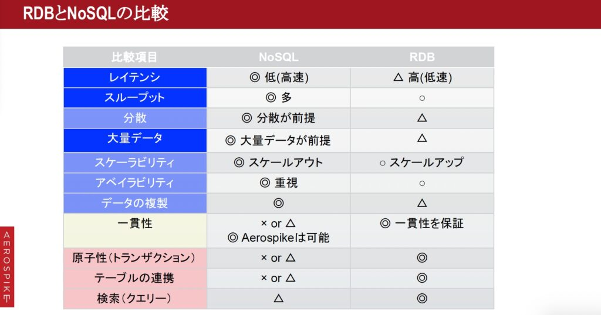

### Apache Spark

大量のデータに対する並列分散処理機能(並列性・耐障害性)を提供するオープンソースソフトウェア。Apache Sparkではデータを抽象的に扱うため**RDD (Resilient Distributed Dataset)と呼ばれるデータ構造が用意**され、このRDDに対して処理を記述していきます。キャッシュやインメモリにより、**MapReduceと比較して、反復処理やデータの再利用でもストレージI/OやネットワークI/Oが少ないのが特徴**です。

| 特徴/項目 | Apache Spark | Apache Hadoop | Apache Accumulo |
|--|--|--|--|
| **主な用途**| 大規模データの迅速な処理    | 大規模データの分散処理 | 分散キー/値ストレージ |
| **主要コンポーネント**| Spark Core, Spark SQL, Spark Streaming, MLlib, GraphX| HDFS, <font color=red>MapReduce</font>, YARN  | テーブル、レンジ、セル |
| **データ処理モデル**| メモリ内処理 | ディスクベースのバッチ処理 | <font color=red>キー/値データモデル</font> |
| **データ構造** | <font color=red>RDD（Resilient Distributed Dataset）</font>、DataFrame、Dataset	 | ファイル、ディレクトリ、ブロック（HDFS）、テーブル（Hive）、キー/値ペア（HBase） | テーブル、レンジ、セル |

### 分散DBシステムの「透過性」

DBが複数の場所に離れていることを意識せずに利用するために求められる性質を「透過性(transparency)」という。地理的に離れた場所にある複数のDBを論理的に1つのDBとしてアクセスできるようにしたもの。

1. **位置に対する透過性(location)**：DBが配置位置を意識せずにDBを利用できること。
2. **移動に対する透過性(migration)**：データ格納サイト(≒URL)が変更されても、利用者のアプリケーションや操作方法に影響がないこと。
3. **分割に対する透過性(fragmentation)**：一つの表が複数のサイトに分割されても意識せずに利用できる。
4. **複製に対する透過性(replication)**：同一データが複数サイトに保存されても意識せずに利用できる。
5. **障害に対する透過性(failure)**：あるサイトで障害発生時、意識せずに利用できる。
6. **データモデルに対する透過性(data model)**：各サイトのDBMSが扱うデータモデルが異なっていても意識せずに利用できる。

### シャーディング(DBシャーディング)

**予め決められた規則に従って複数のDBサーバにデータを分散して割り当てる手段**の1つ。DBへのリクエストを分散し全体のスループットを上げる目的で利用される。DBサーバは**シェアードナッシング方式**で分割された断片的なデータ集合(シャード)を持っている。実装方法としては、<font color=red>①行（レコード）を基準にテーブルを水平分割するシャーディング</font>と、<font color=red>②列（カラム）を基準にテーブルを垂直分割するシャーディング</font>の2つがある。

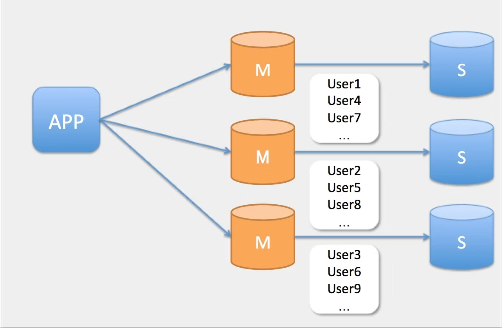

### OLAP(Online Analytical Processing)

多次元データベース分析を行うOLAPの操作には以下のような種類があります。
- **スライシング**： 多次元データベース内の集計項目の中で縦軸と横軸を指定し、 2次元の表を得る操作
- **ダイシング**： 現在参照している情報の縦軸・横軸を切り替え、 別の視点から見た表を得る操作
- **ドリルダウン**： 集計単位を小さく(細かく)し詳細に展開する操作(年月、 都道府県 市町村など)。情報をドリルで掘り下げていくイメージ。
- **ロールアップ (ドリルアップ)**： 集計単位を大きくし集計する操作(月→年、市町村→都道府県など)。 細かな情報を包んでひと括りにするイメージ。

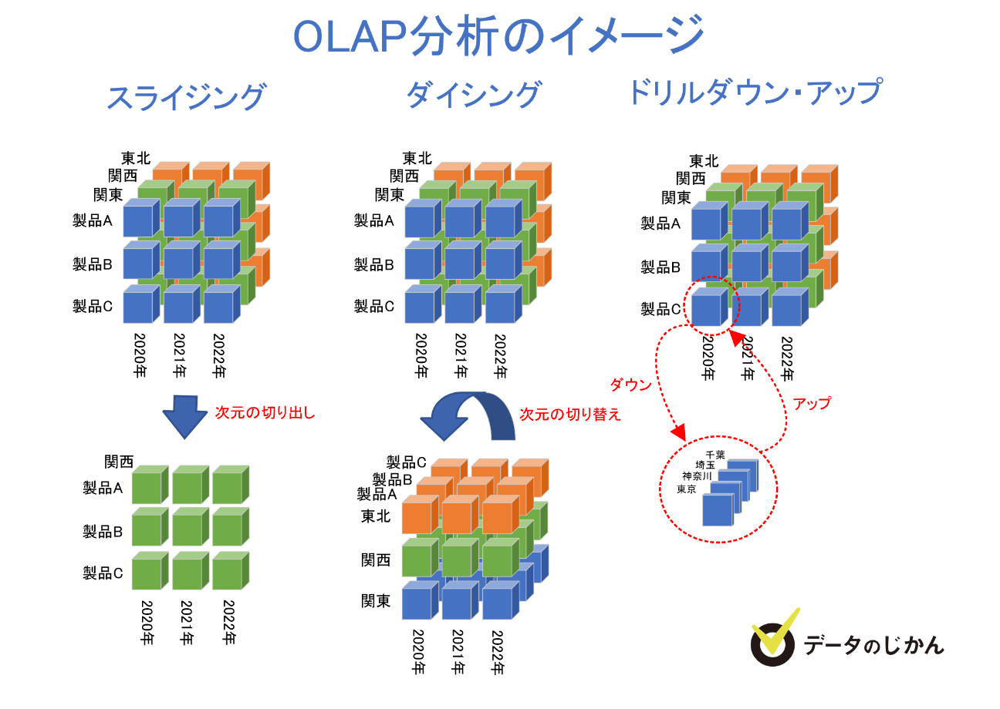

### CEP(Complex Event Processing：複合イベント処理)

時系列で発生する膨大なデータをリアルタイムで解析し、**あらかじめ規定した条件に合致する場合に実行される処理の総称**。処理条件や分析シナリオを事前に定義しておき、それに合致した場合に決められたアクションを即座に実行する仕組み。例えば、ビジネスアクティビティの監視やセンサネットワーク、株価データなどがある。

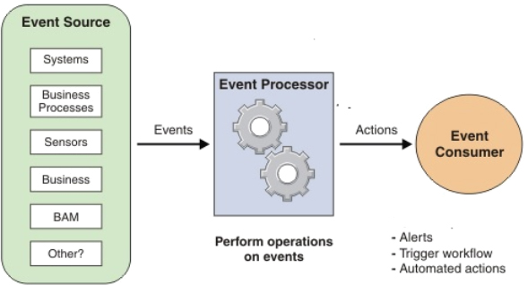

### BASE特性
<b>ACID特性と同様にデータベースの一貫性モデルであり、<font color=red>厳密な一貫性を要求せず結果整合性を保証する考え方</font>。 BASE特性の概念は、クラウド上でビッグデータを扱うNoSQLのトランザクションに取り入れられている</b>。BASEは以下の3特性の頭文字を指す。
- **BA(Basically Available)**： 可用性優先（可用性が高く常にサービスが利用可能。サーバ台数が多く頻繁に故障するがサービスは再実行して維持する。）
- **S(Soft State)**： ステータスは厳密ではない（ここで一貫性の多くを妥協）
- **E(Eventually Consistent)**： 結果整合性（１サーバで更新されたあとに同期することで時間をおいてから一貫性が保たれる）

### CAP定理
分散処理システムに存在する3つの特性のうち、最大でも同時に2つまでしか満たすことができないとする定理です。
- **一貫性（Consistency）**: **ロックの有無**。データの整合性が常に保たれていること。
- **可用性（Availability）**: **リアルタイム性**。利用したいときに求める分だけ利用できること。
- **分断耐性（Partition Tolerance）**: **単一DBか複数DBかどうか**。データを複数のサーバに分散して保管していること

**CA型(一貫性と可用性)を保証**しようとすると必然的に単一のデータベースとなり、分断耐性がありません。また、**CP型(一貫性と分断耐性)を保証**しようとすると、DBの2相ロックや3相ロックが必要となり可用性が損なわれます（ロック中は利用できない）。そして、**AP型(可用性と分断耐性)を保証**するシステムでは、ロックを掛けないので一貫性が損なわれます。

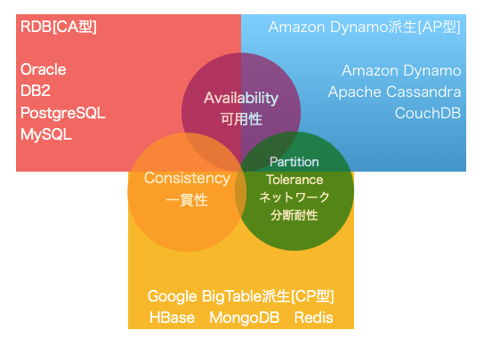

### スタースキーマ

多次元データモデルを表現するように設計されたスキーマ。データウェアハウスの実装で使用され、**分析対象となる1つ以上のファクトテーブルと、1つ以上のディメンションテーブルで構成**され、中心となるファクトテーブルに各ディメンションテーブルが結ばれた星(スター)型構造をもつ。ディメンションテーブルには、ファクトテーブルから参照される属性値が格納されます。

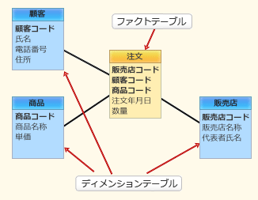

### データディクショナリ(DD)

データベースのメタデータやデータ定義情報といった**スキーマ情報を効率よく管理する情報の保管庫**。データディクショナリは、他のデータベースと同じく表とビューで構成されていて次のような情報が格納される。
- 概念スキーマ、 外部スキーマ、 内部スキーマとそれらの変換定義情報
- 表、 ビュー、インデックス、 その他オブジェクトの定義情報
- 参照制約、検査制約の定義情報
- ユーザー情報
- アクセス権と機密保護に関する情報

### Indexed Database API (IndexedDB)

**利用者のWebブラウザ内に永続的なデータベースを構築し、Webアプリケーションから利用するための一連のAPI仕様**。HTML5で追加されました。キーとバリューの組を格納し、キーに基づいてインデックス化されたオブジェクトを保存・取得・更新・削除する。関係データベースではないので、SQLによる問い合わせは使用しない。

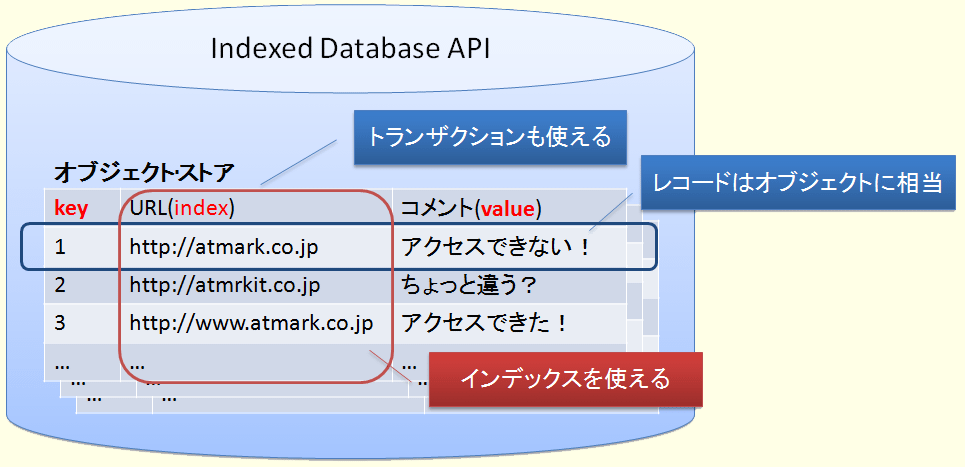

### データレイク(Data Lake)

**本来のフォーマットのまま蓄積しておく巨大な貯水湖**。蓄積するデータの生成元には、Webサイトやソーシャルメディア、モバイルアプリ及び1oTデバイスなどを含む。蓄積されたデータは、機械学習、予測分析、データ検出、プロファイリングなどに役立てられるが、どのように使用するかは基本的に利用者に一任される。収集する範囲を決めずにそのままのデータが一元的に管理されているため、分析の際に求めるデータが不足したり、他システムから寄せ集めたりといった問題が解消される。

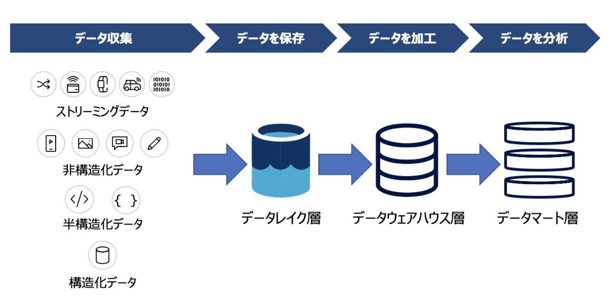

### データマイニング

データウェアハウス(DWH)に蓄積されている大量の生データから、**統計学的手法・数学的手法を用いて今まで知られていなかったデータの規則や因果関係を見つけ出す手法**。ニューラルネットワークや統計解析などの手法を使って大量に蓄積されているデータから、顧客購買行動の法則などを探し出す。

### ブロックチェーン

分散型台帳技術とも呼ばれ、**仮想通貨(暗号資産)の基盤技術であり、いくつかの取引データをまとめた"ブロック"という単位をハッシュ関数で鎖のように連結することによって、台帳を形成し、P2Pネットワークで管理する技術**。あるブロックのハッシュ値は、①前のブロックのハッシュ値、 ②取引データ、③ナンス値を基に生成されるため、 1か所の取引データを改ざんすると、それ以降のすべてのブロックのハッシュ値が変わってきます。 これら全てを正しく書き換えることはほぼ不可能であるため、取引参加者はハッシュ値の検証によって改ざんの有無を確認することができます。ブロックチェーンでは、ハッシュ関数の強度が台帳の堅牢性に直結するのでSHA-##/SHA-##などの十分に強度のある方式が使用されています。

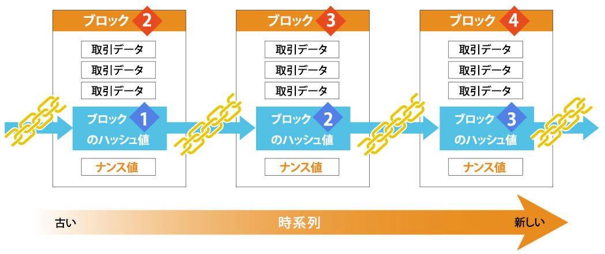

### データ管理について

- **データリネージ(lineage: 血統、系統)** 
データが作成されて(発生して)から変換、加工、利用されるまでの流れ(履歴)を追跡し、可視化することである。データの生成源の特定や障害時の影響調査に利用できる。
- **データカタログ** 
データ構造がどのように定義されているのかを示す情報。Webサイトなどに公開して検索できるようにする。

<div style="page-break-before:always"></div>

## その他の分野

### クラスタリング(システムの信頼性・性能向上)

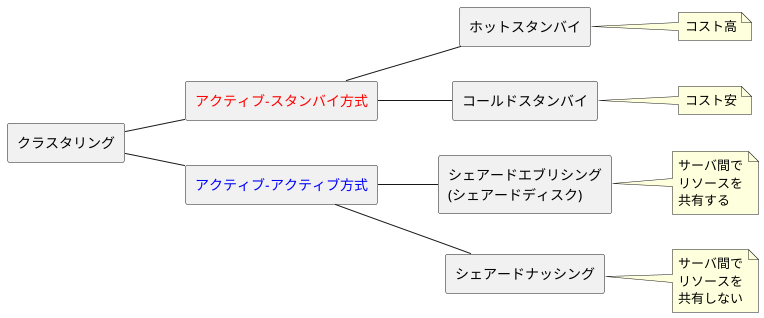
```plantuml
@startuml
left to right direction

rectangle "クラスタリング" as cluster
rectangle "アクティブ-スタンバイ方式" as as_pattern #text:red
rectangle "ホットスタンバイ" as hot_standby
note right
コスト高
end note
rectangle "コールドスタンバイ" as cold_standby
note right
コスト安
end note
rectangle "アクティブ-アクティブ方式" as aa_pattern #text:blue
rectangle "シェアードエブリシング\n(シェアードディスク)" as shared_everything
note right
サーバ間で
リソースを
共有する
end note
rectangle "シェアードナッシング" as shared_nothing
note right
サーバ間で
リソースを
共有しない
end note

cluster -- as_pattern
cluster -- aa_pattern
as_pattern -- hot_standby
as_pattern -- cold_standby
aa_pattern -- shared_everything
aa_pattern -- shared_nothing
@enduml
```

#### <font color=red>アクティブ(現用系)-スタンバイ(待機系)方式</font>

現用系に障害が発生した場合、待機系に切り替わり、システムの復旧が行われる。**復旧が比較的早いホットスタンバイ(コスト高)方式**と、**復旧が比較的遅いコールドスタンバイ(コスト低)方式**の2種類がある。

#### <font color=blue>アクティブ(現用系)-アクティブ(現用系)方式</font>

複数サーバを分散して配置し、複数サーバで単一ディスクを共有する**シェアードエブリシティング(シェアードディスク)方式**とサーバごとに単一のディスクを占有する**シェアードナッシング方針**の2種類がある。

<table>
	<tbody>
		<tr>
			<td></td>
			<td>シェアードエブリシング<br>(シェアードディスク)</td>
			<td>シェアードナッシング</td>
		</tr>
		<tr>
			<td>メリット</td>
			<td>
                ①フェールオーバーで処理を引き継ぐことで<br>ダウンタイムを最小限に抑えられる<br>
                ②どのノードも全てのデータに<br>アクセスできるため障害に強い
            </td>
			<td>
                ①分散処理により性能が向上する<br>
                ②競合がないためスケールアウトの影響が少ない<br>
                ③サーバを追加すればするほど性能が向上する
            </td>
		</tr>
		<tr>
			<td>デメリット</td>
			<td>
                ①共有ディスクのアクセス競合の増加<br>により処理能力向上がダイレクトに得られない
            </td>
			<td>
                ①DBサーバに障害が発生した場合、<br>付随するディスクのデータが孤立してしまう
            </td>
		</tr>
	</tbody>
</table>

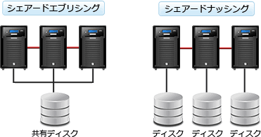

### ロードバランサの特徴

- ICMPやTCPコネクション要求などで振分先サーバの死活監視(ヘルスチェック)を常時行ない、自動的に当該サーバの振り分け対象を選別する。
- **ロードバランサはグローバルIPアドレス**を持つ必要がある。**Webサーバ側はプライベートIPアドレス**でも良い。

### マッシュアップ

<b><font color=red>Web上に公開されている様々なWebサービス(機能)を組み合わせて、新しいWebサービスを作り出す手法</font></b>のことを指します。Web上には様々なWebサービスのAPIが公開されているため、自社開発をしなくてもそれらのWebサービスを積極的に活用することで、迅速にサービスを開発し、リリースすることができます。<u>「マッシュアップ(Mashup)」は、異なる音源からトラックの一部をそれぞれ取り出してミックスし、ひとつの曲にする音楽の手法</u>が語源です。

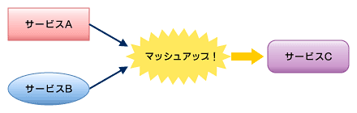

### ステージング環境

構築したシステムを本番環境と同一の条件で稼働させ、本番環境にリリースしたときに問題が発生しないかどうかのテストを行うための環境。本番環境とほぼ同じ構成や設定で作られたステージング環境でのテストにより、構築されたシステムが本番環境でも予定どおりに動作することを確認でき、本番環境への移行に伴う不具合を最小限に抑えることが可能。<b>①開発環境、②テスト環境(検証環境)、<font color=red>③ステージング環境</font>、④本番環境</b>の流れで移っていく。

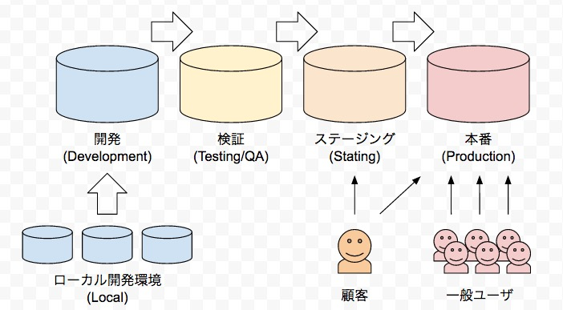

### 使用性

ISO/IEC ##6(JIS X ##9)として定義されているソフトウェア品質特性の1つ。「分かりやすさ、 使いやすさの度合い」を意味する。ISO/IEC##6(JIS X ##9) では、ソフトウェアの品質特性として次の6つと、品質特性をブレークダウンした21の品質副特性を定めています。

- **機能性(Functionality)**：目的から求められる必要な機能の実装の度合い
- **信頼性(Reliability)**：機能が正常動作し続ける度合い, 障害の起こりにくさの度合い
- **使用性(Usability)**：分かりやすさ、 使いやすさの度合い
- **効率性(Efficiency)**：目的達成のために使用する時間や資源の度合い
- **保守性(Maintainability)**：保守(改訂)作業に必要な労力の度合い
- **移植性(Portability)**：移植のしやすさ、別の環境へ移した際そのまま動作する度合い

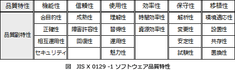

### EDoS(Economic Denial of Service)
<b>DoS攻撃の1つで攻撃対象にE(Economic)、つまり<font color=red>経済的な損失を与えることを目的とする攻撃</font></b>。クラウドサービスでは、サービスの利用量に応じて料金を支払う従量課金の料金体制となっているサービスがいくつもあります。攻撃者はこのことを悪用し、外部から不要なリクエストを大量に送りつけることで意図的にトラフィックを増加させ、契約者に本来不必要な多額の利用料を支払わせるように仕向けます。

### DRDoS (反射型DoS) 攻撃
<b>標的に対して直接攻撃パケットを送り込むのではなく、<font color=red>多数の中継サーバにリクエストを送信し、そのレスポンスが攻撃対象に向かうように仕向けるDoS攻撃</font></b>。プロトコルの中には、 リクエストに比べてレスポンスのデータサイズがはるかに多いものがあり、このような仕組みを利用して効率的に攻撃を行う。また直接的な攻撃ではないことにより攻撃元の隠ぺいにもつながります。**DRDoSに使用されるプロトコルとして、DNS、NTP、 SNMP、 Memcachedなど**がある。

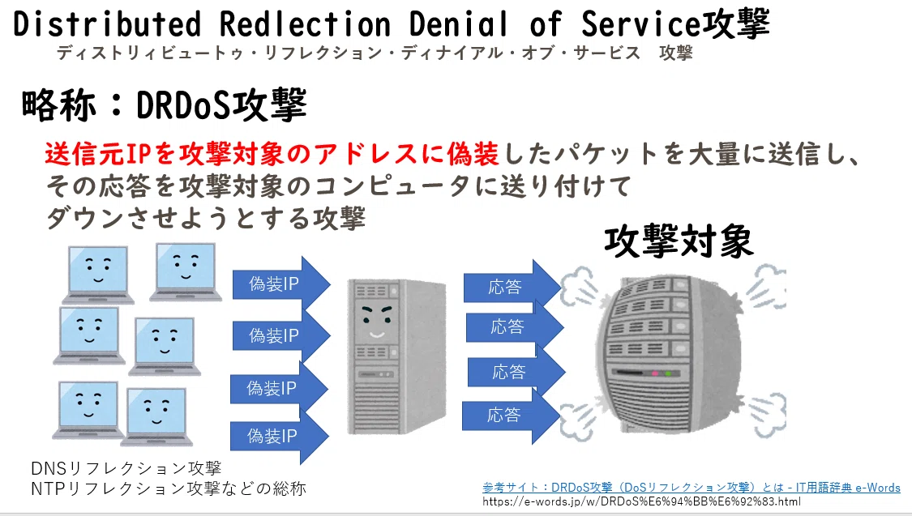

### マルチベクトル型DDoS攻撃

複数のDDoS攻撃手法を組み合わせて標的のサービス停止を狙う攻撃。DoS攻撃にはサーバのリソースを枯渇させる攻撃、ネットワーク帯域を溢れさせる攻撃、アプリケーション層の脆弱性を突く攻撃、フラッド系、スロー系など様な種類がありますが、マルチベクトル型DDoS攻撃では、これらを2つ以上同時に行うことで防御を難しくします。

### DNS水責め攻撃(ランダムサブドメイン攻撃)

脆弱性のある公開キャッシュサーバ(オープンリゾルバ)や欠陥を持つホームルータに対して、実際には存在しない幾つものサブドメインに対するDNSクエリを発行し、**権威DNSサーバへの問合せを意図的に大量発生させる攻撃**です。この攻撃を受けた権威DNSサーバは、過負荷状態となりサーバダウンやサービス停止に陥ってしまう可能性があります。**権威DNSサーバがダウンすると、管理下のドメインの名前解決ができなくなるため多数のWebサイトの利用に影響を与える**。

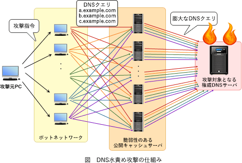

### 状態遷移図

システムがとり得る状態を円、状態の変化と変化させる条件を矢印で表現することで、「事象の発生によってシステムがどの状態に変化するか」の定義を明確に表すことができる図。時間の経過に応じて状態が変わるようなシステムの振る舞いを記述するときに適している。状態遷移図は 「有限オートマトン」の理論に基づいている。

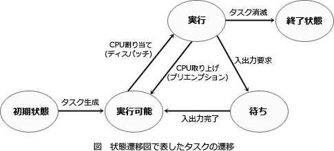

### エクスプロイトコード(Exploit Code)

ソフトウェアの脆弱性を悪用した不正な動作を再現するために作成されたスクリプトやプログラムを指す言葉。このようなプログラムは、善意の第三者や製品開発元の間で安全に流通している状況であれば問題ありませんが、 世の中に出回ると攻撃方法の詳細が広く知られることになり、攻撃者によって個人や組織への攻撃に悪用されてしまう可能性があります。実際に様々な脆弱性に対して攻撃が成功するように、複数のエクスプロイトコードをまとめたエクスプロイトキットというツールも存在し、攻撃に利用されているのが現状です。エクスプロイトコードは、多くの場合、悪意を持ったマルウェアのことを指しますが、セキュリティ向上目的での研究材料や脆弱性検査のために作成された実証用コードという意味でも用いられます。

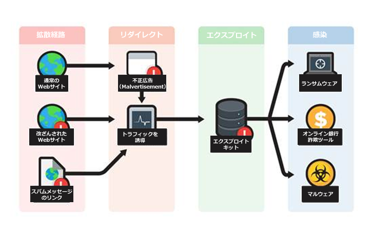


### RPO(Recovery Point Objective、目標復旧時点)/RTO(Recovery Time Objective、目標復旧時間)

RPOは障害の発生などの理由により業務が中断した場合に、過去のいつの時点までの状態に戻すのかを示す目標値を示す。RTOは災害発生時からシステムを再稼働するまでの時間を表す指標である。

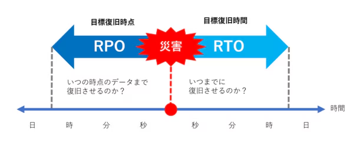

### ファイバチャネル(FC:Fibre Channel)

<b>コンピュータと周辺機器を高速かつロスレスで接続するデータ転送規格</font>で、ANSIのT11委員会によって標準化されている</b>。主にサーバとストレージを繋ぎストレージエリアネットワーク (SAN) を構築するのに用いられており、以下の特徴がある。

- TCP/IPと互換性はなく、FC0 ~ FC4までの階層化されたプロトコルを持つ。
- ホストとストレージを##で繋ぐ「ポイントツーポイント型」、1台のFCスイッチに1台
以上のストレージが繋がれる「ファブリック型」、及び複数台のホストとストレージを
ループ状に繋ぐ 調停ループ型」がある。
- <b><font color=red>伝送媒体として光ファイバケーブル又は銅線のツイストペアケーブル、同軸ケーブルが使用可能。</font></b>
- ファイバチャネルはシリアル転送方式を採用しているため、パラレルSCSIは使用不可。

### ユースケース駆動開発

<b>システムが実現する機能を適切な単位のユースケース(利用者から見たシステムの振る舞いを記述したもの)に分割し、<font color=red>ユースケースを開発の基点にして要求分析から実装までのすべての全工程をユースケース単位で進める開発手法</font></b>である。分析、設計、実装、テストの各工程の成果物がユースケースごとに作成されるため、要件ごとの開発状況を把握することが可能。

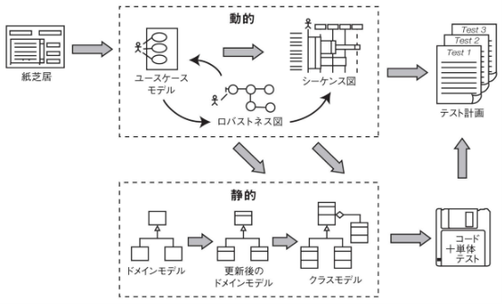

### BPMN(ビジネスプロセスモデリング表記法)
ビジネスプロセスをワークフローとして視覚的に表現するための手法です。 11個の基本要素を用いた統一的な表記法を用いることで関係者間の隔たりを埋めることを目的としています。

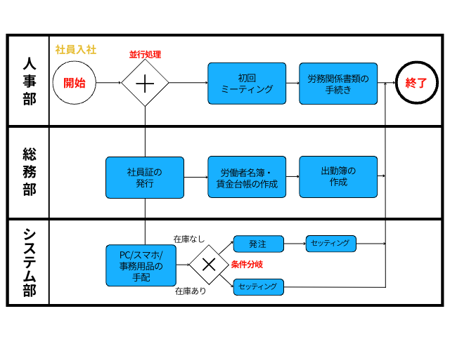

### インシデントハンドリング

インシデント発生時から解決までの一連の処理。JPCERT/CCの"インシデントハンドリングマニュアル"では、以下の基本的ハンドリングフローを定義している。

1. **検知/連絡受付**： システムからの通知や外部からの通報によってインシデントの発生を検知 (認知)する
2. **トリアージ**： あらかじめ定めておいた判断基準をもとに、インシデントへの対応の優先順位付けを行う
3. **インシデントレスポンス(対応)**：トリアージで対応すべきと判断したインシデントに対して、事象を分析し、 対応計画を立て、対応を実施する

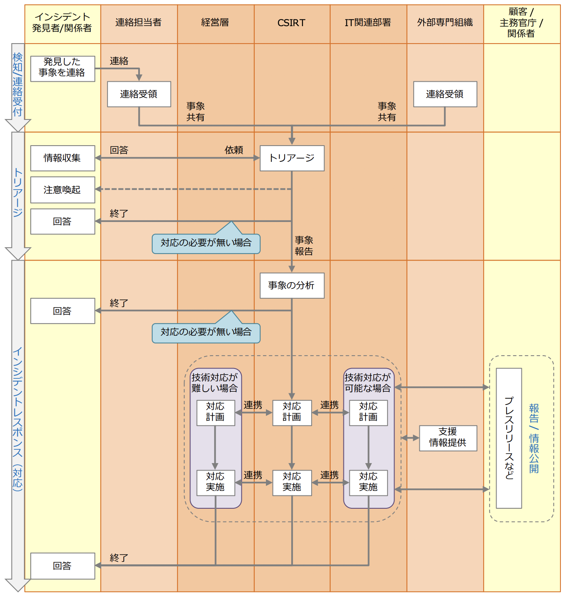

### キャパシティプランニング

情報システムの設計段階で、<b><font color=red>現状の最大負荷だけでなく、将来予測される最大負荷</font>にもサービスの水準を維持できるような設計を検討すること</b>。検討対象には、<u>①CPUやメモリの性能</u>や<u>②回線の速度</u>、<u>③経済性(規模/範囲/速度など)</u>や<u>④拡張性</u>も含まれる。キャパシティプランニングを行うことで適切なハードウェアを選定し、シンプロビジョニングや投資を最適化できる。キャパシティプランニングの実施は一般に次の手順で行います。

1. 現行システムをモニタリングし現状の処理能力を把握する
2. 将来的に予測される端末の増加、利用者数の増加などを分析する
3. 2.の分析結果からシステム能力の限界時期を予測する(サイジング?)
4. 新たなシステム構成で実現すべき性能要件から必要な八ードウエア増設を検討する

### DNSサーバのネットワーク情報の読み出し防止策

##### DNSサーバ停止の問題点と解決策
DNSサーバが停止すると、公開サービスがほぼすべて利用不能になり、また、下位ドメインが名前解決できなくなるなどの影響がある。これらの事象を予防するために、DNSサーバは障害対策や負荷分散のためにドメインごとで最低でも2台体制で運用することが求められている。2台のDNSサーバにはその役割から、<u>ゾーン情報が記録されている「プライマリサーバ」</u>と<u>プライマリからゾーン情報を取得し、その情報をもとに名前解決を行う「セカンダリサーバ」</u> があり、通常、「プライマリサーバ」はユーザー側、「セカンダリサーバ」はISP側に設置されている(セカンダリが2台以上となる場合もある)。

##### DNSサーバのネットワーク情報におけるセキュリティ設定
定期的に実行される「プライマリ」から「セカンダリ」へのゾーン情報の同期は、ゾーン転送(53/TCP)という機能を用いているが、特に制限をしていない場合「セカンダリサーバ」以外のホストからの要求でも実行可能になる。そのため<b>「プライマリサーバ」に制限がない場合、攻撃者はゾーン情報やサーバ/ネットワーク構成を不正に取得できるため、<font color=red>ゾーン転送を行うホストをセカンダリサーバのみに制限し、 ゾーン転送する情報の範囲を最小とする対策が必要</font></b>。

### CSIRT(Computer Security Incident Response Team, シーサート)

**対象範囲でセキュリティ上の問題を監視し、発生したセキュリティインシデントに対応するチームや組織の総称**。セキュリティ意識の高まりとともに企業や組織内に設置される事例が増加している。一般的にCSIRTといえば「組織内CSIRT」を指すことが多いが、広義のCSIRTは以下の6種類に分類される。

- **組織内CSIRT**：組織内のセキュリティインシデントに対応する。
- **国際連携 CSIRT**：国を代表する形で国内のインシデントに関する①報告の受け付け、②対応の支援、③発生状況の把握、④手口の分析、⑤再発防止のための対策の検討や助言などを、技術的な立場から行う。
- **コーディネーションセンター**：協力関係にあるほかのCSIRTとの情報連携や調整を行う。
- **分析センター**：インシデント傾向分析、 マルウェア解析、 痕跡分析、注意喚起などを行う。
- **ベンダーチーム**：自社製品の脆弱性に対応する。
- **インシデントレスポンスプロバイダ**：セキュリティベンダーやSoCなどのCSIRT機能の一部を請け負う事業者日本国内では"JPCERT/CC"が、国際連携CSIRTとコーディネーションセンターの役割を担っている。

### フェールオーバー (Fail Over) 
本番系システムで障害が発生したときに自動的に待機系システムへの切替えを行うことで、**実行中の処理を継ぎ目なく続行する技術、またはそれを実現するシステム構成**です。フェールオーバーのクラスタシステムでは、<u>①本番系からのハートビートパケット</u>、若しくは<u>②待機系から本番系へのヘルスチェック</u>を常時発信しており、本番系サーバの障害発生を自動検知できるようになっている。

1. 本番系サーバと待機系サーバが接続しているスイッチに対して、待機系サーバから接続しているネットワークが正常かどうかを確認する。
2. 待機系サーバは本番系サーバのディスクハートビートのログ(書込みログ)をチェックし、ネットワークに負荷が掛かってハートビート信号が届かなかったかを確認する。
3. 待機系サーバは本番系サーバの論理ドライブの専有権を奪い、ロックを掛ける。
4. 本番系サーバは，OSに対してシャットダウン要求を発行し、自ら強制シャットダウンを行う。

### ECC(Error Check and Correct)
**誤り訂正符号としてハミング符号や垂直水平パリティを用いることで、記録内容に発生した誤りを検知・自動訂正できる誤り制御方式**。また、<u>ECC機能を搭載したメモリをECCメモリ</u>という。通常のメモリでも誤り発生回数は5回／年程度に抑えられているので、家庭用や一般ビジネス向けではほぼ必要泣く、ECCメモリが必要なケースと言えるのは信頼性が極めて重要となるシステムである。例えば、長時間にわたりミスの許されない計算が求められ、誤りの発生が重大な事態に繋がりかねない学術的分野のシステムなどが挙げられる。


<div style="page-break-before:always"></div>

### RAID（Redundant Array of Independent Disks）

複数のハードディスクを組み合わせてデータの冗長性やパフォーマンスを向上させる技術。

| RAIDレベル | 構成 | 容量効率 | 冗長性 | パフォーマンス | ブロックの単位 | 特徴 |
|------------|------|----------|--------|----------------|----------------|------|
| RAID 0     | ストライピング | ##%     | なし    | 高速読み書き  | ブロック    | データが分散保存され、冗長性がないため、<br>1台のディスクが故障するとデータが失われる。 |
| RAID 1     | ミラーリング  | 50%      | 高     | 読み取り高速  | ブロック    | データが複製され、1台のディスクが<br>故障してもデータを保持する。|
| RAID 3     | ストライピング<br>＋専用パリティ | $\frac{N-1}{N}$  | 高     | 読み取り高速、<br>書き込みやや遅い | バイト | パリティ情報を専用ディスクに保存。<br>最低3台のディスクが必要。<br>1台のディスクが故障してもデータを復元可能。 |
| RAID 4     | ストライピング<br>＋専用パリティ | $\frac{N-1}{N}$  | 高     | 読み取り高速、<br>書き込みやや遅い | ブロック | RAID 3と似ているがブロック単位で<br>ストライピングを行う。パリティ情報を専用ディスクに保存。 |
| RAID 5     | ストライピング<br>＋分散パリティ | $\frac{N-1}{N}$  | 高     | 読み取り高速、<br>書き込みやや遅い | ブロック | パリティ情報を使用してデータを再構築可能。<br>最低3台のディスクが必要。1台のディスクが故障してもデータを復元可能。 |
| RAID 6     | ストライピング<br>＋ダブルパリティ | $\frac{N-2}{N}$  | 非常に高 | 読み取り高速、<br>書き込み遅い | ブロック | RAID 5のパリティを2重化した構成で、<br>2台のディスクが故障してもデータを復元可能。最低4台のディスクが必要。 |
| RAID 10    | ストライピング<br>＋ミラーリング | 50%      | 高     | 高速読み書き  | ブロック | RAID 1とRAID 0を組み合わせた構成で、冗長性とパフォーマンスの両方を提供する。<br>最低4台のディスクが必要です。 |

### ESB(Enterprise Service Bus)

**異なるアプリケーション間のリアルタイムのデータ交換をサポートするソフトウェアアーキテクチャパターン**で、SOA(サービス指向アーキテクチャ)を支えるミドルウェア。SOAのサービスコンポーネント同士をバス型のトポロジーで接続します。ESBは内部で様々な形式やプロトロルのメッセージの相互変換、データのルーティング、非同期連携などを行い、様々なアプリケーションの統合を支援します。


<div style="page-break-before:always"></div>

## 午後問題対策

### こうきたらこう考える

| パターン | 解き方 |
| -- | -- |
| この帳票を出力するために<br>**なぜ外部結合が必要**か？ | **①外部結合を使わないと結合元の一方のテーブルのみにある行が出力されないこと**と、<br>**②それにより出力結果のレイアウトがどうなるのか**、を本文の具体例を使って構成。 |
| この帳票を出すのに<br>**なぜCOALESCEを使用するのか？** | 「**ある結果がNULLだと出力結果のレイアウトが○○になるため、<br>NULLでなく0として扱いたい**」という内容を本文の具体例を使って構成。 |
| ①内部結合の結果と、<br>②IN句やEXISTS句を利用した同様の処理結果で、<br>**なぜ件数が異なる**のか？	 | **内部結合ではDISTINCTを用いない限り重複行を複数件カウントするが、<br>IN句やEXISTS句では重複行を1件としてカウントするため**。<br>（参考）<br>DISTINCTはNULLも１行として集約する<br>COUNTはNULLをカウントしない |
| ［スーパータイプ／サブタイプの問題において］<br>○○は△△にも××にも属することがある。<br>この場合、現状の設計では表現できない。	 | <b>スーパータイプにサブタイプ数分のフラグ列を作り、<br>両方に属するものについては両方のフラグを立てる</b>。|
| スーパータイプ／サブタイプの関係にあるテーブルにおいて、<br>サブタイプを共存的サブタイプにしたい | **スーパータイプに各サブタイプのフラグを持てるよう属性を追加する**。 |
| **多対多のリレーションの解消方法** | 間に**関連エンティティを追加**し、<br>それぞれのキーを関連エンティティに持たせることで１対多の関係にする。 |
| **なぜビューを使うのか** | **複雑なSQLを何度も書く必要がないから**。<br>（ビューは毎回演算を行うので、最新の情報を反映させることが可能。<br><b>一方でビューによるパフォーマンス劣化を気にする場合は、<br>データベースにデータを格納した体現ビューを作成することもできる</b><br>[ただし、予めデータを格納するので、更新頻度等によってはデータ不整合が起こる]） |
| **更新可能なビューはどれか** | ①GROUP BY句、②HAVING句、③DISTINCT句、④計算列、⑤集約関数のいずれも<br>使用していないビューは更新可能<br>（**行を集約するとビューで更新した行が基底表のどの行に該当するか追えなくなるから**） |
| **なぜストアドプロシージャーを使うのか**	 | **処理の高速化と通信量の削減のため** |
| **なぜ正規化を行うのか** | **整合性を担保し、更新時異常を排除するため** |
| 所属や売上明細など、**当時の記録が追う方法は何か** | **①履歴管理をするために配属開始日や売上発生日時を主キーとしてもたせる**、<br>もしくは（正規化を崩すことになるが）**②当時の情報を明細行などにもたせる**<br>（例えば当時の単価など）。 |
| **結合が多いSQLのパフォーマンスを向上させたい** | **導出属性(平均や合計のような既存の属性から論理的に導き出せる属性)をもたせる**。<br>これにより、結合コストを下げることができる。<br>デメリットとしては定期的に更新しないと導出属性の情報が古くなる。 |
| 大概、入出庫に係る業務で<br>「指図と実績」は「##」の関係となる | 例えば、製品出庫指図が製品単位であり、製品出庫実績も１つの倉庫から出荷される<br>場合などが該当する。実績-実績も##になることが多く感じる。例えば、<br>生産された製品が毎回同じ倉庫に入庫される場合、入庫と生産の実績は##になる。 |
| 区画と区画内探索 | この問題が出題された場合、対象となるテーブルはレコードの発生順に並んでおり、<br>年月で区切ることが多い。区画を年月で区切り、それがSQLの探索条件となる場合、<br>区画を特定できるが、探索条件とならない場合は区画を特定できない。<br>また、区画を特定した後、索引が区分内のクラスタ索引となる場合、<br>連続するページにアクセスできることになり効率的な探索となる。 |
| 出荷業務について、<b>複数の受注であっても、<br>同じ納品予定年月日に同じ送り先の場合は<br>１つにまとめて出荷する</b>。また、<br><b>１つの受注の受注明細が別の出荷となる場合がある</b>。<br>（在庫が不足する場合など）	 | この時、出荷と受注は多対多、出荷と出荷明細は１対多、<br>受注と受注明細は１対多になり、出荷明細行と受注明細行が##で対応する。<br>【複数の受注について】<br>同日の出荷をまとめるような処理をする場合の出荷テーブルを回答する問題においては、<br>一度、<b>出荷・出荷明細テーブルを１つのテーブルに非正規化し、<br>そこから、テーブルを再度、組み立てる</b>。 |
| **スループットが低下する原因** | コミットしないことによりトランザクションAが更新時の専有ロックを保持しつづけ、**他のトランザクションが専有ロックの解放まちになっているパターン**などがある。 |
| <b>○○開始年月のような列が<br>主キーの一部となっていないことによる不具合</b> | 該当列を保持するテーブルに対して想定される不具合について、多くの場合、<br>**履歴が保持されていないことによる当時のレコードを追えないことに起因**する。 |
| 最初の表が○○明細など網羅的な表で、<br>続く結合表が結合列が歯抜けになるような<br>疎な表のSQLのJOINについて問われた場合 | 大抵、<b>LEFT JOINになる。これは<br><font color=red>情報の取りこぼしがなくすため</font>である。</b> |
| 2つの○○JOIN（○○には結合の種類が入る）を<br>UNIONでつなぐ場合	 | <b>大抵、○○にはINNERが入る。なぜかというと、<br><font color=red>それぞれJOINの内部結合で両方の表にある行だけを残す（抜け落ちる行がある）が、これをUNIONで補うことができるから</font></b>。（イメージ的には$A\cup B$のような和集合） |
| **DBのデータ暗号化による<br>セキュリティと性能のトレードオフ** | **暗号化したデータの索引が機能しなくなり、検索等の性能が劣化**する。<br>また、**あいまい検索を行う場合、データが暗号化されたままでは検索ができない**。<br>※完全一致ならハッシュ同士の比較で検索可能。 |
| APの暗号化・復号化関数で<br>**DBのデータを暗号化・復号化している**場合の<br>セキュリティについて | DBのデータを単体で盗んでも暗号化されたデータは復号できない。**復号するには、<br>復号化関数名と鍵（通常はAES等の共通鍵なので暗号鍵と復号鍵は同一）を<br>盗む必要がある**。これには、<font color=red>メモリダンプや通信経路のパケット盗難等の技術が必要</font>である。 |
| **暗号化されたデータの検索性能**について | データの暗号化を行うと、<u>暗号化されたデータについてインデックスが付与される</u>。<br>そのため、暗号化前のデータを対象にした検索においてインデックスは使用されない。<br><b><font color=red>完全一致検索では、暗号化されたデータ同士を比較できるためインデックスが使われるが、<br>LIKE等を使った部分一致では、一度、復号化しなければならないため性能が劣化する</font></b>。<br>※APで暗号化・復号化を行う場合、SQLによる対話的なデータ検索を行えなくなり、<br>APを介して検索する必要がある。 |
| **冗長なリレーションシップ** | 一見、エンティティ間にリレーションシップが必要と思われる記述があったとしても、<br>対象となるエンティティが、既存のリレーションをたどって辿り着くのであれば<br>(＝結合により必要な属性は得られるなら)、それは冗長なリレーションシップとなり不要である。 |
| **排他的リレーションシップ（アーク）** | 1つのエンティティを2つのサブタイプに分離し、それぞれのサブタイプに向けて、<br>異なるカーディナリティのリレーションを設定しなければならない場合があるが、<br>本試験においてはエンティティの追加が許可されていない場合がある。<br>その場合、2つのサブタイプへ分離はせず、もともとあった1つのエンティティに<br>2つのリレーションが発生する場合がある。これを排他的リレーションシップと呼び、<br>望ましい設計ではないことを認識しておく必要がある。 |
| 「同時期には一つだけ登録できる」 | 左記の記述があった場合、例えば社員の所属などは所属開始日等も含めて主キーとし、履歴管理されると考えて良い。 |
| **肥大化するテーブルにおいて**、<br>途中でコミットを発行せずにバッチ処理を続け、<br>**最後に1度だけコミットする作りとなっていた場合に<br>途中で失敗した場合どうなるか**	 | **ロールバック処理（アボート処理）に要する時間が日に日に長くなる。** |
| 予約システム等で予約する際に<br>**予約行をInsertすると失敗する**	 | <b>ダブルブッキングを防ぐために<font color=red>主キーの重複で登録できないよう制御している</font>ため</b>。 |
| Aテーブルを1行読むたびに<br>Bテーブルを1行更新するような場合に、<br>Aテーブルの読み込み順が<br>Bテーブルの索引順でない読み込み<br>となる場合のページ数はどうなるか	 | Bテーブルの探索は読み込んだページ内で連続して読み込むことができない<br>（バッファヒットせずにランダムアクセスとなる）ため、<br>Aテーブルの読み込み行数＝Bテーブルのページリード数となる。 |

### 解答パターン　午後1＆午後2

#### 問題文を読んでいて疑問に思うパターン

- **問題文に記述されている属性やテーブルがない**： 　よくあるパターンのNo1。問題文とER図や関係スキーマを確認し、該当するテーブルや属性があるかどうかを探す。無ければ虫食い問題になっている可能性が高い。
- **履歴が残せない**： 商品マスタに商品金額が記述されているが、売上げ伝票（売上げ明細）に個別の商品金額を記録できないようなパターン。この場合、商品マスタの金額を変更してしまうと過去に売り上げた伝票の商品金額もすべて変更されてしまうことになるので問題になる。売上げ時の金額を残せないというのは問題にされる可能性がある。
- **正規化されていない**： 正規化されていないと同じ情報を重複して登録してしまう可能性がでてくる。例えば商品を販売するたびに売上げ伝票に顧客の名前、住所、電話番号を登録するような場合だ。この場合、顧客の電話番号が変わったりしたとき、過去の売上げ時に入力された顧客情報と整合性がとれなくなるので問題になる。
- **属性の変更を考慮していない**： 営業部員の売上げの成績は保存されるが、売上げ時の営業部員が所属していた支社の情報が記録されないパターン。例えば従業員マスタで営業部員と所属する支社の紐付けがされているとする。そうすれば従業員と支社の紐付けがされているので、営業部員の売上げ成績から支社別の売上げ成績も導きだすことができる。しかし会社には異動が付きもの。もし従業員マスタで従業員が異動し現在の所属先の支社に変更されてしまったら、その従業員の過去の売上げも新しい支社の売上げとして計算されてしまうことになる。従業員と支社の関係以外にも、商品と商品価格、商品と商品の仕入れ先など、その時々によって変更する可能性があるものをマスタ的に登録していると不整合が生じる可能性があるので、そのあたりを見たときに疑問を感じてチェックしておくことが重要。
- **わざと冗長に記録させるパターン**： 集計などを早く行うために売上げ伝票に売上げ詳細の合計金額などを記録させるパターン。通常、売上げ伝票ごとの金額は売上げ詳細テーブルに記載されている商品金額×販売数の合計を計算して求めるが、詳細が多くなると計算に時間がかかってしまう場合がある。この場合、売上伝票に合計金額を保存しておけば売上げ詳細テーブルの演算を行わなくて済むので計算が早く済む。しかし誤発注などのため売上げ詳細テーブルの金額や商品販売数が修正されると合計金額が変わってしまう。そうなると売上げ伝票テーブルに記録した合計金額と数字のズレがでてしまうが、これを考慮したロジックになっていないと問題が発生してしまう。問題文中にそれら整合性をどうするかの説明がないと疑問に感じなければならないパターンだ。

#### テーブルの新規作成パターン
- **他のデータを束ねる**： 新たに他のデータをまとめるためのテーブルを新規作成するパターン。例えばカラオケボックスで、通常は1部屋に対して1枚の売上伝票で別々に精算しなければならないものをグループで複数の部屋を借りたときにまとめて支払いたいというようなパターンだ。飲食店で席が別々になってしまったグループの複数の伝票をまとめて支払いたいなどというようなパターンにも当てはまる。この場合には、例えば下記の画像のように新しく「まとめテーブル」などを新規作成し、その「まとめ番号」などを売上げ伝票テーブルに新たに作成したまとめ番号属性に保存することで実現する。こうすると、これまで客室ごとに一枚の伝票だったものが一つのまとめ番号で紐付けされるので複数の部屋でもまとめて支払いが可能になる。
- **連関テーブル**： 業務プロセスの変更で、テーブルのリレーションシップが1対多から、多対多になってしまいそれを表現するために連関テーブルを新規作成するパターン。例えば支社と従業員の関係で、これまで従業員は一つの支社にしか所属していなかったのに、業務プロセス等の変更で従業員が複数の支社に所属するように変更され、支社－従業員が1対多の関係だったものが多対多になってしまったパターンなどが該当する。この場合、多対多の関係を表現するために連関テーフルを新規で作成することで対応する。
- **マスタテーブルとして追加する**： 業務プロセスの変更で、新たなマスタテーブルを追加しなければならなくなるパターン。例えば飲食店でこれまで「商品」だけだったものを、料理、ドリンク、セット定食などというように商品カテゴリで商品を分ける必要があり、商品区分マスタなどとして新たなテーブルを作成するパターンなどだ。商品区分マスタに区分コード、区分名などの属性を作成し、商品テーブルに新たに商品区分属性を作成して区分コードを保存することで対応する。
- **サブタイプの追加**： 業務プロセスの変更で、新たなサブタイプを作成するパターン。例えば食料品メーカで使用する野菜に関して、これまで通常の野菜と有機野菜のみの区別だったものに、輸入野菜という新たな分類となる野菜を使用するために、輸入野菜を管理する新たな属性を追加する必要になるパターンなどだ。この他にも、製造業で自社部品だけでなく他社製造部品も利用するようになり、部品を自社と他社で別の属性で管理する必要になったというパターンや、飲食店で同じレシピの料理だけどセット商品として提供する場合と単品で提供する場合によって異なる属性で管理したいというパターンなどがある。主に「同じ商品」なんだけど、製造元が異なったり、提供先や提供方法が異なるため、その場合だけ別々に管理したいというような場合に新たなサブタイプとしてテーブルを新規追加することが必要になるパターンである。

#### テーブルへのフィールド新規追加パターン
- **行の属性を表現するための属性の追加**： 商品マスタなどで、その商品に関する属性を追加させるパターン。例えば飲食店で提供する料理を飲み物と料理に区別して売上げを集計したいとか、ホテルの部屋を喫煙室と禁煙室に区別して予約を受け付けたいというパターンだ。この場合、料理マスタに「商品区分」などの属性を追加したり、ホテルの部屋を禁煙と喫煙に区別するために部屋マスタに「喫煙区分」を追加するなどが該当する。
- **集計行を追加するための属性追加**： 部品マスタなどで、その部品の在庫数を保存する属性を追加させるパターン。例えば製造メーカでこれまでは半製品の在庫を記録していなかったが業務効率改善のために半製品の在庫数を保存する必要がでてきたなどのパターンだ。この場合、半製品マスタに「在庫数」などの属性を追加するなどが該当する。
- **履歴を残すための属性追加**： 商品マスタなどで、その商品の価格の履歴を保存する属性を追加させるパターン。例えば製造メーカでこれまで商品の値段は同じであったがこれからは頻繁に価格を反映させたいので履歴を残しておく必要があるとか、飲食店で一定期間だけ料理を特別価格として安く販売したいので過去の販売金額の履歴を残したいとか、従業員の過去の所属部署を履歴として残しておきたいというパターンだ。この場合、商品マスタに「販売開始日」などの属性を追加したり、料理マスタに「販売開始日」などの属性を追加したり、社員マスタに「配属日」などの属性を追加することなどが該当する。このパターンは、これまで普通だったただの縦横の表に、突然時系列という時間の流れという概念を取り入れなければならないので発想の転換が必要になり難易度が高い。このパターンでは例えば商品価格では、商品の価格を変更するたびに販売開始日を設定して新たに行を作ることになる。従って、例えば｛商品コード、販売開始日｝が候補キーになる。販売開始日を設定することで、例えば下記の例だと商品コード##1の製品は、######1日から######1日まで##円で販売していたことがわかるということになる。またこのパターンでは、将来に対する価格変更の予約のようなことも可能になる。例えば、####月1日から新価格で販売することを事前登録しておくということも可能。
- 

#### 正規化に関する解答パターン
- **第一正規形でない理由（正規化されていない理由）**： 属性○○は属性△△の集合であり<u>単一値ではない</u>ため。属性○○が繰り返し項目であり<u>単一値ではない</u>ため。
- **第一正規形の理由**： すべての属性が単一値で、候補キーＡ、Ｂの一部であるＢに非キー属性のＣが部分関数従属するため。候補キーに<u>完全関数従属していない</u>から。
- **第二正規形の理由**： すべての属性が単一値で、候補キーからの<u>部分関数従属がなく、推移的関数従属性Ａ→Ｂ→Ｃがある</u>ため
- **第三正規形の理由**： すべての属性が単一値で、候補キーからの<u>部分関数従属がなく、候補キーからの推移的関数従属性もない</u>ため
- **ボイスコッド正規形の理由**： すべての属性が単一値で、すべての関数従属性が自明であるか、候補キーのみを決定項として与えられている
- **第四正規形の理由**： すべての属性が単一値で、すべての<u>多値従属性</u>が、自明であるか、候補キーのみを決定項として与えられている
- **第五正規形の理由**： すべての属性が単一値で、すべての<u>結合従属性</u>が、自明であるか、候補キーのみを決定項として与えられている


#### 結合に関する解答パターン
- **集計時に外部結合する理由**： すべての○○（例：店舗）に対して△△（例：売上げ）が存在するとは限らないが、すべての○○ごとに集計して結果を出力するから


