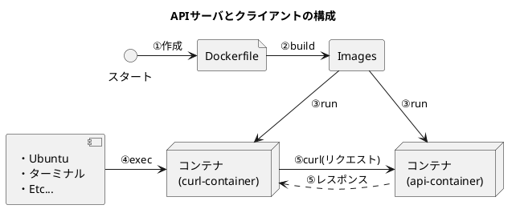
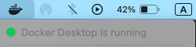
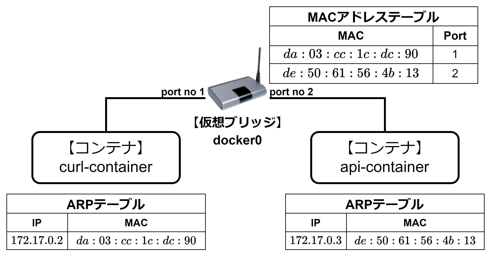
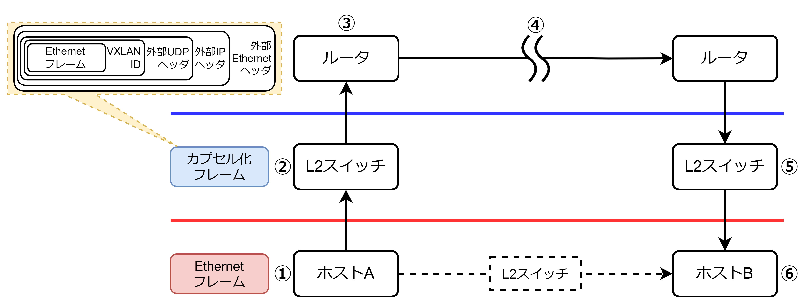
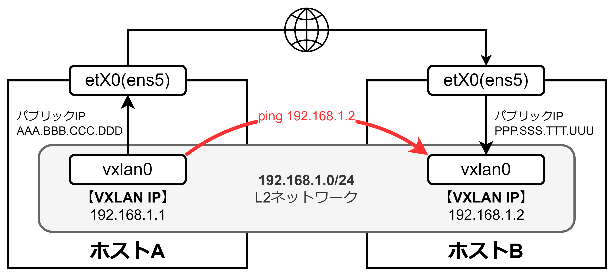
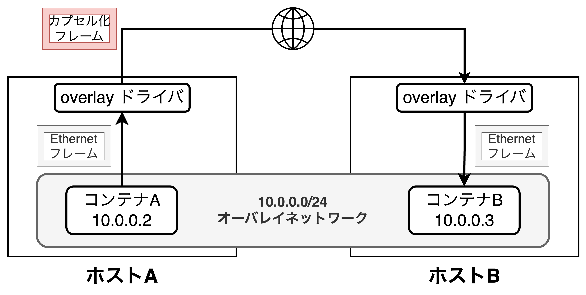
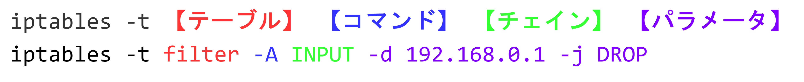
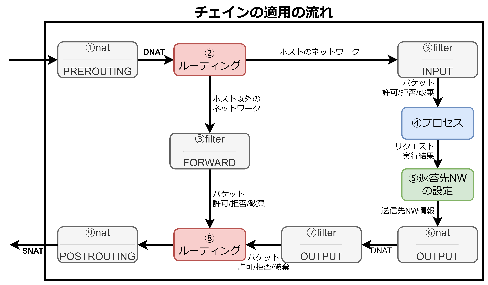
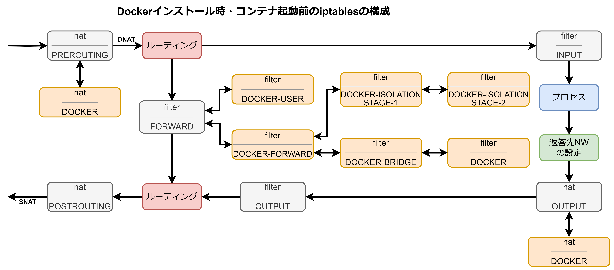

<style>
    body {
      counter-reset: chapter 1;
    }
    h1 {
        counter-reset: sub-chapter;
    }
    h2 {
        counter-reset: section;
    }

    h1::before {
        counter-increment: chapter;
        content: "第" counter(chapter) "章 ";
    }
    h2::before {
        counter-increment: sub-chapter;
        content: counter(chapter) "-" counter(sub-chapter) " ";
    }
    h3::before {
        counter-increment: section;
        content: counter(chapter) "-" counter(sub-chapter) "-" counter(section) " ";
    }
</style>

# Dockerネットワークの要素技術

## Dokcerネットワークの全体像と技術

- 本説では、`Docker`を使用したネットワークの操作方法と基本的な構成について解説する。具体的には2つのコンテナ(APIサーバである`api-container`とクライアントである`curl-container`)を起動し、相互通信を行う方法を説明する。
- また、Dockerネットワークの構成要素であるVXLAN、Network Namespace、iptablesについても紹介し、Dockerの基本的な使い方とDockerネットワークで使われている技術の全体像を把握することで第3章の素地を作る。

### Dockerの基本操作



- Dockerの基本操作を説明するために2つのコンテナを起動する。具体的には以下の手順で実行する。
  1. Dockerfile作成
  2. `docker build -t test-image ./`を実行し、コンテナイメージをビルドする。
  3. 2つのコンテナ(`api-container`と`curl-container`)を起動
  4. `curl-container`にターミナルからアクセス
  5. curlコマンドを実行し、`api-container`にリクエストを送る

#### ②コンテナイメージのビルド

##### 【前提】docker desktopが起動している



##### 実行結果

```bash
# コンテナイメージのビルド
$ docker build -t test-image ./ # -t オプションでイメージ名を指定
[+] Building 3.5s (10/10) FINISHED                         docker:desktop-linux
 => [internal] load build definition from Dockerfile                       0.0s
 => => transferring dockerfile: 157B                                       0.0s
 => [internal] load metadata for docker.io/library/python:3.12.3-alpine    3.3s
 => [internal] load .dockerignore                                          0.0s
 => => transferring context: 2B                                            0.0s
 => [internal] load build context                                          0.0s
 => => transferring context: 238B                                          0.0s
 => [1/5] FROM docker.io/library/python:3.12.3-alpine@sha256:32385e61c341  0.0s
 => => resolve docker.io/library/python:3.12.3-alpine@sha256:32385e61c341  0.0s
 => CACHED [2/5] ADD app.py /app/                                          0.0s
 => CACHED [3/5] WORKDIR /app/                                             0.0s
 => CACHED [4/5] RUN pip install flask                                     0.0s
 => CACHED [5/5] RUN apk add curl                                          0.0s
 => exporting to image                                                     0.1s
 => => exporting layers                                                    0.0s
 => => exporting manifest sha256:fe10b4c72aa16a43e08bb29a6e35d2782f1bc843  0.0s
 => => exporting config sha256:5d5d74d5e7730ae35593984e4eab582d52a9e24f14  0.0s
 => => exporting attestation manifest sha256:89ab27a0d944f8ad7ad6b251e79d  0.0s
 => => exporting manifest list sha256:70af50a2b651e9660aed35e0c11db38386a  0.0s
 => => naming to docker.io/library/test-image:latest                       0.0s
 => => unpacking to docker.io/library/test-image:latest                    0.1s

# コンテナイメージの確認
$ docker images
REPOSITORY   TAG       IMAGE ID       CREATED       SIZE
test-image   latest    70af50a2b651   4 hours ago   122MB # ビルドしたイメージ
```

<div style="page-break-before:always"></div>

#### ③コンテナの起動

- `-i`オプション: コンテナの標準入出力を有効にし、対話式の操作を可能にする。
- `-t`オプション: 擬似ターミナル(TTY)を確保する。
- `-d`オプション: コンテナをバックグラウンドで実行する。
- `--name`オプション: コンテナに名前を割り当てる。

```bash
# APIサーバのコンテナ起動
$ docker run -ti -d --name="api-container" test-image
8cce44627cb06f5b098d3634da0fc603c3aa44a4caf85c7e3a54e3afb0042872

# クライアントのコンテナ起動
$ docker run -ti -d --name="curl-container" test-image 
f94308e406f1a1abadd4e773372d6a4b913178b0f3c034ca322867c1753a52f5

$ docker ps # コンテナの確認
CONTAINER ID   IMAGE        COMMAND           STATUS          NAMES
8cce44627cb0   test-image   "python app.py"   Up 22 seconds   api-container
f94308e406f1   test-image   "python app.py"   Up 29 seconds   curl-container
```

#### ④コンテナにアクセス

- `$ docker exec -ti 【コンテナ名】 sh`を実行し、コンテナにアクセスする。

##### IPアドレスの確認方法

```bash
# 【確認方法1】
$ docker inspect --format='{{range .NetworkSettings.Networks}}{{.IPAddress}}{{end}}' \\
api-container
172.17.0.3 # api-containerのIP
$ docker inspect --format='{{range .NetworkSettings.Networks}}{{.IPAddress}}{{end}}' \\
curl-container
172.17.0.2 # curl-containerのIP

# 【確認方法2】コンテナアクセスで確認する方法
$ docker exec -ti api-container sh
/app  hostname -i
172.17.0.3 # api-containerのIP確認
$ docker exec -ti curl-container sh
/app  hostname -i
172.17.0.2 # curl-containerのIP
```

#### ⑤API実行

```plantuml
title コンテナ間のAPI通信
left to right direction

rectangle ホスト {
    node "【**コンテナ**】\ncurl-container" as curl
    node "【**コンテナ**】\napi-container" as api
}

curl --> api: APIリクエスト
api --> curl: APIレスポンス
```

```bash
# 疎通確認
$ docker exec -ti curl-container sh # コンテナアクセス
/app ping 172.17.0.3
PING 172.17.0.3 (172.17.0.3): 56 data bytes
64 bytes from 172.17.0.3: seq=0 ttl=64 time=0.300 ms
64 bytes from 172.17.0.3: seq=1 ttl=64 time=0.186 ms
64 bytes from 172.17.0.3: seq=2 ttl=64 time=0.178 ms
64 bytes from 172.17.0.3: seq=3 ttl=64 time=0.184 ms
64 bytes from 172.17.0.3: seq=4 ttl=64 time=0.191 ms
64 bytes from 172.17.0.3: seq=5 ttl=64 time=0.174 ms
--- 172.17.0.3 ping statistics ---
6 packets transmitted, 6 packets received, 0% packet loss
round-trip min/avg/max = 0.174/0.202/0.300 ms

# APIリクエスト
/app curl 172.17.0.3:5000
Hello World! # 出力結果

# 存在しないIPへのAPIリクエスト(失敗の確認)
/app curl 172.17.0.4:5000 
curl: (7) Failed to connect to 172.17.0.4 port 5000 after 3057 ms:
Could not connect to server
```

<div style="page-break-before:always"></div>

#### 【補足: イメージ削除】コンテナで利用されている場合エラーが出る

```bash
# イメージ削除(コンテナに利用されている場合エラーが出る)
$ docker rmi test-image
Error response from daemon: conflict: unable to delete test-image:latest 
(must be forced) - container b3b5659ca415 is using its referenced image 70af50a2b651

# コンテナ停止と削除
$ docker stop curl-container api-container
curl-container
api-container
$ docker rm curl-container api-container  
curl-container
api-container

# イメージ削除
$ docker rmi test-image                 
Untagged: test-image:latest
Deleted: sha256:70af50a2b651e9660aed35e0c11db38386a59b7d4e71f4b15f6cd906f2048584
```

#### 【補足: コンテナ削除】コンテナが起動中の場合エラーが出る

```bash
# コンテナ確認
$ docker ps
CONTAINER ID   IMAGE        COMMAND           STATUS        NAMES
b3b5659ca415   test-image   "python app.py"   Up 5 minutes  curl-container

# コンテナ削除(コンテナが起動中の場合エラーが出る)
$ docker rm curl-container
Error response from daemon: cannot remove container "curl-container": container is 
running: stop the container before removing or force remove # エラー

# コンテナ停止と削除
$ docker stop curl-container
curl-container # 停止したコンテナ
$ docker rm curl-container
curl-container # 削除したコンテナ

# コンテナ確認
$ docker ps # コンテナがないことを確認
CONTAINER ID   IMAGE        COMMAND           STATUS        NAMES
```

### Dockerの基本的なネットワーク構成と要素技術

```plantuml
title Dockerコンテナのネットワーク構成

cloud ネットワーク as internet
rectangle ホスト {
    storage eth0 as eth1
    rectangle iptables as iptables
    rectangle ホストのnetns {
        rectangle 仮想ブリッジ as bridge
        rectangle "vethXXXXX" as veth1
        rectangle "vethXXXXX" as veth2
        veth1 - bridge
        bridge - veth2
    }
    rectangle "【**Network Namespace**】\nnetns1" as netns1 {
        storage eth0 as eth2
        node "**【コンテナ】**\ncurl-container" as curl
        eth2 -- curl
    }
    rectangle "【**Network Namespace**】\nnetns2" as netns2 {
        storage eth0 as eth3
        node "**【コンテナ】**\napi-container" as api
        eth3 -- api
    }
    eth1 - iptables
    iptables -- bridge
    veth1 -- eth2
    veth2 -- eth3
}
note right of iptables
【**重要**】
Linuxシステムの重要ツール。
FWとルータの機能を提供。
end note
note right of veth2
【**重要**】
仮想ネットワークインタフェース。
end note
note right of netns2
【**重要**】
Network Namespace。
Linuxのリソース仮想化技術の1つ。
end note
internet -- eth1
```

- `Docker`では、`Linux`に備わっている複数の技術を組み合わせ、コンテナが通常のホストと同様にネットワーク通信できる。
- 上図の使用技術は`VXLAN`、`iptables`、`仮想ブリッジ`、仮想ネットワークインタフェース(`veth`)、Network Namespace(`netns`)があり、中でも`VXLAN`、`netns`、`iptables`の3つは重要技術である。

<div style="page-break-before:always"></div>

#### VXLAN

- VXLAN（Virtual eXtensible Local Area Network）はVLAN（Virtual Local Area Network）の機能を拡張した技術である。VLANは仮想的にネットワークを分割でき、最大約「4,000」まで分割できる。一方、**VXLAN技術は24ビットの仮想ネットワーク識別子(VNI)を使用することで約1,600万のネットワークセグメントをサポート可能**であり、大規模なネットワーク構成を実現できる。
- VXLANはEthernetフレームをUDP/IPパケットでカプセル化することも特徴の1つであり、<u>Ethernetフレームは自身のIPアドレスやMACアドレスを変更することなく、異なるネットワークセグメント間を移動できる</u>。これにより、**コンテナのポータビリティ(移植性)を大きく向上させることができる**。例えば、あるホスト上で稼働しているコンテナを別ホストに移動させる場合でもネットワーク設定を変更せずに動作可能になり、有用性がある。

#### Network Namespace

- Network Namespace(netns)はLinuxのリソース仮想化技術の1つであり、ネットワーク関連のリソースを隔離して管理するための機能である。
- 通常、システム内のネットワークインタフェース（例: eth0、eth1）、ルーティングテーブル、ソケットなどのネットワークスタックは`netns`に紐づけられており、それぞれのネットワークスタックを独立させて動作させることが可能。
- <font color=red>各コンテナに固有の`netns`を割り当てることで、そのコンテナはホストや他のコンテナのネットワーク設定に影響を与えることなく、独自のネットワークスタックを持つことができる</font>。

#### iptables

- `iptables`はLinuxシステムにおける重要なツールで、FWとルータの機能を提供する。`iptables`はパケットフィルタリング、ネットワークアドレス変換(NAT)、ポート転送など幅広いネットワーク関連のタスクを実行するのに使用され、外部からのパケットをフィルタリングし、内部ネットワークへのパケットのルーティングを制御できる。
- デメリットとして、チェインとテーブルの概念を筆頭にフィルタリングの方法やその順番など、`iptables`の用語やしくみの理解が難しいことが挙げられる。

## インターネットの通信の全体像

### Dockerコンテナの通信

- 本節ではIPアドレスとMACアドレスがどのように使われているかを見ていく。

#### ネットワーク構成

```plantuml
title Dockerコンテナ環境のネットワーク構成
left to right direction

rectangle "ホスト" {
    rectangle "【**仮想ブリッジ**】\ndocker0" {
        interface veth as veth1
        interface veth as veth2
    }
    node curl [
        【**コンテナ**】
        curl-container
        172.17.0.2
        da:03:cc:1c:dc:90
    ]
    node api [
        【**コンテナ**】
        api-container
        172.17.0.3
        de:50:61:56:4b:13
    ]
}

veth1 .. veth2
curl <--> veth1
veth2 <--> api
```

- <font color=red>`Docker`では、docker0という仮想ブリッジがデフォルトで設定されており、Dockerコンテナが外部と通信するため温ゲートウェイの役割を果たす</font>。
- `brctl show`コマンドで確認することができる。docker0というブリッジには2つのインタフェースがあり、<u>それぞれのinterfacesの値は仮想インターフェース(`veth`)のIDを表す</u>。
- `docker inspect`コマンドで各コンテナの固有IPアドレスとMACアドレスを調べる。

```bash
# コンテナの再起動(キャッシュ削除)
$ docker restart curl-container api-container
curl-container
api-container

# 【Ubuntu】ブリッジ確認
$ brctl show
bridge name     bridge id               STP enabled     interfaces
docker0         8000.024207321623       no              veth79220b8 # 1つ目のinterfaces
                                                        vethd5c7a40 # 2つ目のinterfaces

# IPアドレスとMACアドレスの確認
docker inspect --format='{{range .NetworkSettings.Networks}}{{.IPAddress}}{{end}}' \\
    api-container curl-container
172.17.0.3 # 出力結果
172.17.0.2 # 出力結果
$  docker inspect --format='{{range .NetworkSettings.Networks}}{{.MacAddress}}{{end}}' \\
    api-container curl-container
de:50:61:56:4b:13 # 出力結果
da:03:cc:1c:dc:90 # 出力結果
```

#### ARPテーブルとMACアドレステーブル

- コンテナ間で通信させる前に**①IPアドレスからMACアドレスを特定する方法**と**②MACアドレスから通信先のコンテナを特定する方法**を学ぶ。
- ①は`ARP`コマンド、②は`brctl showmacs`コマンドを実行する。いずれも目的は同じであるため、以下のように1つの例で説明する。

##### ARPテーブルとMACアドレステーブル

- 初期状態では、MACアドレステーブルとARPテーブルともに、どのコンテナの情報を持たない。

```bash
#########################
####### 1.初期状態 #######
#########################

# ブリッジ確認
$ brctl show
bridge name     bridge id               STP enabled     interfaces
docker0         8000.ba57bb57b194       no              veth3be7de3
                                                        veth996769c

# ブリッジのMACアドレステーブル確認(初期状態)
$ brctl showmacs docker0 # vethのMACアドレスのみ出力される
port no mac addr                is local?       ageing timer
  1     32:83:e5:b8:74:de       yes                0.00
  1     32:83:e5:b8:74:de       yes                0.00
  2     fa:fc:2a:dd:23:43       yes                0.00
  2     fa:fc:2a:dd:23:43       yes                0.00

# curl-containerコンテナに入る
$ docker exec -ti curl-container sh

# ARPテーブル確認(初期状態)
$ arp # → まだ一度も通信が発生していないため、何も出力されない
```

<div style="page-break-before:always"></div>

- 通信後の状態として、以下のことがわかる
- 【**ARPテーブル**】
  - `172.17.0.2`へ通信するためには`da:03:cc:1c:dc:90`というMACアドレスをEthernetヘッダにつける(**curl-container**)
  - `172.17.0.3`へ通信するためには`de:50:61:56:4b:13`というMACアドレスをEthernetヘッダにつける(**api-container**)
- 【**MACアドレステーブル**】
  - **curl-container**のMACアドレス`da:03:cc:1c:dc:90`にアクセス要求が来た場合は<b>`port no 1`</b>のコンテナに接続する
  - **api-container**のMACアドレス`de:50:61:56:4b:13`にアクセス要求が来た場合は<b>`port no 2`</b>のコンテナに接続する

```bash
#########################
##### 2.通信後の状態 #####
#########################

# 通信後にARPテーブル確認
$ curl 172.17.0.3:5000
Hello World!
$ arp # api-containerコンテナのIPアドレスとMACアドレスが表示される
? (172.17.0.3) at de:50:61:56:4b:13 [ether]  on eth0
? (172.17.0.3) at de:50:61:56:4b:13 [ether]  on eth0

# curl-containerコンテナを出て、api-containerコンテナでもARPテーブル確認
$ exit # curl-containerコンテナを出る
$ docker exec api-container arp
? (172.17.0.2) at da:03:cc:1c:dc:90 [ether]  on eth0
? (172.17.0.2) at da:03:cc:1c:dc:90 [ether]  on eth0

# ブリッジのMACアドレステーブル(フラッディング後)
$ brctl showmacs docker0
port no mac addr                is local?       ageing timer
  1     32:83:e5:b8:74:de       yes                0.00
  1     32:83:e5:b8:74:de       yes                0.00
  1     da:03:cc:1c:dc:90       no                45.80 # curl-container
  2     de:50:61:56:4b:13       no                47.08 # api-container
  2     fa:fc:2a:dd:23:43       yes                0.00
  2     fa:fc:2a:dd:23:43       yes                0.00
```

<div style="page-break-before:always"></div>

### 通信フローのまとめ(HTTPの場合の例)

1. アプリケーションのプロセスがHTTPリクエストをシステムコールを使ってカーネルに渡す。この時、リクエスト内のURLはドメインネームシステム(DNS)によってIPアドレスに変換される。
2. カーネルがTCPの`3way handshake`によって接続を確立する。この時点で一旦、下層レイヤーを通り、宛先サーバまで通信が届いている。つまり、ARPリクエストをブロードキャストし（IPアドレスに対するMACアドレスを問い合わせ）、MACアドレスを把握している。
3. HTTPリクエストにTCPヘッダ(シーケンス番号などの制御情報)を付与し、TCPセグメントとしてIP層に渡す。
4. TCPセグメントにIPヘッダ（宛先IPアドレスなど）を付与し、IPパケットとしてEthernet層に渡す。
5. IPパケットにEthernetのヘッダ（宛先MACアドレスなど）を付与し、Ethernetフレームとしてネットワーク上の次の機器に転送する。次の機器とは、ブリッジやスイッチ、ルータであり、先程の例の場合は`docker0`ブリッジに該当する。
6. Ethernetフレームはスイッチやルータを経由して宛先サーバに転送される。
7. 宛先MACアドレスを持った機器にEthernetフレームが届いたあとは、各レイヤでヘッダが取り外され、**httpd（HTTPデーモン: Webサーバの機能を提供する常駐プログラム）** にリクエストボディが届く。



<div style="page-break-before:always"></div>

## VXLAN(Virtual eXtensible Local Area Network)

### 【L2: データリンク層】VLANとは

```plantuml
rectangle "スイッチ(VLANなし)" {
    rectangle "1" as node1
    rectangle "2" as node2
    rectangle "3" as node3
    rectangle "4" as node4
    rectangle "5" as node5
}
rectangle PC as pc1
rectangle PC as pc2
rectangle PC as pc3
rectangle PC as pc4
rectangle PC as pc5

node1 -- pc1
node2 -- pc2
node3 -- pc3
node4 -- pc4
node5 -- pc5
```

```plantuml
rectangle "スイッチ(VLANあり)" {
    rectangle VLAN1 {
        rectangle "1" as node1
        rectangle "2" as node2
    }
    rectangle VLAN2 {
        rectangle "3" as node3
        rectangle "4" as node4
        rectangle "5" as node5
    }
}
rectangle "192.168.1.0/24" {
    rectangle PC as pc1
    rectangle PC as pc2
}
rectangle "192.168.2.0/24" {
    rectangle PC as pc3
    rectangle PC as pc4
    rectangle PC as pc5
}

node1 -[hidden] node2
node3 -[hidden] node4
node4 -[hidden] node5
node1 -- pc1
node2 -- pc2
node3 -- pc3
node4 -- pc4
node5 -- pc5
```

<table>
	<tbody>
		<tr>
			<td>
                <table>
                    <caption>VLANなし</caption>
                    <tbody>
                        <tr>
                            <th>MACアドレス</th>
                            <th>物理ポート</th>
                        </tr>
                        <tr>
                            <td>01:01:01:01:01:0a</td>
                            <td>1</td>
                        </tr>
                        <tr>
                            <td>02:02:02:02:02:0b</td>
                            <td>2</td>
                        </tr>
                        <tr>
                            <td>03:03:03:03:03:0c</td>
                            <td>3</td>
                        </tr>
                        <tr>
                            <td>04:04:04:04:04:0d</td>
                            <td>4</td>
                        </tr>
                        <tr>
                            <td>05:05:05:05:05:0e</td>
                            <td>5</td>
                        </tr>
                    </tbody>
                </table>
            </td>
            <td>
                <table>
                    <caption>VLANあり</caption>
                    <tbody>
                        <tr>
                            <th>MACアドレス</th>
                            <th>VLAN ID</th>
                            <th>物理ポート</th>
                        </tr>
                        <tr>
                            <td>01:01:01:01:01:0a</td>
                            <td>1</td>
                            <td>1</td>
                        </tr>
                        <tr>
                            <td>02:02:02:02:02:0b</td>
                            <td>1</td>
                            <td>2</td>
                        </tr>
                        <tr>
                            <td>03:03:03:03:03:0c</td>
                            <td>2</td>
                            <td>3</td>
                        </tr>
                        <tr>
                            <td>04:04:04:04:04:0d</td>
                            <td>2</td>
                            <td>4</td>
                        </tr>
                        <tr>
                            <td>05:05:05:05:05:0e</td>
                            <td>2</td>
                            <td>5</td>
                        </tr>
                    </tbody>
                </table>
            </td>
		</tr>
	</tbody>
</table>

- <font color=red>VLAN(Virtual Local Area Network)はネットワークの物理的な構成に依存せず、仮想的にネットワークセグメントを分けるための技術である</font>。
- VLANは物理ポートにIDを設定し、セグメントを分ける技術であり、VLAN IDごとにネットワークセグメントを分けることができる。

### 【L3: ネットワーク層】VXLANとは



- <font color=red>VXLANとは、L2ネットワーク上のEthernetフレームをL3ネットワークを介して送り届ける技術であり、L3ネットワーク上に論理的なL2ネットワークを作り出すことから「<b>ネットワークオーバーレイ</b>」とも呼ばれる</font>。
- VXLANはEhternetフレームをUDP/IPでカプセル化するために元のEthernetフレームの外側にさらにEthernetヘッダやIPヘッダを付与する。
- VXLANは次の流れで機能する
  1. 送信元である**ホストA**がEthernetフレームを送信する
  2. L2スイッチは送信されたEthernetフレームにVXLAN IDを付与し、UDP/IPを用いてカプセル化する。カプセル化とは、パケットを別のパケットで包み込むことを意味する。
  3. カプセル化されたフレームを次のルータやL3スイッチに転送する。
  4. ルータやL3スイッチは単純にこれをUDP/IPのパケットととして扱い、送信先に転送する。
  5. 送信先のセグメントにあるL2スイッチはカプセルを解除し、Ethernetフレーム内のヘッダに書かれている送信先（**ホストB**）に送る。
  6. **ホストB**は解除されたEthernetフレームを受け取る。

<div style="page-break-before:always"></div>

### VXLANの特徴

- VXLANには以下の2つの特徴がある
  - 【**特徴1**】IPアドレスを変えることなくL3ネットワークを移動できる
  - 【**特徴2**】VLANよりもはるかに多くのセグメントを設定できる（24ビット≒約1,600万）

#### 【特徴1】IPアドレスを変えることなくL3ネットワークを移動できる

- ルータやスイッチを経由するデータは通常、UDP/IPパケットとして認識され、ルーティングのためにそのパケットのヘッダ情報が書き換えられる。
- VXLANでは外部ヘッダのみが書き換えられ、内部ヘッダはそのまま保持される。そのため結果としてホストBに到達したパケットの送信元MACアドレスやIPアドレスはホストAの御野として保持され、ホストBにと手はまるで直接ホストAからEthernetフレームを受け取ったかのように見える。
- <font color=red>VXLANはIPアドレスを変更せずにそのまま異なるL3ネットワークにマシンを移動でき、コンテナをどのホストに移動しても同じ環境として機能させることが可能</font>。

#### 【特徴2】VLANよりもはるかに多くのセグメントを設定できる（24ビット≒約1,600万）

- **VLAN**は$12ビット=4,096個$のセグメントを作成できるが、データセンターなどの大規模ネットワークでは不足する可能性がある。
- **VXLAN**は$24ビット=16,777,216≒1,677万個$のセグメントを作成でき、VLANよりはるかに大規模なネットワークを構築できる。

### VXLAN環境の構築



<table>
	<tbody>
		<tr>
			<td>
                <table>
                    <caption>ホストAのセキュリティグループの設定内容</caption>
                    <tbody>
                        <tr>
                            <th>用途</th>
                            <th>タイプ</th>
                            <th>プロトコル</th>
                            <th>ポート範囲</th>
                            <th>ソースタイプ</th>
                            <th>ソース</th>
                        </tr>
                        <tr>
                            <td>VLAN構築</td>
                            <td>カスタム<br>UDP</td>
                            <td>UDP</td>
                            <td>4789</td>
                            <td>カスタム</td>
                            <td>ホストBの<br>パブリック<br>IPアドレス/32</td>
                        </tr>
                        <tr>
                            <td>ping実行</td>
                            <td>すべての<br>ICMP-v4</td>
                            <td>ICMP</td>
                            <td>全て</td>
                            <td>カスタム</td>
                            <td>ホストBの<br>パブリック<br>IPアドレス/32</td>
                        </tr>
                    </tbody>
                </table>
            </td>
		</tr>
		<tr>
			<td>
                <table>
                    <caption>ホストBのセキュリティグループの設定内容</caption>
                    <tbody>
                        <tr>
                            <th>用途</th>
                            <th>タイプ</th>
                            <th>プロトコル</th>
                            <th>ポート範囲</th>
                            <th>ソースタイプ</th>
                            <th>ソース</th>
                        </tr>
                        <tr>
                            <td>VLAN構築</td>
                            <td>カスタム<br>UDP</td>
                            <td>UDP</td>
                            <td>4789</td>
                            <td>カスタム</td>
                            <td>ホストAの<br>パブリック<br>IPアドレス/32</td>
                        </tr>
                        <tr>
                            <td>ping実行</td>
                            <td>すべての<br>ICMP-v4</td>
                            <td>ICMP</td>
                            <td>全て</td>
                            <td>カスタム</td>
                            <td>ホストAの<br>パブリック<br>IPアドレス/32</td>
                        </tr>
                    </tbody>
                </table>
            </td>
		</tr>
	</tbody>
</table>

- VXLAN構築の際に専用のネットワーク機器を使用する方法もあるが、ここではより簡易的な方法である`Linux`の内部機能を使った方法をとる。具体的には<u>`ip`コマンドと`bridge`コマンドを用いて行う</u>。
  - 【**ipコマンド**】ネットワークデバイスの設定や状態を表示・操作できる
  - 【**bridgeコマンド**】仮想ブリッジの設定や状態を表示・操作できる
- 上図ではインターネットに接続する各ホストのネットワークデバイス名を`enX0`と記載しているが、これは`ip address`コマンドで確認できる。この`enX0`は従来は`eth0`であり、`ens5`などの名称もある。

```bash
# 【例】ホストAのネットワークデバイス(NICのデバイス名)
$ ip address
...
2: ens5: <BROADCAST,MULTICAST,UP,LOWER_UP> mtu 9001 qdisc mq state UP group default qlen 1000
    link/ether 0e:cd:5d:0f:c8:e7 brd ff:ff:ff:ff:ff:ff
    inet 172.31.30.196/20 metric 100 brd 172.31.31.255 scope global dynamic ens5
       valid_lft 3477sec preferred_lft 3477sec
    inet6 fe80::ccd:5dff:fe0f:c8e7/64 scope link
       valid_lft forever preferred_lft forever
...
```

#### 【実践】実際にVXLANを構築する

##### ①【ホストA/B共通】NICデバイスの追加

```bash
# NICのデバイス追加
$ sudo ip link add vxlan0 type vxlan id 10 dstport 4789 dev ens5

# NICのデバイス確認
$ ip address
...
2: ens5: <BROADCAST,MULTICAST,UP,LOWER_UP> mtu 9001 qdisc mq state UP group default qlen 1000
    link/ether 0e:cd:5d:0f:c8:e7 brd ff:ff:ff:ff:ff:ff
    inet 172.31.30.196/20 metric 100 brd 172.31.31.255 scope global dynamic ens5
       valid_lft 1920sec preferred_lft 1920sec
    inet6 fe80::ccd:5dff:fe0f:c8e7/64 scope link
       valid_lft forever preferred_lft forever
...
4: vxlan0: <BROADCAST,MULTICAST> mtu 8951 qdisc noop state DOWN group default qlen 1000
    link/ether de:b9:b4:f9:ee:51 brd ff:ff:ff:ff:ff:ff

# 【番外編】存在しないデバイスに対して仮想ネットワークデバイスを紐づける
$ sudo ip link add vxlan1 type vxlan id 20 dstport 4789 dev enX0
Cannot find device "enX0"
```

- <font color=red>上記コマンドを実行し、仮想ネットワークデバイス`vxlan0`を作成し、ネットワークデバイス`ens5`に接続する。以下コマンドの説明。</font>
  - `ip link add`: ネットワークデバイス追加のコマンド
  - `vxlan0`: ネットワークデバイス名
  - `type vxlan`: デバイスの種類。`vxlan`のほかにも、`bridge`や`veth`などが存在する。
  - `id 10`: VNI(Virtual Network Identifier)を意味し、VXLANのネットワークセグメントを識別するためのID。
  - `dstport 4789`: `vxlan`でカプセル化したUDPパケットの送信先ポート番号。
  - `dev ens5`: UDPパケットをホスト外部に送信する際のネットワークデバイス。ここで指定するデバイスは外部と送信できる必要がある。
- <font color=red>上記コマンドの実行により、`vxlan0`は受信したデータをカプセル化し、`ens5`を経由して外部ネットワークへ送信できる。</font>

##### ②【ホストAとB】vxlan0にIPアドレスとブロードキャストアドレスを設定する

```bash
# ホストAにIPアドレスとブロードキャストアドレスをvxlan0に追加
$ sudo ip address add 192.168.1.1/24 broadcast 192.168.1.255 dev vxlan0
$ ip address
...
4: vxlan0: <BROADCAST,MULTICAST> mtu 8951 qdisc noop state DOWN group default qlen 1000
    link/ether de:b9:b4:f9:ee:51 brd ff:ff:ff:ff:ff:ff
    inet 192.168.1.1/24 brd 192.168.1.255 scope global vxlan0
       valid_lft forever preferred_lft forever

# vxlan0を有効化(UP, LOWER_UPを追加)
$ sudo ip link set vxlan0 up
$ ip address
...
4: vxlan0: <BROADCAST,MULTICAST,UP,LOWER_UP> mtu 8951 qdisc noqueue state UNKNOWN group default qlen 1000
    link/ether de:b9:b4:f9:ee:51 brd ff:ff:ff:ff:ff:ff
    inet 192.168.1.1/24 brd 192.168.1.255 scope global vxlan0
       valid_lft forever preferred_lft forever
    inet6 fe80::dcb9:b4ff:fef9:ee51/64 scope link
       valid_lft forever preferred_lft forever```

# ホストBにIPアドレスとブロードキャストアドレスをvxlan0に追加
$ sudo ip address add 192.168.1.2/24 broadcast 192.168.1.255 dev vxlan0
$ ip address
...
4: vxlan0: <BROADCAST,MULTICAST> mtu 8951 qdisc noop state DOWN group default qlen 1000
    link/ether 2e:fb:fa:f0:2d:ac brd ff:ff:ff:ff:ff:ff
    inet 192.168.1.2/24 brd 192.168.1.255 scope global vxlan0
       valid_lft forever preferred_lft forever

# vxlan0を有効化(UP, LOWER_UPを追加)
$ sudo ip link set vxlan0 up
$ ip address
...
4: vxlan0: <BROADCAST,MULTICAST,UP,LOWER_UP> mtu 8951 qdisc noqueue state UNKNOWN group default qlen 1000
    link/ether 2e:fb:fa:f0:2d:ac brd ff:ff:ff:ff:ff:ff
    inet 192.168.1.2/24 brd 192.168.1.255 scope global vxlan0
       valid_lft forever preferred_lft forever
    inet6 fe80::2cfb:faff:fef0:2dac/64 scope link
       valid_lft forever preferred_lft forever
```

- 上記のコマンドを実行し、`vxlan0`にIPアドレスとブロードキャストアドレスを設定し、`vxlan0`を有効かする。
  - <font color=red>ip address add 【IPアドレス】 broadcast 【ブロードキャストアドレス】 dev 【デバイス名】</font>: デバイス名`vxlan0`にIPアドレス`192.168.1.1/24`を追加し、ブロードキャストアドレス`192.168.1.255`を設定する。
  - <font color=red>ip link set 【デバイス名】 up</font>: デバイス名`vxlan0`を有効化する。

##### ③【ホストAとB】vxlan0の通信情報設定(通信先ホストの設定)

```bash
# 設定前の疎通確認(ping)
(ホストB)$ ping 192.168.1.1
PING 192.168.1.1 (192.168.1.1) 56(84) bytes of data.
From 192.168.1.2 icmp_seq=1 Destination Host Unreachable
From 192.168.1.2 icmp_seq=2 Destination Host Unreachable
...

# 通信先ホストのパブリックIPを設定
(ホストA)$ sudo bridge fdb append 00:00:00:00:00:00 dev vxlan0 dst 52.195.17.43
(ホストB)$ sudo bridge fdb append 00:00:00:00:00:00 dev vxlan0 dst 18.180.227.115

# 疎通確認
(ホストB)$ ping 192.168.1.1
PING 192.168.1.1 (192.168.1.1) 56(84) bytes of data.
64 bytes from 192.168.1.1: icmp_seq=1 ttl=64 time=1.18 ms
64 bytes from 192.168.1.1: icmp_seq=2 ttl=64 time=0.702 ms
...
```

- 通信先ホスト設定前は「Destination Host Unreachable（宛先ホスト到達不可）」というエラーが出力される。
- 「**ホストA/BはどんなMACアドレスを持つフレームであっても`vxlan0`という仮想ネットワークデバイスを経由してホストB/Aにルーティングされる**」という設定が必要である。
- そこで、上記コマンドを実行し、`vxlan0`に通信先ホスト情報を設定する。
  - <font color=red>bridge fdb append</font>:Forwarding Databseに情報を追加することを意味する。
  - <font color=red>00:00:00:00:00:00</font>:この部分はMACアドレスを表す。すべて0となっており、任意のMACアドレスを意味する。
  - <font color=red>dev 【デバイス名】</font>: 設定したエントリがどのデバイスに関連付けられているかを示す。ここでは仮想ネットワークデバイス`vxlan0`が該当する。
  - <font color=red>dst 【パブリックIP】</font>: 宛先IPアドレス。ここではお互いのパブリックIPアドレスを指定する。

##### ④通信キャプチャ

```plantuml
title 通信監視
left to right direction

node "**ホストA**\n52.195.17.43\n(192.168.1.1)" as hostA
node "**ホストA**\n18.180.227.115\n(192.168.1.2)" as hostB

hostA --> hostB: ①監視(tcpdump)
hostB --> hostA: ②ping実行
hostA --> hostA: ③通信検知
```

```bash
# ホストAの通信確認
(ホストB)$ sudo tcpdump -n host 18.180.227.115
tcpdump: verbose output suppressed, use -v[v]... for full protocol decode
listening on ens5, link-type EN10MB (Ethernet), snapshot length 262144 bytes
12:06:09.292434 IP 18.180.227.115.45861 > 172.31.16.149.4789: VXLAN, flags [I] (0x08), vni 10
IP 192.168.1.1 > 192.168.1.2: ICMP echo request, id 10825, seq 1, length 64
12:06:09.292495 IP 172.31.16.149.60072 > 18.180.227.115.4789: VXLAN, flags [I] (0x08), vni 10
IP 192.168.1.2 > 192.168.1.1: ICMP echo reply, id 10825, seq 1, length 64
12:06:10.316860 IP 18.180.227.115.45861 > 172.31.16.149.4789: VXLAN, flags [I] (0x08), vni 10
IP 192.168.1.1 > 192.168.1.2: ICMP echo request, id 10825, seq 2, length 64
12:06:10.316907 IP 172.31.16.149.60072 > 18.180.227.115.4789: VXLAN, flags [I] (0x08), vni 10
IP 192.168.1.2 > 192.168.1.1: ICMP echo reply, id 10825, seq 2, length 64
12:06:14.299732 IP 172.31.16.149.41696 > 18.180.227.115.4789: VXLAN, flags [I] (0x08), vni 10
ARP, Request who-has 192.168.1.1 tell 192.168.1.2, length 28
12:06:14.300196 IP 18.180.227.115.55648 > 172.31.16.149.4789: VXLAN, flags [I] (0x08), vni 10
ARP, Reply 192.168.1.1 is-at de:b9:b4:f9:ee:51, length 28
12:06:14.412727 IP 18.180.227.115.55648 > 172.31.16.149.4789: VXLAN, flags [I] (0x08), vni 10
ARP, Request who-has 192.168.1.2 tell 192.168.1.1, length 28
12:06:14.412764 IP 172.31.16.149.41696 > 18.180.227.115.4789: VXLAN, flags [I] (0x08), vni 10
ARP, Reply 192.168.1.2 is-at 2e:fb:fa:f0:2d:ac, length 28

# vxlan0の削除
(ホストA)$ sudo ip link delete vxlan0
(ホストB)$ sudo ip link delete vxlan0
```

- 通信内容を詳しく見る場合は`tcpdump`コマンドを使用する。多くの場合、ホストにインストールされていることが多い。
  - `-n`オプション: IPアドレスやポート番号から名前への変換を無効化する。
  - `host 【IPアドレス】`: 通信を取得したいホストのIPアドレスを指定する。
- 最後に、使用しなくなった`vxlan0`を削除する

### DockerとVXLAN



- VXLANはL3(ネットワーク層)を超えてL2(データリンク層)を拡張するための技術であり、この特性を活用して<font color=red>`Docker`は複数のホストにまたがるコンテナネットワークを構築できる</font>。
- <font color=red>通常、ホスト上で動作する単一のコンテナがそのホストを超えて通信するためには、<b>ポートフォワード</b>を使用してホストの特定のポートとコンテナのポートを関連づけることが必要である</font>。VXLAN技術を用いたオーバレイネットワークを組むことで、コンテナが複数のホストにまたがる状況でも、それらが同一のL2条に存在するかのように振る舞い、通信することが可能になる。
- 具体的な技術として、`Docker`のVXLANにかかる動作は $libnetwork$ というライブラリにある $overlay$ ドライバによって実現されている。このドライバはコンテナから発信されたEhternetフレームをVXLAN技術を用いてカプセル化し、それをホストの外部に送信する機能を持っている。
【libnetwork】https://github.com/moby/moby/

<div style="page-break-before:always"></div>

## Network Namespace

### Network Namespaceとは

```plantuml
title ネットワークスタックをnetnsによって分離
left to right direction

rectangle ホスト {
    node ホストのnetns {
        storage "ネットワーク\nインタフェース" as host_nic
        storage "ルーティング\nテーブル" as host_rt
        storage "ソケット" as host_socket
        storage "FWルール" as host_fw
        host_nic -[hidden]- host_rt
        host_rt -[hidden]- host_socket
        host_socket -[hidden]- host_fw
    }
    node コンテナAのnetns {
        storage "ネットワーク\nインタフェース" as containerA_nic
        storage "ルーティング\nテーブル" as containerA_rt
        storage "ソケット" as containerA_socket
        storage "FWルール" as containerA_fw
        containerA_nic -[hidden]- containerA_rt
        containerA_rt -[hidden]- containerA_socket
        containerA_socket -[hidden]- containerA_fw
    }
    node コンテナBのnetns {
        storage "ネットワーク\nインタフェース" as containerB_nic
        storage "ルーティング\nテーブル" as containerB_rt
        storage "ソケット" as containerB_socket
        storage "FWルール" as containerB_fw
        containerB_nic -[hidden]- containerB_rt
        containerB_rt -[hidden]- containerB_socket
        containerB_socket -[hidden]- containerB_fw
    }
}
```

- <font color=red>Network Namespace(以下、netns)はLinuxのリソース仮想化技術の1つ</font>であり、ネットワークリソースを仮想化して独立した環境を作成することが特徴であり、これにより、<font color=red>異なるアプリケーションやプロセスが同じ物理ハードウェア上で実行されていても、互いに隔離されたネットワーク環境を持つことが可能</font>。
- `Docker`コンテナにおいて、①netnsと②veth(仮想ネットワークインタフェース)、③仮想ブリッジ(docker0)を組み合わせることで物理NICの数に依存せずに柔軟かつスケーラブルなコンテナネットワークを展開できる。
- 通常、ネットワークインタフェース(eth0やeth1など)、ルーティングテーブル、ソケットなどのネットワークスタックはOS全体で共有されているが、新たな`netns`を作成し、その`netns`の中にネットワークインタフェースやルーティング設定を割り当てることで、ホストのネットワークから独立したネットワーク環境を構築できる。

### vethを使ったnetnsの通信

```plantuml
title 【接続パターン1】NICとnetnsを直接接続

rectangle ホスト as host{
    node 自分で作成したnetns as netnsA {
        rectangle "　・・・　" as netnsA_rectA
        rectangle "　・・・　" as netnsA_rectB
    }
    node 自分で作成したnetns as netnsB {
        rectangle "　・・・　" as netnsB_rectA
        rectangle "　・・・　" as netnsB_rectB
    }
    rectangle "NIC(eth0)" as eth0
    rectangle "NIC(eth1)" as eth1
}
note top of eth0 
【**メリット**】ホストネットワークから独立したネットワークを構築可能
【**デメリット**】<color red>物理NICの数しか接続できず、スケーラビリティに制限がある。
end note

eth0 -- netnsA: 割り当て
eth1 -- netnsB: 割り当て
```

```plantuml
title 【接続パターン2】vethを利用してNICと接続

rectangle ホスト {
    node 自作netns as netnsA {
        rectangle "veth0" as netnsA_eth0
    }
    node 自作netns as netnsB {
        rectangle "veth0" as netnsB_eth0
    }
    node 自作netns as netnsC {
        rectangle "veth0" as netnsC_eth0
    }
    rectangle ホストのnetns {
        rectangle "【**仮想**】\nbridge0" as b0
        rectangle "【**仮想**】\nbridge1" as b1
        rectangle "【**仮想**】\nveth0" as veth0
        rectangle "【**仮想**】\nveth1" as veth1
        rectangle "【**仮想**】\nveth2" as veth2
        veth0 - b0
        b0 - veth1
        b1 - veth2
    }
    rectangle "NIC(eth0)" as eth0
    rectangle "NIC(eth1)" as eth1
    eth0 -- b0: 割り当て
    eth1 -- b1: 割り当て
    note top of b0
    <color red>L2(データリンク層)の仮想化
    end note
}

veth0 -- netnsA_eth0: ペア
veth1 -- netnsB_eth0: ペア
veth2 -- netnsC_eth0: ペア
```

<div style="page-break-before:always"></div>

### netnsを使った独自ネットワークの構築

```plantuml
title 【完成版】netnsの構成
left to right direction

rectangle ホスト {
    rectangle netns0 {
        rectangle "veth0_container\n192.168.0.1/24" as container
    }
    rectangle ホストのnetns as host_netns {
        rectangle veth0_br as veth0_br
        rectangle "【**仮想ブリッジ**】\nbridge0\n192.168.0.254/24" as bridge
        rectangle veth1_br as veth1_br
        rectangle "veth1_host\n192.168.0.2/24" as veth1_host

        veth0_br -- bridge: NIC
        veth1_br - bridge: NIC
        veth1_host -- veth1_br: ペア
    }
    container -- veth0_br: ペア
}
```

#### ①netnsの作成

```plantuml
title ①完了後

rectangle ホスト {
    rectangle "【**作成**】\nnetns0" #faa
}
```

```bash
# netnsの追加
$ ip netns add netns0

# netnsの確認
$ ip netns
netns0

# netns0のデバイス設定
$ ip netns exec netns0 ip link
1: lo: <LOOPBACK> mtu 65536 qdisc noop state DOWN mode DEFAULT group default qlen 1000
    link/loopback 00:00:00:00:00:00 brd 00:00:00:00:00:00 # ループバックの設定
```

<div style="page-break-before:always"></div>

#### ②vethペアの作成

```plantuml
title ②完了後

rectangle ホスト {
    rectangle netns0 {
        rectangle "【**作成**】\nveth0_container" as container #faa
    }
    
    rectangle ホストのnetns {
        rectangle "【**作成**】\nveth0_br" as veth0_br #faa
        rectangle "【**作成**】\nveth1_br" as veth1_br #faa
        rectangle "【**作成**】\nveth1_host" as veth1_host #faa
    }

    container =[#red]= veth0_br
    veth1_br =[#red] veth1_host
    veth0_br -[hidden] veth1_br
}
```

- ②-1完了後、以下のことが確認できていれば良い。
  - デバイス名とそのペア名や、IPアドレスがまだ付与されていない
  - ステータスがDOWNになっている
  - <font color=red>`veth`のペア作成時は全てホストの`netns`で作成される</font>
- ②-2について、`netns0`に`veth0_container`を移動させるためには`ip link set`コマンドを利用する。


##### ②-1.vethのペア追加

```bash
# NIC確認
$ ip link
1: lo: <LOOPBACK,UP,LOWER_UP> mtu 65536 qdisc noqueue state UNKNOWN mode DEFAULT group default qlen 1000
    link/loopback 00:00:00:00:00:00 brd 00:00:00:00:00:00
2: eth0: <BROADCAST,MULTICAST,UP,LOWER_UP> mtu 1500 qdisc mq state UP mode DEFAULT group default qlen 1000
    link/ether 00:15:5d:12:4c:e2 brd ff:ff:ff:ff:ff:ff
3: docker0: <NO-CARRIER,BROADCAST,MULTICAST,UP> mtu 1500 qdisc noqueue state DOWN mode DEFAULT group default
    link/ether 56:04:6d:70:f5:df brd ff:ff:ff:ff:ff:ff

# 仮想NIC追加
$ ip link add name veth0_container type veth peer name veth0_br
$ ip link add name veth1_br type veth peer name veth1_host
```
```bash
# NIC確認
$ ip link
...
4: veth0_br@veth0_container: <BROADCAST,MULTICAST,M-DOWN> mtu 1500 qdisc noop state DOWN mode DEFAULT group default qlen 1000
    link/ether 76:a4:70:dd:9e:4f brd ff:ff:ff:ff:ff:ff
5: veth0_container@veth0_br: <BROADCAST,MULTICAST,M-DOWN> mtu 1500 qdisc noop state DOWN mode DEFAULT group default qlen 1000
    link/ether 6e:6d:f5:57:bb:58 brd ff:ff:ff:ff:ff:ff
6: veth1_host@veth1_br: <BROADCAST,MULTICAST,M-DOWN> mtu 1500 qdisc noop state DOWN mode DEFAULT group default qlen 1000
    link/ether 3e:1d:25:33:d0:b0 brd ff:ff:ff:ff:ff:ff
7: veth1_br@veth1_host: <BROADCAST,MULTICAST,M-DOWN> mtu 1500 qdisc noop state DOWN mode DEFAULT group default qlen 1000
    link/ether 4a:b0:9b:76:fa:4e brd ff:ff:ff:ff:ff:ff
```

##### ②-2.netns0への接続

```bash
# veth0_containerをnetns0に移動
ip link set veth0_container netns netns0

# ホストのNIC確認
$ ip link
...
4: veth0_br@if5: <BROADCAST,MULTICAST> mtu 1500 qdisc noop state DOWN mode DEFAULT group default qlen 1000
    link/ether 76:a4:70:dd:9e:4f brd ff:ff:ff:ff:ff:ff link-netns netns0
6: veth1_host@veth1_br: <BROADCAST,MULTICAST,M-DOWN> mtu 1500 qdisc noop state DOWN mode DEFAULT group default qlen 1000
    link/ether 3e:1d:25:33:d0:b0 brd ff:ff:ff:ff:ff:ff
7: veth1_br@veth1_host: <BROADCAST,MULTICAST,M-DOWN> mtu 1500 qdisc noop state DOWN mode DEFAULT group default qlen 1000
    link/ether 4a:b0:9b:76:fa:4e brd ff:ff:ff:ff:ff:ff

# netns0のNIC確認
$ ip netns exec netns0 ip link
1: lo: <LOOPBACK> mtu 65536 qdisc noop state DOWN mode DEFAULT group default qlen 1000
    link/loopback 00:00:00:00:00:00 brd 00:00:00:00:00:00
5: veth0_container@if4: <BROADCAST,MULTICAST> mtu 1500 qdisc noop state DOWN mode DEFAULT group default qlen 1000
    link/ether 6e:6d:f5:57:bb:58 brd ff:ff:ff:ff:ff:ff link-netnsid 0
```

<div style="page-break-before:always"></div>

#### ③bridge0の作成とvethとの接続

```plantuml
title ③完了後

rectangle ホスト {
    rectangle netns0 {
        rectangle "veth0_container" as container
    }
    rectangle ホストのnetns as host_netns {
        rectangle veth0_br as veth0_br
        rectangle "【**作成**】\nbridge0" as bridge #faa
        rectangle veth1_br as veth1_br
        rectangle "veth1_host" as veth1_host

        veth0_br =[#red] bridge
        bridge =[#red] veth1_br
        veth1_br - veth1_host
    }
    container -- veth0_br
}
```

```bash
$ ip link add name bridge0 type bridge  # bridge追加
$ ip link                               # NIC確認
...
4: veth0_br@if5: <BROADCAST,MULTICAST> mtu 1500 qdisc noop state DOWN mode DEFAULT group default qlen 1000
    link/ether 76:a4:70:dd:9e:4f brd ff:ff:ff:ff:ff:ff link-netns netns0
...
7: veth1_br@veth1_host: <BROADCAST,MULTICAST,M-DOWN> mtu 1500 qdisc noop state DOWN mode DEFAULT group default qlen 1000
    link/ether 4a:b0:9b:76:fa:4e brd ff:ff:ff:ff:ff:ff
8: bridge0: <BROADCAST,MULTICAST> mtu 1500 qdisc noop state DOWN mode DEFAULT group default qlen 1000
    link/ether ba:c6:38:19:f8:7e brd ff:ff:ff:ff:ff:ff:ff

$ ip link set veth0_br master bridge0   # bridge0にveth0_brを接続
$ ip link set veth1_br master bridge0   # bridge0にveth1_brを接続
$ ip link                               # NIC確認(master bridge0が追加されている)
...
4: veth0_br@if5: <BROADCAST,MULTICAST> mtu 1500 qdisc noop master bridge0 state DOWN mode DEFAULT group default qlen 1000
    link/ether 76:a4:70:dd:9e:4f brd ff:ff:ff:ff:ff:ff link-netns netns0
...
7: veth1_br@veth1_host: <BROADCAST,MULTICAST,M-DOWN> mtu 1500 qdisc noop master bridge0 state DOWN mode DEFAULT group default qlen 1000
    link/ether 4a:b0:9b:76:fa:4e brd ff:ff:ff:ff:ff:ff
8: bridge0: <BROADCAST,MULTICAST> mtu 1500 qdisc noop state DOWN mode DEFAULT group default qlen 1000
    link/ether ba:c6:38:19:f8:7e brd ff:ff:ff:ff:ff:ff
```

<div style="page-break-before:always"></div>

#### ④IPアドレスの設定とリンクアップ

```plantuml
title ④完了後

rectangle ホスト {
    rectangle netns0 {
        rectangle "veth0_container\n<color red>**192.168.0.1/24**" as container
    }
    rectangle ホストのnetns as host_netns {
        rectangle veth0_br as veth0_br
        rectangle "【**仮想ブリッジ**】\nbridge0\n<color red>**192.168.0.254/24**" as bridge
        rectangle veth1_br as veth1_br
        rectangle "veth1_host\n<color red>**192.168.0.2/24**" as veth1_host

        veth0_br - bridge
        bridge - veth1_br
        veth1_br - veth1_host
    }
    container -- veth0_br
    container .[#red].> bridge: <color red>ping実行
    container .[#red].> veth1_host: <color red>ping実行
}
```

##### ④-1.IP設定

```bash
$ ip netns exec netns0 ip address add 192.168.0.1/24 dev veth0_container # veth0_container
$ ip address add 192.168.0.2/24 dev veth1_host                           # veth1_host
$ ip address add 192.168.0.254/24 dev bridge0                            # bridge0
$ ip netns exec netns0 ip address                                        # netns0のIP設定確認
5: veth0_container@if4: <BROADCAST,MULTICAST> mtu 1500 qdisc noop state DOWN group default qlen 1000
    link/ether 6e:6d:f5:57:bb:58 brd ff:ff:ff:ff:ff:ff link-netnsid 0
    inet 192.168.0.1/24 scope global veth0_container
       valid_lft forever preferred_lft forever
$ ip address                                                            # ホストのIP設定確認
6: veth1_host@veth1_br: <BROADCAST,MULTICAST,M-DOWN> mtu 1500 qdisc noop state DOWN group default qlen 1000
    link/ether 3e:1d:25:33:d0:b0 brd ff:ff:ff:ff:ff:ff
    inet 192.168.0.2/24 scope global veth1_host
       valid_lft forever preferred_lft forever
8: bridge0: <BROADCAST,MULTICAST> mtu 1500 qdisc noop state DOWN group default qlen 1000
    link/ether ba:c6:38:19:f8:7e brd ff:ff:ff:ff:ff:ff
    inet 192.168.0.254/24 scope global bridge0
       valid_lft forever preferred_lft forever
```

##### ④-2.リンクアップ

```bash
# 状態確認(ホスト)
$ ip link
...
4: veth0_br@if5: <BROADCAST,MULTICAST> mtu 1500 qdisc noop master bridge0 state DOWN mode DEFAULT group default qlen 1000
    link/ether 76:a4:70:dd:9e:4f brd ff:ff:ff:ff:ff:ff link-netns netns0
6: veth1_host@veth1_br: <BROADCAST,MULTICAST,M-DOWN> mtu 1500 qdisc noop state DOWN mode DEFAULT group default qlen 1000
    link/ether 3e:1d:25:33:d0:b0 brd ff:ff:ff:ff:ff:ff
7: veth1_br@veth1_host: <BROADCAST,MULTICAST,M-DOWN> mtu 1500 qdisc noop master bridge0 state DOWN mode DEFAULT group default qlen 1000
    link/ether 4a:b0:9b:76:fa:4e brd ff:ff:ff:ff:ff:ff
8: bridge0: <BROADCAST,MULTICAST> mtu 1500 qdisc noop state DOWN mode DEFAULT group default qlen 1000
    link/ether ba:c6:38:19:f8:7e brd ff:ff:ff:ff:ff:ff

# 状態確認(netns0)
$ ip netns exec netns0 ip link
5: veth0_container@if4: <BROADCAST,MULTICAST> mtu 1500 qdisc noop state DOWN mode DEFAULT group default qlen 1000
    link/ether 6e:6d:f5:57:bb:58 brd ff:ff:ff:ff:ff:ff link-netnsid 0

# リンクアップ
$ ip link set veth0_br up
$ ip link set veth1_br up
$ ip link set veth1_host up
$ ip link set bridge0 up
$ ip netns exec netns0 ip link set veth0_container up

# 状態確認(ホスト)
$ ip link
...
4: veth0_br@if5: <BROADCAST,MULTICAST,UP,LOWER_UP> mtu 1500 qdisc noqueue master bridge0 state UP mode DEFAULT group default qlen 1000
    link/ether 76:a4:70:dd:9e:4f brd ff:ff:ff:ff:ff:ff link-netns netns0
6: veth1_host@veth1_br: <BROADCAST,MULTICAST,UP,LOWER_UP> mtu 1500 qdisc noqueue state UP mode DEFAULT group default qlen 1000
    link/ether 3e:1d:25:33:d0:b0 brd ff:ff:ff:ff:ff:ff
7: veth1_br@veth1_host: <BROADCAST,MULTICAST,UP,LOWER_UP> mtu 1500 qdisc noqueue master bridge0 state UP mode DEFAULT group default qlen 1000
    link/ether 4a:b0:9b:76:fa:4e brd ff:ff:ff:ff:ff:ff
8: bridge0: <BROADCAST,MULTICAST,UP,LOWER_UP> mtu 1500 qdisc noqueue state UP mode DEFAULT group default qlen 1000
    link/ether ba:c6:38:19:f8:7e brd ff:ff:ff:ff:ff:ff

# 状態確認(netns0)
$ ip netns exec netns0 ip link
5: veth0_container@if4: <BROADCAST,MULTICAST,UP,LOWER_UP> mtu 1500 qdisc noqueue state UP mode DEFAULT group default qlen 1000
    link/ether 6e:6d:f5:57:bb:58 brd ff:ff:ff:ff:ff:ff link-netnsid 0
```

<div style="page-break-before:always"></div>

#### ⑤通信テスト

```bash
# ホスト → veth0_container の通信テスト
(ホスト)$ ping 192.168.0.1
PING 192.168.0.1 (192.168.0.1) 56(84) bytes of data.
64 bytes from 192.168.0.1: icmp_seq=1 ttl=64 time=0.071 ms
64 bytes from 192.168.0.1: icmp_seq=2 ttl=64 time=0.051 ms
64 bytes from 192.168.0.1: icmp_seq=3 ttl=64 time=0.048 ms

# veth0_container → veth1_host の通信テスト
$ ip netns exec netns0 ping 192.168.0.2
PING 192.168.0.2 (192.168.0.2) 56(84) bytes of data.
64 bytes from 192.168.0.2: icmp_seq=1 ttl=64 time=0.061 ms
64 bytes from 192.168.0.2: icmp_seq=2 ttl=64 time=0.063 ms
64 bytes from 192.168.0.2: icmp_seq=3 ttl=64 time=0.053 ms

# veth0_container → bridge の通信テスト
ip netns exec netns0 ping 192.168.0.254
PING 192.168.0.254 (192.168.0.254) 56(84) bytes of data.
64 bytes from 192.168.0.254: icmp_seq=1 ttl=64 time=0.064 ms
64 bytes from 192.168.0.254: icmp_seq=2 ttl=64 time=0.056 ms
64 bytes from 192.168.0.254: icmp_seq=3 ttl=64 time=0.063 ms

##### 【補足】通信の監視
$ ip netns exec netns0 tcpdump -i veth0_container icmp
$ tcpdump -i veth1_host icmp
```

#### ⑥クリーンアップ

```bash
$ ip link delete dev bridge0
$ ip link delete dev veth1_br   # ペアのveth1_hostも自動削除
$ ip netns delete netns0        # netns0内のveth0_containerとペアのveth0_brも削除
```

<div style="page-break-before:always"></div>

## iptables

### iptableとコンテナ

```plantuml
title iptablesコマンド
left to right direction

rectangle "iptables" as iptables

rectangle "パケットフィルタリング" as filter {
    rectangle "通信許可/拒否" as allow_deny
    rectangle "リダイレクト" as redirect
}

rectangle "アドレス変換" as address_translation {
    rectangle "NAPT" as napt
    rectangle "NAT" as nat
    rectangle "DNAT" as dnat
    rectangle "SNAT" as snat
    nat -- dnat
    nat --snat
}

note top of iptables
<color red>外部ホストと通信する際に必要になる
end note

iptables -- allow_deny
iptables -- redirect
iptables -- napt
iptables -- nat
```

- <font color=red><b>`Docker`環境において、`iptables`はコンテナがホストの外部と通信する際の重要な役割を担う</b></font>。<u>外部からのアクセスを適切にルーティングし、ホスト向けのプロセスなのか、コンテナ向けのプロセスなのか判断する必要がある</u>。
- `iptables`は`Linux`カーネルに組み込まれたファイアウォール機能であり、以下の機能を持つ。
  - 【**パケットフィルタリング**】通信の許可や拒否の設定。リダイレクトルールの設定
  - 【**アドレス変換**】NAT(Network Address Translation)やNAPT(Network Address and Port Translation)の設定。NATはDNATとSNATの2つに分けられる。
    - 【**Destination NAT**】パケットヘッダの送信先IPアドレスを別のIPアドレスに変換する。
    - 【**Source NAT**】パケットヘッダの送信元IPアドレスを別のIPアドレスに変換する。
    - 【**NAPT**】IPアドレスに加えて、TCPやUDPなどのポート番号も変換する。

<div style="page-break-before:always"></div>

### iptablesの基本的な要素

<table>
    <thead>
        <tr>
        <th>テーブル名</th>
        <th>主な用途</th>
        <th>説明</th>
        </tr>
    </thead>
    <tbody>
        <tr>
            <td><b>filter</b>（デフォルト）</td>
            <td>パケットの許可・拒否</td>
            <td>パケットの許可/拒否を制御</td>
        </tr>
        <tr>
            <td><b>nat</b></td>
            <td>アドレス変換</td>
            <td>ポートフォワードやNAT、NAPTの制御</td>
        </tr>
        <tr>
            <td><b>mangle</b></td>
            <td>パケットの内容変更</td>
            <td>TOS（Type of Service）などの変更に利用</td>
        </tr>
        <tr>
            <td><b>raw</b></td>
            <td>通信の追跡制御</td>
            <td>特定パケットの追跡を除外する</td>
        </tr>
    </tbody>
</table>

<table>
    <thead>
        <tr>
            <th>コマンド</th>
            <th>意味</th>
        </tr>
    </thead>
    <tbody>
        <tr><td><b>-A / -I</b></td><td>ルールを追加（append） / 先頭に挿入（insert）</td></tr>
        <tr><td><b>-D / -F</b></td><td>ルールを削除（delete） / 全削除（flush）</td></tr>
        <tr><td><b>-L</b></td><td>ルールを一覧表示（list）</td></tr>
    </tbody>
</table>

<table>
    <thead>
        <tr>
            <th>チェイン名</th>
            <th>パケットの流れ</th>
            <th>説明</th>
        </tr>
    </thead>
    <tbody>
        <tr><td><b>INPUT</b></td><td>外部 → 内部</td><td>受信パケットのルール</td></tr>
        <tr><td><b>OUTPUT</b></td><td>内部 → 外部</td><td>送信パケットのルール</td></tr>
        <tr><td><b>FORWARD</b></td><td>外部 → 外部</td><td>パケット転送のルール。ルータとしてのルール。</td></tr>
        <tr><td><b>PREROUTING</b></td><td>ルーティング前</td><td>主に NAT（宛先変換）で使用</td></tr>
        <tr><td><b>POSTROUTING</b></td><td>ルーティング後</td><td>主に NAT（送信元変換）で使用</td></tr>
    </tbody>
</table>

<table>
  <thead>
    <tr>
      <th>パラメータ</th>
      <th>内容</th>
      <th>例</th>
    </tr>
  </thead>
  <tbody>
    <tr><td><code>-p</code></td><td>プロトコル指定</td><td><code>-p tcp</code>, <code>-p udp</code>, <code>-p icmp</code></td></tr>
    <tr><td><code>-s</code> / <code>-d</code></td><td>送信元IP / 送信先IP</td><td><code>-s 192.168.0.0/24</code>, <code>-d 10.0.0.5</code></td></tr>
    <tr><td><code>--sport</code></td><td>送信元ポート</td><td><code>--sport 1024:65535</code></td></tr>
    <tr><td><code>--dport</code></td><td>宛先ポート</td><td><code>--dport 80</code></td></tr>
    <tr><td><code>-i</code> / <code>-o</code></td><td>入力インタフェース / 出力インタフェース</td><td><code>-i eth0</code> / <code>-o eth1</code></td></tr>
    <tr><td><code>-j</code></td><td>アクション（ジャンプ先）</td><td><code>-j ACCEPT</code>, <code>-j DROP</code>, <code>-j REJECT</code></td></tr>
  </tbody>
</table>



- コマンド書式は `iptables -t 【テーブル】 【コマンド】 【チェイン】 【パラメータ】` になる
  - 【**テーブル**】何をするのか（パケットフィルタリング or アドレス変換）
  - 【**コマンド**】ルールをどうするのか（追加・更新・削除）
  - 【**チェイン**】ルールの適用タイミング
  - 【**パラメータ**】パケット対象（アドレスやポートなど）の許可/遮断
- 例えば、`iptables -t filter -A INPUT -d 192.168.0.1 -j DROP`は以下の意味を持つ
  - 【**テーブル**】`-t filter`でパケットフィルタリングのテーブルを明記。
  - 【**コマンド**】`-A`でルールの追加を指定
  - 【**チェイン**】`INPUT`チェインを指定
  - 【**パラメータ**】`-d`で宛先を、`-j`でターゲット（パケット処理の方法）を指定
- <b>本節では`filter`と`nat`の2つに絞って説明する</b>

#### 【補足】テーブルとチェインの対応

<table>
    <thead>
        <tr>
            <th>テーブル名</th>
            <th>利用できるチェイン</th>
        </tr>
    </thead>
    <tbody>
        <tr>
            <td><b>filter</b></td>
            <td>INPUT, FORWARD, OUTPUT</td>
        </tr>
        <tr>
            <td><b>nat</b></td>
            <td>PREROUTING, OUTPUT, POSTROUTING</td>
        </tr>
        <tr>
            <td><b>mangle</b></td>
            <td>PREROUTING, INPUT, FORWARD, OUTPUT, POSTROUTING</td>
        </tr>
        <tr>
            <td><b>raw</b></td>
            <td>PREROUTING, OUTPUT</td>
        </tr>
    </tbody>
</table>

#### 【補足】ターゲット（`-j`オプション）について

<table>
  <thead>
    <tr>
      <th>ターゲット名</th>
      <th>主な用途</th>
      <th>説明</th>
    </tr>
  </thead>
  <tbody>
    <tr><td><b>ACCEPT / DROP</b></td><td>許可 / 破棄</td><td>パケットを通過させる/破棄する</td></tr>
    <tr><td><b>REJECT</b></td><td>拒否</td><td>パケットを拒否しエラーメッセージを返す</td></tr>
    <tr><td><b>DNAT</b></td><td>宛先変換</td><td>宛先IPやポートを変更（natテーブル）</td></tr>
    <tr><td><b>SNAT</b></td><td>送信元変換</td><td>送信元IPを変更（natテーブル）</td></tr>
    <tr><td><b>MASQUERADE</b></td><td>動的SNAT</td><td>外部インタフェースのIPで通信を送信</td></tr>
    <tr><td><b>RETURN</b></td><td>呼出し元に戻る</td><td>ユーザ定義チェインから呼出し元に戻る</td></tr>
  </tbody>
</table>


### チェインの流れ



1. 【**natテーブルPREROUTINGチェイン**】`nat`テーブルの`PREROUTING`チェインに設定されたルールに基づいて<u>**DNAT**を行い、外部ホストのグローバルIPをホスト内部のプライベートIPに変換することで、コンテナのネットワークとホストのネットワークを分離する</u>。
2. 【**ルーティング**】DNAT後のIPアドレスとルーティングテーブルを照合して、送信先のネットワークを判別する。ホストのネットワークであれば`filter/INPUT`、ホスト以外（コンテナや別ルータなど）のネットワークであれば`filter/FORWARD`が適用される。
3. 【**filterテーブルINPUT/FORWARDチェイン**】受信パケット（`INPUT`）と転送パケット（`FORWARD`）のフィルタリングをする。<u>受け取ったパケットの許可/拒否/破棄が行われる</u>。
4. 【**プロセス**】パケットが送信先に到達し、送信元からの<u>リクエストが実行される</u>。
5. 【**返答先NWの設定**】<u>返答先のネットワーク情報（**IPアドレス**や**ポート番号**など）を設定する</u>。
6. 【**natテーブルOUTPUTチェイン**】`nat`テーブルの`OUTPUT`チェインで設定されたルールに基づいて、<u>パケットの送信先がDNATにより変換される</u>。
7. 【**filterテーブルOUTPUTチェイン**】`nat`テーブルの`OUTPUT`チェインで設定されたルールに基づいて、<u>送信するパケットの許可/拒否/破棄が行われる</u>。
8. 【**ルーティング**】③または⑥に従ったルール適用後のIPアドレスとルーティングテーブルを照合して、<u>送信先のネットワークを判別する</u>。
9. 【**natテーブルPOSTROUTINGチェイン**】`nat`テーブルの`POSTROUTING`チェインで設定されたルールに基づいて<u>**SNAT**を行い、送信元のプライベートIPアドレスをグローバルIPアドレスに変換する</u>。

- 以下にチェイン適用の流れにおけるポイントを示す。
  - 【**ポイント1**】<font color=red>フィルタリングルールは「NAT変換後」のIPアドレスとポート情報を使用する</font>。`nat/PREROUTING`によるNAT変換後に`INPUT`、`OUTPUT`、`FORWARD`チェインが適用されるため、<u>NAT変換前の情報を使うと機能しない</u>。
  - 【**ポイント2**】<font color=red>ポートフォワードを使ってコンテナを起動する</font>。コンテナのIPアドレスはホストや`Docker`環境によって変わる可能性があるため<u>**移植性(ポータビリティ)の観点**からIPアドレスを固定にするのは望ましくない</u>。そのため、コンテナ環境において①のDNATの設定は非常に重要であり、例えば、Dockerデーモンより「`localhost:8080`へのアクセスを`【特定コンテナのIPアドレス】:80`に転送する」というDNATルールの追加などが例として挙げられる。

#### 【参考】ip route コマンド

```bash
# ルーティングテーブルの確認
$ ip route
default via 172.22.192.1 dev eth0 proto kernel
172.17.0.0/16 dev docker0 proto kernel scope link src 172.17.0.1 linkdown
172.22.192.0/20 dev eth0 proto kernel scope link src 172.22.198.209
```

### Dockerにおけるiptablesの設定

- `Docker`インストール時やコンテナ起動時に`iptables`が操作され、自動的に設定が追加される。本節では、それぞれのタイミング（コンテナ起動前後）における`iptables`の状況をコマンドを使って確認する。`iptables`コマンドのオプションは次の通り。
  - `-L`: 現在の設定を表示する
  - `-n`: IPアドレスなどを数字で表示する(名前解決しない)
  - `-v`: 詳細に情報を表示する
  - `-t 【テーブル名】`: `filter`や`nat`などのテーブルを指定する。
- チェインの表示項目の説明は以下の通り。
  - `pkts`: ルールを通過した総パケットサイズ
  - `bytes`: ルールを通過した総バイトサイズ
  - `target`: チェインの遷移先やACCEPT/DROPなどのパケットのフィルタリング操作
  - `prot`: パケットのプロトコル
  - `opt`: 特定のオプション
  - `in`: パケットが通ってきたインターフェース
  - `out`: パケットが出ていくインターフェース
  - `source`: 送信元IPアドレス
  - `destination`: 送信先IPアドレス

#### コンテナ起動前のiptables



- 【**nat/PREROUTING**】<code>ADDRTYPE match dst-type LOCAL</code>という条件に合致するパケットを`DOCKER`チェインに遷移させるルールが設定されている。
- 【**nat/DOCKER**】targetがRETURNルールのみであり、`docker0`がパケットの入力I/Fとして呼び出し元に戻す動作。<code><font color=red>nat/OUTPUT</font></code>と<code><font color=red>nat/PREROUTING</font></code>から参照されている(2 references)
- 【**filter/INPUT**】<code><font color=red>nat/PREROUTING</font></code>の後、ルーティングを通して<code><font color=red>filter/INPUT</font></code>に遷移する。後述の`iptables`コマンドの表示結果を見ると、デフォルトポリシーがDROPであることがわかる。
- 【**nat/OUTPUT**】<code><font color=red>nat/PREROUTING</font></code>と同じ。<code>ADDRTYPE match dst-type LOCAL</code>という条件に合致するパケットを<code><font color=red>nat/DOCKER</font></code>チェインに遷移させるルールが設定されている。
- 【**filter/OUTPUT**】<code><font color=red>nat/OUTPUT</font></code>の出力結果をもとにパケットの通過判断を行う。後述の表示結果を見ると、デフォルトがACCEPTであり、全パケットを通過することがわかる。
- 【**nat/POSTROUTING**】ルーティングから得られる情報をもとに<code><font color=red>nat/POSTROUTING</font></code>のルールを適用する。後述の`iptables`コマンドの表示結果を見ると、「172.17.0.0/16セグメントで送信先が`docker0`以外のパケットに対してMASQUERADEが適用されること」がわかる。この操作はDockerコンテナのネットワークが172.17.0.0/16であるためであり、この変換をしないと送信元への応答が正しくできない。<u>なお、MASQUERADEは送信元アドレスの変換にのみ利用できるため、<b>`POSTROUTING`以外のチェインでMASQUERADEを指定した場合はエラーになる。</b></u>
- 【**filter/FORWARD**】まず<code><font color=red>filter/DOCKER-USER(※)</font></code>チェインへ遷移する。次に、<code><font color=red>nat/DOCKER-FORWARD</font></code>→<code><font color=red>nat/DOCKER-ISOLATION-STAGE1</font></code>→<code><font color=red>nat/DOCKER-ISOLATION-STAGE2</font></code>チェインへと遷移する。
  - 【**filter/DOCKER-USER**】「Dockerが自動的に設定するより前に適用させたいルールがある場合に利用するチェイン(※)」である。DockerチェインはDockerアプリ自身が利用するため、利用者がルールを手動で設定する際は<code><font color=red>filter/DOCKER-USER</font></code>チェインを利用する。
  ※https://matsuand.github.io/docs.docker.jp.onthefly/network/iptables

##### 【補足】filterテーブルの設定

```bash
# filterテーブルのテーブル設定(コンテナ起動前)
$ iptables -L -nv
Chain INPUT (policy DROP 0 packets, 0 bytes)
 pkts bytes target     prot opt in     out     source               destination
26995 6423K ufw-before-input  0    --  *      *       0.0.0.0/0            0.0.0.0/0
23399 1828K ufw-after-input  0    --  *      *       0.0.0.0/0            0.0.0.0/0

Chain FORWARD (policy DROP 0 packets, 0 bytes)
 pkts bytes target     prot opt in     out     source               destination
    0     0 DOCKER-USER  0    --  *      *       0.0.0.0/0            0.0.0.0/0
    0     0 DOCKER-FORWARD  0    --  *      *       0.0.0.0/0            0.0.0.0/0

Chain OUTPUT (policy ACCEPT 2 packets, 80 bytes)
 pkts bytes target     prot opt in     out     source               destination
 2307  154K ufw-before-output  0    --  *      *       0.0.0.0/0            0.0.0.0/0
  680 51368 ufw-after-output  0    --  *      *       0.0.0.0/0            0.0.0.0/0

Chain DOCKER (1 references)
 pkts bytes target     prot opt in     out     source               destination
    0     0 DROP       0    --  !docker0 docker0  0.0.0.0/0            0.0.0.0/0

Chain DOCKER-BRIDGE (1 references)
 pkts bytes target     prot opt in     out     source               destination
    0     0 DOCKER     0    --  *      docker0  0.0.0.0/0            0.0.0.0/0

Chain DOCKER-FORWARD (1 references)
 pkts bytes target     prot opt in     out     source               destination
    0     0 DOCKER-ISOLATION-STAGE-1  0    --  *      *       0.0.0.0/0            0.0.0.0/0
    0     0 DOCKER-BRIDGE  0    --  *      *       0.0.0.0/0            0.0.0.0/0

Chain DOCKER-ISOLATION-STAGE-1 (1 references)
 pkts bytes target     prot opt in     out     source               destination
    0     0 DOCKER-ISOLATION-STAGE-2  0    --  docker0 !docker0  0.0.0.0/0            0.0.0.0/0

Chain DOCKER-ISOLATION-STAGE-2 (1 references)
 pkts bytes target     prot opt in     out     source               destination
    0     0 DROP       0    --  *      docker0  0.0.0.0/0            0.0.0.0/0

Chain DOCKER-USER (1 references)
 pkts bytes target     prot opt in     out     source               destination
...
```

##### 【補足】natテーブルのiptables

```bash
$ docker ps -a # コンテナ確認
CONTAINER ID   IMAGE     COMMAND   CREATED   STATUS    PORTS     NAMES
$ iptables -L -nv -t nat # natテーブルのテーブル設定(コンテナ起動前)
Chain PREROUTING (policy ACCEPT 55540 packets, 4372K bytes)
 pkts bytes target     prot opt in     out     source               destination
    0     0 DOCKER     0    --  *      *       0.0.0.0/0            0.0.0.0/0            ADDRTYPE match dst-type LOCAL

Chain INPUT (policy ACCEPT 0 packets, 0 bytes)
 pkts bytes target     prot opt in     out     source               destination

Chain OUTPUT (policy ACCEPT 721 packets, 54421 bytes)
 pkts bytes target     prot opt in     out     source               destination
   17  1161 DOCKER     0    --  *      *       0.0.0.0/0           !127.0.0.0/8          ADDRTYPE match dst-type LOCAL

Chain POSTROUTING (policy ACCEPT 721 packets, 54421 bytes)
 pkts bytes target     prot opt in     out     source               destination
    0     0 MASQUERADE  0    --  *      !docker0  172.17.0.0/16        0.0.0.0/0

Chain DOCKER (2 references)
 pkts bytes target     prot opt in     out     source               destination
    0     0 RETURN     0    --  docker0 *       0.0.0.0/0            0.0.0.0/0
```

#### コンテナ起動後のiptables

```bash
$ iptables -L -nv # filterテーブルの確認
...
Chain DOCKER (1 references)
 pkts bytes target     prot opt in     out     source               destination
    0     0 ACCEPT     6    --  !docker0 docker0  0.0.0.0/0            172.17.0.2 \\
        tcp dpt:80 # 【追加】
    0     0 DROP       0    --  !docker0 docker0  0.0.0.0/0            0.0.0.0/0
...

$ iptables -Lnv -t nat # natテーブルの確認
...
Chain DOCKER (2 references)
 pkts bytes target     prot opt in     out     source               destination
    0     0 RETURN     0    --  docker0 *       0.0.0.0/0            0.0.0.0/0
    0     0 DNAT       6    --  !docker0 *       0.0.0.0/0            0.0.0.0/0 \\
        tcp dpt:8888 to:172.17.0.2:80
```

<div style="page-break-before:always"></div>

## 使用コマンドまとめ

#### Dockerコマンド

```bash
# コンテナイメージのビルド
$ docker build -t 【イメージ名】 ./ # -t オプションでイメージ名を指定

# コンテナ起動・停止
$ docker run -ti -d --name="【コンテナ名】" 【イメージ名】
$ docker stop 【コンテナ名】

# 確認
$ docker images # コンテナイメージを表示
$ docker ps -a  # -aオプションで全てのコンテナを表示

# 削除
$ docker rmi 【イメージ名】 # コンテナイメージの削除
$ docker -f rm 【コンテナ名】  # コンテナの削除(-fオプションで強制削除)

# コンテナ再起動(キャッシュ削除)
$ docker restart 【コンテナ名】

# IP確認
$ docker inspect --format='{{range .NetworkSettings.Networks}}{{.IPAddress}}{{end}}' \\
    【コンテナ名】

# MACアドレス確認
$ docker inspect --format='{{range .NetworkSettings.Networks}}{{.MacAddress}}{{end}}'\\
    【コンテナ名】

```

<div style="page-break-before:always"></div>

#### ネットワーク系のコマンド

##### VXLAN

```bash
# ①NICのデバイス追加 
(ホストA)$ sudo ip link add vxlan0 type vxlan id 10 dstport 4789 dev ens5
(ホストB)$ sudo ip link add vxlan0 type vxlan id 10 dstport 4789 dev ens5

# ②IPアドレスとブロードキャストアドレスをvxlan0に追加
(ホストA)$ sudo ip address add 192.168.1.1/24 broadcast 192.168.1.255 dev vxlan0
(ホストB)$ sudo ip address add 192.168.1.2/24 broadcast 192.168.1.255 dev vxlan0

# ③vxlan0を有効化(UP, LOWER_UPを追加)
(ホストA)$ sudo ip link set vxlan0 up
(ホストB)$ sudo ip link set vxlan0 up

# ④通信先ホストのパブリックIPを設定
(ホストA)$ sudo bridge fdb append 00:00:00:00:00:00 dev vxlan0 dst 52.195.17.43
(ホストB)$ sudo bridge fdb append 00:00:00:00:00:00 dev vxlan0 dst 18.180.227.115

# 【番外編】存在しないデバイスに対して仮想ネットワークデバイスを紐づける
$ sudo ip link add vxlan1 type vxlan id 20 dstport 4789 dev enX0
Cannot find device "enX0"
```

##### Network Namespace

```bash
# ①netnsの追加
$ ip netns add netns0

# ②vethペア追加
$ ip link add name veth0_container type veth peer name veth0_br
$ ip link add name veth1_br type veth peer name veth1_host

# ③veth0_containerをnetns0に移動
ip link set veth0_container netns netns0

# ④bridgeの作成と設定
$ ip link add name bridge0 type bridge  # bridge追加
$ ip link set veth0_br master bridge0   # bridge0にveth0_brを接続
$ ip link set veth1_br master bridge0   # bridge0にveth1_brを接続

# ⑤IPアドレス設定
$ ip netns exec netns0 ip address add 192.168.0.1/24 dev veth0_container
$ ip address add 192.168.0.2/24 dev veth1_host
$ ip address add 192.168.0.254/24 dev bridge0

# ⑥リンクアップ（有効化）
$ ip link set veth0_br up
$ ip link set veth1_br up
$ ip link set veth1_host up
$ ip link set bridge0 up
$ ip netns exec netns0 ip link set veth0_container up

# ⑦クリーンアップ
$ ip link delete dev bridge0
$ ip link delete dev veth1_br   # ペアのveth1_hostも自動削除
$ ip netns delete netns0        # netns0内のveth0_containerとペアのveth0_brも削除
```

##### iptables

```bash
$ iptables -L -nv           # filterテーブルの確認
$ iptables -L -nv -t nat    # natテーブルの確認
```

##### 全体まとめ

```bash
# 通信確認
$ curl 【IPアドレス】:【ポート番号】     # 特定サービスのデータ取得
$ arp                                  # ARPテーブル確認
$ tcpdump host 【IPアドレス】      # 特定のIPアドレスの通信確認
$ tcpdump port 【ポート番号】      # 特定のポート番号の通信確認
$ tcpdump host 【IPアドレス】 and port 【ポート番号】
$ tcpdump -i 【インターフェース名】 【プロトコル名】

# ネットワークスタック確認
$ brctl show                                  # 全ブリッジ(MACアドレステーブル)確認
$ brctl showmacs 【ブリッジ名】             　  # 特定のブリッジのMACアドレステーブル確認
$ ip address [show]                           # ネットワークデバイスの確認
$ ip link                                     # NICの確認
$ ip netns                                    # netnsの確認
$ ip netns exec 【netns名】 【実行コマンド】    # netns上でのコマンド実行

# ネットワークスタックの追加
$ ip netns add 【netns名】
$ ip link add 【vxlan名】 type vxlan id 【ID】 dev 【外部送信用デバイス名】
$ ip link add name 【veth名】 type veth peer name 【接続先のveth名】
$ ip link add name 【bridge名】 type bridge # ブリッジの追加
$ ip address add 【IPアドレス】 [broadcast 【ブロードキャストアドレス】] dev 【デバイス名】

# ネットワークスタックの更新
$ ip link set 【デバイス名】 up/down           # 有効化/無効化
$ ip link set 【veth名】 netns 【netns名】     # 【netns名】に【veth名】を接続
$ ip link set 【veth名】 master 【bridge名】   # 【bridge名】に【veth名】を接続
$ bridge fdb append 00:00:00:00:00:00 dev 【デバイス名】 dst 【宛先ホストのパブリックIP】

# ネットワークスタックの削除
$ ip link delete dev 【デバイス名】
$ ip netns delete 【netns名】

$ iptables -L -nv           # filterテーブルの確認
$ iptables -L -nv -t nat    # natテーブルの確認
```