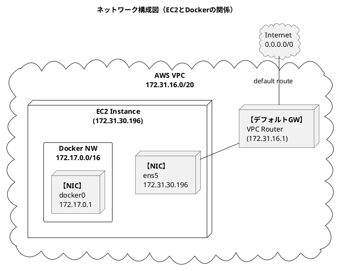
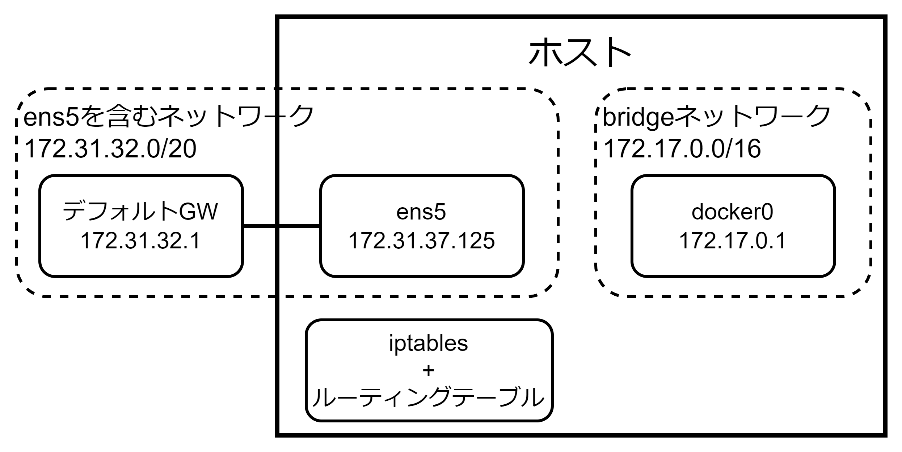

<style>
    body {
      counter-reset: chapter 2;
    }
    h1 {
        counter-reset: sub-chapter;
    }
    h2 {
        counter-reset: section;
    }

    h1::before {
        counter-increment: chapter;
        content: "第" counter(chapter) "章 ";
    }
    h2::before {
        counter-increment: sub-chapter;
        content: counter(chapter) "-" counter(sub-chapter) " ";
    }
    h3::before {
        counter-increment: section;
        content: counter(chapter) "-" counter(sub-chapter) "-" counter(section) " ";
    }
</style>


# Dockerネットワークのしくみ

## Dockerのネットワーク構成

### Dockerインストール時のネットワーク構成

- コンテナが他のプロセスと通信するために、`Docker`は<u>①インストール時</u>と<u>②コンテナ起動時</u>に自動的にいくつかのネットワーク設定が追加される。
- `Docker`によるネットワークの自動設定では仮想ブリッジや`netns`、`iptables`といった`Linux`の機能が使われている。

#### ipコマンドによる確認

##### 【ネットワークデバイスの確認】`ip address`コマンド

- ホストのネットワークデバイスを確認するために`ip address`コマンドを使用する。
  - 【`lo`】ループバックI/Fであり、自身のコンピュータを示す仮想的なI/F。
  - 【`ens5`】コンピュータに搭載されている物理的なNICであり、<font color=red>外部ネットワークとの通信で使用</font>する。`ens`はイーサネットを意味する。
  - 【`docker0`】Dockerインストール時に追加されるデバイス

```bash
$ ip address
1: lo: <LOOPBACK,UP,LOWER_UP> mtu 65536 qdisc noqueue state UNKNOWN group default qlen 1000
    link/loopback 00:00:00:00:00:00 brd 00:00:00:00:00:00
    inet 127.0.0.1/8 scope host lo
       valid_lft forever preferred_lft forever
    inet6 ::1/128 scope host noprefixroute 
       valid_lft forever preferred_lft forever
2: ens5: <BROADCAST,MULTICAST,UP,LOWER_UP> mtu 9001 qdisc mq state UP group default qlen 1000
    link/ether 0e:cd:5d:0f:c8:e7 brd ff:ff:ff:ff:ff:ff
    inet 172.31.30.196/20 metric 100 brd 172.31.31.255 scope global dynamic ens5
       valid_lft 3530sec preferred_lft 3530sec
    inet6 fe80::ccd:5dff:fe0f:c8e7/64 scope link 
       valid_lft forever preferred_lft forever
3: docker0: <NO-CARRIER,BROADCAST,MULTICAST,UP> mtu 1500 qdisc noqueue state DOWN group default 
    link/ether 96:ed:f9:5d:aa:b7 brd ff:ff:ff:ff:ff:ff
    inet 172.17.0.1/16 brd 172.17.255.255 scope global docker0
       valid_lft forever preferred_lft forever
```

##### 【ルーティングテーブルの確認】`ip route`コマンド



-  `ip route`コマンドは<code><font color=red>【宛先IP】 [via 【次の宛先ルータ】] dev 【デバイス名】 proto 【生成された経路】</font></code><code><font color=red>scope 【経路先】 src 【送信元】 metric 【優先順位】</font></code>の形で出力される。

<table>
    <caption>ip routeコマンド</caption>
  <thead>
    <tr>
      <th>項目</th>
      <th>意味</th>
      <th>補足説明 / 例</th>
    </tr>
  </thead>
  <tbody>
    <tr>
      <td><b>宛先IP</b></td>
      <td>宛先ネットワークまたは<br>ホストのIPアドレス</td>
      <td><code>default</code> は全宛先（<code>0.0.0.0/0</code>）を意味し、<br>他のルートに該当しない場合に<br>使用されるデフォルトGW。</td>
    </tr>
    <tr>
      <td><b>via 【次の宛先ルータ】</b></td>
      <td>ネクストホップ<br>（次にパケットを渡すルータ）</td>
      <td>宛先が同一セグメントでない場合に指定される。<br>同一ネットワーク内であれば指定不要。</td>
    </tr>
    <tr>
      <td><b>dev 【デバイス名】</b></td>
      <td>送信に使用する<br>NWインターフェース</td>
      <td>例：<code>ens5</code>、<code>eth0</code>、<code>docker0</code> など。</td>
    </tr>
    <tr>
      <td><b>proto 【生成された経路】</b></td>
      <td>経路の生成元<br>（どの仕組みで追加されたか）</td>
      <td>
        <ul>
          <li><code>kernel</code>: カーネルが自動生成した経路</li>
          <li><code>dhcp</code>: DHCPが自動設定した経路</li>
        </ul>
      </td>
    </tr>
    <tr>
      <td><b>scope 【経路先】</b></td>
      <td>通信の範囲（スコープ）</td>
      <td>
        <ul>
          <li><code>link</code>: 同一ネットワーク内</li>
          <li><code>host</code>: 自分自身への経路</li>
          <li><code>global</code>: 他ネットワークへの経路</li>
        </ul>
      </td>
    </tr>
    <tr>
      <td><b>src 【送信元】</b></td>
      <td>送信時に使用する<br>送信元IPアドレス</td>
      <td>複数IPを持つ場合、<br>どのIPから送信するかを明示する。</td>
    </tr>
    <tr>
      <td><b>metric 【優先順位】</b></td>
      <td>経路の優先度を示す値</td>
      <td>数値が小さいほど優先度が高い。</td>
    </tr>
  </tbody>
</table>

```bash
$ ip route
default via 172.31.16.1 dev ens5 proto dhcp src 172.31.30.196 metric 100 
172.17.0.0/16 dev docker0 proto kernel scope link src 172.17.0.1 linkdown 
172.31.0.2 via 172.31.16.1 dev ens5 proto dhcp src 172.31.30.196 metric 100 
172.31.16.0/20 dev ens5 proto kernel scope link src 172.31.30.196 metric 100 
172.31.16.1 dev ens5 proto dhcp scope link src 172.31.30.196 metric 100
```

#### docker networkコマンドによる確認



- <code><font color=red>docker network</code>コマンドでネットワークの作成・確認できる</font>。Dockerインストール後はデフォルトで3種類(`bridge`、`host`、`none`)のネットワークが作成されている。
  - `bridge`: デフォルトで作成されるNW。コンテナ起動時にNWの指定がなければ所属するNWであり、ネットワーク設定を気にせずコンテナ同士を通信させることが可能。
  - `host`: ホストネットワーク。ホストと同じネットワークにコンテナを所属させたいときに使用。
  - `none`: どのネットワークに所属させないための設定。
- `docker network inspect 【ネットワーク名】`コマンドでネットワークの詳細を確認できる。
  - `IPAM⇒Config⇒Subnet`からサブネット情報(`172.17.0.0/16`)がわかり、`Option⇒` `com.docker.network.bridge.name`からブリッジ名が`docker0`として設定されていることがわかる。

```bash
$ docker network ls
NETWORK ID     NAME      DRIVER    SCOPE
ebe28bbcc258   bridge    bridge    local
7930b076ba60   host      host      local
2595ce1ac731   none      null      local

# bridgeネットワークの詳細
$ docker network inspect bridge
[
    {
        "Name": "bridge",
        "Id": "ebe28bbcc258c6c39632fcfe45d7fcd67858e0ca94e92be2a2316033e38be273",
        ...
        "IPAM": {
            "Driver": "default",
            "Options": null,
            "Config": [
                {
                    "Subnet": "172.17.0.0/16",
                    "Gateway": "172.17.0.1"
                }
            ]
        },
        ...
        "Containers": {
            "4f768f32e7b162a09e0b679d3febd2378db50053fedf34f0485697ffa6fc14f2": {
                "Name": "curl-container",
                "EndpointID": "fc55a1937c78b442e336bc218d11a3e91c50a06d2dfe784141dfa8cc7410de45",
                "MacAddress": "92:c2:40:d5:96:06",
                "IPv4Address": "172.17.0.2/16",
                "IPv6Address": ""
            }
        },
        "Options": {
            ...
            "com.docker.network.bridge.name": "docker0",
            ...
        },
        "Labels": {}
    }
]
```

### コンテナ起動時のネットワーク構成

- ここでは、コンテナ起動時のネットワーク設定を確認する。
- 


### まとめ


## Dockerネットワークドライバ

### ネットワークドライバの種類


## ログからわかるコンテナ間の通信

### 事前準備


### 通信経路のトレース


### まとめ


## ログからわかるコンテナ外部との通信

### 事前準備


### 通信経路のトレース


### まとめ


## マルチホストネットワークの構築

### 独自ネットワークの構築


### マルチホストを実現するネットワークプラグイン


### オーバレイネットワークのしくみ


### オーバレイネットワークの構築


### まとめ


## チャットアプリ開発を通じた実践的なネットワーク構築

### 全体像


### コードの用意


### Dockerfileの作成


### コンテナのビルド


### 各コンテナの起動


### チャット実施


### まとめ


