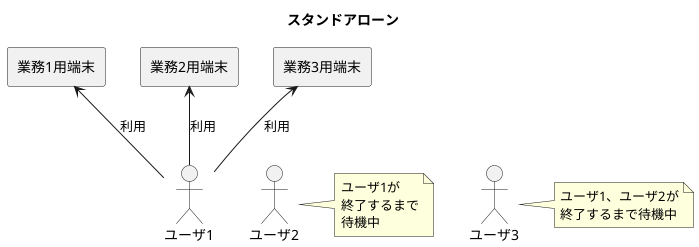
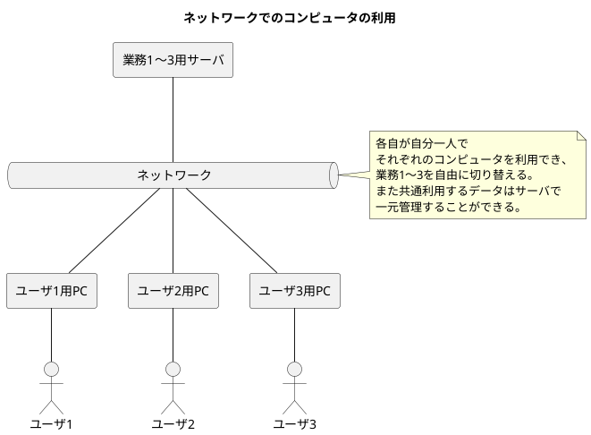
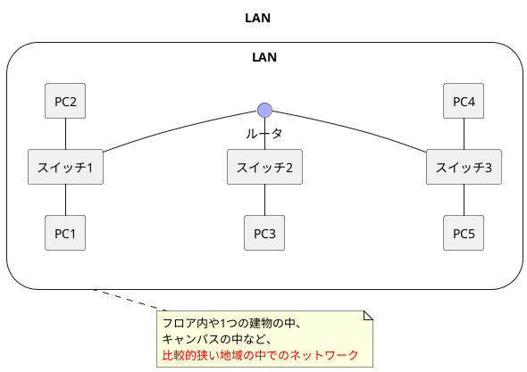
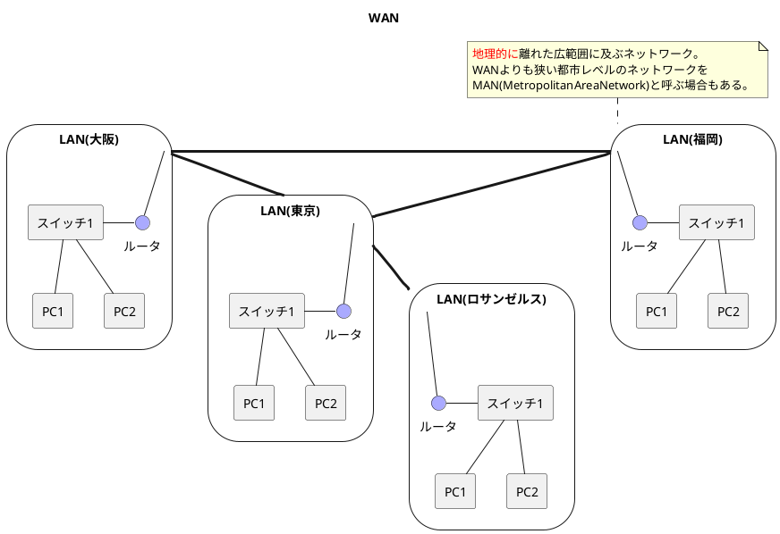

###　コンピュータネットワーク登場の背景

- **スタンドアローン**： コンピュータをネットワークに接続せず、単独で使用する状態。それぞれの端末が独立してデータを持ち、修正の際はそれぞれの端末に対して操作する必要がある。
- **コンピュータネットワーク**： コンピュータとコンピュータを接続し、複数のコンピュータを互いに接続して使用できる状態。
  - **LAN**： フロア内や1つの建物の中、キャンパスの中など、比較的狭い地域の中でのネットワーク。
  - **WAN**： 地理的に離れた広範囲に及ぶネットワーク。

