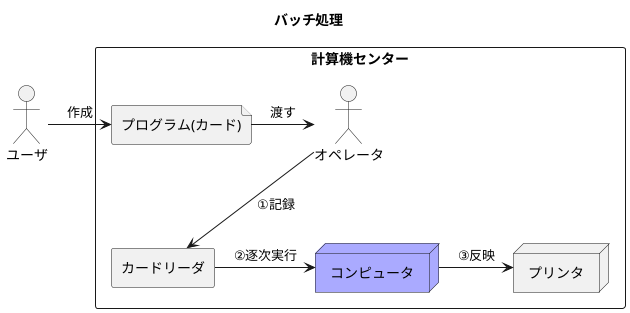
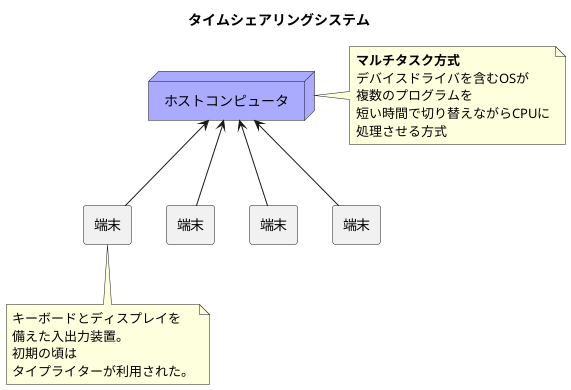
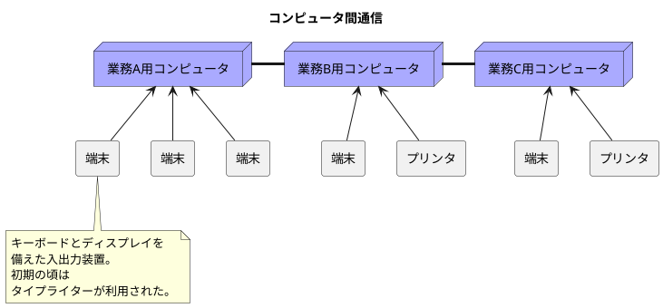
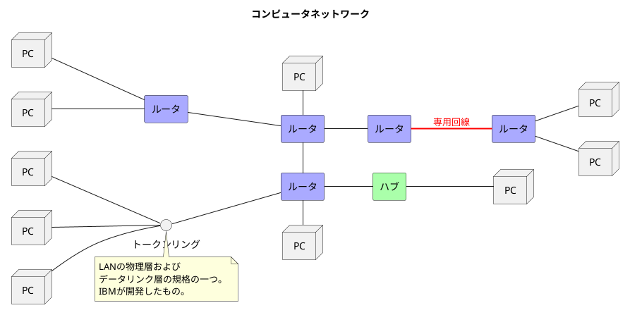
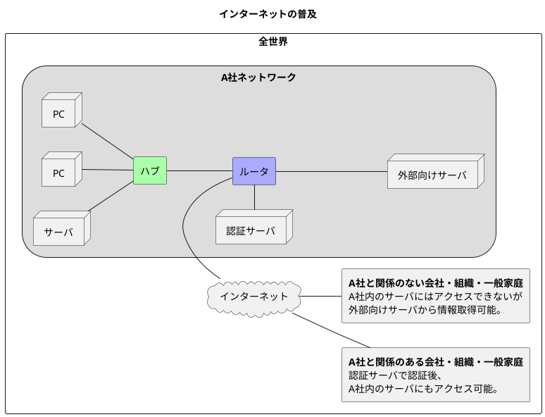
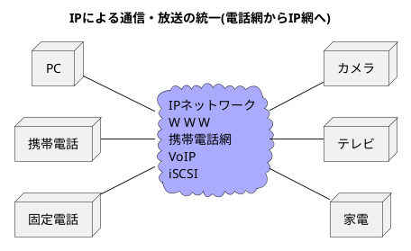

###　コンピュータとネットワーク発展の7つの段階
#### バッチ処理(Batch Proccessing, 1950年代)

- 当時のコンピュータは高価で巨大なモノで誰もが気軽に使えるモノではなかった。
- プログラム実行やデータ操作する場合、計算機センターまで行かなければならなかった。
- プログラムの実行は専門のオペレータに依頼し、後日、処理結果を計算機センターまで撮りに行く必要があった。

#### タイムシェアリングシステム(TSS: Time Sharing System, 1960年代)

- 仮想的に一人の人が1台のコンピュータを占有して利用する事が可能
- インタラクティブ(対話的)な操作が可能になった。
- **スター型**(ホストコンピュータを中心に端末が接続された通信形態)で接続
- コンピュータとコンピュータを繋いでいるわけではない。

#### コンピュータ間通信(1970年代)

- コンピュータ性能が飛躍的に向上し、安価になった。
- データ転送にかかる時間が一気に少なくなった（物理的移動から通信での移動に変わった）。
- 利用者の目的や規模に合わせた柔軟なシステムの構築や運用ができるようになった。

#### コンピュータネットワーク(1980年代)

- 異なるメーカ同士の多種多様なコンピュータがネットワークに結ばれるようになった。
- 画面上で複数の窓(ウィンドウ)を開く事ができるシステムであるウィンドウシステムが登場した。
- コンピュータの発展と普及がネットワークをより身近なモノにした。

#### インターネットの普及(1990年代)

- マルチベンダ接続やダウンサイジング(コンピュータが性能向上しつつ安価になった動き)によりシステム構築が容易になった。
- 企業も一般家庭もインターネットに接続するようになった。

#### いつでもどこでも何にでもTCP/IPネットワークの時代

- **汎用通信基盤が電話網からIP網へ変わった**。
- ネットワークに繋がる機器がコンピュータだけでなく、携帯端末や家電製品、ゲーム機などに広がった。
- これまで、**外部と接続しない閉域網**として制御系システムが構築されていたが、インターネット接続が増えてきた。
- ありとあらゆるものがインターネットにつながるようになった

#### 「単に繋ぐ」時代から「安全に繋ぐ」時代へ

- 利便性の向上に伴い、情報漏洩や詐欺事件などのトラブルが増加し、企業や個人の活動に大きな損失を与えるようになった。
- 通信の仕組みを理解し、安全で健全な通信手段を維持する事が不可欠な時代になった。
- インターネットは別々に発達してきた多種多様な通信技術を組み合わせたものであり、TCP/IPはインターネットを実現するだけの応用力がある。
- 色々な「モノ」に接続し、新たな「コト」を想像する仕組み(<b>IoT: Internet of Things</b>)が増えてきた。
※製造現場においては特に<b>Industrial IoT(Industry4.0)</b>と呼ばれる。
