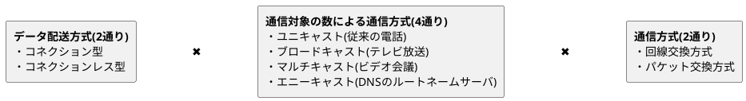
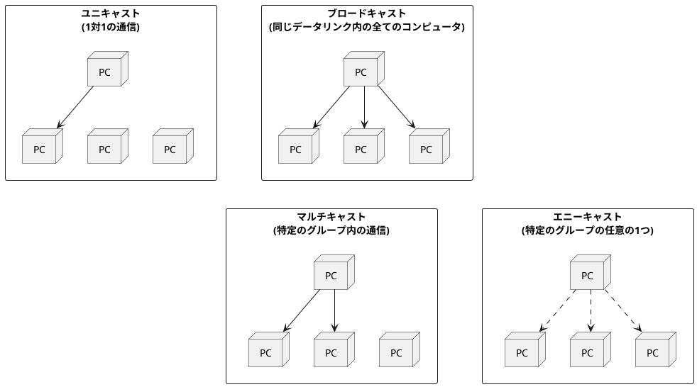
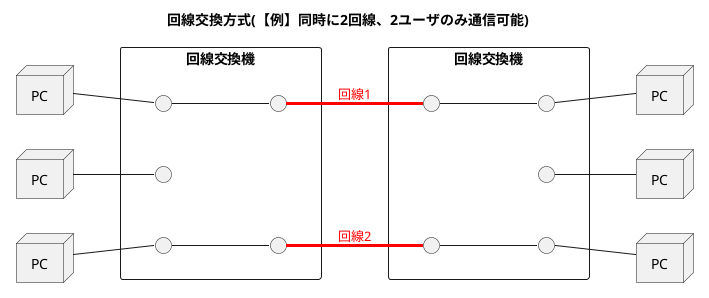
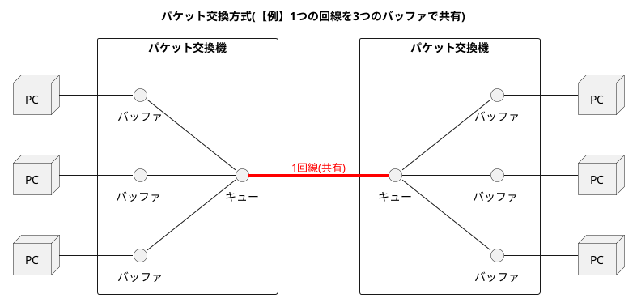

###　通信方式の種類

- データの配送方法は**コネクション型**と**コネクションレス型**に分けられる。
- 通信対象の数による通信方式の分類は**ユニキャスト**、**ブロードキャスト**、**マルチキャスト**、**エニーキャスト**がある。
- 通信方法は**回線交換方式**と**パケット交換方式**がある。

#### コネクション型とコネクションレス型

| 比較項目             | コネクション型 (Connection-oriented)                   | コネクションレス型 (Connectionless)                         |
|----------------------|------------------------------------------------------|-----------------------------------------------------------|
| 例                   | TCP (Transmission Control Protocol)、ATM、フレームリレー | UDP (User Datagram Protocol)、イーサネット、IP |
| 接続の確立           | データ転送前に通信相手との接続を確立する必要がある。       | 接続の確立は不要。データを直接送信できる。                    |
| 信頼性               | 高い。パケットの順序確認、再送制御、エラー検出を行うが、遅延が発生する可能性がある   | 低い。パケット送信だけであり遅延はないが、順序保証や再送制御はなく、エラー検出も限定的 |
| データ転送の順序     | パケットの順序を保証する                                | 順序は保証されない                                         |
| 再送制御             | パケットが欠落した場合、自動的に再送される               | 再送制御は行われない                                       |
| 適した用途           | 信頼性が重要なアプリケーション (例：ファイル転送、メール) | リアルタイム性が重要なアプリケーション (例：VoIP、ゲーム)    |

#### ユニキャスト/マルチキャスト/ブロードキャスト/エニーキャスト

#### 回線交換方式とパケット交換方式

| 比較項目             | 回線交換方式 (Circuit Switching)                        | パケット交換方式 (Packet Switching)                     |
|----------------------|--------------------------------------------------------|---------------------------------------------------------|
| 例                   | 電話網 (旧式の固定電話システム)                          | インターネット、LAN                                      |
| データ転送の順序     | データは送信された順番通りに到着する                     | パケットは経路ごとに異なる順序で到着する可能性がある      |
| 遅延                 | 一度回線が確立されると遅延は低い                         | パケットが異なるルートを通るため、遅延が変動することがある  |
| 帯域幅の効率 | 非効率的。回線が専有されている間、データを送信していない場合でもリソースが占有される。 | 効率的。リソースは必要に応じて動的に共有される。 |
| 信頼性               | 高い。回線が確立されると、データの損失は少ない           | パケットの再送やエラー検出により信頼性を確保             |
| 適した用途           | 連続的で一定の帯域幅を必要とする通信 (例：音声通話)       | 帯域幅が変動し、効率的なリソース使用が求められる通信 (例：データ通信、インターネット) |