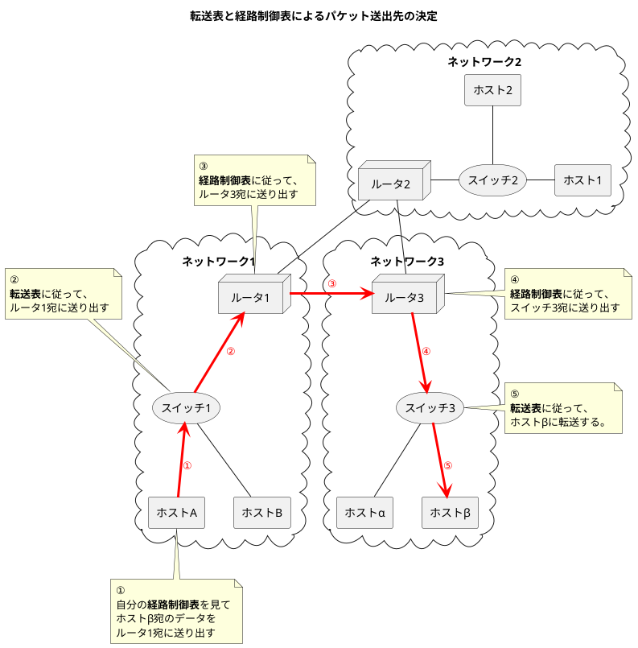

###　アドレスとは

- アドレスはMACアドレスやIPアドレス、ポート番号などが挙げられる。
- アドレスには唯一性と階層性がある。
- MACアドレスは<b>転送表（フォワーディングテーブル）</b>からネットワークインタフェースを決定する。転送表にはMACアドレスがそのまま記録される。
- IPアドレスは<b>経路制御表（ルーティングテーブル）</b>からネットワークインタフェースを決定する。経路制御表にはIPアドレスのネットワーク部とサブネットマスクが記録される。

|  | MACアドレス | IPアドレス |
| -- | -- | -- |
| 唯一性 | ある | ある |
| 階層性 | ない | ある |

