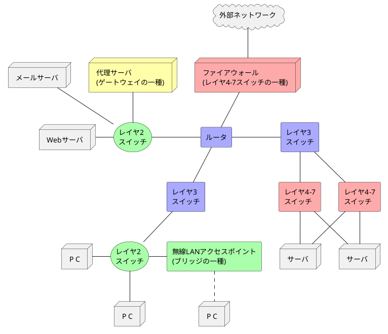

###　ネットワークの構成要素

- リピータは通信媒体を変換できるが（例えば、同軸ケーブルと光ファイバの変換）、伝送速度が異なる媒体間を接続することはできない（例えば、10Mbpsのイーサネットと100Mbpsのイーサネットの相互接続はできない）。
- ブリッジ/レイヤ2スイッチは伝送速度の異なるセグメントを接続し、フレームの再構成やエラーフレームの破棄を行う。
- ルータ/レイヤ3スイッチは異なるネットワークを接続し、経路判断や転送処理を行う。
- レイヤ4-7スイッチは送受信された通信内容を分析し、特定の処理をする。
- ゲートウェイはデータ中継ではなく、データ変換する装置。2つの異なるプロトコルの翻訳作業を行う。

<table>
  <caption>ネットワーク機器の役割</caption>
  <tr>
    <th>機器</th>
    <th>役割</th>
	<th>機器名称</th>
  </tr>
  <tr>
    <td>ネットワーク インタフェース</td>
    <td>ネットワーク接続のための専用のインタフェース。</td>
	<td>有線LANやNIC、 ネットワークアダプタ、LANカード</td>
  </tr>
  <tr>
    <td>リピータ(Repeater)</td>
    <td>電気や光の信号を増幅・整形する機器。ネットワークを<strong>物理層</strong>で延長する装置</td>
	<td>リピータハブ</td>
  </tr>
  <tr>
    <td bgcolor="#afa">ブリッジ(Bridge) /レイヤ2スイッチ</td>
    <td>フレーム(パケット)を理解して、セグメント間でフレームを流す機器。 ネットワークを<strong>データリンク層</strong>で延長する装置</td>
	<td>スイッチングハブ</td>
  </tr>
  <tr>
    <td bgcolor="#aaf">ルータ(Router) /レイヤ3スイッチ</td>
    <td>異なるネットワーク間でパケットを中継する機器。 ネットワークの負荷を仕切る役割を持ち、<strong>ネットワーク層</strong>の処理を行う。</td>
	<td>ルータ</td>
  </tr>
  <tr>
    <td bgcolor="#faa">レイヤ4-7スイッチ</td>
    <td>トランスポート層以上（セッション層、 プレゼンテーション層、アプリケーション層）の情報で トラフィックを処理する装置</td>
	<td>ロードバランサ、 WANアクセラレータ、 ファイアウォール</td>
  </tr>
  <tr>
    <td bgcolor="#ffa">ゲートウェイ※1 (GW: GateWay)</td>
    <td>トランスポート層以上で異なるプロトコル間を相互変換する。</td>
	<td>プロキシサーバ</td>
  </tr>
</table>
※1: ルータのことを慣例的にゲートウェイというが、ここではトランスポート層以上の階層でプロトコルを変換する機器を指す。

<table>
  <caption>様々なデータリンク(機器間で通信するためのプロトコルやネットワーク)
	<tbody>
		<tr>
    <th>データリンク名</th>
    <th>通信媒体</th>
    <th>伝送速度</th>
    <th>主な用途</th>
		</tr>
		<tr>
			<td rowspan="3">イーサネット Ethernet</td>
			<td>同軸ケーブル</td>
			<td>10Mbps</td>
			<td>LAN</td>
		</tr>
		<tr>
			<td>ツイストペアケーブル</td>
			<td>10Mbps〜10Gbps</td>
			<td>LAN</td>
		</tr>
		<tr>
			<td>光ファイバケーブル</td>
			<td>10Mbps〜400Gbps</td>
			<td>LAN</td>
		</tr>
		<tr>
			<td>無線</td>
			<td>電磁波</td>
			<td>数Mbps〜</td>
			<td>LAN〜WAN</td>
		</tr>
		<tr>
			<td>ATM(※1)</td>
			<td>ツイストペアケーブル 光ファイバケーブル</td>
			<td>25Mbps、155Mbps、 622Mbps</td>
			<td>LAN〜WAN</td>
		</tr>
		<tr>
			<td>FDDI(※1)</td>
			<td>ツイストペアケーブル 光ファイバケーブル</td>
			<td>100Mbps程度</td>
			<td>LAN〜WAN</td>
		</tr>
		<tr>
			<td>フレームリレー(※1)</td>
			<td>ツイストペアケーブル 光ファイバケーブル</td>
			<td>64k〜1.5Mbps程度</td>
			<td>WAN</td>
		</tr>
		<tr>
			<td>ISDN(※1)</td>
			<td>ツイストペアケーブル 光ファイバケーブル</td>
			<td>64k〜1.5Mbps</td>
			<td>WAN</td>
		</tr>
	</tbody>
</table>

※1: 現在はあまり利用されていない。