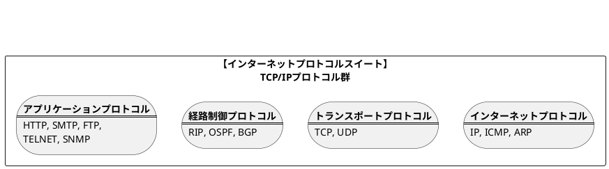
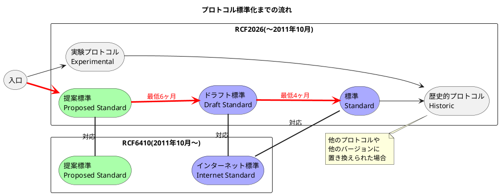

###　TCP/IPの標準化

- TCP/IPはプロトコル群の総称として使われることが多く、**インターネットプロトコルスイート**と呼ぶこともある。
- TCP/IPのプロトコルはIETF(Internet Engineering Task Force)での議論を通して、<b>実用性を重視</b>していた(設計、実装、検証を高速に回していた)。
- TCP/IPに比べてOSI（ISOが開発した国際標準プロトコル）が普及しなかった要因として、①動作プロトコルを早く開発できなかったことと、②急速な技術革新に対応できる仕組みがなかったことが挙げられる。
- **標準化されたTCP/IPのプロトコルはRFC（Request For Comments）と呼ばれるドキュメントになる**。例えば、IPはRFC791、TCPはRFC793になる。RFC以外に主要なプロトコルや標準を表す<b>STD(Standard)</b>やインターネットのユーザや管理者に向けて有益な情報を表す<b>FYI(For Your Information)</b>という識別子もある。
- 標準化までの流れとして、まず仕様を煮詰める<b>インターネットドラフト(I-D: Internet-Draft)</b>から始まり、次に、標準化した方が良いと認められると<b>提案標準(Proposed Standard)</b>になる。そして、標準の草案である<b>ドラフト標準(Draft Standard)</b>になり、最後に<b>標準(Standard)</b>になる。
- RFCの入手方法
  - インターネット利用： 
    - I-D(インターネットドラフト)： https://www.rfc-editor.org/in-notes/internet-drafts/
    - STDの入手先： https://www.rfc-editor.org/in-notes/std/
    - FYIの入手先： https://www.rfc-editor.org/in-notes/fyi/
    - 一覧： https://www.rfc-editor.org/rfc-index.html
  - FTPでのダウンロード
    - ftp://ftp.rfc-editor.org/in-notes/
    - ftp://ftp.rfc-editor.org/rfc/std/
    - ftp://ftp.rfc-editor.org/rfc/fyi/
    - ftp://ftp.rfc-editor.org/rfc/internet-drafts/

<table>
  <caption>主なRFC</caption>
  <tr>
    <th>プロトコル</th>
    <th>RFC</th>
    <th>STD</th>
    <th>説明</th>
  </tr>
  <tr>
    <td>IPv4</td>
    <td>RFC791, RFC919, RFC922</td>
    <td>STD 5</td>
    <td>インターネット・プロトコルの最初のバージョン（IPv4）</td>
  </tr>
  <tr>
    <td>IPv6</td>
    <td>RFC8200</td>
    <td>STD 86</td>
    <td>次世代のインターネット・プロトコル（IPv6）</td>
  </tr>
  <tr>
    <td>ICMP</td>
    <td>RFC792, RFC950, RFC6918</td>
    <td>STD 5</td>
    <td>IPv4で使用されるインターネット制御メッセージプロトコル</td>
  </tr>
  <tr>
    <td>ICMPv6</td>
    <td>RFC4443, RFC4884</td>
    <td>STD 89</td>
    <td>IPv6で使用されるインターネット制御メッセージプロトコル</td>
  </tr>
  <tr>
    <td>ARP</td>
    <td>RFC826, RFC5227, RFC5494</td>
    <td>-</td>
    <td>アドレス解決プロトコル（IPv4）</td>
  </tr>
  <tr>
    <td>RARP</td>
    <td>RFC903</td>
    <td>-</td>
    <td>逆アドレス解決プロトコル</td>
  </tr>
  <tr>
    <td>TCP</td>
    <td>RFC793, RFC3168</td>
    <td>STD 7</td>
    <td>トランスポート層プロトコル（Transmission Control Protocol）</td>
  </tr>
  <tr>
    <td>UDP</td>
    <td>RFC768</td>
    <td>STD 6</td>
    <td>ユーザーデータグラムプロトコル</td>
  </tr>
  <tr>
    <td>IGMPv3</td>
    <td>RFC3376, RFC4604</td>
    <td>-</td>
    <td>インターネットグループ管理プロトコル</td>
  </tr>
  <tr>
    <td>DNS</td>
    <td>RFC1034, 1035</td>
    <td>STD 13</td>
    <td>ドメインネームシステム</td>
  </tr>
  <tr>
    <td>DHCP</td>
    <td>RFC2131, RFC2132</td>
    <td>-</td>
    <td>動的ホスト構成プロトコル</td>
  </tr>
  <tr>
    <td>HTTP/1.1</td>
    <td>RFC2616, RFC7230</td>
    <td>-</td>
    <td>ハイパーテキスト転送プロトコル v1.1</td>
  </tr>
  <tr>
    <td>SMTP</td>
    <td>RFC821, RFC2821, RFC5321</td>
    <td>STD 10</td>
    <td>シンプルメール転送プロトコル</td>
  </tr>
  <tr>
    <td>POP3</td>
    <td>RFC1939</td>
    <td>STD 53</td>
    <td>ポストオフィスプロトコル v3</td>
  </tr>
  <tr>
    <td>FTP</td>
    <td>RFC959, RFC2228</td>
    <td>STD 9</td>
    <td>ファイル転送プロトコル</td>
  </tr>
  <tr>
    <td>TELNET</td>
    <td>RFC854, RFC855</td>
    <td>STD 8</td>
    <td>リモートログインプロトコル</td>
  </tr>
  <tr>
    <td>SSH</td>
    <td>RFC4253</td>
    <td>-</td>
    <td>セキュアシェル</td>
  </tr>
  <tr>
    <td>SNMP</td>
    <td>RFC1157</td>
    <td>STD 15</td>
    <td>シンプルネットワーク管理プロトコル</td>
  </tr>
  <tr>
    <td>SNMPv3</td>
    <td>RFC3411, RFC3418</td>
    <td>STD 62</td>
    <td>SNMPのセキュアなバージョン</td>
  </tr>
  <tr>
    <td>MIB-II</td>
    <td>RFC1213</td>
    <td>STD 17</td>
    <td>SNMPの管理情報ベース（MIB-II）</td>
  </tr>
  <tr>
    <td>RMON</td>
    <td>RFC2819</td>
    <td>-</td>
    <td>リモートネットワーク監視</td>
  </tr>
  <tr>
    <td>RIP</td>
    <td>RFC1058</td>
    <td>STD 34</td>
    <td>ルーティング情報プロトコル</td>
  </tr>
  <tr>
    <td>RIPv2</td>
    <td>RFC2453</td>
    <td>STD 56</td>
    <td>ルーティング情報プロトコル v2</td>
  </tr>
  <tr>
    <td>OSPFv2</td>
    <td>RFC2328</td>
    <td>STD 54</td>
    <td>オープンショーテストパスファーストプロトコル（IPv4用）</td>
  </tr>
  <tr>
    <td>EGP</td>
    <td>RFC904</td>
    <td>STD 18</td>
    <td>外部ゲートウェイプロトコル</td>
  </tr>
  <tr>
    <td>BGPv4</td>
    <td>RFC4271</td>
    <td>-</td>
    <td>ボーダーゲートウェイプロトコル v4</td>
  </tr>
  <tr>
    <td>PPP</td>
    <td>RFC1661, RFC1662</td>
    <td>STD 51</td>
    <td>ポイントツーポイントプロトコル</td>
  </tr>
  <tr>
    <td>PPPoE</td>
    <td>RFC2516</td>
    <td>-</td>
    <td>PPP over Ethernet</td>
  </tr>
  <tr>
    <td>MPLS</td>
    <td>RFC3031, 3032</td>
    <td>-</td>
    <td>マルチプロトコルラベルスイッチング</td>
  </tr>
  <tr>
    <td>RTP</td>
    <td>RFC3550, 3551</td>
    <td>-</td>
    <td>リアルタイムトランスポートプロトコル</td>
  </tr>
</table>
