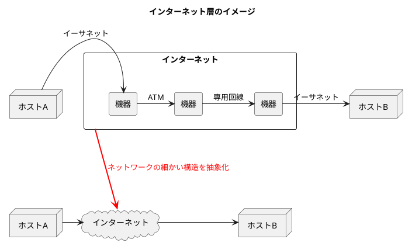
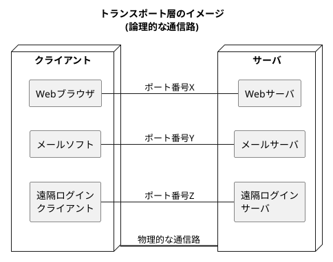
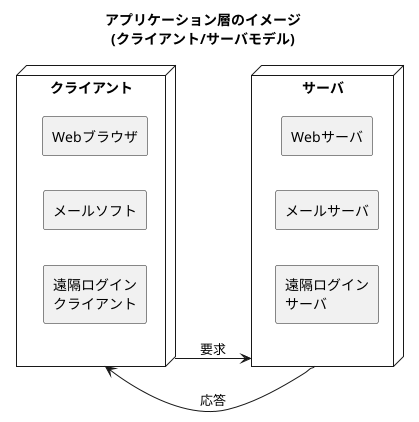
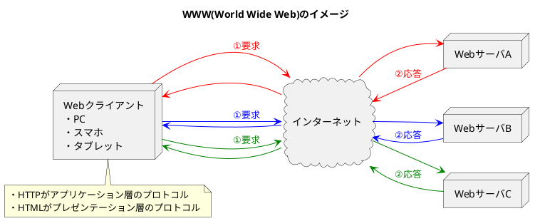
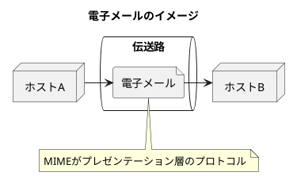
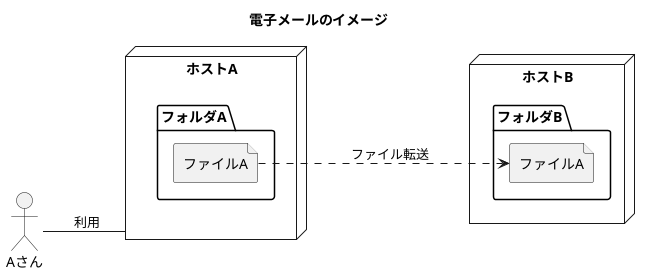
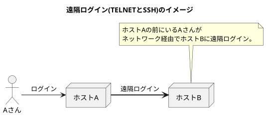
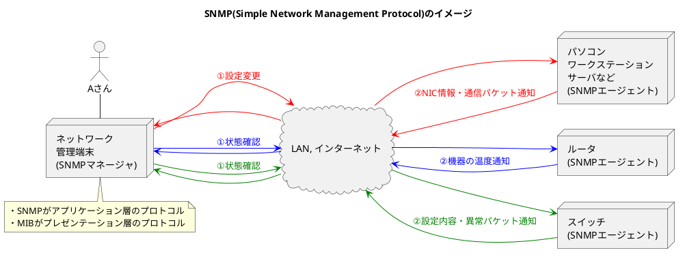

###　TCP/IPの階層モデル

- OSI参照モデルは「通信プロトコルに必要な機能は何か」を中心に考えており、<b>理論的で標準的なモデル化</b>がされている。
- TCP/IPの階層モデルは「プロトコルをコンピュータに実装するにはどのように実装したら良いのか」を中心に考えており、<b>実践的なモデル化</b>がされている。
- **第一層のハードウェア**は特に制約はなく、ネットワークで接続された装置間で通信できることを前提にして作られれている。
- **第二層のネットワークインタフェース層**は、NICを動かすための「デバイスドライバ」。
- **第三層のインターネット層**は、最終目的地のホストまでパケットを届ける役割を持つ。
- **第四層のトランスポート層**は、アプリケーションプログラム間の通信を実現する役割を持つ。
- **第五層のアプリケーション層**は、データの送信や取り扱い、通信手順や方法について実現する役割を持つ。

<table>
    <caption>TCP/IP　階層モデル</caption>
    <tbody>
        <tr>
            <td></td>
            <th>層</th>
            <th>説明</th>
            <th>プロトコル</th>
        </tr>
        <tr>
            <th>5</th>
            <td>アプリケーション層</td>
            <td>データの送信や取り扱い、通信手順や方法を実現する役割を持つ。 この層の多くはC/Sモデルで実装される。</td>
            <td>HTTP, HTML, SMTP, FTP, SNMP, TELENT, SSH</td>
        </tr>
        <tr>
            <th>4</th>
            <td>トランスポート層</td>
            <td>アプリケーションプログラム間の通信を実現する役割を持つ。 プログラム間の通信はポート番号により識別され、 複数のプログラムが同時に動作している。</td>
            <td>TCP, UDP</td>
        </tr>
        <tr>
            <th>3</th>
            <td>インターネット層</td>
            <td>ネットワークの細かい構造を抽象化し、 IPを使用してIPアドレスをもとにパケットを転送する。</td>
            <td>IP, ICMP, ARP, ...</td>
        </tr>
        <tr>
            <th>2</th>
            <td>ネットワーク インタフェース層</td>
            <td>イーサネットなどのデータリンクを利用して通信するための インタフェースとなる階層であり、デバイスドライバ(※2)に相当する。 </td>
            <td>デバイスドライバの 層のため特になし。</td>
        </tr>
        <tr>
            <th>1</th>
            <td>ハードウェア(※1)</td>
            <td>物理的にデータを転送してくれるイーサネットや電話回線などを指す。 通信媒体(ケーブル、無線)や信頼性やセキュリティ、帯域、遅延時間などの 内容については何も決めていない。</td>
            <td>ハードウェアの 層のため特になし。</td>
        </tr>
    </tbody>
</table>

※1. 第一層と第二層をまとめて1つの層として扱うこともある。
※2. OSとハードウェアの橋渡しをするソフトウェア。
※3. RDP(リモートデスクトップ)はRFCには規定されていない。

#### インターネット層のプロトコル

- **IP(Internet Protocol)**: ネットワークを跨いでインターネット全体にパケットを送り届けるためのプロトコル。IPにはデータリンクの特性を隠す役割もあり、通信経路がどのようなデータリンクになっていても通信可能になっている。
- **ICMP(Internet Control Message Protocol)**: IPパケット配送中に異常が発生した場合、送信元に異常を知らせるプロトコル。ネットワーク診断などに利用される。
- **ARP(Address Resolution Protocol)**: IPアドレスからMACアドレス(パケットの送り先)を取得するプロトコル。逆に、MACアドレスからIPアドレスを取得するプロトコルをRARP(Reverse ARP)と呼ぶ。

#### トランスポート層のプロトコル

| 比較項目             | TCP (Transmission Control Protocol)     | UDP (User Datagram Protocol)  |
|----------------------|------------------------------------------------------|-----------------------------------------------------------|
| 接続の確立           | データ転送前に通信相手との接続を確立する必要がある。       | 接続の確立は不要。データを直接送信できる。                    |
| 信頼性               | 高い。パケットの順序確認、再送制御、エラー検出を行うが、遅延が発生する可能性がある   | 低い。パケット送信だけであり遅延はないが、順序保証や再送制御はなく、エラー検出も限定的 |
| データ転送の順序     | パケットの順序を保証する                                | 順序は保証されない                                         |
| 再送制御             | パケットが欠落した場合、自動的に再送される               | 再送制御は行われない                                       |
| 使用例           | 信頼性が重要なアプリケーション (例：ファイル転送、メール) | リアルタイム性が重要なアプリケーション (例：VoIP、ゲーム、ビデオや音声などのマルチメディア通信)    |

#### アプリケーション層(セッション層以上の上位置)のプロトコル

##### 【ユースケース】 Webアクセス(WWW)

- WWW(World Wide Web)はインターネットが一般に普及する原動力になったアプリケーション

###### 【ユースケース】 電子メール(E-Mail)

- SMTP(Simple Message Transfer Protocol)では、テキストや映像、音声などを送信できる。
- 送信データは<b>MIME(Multipurpose Internet Mail Extensions)</b>という仕様に基づいている。

###### 【ユースケース】 ファイル転送

- FTPによるファイル転送はバイナリモードやテキストモードを選択可能であり、これが**プレゼンテーション層の機能**ということができる。
- FTPでは、<b>FTPの制御用ポート(21番)</b>と<b>データ転送用ポート(20番)</b>の2つがあり、これら2つのTCPコネクションを制御すること**がセッション層の機能**と言える。

##### 【ユースケース】 遠隔ログイン

- 遠隔ログインのプロトコルとしてTELNETやSSHが用意されている。
- リモートデスクトップ接続のプロトコルである<b>RDPはTCP/IPのRFCで規定されているプロトコルではない</b>。

##### 【ユースケース】 ネットワーク管理

- SNMP(Simple Network Management Protocol)はネットワーク管理で利用されるプロトコルである。
- ネットワーク管理を行う端末をSNMPマネージャ、状態を管理される端末をSNMPエージェントと呼ぶ。
- SNMPでは、MIB(Management Informtion Base)と呼ばれる決められたデータ構造で情報が格納される。
- SNMPや各種動作ログを活用し、将来のネットワーク拡張のために情報収集する。