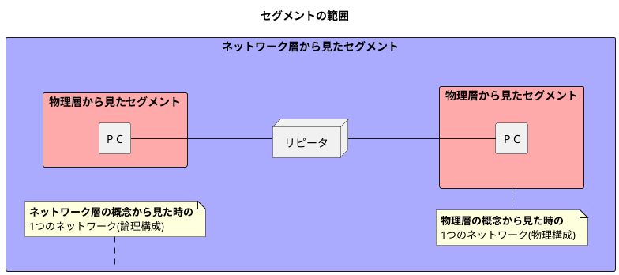
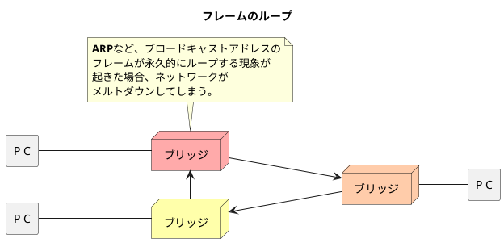
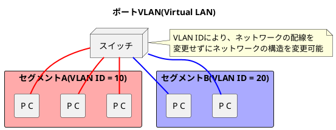
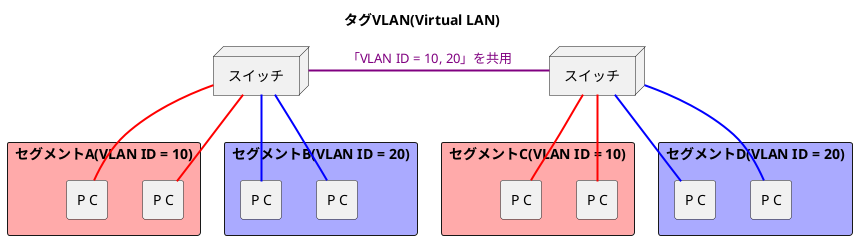

###　データリンクの役割と技術

- 「データリンク」という言葉はいくつかの意味を持つ
  - OSI参照モデルのデータリンク層として使われるケース
  - 具体的な通信手段（イーサネットや無線LANなど）として使われるケース
- TCP/IPのデータリンク層はOSI参照モデルのデータリンク層と物理層を合わせており、透過的に機能していることを前提にしている。
- データリンク層のプロトコルは機器間で通信するための仕様を定めている。
- 機器間の通信は機器間で直接接続されるケースとスイッチやブリッジなどを中継するケースの2つが考えられる。
- 世界中を結ぶインターネットによる通信は「データリンクの集合体」と解釈することができる。
- セグメントの範囲はネットワーク層や物理層などの階層ごとに異なる。

#### データリンク層の関連技術

##### MACアドレス

- MACアドレスは48ビットの長さを持ち、データリンクに接続しているノードを識別するときに利用される。
  - 1ビット目: ユニキャストアドレス(0) or マルチキャストアドレス(1)。通常は0。　※個別(Individual)なのかグループ(Group)なのか
  - 2ビット目: ユニバーサルアドレス(0) or ローカルアドレス(1)。通常は0。　※仮装環境などはローカルアドレス(0)になる。
  - 3〜24ビット: **IEEE**がベンダごとに重ならないように管理するアドレス
  - 25〜28ビット: **ベンダ**が製品ごとに重ならないように管理するアドレス
- イーサネットでは、オクテッド(8ビット)単位で最下位ビット(8ビット目)から最上ビット(1ビット目)に向けてビット列を組み立てる。
- **マルチベンダ環境でネットワークを構築する場合、原因特定のためにもどのメーカーのNICなのか管理・分析できる機能はあった方が良い。**
- MACアドレスは仮装環境では論理的にMACアドレスが割り当てられているため、必ずしも世界で唯一というわけではない。ただ、データリンク内に同じMACアドレスがなければ問題にはならない。

<table>
    <caption>IEEE802.3のMACアドレスフォーマット</caption>
	<tbody>
		<tr>
			<td style="border: 3px solid;">1: I/Gビット</td>
			<td style="border: 3px solid;">2: U/Lビット</td>
			<td style="border: 3px solid;">3〜24: ベンダ識別子 (IEEEが決める)</td>
			<td style="border: 3px solid;">25〜48: ベンダ内での識別子 (ベンダが決める)</td>
		</tr>
	</tbody>
</table>

<table>
    <caption>イーサネットを流れるビット列</caption>
	<tbody>
		<tr>
			<td></td>
		</tr>
	</tbody>
</table>

##### 媒体共有型/非共有型のネットワーク

- 通信媒体の観点から見ると、媒体共有型(昔)と媒体非共有型(今時)の2つがある。
  - **媒体共有型**: 通信媒体を複数のノードで共有するネットワーク方式。
  - **媒体非共有型**: スイッチなどを通して、通信媒体を共有せずに占有するネットワーク方式。
- 媒体共有型では、半二重通信が基本であり、データの利用権を競争する。
  - 具体的な通信として、CSMA、CSMA/CD、トークンパッシング方式などがある。
- 媒体非共有型では、全二重通信が基本であり、現在広く利用されているイーサネットである。
  - **特徴**として、CSMA/CDの機能は不要になり、VLANやデータ流量の制御など多機能になった。
  - ただし、スイッチなどの通信の中継機が故障すると通信不可になってしまうという**欠点**もある。
  - スイッチは<b>転送表(フォワーディングテーブル)</b>と呼ばれる送出インタフェースの対応表を自己学習により記録している。

##### フレームのループを検出する技術

- **ネットワークでループがある場合、フレームが永久に回り続け、メルトダウンが発生する**。
- フレームのループを解決する方法として、スパニングツリー(STP)がある。スパニングツリーの機能を持つブリッジはフレームのループを解消し、トラフィックを分散させ、耐障害性を高めることができる。
※改良版のRapid STP(RSTP)もある。
- **STP**はIEEE 802.1Dで定義されており、ブリッジの機能だけでループを解消できる効果がある。
- **リングアグリゲーション**はIEEE 802.1AXで定義されており、STPと違い、複数のポートを同時に使用することができる。
- <b>LLDP（Link Layer Discovery Protocol）</b>はIEEE 802.1ABで定義されており、ネット枠に接続された機器情報を簡単に確認できるようになる。
- STPのアルゴリズム
  1. 各ブリッジのブリッジID(ブリッジプライオリティとMACアドレスから構成)を手動で設定調整し、**ユーザがルートブリッジ（STPの基準となるブリッジ）を決める**。
  ※ブリッジプライオリティは32768をデフォルトで値が入る。
  2. BPDU（Bridge Protocol Data Unit）と呼ばれる管理用フレームを用いてブリッジ間の情報を交換し、**ネットワーク内でルートブリッジを共有**する。
  3. ①BPDUのルートパスコストと②ポートに設定されているコスト値を加算し、ルートブリッジまでのパスコストを計算することで、**ルートポートRP（ルートブリッジまでの最短のパスコストを持つポート）を選定**する。
  4. それぞれのスイッチが送信するBPDU内のルートパスコストを比較し、**指定ポートDP（スイッチ間のセグメントで最も上位のBPDUを送信するポート）を選定**する。DPのルールとして、①各リンクごとに1ポートが指定ポートになる、②ルートブリッジの全てのポートは必ず指定ポートになる、の2つがある。
  5. ルートポート、指定ポートにも選出されなかった残りのポートが**非指定ポート（データフレームを送受信しないブロッキング状態のポート）に決まる**。ただし、自身のポートが非指定ポートであり続けなければならないと認識するためにBPDUは受信する。

##### VLAN(Virtual LAN)

- VLANにはポートVLANとタグVLANがあり、余分なパケットを減らし、効率的な運用が可能になる。
※他にも、IPサブネットVLANやMACアドレスVLANなどがある。
- **ポートVLAN**
  - ネットワーク配線を変えずにネットワーク構成を変えることができる。
  - 異なるセグメント間で通信するためにはルータ機能を備えたスイッチ(レイヤ3スイッチ)やセグメント感をルーターで結ぶ必要がある。
- **タグVLAN**
  - 異なるセグメント間でもVLANを構築することができる。
  - 物理的なネットワーク構成と論理的なネットワーク構成の乖離が大きく、ポートVLANと比較し、管理が困難。

