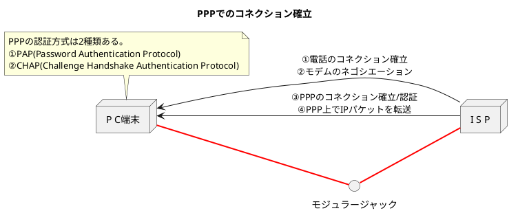

###　PPP（Point-to-Point Protocol）

- **PPP**は1対1でコンピュータを接続するためのプロトコル。電話回線やISDN、専用回線（専用線）、ATM回線などで利用されている。
- 最近では、ADSLやケーブルテレビなどでPPPoE(PPP over Ethernet)が利用されるようになった。**PPPoE**はイーサネットのデータ部にPPPのフレームを格納して転送する方式。

#### LCP(Link Control Protocol)とNCP(Network Control Protocol)

- PPPはLCPとNCPの機能に分けられる。
  - **LCP**: PPPの機能のうち、上位層(ネットワーク層やトランスポート層)に依存しないプロトコル
  - **NCP**: PPPの機能のうち、上位層に依存するプロトコル。上位層がIPの時、NCPはIPCP(IP Control Protocol)になる。
- LCPは①コネクションの確立や切断、②パケット長(Maximum Receive Unit)の設定、③認証プロトコルの設定(PAPかCHAPか)、④通信品質の監視などの設定を行う。
- IPCPでは、①IPアドレスの設定や②TCP/IPのヘッダ圧縮などのやり取りをします。
- PAPはPPPのコネクション確立時に**1回だけ**IDとパスワードをやりとりする方法。IDとパスワードのやりとりは平文のままのため盗聴による乗っ取りの危険性がある。
- CHAPは毎回パスワードが変わるOTP(One Time Password)を使用して盗聴の問題を防ぐ。また、定期的にパスワードを交換し、通信相手が変わっていないかもチェックする。

#### PPPのフレームフォーマット

- PPPのフレームフォーマットはHDLC(High level Data Link Control protocol)と同じ方式。
- HDLCではフレームの区切りをフラグシーケンスと呼び、「01111110」で表現し、フレームの両端をフラグシーケンスではさむ。
- **PPPは**「0」の挿入や削除処理、FCSの計算など全てコンピュータにのCPUが処理する必要があり、**コンピュータに大きな負荷をかける方式**。

#### PPPoE（PPP over Ethernet）

- イーサネットを利用してPPPの機能を提供する「PPPoE」はプロバイダが顧客の管理を容易にする仕組み。
- イーサネットは最も普及しているデータリンクであるが、①認証機能や②コネクションの確立/切断処理がない
→**利用時間による課金が計算できない。**
- PPPoEによるイーサネット上でのコネクション管理
→**PPPの認証機能などを利用して、プロバイダが顧客の管理を容易にできる**。
