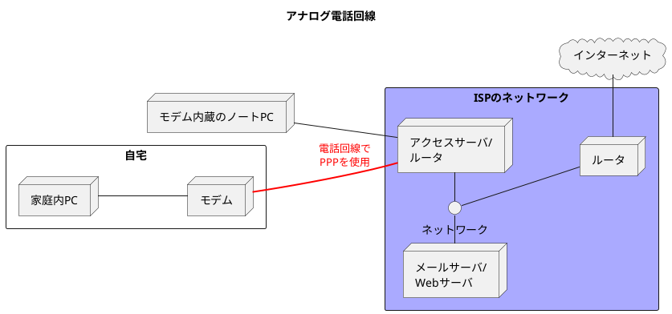
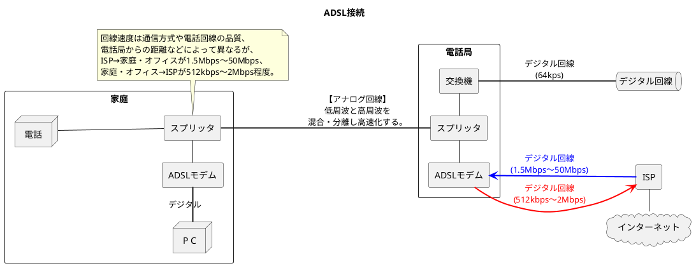
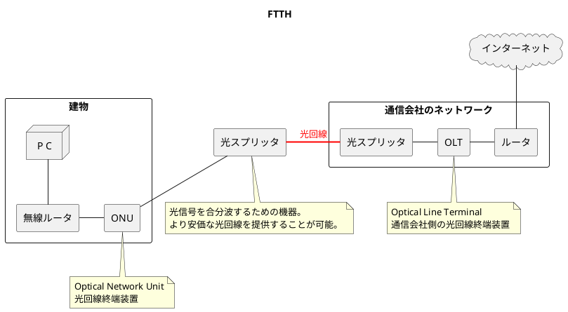
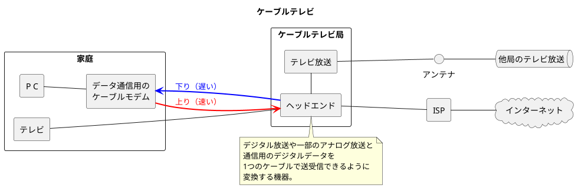
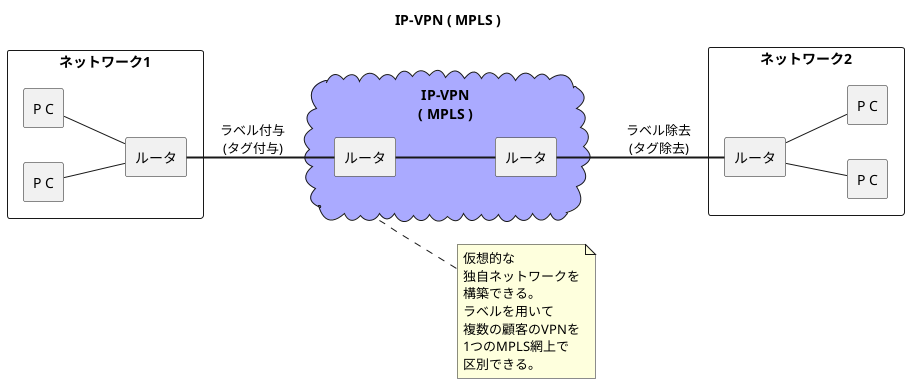
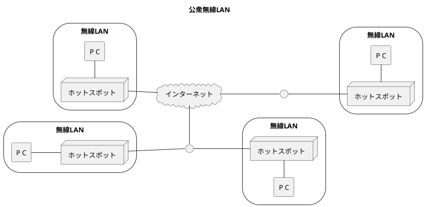

###　公衆アクセス網

- <b>公衆通信サービス</b>とは、電話のようにNTTやKDDI、ソフトバンクなどの通信事業者に料金を払って通信回線を借りる形態。

#### アナログ電話回線

- 固定電話回線で通信を行う。現在はほとんど利用されていない。
- 特別な通信回線を必要とせず、一般家庭に広く普及している電話網をそのまま利用できる。
- コンピュータをアナログ電話回線で接続するためには、デジタル信号とアナログ信号を変換するモデムが必要。

#### ADSL(Asymmetric Digital Subscriber Line)

- 既存のアナログ電話回線を拡張利用するサービス。ADSLでは、電話機と電話局の交換機の間の回線にスプリッタと呼ばれる分配器を設置し、音声周波数(低周波)とデータ通信用の周波数(高周波)を混合・分離する。
- 近年の電話網はデジタル化により周波数がカットされ64kbps程度のデジタル信号に変換されてしまうため、64kbps以上の速度で通信するのは原理的に不可能。
- ADSL以外にも、VDSL、HDSL、SDSLなどがあり、総称してxDSLと呼ぶ。ADSLはその中で最も普及している方式である。

#### FTTH(Fiber To The Home)

- 高速の光ファイバをユーザの自宅や会社の建物内に直接引き込む手法
- 建物までは光ファイバ、建物からはONUを経由してルータやコンピュータに接続する。
- **敷設された光ファイバー回線で光信号が通っておらず、未使用の芯線をダークファイバーという**。光ファイバーの敷設工事には莫大なコストがかかるため、あらかじめ多めに光ファイバーを設置しており、その予備の光ファイバーをダークファイバーとしている。

#### ケーブルテレビ

- 電波を使うテレビ方法をケーブルを使って放送するサービス
- 電波による地上放送はアンテナの設置状況や周りの建物によって受信状態が悪くなる可能性があるが、ケーブルはその影響が少ない。
- 近年、空いているチャネルをデータ通信専用に利用するケーブルテレビを使ったインターネット接続サービスが広く行われるようになった。
- ダウンストリーム（放送局から加入者宅までの通信）はテレビ放送と同じ周波数帯を使用し、アップストリーム（加入者宅から放送局までの通信）は放送では利用されていない低周波数帯を使用。

#### 専用回線（専用線）

- 拠点間を物理的または論理的に1対1で接続する回線サービス。ISDNやフレームリレーのように1回線を引けば数カ所と接続が可能になるわけではない。
- イーサネット専用線が主で1Mbps〜100Gbpsのサービスが提供されている。

#### VPN(Virtual Private Network)

- VPNは公衆回線上に仮想的なプライベートネットワークを設けること。
- IP-VPNや広域イーサネット、SD-WANサービスなどがある。
- **IP-VPN(ネットワーク層)**: IPネットワーク(インターネット)にVPNを構築したもの。①通信事業者が提供するIP-VPNサービスと②企業独自のVPN(インターネットVPN)がある。
  - 通信事業者が提供するものとしてIPネットワーク上にMPLS(MultiProtocol Label Switching)技術を用いてVPNを構築する手法がある。MPLSはIPパケットにラベルを付与することで、複数の顧客のVPNを1つのMPLS網上で区別する仕組み。顧客ごとに帯域補償などを行うことが可能。
  - インターネットVPNはIPsecを使ってVPNを実現する方法が一般的。IPsecを用いてVPN上での通信時にIPパケットの認証、暗号化を行い閉じたネットワークを構築する。IPsecは安価な上、各自が必要とするセキュリティレベルを設定できる利点があるが、混雑具合によって通信速度に影響が出る欠点もある。
- **広域イーサネット(データリンク層)**: 通信事業者が提供する離れた地域を結ぶイーサネット接続のサービス。広域イーサネットはデータリンク層のVLANを利用する。IP-VPNと異なり、TCP/IP以外のプロトコルも利用できる。
  - 通信事業者が構築するネットワークのVLANを利用企業が専用で利用する形になる。
  - 広域イーサネットはデータリンク層を利用しているため、不要なパケットを流さないように定期的にメンテナンスし、利用者が工夫した運用をする必要がある。
- **SD-WANサービス**: WANを構成するMPLSやインターネット、4G LTEを取りまとめ、仮想的なWANリンクを構成するサービス。論理ネットワークを構成することができ、経路の暗号化や経路制御などの機能が提供されることもある。

#### 公衆無線LAN

- Wi-Fi(IEEE802.11bなど)を利用したサービス
- 電波受信可能エリア(ホットスポット)を駅や飲食店などに設置し、ユーザはホットスポット経由でインターネットに接続する。接続後、IPsecを利用したVPN経由で自身の会社へ接続も可能。
- 公衆無線LANは無料の場合と有料の場合があり、セキュリティの有無を確認する必要がある。

