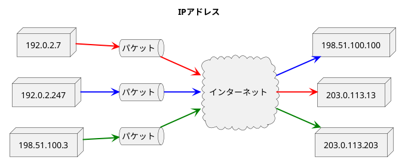

###　IPの基礎知識

- IPは①IPアドレス、②終点ホストまでのパケット配送(ルーティング)、③IPパケットの分割処理と再構築処理の3つの役割がある。
- TCP/IPで通信する**すべてのノード**(ホストやルータ)は**必ずIPアドレスを設定**しなければならない。
- IPアドレスはデータリンク層（イーサネット、無線LAN、PPPなど）の性質を抽象化し、パケットの**分割処理(フラグメンテーション)**と**再構築**を行うことで、IPより上の上位層に対してネットワークの細かい構造をマスクしている。

#### IPアドレスはネットワーク層のアドレス

- IPアドレスはネットワークに接続されているすべてのホストの中から通信を行う宛先を識別する時に使用する。

#### 経路制御(ルーティング)

- ルーティングは宛先IPアドレスのホストまでパケットを届けるための仕組みであり、ホップバイホップルーティングの方式で行われる。
- ネットワークが迷路のように複雑になっていたとしても経路制御により目的のホストまでルーティングされる。
- **1ホップはデータリンク層以下の機能、つまり送信元MACアドレスから宛先MACアドレスを使ってフレームが伝送される区間**であり、ブリッジやスイッチが1ホップの間に存在することはあっても、ルータやゲートウェイが存在することはない。
- 目的ホストを知らなくてもアドホック（行き当たりばったり）な方法であれば到達可能であるが現実的ではない。
- 目的ホストまでパケットを送るためにはルーティングテーブルと呼ばれる情報が必要であり、すべてのノード（ホストやルータ）はこのテーブルを持っている。ノードはルーティングテーブルを用いて宛先を判断し、次の転送処理を行う。

#### データリンクの抽象化

- データリンクごとに異なる性質として、MTU(Maximum Transmission Unit: 最大転送単位)があり、MTUを超えるパケットを送信する場合、送信側IPではフラグメンテーション(分割処理)を行い、受信側IPでは再構築を行う。

#### IPはコネクションレス型

- 機能の簡略化と高速化のために、<b>IP</b>はパケットを送信する前に通信相手との間にコネクションの確立をしない(<b>コネクションレス型</b>)。つまり、送信要求を受けたらすぐにデータを送信する。
- コネクション型の場合、以下の特徴を持つ
  1. コネクションを確立しなければパケットを送信できない。
  2. 確立していないホストからパケットが送られてくることはない。
- コネクションレス型の場合、以下の特徴を持つ
    1. いつでも・誰からでもパケットが送られてくる。
    2. パケットの取りこぼしなどの無駄な処理が起きる可能性がある。
- <b>IPは最善努力型(ベストエフォート)のサービスと呼ばれているが、「保証がない」という意味も含まれている。</b>例えば以下の通り。
  1. パケットの順番が入れ替わる
  2. パケットが宛先に届かない
  3. 途中でパケットが損失する
