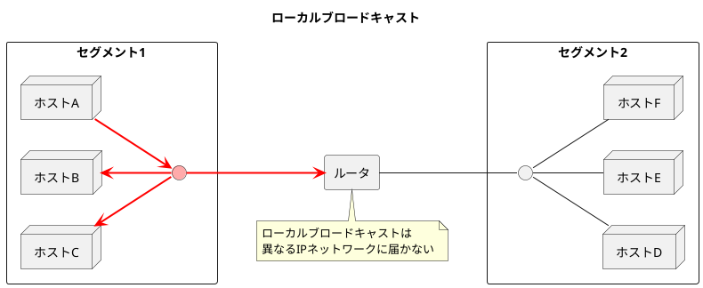
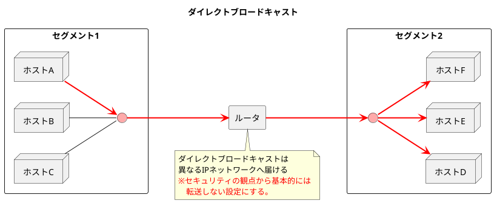
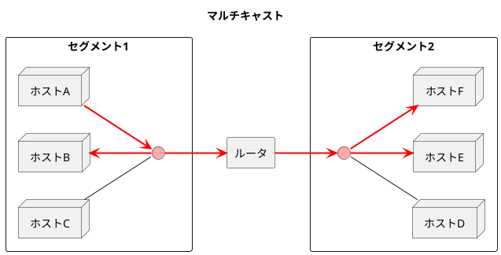
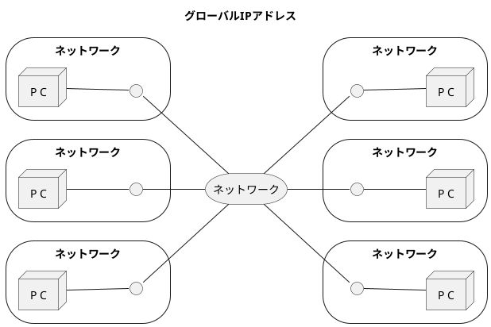
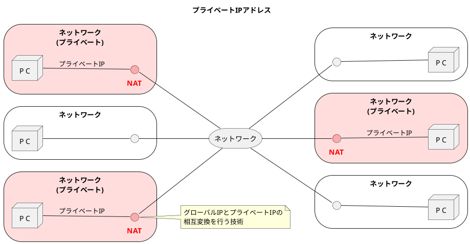

###　IPアドレスの基礎知識

- <b>インターネット通信をするためにはIPアドレスを適切に設定・管理・運用する必要がある。<font color=red>IPアドレスはTCP/IPにとって最も基本となる部分</font></b>
- ネットワーク部とホスト部は現在はサブネットマスクによって分けられているが、昔の名残でクラスの考え方が残っている機器やシステム、プロトコルが存在する。

#### IPアドレスとは

- IPアドレス(IPv4アドレス)は32ビット($=2^{32}=4,294,967,296≒43億$)で表現され、ノード(ホストやルータ)を識別するために用いられる。
- **通常、1つのIPアドレスは1つのNICに割り当てられるが、1つのNICに複数のIPアドレスを割り当てることも可能。ルータは複数のNICを持つ。**

```plantuml
title NICとIPアドレスの関係
left to right direction

node "P C" as pc1 {
    storage "NIC1\n192.168.0.2" as pc1_ip
}
note bottom of pc1
ホストには最低1つの
IPアドレスが付与可能。
end note
rectangle "ルータ" as router {
    storage "NIC1\n192.168.0.1" as router_ip1
    storage "NIC1\n192.168.1.1" as router_ip2
}
note bottom of router
ルータには2つ以上の
IPアドレスが付与可能。
end note
node "P C" as pc2  {
    storage "NIC1\n192.168.1.3\n192.168.1.2" as pc2_ip
}
note bottom of pc2
1つのNICに2つ以上の
IPアドレスも付与可能。
end note

pc1_ip -- router_ip1
router_ip1 -[hidden]- router_ip2
router_ip2 -- pc2_ip
```

#### IPアドレスのクラス

- クラスAは以下の特徴を持つ
  - 先頭1ビットが「0」で始まるIPアドレス。先頭8ビットがネットワーク部、下位24ビットがホスト部
  - IPアドレスの範囲は0.0.0.0〜127.255.255.255　<font color=red>※プライベートアドレスは10.0.0.0〜10.255.255.255(10/8)</font>
- クラスBは以下の特徴を持つ
  - 先頭2ビットが「10」で始まるIPアドレス。先頭16ビットがネットワーク、下位16ビットがホスト部
  - IPアドレスの範囲は128.0.0.0〜191.255.255.255　<font color=red>※プライベートアドレスは172.16.0.0〜172.31.255.255(172.16/12)</font>
- クラスCは以下の特徴を持つ
  - 先頭3ビットが「110」で始まるIPアドレス。先頭24ビットがネットワーク部、下位8ビットがホスト部
  - IPアドレスの範囲は192.0.0.0〜223.255.255.255　<font color=red>※プライベートアドレスは192.168.0.0〜192.168.255.255(192.168/16)</font>
- クラスDは以下の特徴を持つ
  - <b><font color=red>IPマルチキャスト通信に使われる</font></b>
  - 先頭3ビットが「1110」で始まるIPアドレス。先頭32ビットがネットワーク部
  - IPアドレスの範囲は224.0.0.0〜239.255.255.255

<table>
    <caption>クラスA</caption>
    <tr>
        <td>ネットワーク部8ビット</td>
        <td colspan=3>ホスト部24ビット</td>
    </tr>
    <tr>
        <th style="border:2px solid black;">「0」＋7ビット</th>
        <td style="border:2px solid black;">8ビット</td>
        <td style="border:2px solid black;">8ビット</td>
        <td style="border:2px solid black;">8ビット</td>
    </tr>
</table>
<table>
    <caption>クラスB</caption>
    <tr>
        <td colspan=2>ネットワーク部16ビット</td>
        <td colspan=2>ホスト部16ビット</td>
    </tr>
    <tr>
        <th style="border:2px solid black;">「10」＋6ビット</th>
        <td style="border:2px solid black;">8ビット</td>
        <td style="border:2px solid black;">8ビット</td>
        <td style="border:2px solid black;">8ビット</td>
    </tr>
</table>
<table>
    <caption>クラスC</caption>
    <tr>
        <td colspan=3>ネットワーク部24ビット</td>
        <td>ホスト部8ビット</td>
    </tr>
    <tr>
        <th style="border:2px solid black;">「110」＋5ビット</th>
        <td style="border:2px solid black;">8ビット</td>
        <td style="border:2px solid black;">8ビット</td>
        <td style="border:2px solid black;">8ビット</td>
    </tr>
</table>
<table>
    <caption>クラスD(IPマルチキャスト通信に使われる)</caption>
    <tr>
        <td colspan=4>ネットワーク部32ビット</td>
    </tr>
    <tr>
        <th style="border:2px solid black;"s>「1110」＋4ビット</th>
        <td style="border:2px solid black;">28ビット(グループ番号)</td>
    </tr>
</table>

#### ブロードキャストアドレスとIPマルチキャスト

- ブロードキャストにはローカルブロードキャストとダイレクトブロードキャストがある
  - **ローカルブロードキャスト**: 自身のリンク内のブロードキャストを指し、ネットワークアドレスが192.168.0.0/24でブロードキャストアドレスが192.168.0.255のようなケースが挙げられる。
  - **ダイレクトブロードキャスト**: 異なるIPネットワークへのブロードキャストを指し、ネットワークアドレスが192.168.0.0/24でブロードキャストアドレスが192.168.1.255のようなケースが挙げられる。ただし、<font color=red>ダイレクトブロードキャストはセキュリティ上の問題があるため、転送できないように設定されていることが多い</font>。
- **マルチキャストは特定グループに所属する全ホストにパケットを送信する通信であり、IPをそのまま利用する(＝コネクションレス型である) ため、信頼性は提供されない。**







<div style="page-break-before:always"></div>

<table>
    <caption>用途が決められている代表的なマルチキャストアドレス</caption>
    <tr>
        <th>アドレス</th>
        <th>内容</th>
    </tr>
    <tr>
        <td>224.0.0.1</td>
        <td>サブネット内の全<b>ノード</b></td>
    </tr>
    <tr>
        <td>224.0.0.2</td>
        <td>サブネット内の全<b>ルータ</b></td>
    </tr>
    <tr>
        <td>224.0.0.5</td>
        <td>OSPFルータ</td>
    </tr>
    <tr>
        <td>224.0.0.6</td>
        <td>OSPF指名ルータ</td>
    </tr>
    <tr>
        <td>224.0.0.9</td>
        <td>RIP2ルータ</td>
    </tr>
    <tr>
        <td>224.0.0.10</td>
        <td>EIGRPルータ</td>
    </tr>
    <tr>
        <td>224.0.0.11</td>
        <td>Mobile-Agents</td>
    </tr>
    <tr>
        <td>224.0.0.12</td>
        <td>DHCPサーバ/リレーエージェント</td>
    </tr>
    <tr>
        <td>224.0.0.13</td>
        <td>全PIM Routers</td>
    </tr>
    <tr>
        <td>224.0.0.14</td>
        <td>RSVP-ENCAPSULATION</td>
    </tr>
    <tr>
        <td>224.0.0.18</td>
        <td>VRRP</td>
    </tr>
    <tr>
        <td>224.0.0.22</td>
        <td>IGMP(Internet Group Management Protocol)</td>
    </tr>
    <tr>
        <td>224.0.0.251</td>
        <td>mDNS</td>
    </tr>
    <tr>
        <td>224.0.0.252</td>
        <td>Link-local Multicast Name Resolution</td>
    </tr>
    <tr>
        <td>224.0.0.253</td>
        <td>Teredo</td>
    </tr>
    <tr>
        <td>224.0.1.1</td>
        <td>NTP Network Time Protocol</td>
    </tr>
    <tr>
        <td>224.0.1.8</td>
        <td>SUN NIS + Information Service</td>
    </tr>
    <tr>
        <td>224.0.1.22</td>
        <td>Service Location (SVRLOC)</td>
    </tr>
    <tr>
        <td>224.0.1.33</td>
        <td>RSVP-encap-1</td>
    </tr>
    <tr>
        <td>224.0.1.34</td>
        <td>RSVP-encap-2</td>
    </tr>
    <tr>
        <td>224.0.1.35</td>
        <td>Directory Agent Discovery (SVRLOC-DA)</td>
    </tr>
    <tr>
        <td>224.0.2.2</td>
        <td>SUN RPC PMAPPROC CALLIT</td>
    </tr>
</table>

#### サブネットマスクとCIDRとVLSM

- **サブネットワークアドレス**は**クラスごとに決まるホスト部を分割する**仕組みであり、サブネットマスクとプレフィックスの2つの表記法がある。
- <b>CIDR(Classless InterDomain Routing)</b>は任意のビット長でIPアドレスを設定する考え方がある。
- 組織内の部署ごとにネットワークアドレス帳を変えられる仕組みとしてVLSM(Variable Length Subnet Mask)がある。

| 表記法 | IPアドレス | サブネットマスク | ネットワークアドレス | ブロードキャストアドレス |
| - | - | - | - | - |
| サブネットマスク表記法 | 172.20.100.52 | 255.255.255.192 | 172.20.100.0 | 172.20.100.63 |
| プレフィックス表記法 | 172.20.100.52/28 | ー | 172.20.100.0/28 | 172.20.100.63/28 |

| 内容 | 目的 |
| -- | -- |
| サブネットワークアドレス | クラスごとのホスト部を分割し、複数の物理ネットワークに分割する。 |
| CIDR | 複数のクラスアドレスを1つのネットワークにまとめる |
| VLSM | 1つのネットワークを複数のサブネットに分割する。 |

#### グローバルアドレスとプライベートアドレス

- 現在は「インターネットと接続するルータ（ブロードバンドルータ）」や「インターネットに公開するサーバ」に対してグローバルIPを設定することが一般的である。
- プライベートIPアドレスはNATなどを介してインターネット通信する方法が一般的である。
<font color=red><b>※アプリケーションヘッダやデータ部分でIPアドレスやポート番号を通知するようなアプリの場合、そのままではうまく通信できない。</b></font>





#### グローバルIPアドレスは誰が決める

- グローバルIPアドレスは**全世界的にはICANN**で管理されている。**日本国内ではJPNIC**がグローバルIPアドレスの割り当て期間として活動している。
- IPアドレスの申請はISPを経由する場合とJPNICに直接申請する場合がある
  - **ISPを経由する場合**: ISPで経路情報が集約可能なPA(Provider Aggregatable)アドレスが割り当てられる。そのため、**ISPが変わるたびにIPアドレスの変更(リナンバリング)が必要**になる。
  - **直接JPNICに申請する場合**: PI(Provider Independent)アドレスというISP非依存のIPアドレスが割り当てられ、これは**ISPを変更してもIPアドレスを変更する必要はない**。しかし、ISPで経路情報の集約ができないためBGPで経路情報を広告する必要があり、**ルータの負荷や管理コストを増加させてしまう**。
- ネットワーク情報から組織や管理者の連絡先を知るための方法としてWHOISがある。<font color=red><b>WHOIS</b>はIPアドレス、AS番号、ドメイン名の割り当てや登録管理者に関する情報を検索できるようにしているサービス</font>である。
  - https://www.nic.ad.jp/ja/whois/ja-gateway.html
  - https://whois.jprs.jp/
