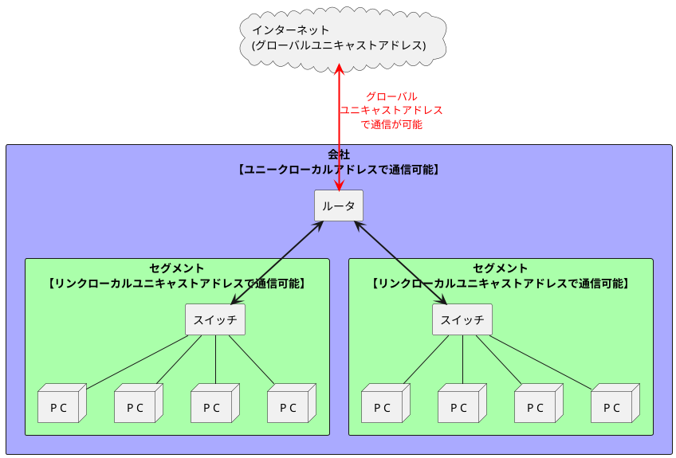

###　IPv6（IP version 6）

- <font color=red>IPv6はIPv4アドレスの枯渇問題を根本的に解決するために標準化されたインターネットプロトコル。</font>
- **IPトンネリング**や**プロトコル変換**などIPv4とIPv6で相互に通信できる互換性を持たせる努力が行われている。

#### IPv6の特徴

- IPv6の特徴
  - 16オクテット(128ビット)の長さ ※IPv4は4オクテット(32ビット)
  - **IPアドレスの拡大と経路制御表の集約**: IPアドレスをインターネットに適した階層構造にし、経路制御表ができるだけ大きくならないようにする。
  - **パフォーマンス向上**: ①ルータの負荷を減らすために、ヘッダ長を固定し(40オクテット)、ヘッダチェックサムを省くことでヘッダ構造を簡素化する。②経路MTU探索を用いることによりルータに分割処理をさせない
  - **プラグ&プレイ機能を必須にする**: DHCPサーバがない環境でもIPアドレスを自動的に割り当てる
  - **認証機能や暗号化機能を採用する**: IPアドレスの偽造に対するセキュリティ機能の提供や、盗聴防止機能を提供する(IPSec)
  - **マルチキャスト、Mobile IPの機能をIPv6の拡張機能として定義**: IPv4では運用が難しかったマルチキャストやMobile IPがIPv6ではスムーズに運用できることが見込まれる。

#### IPv6でのIPアドレスの表記方法

1. IPv6は128ビット長であり、IPアドレスを16ビットごとに「:(コロン)」で区切る。
2. 16ビットで区切った値を16進数に変換する
3. 変換後、0が2つ以上連続して続く場合は0を省略できる(省略する箇所は1箇所しか許されない)

```json
// 例1
1111111011011100:1011101010011000:0111011001010100:0011001000010000:
1111111011011100:1011101010011000:0111011001010100:0011001000010000
↓16進数変換
FEDC:BA98:7654:3210:FEDC:BA98:7654:3210

// 例2
0001000010000000:0000000000000000:0000000000000000:0000000000000000:
0000000000001000:0000100000000000:0010000000001100:0100000101111010
↓16進数変換
1080:0:0:0:8:800:200C:417A
↓0の省略
1080::8:800:200C:417A
```

<div style="page-break-before:always"></div>

#### IPv6アドレスのアーキテクチャ

- IPv6では、IPアドレスの先頭のビットパターンでIPアドレスの種類を区別する。
  - **グローバルユニキャストアドレス**: インターネットを介した通信で使用されるアドレス。インターネット内で一意(ユニーク)に決まるアドレスで正式に割り当てを受けたIPアドレスと使う必要がある。
  - **ユニークローカルアドレス**: 制御系ネットワークなどのインターネットと通信しないプライベートネットワークで使用されるアドレス。アルゴリズムに従い乱数を用いて生成される。IPv4のプライベートアドレスと同じように自由に使うことが可能。
  - **リンクローカルユニキャストアドレス**: ルータがないネットワークなど、イーサネットの同一セグメント内だけで通信するときに使用されるアドレス。
- <font color=red>IPv6では1つのNICに複数同時にIPアドレス(グローバルユニキャスト/ユニークローカル/リンクローカルユニキャスト)を割り当てることが可能であり、必要に応じて使い分ける。</font>



<table>
    <caption>IPv6のアドレスアーキテクチャ</caption>
	<tbody>
		<tr>
			<th>未定義</th>
			<td>0000...0000(128ビット)</td>
			<td>::/128</td>
		</tr>
		<tr>
			<th>ループバックアドレス</th>
			<td>0000.0001(128ビット)</td>
			<td>::1/128</td>
		</tr>
		<tr>
			<th>ユニークローカルアドレス</th>
			<td>1111 110 *</td>
			<td>FC00::/7</td>
		</tr>
		<tr>
			<th>リンクローカルユニキャストアドレス</th>
			<td>1111 1110 10 *</td>
			<td>FE80::/10</td>
		</tr>
		<tr>
			<th>マルチキャストアドレス</th>
			<td>1111 1111 *</td>
			<td>FF00::/8</td>
		</tr>
		<tr>
			<th>グローバルユニキャストアドレス</th>
			<td colspan=2>上記以外全部</td>
		</tr>
	</tbody>
</table>

<div style="page-break-before:always"></div>

#### グローバルユニキャストアドレス

- <font color=red>全世界で一意に決まるアドレスという意味をもち、インターネットや組織内の通信など最も一般的に利用されるIPv6のアドレス</font>
- IPv6のネットワーク部とホスト部はそれぞれ64ビットであり、ネットワーク部はグローバルルーティングプレフィックスとサブネットIDに分けられる。
- 通常、ホスト部にはMACアドレスを元にした値が格納されるが、MACアドレス(機器固有の情報)を通信相手に知られたくないケースを考慮し、「一時アドレス」と呼ばれる乱数を用いたMACアドレスとは無関係な値を生成されることもある。MACアドレスを元にした値になるか、一時アドレスになるかはOSの実装や設定による。


#### リンクローカルユニキャストアドレス

- <font color=red>データリンクの同一リンク内で一意に決まるアドレスという意味をもち、ルータを介さない通信で使用される。</font>
- 通常、ホスト部には64ビット版のMACアドレスが格納される。


#### ユニークローカルアドレス

- インターネットとの通信を行わない場合に利用されるアドレス
- ユニークローカルアドレスは以下のケースを想定している。
  - 機械制御などの制御系ネットワークや金融機関などの感情系ネットワークなど、インターネットとの通信を想定していない環境
  - セキュリティを高めるためにNATやゲートウェイ(プロキシ)経由で通信する企業内のネットワーク
- 企業合併や業務統合などによりネットワーク同士を接続する可能性があるため、できるだけ一意になるようにグローバルIDを乱数で決定する。


#### IPv6での分割処理

- ルータの負荷を減らし高速なインターネットを実現するために、IPv6では分割処理は始点ホストでのみ行われる。
- <font color=red>IPv6では経路MTU探索はほぼ必須機能となっている。</font>
- IPv6では最小MTUが1280オクテットと決められており、組み込みシステムなどシステムリソース(CPUやメモリ)に制限がある場合、経路MTU探索を実装せずにIPパケット送信時に1280オクテット単位で分割してから送信しても良いことになっている。
