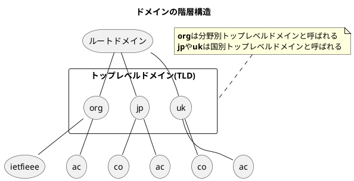

###　DNS（Domain Name System）

- DNSはローマ字とピリオドを使った名前からIPアドレスへと自動的に変換する。IPv4とIPv6の両方で利用できる。
- <b>hostsファイルと呼ばれるデータベースファイルがホスト名とIPアドレスの対応を可能</b>にし、DNSがホスト名とIPアドレスの対応関係を効率的に管理する。

#### ドメイン名の構造

- ドメイン名とは、ホスト名や組織名を識別するための階層的な名前のこと。
- ドメイン名は長い間ASCII文字しか使えなかったが、現在では日本語などの多国語にも対応している。

#### ネームサーバとリゾルバ

- ネームサーバとは階層(jpやorgなど)のドメイン名を管理しているホストやソフトウェアのことであり、管理する階層のことをゾーンと呼ぶ。
- リゾルバ(Resolver)とはDNSに問い合わせを行うホストやソフトウェアである。リゾルバは最低1つ以上のネームサーバのIPアドレスを知らなければならない。通常は組織内のネームサーバのIPアドレスを登録する。
- **全てのネームサーバにはルートネームサーバのIPアドレスを登録しなければならない**。ルートネームサーバのIPアドレスの最新情報は以下のURLである。
  - https://www.internic.net/zones/named.root
- ネームサーバがダウンするとドメインに対するDNSの問い合わせができなくなるため、耐障害性を向上されるために通常がは2つ以上のネームサーバを設置することになっている。
- それぞれのドメインの階層ごとにネームサーバが配置される。
- それぞれのネームサーバは下の階層のネームサーバのIPアドレスを知っており、ルートネームサーバから木構造のように結ばれている。
- 全てのネームサーバはルートネームサーバのIPアドレスを知っているため、ルートから順番に世界中のネームサーバにアクセスできる。

#### DNSによる問合せ

- 通常、DNSの問い合わせ、および応答はUDPを使って行われる。しかし、DNSのメッセージ帳は512バイト以下に制限されており、IPv6などを使うとこれを超える可能性が大きくなるため、EDNS0(Extension mechanisms for DNS)と呼ばれるメカニズムを使って、TCPで問い合わせ処理がやり直される。
- **リゾルバやネームサーバは、パケットの往復時間（ラウンドトリップ時間）を短縮することを目的にある程度の情報をしばらくの間キャッシュする。**
- クライアント(pepper)のリゾルバがwww.ietf.orgと通信したい場合の問い合わせ処理は以下の手順で行われる。
  1. クライアント(pepper)がkusaのDNSサーバにwww.ietf.orgのIPアドレスを問い合わせる
  2. kusaのDNSサーバはwww.ietf.orgのIPアドレスを知らないため、ルートネームサーバにwww.ietf.orgのIPアドレスを問い合わせる。ルートネームサーバはorgのネームサーバのIPアドレスを知っているため、そのアドレスを返す。
  3. kusaのDNSサーバはorgのDNSサーバにwww.ietf.orgのIPアドレスを問い合わせる。orgのDNSサーバはietf.orgのIPアドレスを知っているため、そのアドレスを返す。
  4. kusaのDNSサーバはietfのDNSサーバにwww.ietf.orgのIPアドレスを問い合わせる。ietfのDNSサーバはwww.ietf.orgのIPアドレスを知っているため、そのアドレスを返す。
  5. kusaのDNSサーバはクライアントのリゾルバにwww.ietf.orgのIPアドレスを返す。
  6. クライアントとwww.ietf.orgとの間で通信が開始される。

#### DNSはインターネットに広がる分散データベース

- DNSはホスト名とIPアドレスの対応（Aレコード）だけでなく、その逆（IPアドレスからホスト名）の対応情報（PTRレコード）も管理しており、そのほか様々な情報を管理している。

<table>
    <caption>DNSの主なレコード</caption>
    <tr>
        <th>タイプ</th>
        <th>番号</th>
        <th>内容</th>
    </tr>
    <tr>
        <td>A</td>
        <td>1</td>
        <td>ホストのIPアドレス(IPv4)</td>
    </tr>
    <tr>
        <td>NS</td>
        <td>2</td>
        <td>上位や下位のネームサーバのIPアドレスの対応情報</td>
    </tr>
    <tr>
        <td>CNAME</td>
        <td>5</td>
        <td>ホストの別名に対する正式名</td>
    </tr>
    <tr>
        <td>SOA</td>
        <td>6</td>
        <td>ゾーン内の登録データの開始マーク</td>
    </tr>
    <tr>
        <td>WKS</td>
        <td>11</td>
        <td>ウェルノウンサービス(Well Known Service)</td>
    </tr>
    <tr>
        <td>PTR</td>
        <td>12</td>
        <td>IPアドレスの逆引き用のポインタ</td>
    </tr>
    <tr>
        <td>HINFO</td>
        <td>13</td>
        <td>ホストに関する追加の情報</td>
    </tr>
    <tr>
        <td>MINFO</td>
        <td>14</td>
        <td>メールボックスやメーリングリストの情報</td>
    </tr>
    <tr>
        <td>MX</td>
        <td>15</td>
        <td>メールアドレスとそのメールを受信するメールサーバのホスト名</td>
    </tr>
    <tr>
        <td>TXT</td>
        <td>16</td>
        <td>テキスト文字列</td>
    </tr>
    <tr>
        <td>SIG</td>
        <td>24</td>
        <td>セキュリティの署名</td>
    </tr>
    <tr>
        <td>KEY</td>
        <td>25</td>
        <td>セキュリティの鍵</td>
    </tr>
    <tr>
        <td>GPOS</td>
        <td>27</td>
        <td>地理的な位置</td>
    </tr>
    <tr>
        <td>AAAA</td>
        <td>28</td>
        <td>ホストのIPv6アドレス</td>
    </tr>
    <tr>
        <td>NXT</td>
        <td>30</td>
        <td>次のドメイン</td>
    </tr>
    <tr>
        <td>SRV</td>
        <td>33</td>
        <td>サーバの選択</td>
    </tr>
    <tr>
        <td>*</td>
        <td>255</td>
        <td>全てのレコードの要求</td>
    </tr>
</table>