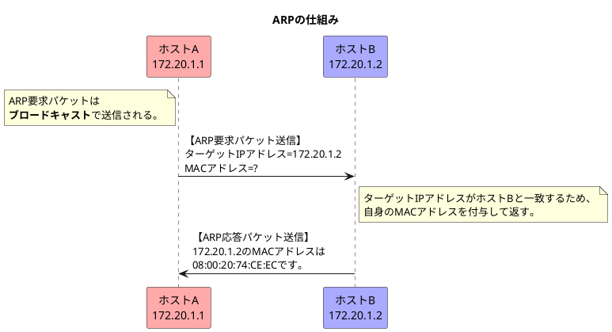

###　ARP（Address Resolution Protocol）

- ARPは宛先IPアドレスから次にパケットを受け取るべき機器のMACアドレスを知りたいときに利用する。宛先ホストが同一リンク上にない場合には次のホップのルータにのMACアドレスをARPで調べることになる。
**※ARPはIPv4でのみ利用され、IPv6では利用されず、代わりにICMPv6の近接探索メッセージが利用される**
- ARPはARP要求パケットとARP応答パケットの2種類のパケットを利用してMACアドレスを取得する。

#### ARPの仕組みとARPのパケットフォーマット(データ部分)

#### RARP(Reverse ARP)

- <b>RARPはARPの逆でMACアドレスからIPアドレスを取得するプロトコルであり、ネットワーク上の外部記憶装置を持たないデバイスが起動時に自身のIPアドレスを取得するときに利用する。</b>
- <b>RARPを使う場合はRARPサーバが必要であり、RARPサーバに機器のMACアドレスとその機器につけるIPアドレスを設定する。</b>
- 組込機器において、①IPアドレスの入力I/Fがない、②DHCP非対応、③DHCPで動的にIPアドレスを設定されては困るなどの時にRARPを利用する。

#### GARP(Gratutious ARP)

- <b>自身のIPアドレスに対するMACアドレスを取得するプロトコルであり、①IPアドレスの重複を確認するときや②スイッチングハブなどのMACアドレスの学習テーブル(ARPキャッシュ)を更新させるときに利用する。</b>
※gratutiousは「謂れのない」や「無料の」という意味を持つ
- 「このIPアドレスを使っている機器のMACアドレスを教えてください。」というARP要求パケットを送信して確認する。
