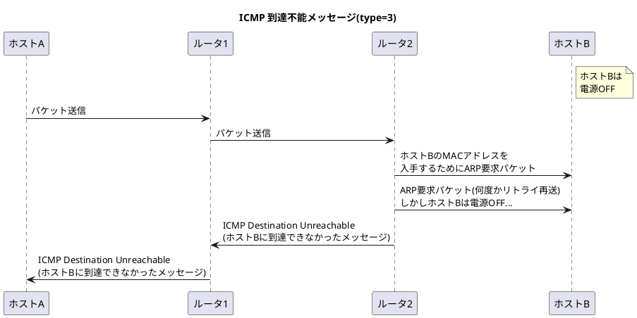
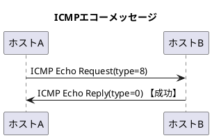

###　ICMP（Internet Control Message Protocol）

- ICMPはネットワークが正常か異常かを判別し、トラブルシューティングを楽にするためにさまざまな機能を提供している。
  1. IPパケットが目的ホストまで届いているかどうかの確認機能
  2. IPパケットが廃棄されたときの原因通知機能
  3. 設定不十分な箇所をよりよくするための設定変更機能

#### IPを補助するICMP

- ICMPには大きく2つのメッセージがある。
  - エラー通知のためのエラーメッセージ
  - 診断などを問い合わせるメッセージ

<table>
    <caption>ICMPメッセージのタイプ</caption>
    <tr>
        <th>タイプ(10進数)</th>
        <th>内容</th>
    </tr>
    <tr>
        <td>0</td>
        <td>エコー応答(Echo Reply)</td>
    </tr>
    <tr>
        <td>3</td>
        <td>到達不能(Destination Unreachable)</td>
    </tr>
    <tr>
        <td>5</td>
        <td>リダイレクト(Redirect)</td>
    </tr>
    <tr>
        <td>8</td>
        <td>エコー要求(Echo Request)</td>
    </tr>
    <tr>
        <td>9</td>
        <td>ルータ広告(Router Advertisement)</td>
    </tr>
    <tr>
        <td>10</td>
        <td>ルータ請願(Router Solicitation)</td>
    </tr>
    <tr>
        <td>11</td>
        <td>時間超過(Time Exceeded)</td>
    </tr>
    <tr>
        <td>12</td>
        <td>パラメータ異常(Parameter Problem)</td>
    </tr>
    <tr>
        <td>13</td>
        <td>タイムスタンプ要求(Timestamp)</td>
    </tr>
    <tr>
        <td>14</td>
        <td>タイムスタンプ応答(Timestamp Reply)</td>
    </tr>
    <tr>
        <td>42</td>
        <td>拡張エコー要求(Extended Echo Request)</td>
    </tr>
    <tr>
        <td>43</td>
        <td>拡張エコー応答(Extended Echo Reply)</td>
    </tr>
</table>

#### 主なICMPメッセージ

##### ICMP 到達不能メッセージ(Type=3)



<table>
    <caption>ICMP到達不能メッセージ</caption>
    <tr>
        <th>コード番号</th>
        <th>ICMP 到達不能メッセージ</th>
    </tr>
    <tr>
        <td>0</td>
        <td>ネットワーク到達不能(Network Unreachable)</td>
    </tr>
    <tr>
        <td>1</td>
        <td>ホスト到達不能(Host Unreachable)</td>
    </tr>
    <tr>
        <td>2</td>
        <td>プロトコル到達不能(Protocol Unreachable)</td>
    </tr>
    <tr>
        <td>3</td>
        <td>ポート到達不能(Port Unreachable)</td>
    </tr>
    <tr>
        <td>4</td>
        <td>分割処理が必要だが、分割禁止フラグが設定されている。<br>(Fragmentation Needed and Don't Gragment was Set)</td>
    </tr>
    <tr>
        <td>5</td>
        <td>ソースルートに失敗(Source Route Failed)</td>
    </tr>
    <tr>
        <td>6</td>
        <td>宛先ネットワーク不明(Destination Network Unknown)</td>
    </tr>
    <tr>
        <td>7</td>
        <td>宛先ホスト不明(Destination Host Unknown)</td>
    </tr>
    <tr>
        <td>8</td>
        <td>送信元ホストは孤立している(Source Host Isolated)</td>
    </tr>
    <tr>
        <td>9</td>
        <td>宛先ネットワークとの通信は管理上禁止<br>(Communication with Destination Network is Administratively Prohibited)</td>
    </tr>
    <tr>
        <td>10</td>
        <td>宛先ホストとの通信は管理上禁止<br>(Communication with Destination Host is Administratively Prohibited)</td>
    </tr>
</table>

- <font color=red>IPルータがIPデータグラムを宛先に配送できない時のメッセージ</font>
- よく発生するエラーコードは0(ネットワーク到達不能)と1(ホスト到達不能)である。
- コード4は経路MTU探索(4.5.3節)で使われる。

##### ICMP リダイレクトメッセージ(Type=5)

- <font color=red>送信元ホストが最適ではない経路を使用していることをルータが検出したときのメッセージ。</font>ルータがホストよりも良い経路情報を持っている場合に動作する。
- ただし、<b>リダイレクトメッセージを送信するルータの経路制御表がおかしい場合、正しく機能しない</b>ため、そもそもリダイレクトメッセージが動作しないように設定されている場合もある。

##### ICMP エコーメッセージ(Type=0,8)

- <font color=red>通信したいホストやルータなどにIPパケットが到達するか確認したい時に利用されるメッセージ</font>。<b>`ping`</b>コマンドがこのメッセージを使用している。
- ICMPエコー要求メッセージ(Type=8)を送信し、相手先ホストからICMPエコー応答メッセージ(Type=0)が返ってくれば到達可能と判断できる。



```bash
$ ping -c 4 www.google.com
PING www.google.com (172.217.25.164): 56 data bytes
64 bytes from 172.217.25.164: icmp_seq=0 ttl=116 time=29.666 ms
64 bytes from 172.217.25.164: icmp_seq=1 ttl=116 time=32.794 ms
64 bytes from 172.217.25.164: icmp_seq=2 ttl=116 time=39.537 ms
64 bytes from 172.217.25.164: icmp_seq=3 ttl=116 time=28.856 ms

--- www.google.com ping statistics ---
4 packets transmitted, 4 packets received, 0.0% packet loss
round-trip min/avg/max/stddev = 28.856/32.713/39.537/4.205 ms
```

##### ICMP ルータ探索メッセージ(Type=9,10)

- <font color=red>自分が繋がっているネットワークのルータを見つけたいときに利用されるメッセージ</font>。
- ホストがICMP請願メッセージ(Type=10)を送信すると、ルータはICMPルータ広告メッセージ(Type=9)を返す。

<div style="page-break-before:always"></div>

##### ICMP 時間超過メッセージ(Type=11)

- <b><font color=red>TTLが0になったときのメッセージ</font>。タイプ11のコード0で送信元に送り返し、パケットが破棄されたことを通知する。</b>
- <b>分割したパケットの再構築処理がタイムアウトした時</b>はコード1が送られる。
- ICMP時間超過メッセージをうまく応用したアプリケーションに<b>`traceroute`</b>がある。これはプログラムを実行したホストから特定の宛先ホストに到達するまでに、どのようなルータが通過するのかを表示してくれるプログラムである。
  1. IPの生存時間TTLを1から順番に増やしながらUDPパケットを送信する
  2. ICMP時間超過メッセージを無理やし返させながら、通過するルータのIPアドレスを1つずつ取得する。

```bash
$ traceroute 172.217.161.228
traceroute to 172.217.161.228 (172.217.161.228), 64 hops max, 40 byte packets
 1  192.168.0.1 (192.168.0.1)  11.301 ms  3.841 ms  3.283 ms
 2  125-8-8-1.rev.home.ne.jp (125.8.8.1)  9.198 ms  14.786 ms  19.926 ms
 3  10.1.194.196 (10.1.194.196)  23.552 ms  32.953 ms  25.500 ms
 4  172.25.26.25 (172.25.26.25)  18.216 ms  18.817 ms  24.383 ms
 5  10.1.15.113 (10.1.15.113)  19.096 ms  31.429 ms  22.470 ms
 6  nfgw4-be4.dj-dc.zaq.ad.jp (61.26.74.186)  25.660 ms  16.561 ms
    nfgw3-be4.dj-dc.zaq.ad.jp (61.26.74.166)  30.625 ms
 7  142.250.162.246 (142.250.162.246)  21.710 ms
    220-152-46-46.rev.home.ne.jp (220.152.46.46)  20.380 ms
    142.250.162.246 (142.250.162.246)  18.801 ms
 8  108.170.255.229 (108.170.255.229)  25.690 ms
    192.178.110.81 (192.178.110.81)  21.120 ms
    108.170.255.229 (108.170.255.229)  15.342 ms
 9  64.233.175.247 (64.233.175.247)  17.664 ms
    64.233.174.193 (64.233.174.193)  26.327 ms
    64.233.175.247 (64.233.175.247)  20.620 ms
10  kix06s05-in-f4.1e100.net (172.217.161.228)  15.671 ms  25.963 ms  16.458 ms
```

##### ICMP 拡張エコーメッセージ(Type=42,43)

- <font color=red>pingで使われるICMPエコーメッセージ(Type=0,8)よりも便利な機能を実現するために定義されたメッセージ</font>。
- 機能としては以下の2つ
  - 複数のNICがある機器の管理を容易にするために、パケットの宛先ノードの別のインタフェースの状態を確認する機能
  - 指定した別のノードと通信可能かどうかを知るために、<b>ARPテーブルや近隣キャッシュ(5.4.3節参照)</b>の状態を確認する機能

<div style="page-break-before:always"></div>

#### ICMPv6

- <font color=red>IPv4のICMPはIPv4を補助する役割であり、ICMPがなくても通信は可能だが、<b>IPv6の場合はICMPv6がなければ通信ができない。</b></font>
- <font color=red>IPv6では、MACアドレスを調べるプロトコルがARP→ICMPの近隣探索メッセージ(Neighbor Discovery)に変更される。</font>
- 近隣探索メッセージはARPとICMPリダイレクト(type=5)、ICMPルータ選択メッセージなどの機能を組み合わせたものになっている。ただし、ICMPv6にはDNSサーバを通知する機能がないため実際には**ICMPv6はDHCPv6と組み合わせて使う必要がある**。
- ICMPv6はエラーメッセージと情報メッセージの2つに大別できる。
  - タイプ0〜127→エラーメッセージ
  - タイプ128〜255→情報メッセージ
- **ICMPv6のタイプ133〜137を近隣探索メッセージ**と呼び、IPv6の通信で重要な役割を担う。
  - **タイプ133と134**: ルータがある環境において、ルータからIPv6アドレスのの上位ビットの情報を取得するために利用。下位ビットはMACアドレスを設定する。
  ※DHCPサーバがない環境下でもIPアドレスを自動設定する機能
  - **タイプ135と136(≒ARP)**: IPv6アドレスとMACアドレスの対応関係を調べるときに利用。<u>IPv6のマルチキャストアドレスを使用して送信</u>する。

<table>
    <caption>ICMPv6のエラーメッセージ</caption>
    <tr>
        <th>タイプ(10進数)</th>
        <th>内容</th>
    </tr>
    <tr>
        <td>1</td>
        <td>終点到達不能(Destination Unreachable)</td>
    </tr>
    <tr>
        <td>2</td>
        <td>パケット過大(Packet Too Big)</td>
    </tr>
    <tr>
        <td>3</td>
        <td>時間超過(Time Exceeded)</td>
    </tr>
    <tr>
        <td>4</td>
        <td>パラメータ問題(Parameter Problem)</td>
    </tr>
</table>

<table>
    <caption>ICMPv6の情報メッセージ</caption>
    <tr>
        <th>タイプ(10進数)</th>
        <th>内容</th>
    </tr>
    <tr>
        <td>128</td>
        <td>エコー要求メッセージ(Echo Request)</td>
    </tr>
    <tr>
        <td>129</td>
        <td>エコー応答メッセージ(Echo Reply)</td>
    </tr>
    <tr>
        <td><b>133</td>
        <td><b>ルータ要請メッセージ(Router Solicitation)</td>
    </tr>
    <tr>
        <td><b>134</td>
        <td><b>ルータ告知メッセージ(Router Advertisement)</td>
    </tr>
    <tr>
        <td><b>135</td>
        <td><b>近隣要請メッセージ(Neighbor Solicitation)</td>
    </tr>
    <tr>
        <td><b>136</td>
        <td><b>近隣告知メッセージ(Neighbor Advertisement)</td>
    </tr>
    <tr>
        <td><b>137</td>
        <td><b>リダイレクトメッセージ(Redirect Message)</td>
    </tr>
    <tr>
        <td>141</td>
        <td>逆近隣探索要請メッセージ<br>(Inverse Neighbor Discovery Solicitation)</td>
    </tr>
    <tr>
        <td>142</td>
        <td>逆近隣探索告知メッセージ<br>(Inverse Neighbor Discovery Advertisement)</td>
    </tr>
    <tr>
        <td>144</td>
        <td>ホームエージェントアドレス検出要求メッセージ<br>(Home Agent Address Discovery Request Message)</td>
    </tr>
    <tr>
        <td>145</td>
        <td>ホームエージェントアドレス検出応答メッセージ<br>(Home Agent Address Discovery Reply Message)</td>
    </tr>
    <tr>
        <td>148</td>
        <td>認証パス要請メッセージ<br>(Certification Path Solicitation Message)</td>
    </tr>
    <tr>
        <td>149</td>
        <td>認証パス告知メッセージ<br>(Certification Path Advertisement Message)</td>
    </tr>
    <tr>
        <td>157</td>
        <td>重複アドレス要求(Duplicate Address Request)</td>
    </tr>
    <tr>
        <td>160</td>
        <td>拡張エコー要求(Extended Echo Request)</td>
    </tr>
    <tr>
        <td>161</td>
        <td>拡張エコー応答(Extended Echo Reply)</td>
    </tr>
</table>
